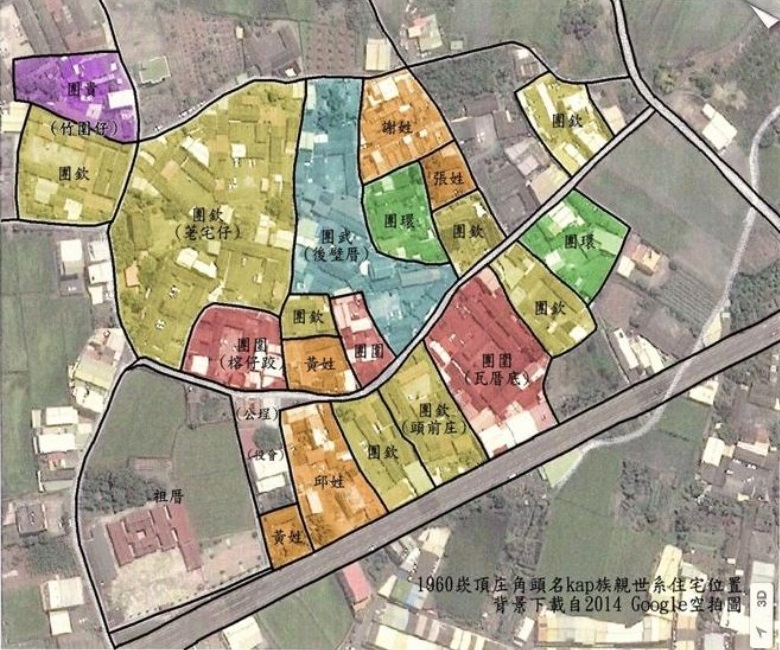
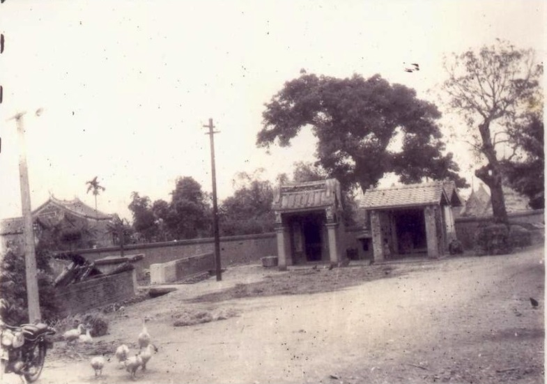

# 1. 出世背景
> **Chhut-sì Pōe-kéng**

## 1-1. Ī--ā ê DNA

> **2010/03：TBTS 台文通訊192期《Ī--ā ê DNA》**

Ī--ā tī我4歲koh 2個月時tō過身，所以對ī--ā ê身影一屑仔都無記智，少年時代也bē-hiáu詳細探問ī--ā在生ê形象生張抑是做人態度，阿爸、阿兄mā罕得講ī--ā ê故事hō͘我聽，koh無留kah半張相片，m̄-chiah到此當今對ī--ā ê印象kan-nā有「人躼躼，真有量，歡喜kā人tàu跤手，月內中感--著來過身」niâ。

是最近為著整理房仔內族親ê家譜，去戶政事務所申請戶籍謄本，ùi日本時代申請到現此時，mā拜托ī--ā後頭叔伯表小弟申請1份做參考。1895年日本佔領台灣，隔轉年開始戶口調查，到1906年開始本籍登記，記錄真詳細，出生年月日、死亡年月日、住址、族別、妻妾、職業、縛跤…等等；分--ê、養--ê，娶啥人ê查某囝、嫁去tó位、啥物日子結婚…lóng記kah清清楚楚，是瞭解祖先上讚ê資料。

看戶籍謄本才了解，ī--ā一生歹命，出世人屘仔查某囝，頂有3个大兄1个大姊，出世才2歲，老父tō過身，老母守寡2年後koh招翁配婿，後叔食鴉片無責任，tō hō͘ in老母趕出門，守寡ê老母boeh khîⁿ 5个囝，實在艱苦代，ko͘-put-lī-chiong kā ī--ā分（pun）hō͘蕭--家做新婦仔，hit年ī--ā已經7歲，分--人ê囡仔khiap性命，知食知做tō無tī-tāi，按怎過日我是無了解，等到18歲hit年tō kap阿爸sak做堆（結房）。斯當時阮兜是阿媽leh hoāⁿ家，阿爸計畫khang-khoè m̄是kài gâu，一切聽阿媽發落，hó-ka-chài ī--ā有量、kut-la̍t，kap阿爸koh是仝庄人，才無hō͘阿媽苦毒。Ī--ā kap阿爸結婚了後，隔轉年tō生大兄，然後2年1个，5年2个，總共生6个後生3个查某囝，tī boeh生上細漢查某囝進前，因為破病染著ban-á-lí-á（瘧疾），soà tī月內中kap細漢小妹相chhoā走，hit年，ī--ā 42歲，我5歲。

為著boeh koh-khah瞭解阿爸、阿公、阿祖年代ê真實歷史，taⁿ，kap我kāng-iân--ê mā chiah chhun 6个，siōng-chē歲ê Chiu-á兄加我11歲，知影ê故事真濟，頂禮拜專工去chhoē伊hap-sian phò-tāu，開講點外鐘久，伊o-ló小弟gâu，bat代誌bē誇口，有量koh惜情，kap ī--ā仝一樣。

「Chiu-á兄，我應該較sêng老父chiah-tio̍h。」

「你ê體型有影sêng阿叔，m̄-koh你ê性素kài-sêng阿嬸。」

「按怎講？」

「Lín阿爸、ī--ā我lóng叫伊阿叔、阿嬸。」「阿嬸tī--leh時，我已經10 thóng歲，咱是大內底，人濟 話tō濟，較早ê人khah gâu相罵冤家，尤其是阿姆、阿嬸、阿嫂、細姑，lóng mā會罵來罵去tak來tak去，單單阿嬸bē kap人冤家，mā bē to-toan生話。」

「Che我lóng m̄-bat聽--過！」

「Iáu-ū，hit-chūn阿嬸hō͘一个阿姆欺負kah足thiám--ê，伊mā bē計較。」

「人問伊講你ná m̄ kap伊計較，kā伊罵倒轉去。」

「阿嬸soà án-ni講：人我也bē-hiáu kap人按怎冤家--à！boeh罵hō͘伊罵，boeh詈hō͘伊詈，也bē按怎--ā！」

「Chiu-á兄，有影án-ni--hio͘h！」

「當然mā有影，hit-chūn我10外歲，已經真bat代誌--à。」

原來ī--ā tō是chiah-nì慈悲有量，敢會是新婦仔命造成？看叔伯表小弟整理ê陳--家家譜，外祖（tō是ī--ā ê阿公）是平埔族來hō͘蕭--家（kap阮蕭--家是幾若代前ê宗親）死翁ê寡婦招--ê，平埔族ê DNA傳（thn̂g）hō͘ ī--ā，ī--ā chiah-koh thn̂g hō͘阮兄弟姊妹，莫怪阮一家人lóng古意、條直，bē kap人poé-hoē oan-ke-lô-chè。會記得我細漢時，tō kap人真好tàu-tīn，m̄-bat罵--人，bē-hiáu kap人冤家，有一pái不得已hō͘同學迫kah著冤家sio-phah，結果我kā同學ji̍h-tiàm塗跤兜，足久足久m̄敢kā phah落去，歸尾我kā伊求和mài koh冤家，伊猶原m̄肯，soà提石頭khian--我。Iáu-koh有一pái，叔伯阿兄ê後生chhoē我麻煩，伊soà罵我「kàn-lín-niâ…」，害我m̄知boeh按怎kā伊罵--轉去。大漢出社會，做43年老師，mā bat kā人補習過，tō是m̄敢誤人子弟，hit種灌水、造假ê khong-khám步數從來m̄敢做，甘願hō͘人嫌，mā m̄肯違背良心。

Chiu-á兄o-ló我「gâu，bat代誌bē誇口，有量koh惜情，kap ī--ā仝一樣。」其實阿兄阿姊mā lóng kap ī--ā仝款，有量koh惜情bē誇口，可惜阿兄in無讀過冊，免不了kap人交陪講話會較土直。是阿兄栽培我加讀一寡冊，較bat一寡做人ê表面道理，m̄-chiah ē hō͘ Chiu-á兄o-ló。
Ī--ā kap我緣份淺，俗緣4冬外，但是hō͘我ê DNA影響我一世人，巧氣、樂觀、惜情、慈悲lóng-sī優良DNA。感謝ī--ā hō͘我一粒善良ê心，bē kap人計較，bē kap人冤家，甘願付出hō͘社會，hō͘我真正得著快樂人生，歡歡喜喜過日。

Ī--ā！感謝--你！感謝你ê DNA。 Lah-jih 2010-03-23

## 1-2. 19470820 阿媽
> **19470820 A-má**

阿媽姓陳名甜，1876年（光緒2年/明治9年）12月12日生~1947年（昭和22年）8月20日（農曆7月5日/丁亥年戊申月辛未日）痚呴喘往生，陽壽72歲，農民曆忌日是7月5日。 南投廳武東堡井仔頭庄（南投縣赤水），陳古、陳謝氏字參女，陳瑞憲小妹。1892年（光緒18年/ 明治25年）6月20日（17歲） kap蕭慶鳳結婚。不識字。家庭管理。

根據頂面戶籍謄本資料，阿媽是清國人，1895年清日戰爭chiah換做日本人，Lah-jih是昭和16年出世，kap阿媽緣份chiah足足6年久niâ，薄薄記智中kan-nā有阿媽過身搬舖（poaⁿ-pho͘）hit幕kap伊ê皮肉jiâu-jiâu瘦瘦ê形影，chhun--e 攏是聽--來-ê，阿媽若boeh tī--leh 已經136歲。

古早人早嫁娶，阿媽17歲tō嫁來崁頂庄做蕭--家新婦，阿祖 正養公、字文生，生2个後生，大囝慶麟生3个後生，二囝慶鳳結婚後一直無生，chiah kā伊大兄ê第三囝紹振過房傳嗣，所以慶鳳媽陳阿甜pún-chiâⁿ著叫嬸婆，因為阿爸thn̂g伊做囝，阮做伊ê孫當然tio̍h叫伊阿媽，慶麟媽陳氏選pún-chiâⁿ是阿媽soah pìⁿ-chiâⁿ伯婆（姆婆），不過阮猶是叫阿公、阿媽，若boeh稱呼時，chiah講公--ê ê阿公、阿媽，私--ê ê阿公、阿媽做分別。

阿公加阿媽11歲，結婚時阿公28歲、阿媽 17歲，結婚29冬阿公tō往生，hit年阿公57歲阿媽46歲，阿媽tī 72歲因為痚呴喘往生。

阿公過身hit年，阿爸20歲，大兄tăⁿ出世3個月，hit當時ê阿媽實在苦憐代，hó-ka-chài有giám-ngē ê新婦（ī--ā）tàu khîⁿ家，守寡26冬ê歲月，牽教阿爸、 ī--ā顧守4分厝跤田，養飼6个孫大漢成人（chiâⁿ-lâng）。斯當時阿公in兩兄弟啥物時陣分開食，財產按怎處理已經無了解，若照傳統應該是兩份分，bat聽二伯講：「阮老爸講，3个攏是我ê囝，ná-tio̍h分啥物大房二房，3份分tō好。」二伯是忠厚老實人，相信伊講ê話，tō是按呢，阿爸ê田地厝宅chiah無比大伯、二伯in較濟，m̄知阿媽有怨嘆--bò͘，若看阿爸kap阮兄弟從來m̄-bat khe-khó計較過chit-ê問題，相信阿媽一定仝款接收chit款決定，這是好樣，phah破傳統繼承例規，koh保持tâng-sāi-á和好。

聽講阿媽在生tō反對囡仔入學堂讀冊，伊講讀冊學貧惰，m̄-chiah 4个阿兄kan-nā四兄有讀6年日本冊，Lah-jih是阿媽過身隔轉年chiah讀一年仔，無受阿媽觀念影響，算是較好運。另外二姊細漢tō分--人，mā是受傳統重男輕女所致，時勢做成（chò-chiâⁿ），怨嘆阿媽mā m̄-tio̍h。
阿媽過身隔轉年，無意中tī眠床thian-pông頂夾枋發現一疊新chhak-chhak無拗痕銀票，大約50張10箍ê舊台票，舊台票4萬換1箍已經無價值，tō hō͘ Lah-jih提來拗飛行機sńg chhit-thô。聽講大兄阿里山趁錢轉來，一定ē hō͘阿媽一半，chia ê錢可能是阿媽儉起來chhàng--è，朝代變遷soah hō͘錢財pìⁿ廢紙，損失無teh討。

阿媽過身搬舖hit幕，雖罔矇矇霧霧，m̄-koh永遠記牢內心bē落漆（lak-chhat），俗語講：「生--ê囥一邊，養--ê恩情khah大天。」阿媽ê辛苦堅強持家，孫--ê永遠會記得，永遠ē siàu念你。阿媽！

> **後記：**

慶麟媽陳氏選：1860年（咸豐10年/萬延1年）6月19日生～1930年（昭和5年）2月12日往生，陽壽70歲，縛腳。彰化廳武東堡內灣庄，陳坤山、張氏催長女，陳紅大姊，1876年（光緒2年/明治9年）11月17日佮蕭慶麟結婚入籍。是田中鎮香山圍仔內人。生4個後生、4個查某囝。
阿公慶麟kap阿媽陳氏選平濟歲，阿公 陽壽48歲，阿媽 陽壽70歲，阿媽守寡23冬，chhiâⁿ養8个囡仔，仝款辛苦艱難過日。

外公陳其諒kap阮tòa仝庄 榕仔跤，30歲往生，外媽周甜28歲已經生3个後生2个查某囝，後來閣再招翁生1个查某囝，因為後翁無受制被趕出，不得已kā 2个細漢查某囝分人做新婦仔，ī--ā陳坤tō是7歲分來蕭--家。外媽辛苦養飼4个囝大漢，仝款艱苦一世人，68歲過身。
無論山頂媽陳甜，圍仔內媽陳氏選，抑是榕仔跤媽周甜，攏是阿媽，恁ê孫永遠攏ē思念tī心肝內，永遠攏是阮ê阿媽。阿媽！  

Lah-jih 2012-08-21

# 1-3.1948~1960 崁頂庄ê記智
> **1948~1960 Khàm-téng-chng ê Kì-tì**

1960年代崁頂庄蕭姓角頭名kap世系族親住宅分配圖

 土地公廟仔kap將爺廟仔

 已經焦--去ê大欉榕仔
