# 駛田──整理田土ê Khang-khòe
> **Sái-chhân──Chéng-lí Chhân-thô͘ ê Khang-khòe**

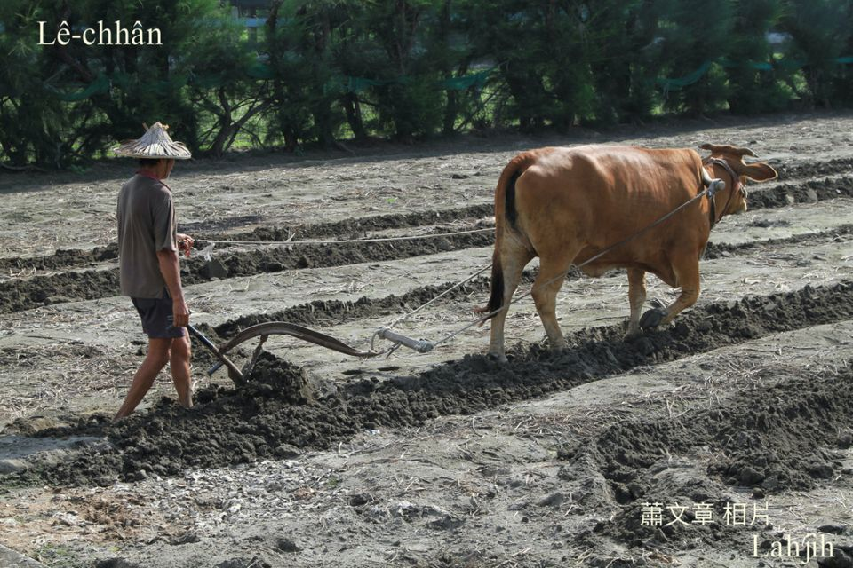 

簡單講，to̍h是kā田土整理好勢ê khang-khòe，整理了ê田chiah ē-sái-tit開始種作、播田。駛田ê工夫nā做無好勢，ē影響tio̍h收成好bái。

# 1. 駛田ê Khang-khòe
> **Sái-chhân ê khang-khòe**

駛田是播田進前牛犁pē ê khang-khòe，tāi-seng用犁犁田土，kā田土犁ho͘深深péng-pêng suh空氣，然後淹水，chiah koh用手pē／鐵pē ，割pē pháng田，pháng ho͘幼幼，最後chiah koh用loa̍h筒loa̍h-pêⁿ，to̍h ē-sái-tit準備播田插秧á。

駛田主要是teh講以下4種khang-khòe。

## 1-1. 犁田
> **Lê-chhân**

休耕、收成--過ê水田，boeh-koh播田插秧á，tāi-seng khang-khòe to̍h是犁田，重犁深掘chiah有好收成，駛牛兄tò手牽牛索，指揮牛拖犁，正手hōaⁿ犁柄，角度分深淺，力頭節輕重，深犁土胚chiah-ē大塊，nà日suh空氣chiah-ē chiâu-ûn，幾日後chiah開始淹田水，淹hō͘伊土肉ē nńg-lio̍h，方便踏割耙。

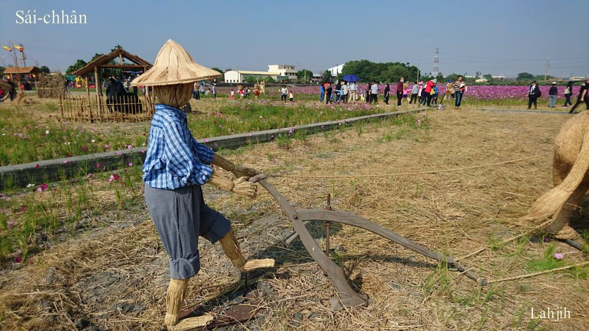

## 1-2. 淹水、Pháng田
> **Im-chúi、Pháng-chhân**

犁好ê田，是1-phiáⁿ 1-phiáⁿ ê thô͘-phoe（土胚），經過lāng風曝日to̍h有殺菌功效，作田人發現1坵田田土無平均，to̍h ē kā khah koân所在田土mo͘h去khah低所在，叫做mo͘h phoe-á（胚á），然後開始淹水，淹ho͘ tīⁿ-tīⁿ，等田土食水nńg-lio̍h，to̍h ē-sái-tit開始踏割耙，kā田土割ho͘幼幼適合插秧á適合稻欉成長。

## 1-3. 踏割耙
> **Ta̍h-koah-pē**

Pháng田家私是koah-pē（割耙），割耙有割耙齒ná刀片，有桂竹齒kap鐵枋齒，tī中央所在需要kā thóng出部份削平，hō͘駛牛兄雙腳踏頂面，增加重力，方便控制割耙hē力，所以叫做踏割耙。割耙踏了，看有田土無chiâu-ûn ê所在，需要giâ鐵耙put pê ho͘平坦chiâu-ûn。
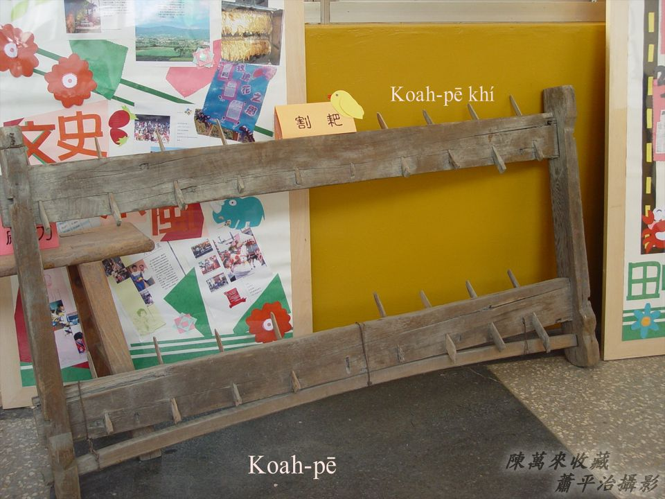

## 1-4. Kā田土Loa̍h-pêⁿ
> **Kā Chhân-thô͘ Loa̍h-pêⁿ**

手耙Chhiám Loa̍h-tâng kā田土Loa̍h-pêⁿ。

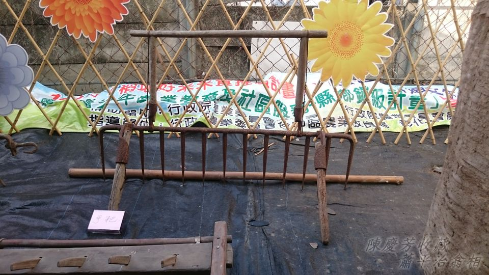
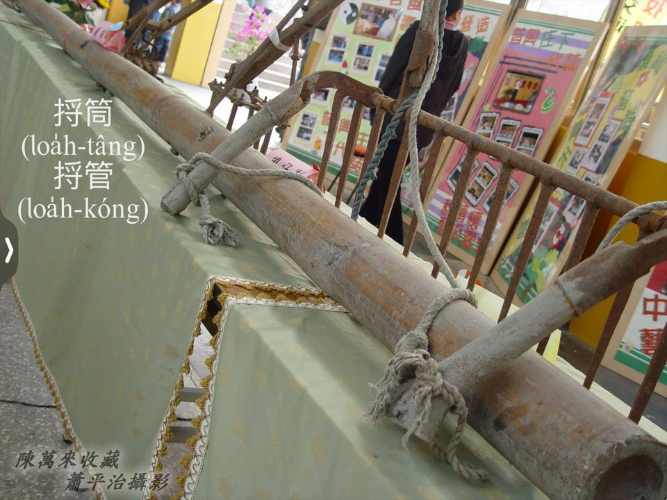
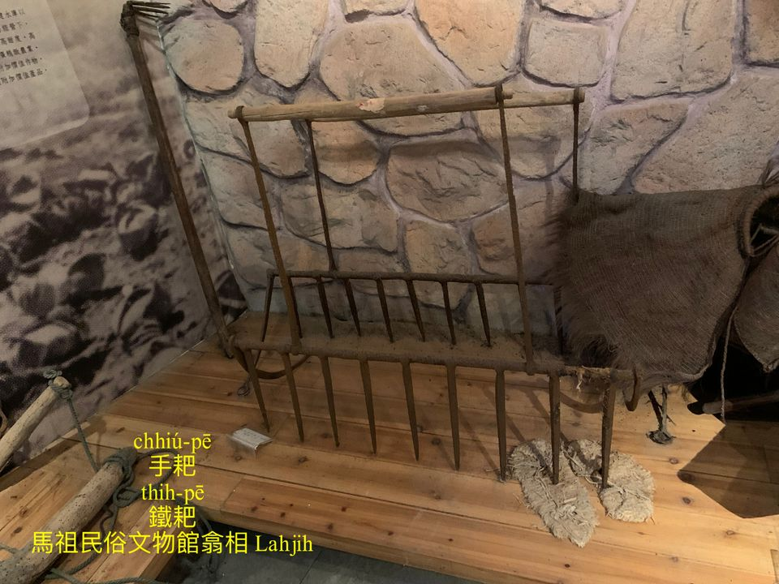

先kā田水làu一寡掉，用chhiú-pē（手耙）chhiám loa̍h筒kā田土loa̍h ho͘平。Loa̍h筒是1支直直丈外長ê杉á-kho͘ a̍h是大支竹管，牛tī頭前拖，駛田兄tī後壁hōaⁿ手耙，boeh án-chóaⁿ運轉to̍h kap駛車kāng款，需要技巧、功夫。

Chit-mái ê台語人真奇怪，講siáⁿ-mih「駛車」無好聽，tio̍h講「開車」，咱lóng知，kan-nā將油門a̍h是車門phah開，車是bē ka-tī行，kám講駛、屎kāng音無好聽，to̍h m̄-thang講，án-ne ta̍k-ke tio̍h m̄-thang放屎，khah bē無好聽khah bē臭ko͘ⁿ-ko͘ⁿ。

> 註：
> Chhiú-pē（手耙）mā號做鐵耙。

# 2. 駛田使用ê家私
> **Sái-chhân Sú-iōng ê Ke-si**

這部分是teh紹介pōe田土ê家私。犁深層ê土肉到頂面；kā田土紡幼；kā田土loa̍h ho͘平平；開溝等等ê khang-khòe，tio̍h chhoân無kāng ê家私來使用。

## 2-1. 割耙
> **Koah-pē**

紡水田田土ho͘幼。
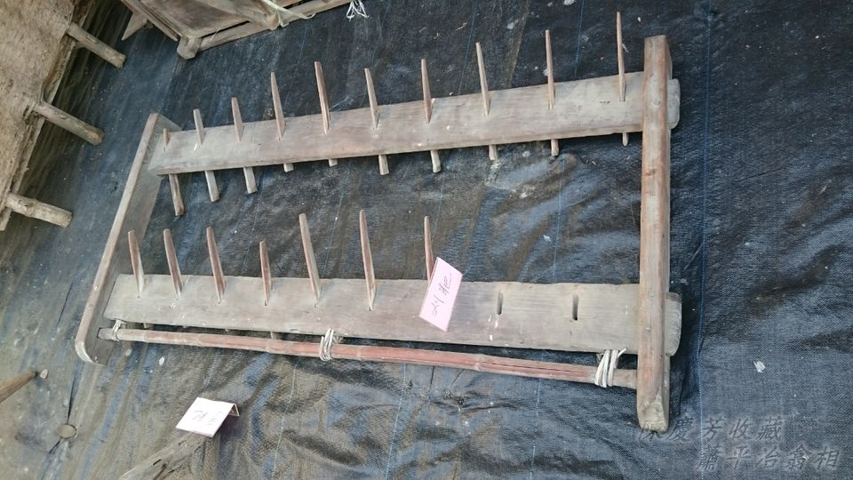

## 2-2. 手耙／鐵耙
> **Chhiú-pē/Thih-pē**

手耙mā講鐵耙，伊ê功能主要是chhiám loa̍h-tâng（loa̍h筒）loa̍h平田土，方便插秧á。Mā ē-tàng耙鬆田土。
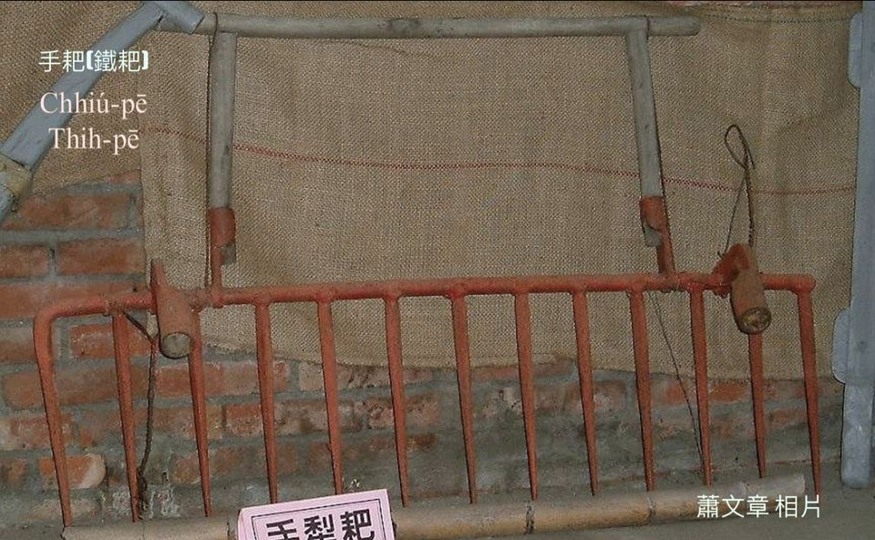
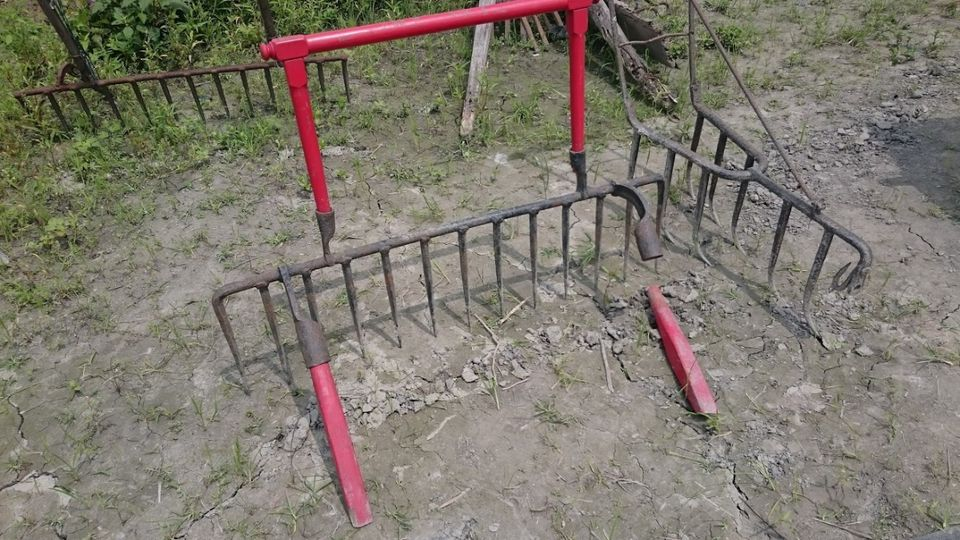

## 2-3. 磟碡
> **La̍k-ta̍k**

La̍k-ta̍k作用kap割耙相像，lóng是用牛拖leh割田土耙田土ê家私，割耙有割耙齒尖尖利利，khah有危險性，m̄-koh效果khah好，田中央chit pêng水田田土khah黏，lóng是踏割耙，m̄-bat看過phah la̍k-ta̍k。溪州hit pêng khah chē是鬆鬆ê沙質土，無論水田ta園，用la̍k-ta̍k處理加真方便。另外為tio̍h khah細範圍，to̍h用手拖ê la̍k-ta̍k。俗語講「六月六，頭家落田phah la̍k-ta̍k。」表示六--月是田頭siāng無閒ê時段，因為第一期稻作收成後，隨時to̍h-boeh第二期稻作犁田、插秧á。
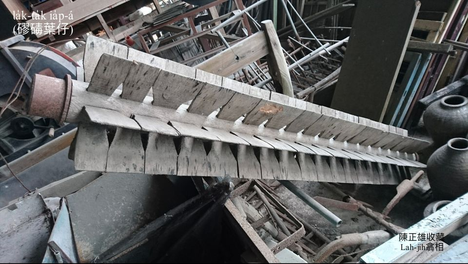
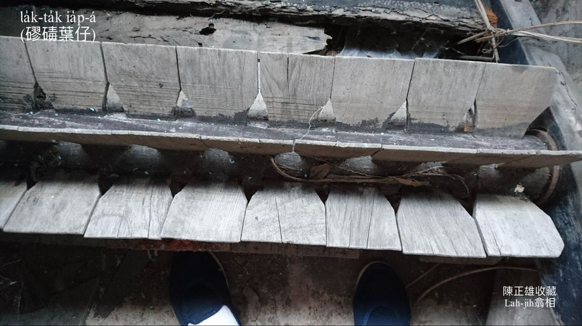
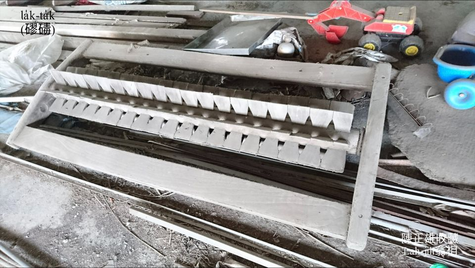

## 2-4. Loa̍h筒／Loa̍h管
> **Loa̍h-tâng/Loa̍h-kóng**

Loa̍h筒是一支丈5-6長ê杉á kho͘，tio̍h用手耙chhiám-tiâu hō͘牛拖leh loa̍h平田土，準備插秧á。Mā有用大支竹管代替，叫做loa̍h管。Loa̍h管，tio̍h選he直koh大kho͘ ê竹管。

杉á-kho͘ ê loa̍h筒iáu有一種路用，用來扛板á，to̍h是扛棺柴。

## 2-5. Loa̍h耙
> **Loa̍h-pē**

為tio̍h boeh kap手耙chhiám杉á-kho͘ ê loa̍h筒做分別，chit種免用手耙ê loa̍h筒，我ka號做loa̍h-pē，loa̍h耙比較khah輕省，用赤牛á拖，ē-tàng loa̍h水田，mā ē-tàng loa̍h ta園，Chhân-tiong-ng chit pêng m̄-bat看--tio̍h。
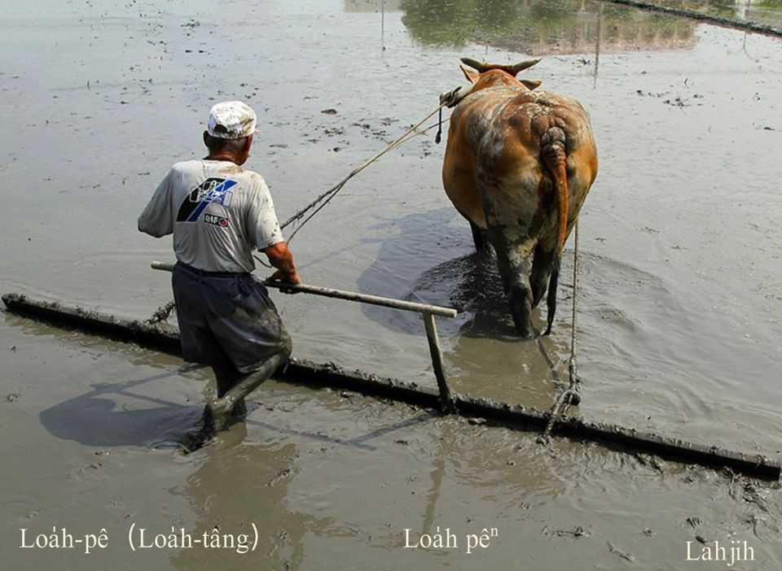
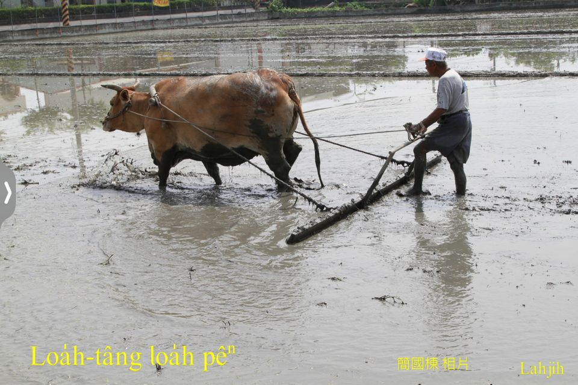
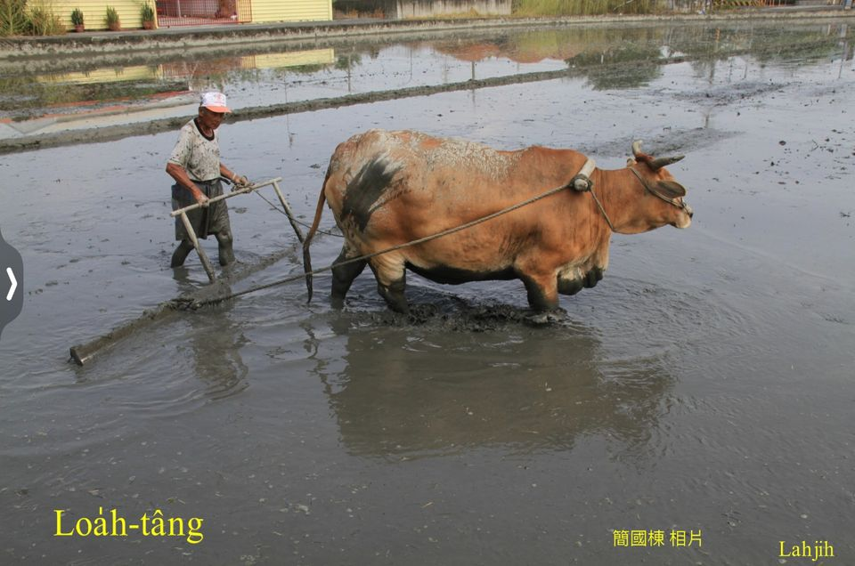
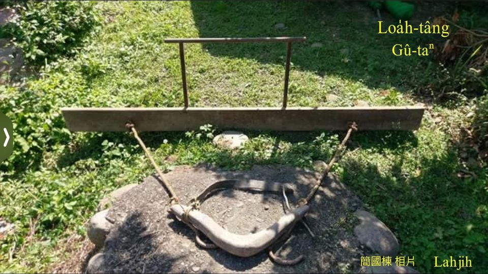
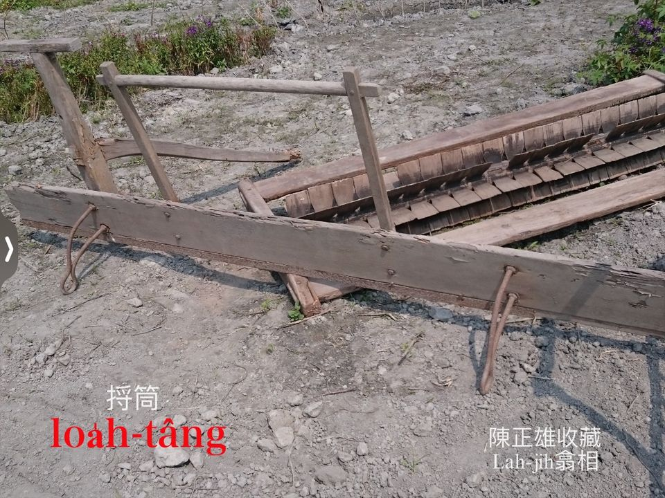

## 2-6. 鐵耙Put
> **Thih Pê-put**

割耙踏--過，loa̍h筒loa̍h--過，nā看tio̍h田土無平坦ê所在，to̍h用鐵耙put pê ho͘平。
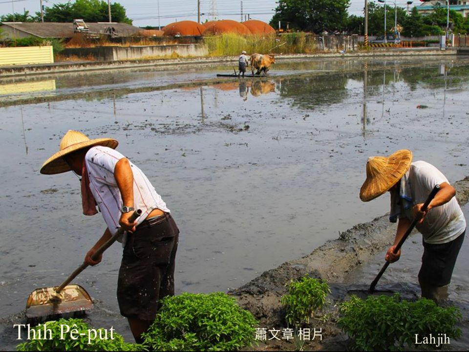

## 2-7. 鐵鍘犁
> **Thih-chah-lê**

鐵鍘犁ê犁頭是4支尖尖ê鐵鍘，用牛拖ē-tàng挖tēng土挖ho͘深溝，大量種作需要菜股番薯lêng有水溝ê作物，親像番麥、甘蔗，用鐵鍘犁來作穡加真快速方便。
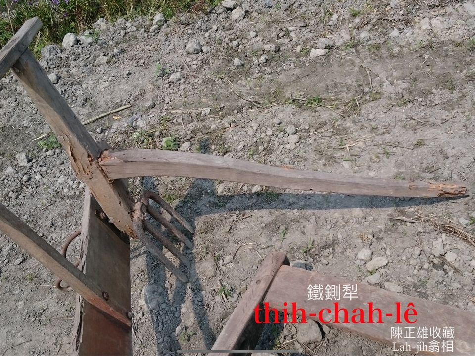
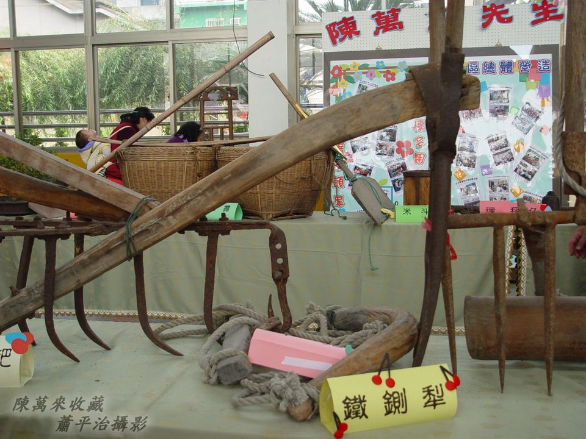

## 2-8. Ngiáu-á犁
> **Ngiáu-á-lê**

Ngiáu-á犁大支--ê kō͘牛拖，細支用人工雙手拖，Ngiáu ho͘土肉鬆鬆，sūn-sòa kā雜草ngiáu-ngiáu hìⁿ-sak，小範圍ê khang-khòe方便作穡。
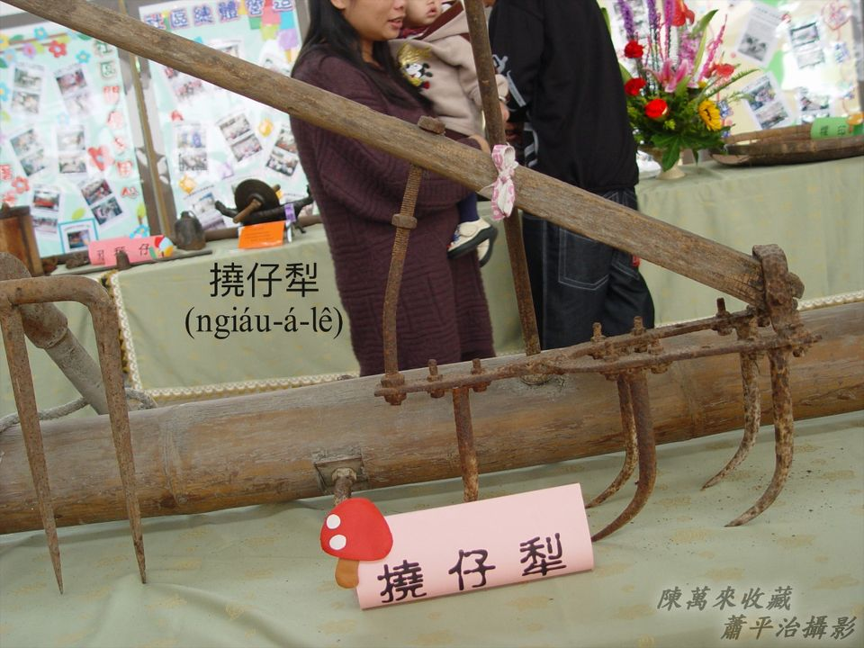
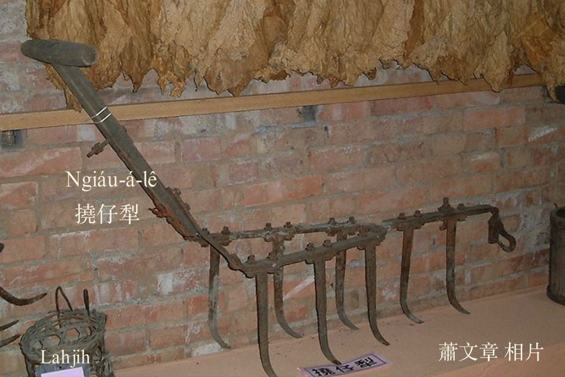

# 3. 駛田使用ê家私──犁ê構造紹介
> **Sái-chhân Sú-iōng ê Ke-si —— Lê ê Kò͘-chō Siāu-kài**

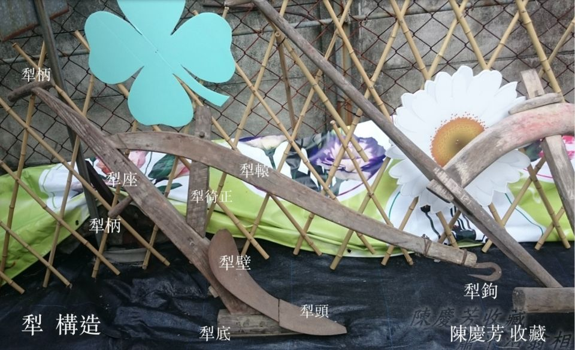

## 3-1. 手hōaⁿ-á
> **Chhiú-hōaⁿ-á**

犁柄有手hōaⁿ-á，手hōaⁿ-á是犁尾。

## 3-2. 犁座
> **Lê-chō**

Ùi手hōaⁿ-á連到lê-té（犁底）。

## 3-3. 犁頭kap犁壁
> **Lê-thâu kap Lê-piah**

犁底有犁頭，犁頭是seⁿ-á，犁頭頂面hit塊鐵枋叫犁壁，sió-khóa hiau-than形，chiah-ē hō͘犁--起-來ê土胚kńg-lian péng tùi正pêng面。
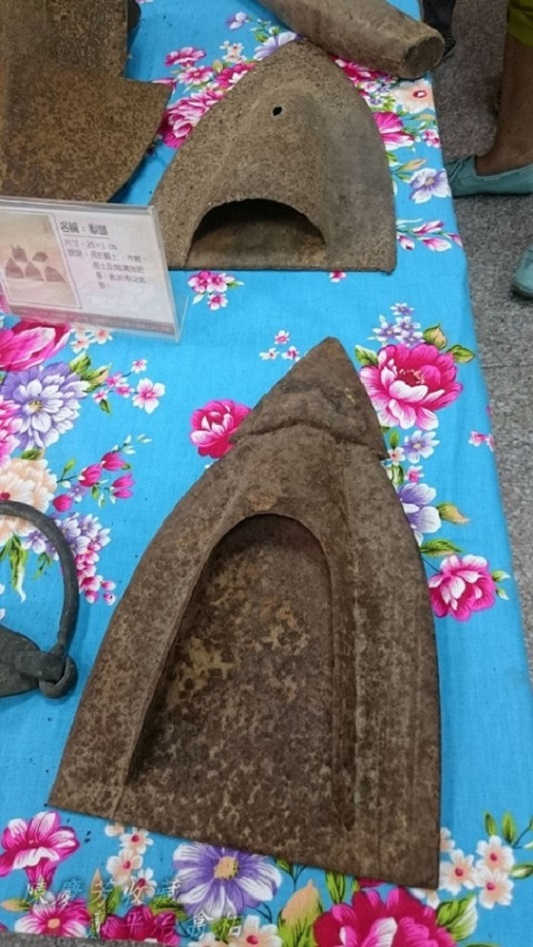

## 3-4. 犁轅kap犁鉤
> **Lê-hn̂g kap Lê-kau**

Siāng長sió-khóa khiau-ku hit支木材叫做lê-hn̂g（犁轅），頂koe̍h kap犁座有榫頭tàu tiâu--leh koh用鐵枋加強，ē-koe̍h尾溜有鉤á叫做犁鉤。犁鉤to̍h是boeh鉤腳車ê後達á。

Tiuⁿ犁師傅講：製造1張犁，siāng pháiⁿ做、siāng厚工ê部份to̍h是tiuⁿ犁hn̂g。

> **補充：犁轅tī《台日大辭典》寫做「犁園」，發音mā是lê-hn̂g。**

> **註：Tiuⁿ（張）是做、製作、裝、穿ê意思，張犁、張穿、張機器。（感謝潘科元老師ê詳細說明）**

## 3-5. 犁khiā正
> **Lê-khiā-chiàⁿ** 

犁座kap犁hn̂g有一支鐵枝鎖ân固定，叫做khiā正。

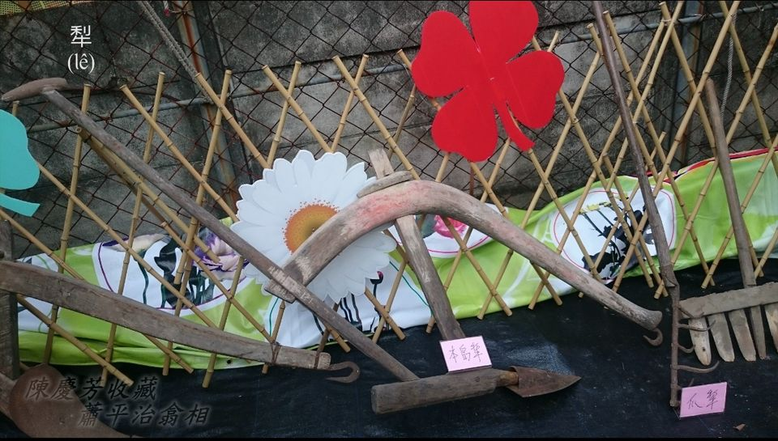
（犁kap犁頭）

# 4. 耙交攬──Hō͘田土平坦
> **Pê Ka-lám──Hō͘ Chhân-thô͘ pêⁿ-tháⁿ**

犁--過ê 1-lêng 1-lêng田土，經過nà日淹水了後，需要用鐵耙tháⁿ平，用割耙pháng田，nā iáu有無平無chiâu-ûn ê所在，to̍h用鋤頭、鐵鍘、鐵耙put pê ho͘平坦，號做pê ka-lám。《台日大辭典》：Ka-lám（交攬）田園鋤頭翻土ê開始基準點。

Mā有講，kā犁犁--過kui lêng ê田土，用鋤頭、鐵鍘耙落去溝底。

# 5. 註解
> **Chù-kái**

|**詞**|**解說**|
|nà日|曝日頭。|
|hiau-than|『物體久曬太陽變形成不平整』。|
|lāng風曝日|『透空氣曬太陽』。|
|nńg-lio̍h|『柔軟』。|
|mo͘h|『雙手抱物』。|
|石頭lōng-khōng|『大石小石參雜不平狀』。|
|seⁿ-á|『生鐵』。|
