# 牛Án-chóaⁿ kā作田人Tàu作穡
> **Gû Án-chóaⁿ kā Choh-chhân-lâng Tàu Choh-sit**

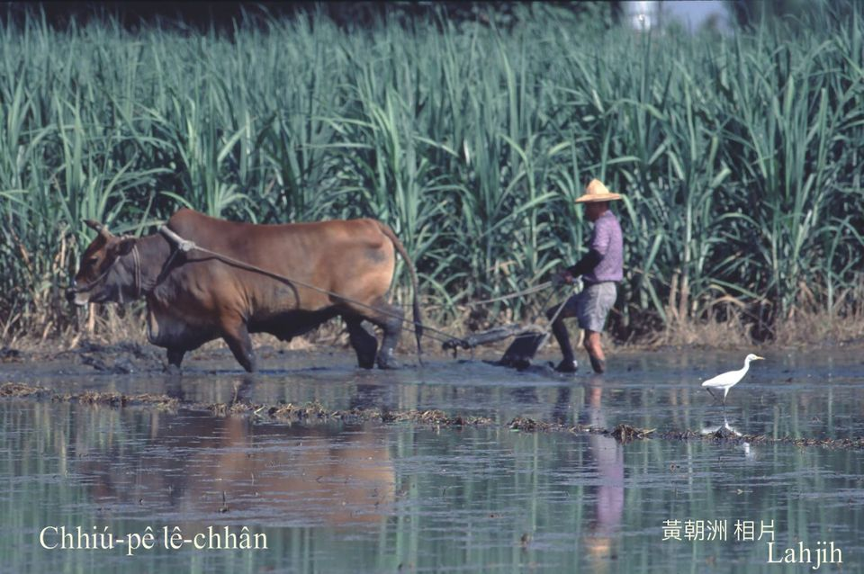

# 1. 牛kap人相依相倚ê關係
> **Gû kap Lâng Saⁿ I Saⁿ Óa Ê Koan-hē**

牛是作田人ê性命好朋友，牛ē犁田作穡，拖車做工，刻苦耐勞m̄-bat喝艱苦，透早到暗陪伴主人，罕得pān-tōaⁿ罷工，食，kài簡單，稻草、牛埔草phí，nā有蔗íⁿ、番薯葉、番薯是上等料理，做，是一牛贏過十ê人工，m̄-chiah駛牛兄惜命命。
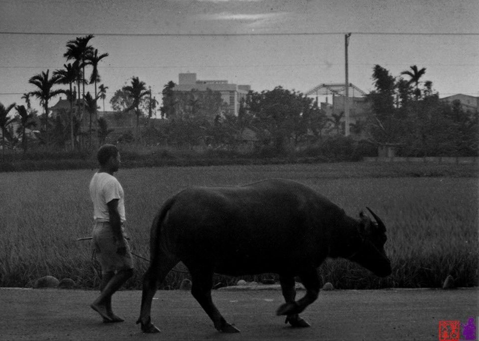

## 1-1. 赤牛
> **Chhiah-gû**

赤牛á mā是ē-hiáu駛田、拖牛車。
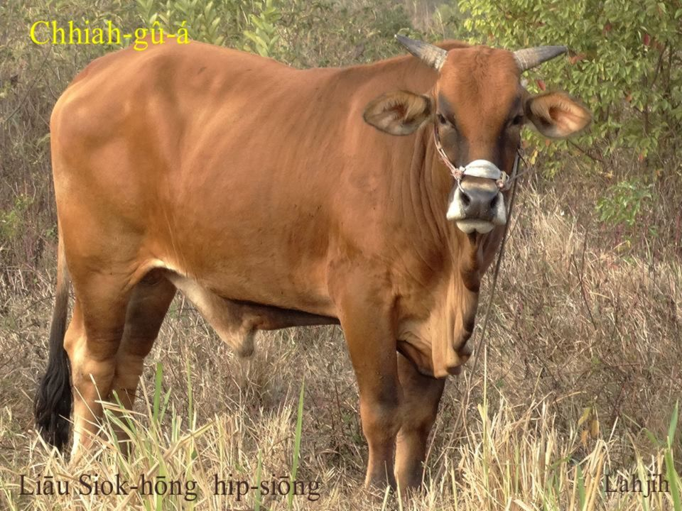
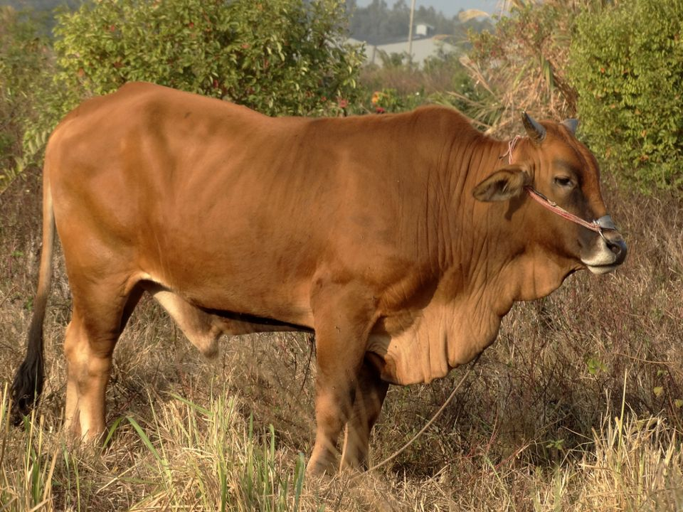

## 1-2. 水牛á-kiáⁿ
> **Chúi-gû-á-kiáⁿ**

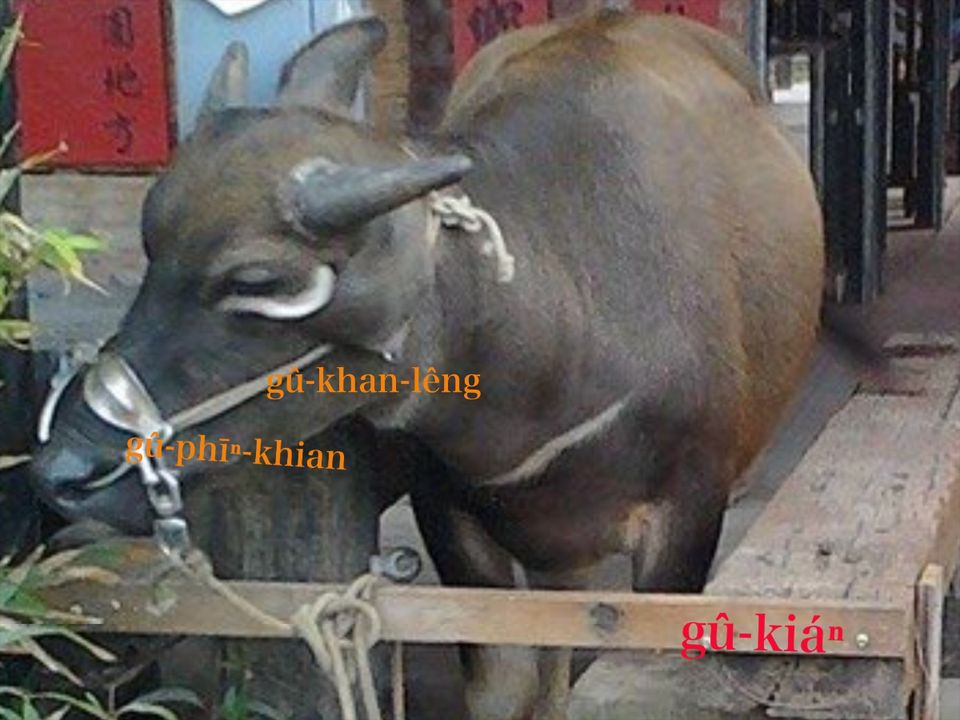

 
# 2. 牛做工ê配備簡介
> **Gû Chò-kang ê Phòe-pī Kán-kài**
> 
Chit-má牛拖車a̍h是牛犁田是真罕得看--tio̍h ê光景，田--裡真chē khang-khòe需要牛來tàu-saⁿ-kāng，咱用下面這張圖片來簡單紹介牛身軀頂ê配備。
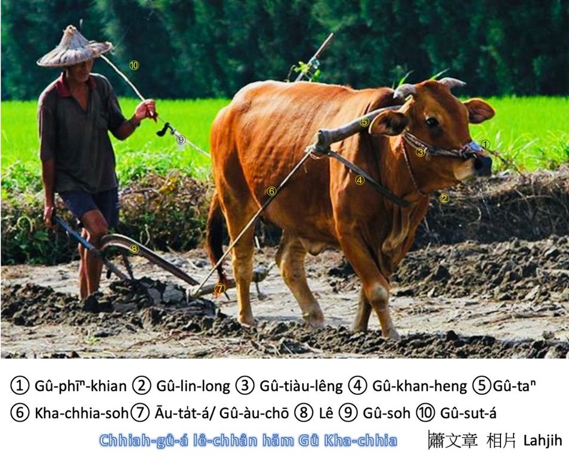

## 2-1. 牛鼻Khian
> **Gû-phīⁿ-khian**

Kǹg入牛鼻ê khian-á，材料是bē seⁿ-sian ê金屬。Koh叫做牛鼻khoân。

## 2-2. Gû-Lin-long

Lin-long-á是赤牛ê配備，掛tī牛ām，行路ē lin-lin-long-long響。

## 2-3. 牛吊龍
> **Gû-tiàu-lêng**

Kā牛鼻khian固定tī鼻龍ê索á。

## 2-4. 牛牽胸
> **Gû-khan-heng**

固定牛擔ê索á。

## 2-5. 牛擔
> **Gû-taⁿ**

Khòe tī牛肩胛ām-kún頂，木造、竹造ê彎彎曲擔。Koh叫做gû-ka-taⁿ（牛加擔）。

## 2-6. 腳車索
> **Kha-chhia-soh**

一般用iûⁿ-môa phah ê三股索。

## 2-7. 後達á
> **Āu-ta̍t-á**

Mā講gû-āu-chō（牛後座），柴造，有安1-ê鐵kho͘-á kap犁鉤相連。

## 2-8. 犁
> **Lê**

重犁深掘chiah有好收成，駛牛兄tò手牽牛索，指揮牛拖犁，正手hōaⁿ犁柄，角度分深淺，力頭節輕重，深犁土胚chiah-ē大塊，nà日suh空氣chiah-ē chiâu-ûn，土肉營養份有夠，稻á chiah大ē súi。

## 2-9. 牛索
> **Gû-soh**

Pa̍k tī牛鼻khian ê黃麻索，是人kap牛互動ê媒人（媒介），教--過訓練--過ê牛，透過牛索tiuh振動to̍h ē了解牽牛兄ê意思行、停、正斡、tò斡。

## 2-10. 牛Sut-á
> **Gû-sut-á**

Ē使得用掃梳gím-á、樹á枝、a̍h是tîn-tiâu（籐條），是指揮牛哥行動第二媒介。

# 3. 牛做工ê配備詳細紹介
> **Gû Chò-kang ê Phòe-pí Siong-sè Siāu-kài**

## 3-1. 牛鼻Khian
> **Gû-phīⁿ-khian**

俗語「牛鼻m̄牽，boeh牽牛耳。」意思是講boeh約束牛ê行動，重點tī牛鼻，m̄是牛耳。Kǹg鼻ê牛隻，牛鼻khian to̍h是控制牛行動ê家私。
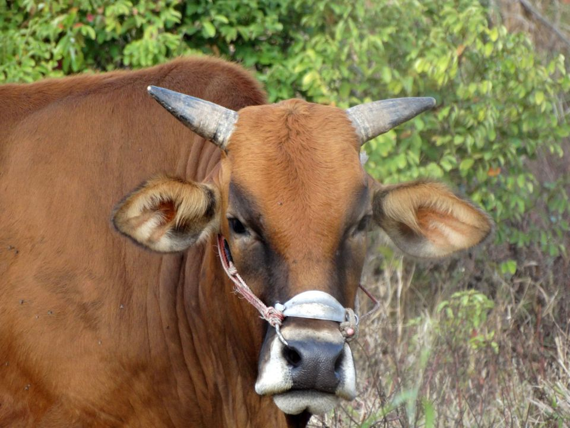
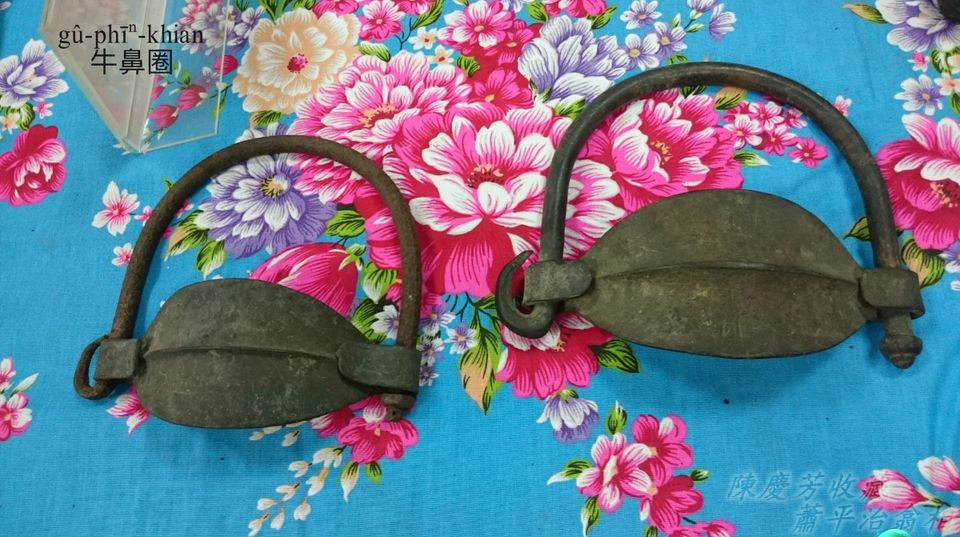

## 3-2. Lin-long-á
Lin-long-á是赤牛ê配備，掛tī牛ām，行路ē lin-lin-long-long響。
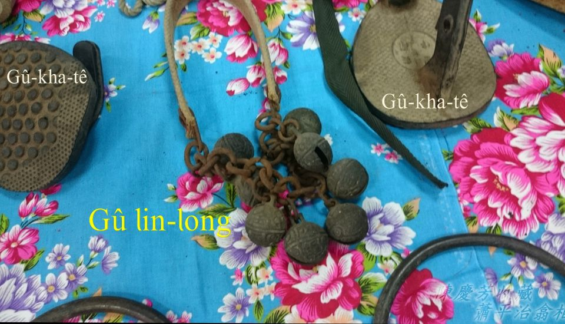

## 3-3. 牛擔
> **Gû-taⁿ**

Khòe tī牛肩胛ām-kún頂，木造、竹造ê彎彎曲擔。Koh叫做gû-ka-taⁿ（牛加擔）。
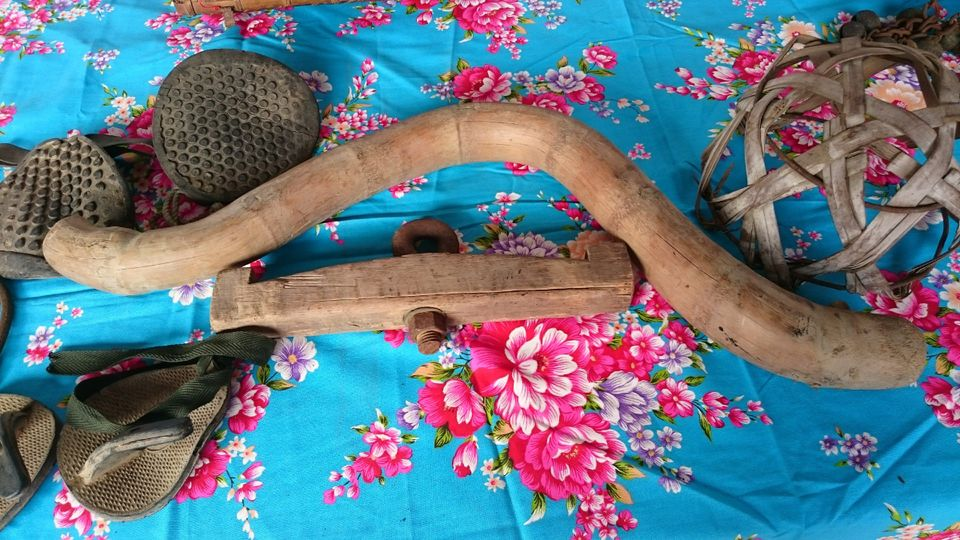

## 3-4. 後達á
> **Āu-ta̍t-á**

Mā講gû-āu-chō（牛後座），柴造，有安1-ê鐵kho͘-á kap犁鉤相連。
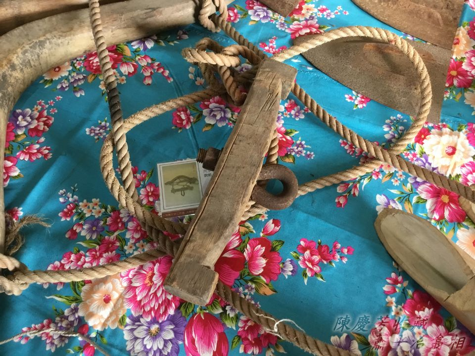

## 3-5. 牛Sut-á
> **Gû-sut-á**

牛索、牛sut-á是指揮牛哥行路、作穡ê家私，牛索一下giú，牛哥隨時知影án-chóaⁿ做，tn̄g-tio̍h牛哥戇神無聽話，牛sut-á sió-khóa kiuh--一-下，隨時見效。牛mā是有脾氣，牛性地nā起，a̍h是siuⁿ-thiám m̄振動，to̍h-ài看hit-ê牽牛ê作穡人án-chóaⁿ對待，大部份ê作田人lóng是疼牛ná性命。
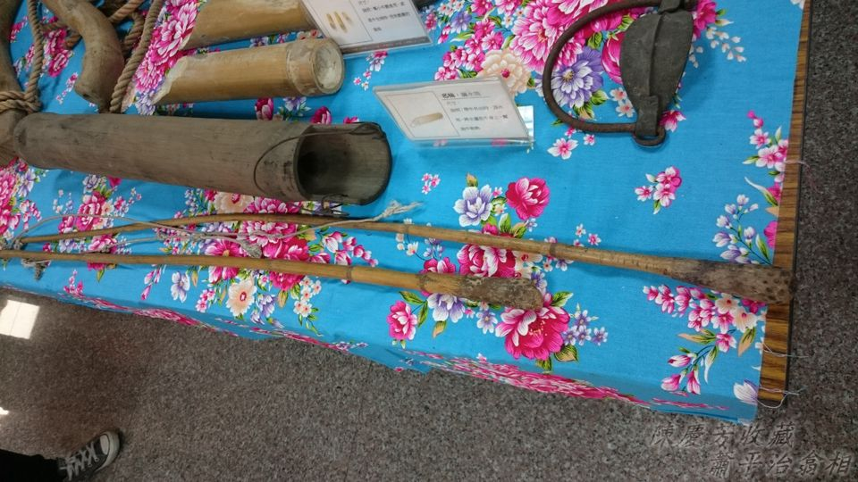

## 3-6. 腳車
> **Kha-chhia**

牛擔＋牛牽胸＋腳車索＋後達á＝腳車。
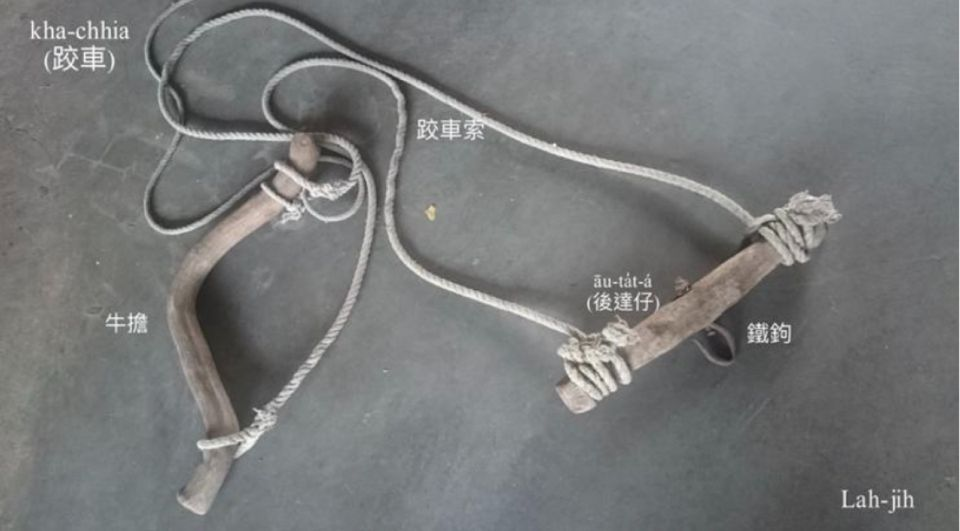

駛田犁田ê配備。Kha-chhia mā有人講gû-ka-chhia（牛枷車），a̍h是ka-chhia（枷車）。按照《台日大辭典》ê記載：Ka-chhia（枷車）指hō͘牛拖牛車、拖犁ê kui套設備，包括「枷擔」kap「後躂á」kap連接犁ê索。《教典》寫做ka-chhia（加車）。
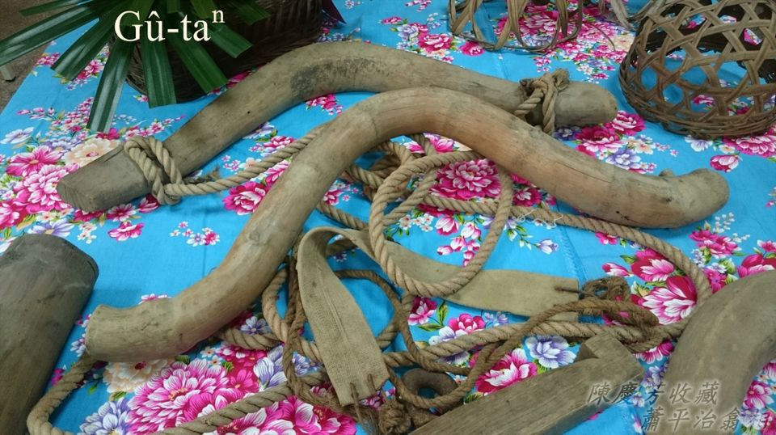

## 3-7. 牛嘴籠
> **Gû-chhùi-lom/Gû-chhùi-lam**

駛田時，nā tn̄g-tio̍h犁糊á番薯a̍h是田園有牛kah意食ê菜蔬，tio̍h-ài掛牛嘴lom，防止牛顧食m̄拖犁。Khah早國民學校早起tio̍h『晨間檢查』，阮kā嘴am『口罩』叫做牛嘴lom，mā有人講牛嘴am。
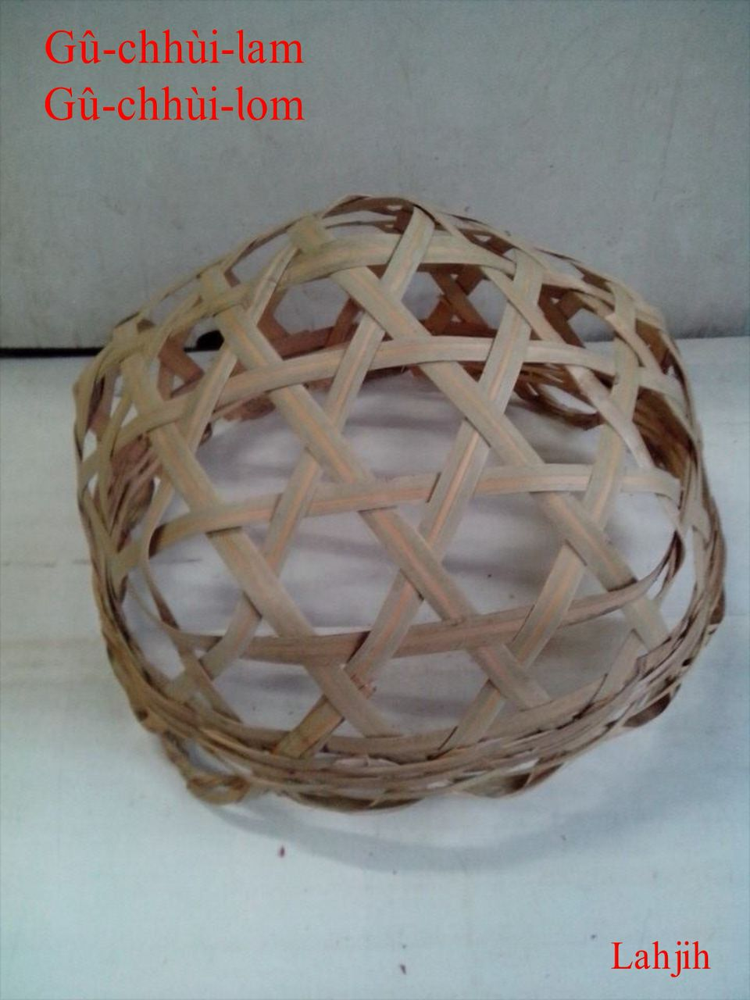
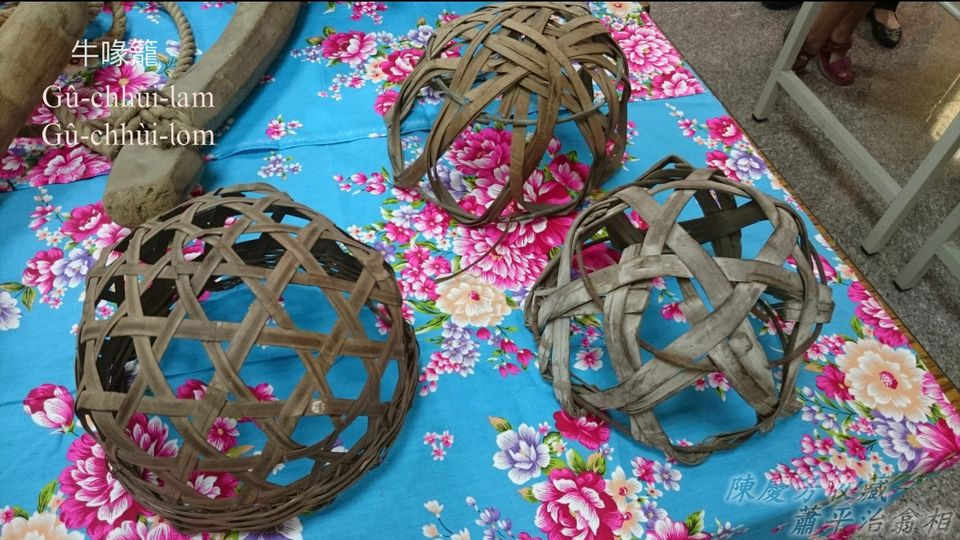

## 【Lah-jih生活寫真】二兄
> **【Lah-jih Seng-oa̍h Siá-chin】Jī-hiaⁿ**

二兄giâ犁kap腳車boeh落田作穡。
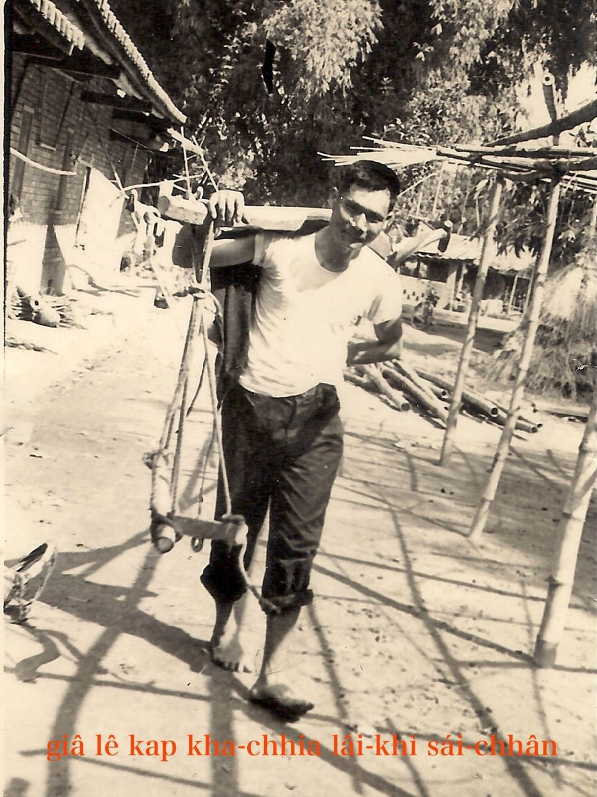

# 4. Kap牛犁田相關ê話語
> **Kap Gû Lê-chhân Siang-koan ê Ōe-gí**

## 4-1. 翻腳車
> **Hoan-kha-chhia**

牛mā有性地，有時ē tiùⁿ-ku m̄拖犁、m̄拖車，to̍h-ē翻腳車。人有時mā-ē翻腳車，講話無算話。

## 4-2. Lêng牛鼻
> **Lêng Gû-phīⁿ**

牛鼻是siāng脆弱bē堪得giú ê所在，nā是牛鼻hông kǹg--落-去，to̍h隨在人指使。俗語有「牛鼻m̄牽，beh牽牛耳。」

## 4-3. 蠻牛厚屎尿
> **Bân-gû Kāu Sái-jiō**

牛nā使性地to̍h ē pān-tōaⁿ，行路慢鈍m̄聽話，m̄是放屎to̍h是放尿，無心拖車，無心犁田，kan-nā想boeh食。

# 5. 註解
> **Chù-kái**

|**詞**|**解說**|
|pān-tōaⁿ／pîn-tōaⁿ／pūn-tōaⁿ|『懶惰』。|
|bē／bōe|『不會』。|
|鼻龍|Phīⁿ-lêng／Phīⁿ-liông，『鼻樑』。|
|boeh／beh|『要』。|
|iûⁿ-môa|『黃麻』。|
