# 淹田──Hō͘稻á食水
> **Im-chhân──Hō͘ Tiu-á Chia̍h-chúi**

種稻á ài淹水，種作無水pháng bē行，咱ē-kha ē詳細來紹介kap水相關ê家私kap設施。
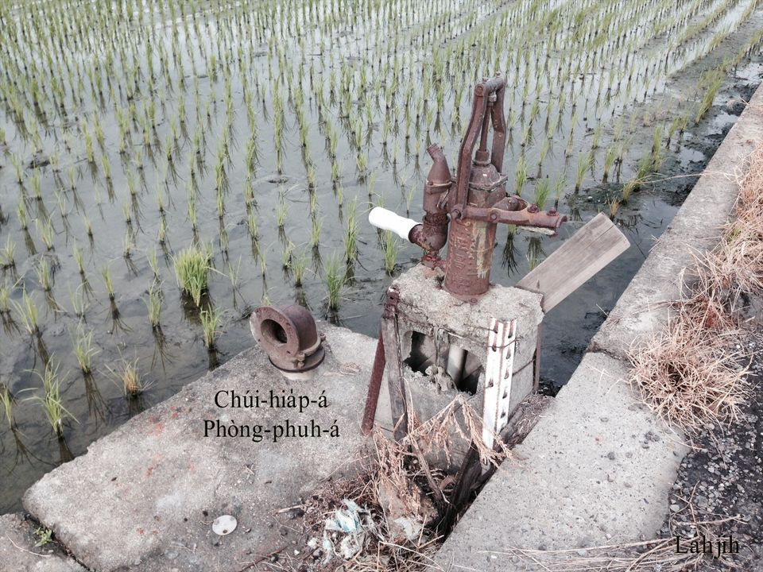

# 1. 濁水窟á
> **Lô-chúi khut-á**

濁水溪水水濁濁，八堡一圳八堡二圳引水來淹八卦山腳水田，大溪thàng中圳，中圳thàng水溝，水溝涵空流入田園，tī涵空流水所在有挖1-kâi窟á，叫做濁水窟á，淹水ê時，chiah-bē kā秧á chhiâng倒流掉，chit-ê濁水窟á ē kā濁水ê土膏沉底，等到boeh-koh駛田進前，作田人to̍h-ē用chhiah-pe、鋤頭清濁水窟á，用畚箕kā烏烏土膏擔去pun-pheⁿ其他所在，因為作田人知影烏烏濁水膏有肥，是生產khiū-khiū濁水米ê肥底。

古早濁水窟á無khōng紅毛土。
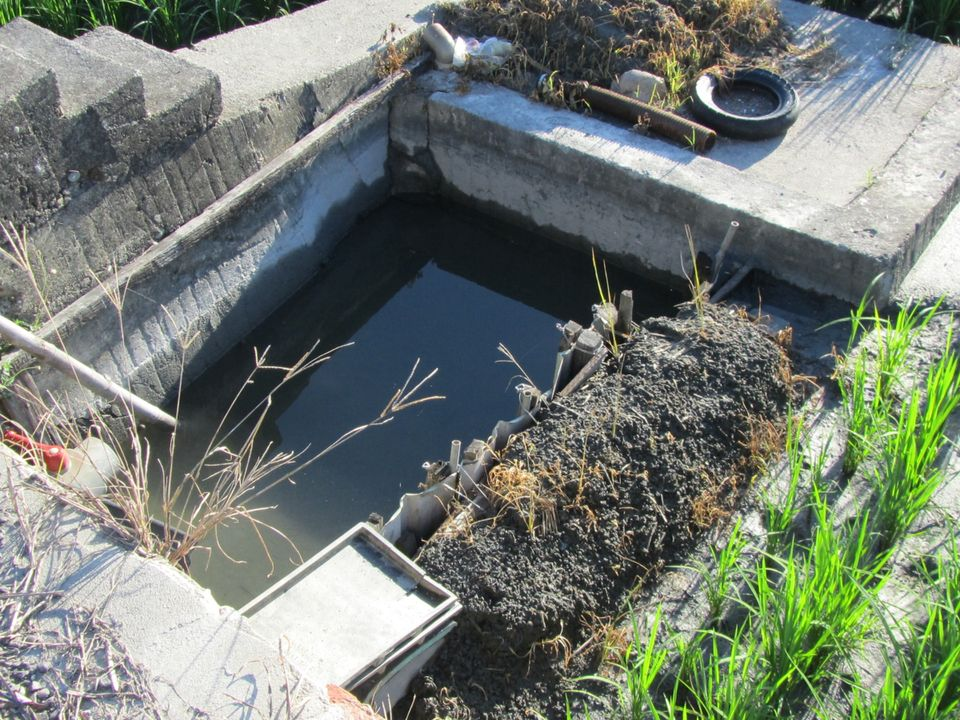

# 2. 水車／龍骨車
> **Chúi-chhia/Liông-kut-chhia**

看葉俊麟先生ê水車姑娘「爸爸牽水牛，行過田岸邊，想tio̍h siáⁿ-mi̍h？越頭對阮笑kah嘴ngi-ngi，chhiah！Chhiah-chhiah！Chhiah！Chhiah-chhiah！做1-ê農家女兒，每日踏水車，e-e！E-è！猶原也時常唱歌詩，安慰心空虛。」Ē-tàng了解早期ê農村生活，tī水利施設無利便ê所在，nā tn̄g-tio̍h溝á水、水窟á水比田khah低，定tio̍h需要踏水車來抽水淹田。田中chit-pêng ê水田m̄-bián踏水車。
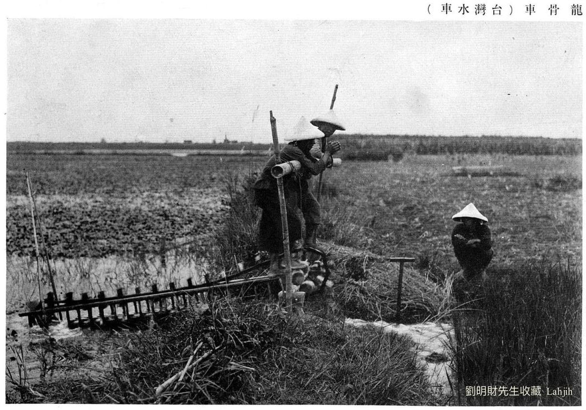
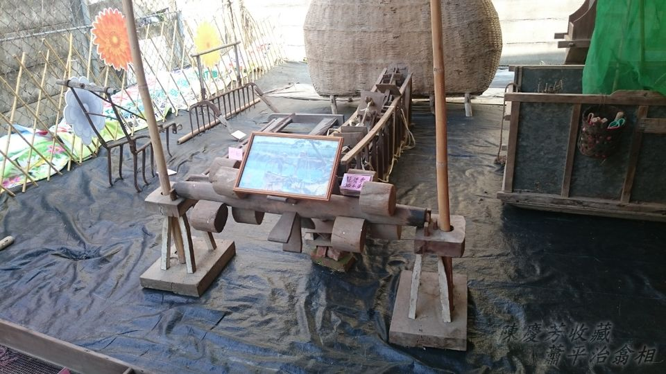
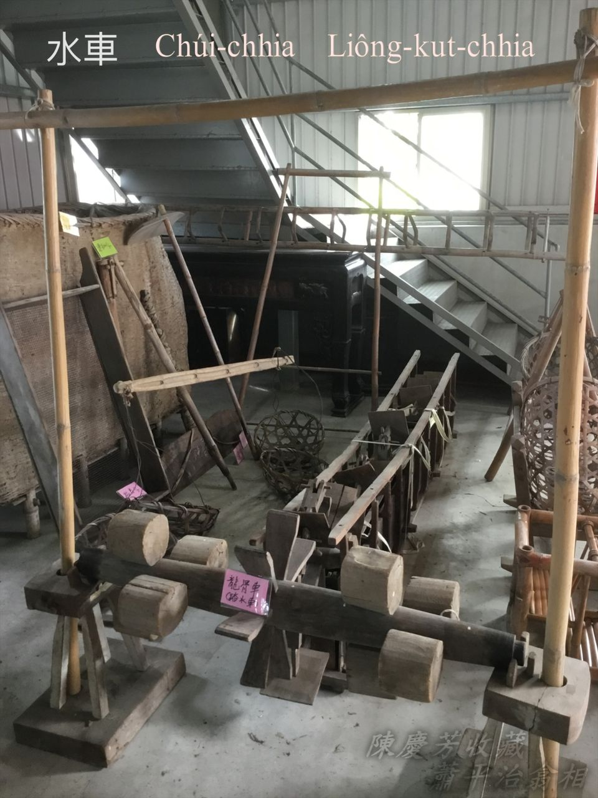
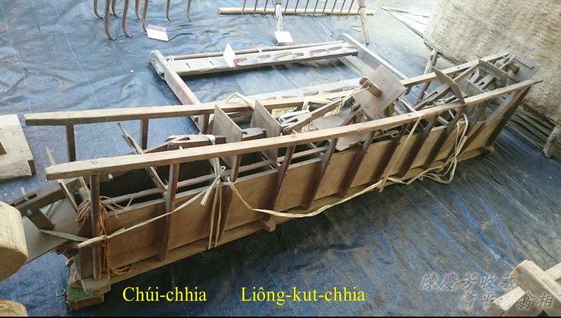

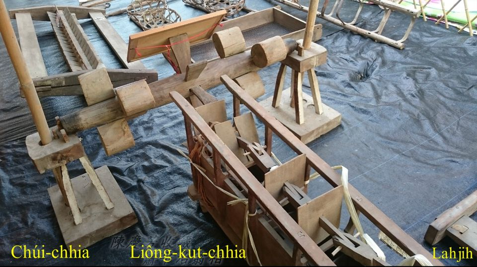
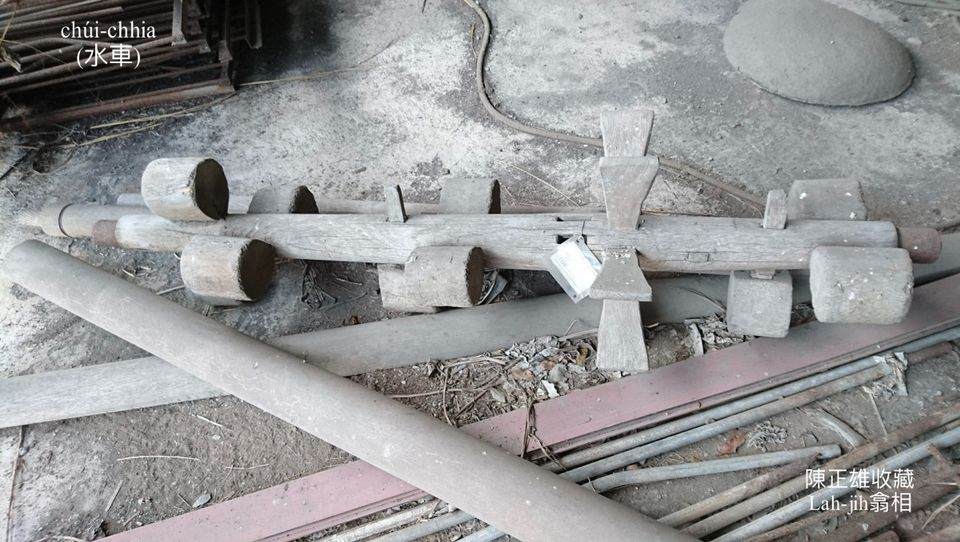
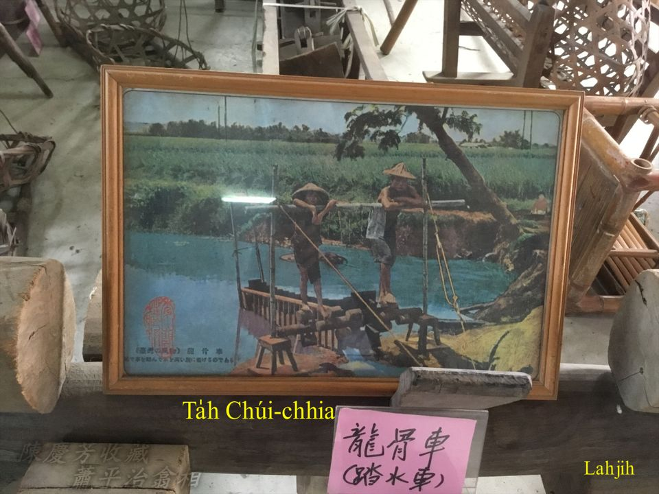

# 3. Phòng-phuh-á／水拹á
> **Phòng-phuh-á / Chúi-hia̍p-á**

水尾田淹水a̍h是tn̄g-tio̍h斷水，田頭nā有安phòng-phuh-á，to̍h ē-sái-tit加減淹一寡田水。
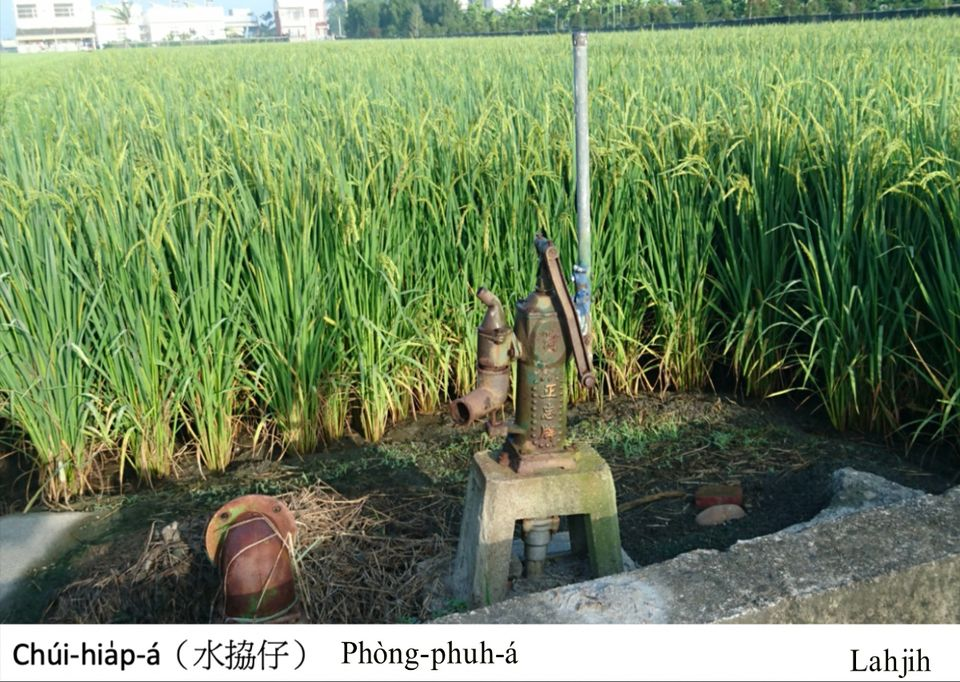

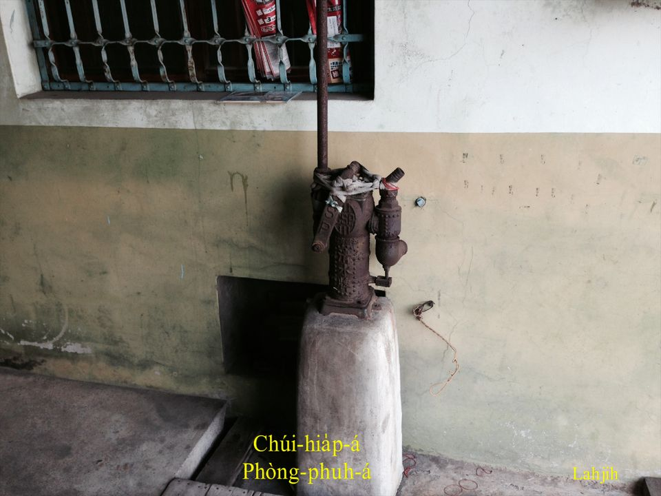
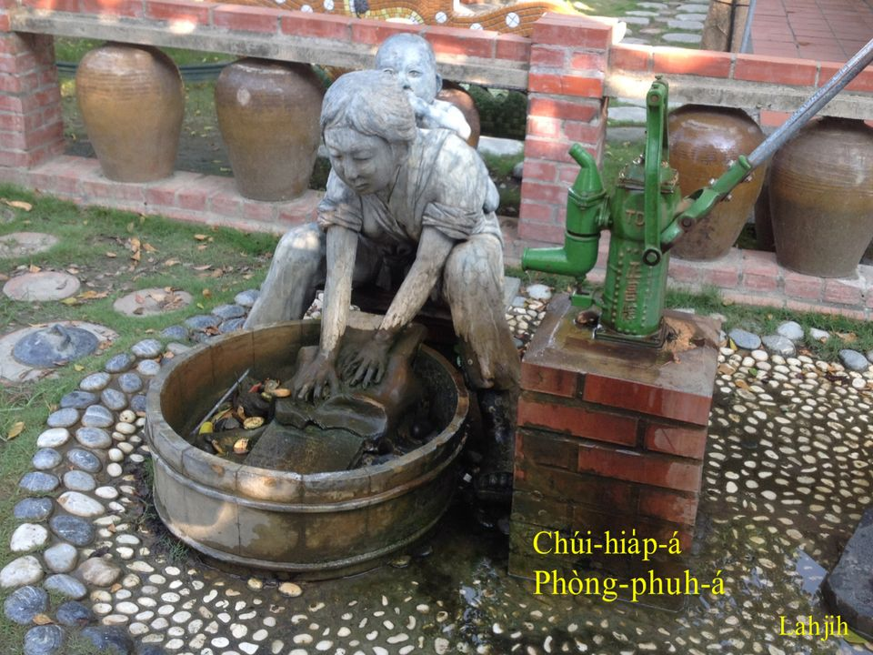

# 4. 註解
> **Chù-kái**

|**詞**|**解說**|
|tî-thâu/tû-thâu|鋤頭。|