# 播田到收成進前ê過程
> **Pò͘-chhân Kàu Siu-sêng Chêng ê Kòe-têng**

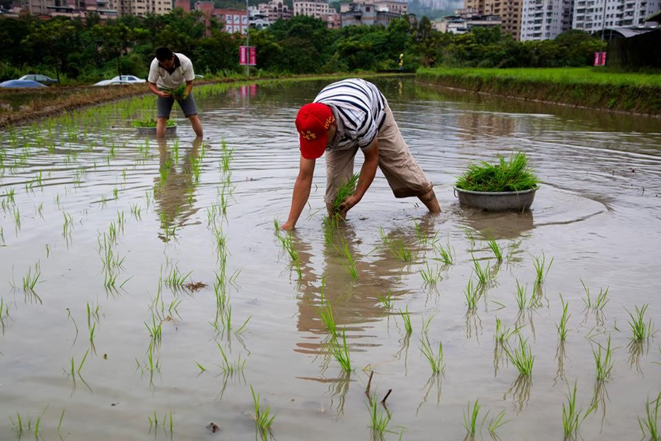

# 1. 播田前準備
> **Pò͘-chhân Chêng Chún-pī**

播田前ài先kā田整理好勢，chiah thang開始播田。

## 1-1. 田岸隙
> **Chhân-hōaⁿ-khiah**

水田淹水1坵盤過1坵，頂坵需要kō͘鋤頭掘田岸隙hō͘水phôaⁿ過坵，mā-chiah bē hō͘水siuⁿ-tīⁿ淹死秧á栽。

古早田岸無khōng紅毛土，nā頂坵下坵無kāng田主，to̍h無田岸隙。
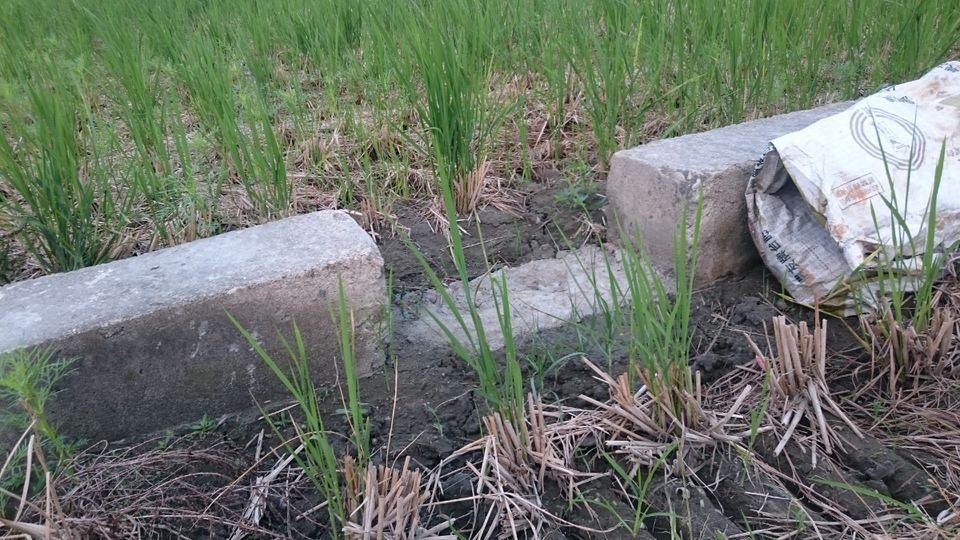

## 1-2. 等待播田插秧á ê水田
> **Tán-thāi Pò͘-chhân Chhah Ng-á ê Chúi-chhân**

Loa̍h筒loa̍h平，等待播田插秧á ê水田。
> Loa̍h-tâng loa̍h pêⁿ, tán-thāi pò͘-chhân chhah ng-á ê chúi-chhân

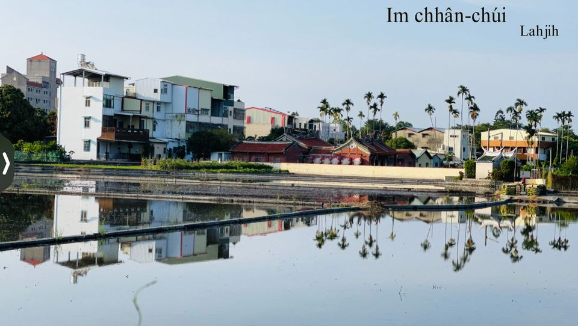
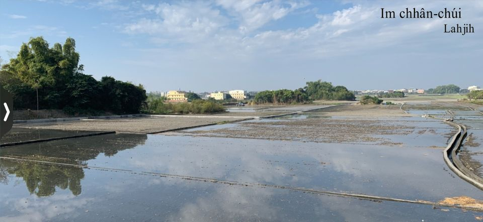
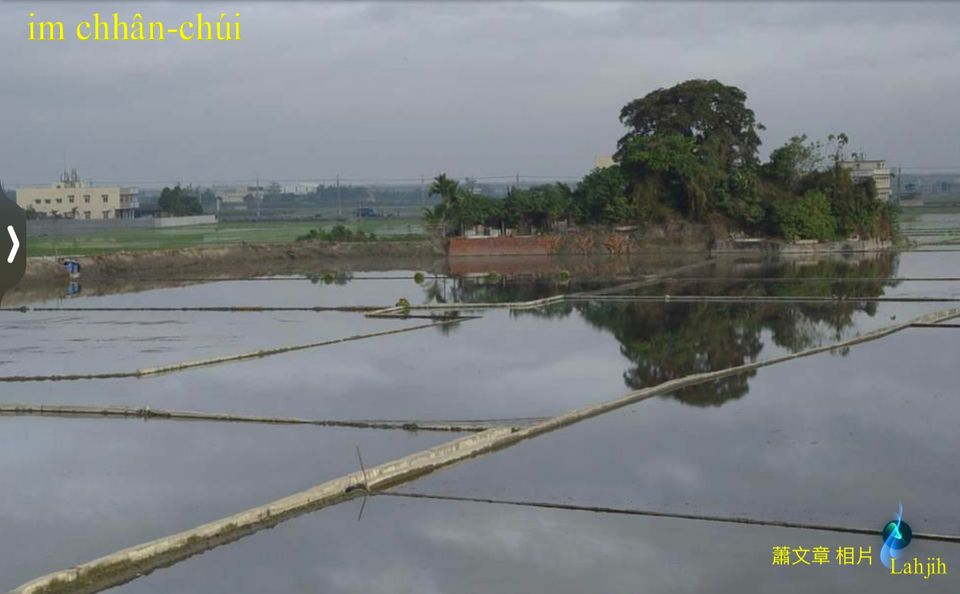

# 2. 播田時Kài-sûn ê家私
> **Pò͘-chhân Sî Kài-sûn ê Ke-si**

Loa̍h平了後需要kài-sûn thang插秧á，kài-sûn ê家私叫做lián-á（輪á），是用1枝大約5-6尺長ê káu-chan-á柴做車心（軸心/te̍k-sim），大約1尺闊掛1-kâi柴輪á，chiah tī nn̄g-pêng邊--a tàu柄，hō͘人ē-tàng牽leh拖。拖lián-á進前，先用細條iûⁿ麻索á，ùi chit pêng田岸到hit pêng田岸牽1條基線，chiah沿基線拖ho͘直，工夫--ê坦直坦橫lóng kài-sûn，功夫厲害ê播田兄，m̄免牽lián-á kài-sûn，kan-nā倚hit條基線to̍h ē-tàng播田插秧á。俗語「播田播無chōa，ngeh肉kiap相拖」是leh keng-thé kut-la̍t食pān-tōaⁿ做ê播田夫。

## 2-1. 輪á
> **Lián-á**

俗語「播田播無chōa，ngeh肉kiap相拖。」是keng-thé kut-la̍t食、ham-bān做ê作田人。

Nā boeh播田播ē直koh緊，需要用黃麻索牽基線，chiah koh用輪á拖sûn。輪á有12輪，拖1-pái 12-chōa，插秧á是一人1-pái插6模。Mā有竹製ê輪á。

Mā有he播田師傅，kan-nā lia̍h基線免拖輪á to̍h有法度插秧á，總--是秧chōa無hiah súi。

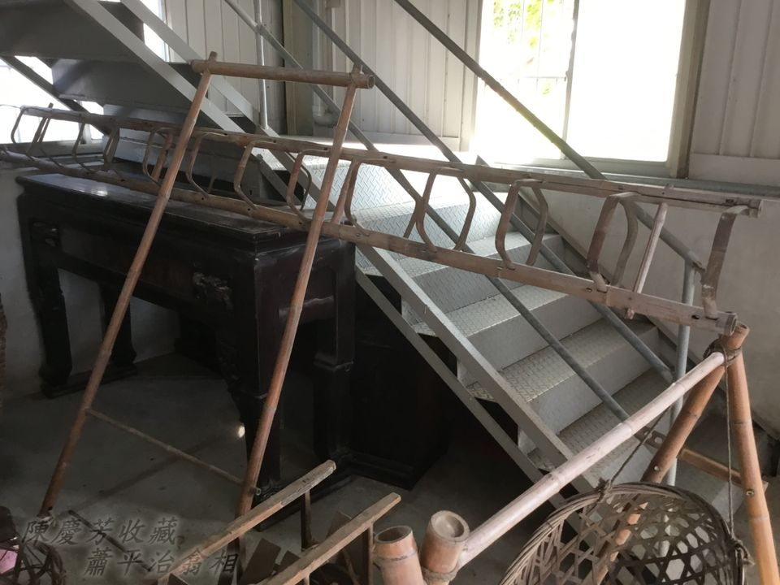
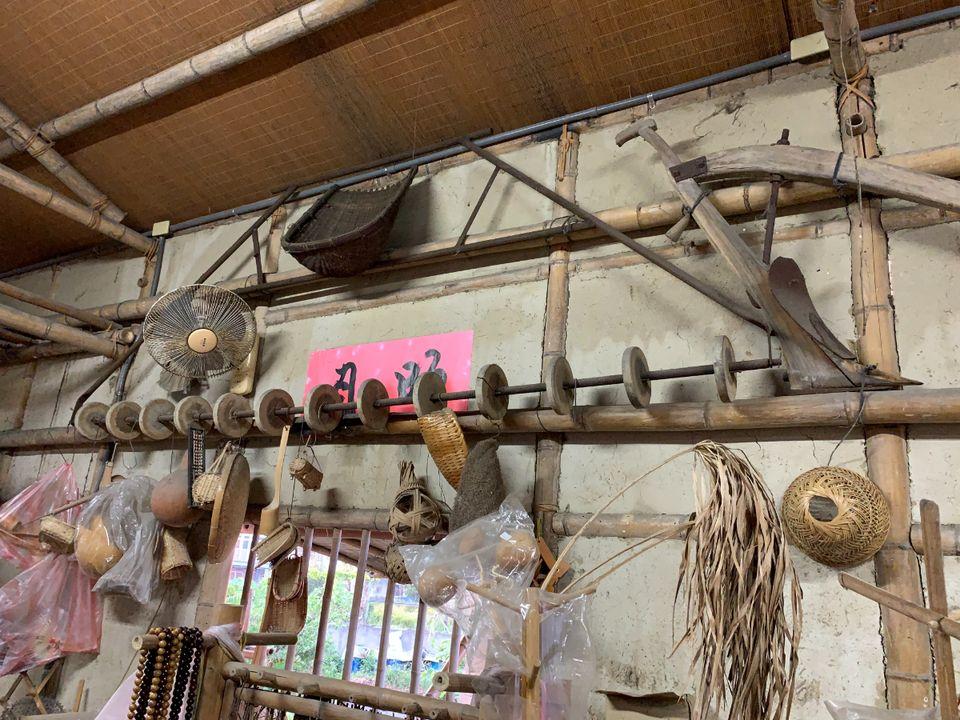
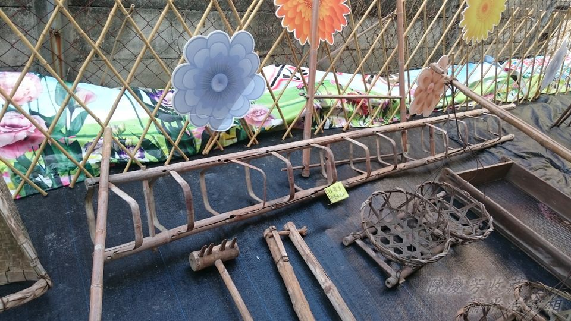

## 2-2. 比á
> **Pí-á**

比á kap pān-á（範á）kāng款，to̍h是比一下樣（款），thang照樣款做工。Chit ê比á是播田（插秧á）ê家私，材料是桂竹á。

插秧á有人用輪á kài-sûn，有人用索á牽基線，有人用比á定位。用比á播田需要4-ê人，兩pêng 2-ê師傅負責徙比á兼插秧á，中央2-ê chheⁿ-chhiú（生手）負責插秧á to̍h好，1人播6模，4人1-pái ē-tàng播24模。
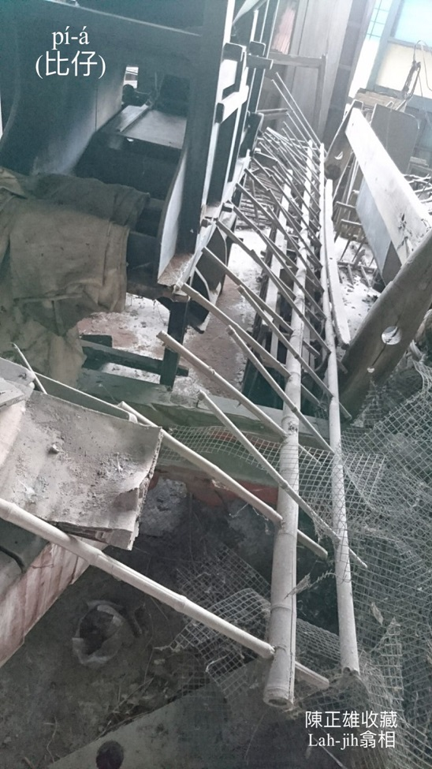

## 2-3. 索á
> **Soh-á**

作田人用ê索á一般用黃麻索á，大條用phah索á台phah，播田牽線用細條索á，細條索á用腳腿撚to̍h ē-sái--tit，mā有商店leh賣棉紗線。
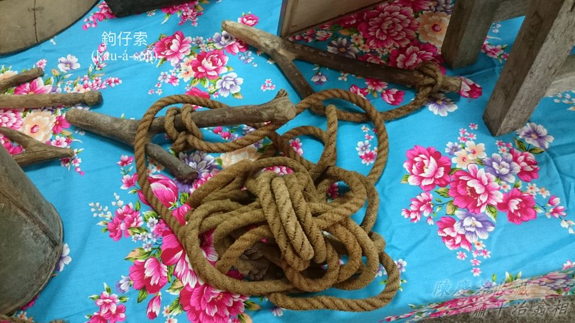

# 3. 開始播田
> **Khai-sí Pò͘-chhân**

插秧á姿勢用半khû khiā，秧船á tī kha-chiah後，ná播ná倒退lu，秧船á ná póe行，1手提秧á，1手捻，ná捻ná插，腳手緊--ê 1-pái插5-chōa，腳手慢--ê插4-chōa，心適興到--à to̍h相輸比賽，看siáⁿ人速度khah緊播了khah直，無hē tù（下注），心適趣味niā-niā。倒退lu到田岸，已經插好4-5 chōa，倒退lu to̍h是向前行，作田人ê顧謙哲學tī chia。

> **註：感謝咱崁頂庄蕭興森先生（A-Chiàng）詳細作田經驗紹介。**

插秧á to̍h是播田，人khiā àⁿ-àⁿ，ná播ná倒退lu，倒手提秧á，正手liàm秧á（a̍h是抽秧á），用saⁿ-cháiⁿ（三指）ni 4-5支秧á栽，tu̍h落去田土內，mā有人用播田管插，秧船á貯秧á ē-sái-tit póe向後壁徙，因為秧船á ê底是平--ê，四kho͘圍koh是hûi-hûi，tī有水ê水田to̍h ná像船á，kap一般腳桶無kāng。
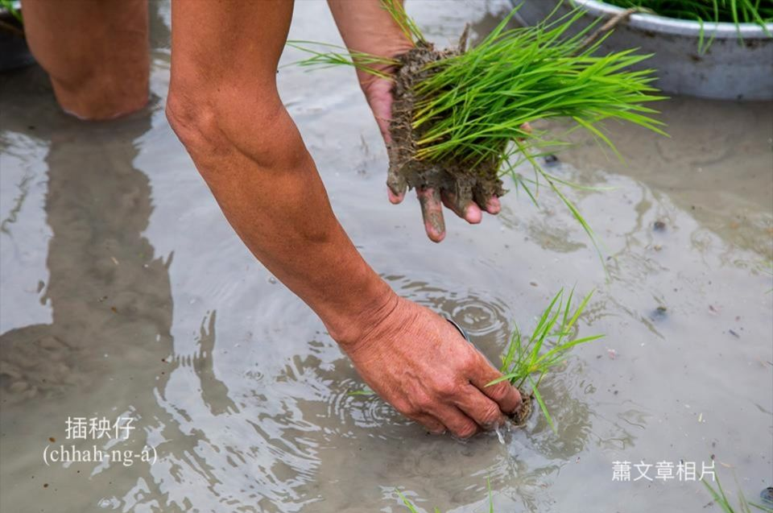

# 4. 播田家私紹介
> **Pò͘-chhân Ke-si Siāu-kài**

## 4-1. 秧船á
> **Ng-chûn-á**

秧船á阮講秧桶船á，kài-sêng腳桶，無kāng ê所在是伊ê嘴hiàn-hiàn，底khah淺，底座平平hûi-hûi，ē-tàng tī播稻á水田póe徙位。
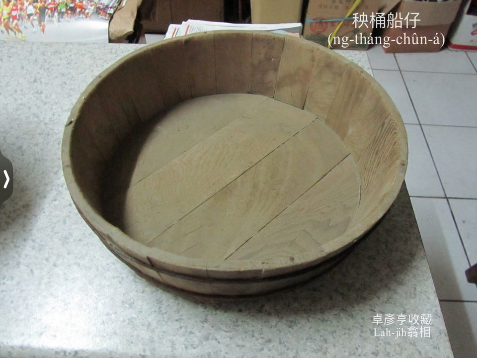
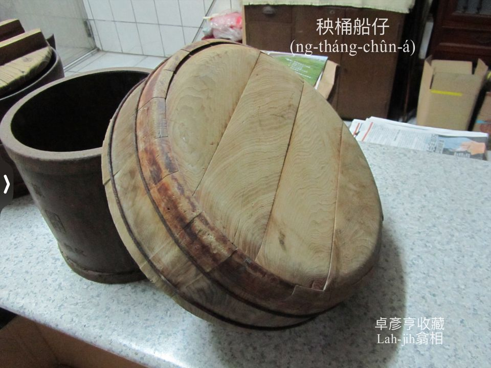

播田半khû-khiā，一直播一直倒退lu，秧船á貯秧栽khǹg tī kha-chiah後，to̍h tòe-leh póe倒退。
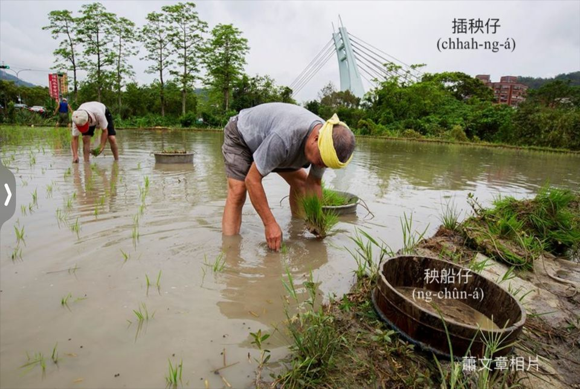

## 4-2. 秧椅
> **Ng-í**

一塊四角柴枋，釘一支尾á尖尖ê柴角á腳，隨時插tī秧chioh土腳，方便坐leh作穡，khah bē thiám。崁頂庄chit-pêng m̄-bat看--tio̍h。
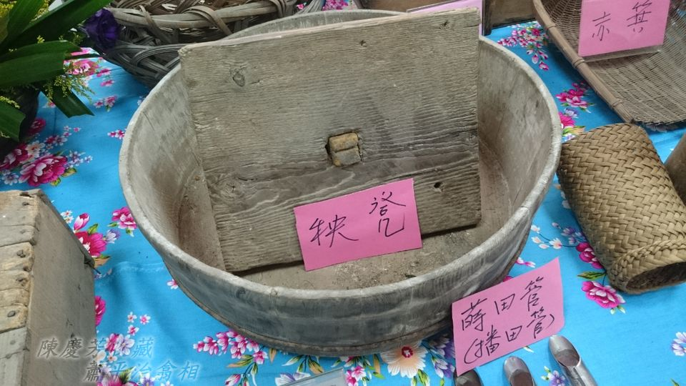
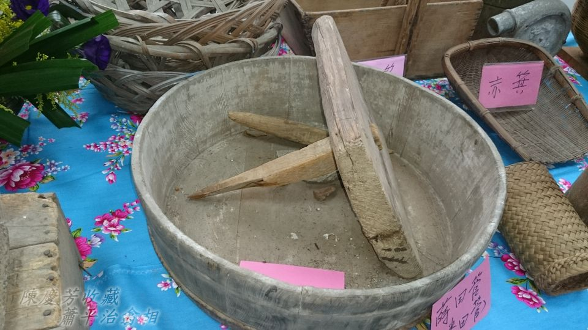

## 4-3. 插秧管
> **Chhah-ng-kóng**

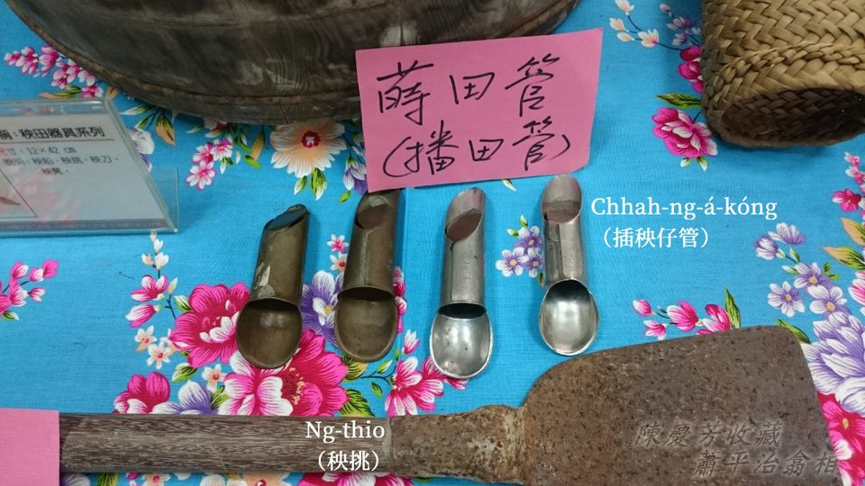
插秧管a̍h是講做播田管，阮崁頂庄chit-pêng khah罕得用--tio̍h。濁水溪埔ê田地厚沙，指頭á直接插秧á khah ē傷--tio̍h，需要播田管，tōa-pū-ong（大垺翁）套tiàm播田管，chiah hām kí指中指ni秧á，利用播田管插落田土ke真好勢，nā是指頭á有受傷，mā ē-tàng掛插秧管播田。

## 4-4. 龜骿
> **Ku-phiaⁿ**

龜phiaⁿ mā講做龜殼，竹篾á kap竹ha̍h-á做ê龜phiaⁿ，形體有影chiâⁿ-sêng龜殼，龜kha-phiaⁿ；棕簑pīⁿ ê龜殼khah重khah hip熱，形體khah無sêng龜殼。落雨天tn̄g-tio̍h播田，需要頭戴瓜笠，身穿龜phiaⁿ，雙腳半khû khiā，腰身tio̍h彎，頭殼tio̍h àⁿ，秧船á tī尻川後，人to̍h倒退lu，雙手秧á ná捻ná插，1人播6-chōa，ná驚腰痠背疼，輸人m̄輸陣，為tio̍h生活，khah苦mā tio̍h piàⁿ。
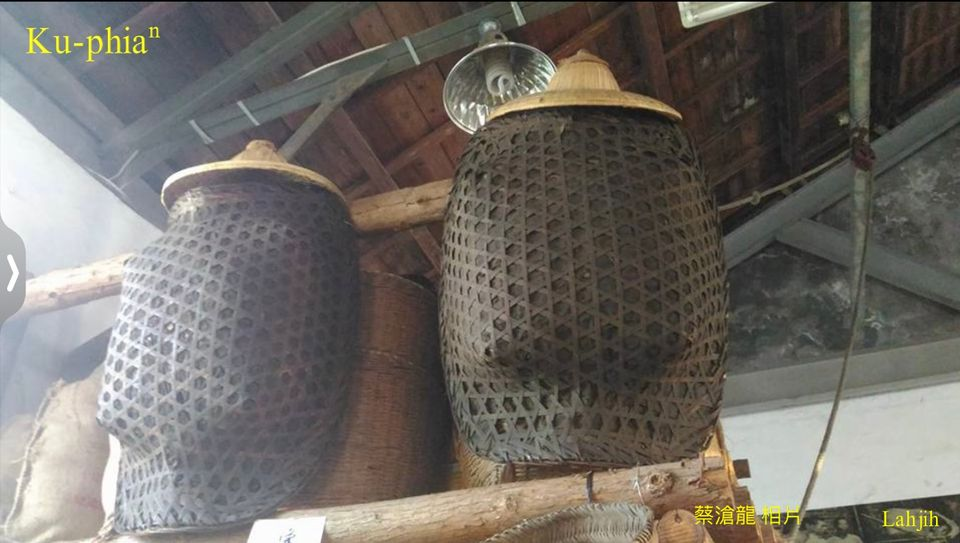
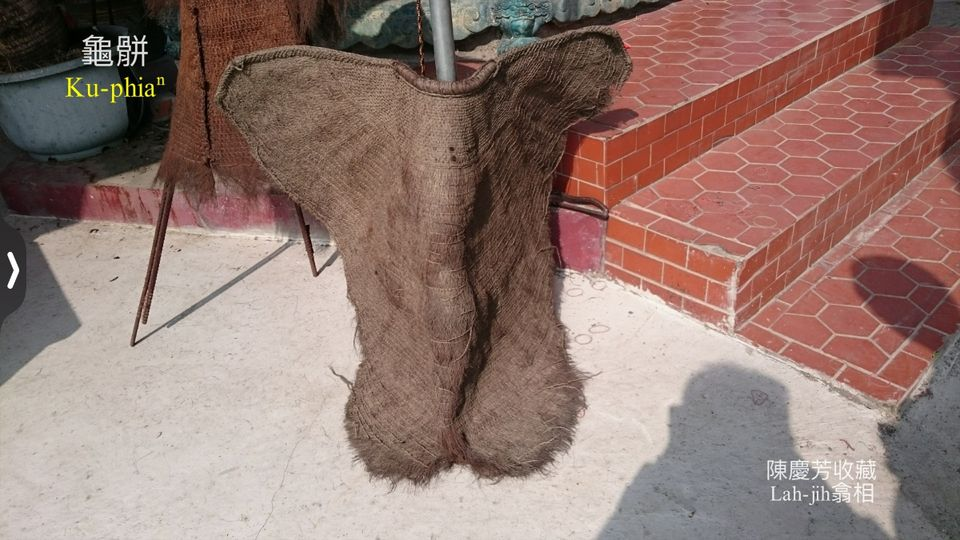

# 5. 田播了後ê Khang-khòe
> **Chhân Pò͘ Liáu-āu ê Khang-khòe**

田播了後，死欉tio̍h補插，雜草ài so，nā無稻á to̍h大了bē súi，淹水了後ài掖肥，稗á大欉ài khau，tio̍h án-ne無閒到收成。

## 5-1. Ió͘-bih秧á
> **Ió͘-bih Ng-á**

田播了，需要tī田頭田尾khǹg幾塊秧á，ió͘-bih有秧á phah-sńg時thang補插，這款補插秧á ê工課，有人講做thiap（貼）秧á。
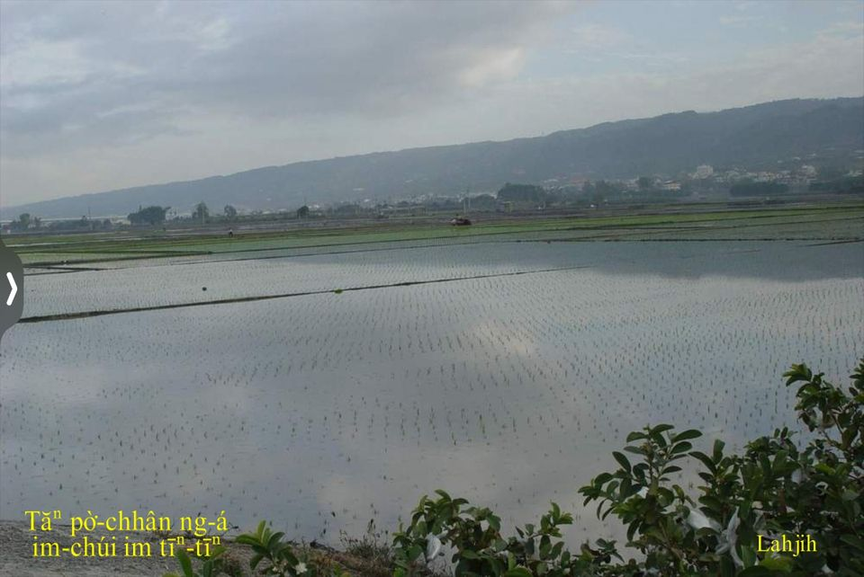

## 5-2. 補秧á
> **Pó͘ Ng-á**

秧á播好--à，田角所在khǹg一寡秧栽ió͘-bih，ió͘-bih死欉補插。
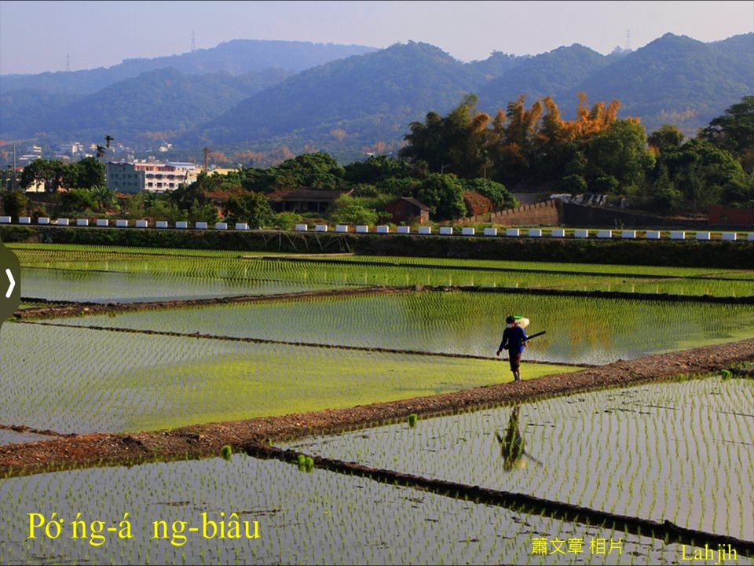
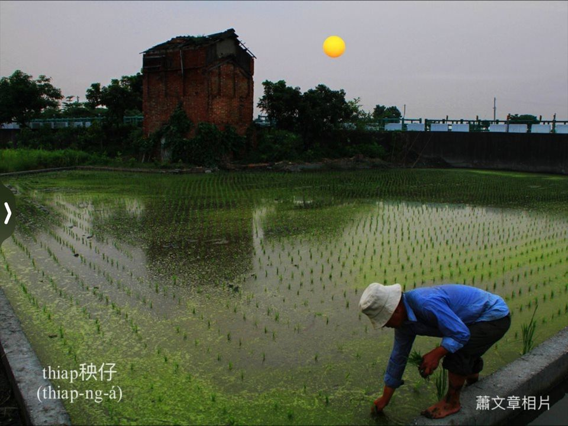
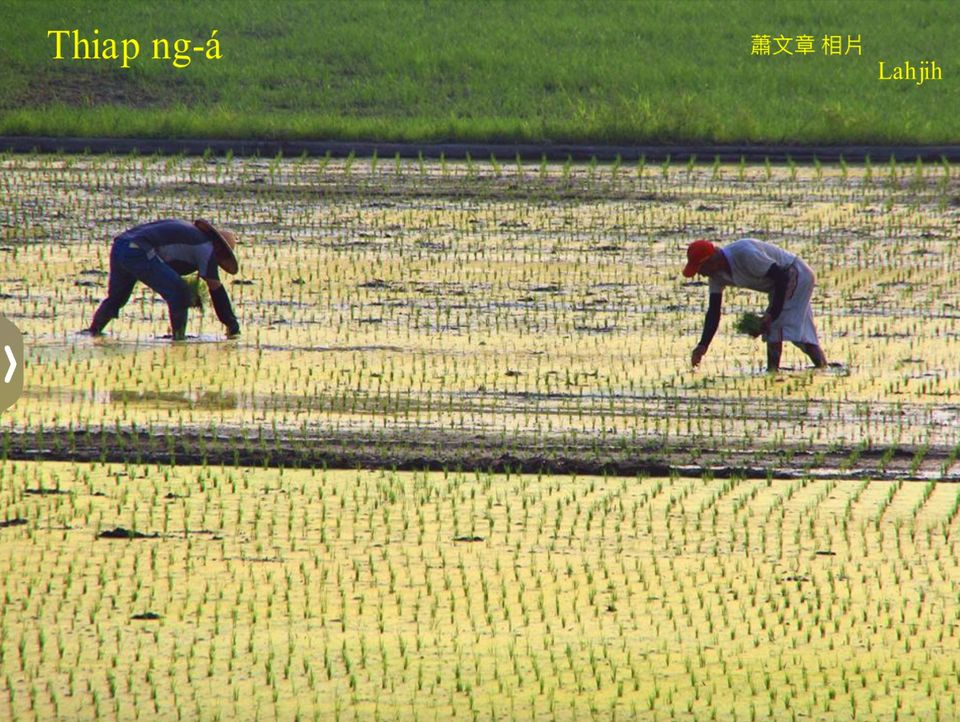

## 5-3. Khau稗á
> **Khau Phē-á**

稗á細欉ê時chiok-sêng稻á，大欉結穗to̍h顯出原形，tī稗穗iáu未sek（熟）進前，tio̍h趕緊khau hìⁿ-sak tàn掉，chiah-bē影響稻欉成長。下面第1張圖是稻á，第2張是稗á，生張無sio-siāng。
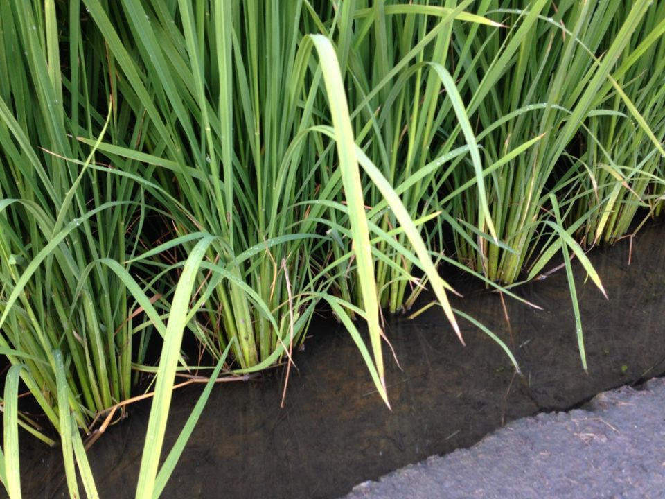
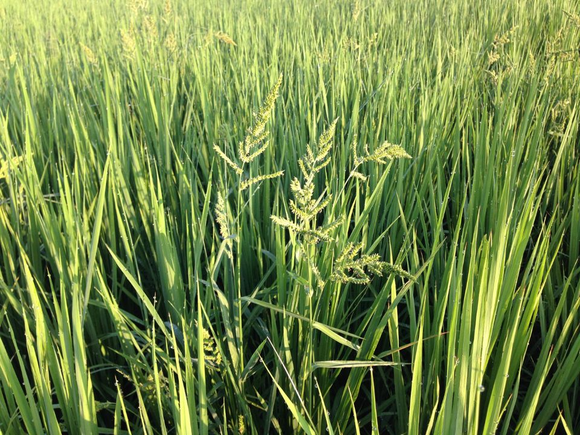

## 5-4. So草
> **So-chháu**

「無跪，bē出穗」。有跪chiah-ē飽穗。So草是跪leh so，kā雜草so-so giú-giú--leh chhi̍h落去土內做肥，hē肥chiah bē hō͘雜草吸收--去，so草so 3遍，割稻前chiah無淹水。

## 【Lah-jih散文書寫】播田So草
> **【Lah-jih Sàn-bûn Su-siá】Pò͘-chhân So-chháu**

Pò͘-chhân進前tio̍h駛田、踏割耙、手耙，捋筒loa̍h平；pò͘-chhân後tio̍h so草khau稗á。

播田插秧á tio̍h彎腰àⁿ leh播；so草需要雙腳跪tiàm田土so。

田播好十外工開始so第一遍草，so草進前先phòa田水，a̍h-sī講làu田水，落田so草tio̍h thǹg赤腳穿短褲節á，雙腳跪落田底，雙手ná so雙腳ná爬，雙手手蹄ná so ná chim-chiok，nā有雜草to̍h搣搣chhi̍h lo̍h土內sūn-sòa搣土om密，因為雜草細欉土肉軟軟，so草m̄是kài困難。總--是跪leh so草mā m̄是輕鬆khang-khòe，熱--人tio̍h等軟晡，落雨天tio̍h phāiⁿ ku-phiaⁿ（龜骿）戴瓜笠。

So草了後當日tio̍h下肥，隔一兩工chiah koh淹田水。

第一遍草so了隔十外工so第二遍，同款tio̍h phòa田水、so草、iā肥、淹水，koh làng十外工so第三遍草，下肥了後無koh淹水，土肉慢慢ta-khok pit-sûn，pit-sûn ná pit ná大li̍h，pit到水蛙á跳bē過chiah koh淹水，田水食入深土底，稻á to̍h歡喜大欉到飽穗，chit時稗á tāi-seng吐穗看現現，tio̍h趕緊khau hìⁿ-sak，koh來to̍h是等割稻á。

聽作田超過一甲子蕭興森先生說明，chiah知作田人除了辛苦，mā是真有學問。

## 【Lah-jih台灣俗語】
- 播田播無chōa，ngeh肉kiap相拖。
    > Keng-thé kut-la̍t食ham-bān做。

- 無跪bē出穗。
    > O-ló作田人，kut-la̍t作穡to̍h有好收成。

- 水濁草to̍h無。
    > Keng-thé so草siuⁿ潦草，o͘-ló͘-bo̍k-chè so準tú好。有爬--過，田水濁濁，lia̍h準已經so草。

# 6. 稻á Sêng-se̍k ê過程
>  **Tiu-á Seng-se̍k ê Kòe-têng**

## 6-1. 抽穗
> **Thiu-sūi**

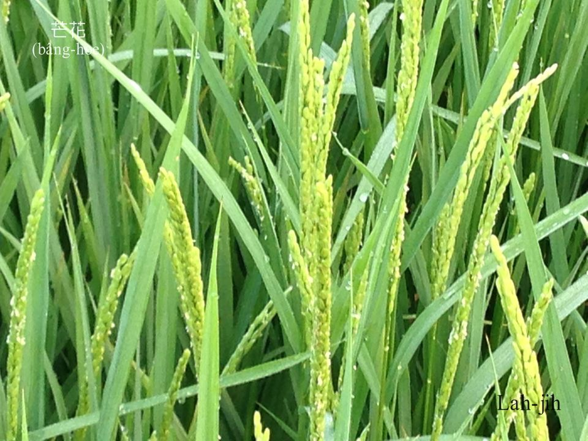

## 6-2. 芒花
> **Bâng-hoe**

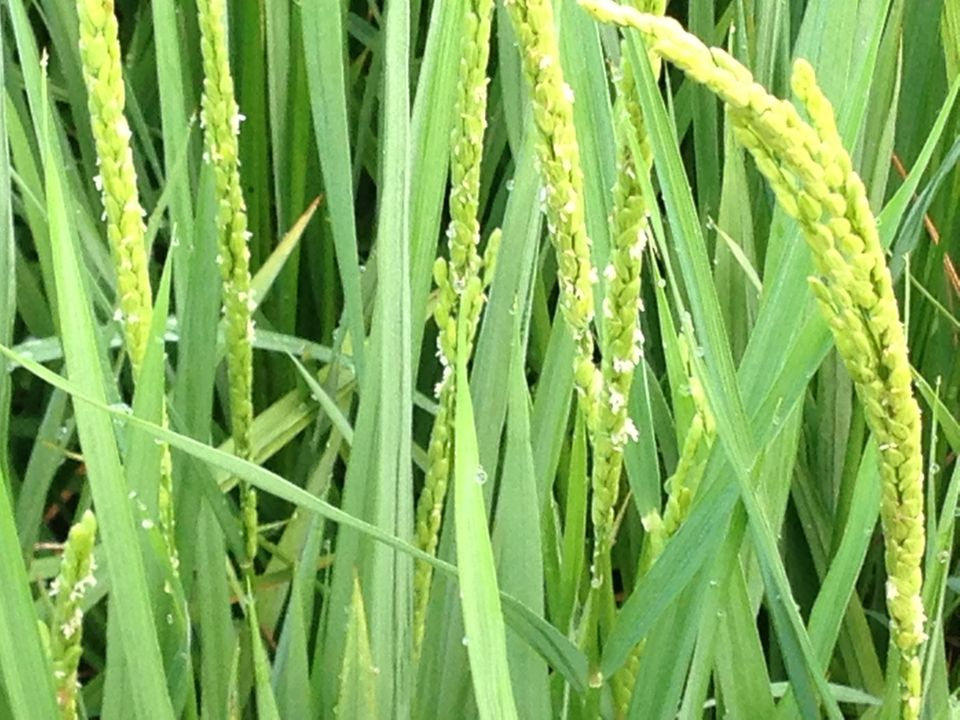

## 6-3. 飽穗
> **Pá-sūi**

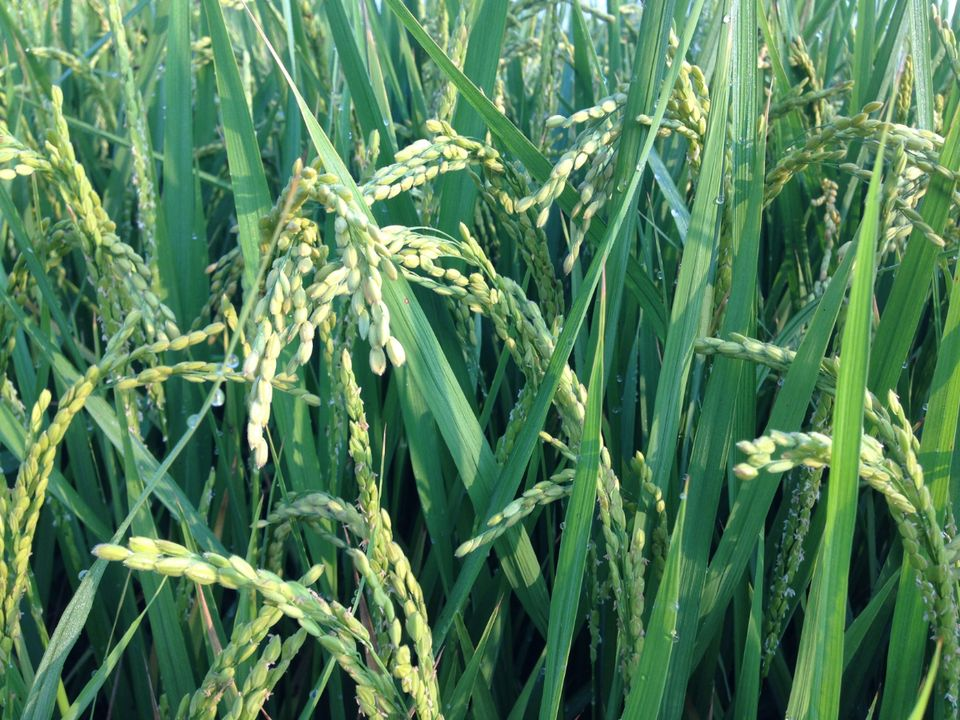

## 6-4. 鉤頭
> **Kau-thâu**

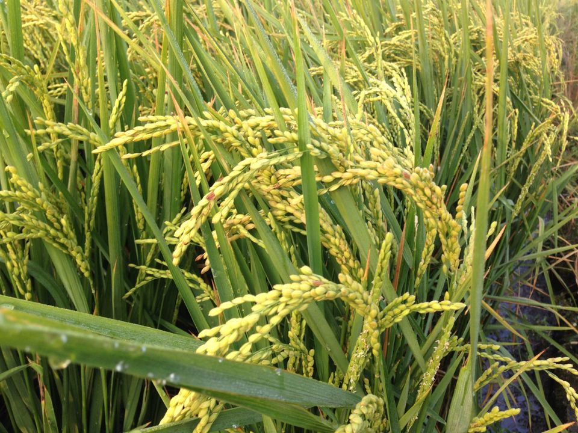
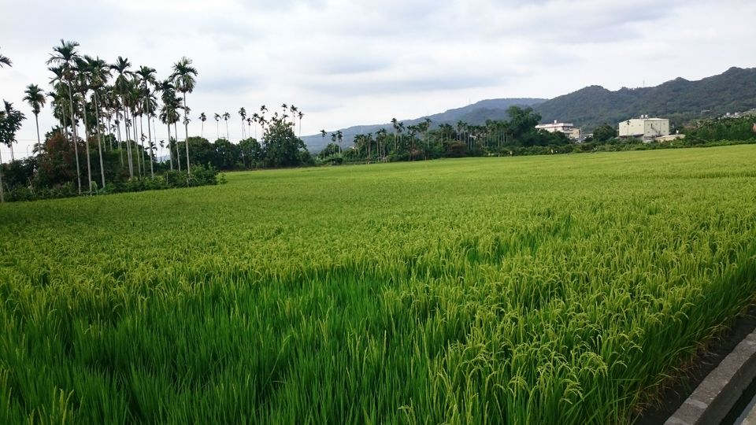

## 6-5. 催黃
> **Chhui-n̂g**

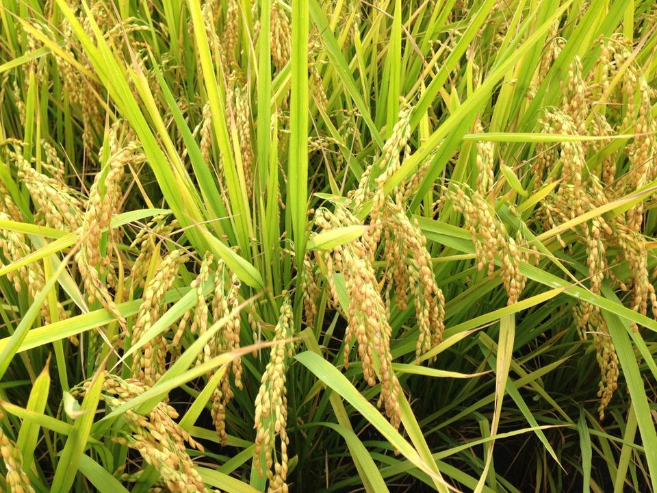

# 7. 土地公柺
> **Thó-tī-kong-koáiⁿ**

8月15是大節，是福德正神土地公ê成道日，除了做紅龜粿thâi精牲á拜神明，暗時Koan-goa̍t-hōe（觀月會）以外，作田人為tio̍h種作有khah好ê收成，ē kā土地公伯--à ê神尊用神轎請出來se̍h街。Ah！M̄是，是ka扛出來chhân-iûⁿ-á（田洋á）巡視，保庇農作物ē-tàng豐收，而且家家戶戶ē tī田--裡chhāi土地公枴，送1-sut-á所費kap 1支枴á hō͘土地公伯--à，khah工夫ê庄頭ē tī廟埕做戲祝賀。
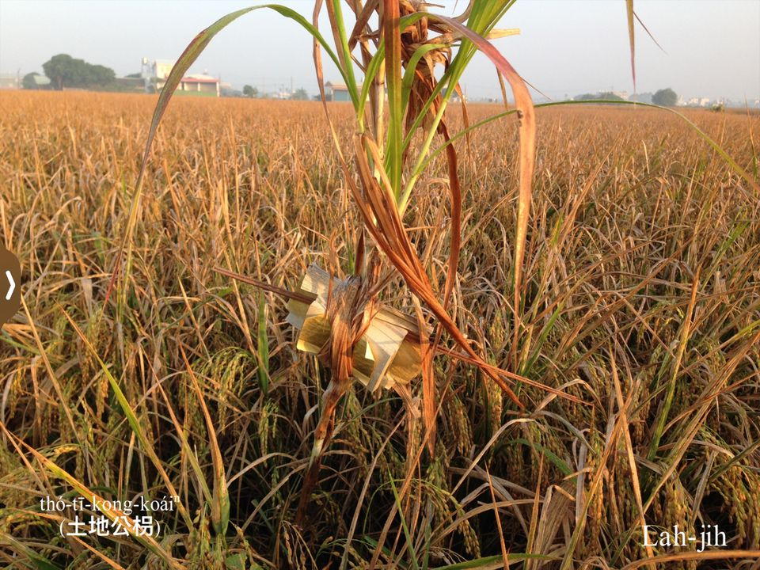

## 【Lah-jih散文書寫】土地公柺
>**【Lah-jih Sàn-bûn Su-siá】Thó-tī-kong-koáiⁿ**

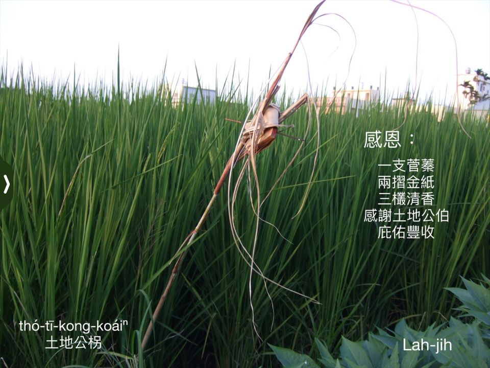
8月15 tăⁿ過，天光日boeh暗á時，騎鐵馬se̍h田洋á路，看見稻á已經出穗，有ê koh頭鉤鉤，tit-boeh sek (熟)--á，m̄知作田人有送枴á hō͘土地公giâ--bô？

鐵馬ná踏ná斟酌，看田--裡有chhāi土地公枴--bô？鐵馬騎過1-khu koh 1-khu，thái ē lóng無人chhāi？Kám講chit-má ê作田人m̄知影感恩？A̍h是in無ài koh迷信？騎過隔壁湖，歡喜一下，總算是chhōe-tio̍h有人chhāi土地公枴--à，趕緊鐵馬停--落-來，kā翕相機提--出-來，準備翕一張á相，siáⁿ知目chiu  chi̍t-ē chîn，tang-sî-á是警告人ê空農藥罐á。莫怪--ò͘，人有影現實，有農藥來毒殺蟲thōa，總是比土地公伯--à khah靈聖，ná tio̍h koh拜託土地公伯--à tàu保庇--leh！

鐵馬騎過1湖koh 1湖，日頭已經boeh落海，忽然間，田頭hit-pêng ná有1欉菅蓁á，頂面koh縛3支香、1-chí土地公金，he，kám m̄是土地公枴？好ka-chài，chia ê作田人猶原iáu有良心，知影對土地ê感恩，土地公伯--à iáu有leh巡咱ê田園，趕緊翕相做記錄。

福德正神土地公，是大多數台灣人ê守護神，m̄-nā田頭田尾土地公保庇作田人ê穡頭，mā保庇生理人、做工人ê趁食平安順序，koh khah是咱祖先ê好朋友。8月15 chhāi土地公枴ê民俗，tī發達ê今á日，有人ka看做是1種迷信，相信科技比求神問佛祖koh-khah有效ê人愈來愈chē，這應該是好現象，m̄-koh人無koh相信神ê存在，無koh敬天愛大自然，kan-nā相信科學ê萬能，有一工萬能ê科學nā代替萬能ê神，hit ê時陣ê人是boeh án-chóaⁿ kap大自然取得平衡，快樂過日--leh？

> —— 2009/10/16 蕭平治

# 8. 現代ê秧Chioh kap插秧á方式
> **Hiān-tāi ê Ng-chioh kap Chhah Ng-á Hong-sek**

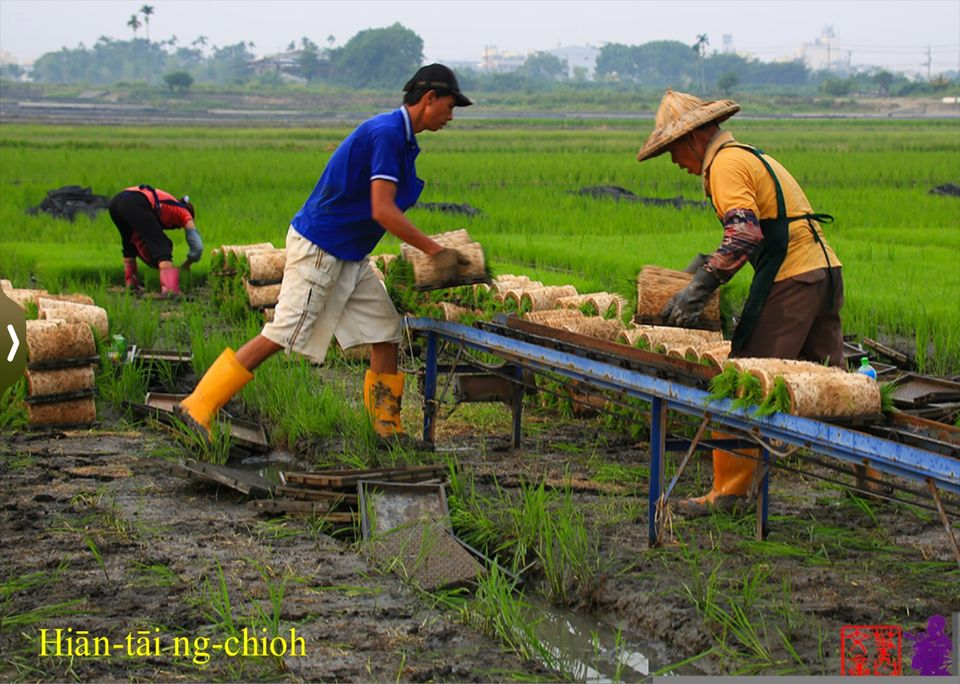
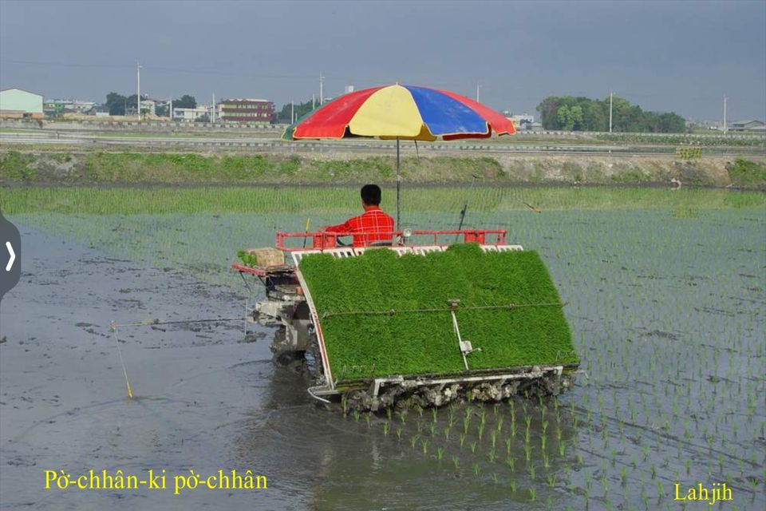

# 9. 註解
> **Chù-kái**

|**詞**|**解說**|
|作田|Choh-chhân；作，有規劃創造ê意涵。|
|tī chia|『在這裡』。|
|khang-khòe|工課，『工作』。|
|黃麻|黃麻n̂g-môa，楊麻iûⁿ-môa，無kāng品種，阮慣勢kā黃麻講做iûⁿ-môa。|
|ná有／nā有|Ná有『哪有』；nā有『若有』。|
|toè／Tè|跟tòe，『跟在後面』。|
|tio̍h-koh|『需要再』。|
|ùi hia來；tùi chia去|Ùi hia lâi；tùi chia khì，『從哪兒來；往那裡去』，ùi是From『從』，tùi是 to『往』。|
|khû|『蹲著』。|
|àⁿⁿ-àⁿ|『彎腰下腑』。|
|倒退lu|Tò-thè-lu，『倒退走』。|
|liàm秧á|Liàm捻，『以手指捏取』。|
|tu̍h落去|Tu̍h，『像尖刀那樣插下去』。|
|póe向後|『往後撥』。|
|hûi-hûi|『圓圓沒突出狀』。|
|半khû khiā|『半蹲立』。|
|心適興|Sim-sek-hèng，『隨興』。|
|1-chōa|『一趟／一列／一排』。|
|ngeh肉|『夾肉』。|
|kiap|『夾在一齊』。|
|keng-thé|『以譬喻或含沙射影的方式罵人』。|
|ió͘-bih|日來詞，よび ，『預備』，備用ê意思。|
|phì-siùⁿ|『尖酸的諷刺、奚落』。|
|kut-la̍t|『認真，勤快，勤勞，努力』。|
|kài-sûn|『劃線』。|
|ni|『用手指輕輕地取物』。|
|tn̄g-tio̍h|『遇著』。|
|tang時／tang時á|Siáⁿ-mih時陣；『什麼時候』。|
|tang時á是án-ne|『原來是這樣』。|
|hit-tang-sî／hit-tong-sî／tong-sî（當時）|Hit ê時陣，『那個時候』。|
|tī tang時|Tī siáⁿ-mih時陣；『在什麼時候』。|
|土地/田土|土地thó͘-tē，土地公thó-tī-kong；田土chhân-thô͘，土腳thô͘-kha。|
