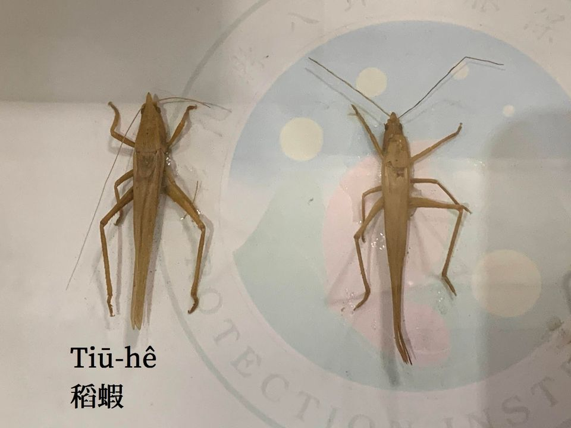
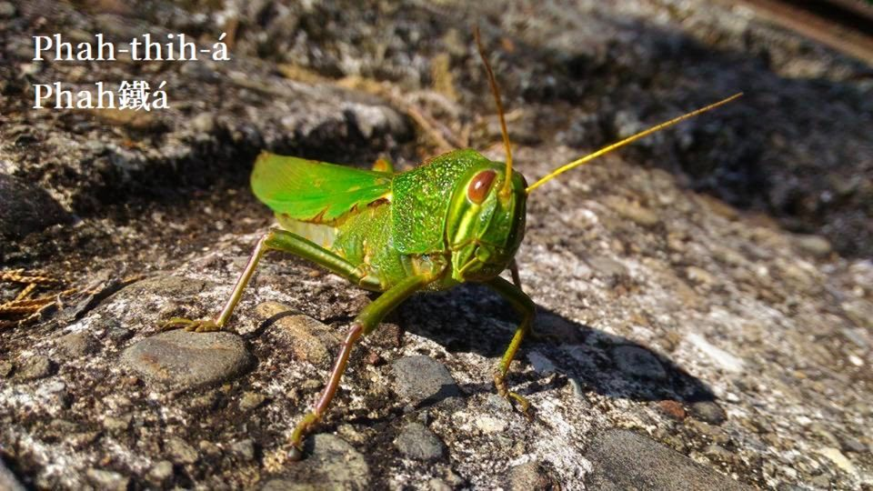
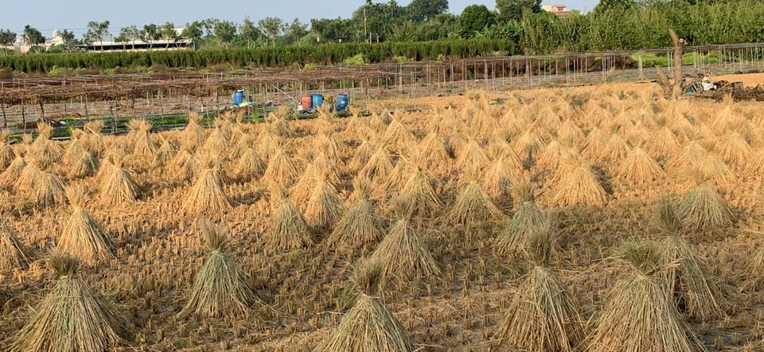

# 曝粟──準備收藏、買賣
> **Pha̍k-chhek──Chún-pī Siu-chông, Bé-bē**

# 1. 曝粟記事
> **Pha̍k-Chhek Kì-sū**

Kap割稻á班kāng時進行ê khang-khòe是曝粟，割稻á tī田--裡，曝粟á tī門口埕，cha-po͘人tiàm田園piàⁿ kah大粒汗細粒汗，cha-bó͘人tiàm門口埕、灶腳無閒到無時間láng裙koh發嘴鬚，hām gín-á人mā tio̍h tàu-saⁿ-kāng，只有食奶gín-á免振動，不時mà-mà-háu大聲哭，無人chhap--i ná新婦á。

門口埕早tio̍h掃清氣，thèng-hāu粟á一擔一擔taⁿ--轉-來，大拖、pê-put、鉛線jiáu-á隨時sū-hāu，大拖 kā tâm粟pê ho͘開，chiah koh用pê-put pê ho͘平，鉛線jiáu-á kā草hiūⁿ jiàu徙位，另外處理，草hiūⁿ to̍h是絞無清氣ê稻穗kap稻葉á，留--落-來ê tâm粟開始曝日頭，chiah koh kō͘ pê-jiáu-á kā幼葉幼草jiàu清氣，sòa--落-去tio̍h掌握時間趕緊入灶腳煮點心，nā有làng縫tio̍h hō͘食奶gín-á食奶食ho͘飽，灶腳當leh無閒chhih-chhih，外口又koh人leh喝hiu：「粟á擔koh轉--來--à--ò͘！」

讀冊gín-á tn̄g-tio̍h歇睏a̍h是放學轉--來tio̍h tàu顧gín-á tàu趕雞，雞chhéng giâ--leh liâm-mi走東liâm-mi往西，m̄-nā雞á鳥á ē來食，鵝鴨kāng款ē來lo，食久ē驚--人。看tio̍h大人taⁿ粟轉--來，cha-bó͘人to̍h-koh開始無閒，gín-á siāng歡喜，阿爸阿兄竹笠á頂seh稻蝦、草蜢á，稻蝦pû來食，phah-thih-á lia̍h來sńg，歡喜笑bún-bún。

收早冬粟siāng緊張，收割時間tú好tī風颱期，時常tn̄g-tio̍h西北雨，he西北雨雖bóng落bē過田岸，m̄-koh nā tn̄g-tio̍h he o͘-kha-sai-lâm（烏腳西南）phĕ to̍h到，一下無注意，趕bē赴收粟khàm稻草，mài講10分鐘，kan-nā ak tâm 2分鐘tio̍h hō͘你食bē-ta，真正無彩leh曝kui晡，nā是koh連sòa落3-4工，he to̍h去了了，粟á puh芽，只好做飼料，分鵝á鴨á食。

所以曝粟時陣，cha-bó͘人對烏腳西南特別敏感，特別細jī，看nā天氣有koh-iūⁿ，to̍h隨時leh斟酌西南pêng，看nā西南部半天koân所在，雲轉烏，有人大聲喝「趕緊來收粟--ò͘！」無kā你騙，真正總動員，厝宅內父老兄弟姊妹，大人gín-á隨時chiâu倚--來，m̄免分配，有力--ê hōaⁿ大拖，大人拖索á，1-pê 1-pê pê像山，有人giâ pê-put tòe後pê，chiah koh掃梳掃，一目nih像山ê粟堆pê好勢，gín-á人、婦人人、老歲á人mā kōaⁿ稻草chhoân便便，等待腳手猛lia̍h大人1-cháng 1-cháng khàm頂頭，速度走贏西北雨，喘一下氣，好ka-chài，天公伯--à有保庇。

粟á boeh ta tio̍h曝kúi-nā工，日頭愈猛愈快ta，六月天ta̍k工曝日to̍h食bē-ta，pê粟lāng草hiūⁿ chiâⁿ chhiah-ia̍h，瓜笠á、手kiáu、包巾是cha-bó͘人必備裝備，pê-put pê粟1-lêng koh 1-lêng，1-20分鐘後tio̍h pê péng pêng，pê來pê去m̄知tio̍h pê幾遍，tio̍h等暗--來收粟chiah ē-tàng歇thiám，明á載kāng款tio̍h koh péng tio̍h koh曝。

# 2. 草Cháng處理方式
> **Chháu-cháng Chhú-lí Hong-sek**

稻摔絞了隨有人tòe leh cháng草，先taⁿ一寡草cháng轉去門口埕，準備khàm粟堆用，chhun--ê tiàm田--裡曝ta了後chiah taⁿ轉去thia̍p草pû。

## 【Lah-jih散文書寫】西北雨，落bē過田岸
> **【Lah-jih Sàn-bûn Su-siá】Sai-pak-hō͘ Lo̍h Bē Kòe Chhân-hōaⁿ**

早起六點半，日頭已經浮chiūⁿ山，門口埕hit三四堆像山ê粟堆，已經thán平pê-lêng leh曝日，向望今á日ê日頭赤iāⁿ-iāⁿ，曝kah日頭落海進前，看有thang鼓粟入倉--無，nā koh來一陣西北雨，可能tio̍h-ài延chhiân到後--日。

Thiāu-á內kāng竹圍--ê七八ê cha-bó͘人，互相放伴曝粟、趕雞á鳥á、搖gín-á兼煮食，cha-po͘人lóng tī田--裡割稻，無閒chhih-chhah曝kah汗ná流ná滴，in liâm-mi tio̍h-beh轉來taⁿ點心，bē赴人食是做無khang-khòe…

「五嬸--à，你好心gín-á kâ搖--一-下，鼎tng-leh滾，是行bē開腳--leh！」

「大姆--ō，chiah-ê草hiūⁿ kā我tàu jiàu-jiàu--leh，無hō͘ gín-á食奶bē使--chit，siuⁿ iau去--à！」

「A-Jih--ê！Khah緊來tàu趕雞á！」

「粟擔koh轉--來--à！Ta̍k-ke來tàu jiàu粟，Jih--ê，來--一-下，chit隻稻蝦hō͘--你。」

無閒，時間過了特別緊，一目nih已經下晡時二點外。

無張無持：「Khah緊--leh！Ta̍k-ke緊出--來--ò͘，大拖，pê-put，gín-á khah緊kōaⁿ稻草，西北雨tī-beh到，大姆二姆恁ka看，西南pêng烏天暗地罩烏雲，無khah緊收ē收bē赴。」

「有影to-tio̍h，烏腳西南liâm-mi到，我看今á日恁chiah-ê粟á是bē鼓--得。」

Ná pê ná會，一目nih-á粟堆堆像山，gín-á兄gín-á姊，koh ná leh走相jiok，chông kah chiâⁿ歡喜。

「稻草tio̍h khàm khah好勢--leh，nā hō͘水sia̍p--入-去，粟á nā puh芽to̍h無彩咱leh piàⁿ，天公疼戇人，天公伯--à！你to̍h m̄-thang落siuⁿ久！」

無十分鐘，粟堆khàm好勢，斤外重ê雨滴隨時到，phi-phi-phia̍k-phia̍k落十外分鐘，liâm-mi來，liâm-mi停，雨過天清，「Ta̍k-ke來--ò͘！Koh來pê粟曝粟，看ē-tàng曝過工--無！」

西北雨，直直落，鯽á魚，beh娶bó͘。

Ko͘-tai兄，phah鑼鼓，媒人婆--a土虱嫂，

日頭暗，chhōe無路，趕緊來，火金姑，

做好心，來照路，西北雨，直直落。

西北雨，直直落，白鴒鷥，來趕路。

Poâⁿ山嶺，過溪河，chhōe無siū，poa̍h一倒，

日頭暗，beh chóaⁿ好，土地公，土地婆，

做好心，來chhōa路，西北雨，直直落。

—— 台灣童謠

「西北雨，落bē過田岸」ê奇景，tio̍h-ài田--裡曠野chiah看ē tio̍h，liâm-mi到，liâm-mi停，是伊ê特色，mā有he頂khu落kah hō͘人戴瓜笠moa棕簑，下khu卻是無半滴。Siāng稀奇koh趣味--ê，to̍h是細漢讀冊時，下晡放學beh轉--去，行到半路tn̄g tio̍h烏腳西南beh落西北雨，因為無穿雨moa，ko͘-put-lī-chiang半行半走，走hō͘雨jiok，走到厝內，雨mā jiok kah門腳口，雖然phīⁿ-phēⁿ喘，kui身軀koh ta鬆ta鬆，連一滴雨sap-á都無lâm--tio̍h，「西北雨，落bē過田岸」，che是事實，m̄是leh講怪奇。

# 3. 註解
> **Chù-kái**

|**詞**|**解說**|
|seh|『把東西塞進孔縫內』。|
|稻蝦|Tiū-hê，『大剪斯』。|
|phah-thih-á|草蜢á，『蝗蟲』。|
|pû|『埋在炭火內燒番薯番麥』。|
|phĕ to̍h到|Phĕ to̍h kàu，『驟雨聲phĕ響，雨即時到』。|
|趕bē赴|Kóaⁿ bē-hù，『來不及』。|
|ak tâm|『淋溼』。|
|食bē-ta|『受不了，吃不玩，兜著走』。|
|kui晡|Kui-po͘，『老半天』。|
|烏腳西南|O͘-kha sai-lâm，台灣西部地區，熱--人西南pêng nā有烏雲，真緊雨to̍h到。|
|koh-iūⁿ|Bô-kāng-khoán，破病，『生病』。|
|草hiūⁿ|To̍h是絞無清氣ê稻穗kap稻葉á。|
|lāng草hiūⁿ|Kā草hiūⁿ 『弄一弄，由風頭吹向風尾』。|
|lêng|『隆起成長條形的稻穀』。|
