# 粟á kap其他資源收藏
> **Chhek-á kap Kî-thaⁿ Chu-goân Siu-chông**

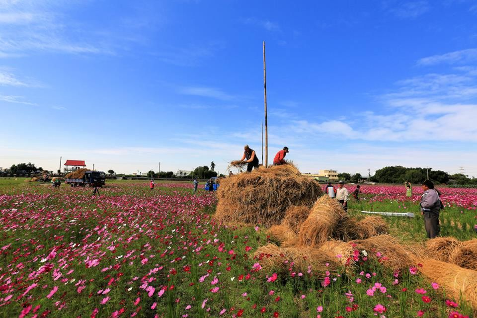

# 1. 粟á收藏設備
> **Chhek-á Siu-chông Siat-pī**

粟á是重要ê收藏，án-chóaⁿ講？厝內ta̍k工tio̍h ài食飯，存糧是kài要緊ê tāi-chì，無米thang煮--à，put kóa粟á來絞做米。過日大細項tāi-chì tio̍h ài銀錢，粟á mā thèng好thang來lúi現金，應付生活欠用。

## 1-1. 粟倉á
> **Chhek-chhng-á**

古早二伯人客間á厝後，有拖iap-á做粟倉，需要密chiuh-chiuh預防niáu鼠偷食，chhiān枋門厝內外各設置1-ê。
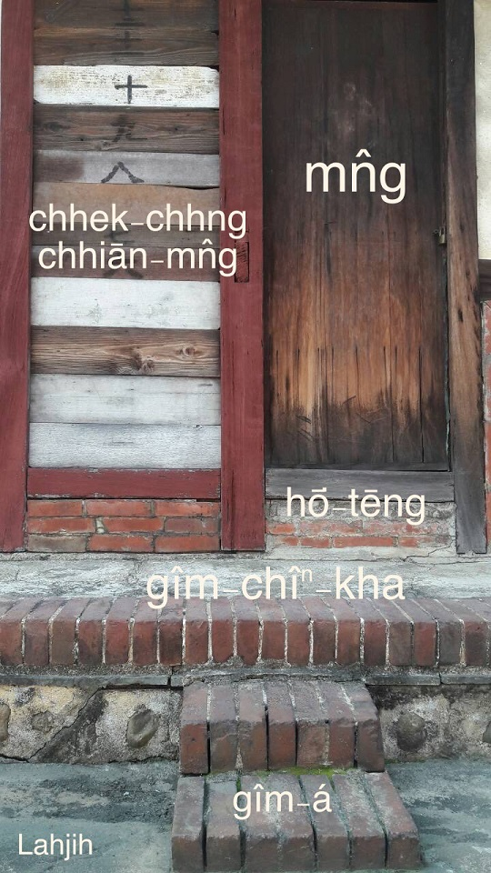
正pêng是出入門，tò-pêng是粟倉á門，寫一二三四號碼ê chhiān枋。

## 1-2. Ka-tî-á
用竹管kap粗竹篾á ut 1-ê扁siân扁siân，像soāiⁿ-á子型ê粟倉，外面糊牛屎攪紅土、紙棉，號做ka-tî-á。厝間chē ê家庭khǹg厝內，厝間少ê家庭khǹg厝後gîm-chîⁿ腳，無蓋，用布袋khàm，不管時tio̍h斟酌niáu鼠á偷食，put粟需要樓梯a̍h是koân椅thiap腳。
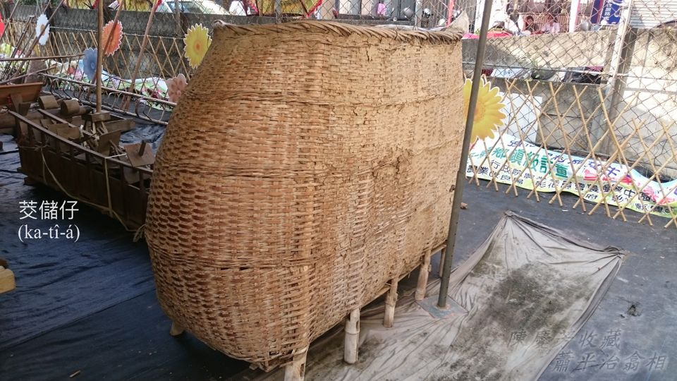
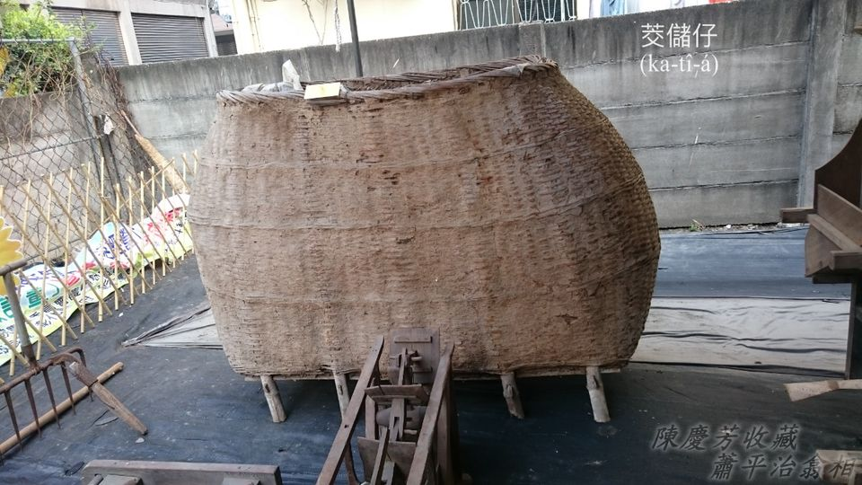
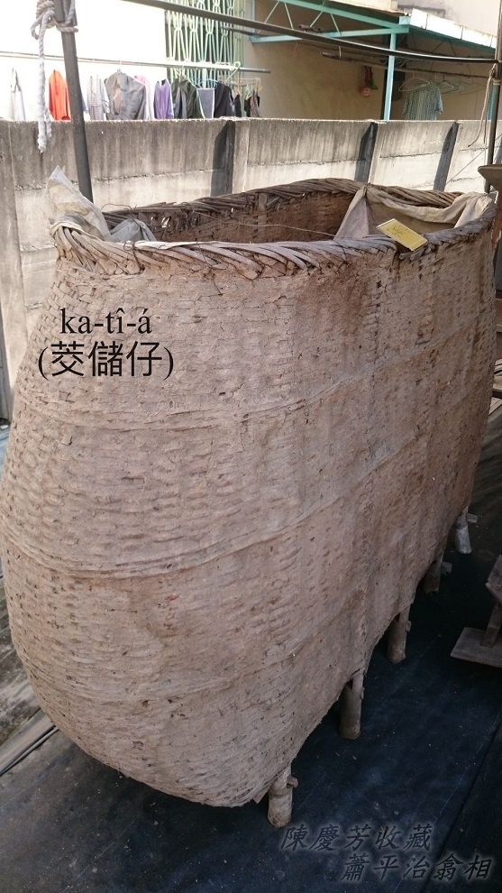

## 1-3. 鼓亭笨
> **Kó͘-têng-pūn**

作田人講khǹg tī厝外，形體親像thong-kó͘（通鼓）有khàm厝蓋ê粟倉，號做pūn-á，a̍h是kó͘-têng-pūn。
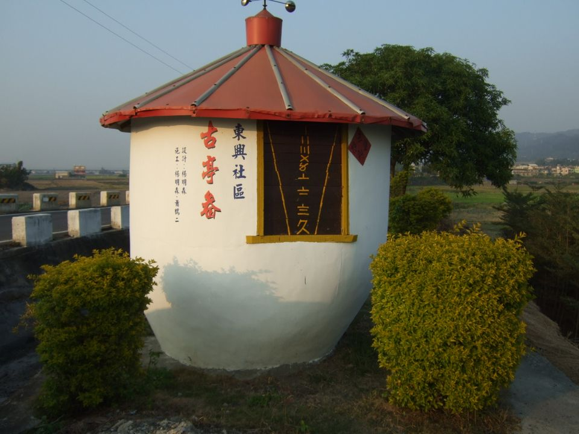
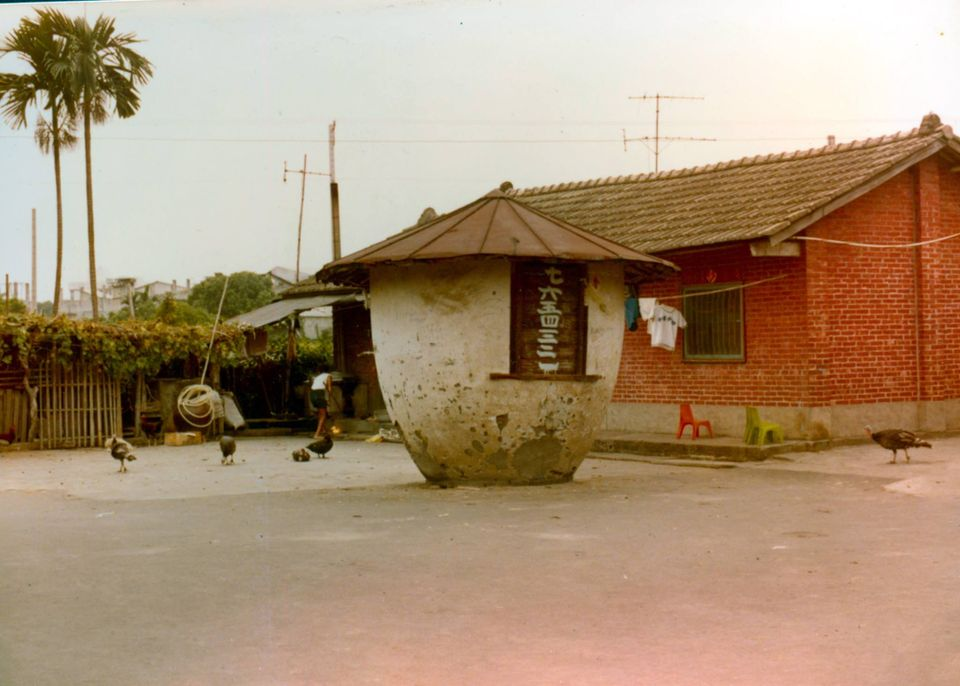

Kó͘-têng-pūn是一種通鼓型有khàm尖形厝蓋ê粟倉，khǹg tī厝外，有chhiān枋，chhiān枋寫一 二 三 四 五 六 七 八 九，a̍h是寫台灣碼〡 〢 〣 〤 〥 〦 〧 〨 〩，需要按順序chhiān。

> 「Pūn」台日大辭典漢字寫做「笨」，解說「七支竹包麻布khǹg tiàm栜桶來防止粟飛散ê物件。」Koh有「笨á篙」是做笨á用ê竹篙。

稽考：Kó͘-têng-pūn，漢字是古亭笨？A̍h是鼓燈笨？其實lóng m̄著，是「鼓亭笨」chiah-tio̍h。古早有「鼓亭」，to̍h是khǹg鼓ê亭á，親像下面chit張圖。
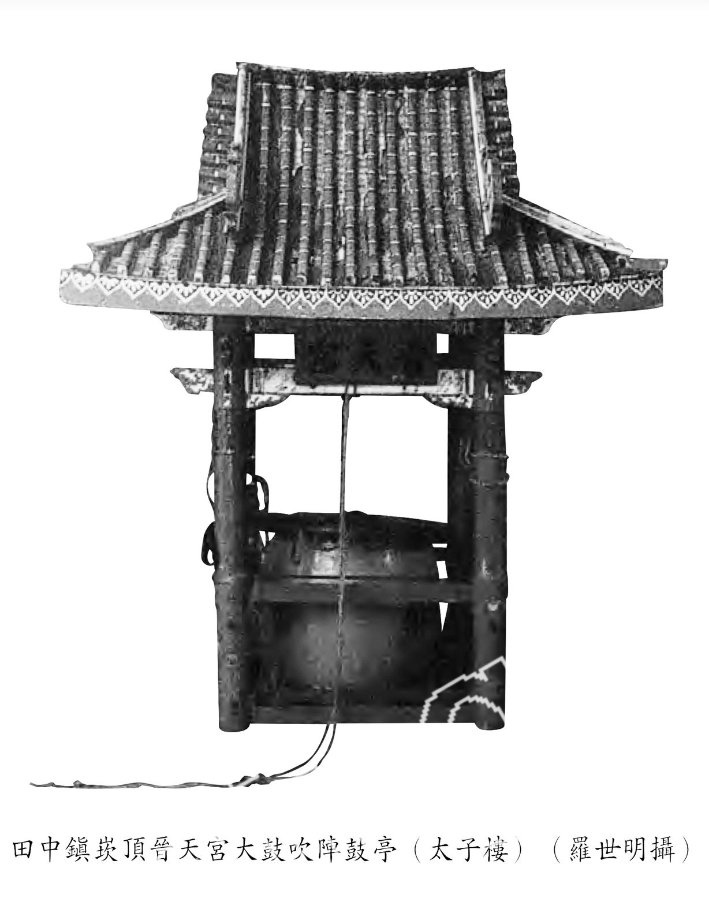

Kó͘-têng-pūn ē-tàng貯粟、粟包，mā ē-tàng khǹg農具家私，內面chiâⁿ闊。

Ùi chit句俗語「頂半暝niáu鼠偷食恁tau ê粟，下半暝niáu鼠偷食咱tau ê栗。」Ē-tàng了解粟倉、ka-tî-á是設置tī厝內，a̍h是房間後gîm-chîⁿ腳。

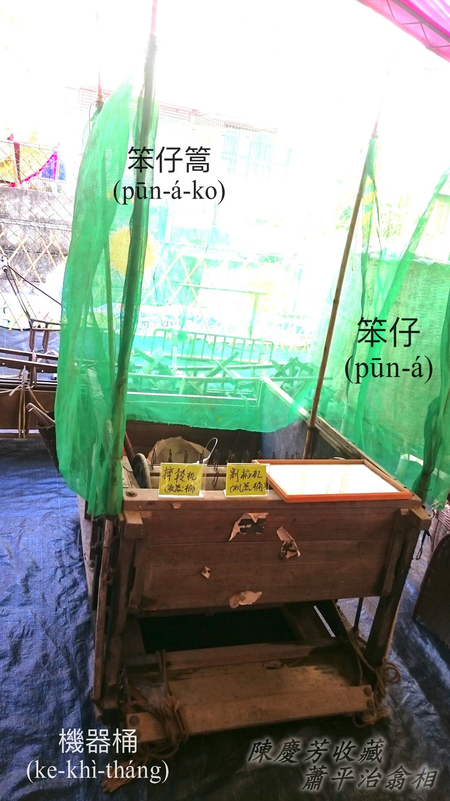

# 2. 稻穀試熟度器具
> **Tiū-kok Chhì Sek-tō͘ Khì-kū**

稻穀收成，寄農會納錢糧，換肥料，需要入農會粟倉，hō͘ in檢驗曝了有ta a̍h無，所以tio̍h ài抽樣檢查，通過檢驗器chiah ē-tàng入倉。
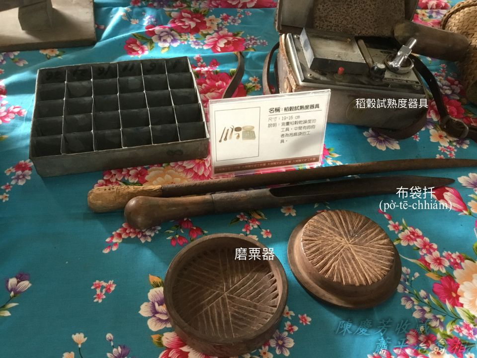

## 2-1. 布袋chhiám
> **Pò͘-tē-chhiám**
  
Chhiám布袋取樣本。
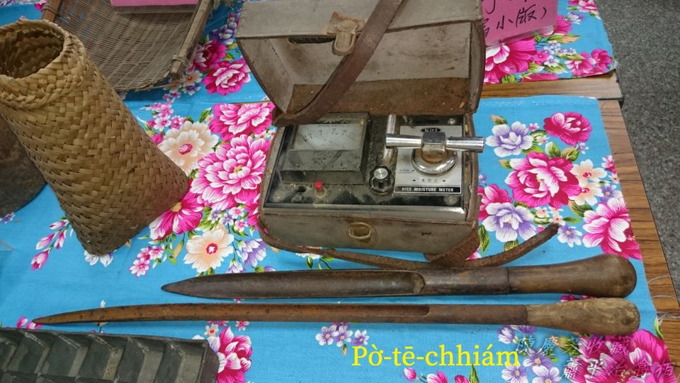

## 2-2. 磨粟器
> **Bôa-chhek-khì**
  
粟á樣本需要磨出米粒做檢驗。
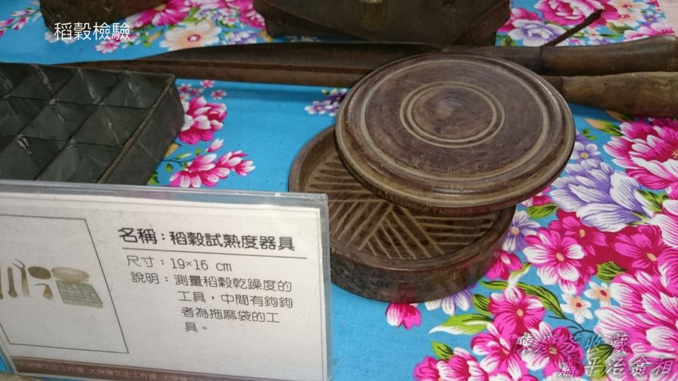

# 3. 米絞／土礱間──粟á脫殼絞做米
> **Bí-ká/ Thô͘-lâng-keng──Chhek-á Thoat-khak Ká Chò Bí**

Bí-ká（米絞）是米絞間ê簡稱，古早講做thô͘-lâng-keng（土礱間），開米絞ê生理人本錢真粗，ē-sái-tit提供作田人thiò-chhek（糶粟），tia̍h-bí（糴米）、，koh ē-tàng賒欠，方便lúi現金，解決「無米煮番薯湯」ê bô-siá-sì。當然土礱間頭家1-tia̍h 1-thiò，一賒一欠趁真chē。

原理kap石磨kāng款，土礱是用篾á pīⁿ外殼，內面舂紅土，挨粟hō͘粗糠糙米分離，bē géng破米粒。
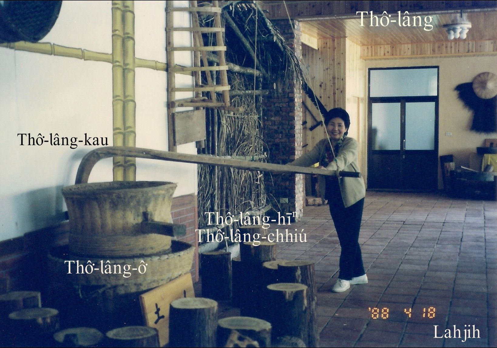
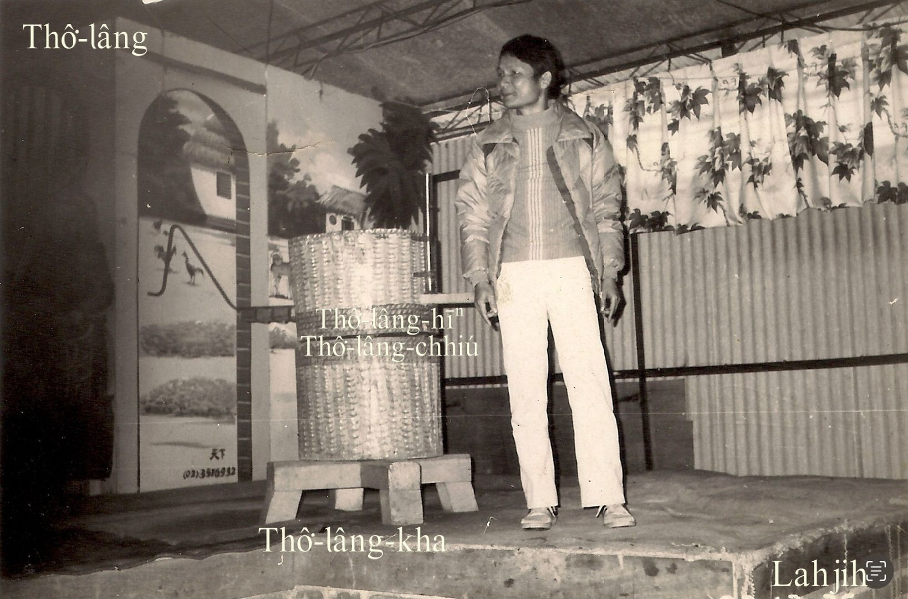
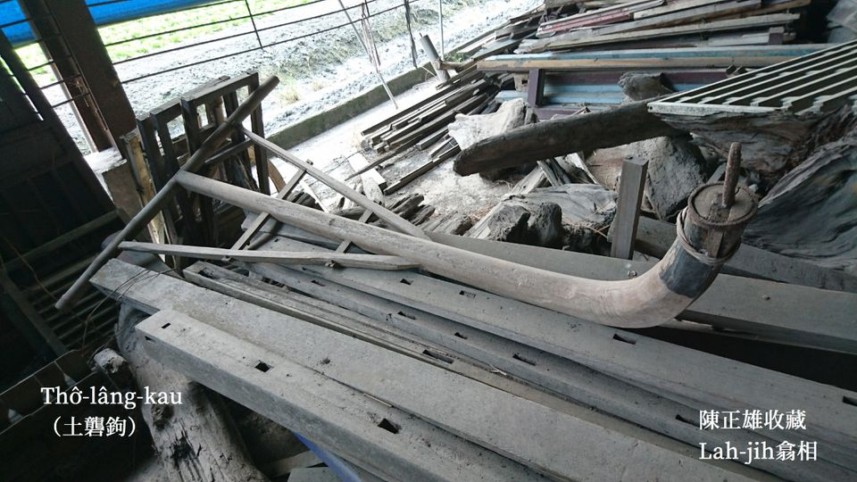
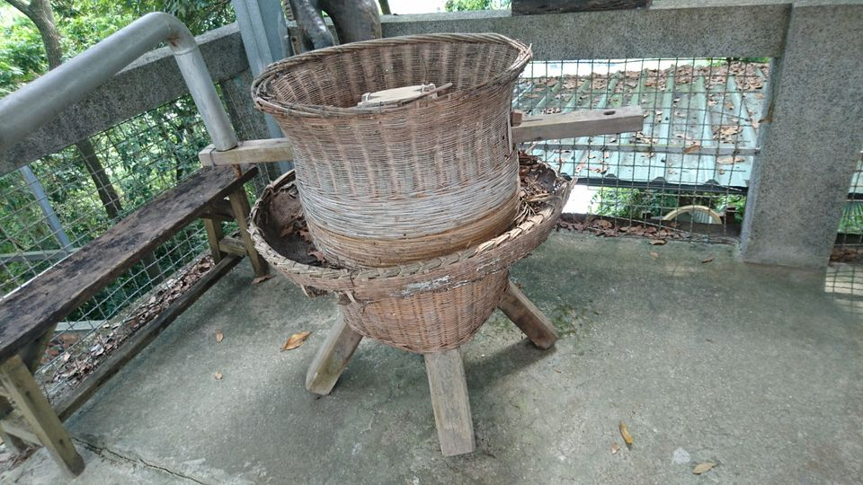
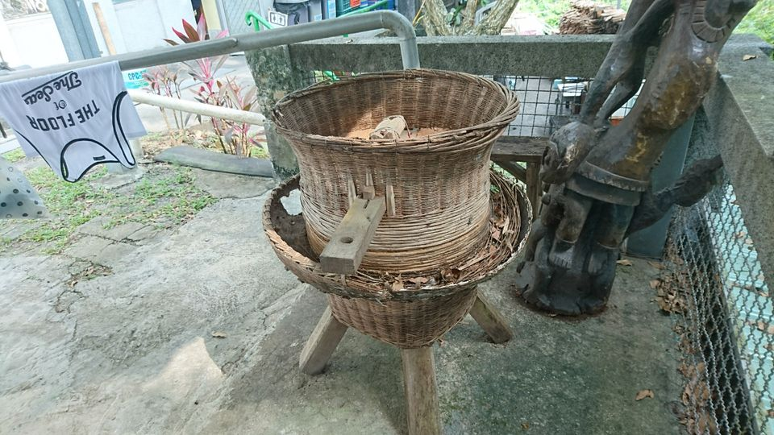

## 【Lah-jih台灣唸謠】火金星，十五暝

火金星，十五暝，請恁姨á來食茶，茶芳芳，茶米甕，àng大妗，大妗做媒人，媒人tio̍h火燒，親家親姆chhia̍k-chhia̍k-tiô，tiô到柚á腳，黃--ê挽去食，青--ê留leh送丈人，丈人o-ló好，阿兄娶阿嫂，阿嫂腳疼bē入房，阿兄手疼bē挨礱……。

# 4. 豆á脫殼ê家私──鍊梗
> **Tāu-á Thoat-khak ê Ke-si — Liān-kéⁿ**

青皮á豆收成a̍h是油芥菜收菜子，豆莢tiàm門口埕曝ta了後，to̍h用棍á hám，豆殼破，種子自然lak落。Liān-kéⁿ是1支長竹管連1支短竹管，kòng豆莢ē-tàng貼地面kòng，比giâ棍á kòng khah方便省力。
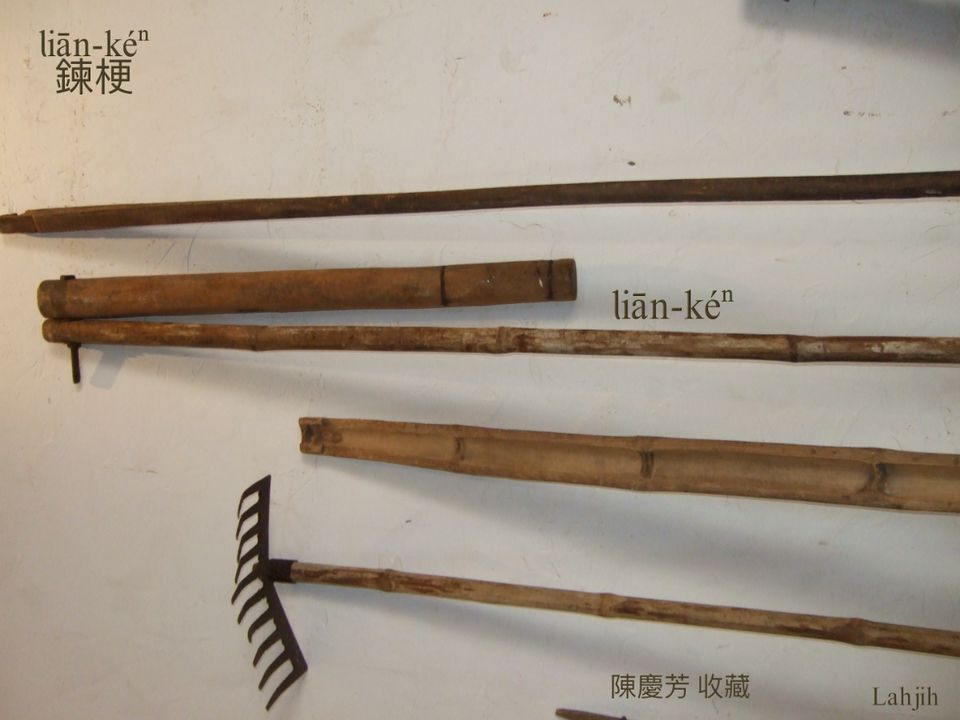

# 5. 草Pû ê路用
> **Chháu-pû ê Lō͘-iōng**

Khah早無親像chit-má，boeh照明有電火，boeh煮飯有gà-suh，ta稻草是田庄真要緊ê資源，nā收成了後tio̍h thia̍p草pû，chiâⁿ做日常使用。

稻草1-cháng 1-cháng tī田--裡曝ta，了後1擔1擔，taⁿ轉去門口埕尾a̍h是厝後thia̍p草pû。草pû稻草路用真chē，hiâⁿ火、hō͘牛食、田--裡kā幼欉菜蔬cha̍h霜風、寒--人chhu草蓆下面chhu草chhiⁿ khah燒lo̍h、khàm厝頂、點草把火，不止á有路用，thia̍p成草pû，隨時boeh-ài to̍h有，chiâⁿ利便。

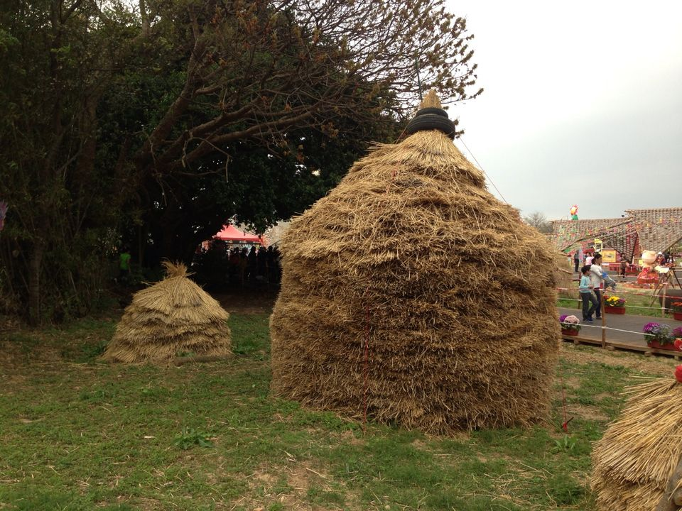

## 【Lah-jih散文書寫】Thia̍p草一點訣，Hiat草是師傅
> **【Lah-jih Sàn-bûn Su-siá】Thia̍p Chháu 1-tiám-koat, Hiat Chháu sī Sai-hū** 

草pû草pû，真久m̄-bat kap你相tú，今á日又koh看tio̍h你ê形影，tī門口埕1-pû 1-pû，soah hō͘人想tio̍h gín-á時陣。

Hit當時阿爸叫我kap阿兄，相招kōaⁿ稻草，1-cháng 1-cháng tàn hō͘阿爸，講boeh  thia̍p草pû，無1-tah久，阿爸ê身軀已經離地到我ām-kún。草cháng繼續拖，拖hō͘阿兄tàn hō͘阿爸，阿爸tī草pû頂真無閒，實在chiâⁿ本等，thia̍p kah kôan tú天koh圓型圓型，一點á都無走精，ta̍k-ke看tio̍h lóng o-ló，講阿爸ê功夫真本等。

阿爸歡喜ka̍h，一時soah bē記得thang客氣：「Thia̍p草一點訣，hiat草是師傅。」Boeh o-ló tio̍h o-ló阮後生，恁看伊leh hiat稻草，相準準，ùi地面hàiⁿ起來hō͘我，一點á都無têng-tâⁿ，nā m̄是伊ê好功夫，kan-nā我gâu mā無效，kā阮後生鼓勵--一-下chiah應該。

Lóng是ka-tī人，阿爸chiah-ē chiah-nī大面神展ka-tī，不過聽阿爸án-ne講，mā感覺真有道理。幕前ê表演者，nā無幕後--ê tàu-saⁿ-kāng，一定真pháiⁿ紡，gih磚á師傅bōe是gâu，下面hit ê小工chiah是厲害，一塊磚、1-khat紅毛土，lóng是準確無比送到師傅ê身邊，莫怪gih磚á師一直leh o-ló伊ê師á工ê功夫，原來to̍h是kap老父有kāng款ê意思，「Gih磚á一點訣，tàn磚á是師傅」，「Thia̍p草一點訣，hiat草是師傅」，lóng是師傅o-ló師á ê功夫。台北市長阿扁--à leh o-ló市府團隊ê gâu kap合作，mā是做師傅ê真功夫，bē請功bē佔權，是一個好主管。

# 6. 古早有機肥ê來源
> **Kó͘-chá Iú-ki-pûi ê Lâi-goân **
  
## 6-1. 糞kap糞間
> **Pùn kap Pùn-keng**

Pùn是有機肥，漢字寫「糞」，to̍h是khioh有機糞埽、屎尿……，au-au發kàⁿ（酵）做糞；糞間是au糞khǹg糞ê厝間，nā有飼牛，牛椆to̍h是糞間，除了關牛飼牛hō͘牛踏糞以外，mā ē-sái-tit khǹg農具。糞間內蚊蟲chē，to̍h飼白鴒鷥食蚊蟲。

## 6-2. 火Pû-á
> **Hóe-pû-á**

作田人ē-sái-tit講ta̍k口灶都有飼精牲，飼鴨á有鴨椆，飼雞有雞椆，飼豬有豬椆，飼牛有牛椆，鴨屎、雞屎、豬屎、牛屎lóng是有機肥，有糞間au tiàm糞間，無糞間to̍h tiàm埕尾厝後設糞堆，只要是有機ê屎尿糞埽lóng掃掃來糞堆au，nā有ta ê草枝竹葉to̍h放火燒，所以糞堆á mā叫火pû-á。

## 【Lah-jih台灣俗語】
- Chē牛踏無糞，chē bó͘無tè睏。
    > 為siáⁿ-mih chē牛踏無糞？有懷疑，當做是唸tàu句，重點tī chē bó͘無tè睏。

# 7. 白鴒鷥Bôe
> **Pe̍h-lêng-si-bôe**

Nā boeh lia̍h白鴒鷥飼tī糞間a̍h是牛椆tàu食蚊蟲，to̍h先lia̍h一隻白鴒鷥用索á pa̍k tiàm田--裡做bôe，koh安tng白鴒鷥ê陷阱，siâⁿ來白鴒鷥tio̍h吊。

## 7-1. Bôe
『媒介』，poa̍h-kiáu做內場，需要顯示你有gōa-chē錢做bôe，kiáu腳chiah有意願kap你poa̍h，to̍h是kiáu-bôe。

# 8. 註解
> **Chù-kái**

|**詞**|**解說**|
|作田|Choh-chhân，『種田』。|
|菜蔬|Chhài-se。|
|曝ta|Pha̍k-ta，『曬乾』。|
|粟倉|Chhek-chhng，『穀倉』。|
|ka-tî-á|『竹編榖倉』。台日大辭典：茭櫥/Ka-tî/Ka-tû。厝內貯粟用ê高扁ê大籠。|
|niáu鼠|『老鼠』。|
|錢糧|Chîⁿ-niû。|
|拖iap-á|Thoa-iap-á，『沿著屋簷加蓋部份』。|
|密chiuh-chiuh|Ba̍t-chiuh-chiuh『密不通風』。|
|糞埽|Pùn-sò，『垃圾』。|
|chhiān枋|Kó͘-teng-pūn，粟倉ê門，用柴枋1塊1塊順門邊溝槽chhiān--落-去，號做chhiān門chhiān枋。|
|草pû|『稻草疊成一堆』。|
|hiâⁿ火|點火來燒。|
|草chhiⁿ|Chháu-chhiⁿ，『新鮮乾淨稻草』。|
|boeh ài|『想要』。|
|to̍h有|『就有』。|
|chiâⁿ利便|非常方便。|
|kéⁿ、hám|『用竹木棒打』。|
|本錢真粗|Pún-chîⁿ chin-chho͘，『本錢雄厚』。|
|糶粟、糴米|Thiò-chhek、tia̍h-bí，『賣粟買米』。|
|賒欠|Sia-khiàm，『賒欠』。|
|lúi現金|Lúi hiān-kim，『兌換現金』。|
|bô-siá-sì|『好可憐』。|
|géng破|Géng phòa，『研磨』。|
|chhia̍k-chhia̍k-tiô|『雀躍』。|
|安|An，安裝an-chong，『裝置』。|
|tng|『設陷阱等待獵物上當』。|
|siâⁿ來|Siâⁿ-lâi，『引誘』。|
|tio̍h吊|Tio̍h-tiàu，『上鉤』。|
|au|『堆積。把東西放在水中做長時間的浸泡。堆積成一堆使腐爛』。|
|無tè睏，無tàng睏|『無處睡』。|
|青皮á豆|Chheⁿ-phôe-á，chheⁿ-phôe-á-tāu，黃豆ê品種。|
|真本等|Chin pún-téng，真gâu，『真本領，本事』。|
|hiat草|『丟』草cháng。|
|燒lo̍h|『溫暖，熱絡』。|
|têng-tâⁿ|重耽，『事情出了差錯』。|
|大面神|Tōa-bīn-sîn，大仙尪á，比論厚面皮。|
|gih磚á|Gih-chng-á，thia̍p磚á。|
