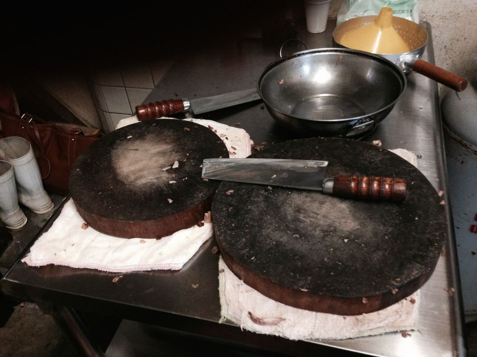
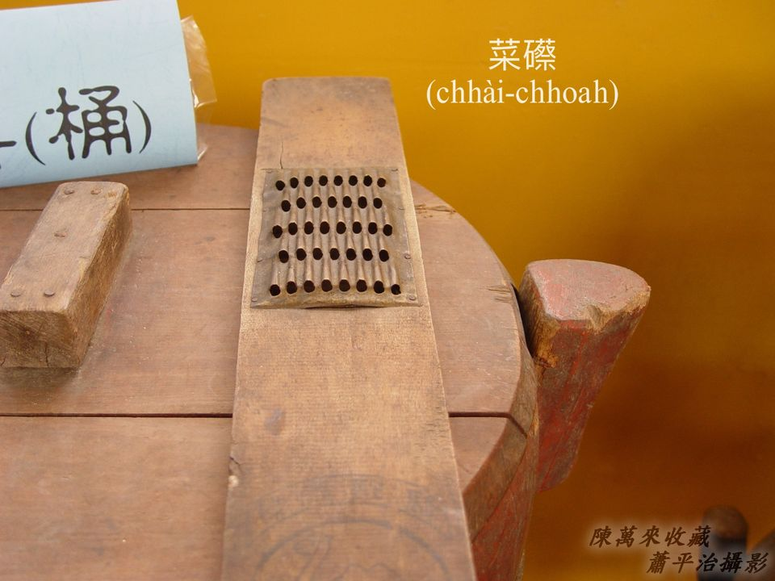
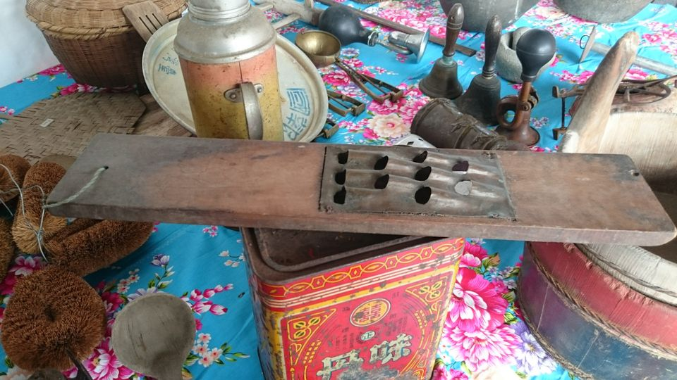
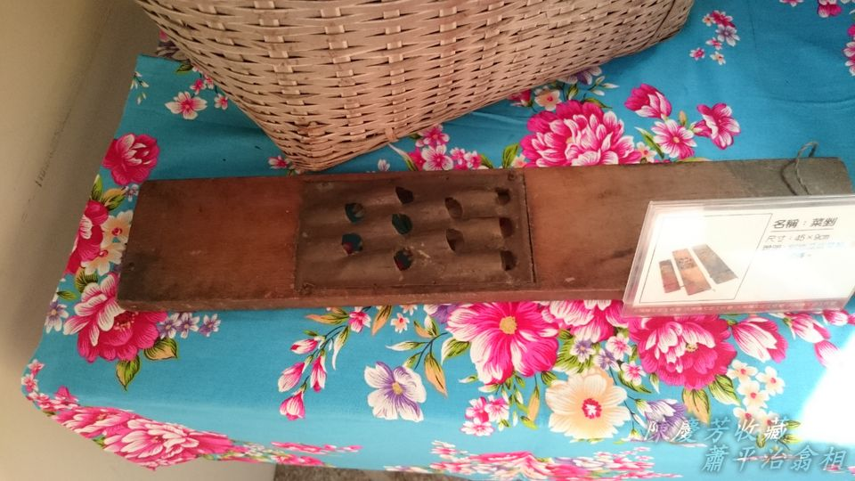
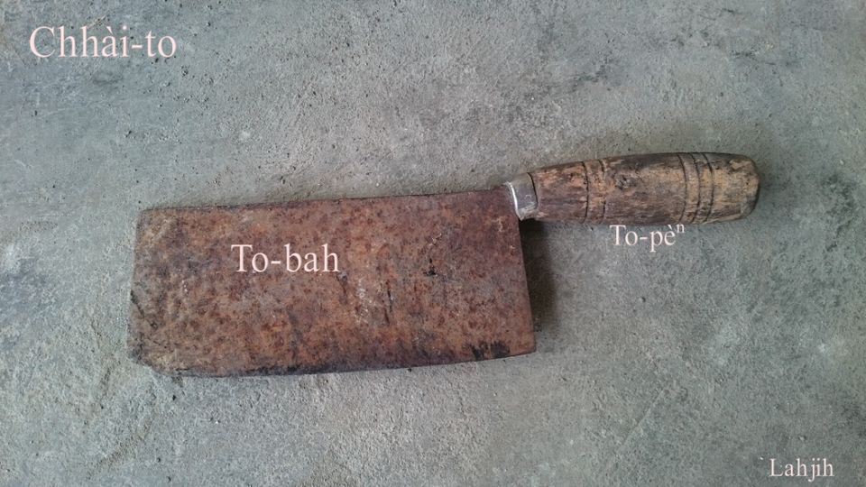
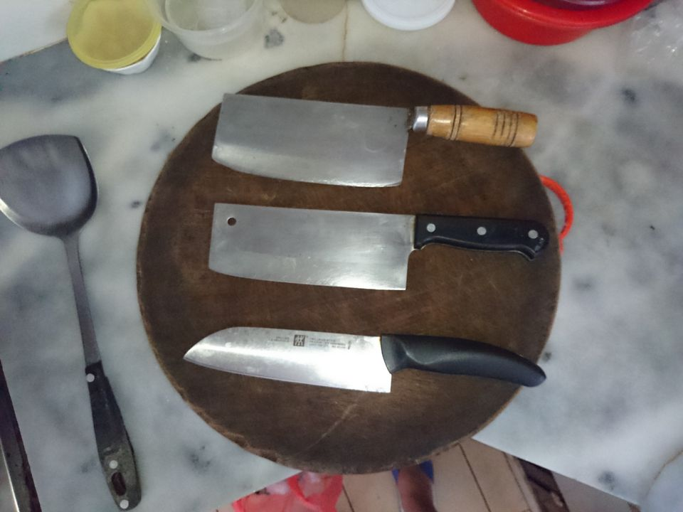
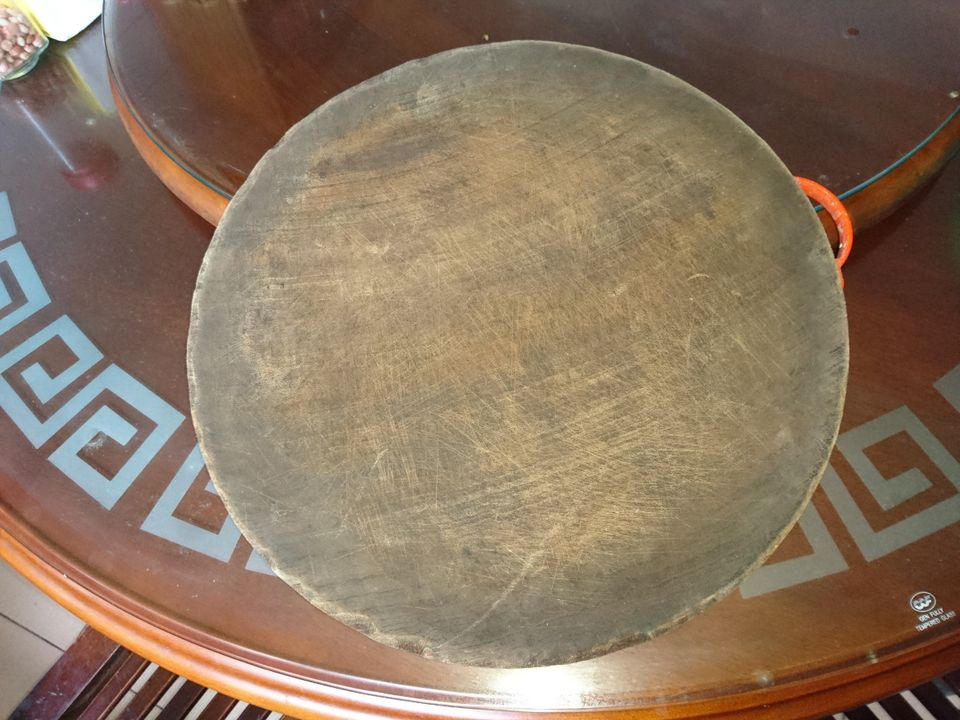
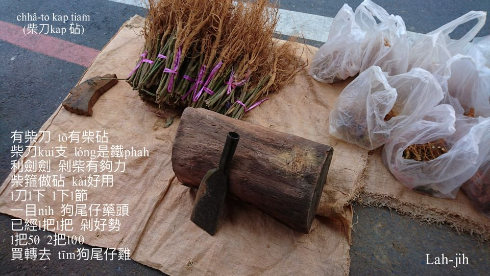

# 處理食物材料ê家私
> **Chhú-lí Si̍t-bu̍t Châi-liāu ê Ke-si**

煮食boeh phang-phài，煮料m̄-thang chhìn-chhái；家私nā有利，菜色to̍h好安排。

灶腳煮食家私siāng重要是刀kap砧，nā boeh有變化， chhoah-chhiam khau皮磨粉過濾ê家私mā bē-sái-tit無。

# 1. 家私
>**Ke-si**

## 1-1. 菜chhoah
>**Chhài-chhoah**

菜chhoah是芋á、番薯、匏á、菜頭等等菜蔬chhoah chhiam煮食曝koaⁿ ê家私，chhoah番薯chhiam siāng kài捷用，作穡人兩冬粟一冬番薯，番薯nā大收，chheⁿ番薯食bē去，to̍h chhoah chhiam曝番薯chhiam脯起來khǹg。生番薯chhoah chhiam煮番薯chhiam飯，米nā mài siuⁿ少，足好食，ah nā chham曝ta ê番薯chhiam脯，to̍h欠he番薯甜味，siāng hiau-hēng是chham he隔冬臭phú ê番薯chhiam koaⁿ，白chiáⁿ無味有夠pháiⁿ食。除了chhoah番薯chhiam，mā用來chhoah菜頭炊菜頭粿，chhoah芋á炊芋梭á（芋粿khiau），芋蔥粿，chhoah匏á chhiam煮食。

>**相關語詞**

菜chhoah鼻，是形容鼻khang大koh向天ê形狀。

## 1-2. 菜刀
>**Chhài-to**

灶腳菜刀主要是切菜，liô肉，tok肉骨，thâi魚thâi雞鴨cheng-seⁿ-á，siāng好準備大中小三支，大支khah重ē-sái-tit剁，中pān切菜切豬肉，細支--ê割、liô、削khah liú-lia̍h。

菜刀nā tun tio̍h ài刀石á磨，nā是切肉切粿，刀肉kha̍h油kha̍h黏pháiⁿ切，to̍h tiàm醃缸嘴hoah-hoah--leh，ē加真好切。Hoah-hoah--leh ê意思to̍h是koeh-koeh--leh。

## 1-3. 瓜Khau-á
>**Koe-khau-á**

菜蔬果子boeh煮boeh食，有ê需要khau皮削皮，結頭菜、王梨皮厚用刀削，菜瓜、匏á皮薄用瓜khau-á khau，快速khau一重薄薄ê皮。番薯煮飯mā tio̍h khau皮，tī hit ê時代，khau番薯算是siāng捷ê khang-khòe。

## 【 Lah-jih台灣俗語】
- 溪底番薯，免khau洗。
- 匏á皮金金，無削皮你mā罵；苦瓜皮皺皺，削皮你mā罵。

## 1-4. 砧
>**Tiam**

灶腳用ê砧，多數是直絲圓形柴kho͘，ke-jiû-á柴、烏心石siāng kài讚，tēng-pak耐用。

俗語：「死豬á鎮砧」，是賣豬肉ê豬肉砧，m̄是灶腳切菜ê砧，豬肉砧1塊ná長形桌面。

>**相關語詞**

「做肉砧」是hō͘人phah thit-thô，hō͘人phah無討ê意思。

## 1-5. 柴刀砧
>**Chhâ-to-tiam**

Che是khah罕khoàiⁿ ê柴刀砧，簡單kā大kho͘樹kho͘鋸做koe̍h to̍h ē-sái使用。Tok細枝樹椏、藥頭á、tok狗尾á草、in草in tok柴á枝，真方便好用。

# 2. 註解
> **Chù-kái**

|**詞**|**解說**|
|hoah|磨。|
|khau洗|諷刺洗面。|
|ke-jiû-á|雞榆，『臺灣櫸木。木本植物。臺灣上等木材名稱』。|
