# 煮食用ê鼎鍋á
> **Chú-chia̍h Iōng ê Tiáⁿ-oe-á**

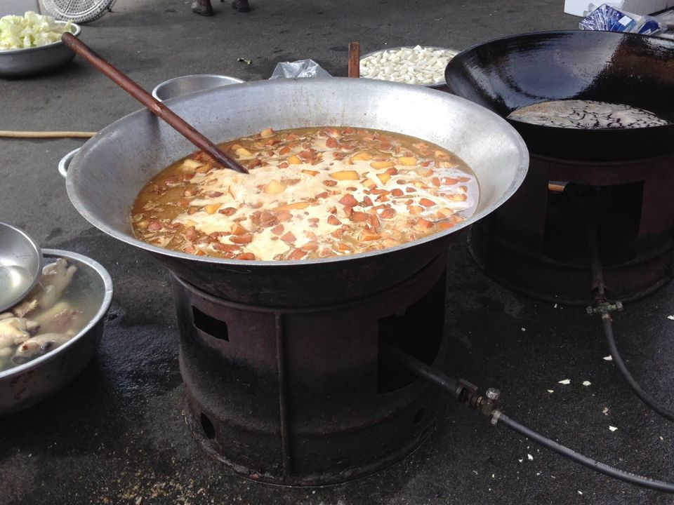

# 1. 鼎鍋á
>**Tiáⁿ-oe-á**

煮食鼎鍋á，一般家庭有大口鼎、細口鼎、輕銀銅鼎、seⁿ鍋kap鍋á。

## 1-1. 大鼎
>**Tōa-tiáⁿ**

一口鼎一口灶，一口灶一家伙，éng過多子多孫chē kiáⁿ chē福氣ê年代，大家庭頭嘴chē，煮飯lóng mā是大鼎煮食，chiah有夠額。

鼎ê材料是seⁿ-á hoan-soa（翻砂）鑄造，無用ē生sian，有tiáⁿ-châi（鼎臍），chit-mái ê鼎m̄是生鐵製造，mā無鼎臍。
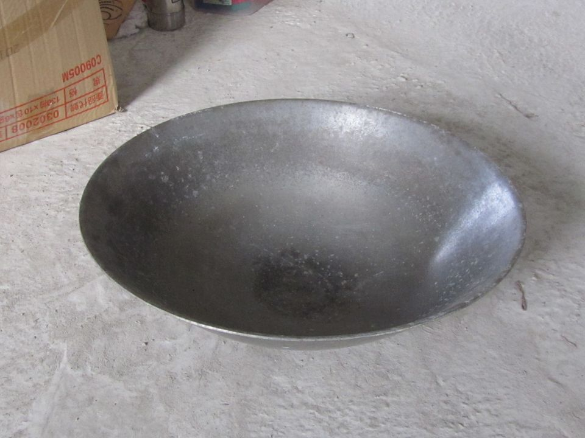
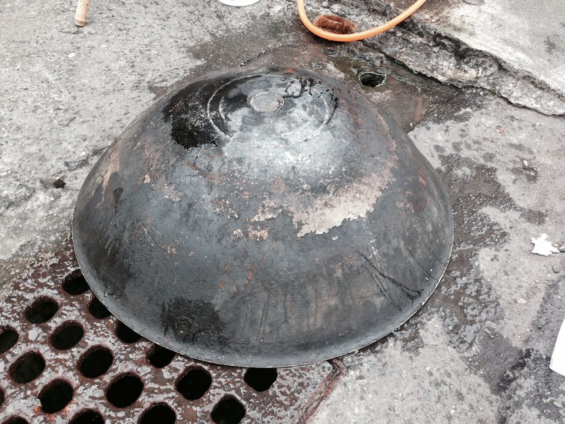
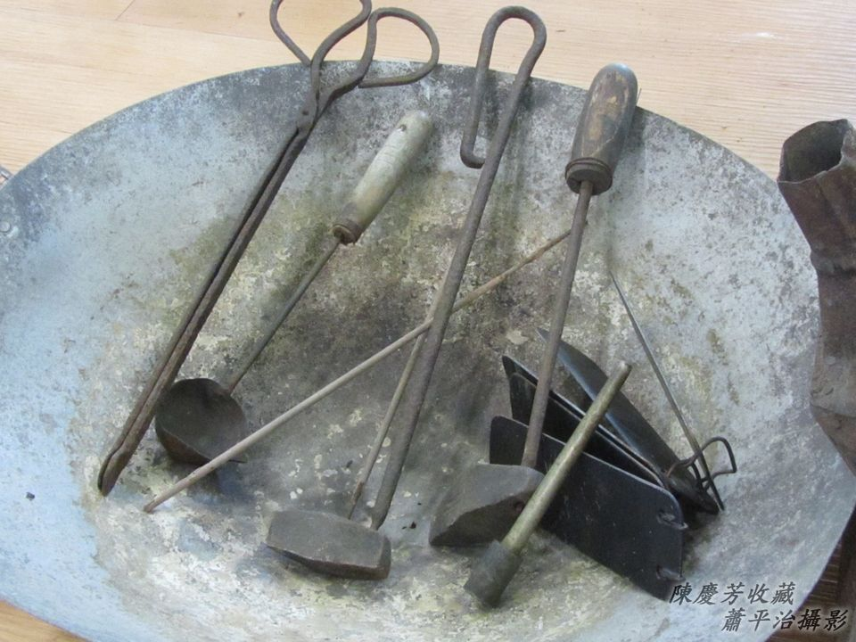

## 1-2. 細鼎
>**Sè-tiáⁿ**
  
Kap大鼎相kāng，只是寸尺khah細，平常時用來khioh火尾hiâⁿ滾水燒水，因為khah早田庄人lóng是大家族，煮食tio̍h用大鼎煮，chiah有夠額，細鼎是備用。

鼎，hiâⁿ火hiâⁿ久ē kha̍h火塵lo͘，需要tò-khap kō͘煎匙thuh，火塵lo͘ thuh清氣，煮食ē khah緊熟。鼎nā thuh破khang，tio̍h ài hō͘補鼎--ê「補鼎sòa火」「愈補愈大khang」。

## 【Lah-jih台灣俗語】
- 俗語「米甕á弄鐃」tio̍h ài吊鼎，鼎破無補mā tio̍h吊鼎，所以需要「補鼎sòa火」。
 
- 俗語有「大鼎未滾，細鼎chhiāng-chhiāng滾」ê講法，意思是教人謙虛，m̄-thang chhèng-kōa-kōa出風頭。

## 1-3. 鼎Kám
>**Tiáⁿ-kám**

To̍h是柴枋kap-choh ê鼎蓋，mā講做tiáⁿ-kám-á蓋。Tiáⁿ-kám除了做鼎蓋路用，mā利用來kîn ám。古早作穡人煮飯，除了燜飯以外，大鼎煮飯lóng hē真chē水，煮熟了後chiah用tiáⁿ-kám kā飯粒番薯tu去1-pêng khat ám。Khat--起-來ê ám，ē-tàng當做點心治iau，ē-tàng衫á褲漿ám，ē-tàng留hō͘厝內飼豬飼精牲。

1945年B-29 tng teh掃射，ta̍k-ê bih-tiàm防空壕，我nā哭，叔伯Lô͘-á兄to̍h ē去灶腳iúⁿ ám hō͘我lim。
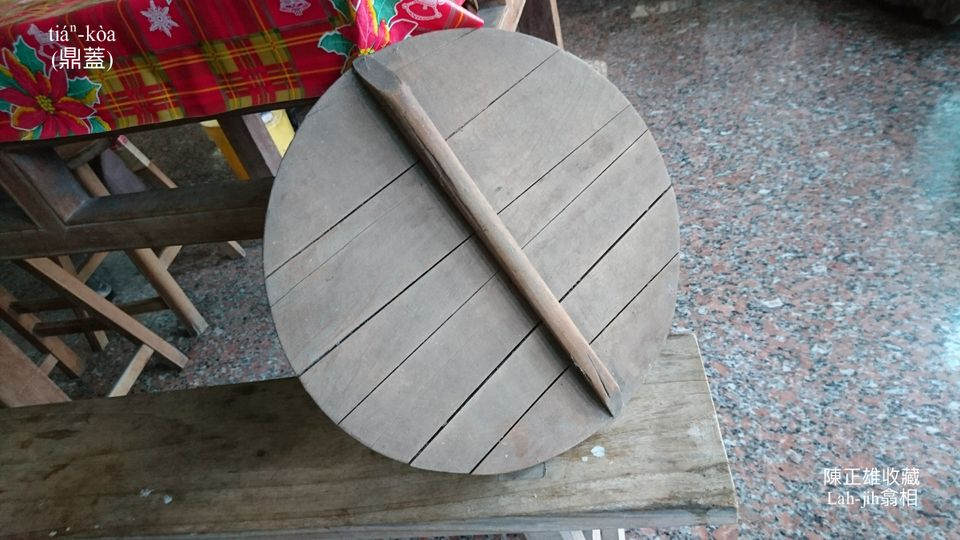
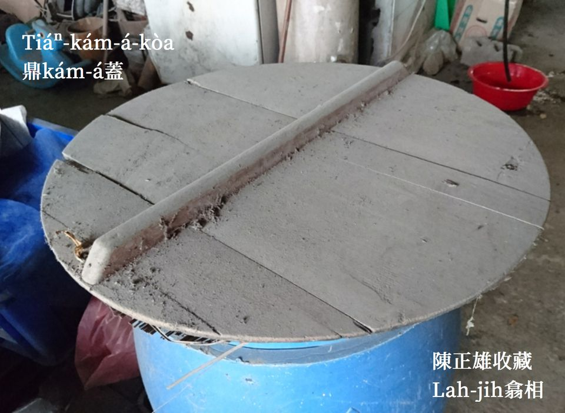

## 1-4. 銅鼎á
>**Tâng-tiáⁿ-á**

銅鼎á kap細口鼎無kāng，銅鼎á無鼎臍，是輕銀料m̄是銅料，mā有講做輕銀銅鼎á a̍h是日本銅鼎á。Khǹg tī鋸sut-hu灶、煉碳灶、烘爐灶煮輕省料理。
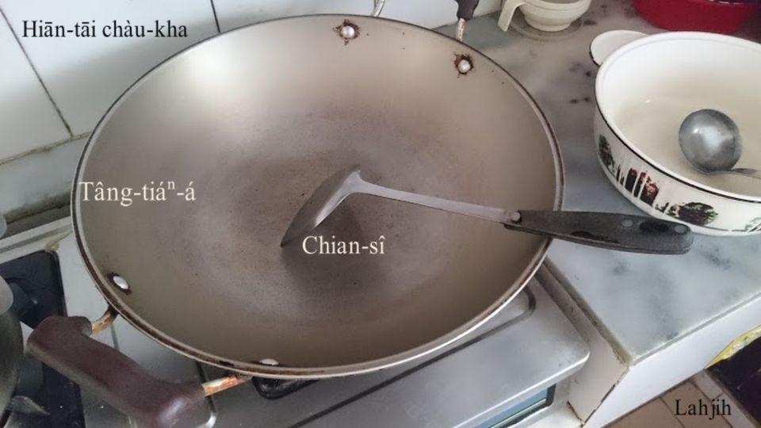
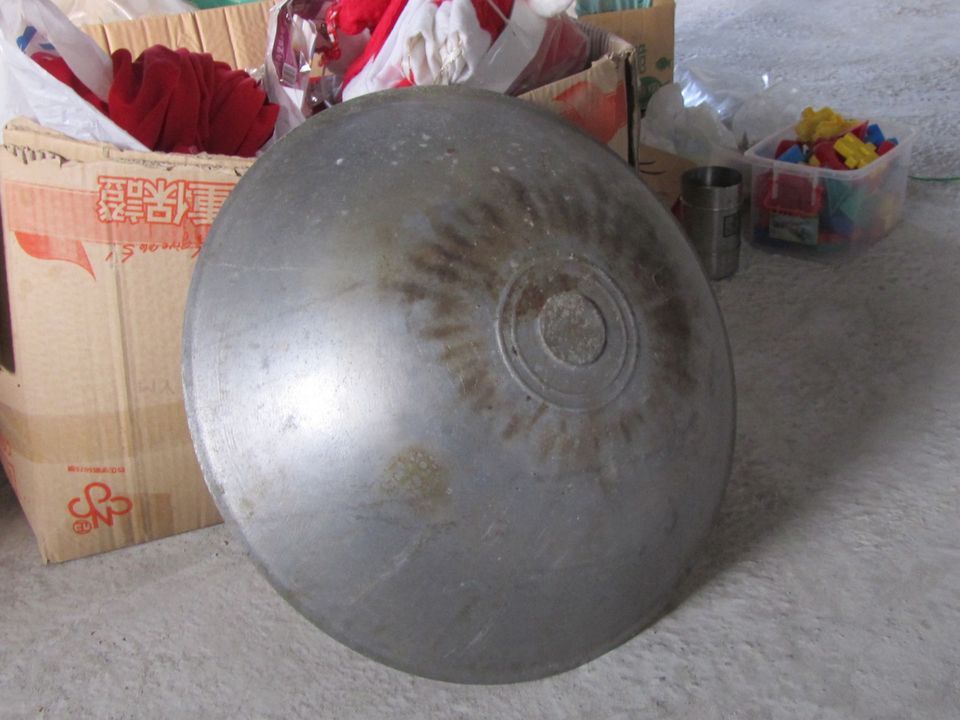

## 【Lah-jih台灣俗語】
- 日本銅鼎á──無才（無鼎臍）。
- Gia̍t-khiat-á俗語：眠床kha鼎──Chhá-siâu。

## 1-5. Seⁿ鍋kap Seⁿ鍋蓋
>**Seⁿ-oe kap Seⁿ-oe-kòa**

Seⁿ鍋是seⁿ-á製造，khǹg-tiàm鋸sut-hu灶、烘爐灶來būn飯、kûn肉、hiâⁿ燒水、hiâⁿ滾水、sa̍h米粽，kài利便好用，因為有厚厚重重seⁿ鍋蓋khàm tiâu，有chit-mái『悶燒鍋』ê壓力，khah-bē走氣，保留原味，būn白米飯、米糕、鹹飯‥‥‥phang-kòng-kòng，有夠好食。
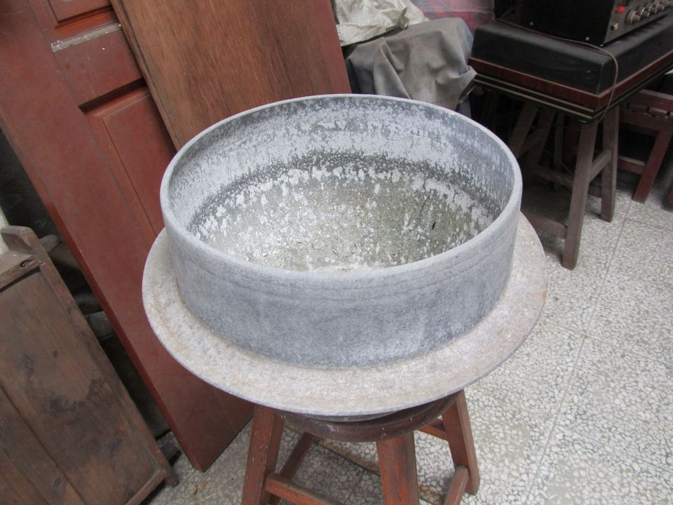
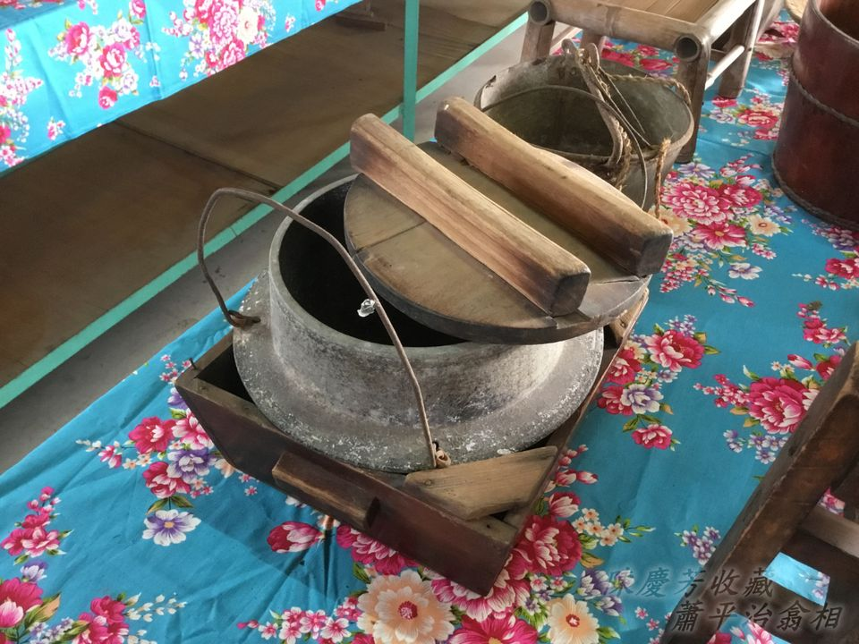

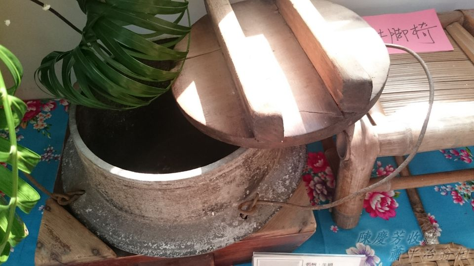
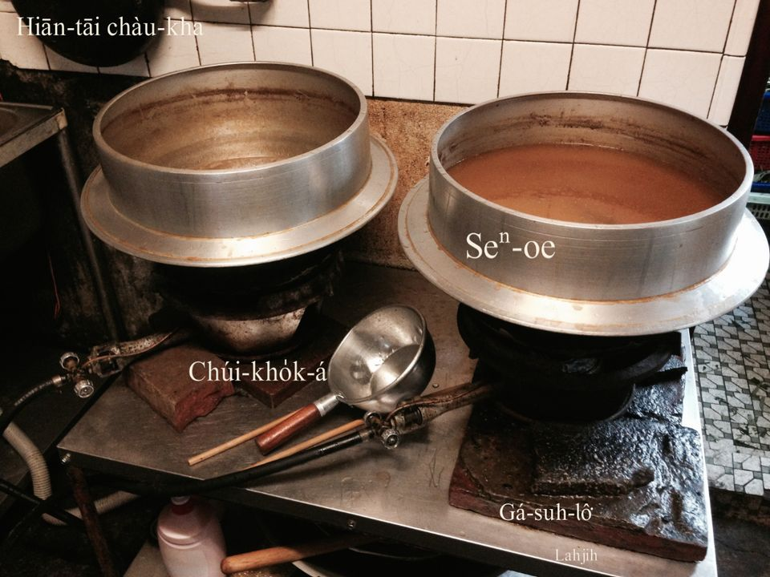

## 1-6. 狗母鍋
>**Káu-bó-oe**
  
Hûi土lām石幼á燒成粗hûi tīm-oe，耐熱耐khòng，用烘爐火tūn肉、tīm補、choaⁿ藥頭á，出味koh緊爛。
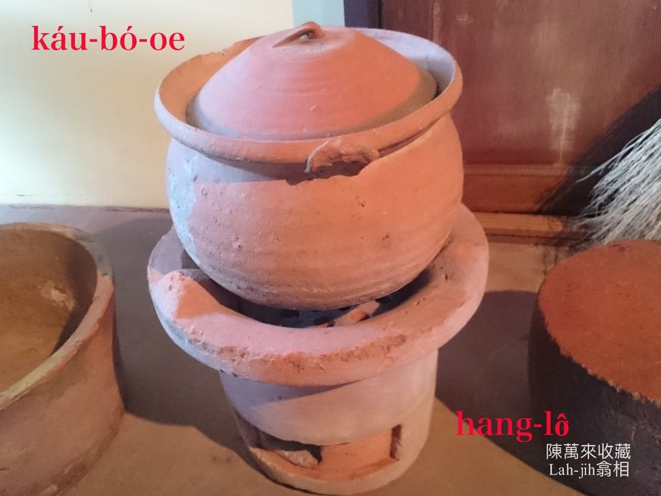

## 1-7. 藥Oe-á
>**Io̍h-oe-á**

Choaⁿ藥á ê時使用。
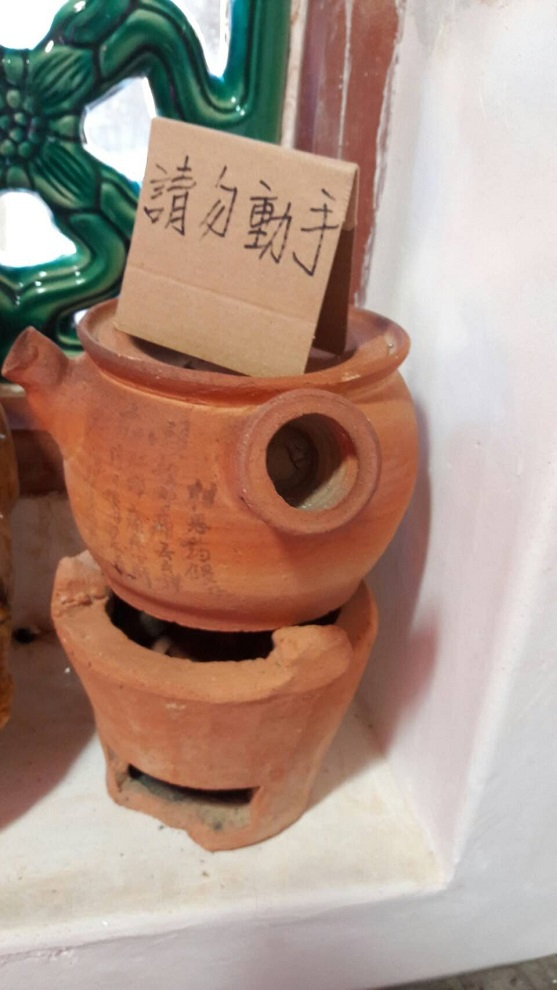

## 1-8. 鍋á
>**Oe-á**

華語『鍋』ê解說是『烹煮食物或加熱用的器具』。

台語ê oe有茶鍋、seⁿ鍋、狗母鍋、燖鍋，親像圖片chit款金屬『鍋子』，台語號做「鍋á/oe-á」，主要用途是kûn肉湯kûn菜湯，a̍h是貯肉湯貯菜湯。一般lóng有掛耳khàm蓋。
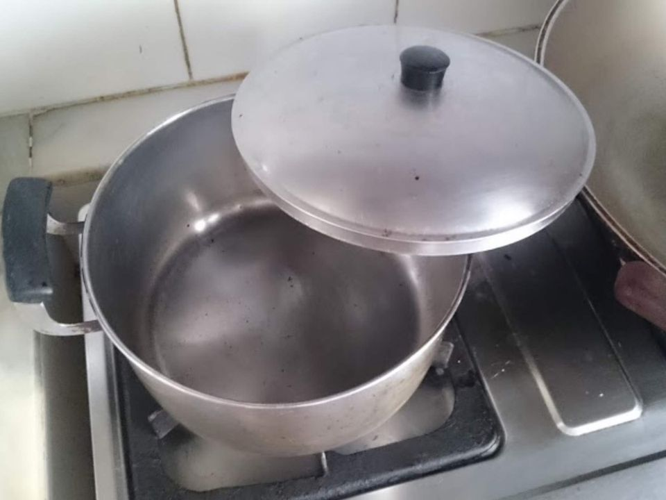

# 2. 註解
> **Chù-kái**

|**詞**|**解說**|
|頭嘴|Thâu-chhùi，一家ê人數。|
|鋸sut-hu|『鋸木屑』。|
|kha̍h火塵lo͘|『附著在鍋底、煙囪等物的煙垢』。|
|tò-khap|『倒蓋』。|
|thuh|『剔、剷、戳』。|
|kîn ám|『以湯瓢壓住米粒或湯料，舀去湯表面的浮渣』。|
|tu去1-pêng|『推到一邊』。|
|tī-iau|治iau，止饑。|
|chiuⁿ-ám|漿ám，『漿洗。衣服洗淨後，浸入米湯中上漿，使它晒乾後較硬挺』。|
|熟|Sek，『成熟』；se̍k，『煮熟』。|
|ám|『稀飯中的液態米湯』。|
