# 灶頭teh煮食ê家私
> **Chàu-thâu teh Chú-chia̍h ê Ke-si**

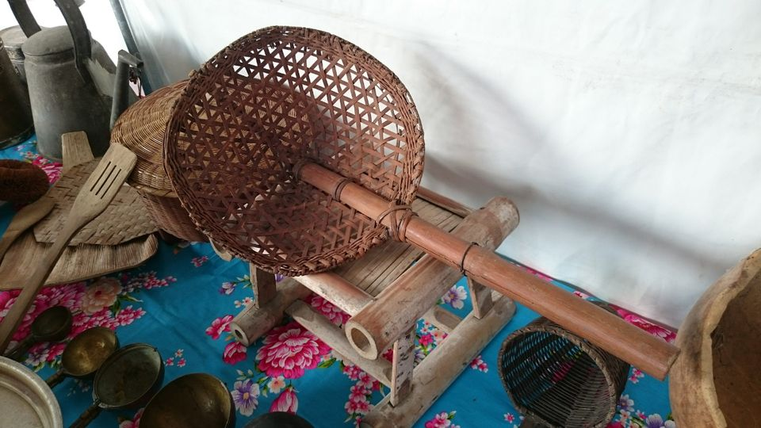

古早煮食kō͘大灶，灶頭無gōa闊，油筒á 、鹽甕á、砧以外，菜刀、煎匙、hāu-hia、飯笠siāng chia̍p用，to̍h tiàm壁堵tèng刀架、tèng釘á khǹg chia ê家私。

# 1. 煮食項項Ài Chit支
>**Chú-chia̍h Hāng-hāng Ài Chit Ki**

## 1-1. 煎匙
>**Chian-sî**

煎魚煎卵煎粿粽，需要chhi̍h需要thuh需要péng-pêng，煎匙siāng適合，而且ē-tàng炒ē-tàng舀ē-tàng lā ē-tàng切，煎匙是灶頭真捷用ê家私。Koh ē-sái-tit kā鼎thuh火塵lo͘。
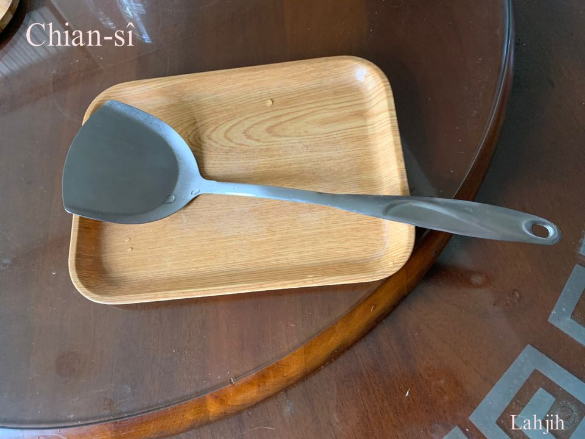

## 1-2. 大支煎匙
>**Tōa-ki Chian-sî**

總舖師傅鬧熱辦桌煮食用。
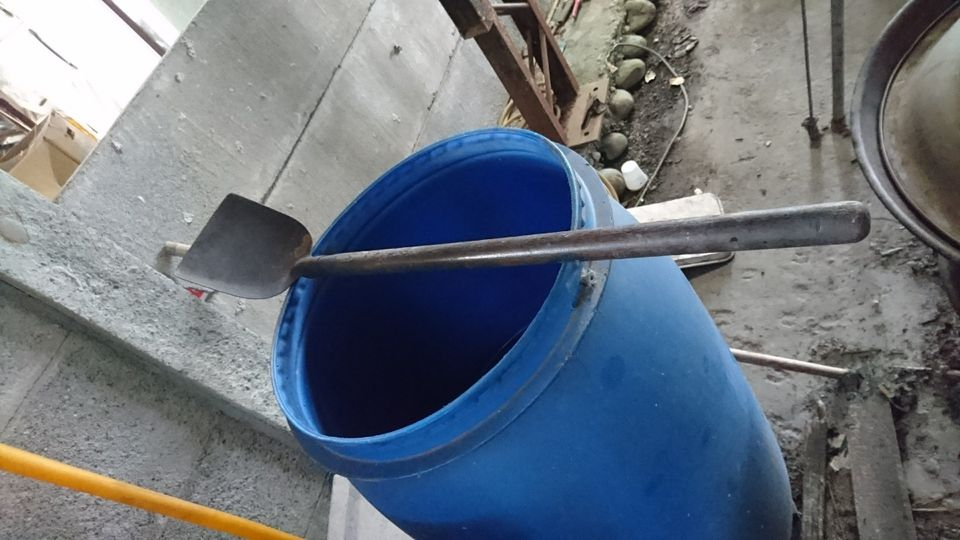

# 2. Khat湯Khat飯
>**Khat Thng Khat Pn̄g**

## 2-1. 鱟hia／鱟khat-á
>**Hāu-hia／Hāu-khat-á**

鉛phiáⁿ áu 1-ê笠á形koh安一支柴柄，to̍h是一支鱟hia，用來炒菜khat菜khat湯；nā是真正用鱟殼ê鱟hia，to̍h叫做鱟khat-á。
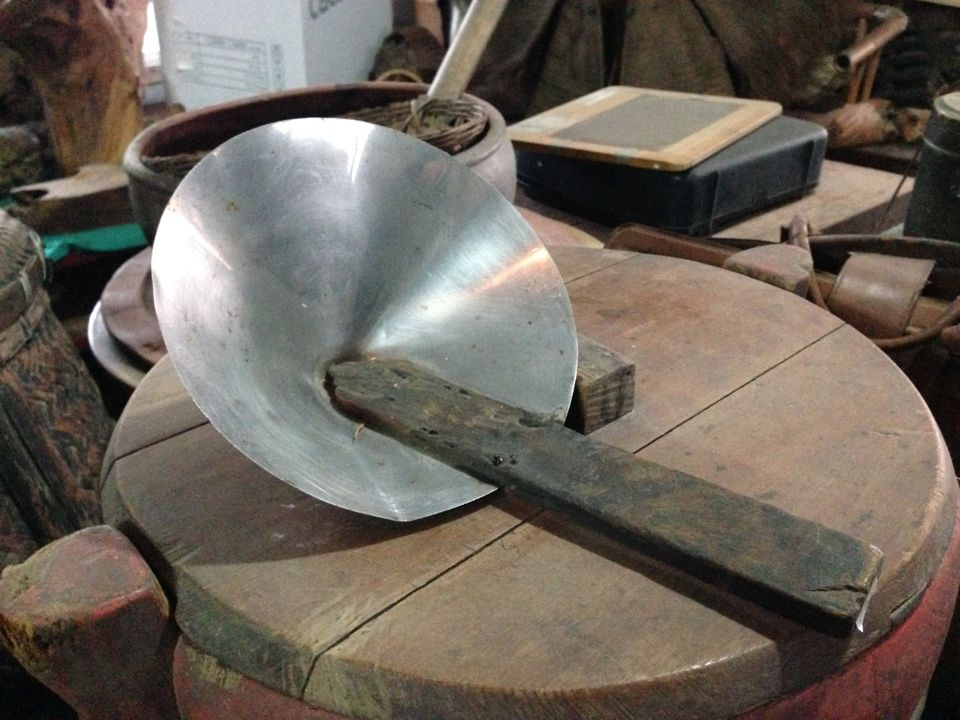
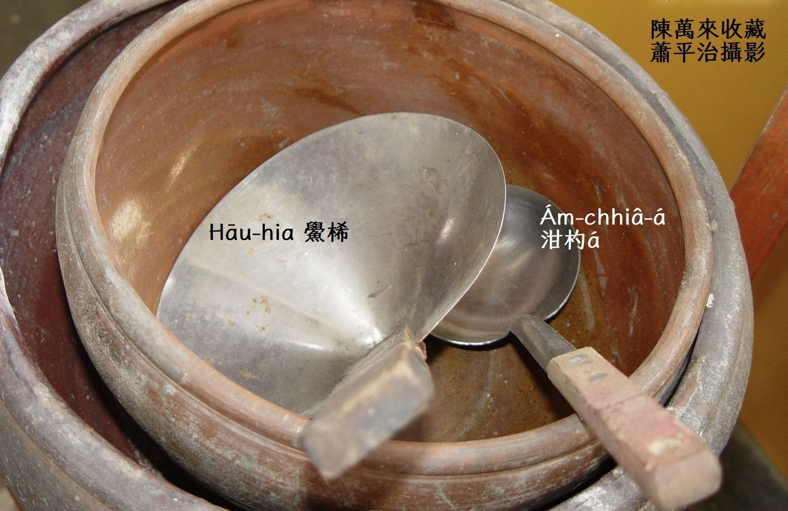
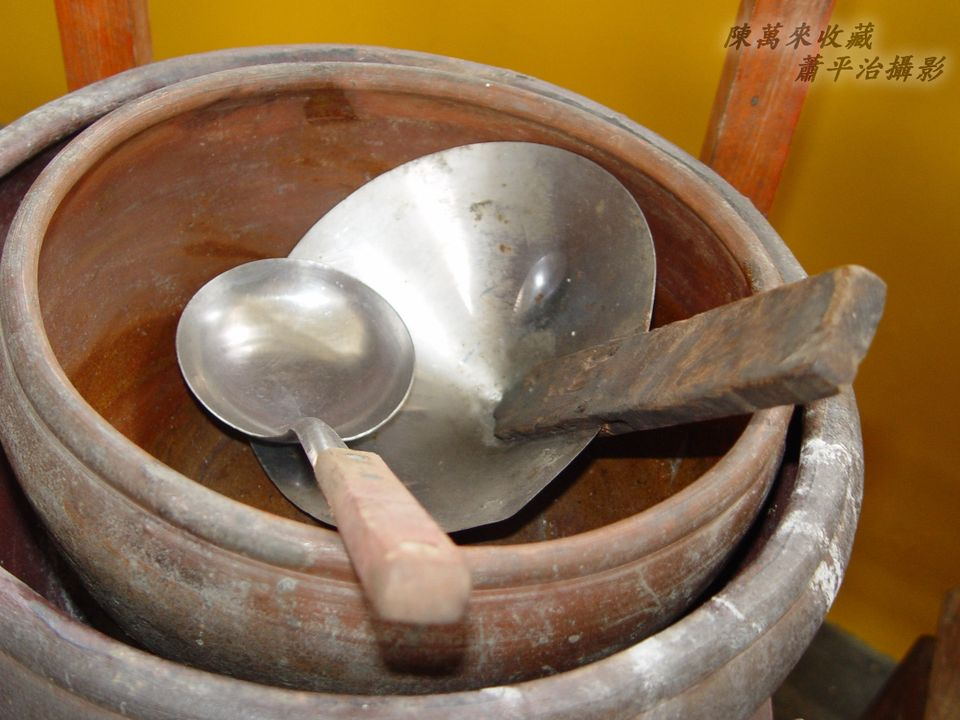
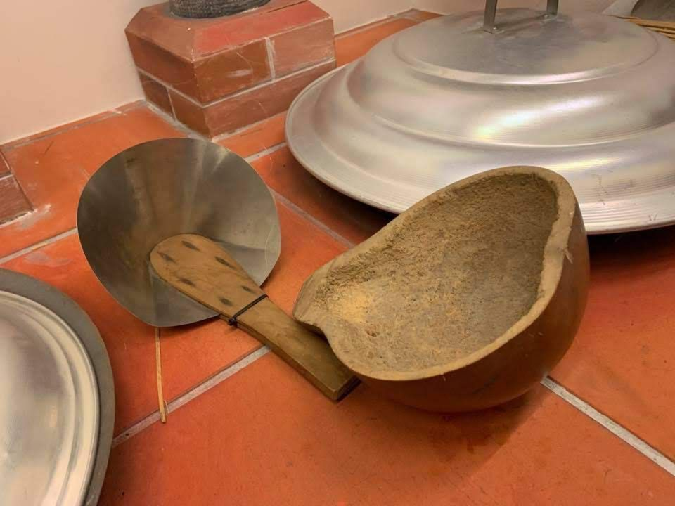
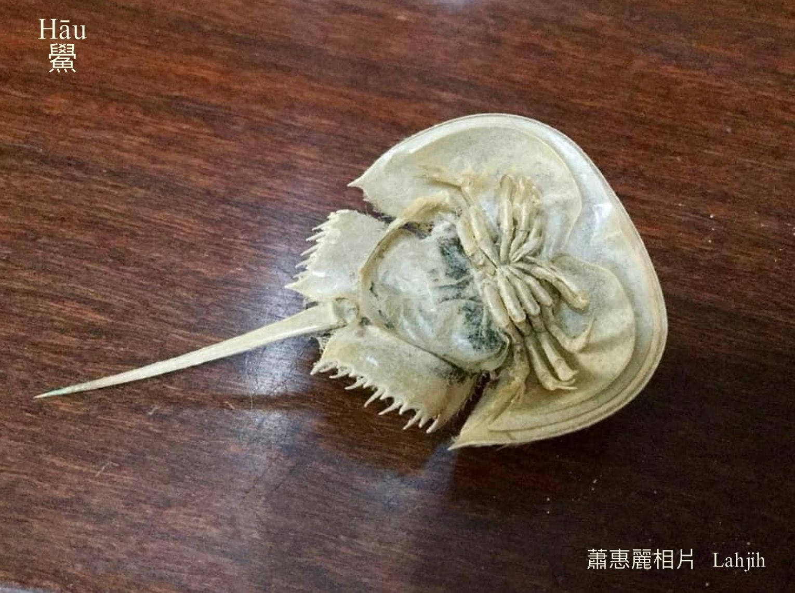

## 2-2. 飯笠
>**Pn̄g-le̍h**

Pn̄g-le̍h（飯笠）形體像瓜笠，華語『飯籬』台語呼音是pn̄g-lî，無合原音。

古早有人「食番薯頭配番薯尾」，時常「米甕á弄鐃」ê年代，煮飯lóng mā番薯khah chē米khah少，koh tio̍h kā ám留leh hō͘豬食。Ám kap番薯chhiam飯án-chóaⁿ隔離，有ê用鼎蓋kā飯tu去鼎邊，有ê kō͘飯笠hô͘，飯hô͘起來食，ám留leh漿衫á-sī飼豬，有時「米甕á弄鐃」to̍h真正「時到時擔當，無米chiah來煮番薯湯。」He kan-nā番薯chhiam ê飯號做「清hô͘」，清一色番薯chhiam無米飯。厝內nā有老大人a̍h是斷奶gín-á，用飯笠先hô͘寡清米飯，chhun--e chiah chhiau-chhiau lā-lā--leh，貯tiàm飯坩chiah chiūⁿ桌頂，物資缺乏ê年代。
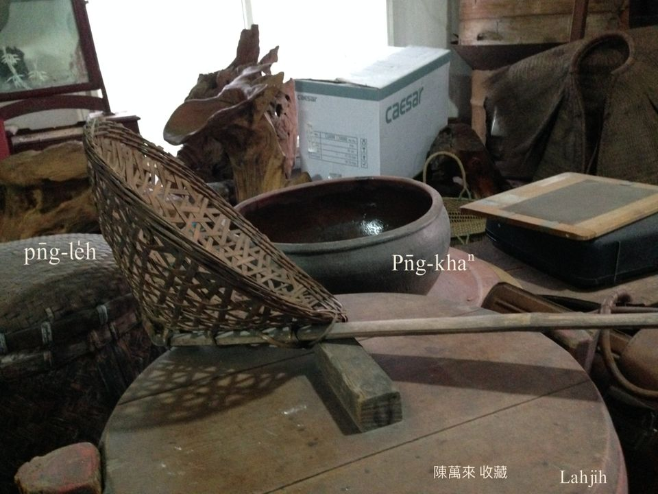
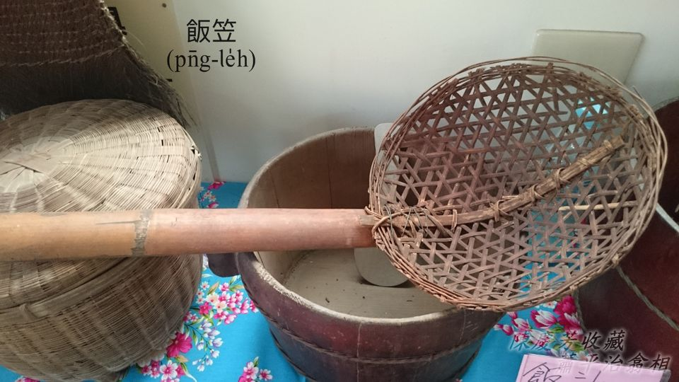

# 3. Té物
>**Té mi̍h**
  

## 3-1. 米甕
>**Bí-àng**

揀he ē-sái-tit貯1-2斗米ê húi-á甕，嘴mài siuⁿ闊，王梨罐頭ê鉛phiáⁿ管á khǹg ē落去khat米，to̍h是米甕、米甕á。

弄鐃（lāng-lâu）：道士做司公表演特技齣頭，弄鐃鈸（nâ-poa̍h）、椅桌、hûi-á甕‥‥‥。
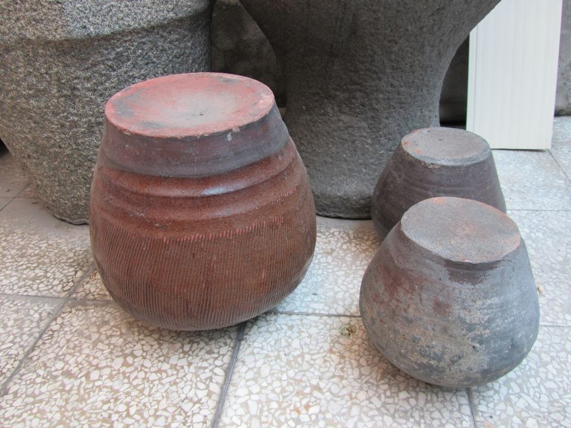
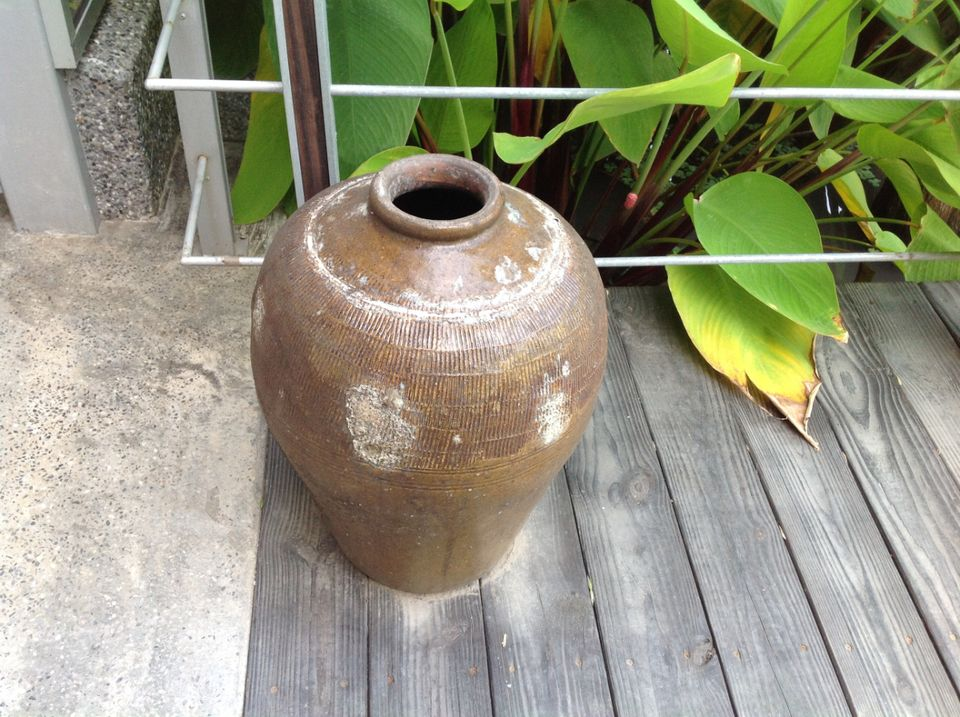

## 【Lah-jih台灣俗語】
- 「米甕á弄鐃。」To̍h是米甕á無米thang煮飯。

## 3-2. 米管
>**Bí-kńg**
  
煮三頓，量米煮飯用四角形米升量米，實在無方便，to̍h khioh he王梨罐頭ê鉛phiáⁿ管á來量米，容量大約1-chin，to̍h ka號做米chin、米kńg。1米升米叫做1-kńg米a̍h是1-kóng米。

米管另外用途：Khong紅紙用來做香爐插香。內面貯破布a̍h是字紙，點ho͘火hun，hun無乖ê gín-á，體罰ê夭壽步。

## 【Lah-jih台灣俗語】
- 「講（管），ná米升。」──講chiah leh講，無效--lah。

## 3-3. 豬油筒á
>**Ti-iû-tâng-á**

無油無sian to̍h食bē落飯，有油臊有鹹siam to̍h khah好落喉，炒菜tio̍h配料chiah-ē好食，這ta̍k-ê lóng知，「煮料夠，m̄是新婦gâu。」配料無夠，nā有豬油khiàn-phang，炒菜to̍h無問題。所以灶頭tio̍h準備油筒á貯豬油，油筒á除了有蓋，koh tio̍h有狗蟻怨ê au槽貯水防止狗蟻。
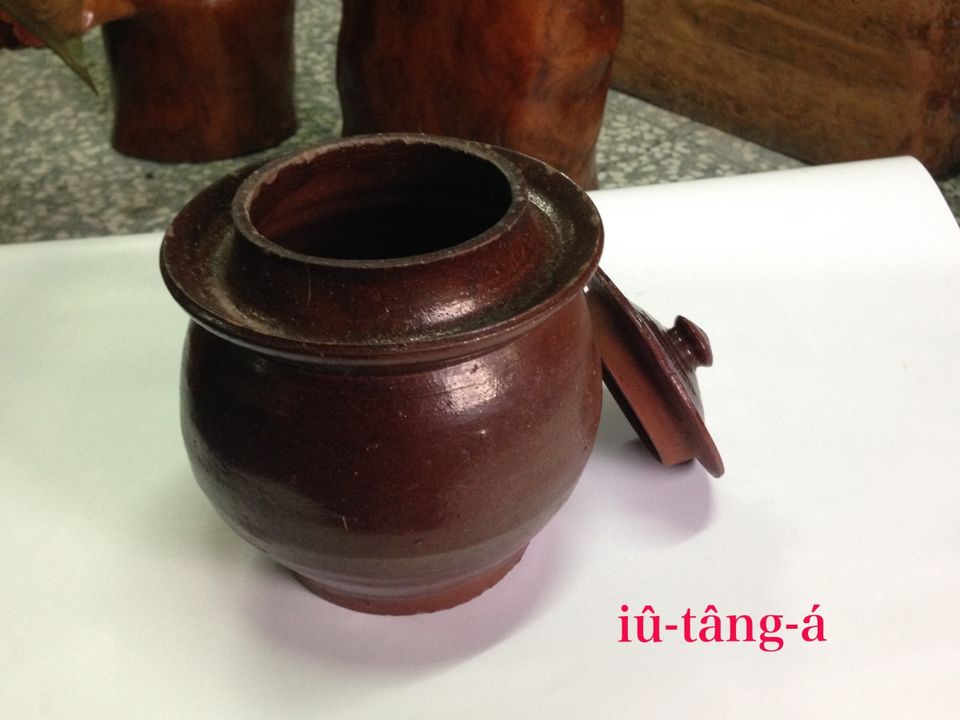

## 3-4. 鹽甕á
>**Iâm-àng-á**

灶腳煮食siāng kài重要是柴米油鹽，食飯配鹹，無油無sian食bē落飯，無鹹無siam kāng款吞bē落喉，灶頭鹽甕á m̄免siuⁿ大，甕á嘴tio̍h闊，無蓋mā無要緊，無he niáu鼠á ka-choa̍h狗蟻ē偷食。
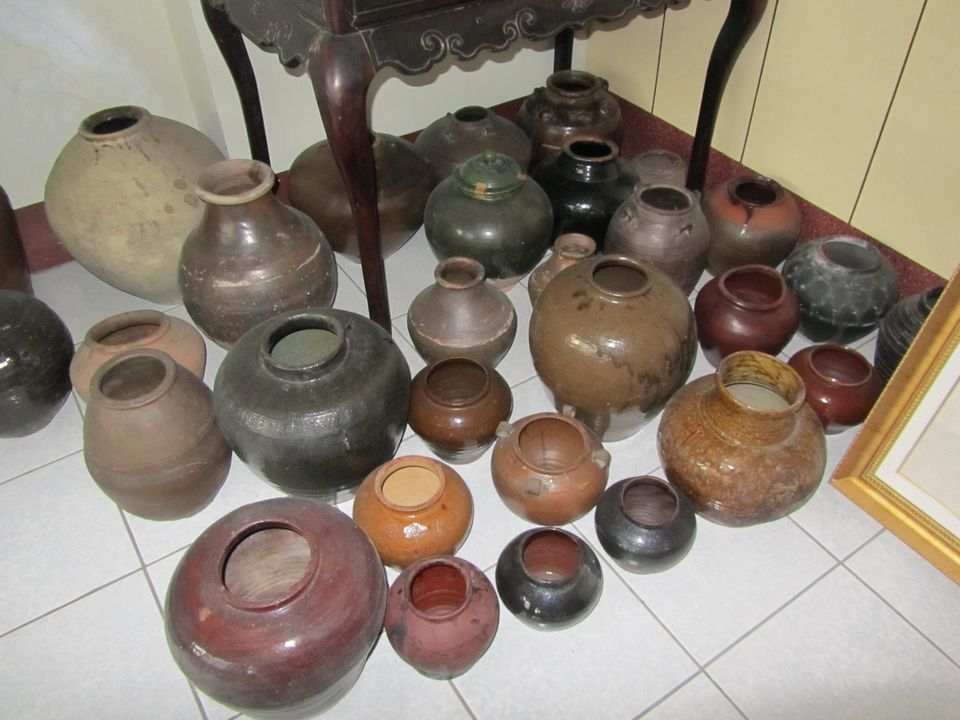
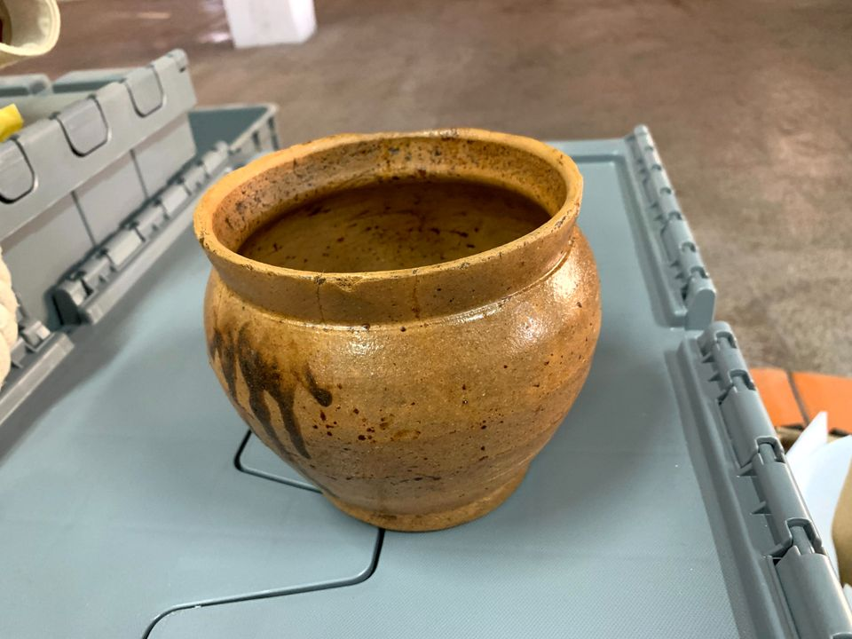
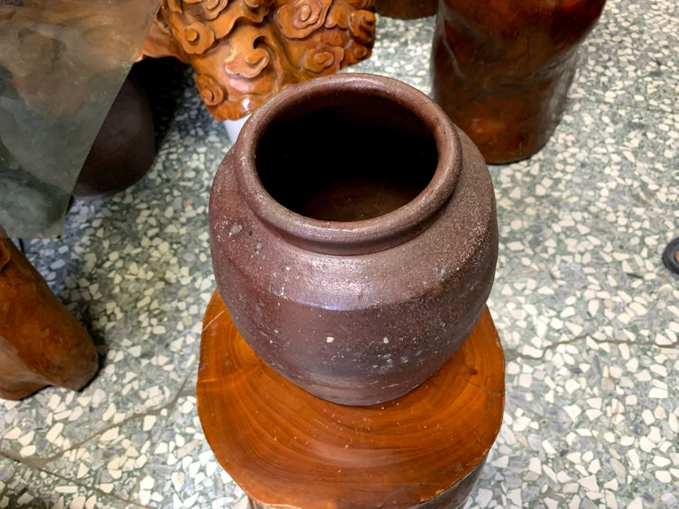

## 3-4. 碗桶á
>**Óaⁿ-tháng-á**
  
清洗煮食家私kap碗盤碗箸ê柴桶á，kho͘桶師傅kho͘--ê，雙pêng有柄，kap飯桶足kāng款，碗桶á嘴hiàn-hiàn khah闊，底khah淺。
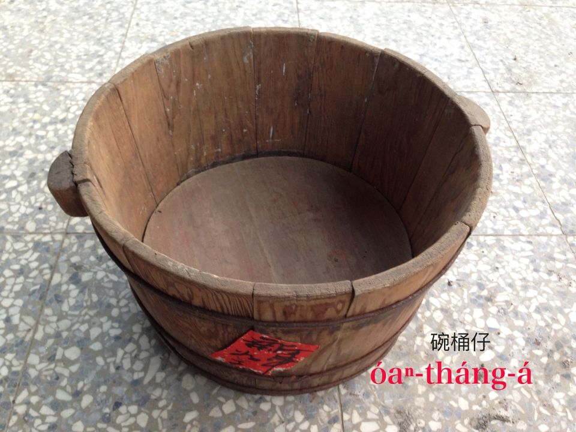

## 3-5. 醃缸
>**Am-kng**
  
醃缸to̍h是水缸，嘴大肚大，庄腳所在無水道水，khǹg-tiàm灶腳貯水煮食kài方便。A̍h是用來貯豬菜，sīⁿ醬鹹、貯米lóng真好用。
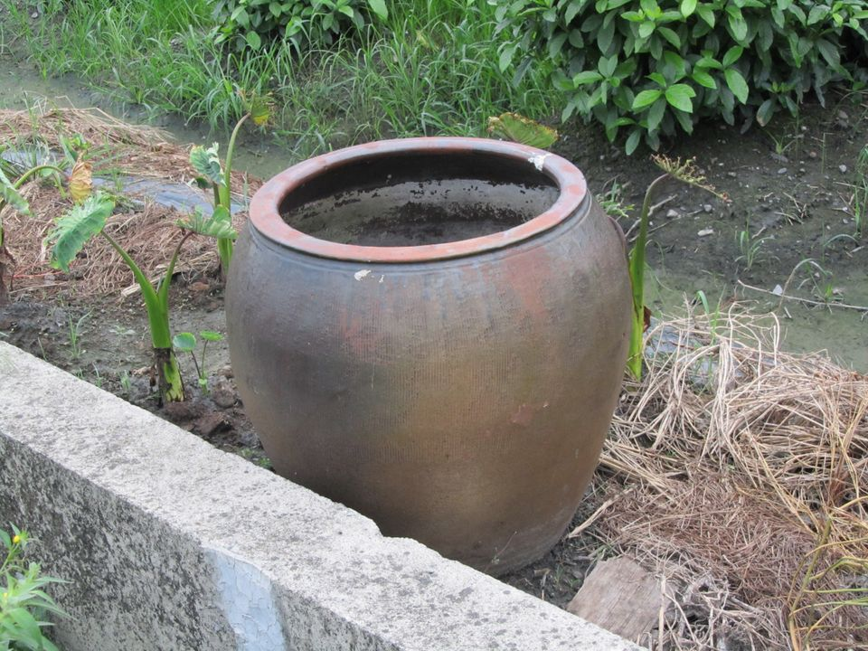
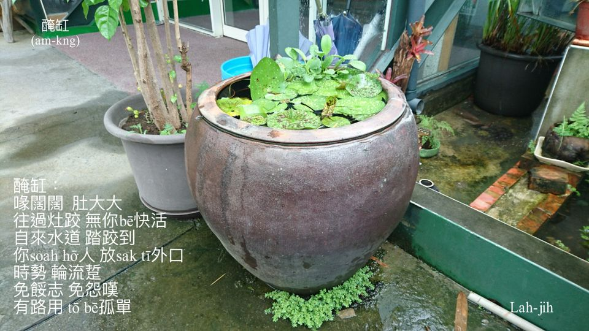
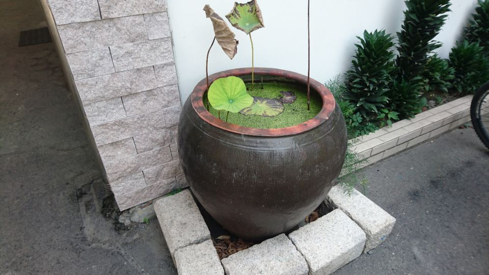
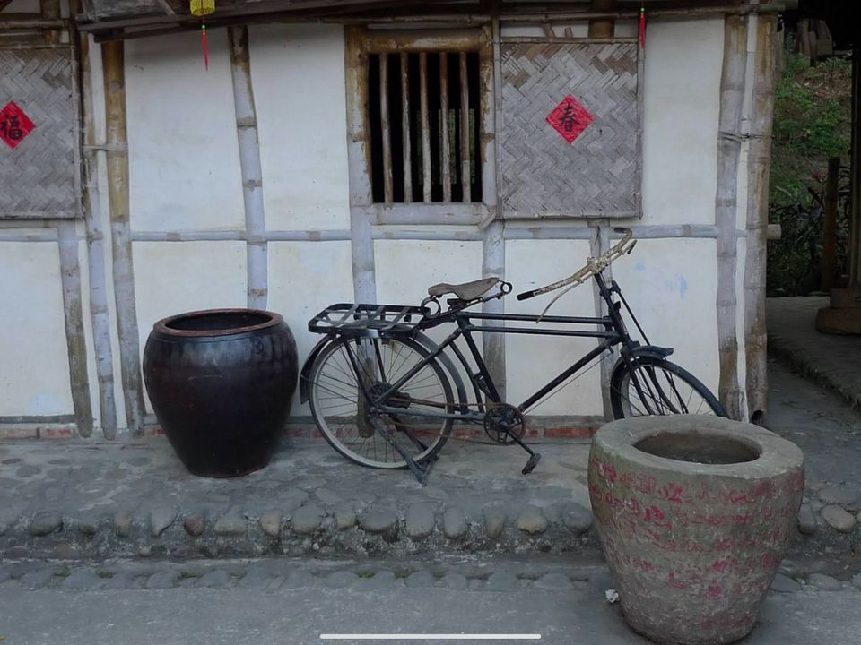

# 【Lah-jih散文書寫】豬油攪飯ê記智
>**【Lah-jih Sòaⁿ-bûn Su-siá】Ti-iû Kiáu Pn̄g ê Kì-tì**
  

豬油攪飯，chham 1-sut-á鹽花á，a̍h是lâm一匙á豆油，phang-kòng-kòng m̄免配鹹ē-sái-tit食kah m̄知thang飽。Sàn赤人家庭，豬油重要tī炒菜煮菜湯，無he liōng-siōng豬油khat來攪飯。

有一工，看tio̍h灶頭油筒á豬油tīⁿ-tīⁿ koh堅凍，腹肚一下iau，凊飯貯--leh，chhân-chhân豬油筒á豬油khat一湯匙，chham鹽攪攪--leh連sòa kiat兩碗，爽快ni-ni。Boeh暗á時陣，二嫂boeh煮飯，發現堅凍豬油lap 1-o，二嫂to̍h kā顧灶khang hiâⁿ火ê Lah-jih講：

「屘叔á，灶腳有niáu鼠！」

「Niáu鼠tī tó位？」

「是一隻足大隻ê niáu鼠。」

「二嫂，是我khat來攪飯--ē--lah！」

「無要緊，後pái to̍h m̄-thang，無豬油to̍h無法度炒菜炒芳芳。」
  
懷念二嫂ê疼惜，永遠siàu念。

# 4. 註解
> **Chù-kái**

|**詞**|**解說**|
|火塵lo͘|『附著在鍋底、煙囪等物的煙垢』。|
|thuh|『剔、剷、戳』。|
|áu鉛phiáⁿ|鉛（iân），『折鐵皮』。|
|ám|『稀飯中的液態米湯』。|
|hô͘起來|『撈起來』。|
|chhiau-chhiau lā-lā--leh|『攪拌攪拌』。|
|無油無sian|煮食欠油臊。|
|鹹siam|Bô-kiâm-bô-siam（無鹹無siam），『形容食物淡而無味，過於清淡』。|
|khiàn-phang|『烹飪時把蔥蒜等香料爆香以引出香味』。|
|au槽|『溝槽』。|
|ka-choa̍h|『蟑螂』。|
