# Té飯ê家私
> **Té Pn̄g ê Ke-si**

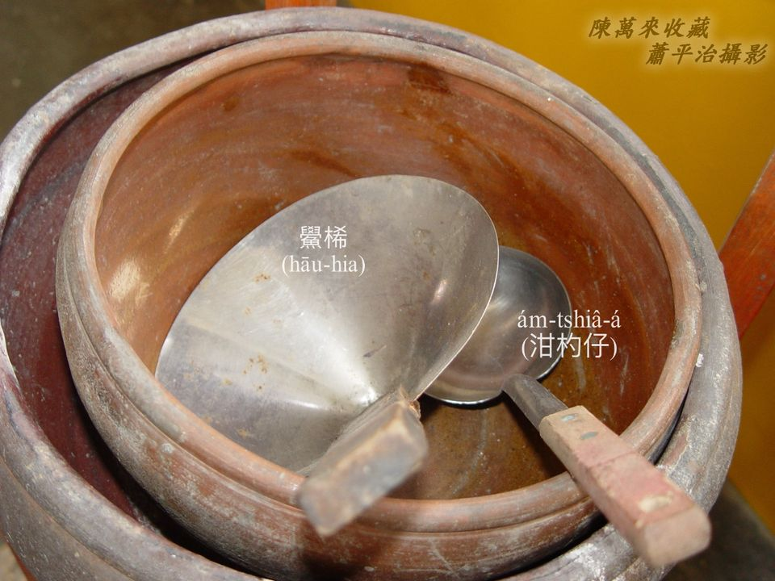

貯飯、貯糜容器用飯坩、飯桶，添飯khat糜需要飯匙、ám-chhiâ-á。

## 2-1. 飯坩
>**Pn̄g-khaⁿ**
  
粗hûi大肚闊嘴，用來貯飯貯糜，號做飯坩。
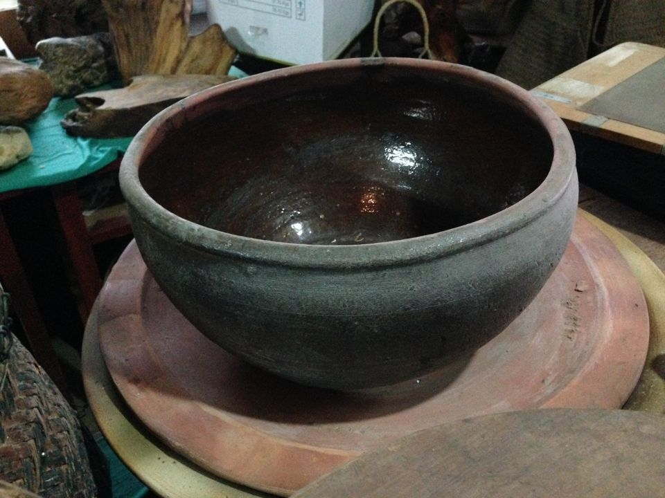
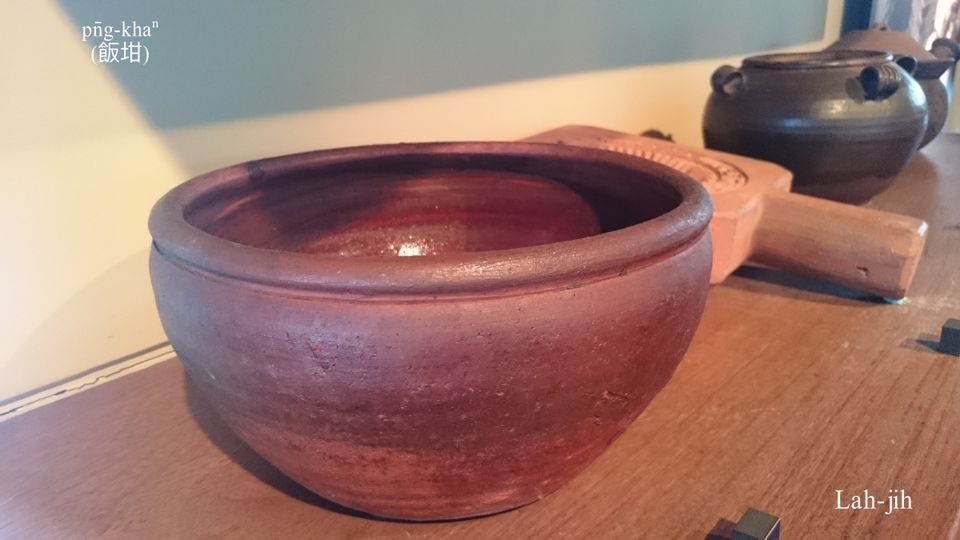
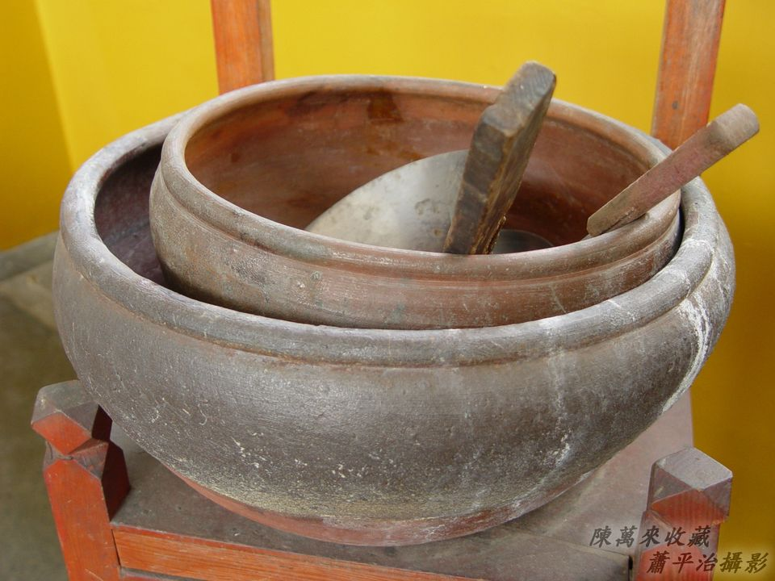

## 【Lah-jih台灣俗語】
- 食飯坩中央。
- 別人nā到飯坩，咱mā到碗籃。──精差無chē。

## 2-2. 飯桶
>**Pn̄g-tháng**
  
貯飯nā用柴桶，to̍h是飯桶，形體sêng米斗，有人講做飯斗。飯坩是粗hûi，貯燒飯燒糜ē燙手，無細jī ē kòng破，厝內搬徙，飯量無chē ē-sái--tit。Nā是飯量khah chē需要厝外搬徙，to̍h用飯桶khah bē燙手，安全利便。

飯桶khah衰，hō͘人用來phé-siùⁿ ham-bān、無路用。
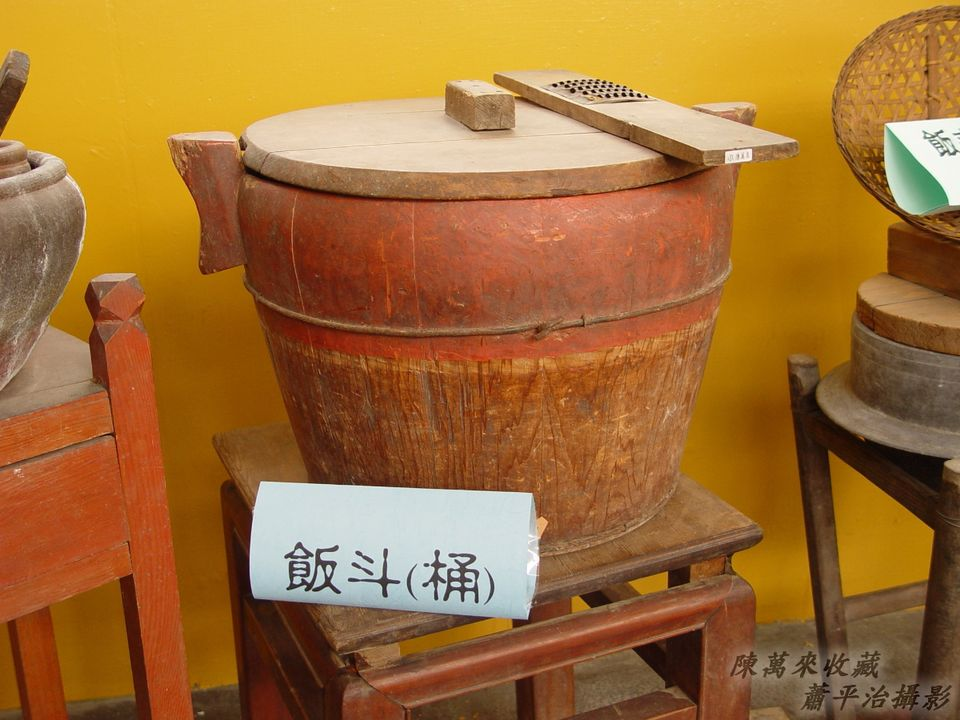
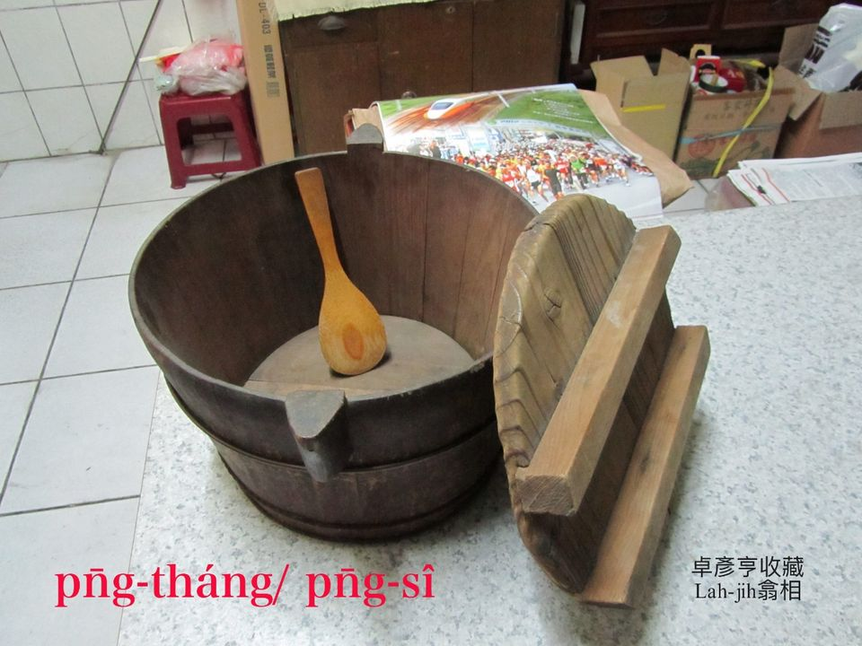
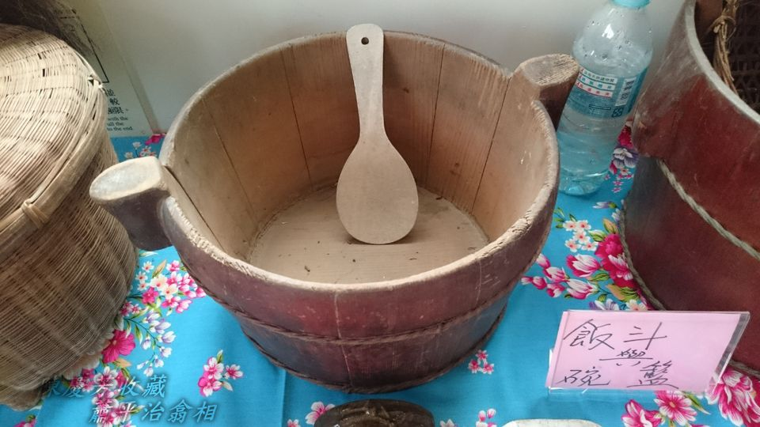
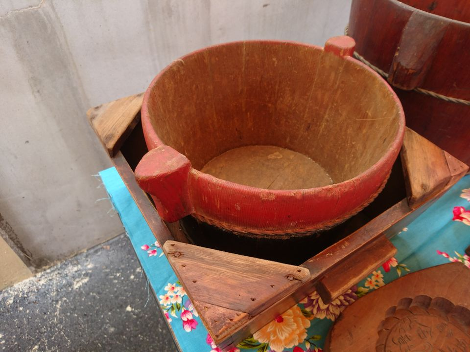
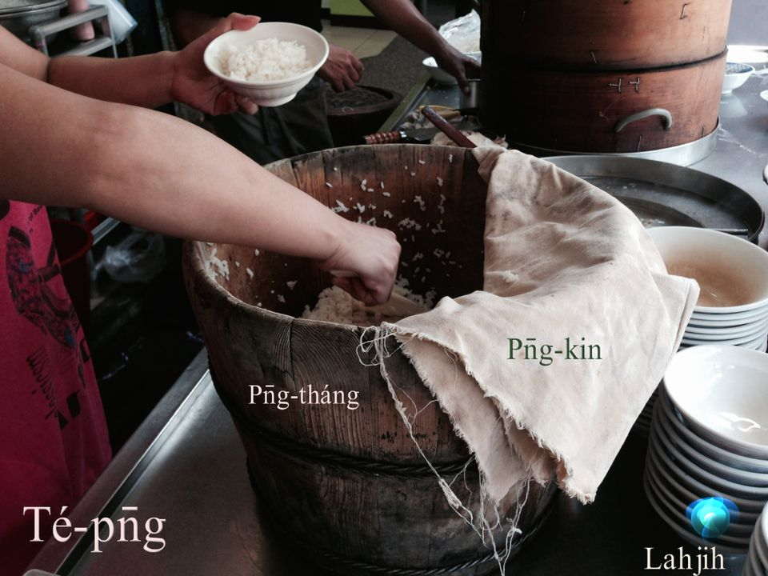

Khǹg飯桶ê飯桶架。
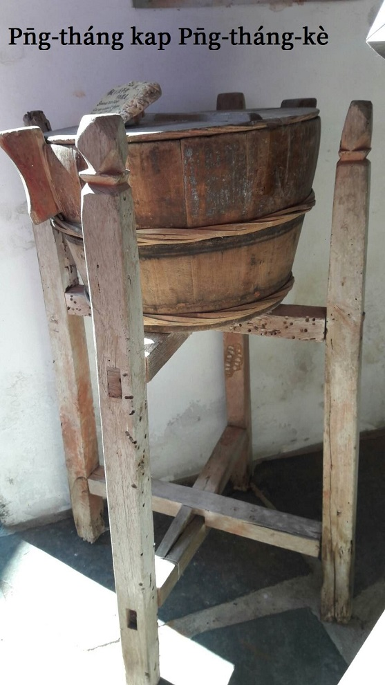

用手kōaⁿ ê飯桶。
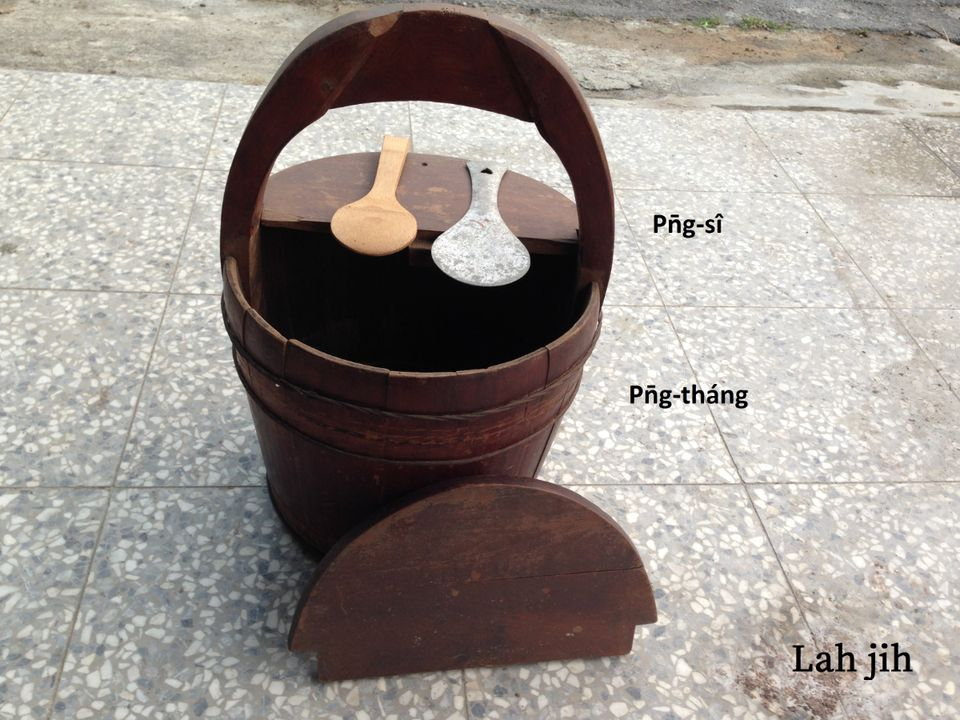

## 【Lah-jih台灣俗語】
- 飯桶掛車輪。
- 食飯皇帝大。

## 2-3. 飯匙
>**Pn̄g-sî**

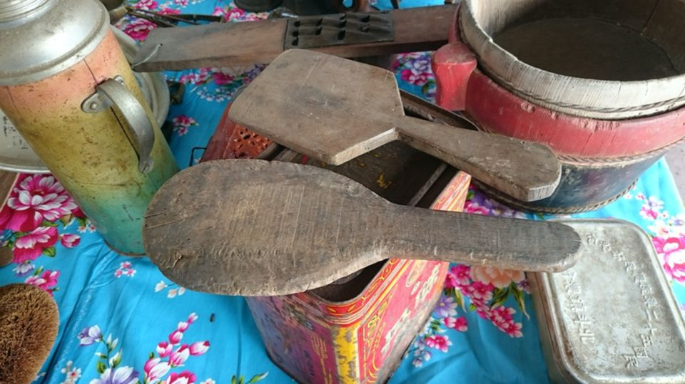
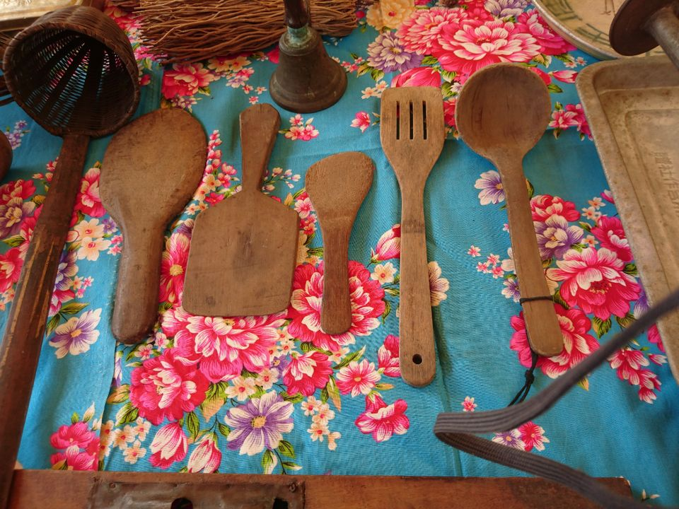

# 【Lah-jih散文書寫】飯匙Tú貓ê故事
>**【Lah-jih Sòaⁿ-bûn Su-siá】Pn̄g-sî Tú Niau ê Kò͘-sū**

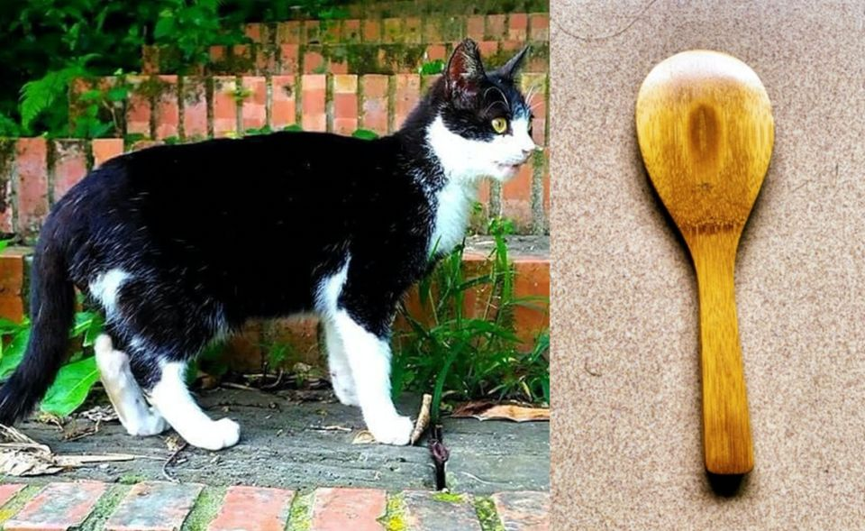

烏貓白肚，值錢兩萬五；竹á飯匙，中央1-kâi目，值錢兩萬六。

有1-ê pháiⁿ厝邊gâu計較，愛phiⁿ--人，有一工伊beh出門去外位thit-thô，驚做厝內hit隻貓á無人飼，ē走無--去，姑不將拜託厝邊tau tàu幫忙，允准伊ê貓á借寄--一-下。因為平常時á伊to̍h hèng kap人計較，人真無ài kap伊交陪，是伊有嘴講kah無nōa，人張--先-生chiah勉強答應伊ê要求。

好人pháiⁿ做，a̍h是張--先-生pháiⁿ運，hit隻貓仔soah phah m̄見--去，taⁿ害--ā，人轉來beh討貓á，討無beh如何？Phah m̄見 to̍h phah m̄見--à，會1-ê失禮kám bē-sái？貓á，koh lia̍h to̍h有，也m̄是siáⁿ-mih寶，kám m̄是--leh！極加koh買一隻賠--伊soah，了錢消災，算ka-tī衰。

Pháiⁿ厝邊to̍h是pháiⁿ厝邊，會失禮bē-sái--chit，買一隻賠講無kāng款貨，無用錢siāng好，m̄-kuh伊嫌siuⁿ少，beh gōa-chē chiah ē夠khùi？聽伊講koh講kah那吟詩：人阮hit隻貓是烏貓白肚，值錢二萬五，gōa價值--leh你kám知？Beh賠二萬五千kho͘，減1-kho͘銀都bē-sái--chit。

Chit聲piàng--à，無證無見，講kah寶貝ni-ni，beh án-chóaⁿ kap chit款人計較--leh？既然你用文--ē su̍t--我，我mā tio̍h用文--ē騙你倒轉來：

Ah tio̍h--lah！Ta̍k-ê lóng是好厝邊，有事慢慢á參詳，你m̄知ē記得--無？半年前你kā阮借一支飯匙--ā？（Hit支飯匙早tio̍h phiaⁿ hiat-ka̍k--去。）

有--lah！你m̄是講無beh討--à？

當然！當然！飯匙無beh討，你ē記得，一隻貓á你to̍h討chiah ân？

無--nò͘！He bē比--chit，人阮hit隻貓á是烏貓白肚，值錢二萬五--neh！恁hit支竹á飯匙ná有siáⁿ-mih價值？

兩個人自án-ne告去縣官hia，好ka-chài縣官人清白koh巧氣，伊問講：

你是按怎一隻貓á niâ，tio̍h beh ti̍h人二萬五千kho͘？

人hit隻是寶貓，烏貓白肚，值錢二萬五，算二萬五千kho͘ kám有酷刑。

Ah張--先-生，你hit支飯匙án-chóaⁿ講？Kám也有來歷？

有--nò͘！雖然是竹á做--ê，嘛是一支寶貝，chit支竹á飯匙，中央1-kâi目，價值二萬六，算二萬六千kho͘ mā無酷刑。

按呢二人攏有理，你倒貼張先生一千kho͘，有事koh通報，無事退tâng『堂』。

張--e肉bún笑，hit-ê pháiⁿ厝邊soah gāng-gāng。

「用飯匙抵貓」ê 故事to̍h是án-ne，做人tio̍͘h m̄-thang siuⁿ計較，你gâu人mā gâu，計較一世人kám to̍h有效？

# 3. 註解
> **Chù-kái**

|**詞**|**解說**|
|pn̄g-khaⁿ|飯坩，『裝飯的陶器』。|