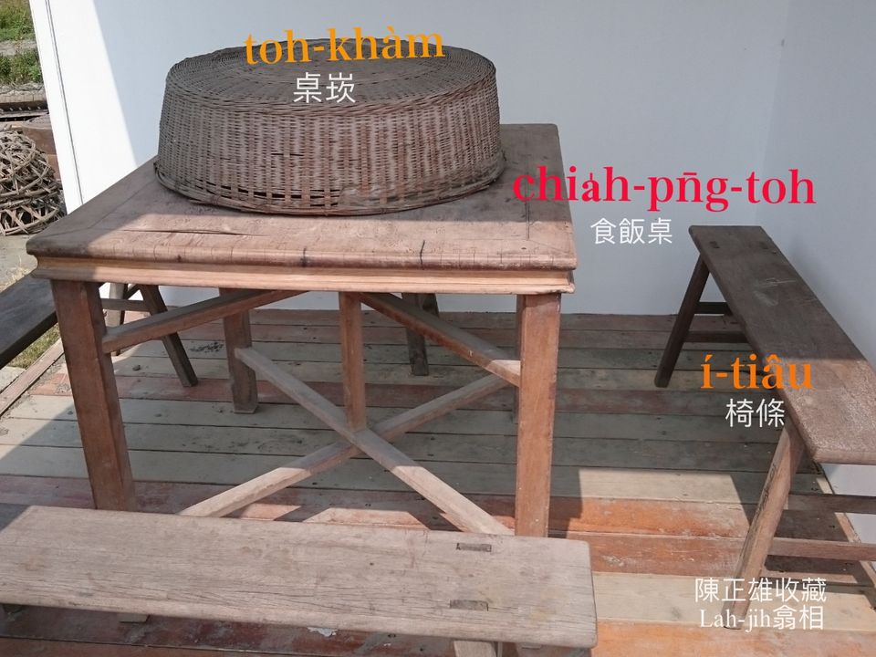
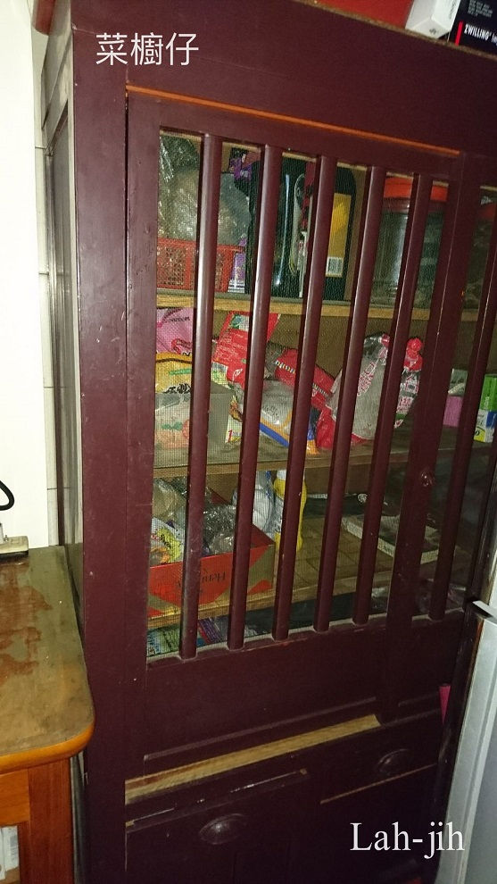
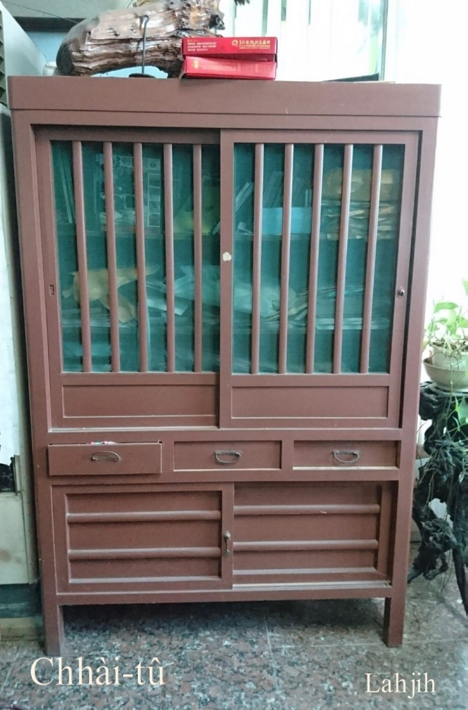
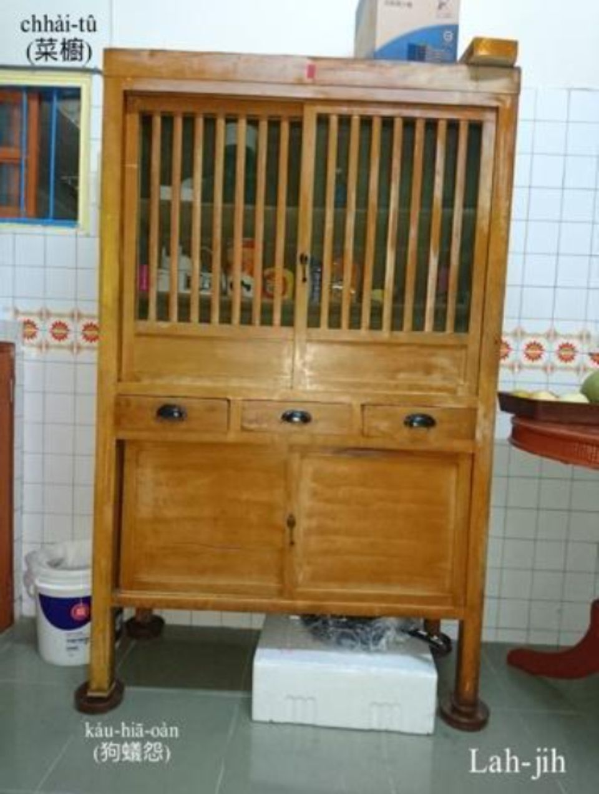
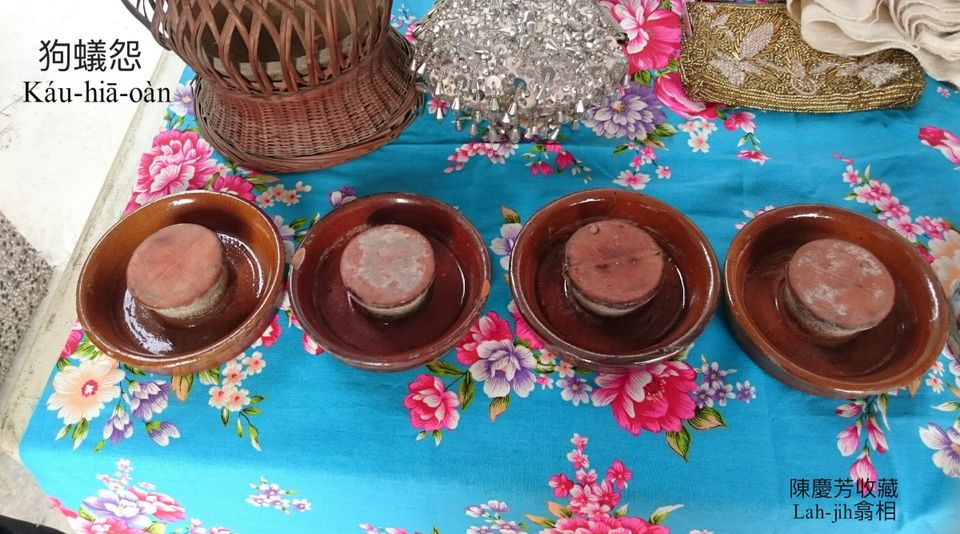
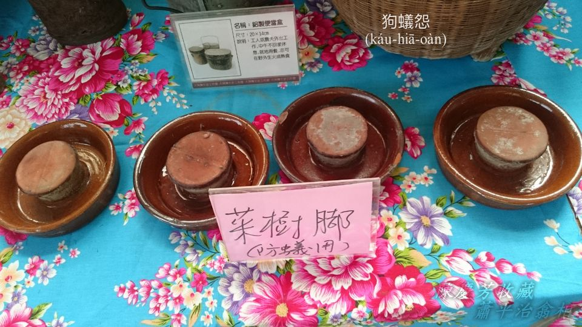
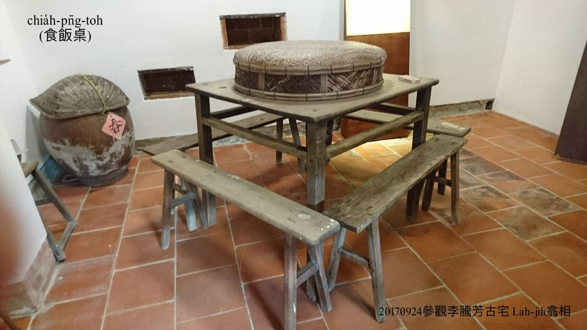
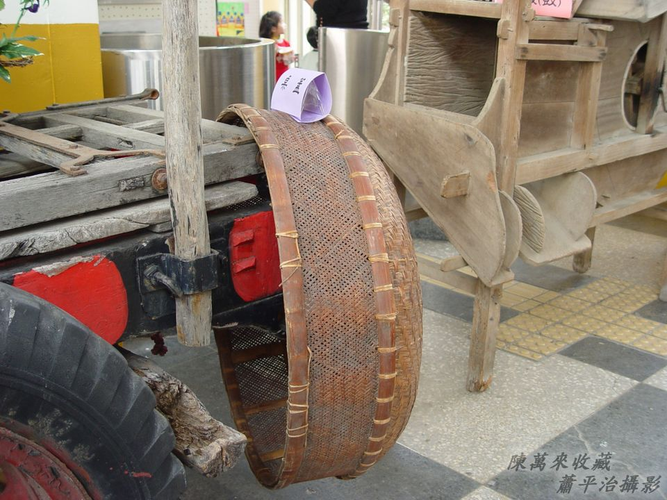
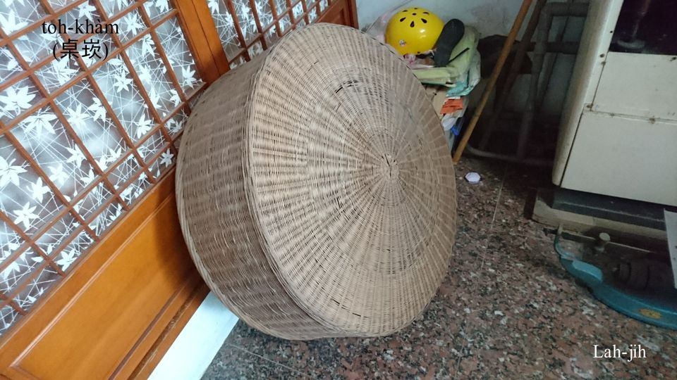
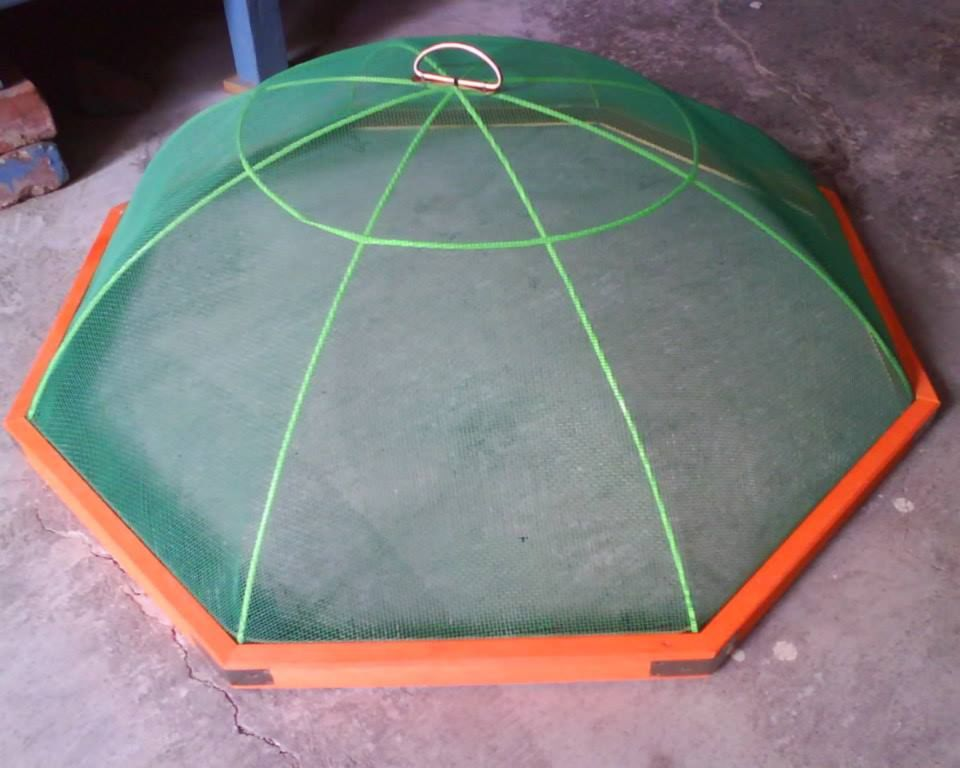

# 凊菜收khǹg
> **Chhìn-chhài Siu-khǹg**

# 1. 家私
>**Ke-si**

## 1-1. 菜櫥á
>**Chhài-tû-á**

木匠製造菜櫥算是高級品，菜櫥khǹg碗盤、食物、菜蔬、凊飯、凊菜，需要通風防蚊蟲狗蟻胡蠅，所以菜櫥á門是網á門，菜櫥á tio̍h thiap狗蟻怨。

## 1-2. 狗蟻怨／菜櫥腳
>**Káu-hiā-oàn/Chhài-tû-kha**
  
Hûi-á製品，形體kài-sêng豬á-kiáⁿ ê圓形豬槽，溝槽內貯水，thiap桌腳、菜櫥á腳，hō͘狗蟻怨嘆sô bē到菜櫥、桌頂。號名狗蟻怨有夠合軀。Mā號做菜櫥腳。

- 教育部辭典：狗蟻碟á（Káu-hiā-ti̍h-á）。

## 1-3. 桌khàm
>**Toh-khàm**
  
古式桌khàm是篾á pīⁿ，kài-sêng籠床蓋（kòa），差別tī籠床蓋 khah密，桌khàm khah通風。三頓食飽，食無了ê菜湯需要thn̄g--過chiah用桌khàm khàm tiâu，chiah-bē siâⁿ胡蠅蚊蟲來cham。灶腳無菜櫥a̍h是菜櫥siuⁿ細，桌頂kō͘桌khàm khàm--leh to̍h是菜櫥。

# 2. 註解
> **Chù-kái**

|**詞**|**解說**|
|toh-khàm|桌khàm，『桌罩』。|
|蓋|Kòa，『蓋子』。|
|thn̄g--過|Thn̄g--kòe，『食物涼了之後再次加熱』。|
|siâⁿ|『引誘』。|
|胡蠅蚊蟲|Hô͘-sîn báng-thâng，『蒼蠅，蚊子』。|
|cham|『稍微碰觸或沾上』。|
