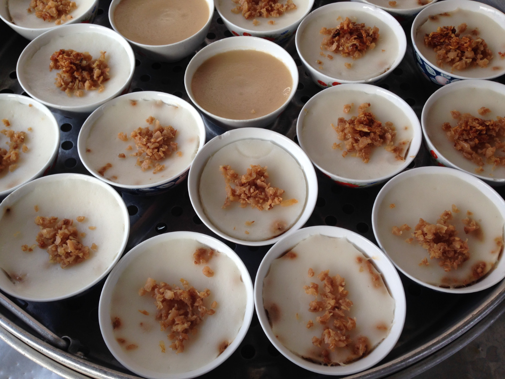
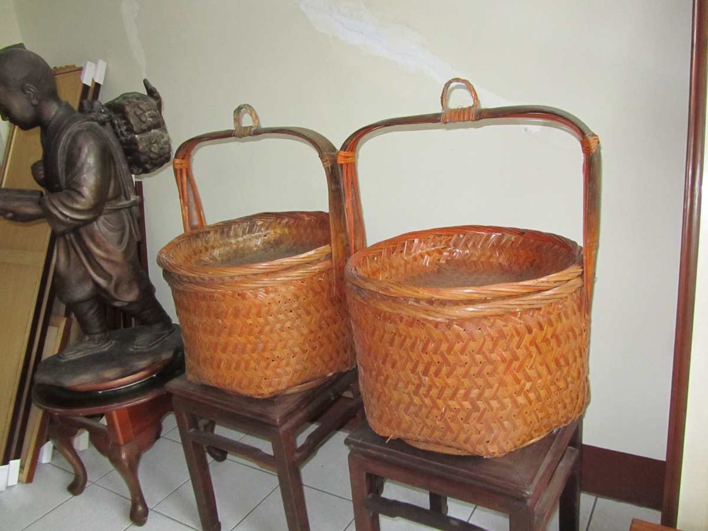
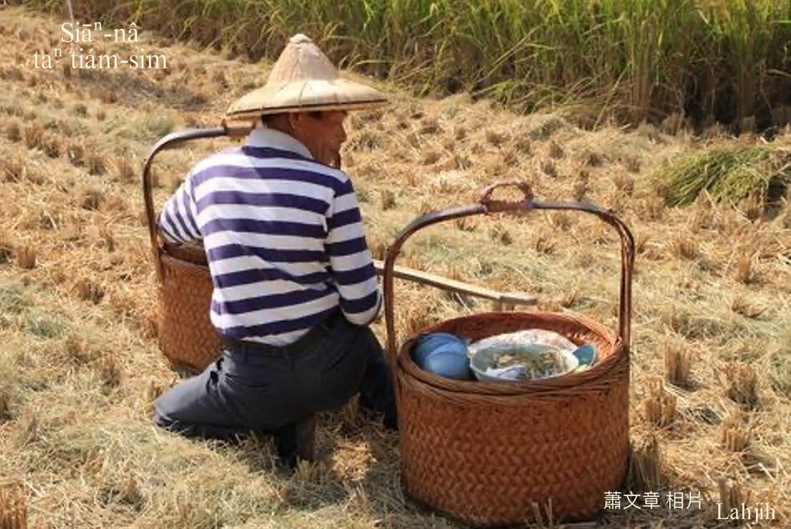
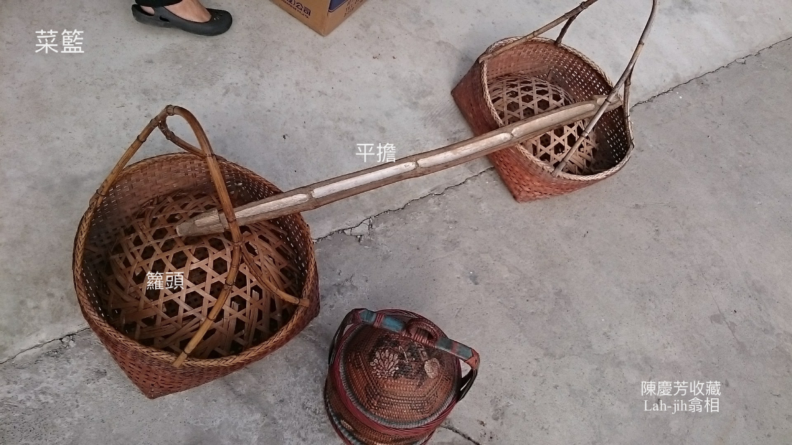
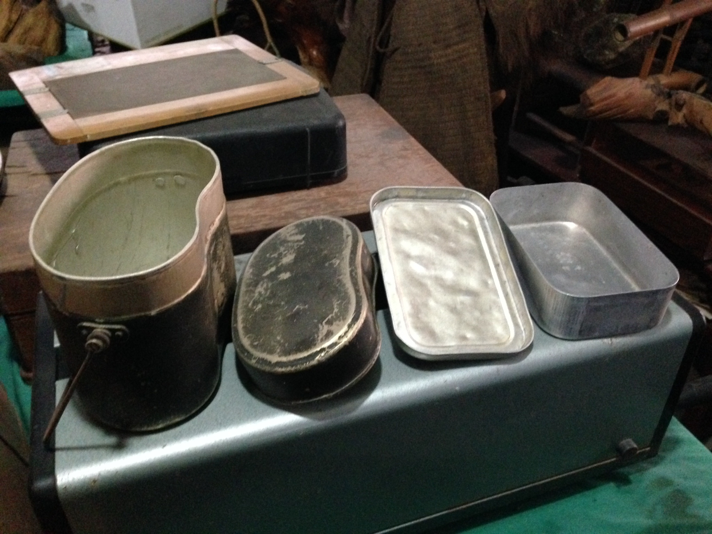
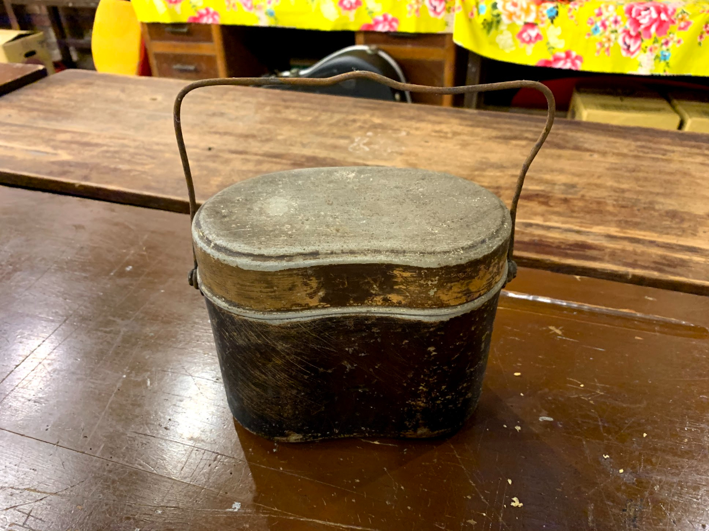
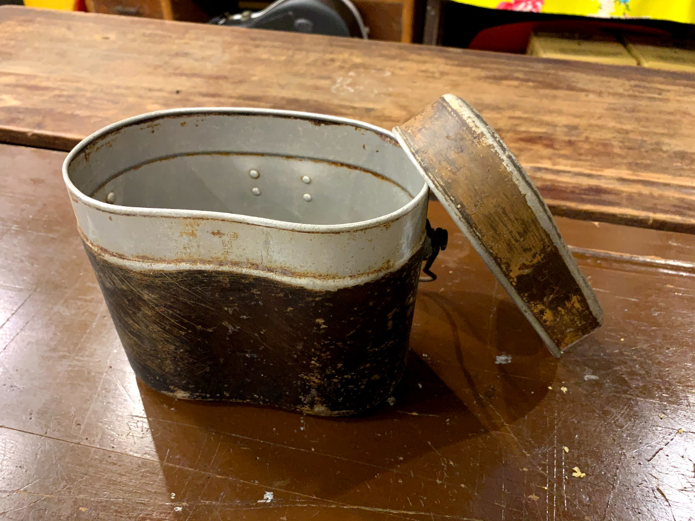
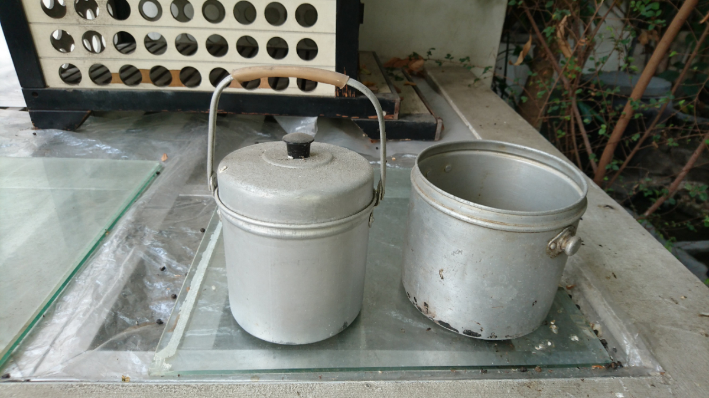

# Éng過食點心ê因端
> **Éng-kòe Chia̍h Tiám-sim ê In-toaⁿ**

古早古早，tī hit-lō sàn赤ê年代，庄腳所在除了有田有園ê好額人，大部份lóng是手面趁食ê pa̍k田佃農，有ê作2-3分地，有ê 5-6分，也boeh三頓，也boeh納租，頭嘴是hiah-nī大陣，ta̍k冬lóng是寅食卯糧，利不及費，ko͘-put-lī-chiang tio̍h出外趁食a̍h是做散工相添日常所費。

像chit-lō三頓都jiok bē-hù，ná有hit-lō額外ê食si̍t thang食點心--leh？記得gín-á時代，bat聽大人án-ne唸：「米傷重，長工á m̄-thang chhiàⁿ--lah；你講he sáⁿ-siâu話，無食ná ē做--lah。」親像唸謠mā ná親像唸歌。你ka想，一甲子前，無奈苦楚tio̍h kā人做長工ê sàn赤人，為tio̍h三頓飽，soah hō͘ he tàng-sng hân-san kho̍k-á頭ê地主án-ne chau-that，實在是bô-siá-sì。

莫怪咱人早to̍h有「三碗飯，兩碗菜湯；米甕á弄鐃；做，m̄驚長工死，食，m̄驚主人窮；煩惱十三代kiáⁿ孫無米thang煮飯；生食都無夠，ná有thang曝koaⁿ。」Chia-ê俗語。

講kah chiah-nī可憐tāi，作田人kám有leh食點心？有--lah，是比較khah罕--得，比較khah簡單niā-niā。

三頓除外ê食si̍t to̍h是點心，食點心方式chiâⁿ chē款，ka-tī煮、kō͘錢買，厝內食、田--裡食，講通和、ka-tī來，功夫煮、chhìn-chhái食，是ē-tàng治iau止飢，m̄是gín-á sì-siù-á。

# 1. Taⁿ點心ê家私
>**Taⁿ Tiám-sim ê Ke-si**
  
無食ná ē做，講起真有道理，駛田、插秧á、so草、割稻á，a̍h是khàm厝頂、giâ粟包其他穡頭，lóng是粗重食力工課，食有飽chiah有氣力，無論chhiàⁿ人做a̍h是ka-tī做，除了三頓，mā tio̍h半晝á半晡á補貼點心，1日5頓bē-tàng省，點心ē-tàng chhìn-chhái，總--是糜飯tio̍h有，配鹹簡單無要緊。人chē用siāⁿ籃taⁿ點心，人少to̍h用菜籃á kōaⁿ點心。

## 1-1. Siāⁿ籃
>**Siāⁿ-nâ**
  
名號做「siāⁿ籃」，m̄-koh m̄是「siāⁿ」，無做嫁娶禮俗扛siāⁿ扛kioh-á ê路用。

竹篾á編織，大像米籮，形體sêng siāⁿ籃á，有kōaⁿ有耳，有1-ê層á，m̄-koh無蓋。雖bóng bē用得tī嫁娶，m̄-koh chhin-chiâⁿ相thīn，祝壽送禮，拜神款金紙牲禮lòng tio̍h伊taⁿ擔貯物。平常時siāng捷用來年節買ta料，a̍h是田--裡taⁿ點心，mā是吊koân khǹg ta料siāng安全所在，大部份家庭lóng有一擔。

## 1-2. 菜籃á
>**Chhài-nâ-á**

挽菜khǹg菜，貯果子，kōaⁿ簡單點心‥‥‥。Khah chē用竹篾á pīⁿ，用鉛線pīⁿ mā是有。

# 2. Kōaⁿ點心ê家私
>**Kōaⁿ Tiám-sim ê Ke-si**

## 2-1. 飯包Khok-á
>**Pn̄g-pau-khok-á**
  
有kōaⁿ耳號做hăng-gó͘，除了貯飯菜koh ē-tàng貯湯；長四角形ê a-lú-mih盒á叫做飯包khok-á a̍h是便當盒á ，早期出門作穡、出勤、讀冊，中晝頓bē-tàng轉去食飯時，to̍h ē chah飯包食中晝，特別是讀初中高中學生偷食飯包ê甜蜜記智。

## 2-2 Kōaⁿ鍋
>**Kōaⁿ-ōe**

Kōaⁿ鍋té飯菜té湯lóng ē-sái-tit，到taⁿ猶原有人teh用。

# 3. 註解
> **Chù-kái**

|**詞**|**解說**|
|pa̍k田|Pa̍k-chhân，『租田。租用田地耕作』。|
|佃農|Tiān-lông，『佃農、佃戶。租用別人的田地從事農業生產的農民』。|
|頭嘴|Thâu-chhùi，一家ê人口。|
|所費|Só͘-hùi，『費用、花費』。|
|jiok bē-hù|『追不上。趕不及』。|
|食si̍t|Chia̍h-si̍t，『飲食』。|
|長工á|Tn̂g-kang-á，『長期被傭僱的工人』。|
|chhiàⁿ|『聘僱、僱用。僱人來幫忙做事』。|
|sáⁿ-siâu話|『什麼話』。|
|kho̍k-á頭|『吝嗇鬼』。|
|chau-that|『輕侮對待』。|
|bô-siá-sì|可憐tāi。|
|講通和|Kóng-thong-hô，『有志一同』。|
|sì-siù-á|『零食、零嘴』。|
|kioh-á|簡單型ê siāⁿ，kan-nā淺淺長liau四角型無蓋ê柴箱仔，叫做kioh-á，縛索仔耳兩人用棍仔扛。|
|半晝á|『近中午時分』。|
|半晡á|『中午過後時分』。|
|親chiâⁿ相thīn|Chhin-chiâⁿ sio-thīn，『親戚互相支持』。|
|hăng-gó͘|はんごう，日語ê『飯盒』。|
