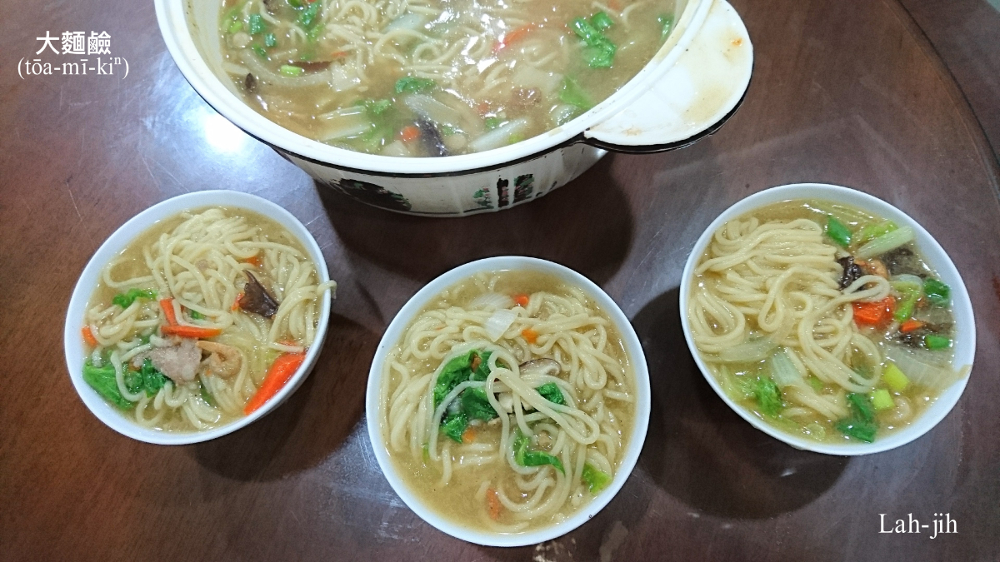
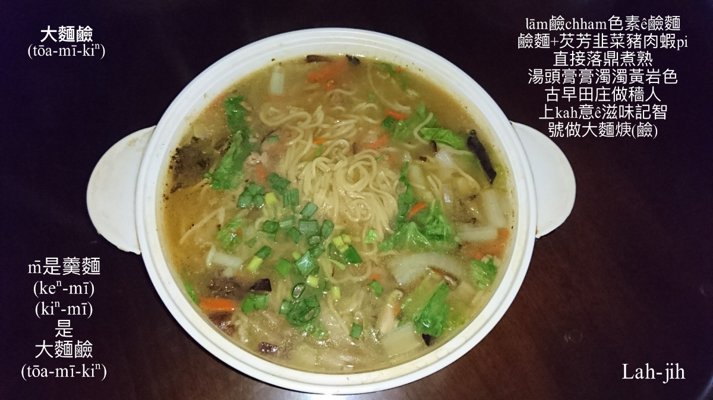

# Hōng點心是Siáⁿ-mih？
> **Hōng Tiám-sim sī Siáⁿ-mih?**

# 1. 哄點心
>**Hōng tiám-sim**

Hōng點心to̍h是幾ê人做夥開講，無意中起hōng，決定boeh煮點心來食ê意思。

庄腳人「Nn̄g-tǹg chhiⁿ, chit-tǹg chian／兩頓星（鮮），一頓煎」ê生活，平常時罕得有清閒ê時間，nā阮崁頂庄作田人，kui庄lóng是兄弟叔孫，hōng點心時常tī明á載m̄免落田作穡ê前1暗，hit暝聚會開講phò-tāu ē拖khah òaⁿ，to̍h有人提起食點心ê建議，有人主動出錢出料，nā tī阮tau集會，to̍h叫阮阿嫂起來煮，簡單大麵鹼（kiⁿ）、sa̍h麵線、kûn米糕糜，to̍h ē-tàng食kah嘴笑目笑，轉去輕鬆眠夢。

# 2. 紹介快煮好食ê點心
>**Siāu-kài Khoài Chú Hó-chiah ê Tiám-sim**

## 2-1. 大麵鹼
>**Tōa-mī-kiⁿ**

台灣大麵有lām食用鹼chham食用色素，所以pìⁿ-chiâⁿ黃gām色，用水sa̍h熟chhiau一寡油（火油）hō͘伊bē黏黏做夥，叫做油麵，boeh煮食時chiah用來炒大麵炒、chhek-á麵。Nā是無sa̍h to̍h直接落鼎chham料煮湯，麵條to̍h ē糊糊，湯ē濁濁，án-ne to̍h是大麵鹼（kiⁿ）。Nā是kō͘油麵牽羹lām料煮湯，是羹麵（keⁿ-mī/ kiⁿ-mī），che是無仝ê煮食。

羹麵（keⁿ-mī／kiⁿ-mī） vs 大麵鹼（kiⁿ），有人分bē清，花kô͘-kô͘霧sà-sà。

大麵鹼是goán Khàm-téng-chng特別ê料理，台中hán kah chiâⁿ出名。

## 2-2. 米粉芋
>**Bí-hún-ō͘**

米粉料理，有煮湯mā有ta炒，煮湯是米粉湯，炒--è叫做米粉炒。芋á hām米粉煮湯ê羹頓，有時講芋á米粉，有時講米粉芋。

米粉芋、芋á米粉好食通人知，雖bóng chit-má煮食khah有油sian khah有料，m̄-koh iáu是懷念早當時ê米粉芋khah有芋á芳，為siáⁿ-mih？

一般芋á有兩種，一種麵芋，一種檳榔心芋，麵芋產量khah好，檳榔心--e khah芳，檳榔心--e切開內面有1-chhiam 1-chhiam ná檳榔粕ê纖維，chit-má chit款ê檳榔心芋已經m̄-bat看--tio̍h，市場賣--ē，作田人ka-tī種--è lóng是倚近麵芋kap檳榔心中間ê品種，比麵芋khah好食，m̄-koh無檳榔心芋hiah-nī芳。

# 【Lah-jih散文書寫】Hōng點心ê暗暝
>**【Lah-jih Sòaⁿ-bûn Su-siá】Hōng Tiám-sim ê àm-mî**

#### 記19510715挨弦á，20130113重新整理，Lah-jih

「六六凡-/六六凡-/ㄨ工上合/ㄨ---/六六凡-/六六凡-/ㄨ工上合/ㄨ---/‥‥‥」

阿爸又leh挨hit條六六凡-/六六凡-/ㄨ工上合/ㄨ---/ê曲調，m̄-nā挨了好聽，koh挨kah ē loah-cháiⁿ、ē跳弓，輕快活跳ná舞曲，不止á有表演天份，伊愈挨愈soah-phah，愈挨愈心適，雖然阿爸知影he m̄是挨boeh hō͘人跳舞--è，m̄-koh伊soah ka-tī挨，ka-tī ná leh hàiⁿ頭搖身軀。

「振á叔公，你m̄是ē-hiáu挨 一支香á （it-ki-hiang-á），hit條曲真好聽，你挨hō͘阮聽好--無！」木聰--e在來to̍h-sī好頭嘴koh興講話，伊án-ne kā阮pâ鋪排。

「一支香á，ē--nò͘！He m̄ khah簡單，雖然講簡單，m̄-koh mā是無簡單？」

「雖然講簡單，m̄-koh mā是無簡單？振á叔公！你講he阮聽無？到底是簡單a̍h是無簡單？」

「講簡單，是有影真簡單，我先唸譜hō͘恁聽看māi，恁to̍h知影chiâⁿ簡單：

士上合乙/士-/合士合工/ㄨ-/六工ㄨ/ㄨ六工六/ㄨ-/上工ㄨ上/合士合/工六/ㄨ六工ㄨ/上乙/士合工合/士乙ㄨ/士-/

（6157/6-/5653/2-/532/2535/2-/1321/565/35/2532/17/6535/672/6-/）。

Án-ne ê譜唸起來有簡單--無，不過nā講boeh ka挨kah hō͘伊ē牽絲ē軟lio̍h，to̍h無簡單--lò͘，譜愈簡單愈pháiⁿ挨，挨了無好，to̍h m̄-thang笑！」

「振á叔公！Án-ne講阮soah愈聽愈花，譜愈簡單愈pháiⁿ挨？Siuⁿ深--lah，ná鴨á聽雷--leh!」

「Ah無boeh án-chóaⁿ講？He我也bē hiáu解說，mài koh問，挨hō͘恁聽to̍h知影！」

人一下o-ló，阿爸絃á又koh giâ--起來，開始挨hit條「一支香á」士上合乙/士-/合士合工/ㄨ-…

阿爸tăⁿ挨soah，tú好順良--ē來到位：

「振á叔！挨了足進步--ē-ō͘！」

「A̍h soah有？挨一下慢，soah giōng-boeh走音去，iáu是挨khah緊--leh khah bē落氣。」

「Che是慢吹板，m̄是緊吹板，tú-chiah振á叔án-ne挨是正確--è，挨了mā進步真chē。」

「Eh！順良á叔，振á叔公講，譜愈簡單愈pháiⁿ挨，kám有影？是m̄是講慢吹板比緊吹板khah pháiⁿ挨？」木聰--e雖bóng厚話，iáu是有伊巧氣ê所在。

「tio̍h！tio̍h！tio̍h！因為慢吹板ê曲khah慢，音nā挨走精--去，a̍h是板條挨無準，隨時to̍h聽ē--出來，隨時ē hō͘人lia̍h包。」

「Siáⁿ-mi̍h是慢吹板？」M̄-nā木聰--ê厚話niâ，來阮人客間á承話鬚ê gín-á伴，ta̍k ê lóng chiâⁿ kia̍p嘴chiâⁿ-gâu問話，ta̍k項tāi-chì都boeh問kah一支柄thang giâ。

「Pûn鼓吹ê人講做慢吹板、緊吹板，to̍h是恁學校老師講ê慢板、快板--lah，tú-chiah振á叔挨ê chit條一支香á to̍h是慢吹板。」師傅to̍h是師傅，順良--ē是阮庄--裡集興軒（Chi̍p-hin-ian）ê頭手師，吹、絃、鑼、鼓ta̍k項ē，伊ê解說，伊ê開破，阿爸是聽kah注神注神。

阿爸ê人hèng展koh gâu客氣，che to̍h是伊人樂暢ê所在，40 thóng歲阿母to̍h來過身，soah來「半路折畚擔」，阿爸堅心無koh娶，甘願守孤單，是驚做1-tīn kiáⁿ ē hō͘後母苦毒。Hit年我chit ê 屘á-kiáⁿ iáu-bōe滿4歲，是好ka-chài 1-tīn kiáⁿ iáu算真乖巧，大漢--è ē-hiáu tàu khîⁿ家，少年家á ē-hiáu tàu chhōa細--è，chiah bē hō͘細漢--è tiàm土腳兜四界爬。別人看阮一家有影苦憐tāi，m̄-kú阿爸伊從來to̍h m̄-bat哀哀cha̍p-cha̍p過。

阿爸除了田--裡作穡以外，to̍h是厝邊隔壁bóng行踏，一雙腳ná掃梳--leh，掃過來、掃過去，m̄是tī福--à in tau phò-tāu，to̍h是tiàm làu肚西--a ê店á頭話仙，一工se̍h boeh五、六遍，人lóng mā keng-thé伊是掃梳腳，雖然過家範圍無闊，有tāi-chì boeh chhōe伊ê人，有tang時á koh tio̍h chhōe幾nā chōa。伊siāng趣味ê娛樂to̍h是挨殼á弦，每日暗頓nā食飽，阮chit間人客間á to̍h是厝邊隔壁ê集會所，做田兄議論參詳田--裡穡頭ê會議室，明á載boeh  so chiâ ê草，後--日boeh割siáng ê稻á，lóng是tī chit間間á做決定。

每日boeh暗á，「日頭落海，鬼á出來放屎」ê時陣，tāi-seng來報到ê是少年gín-á thûn kap幾ê-á pān-tōaⁿ讀冊ê gín-á伴，A-pêⁿ--lah、Ka-ióng--ê-lah，siāng gâu phah kan-lo̍k ê A-hiông--lah，in lóng mā piàⁿ第一。我是m̄敢kap人chham leh問東問西，因為冊tio̍h讀，插嘴koh驚人罵，m̄-chiah ka-tī一人tiām tiām坐tiàm眠床道，覆tiàm hit隻也boeh khǹg茶鼓茶甌，也boeh khǹg電土火，也boeh hō͘ hō͘我寫宿題ê桌á，頭是m̄敢siuⁿ捷taⁿ，目chiu ná看冊，字是認真寫，耳á mā piàⁿ勢聽人leh講話，希望承一寡趣味ê話鬚，a̍h是有好khang ê NEWS。

順良--ê講soah，Chùn--è已經入門，阿爸將絃á tu hō͘伊，伊to̍h絃á線絞絞--leh，合ㄨ、合ㄨ（sò͘.le.sò͘.le.）調音調好勢，to̍h sòa落去挨「百家春」（pek-ke-chhun）：工六ㄨ工/上---/上工ㄨ上/士---/士合工合/士-ㄨ工/上-士上/合-工ㄨ/合……。Che是南管曲，應該mā是慢吹館，hō͘ Chùn--è挨kah ē牽絲，kap阿爸挨--e無kāng款滋味。

Chùn--è tòa阮後壁溝，伊加阿爸兩歲，減我一輩，所以我lóng tòe阿爸叫伊Chùn--è，lóng是親堂，論輩無論歲，m̄是gín-á人無大無細。Chùn--è ê功夫比阿爸khah讚，ē-hiáu用大管絃kap人挨反館『二部合聲』，chit步阿爸to̍h khah輸，sian學都學bē hiáu，莫怪阿爸tī伊ê面前甘敗下風，Chùn--è「百家春」挨soah，殼á絃交hō͘阿爸，換去gia̍h壁頂hit支大管絃，叫阿爸koh挨「一支香á」，伊boeh挨反館kā阿爸和，「士上合乙/士-/合士合工/ㄨ-…」1-koân一低，有影加真好聽，挨soah ta̍k ê phah phok-á o-ló，in to̍h無koh挨，講boeh ha一甌á茶，pok一支á薰，絃á tăⁿ掛--落-去，A-pêⁿ隨時to̍h kā sa起來leh ōⁿ-iⁿ ōⁿ-iⁿ…

「A-pêⁿ！Mài挨--lah！Ná leh鋸死羊á--leh，聽tio̍h ē起雞母皮--lioh。」

Bē-hiáu挨to̍h mài挨，ká-ná tiàm-hia ōⁿ-iⁿ ōⁿ-iⁿ，你kám聽有花字，人是leh和絃á線，公母線tio̍h合「hō͘、chhe，hō͘、chhe、」án-ne，m̄是像你án-ne「硬爭、ngē-chiⁿ」，「Bē-hiáu挨弦á，顧絞線；bē-hiáu pûn吹，顧pûn-nōa」to̍h是你A-pêⁿ。

「我kám有leh pûn鼓吹--hio͘h！」A-pêⁿ ê人有khah ham-bān有khah條直，講tio̍h話lóng sa bē tio̍h cháng頭。

「Ò͘！Nā koh hō͘你pûn鼓吹，m̄ tio̍h ta̍k家耳khang that-that--起-來？」

Tng-tong gín-á伴leh消遣A-pêⁿ「bē-hiáu挨弦á，顧絞線」ê時陣，阿爸看人馬已經齊到，開始boeh會作穡人ê khang-khòe，to̍h交帶阮chiah-ê gín-á兄暫時歇睏mài sńg：「Gín-á閃開，大人boeh展威，好--à，mài sio-chèⁿ--à，換大人ê齣頭，chit-mái起，大人boeh會議，恁m̄-thang講話。」

割稻á班ê班頭O͘--e講：「早冬粟á lóng曝好勢，慢冬秧á mā播了離，頭遍草kám iáu有人未so--e？」

「今á日so阮ê，ta̍k家to̍h講lóng so了--à，thèng-hó歇睏--兩-工-à。」Tiâu-bo̍k--ê án-ne應聲。

時間已經boeh 8點，gín-á班hō͘大人趕轉去睏，kan-nā chhun我一個iáu覆tī桌á頂leh寫字，阿爸叫我先去睏，eng暗boeh煮點心，nā煮熟chiah叫我起來食，我kā阿爸講，明á載是禮拜日，我eng暗boeh kā習題寫hō͘了chiah去睏，其實我是leh等boeh食點心，驚做睏nā ka-chōe叫bē精神，to̍h真phah損。

「Án-ne咱eng暗來hōng（哄）點心，ta̍k家ē-sái-chit坐khah暗--leh！」阿爸建議案siāng kài讚，ta̍k家lóng應好，隨時phah派人去福--à in店á買大麵、khiàn芳ê蝦pi-á、蔥頭，sūn-sòa tah兩罐太白á（酒），阿爸hèng sip，燒酒一定bē落勾--去，伊koh hiàm四兄去大路鼓井á邊hia kōaⁿ一把韭菜，隔壁Jí-lâm--ê 割ê韭菜lóng浸tī鼓井邊溝á內，準備明á載透早載去賣，人已經去睏，無ài kā伊吵，先ka kōaⁿ來煮，天光chiah kap伊算錢to̍h好，庄腳所在，lóng是ka-tī人，互相lóng真靠俗。作料款齊備，二兄to̍h去吩咐二嫂落灶腳煮點心，ta̍k家繼續phò-tāu，繼續挨絃á。

「一送梁哥boeh起身，千言萬語說未盡，
保重身體khah要緊，m̄-thang為我費心神；
三伯被送面帶紅，聽妹言語掛刁人，
我taⁿ boeh轉免你送，勞動小妹你ê工。
二送梁哥淚哀哀，吩咐tì時哥慢來，
夭壽馬俊來所害，chiah tio̍h kah哥分東西；
三伯聽tio̍h to̍h應伊，小妹無情共無義，
杭州kah我約日子，cháiⁿ-thang講我來khah遲。」

Jî-tong--e歌喉確實讚，伊是集興軒（Chi̍p-hin-ian）ê小旦兼phah tháiⁿ鑼á，Chùn--è挨大管絃，阿爸tòe順良--ē挨殼á絃，有歌聲，有伴奏，等--一-下koh有點心thang sut，ta̍k家精神飽tīⁿ，作穡人siāng樂暢to̍h是chit-ê時陣。

阿明建議阿Kàm轉去gia̍h吹來pûn，一定koh khah鬧熱，阿Kàm hat伊講：

無leh khí-siáu--kong，a̍h m̄是siáⁿ-mih年節，boeh kā人吵hō͘ bē睏得是--無？

講tio̍h pûn吹，阮chit角勢阿Kàm ē-sái-chit講排第一，bat hō͘人刊報紙o-ló過，古早時代有乞食胚，pûn鼓吹pûn kah軟lio̍h像甜粿，阿Kàm ê功夫可能mā差m̄ chiâⁿ-mi̍h，可惜吹聲真大，無適合chit-chūn表演。

阿明mā是1-ê條直少年gín-á-phoe，一支嘴ná布袋嘴，無nâ無cha̍h，想--tio̍h to̍h講，也m̄驚ē得失人：

「順良á兄你kap阿Kàm叔--à siâng khah厲害？」

「厲害siáⁿ？」

「挨弦á kap pûn鼓吹，chiâ ê功夫khah khiàng？」

「Che boeh án-chóaⁿ比，阿Kàm叔是khah慣練pûn吹，我khah愛挨弦á，其實絃、吹、鼓、品阮lóng有學，只要是後場，lóng mā tio̍h bat--三-五-步-à，絃吹是oh得比phēng。」

「恁順良á兄khah厲害--lah，月品、年吹、萬世絃，你kám m̄-bat聽人講，挨弦á ká簡單？」阿Kàm叔有khah無ài hō͘人比phēng，有淡薄á無歡喜。

「點心來--lò͘！」燒燙燙ê大麵鹼已經phâng到人客間á，我趕緊kā簿á鉛筆收收--起來，thang hō͘二嫂khǹg鍋á kap碗箸，ta̍k家話仙sio-chèⁿ暫時放bē記，嘴準備boeh食麵。鹼麵煮韭菜，hō做大麵鹼，lām一寡á肉幼á，chham 1-sut-á蝦pi，án-ne作穡ê田庄兄哥to̍h食kah暢入脾，食飽肚重，明á載m̄免落工，隨ê歡喜轉去眠夢，知足、樂天，作穡人siāng bē貪。

是認命a̍h是運命，作穡人ê命，實在有影khǹg-tiàm一個茫茫渺渺ê不定數，「未來、未來」，未知數ê將來，因為阿爸ê自尊心siuⁿ-kòe重，bē堪得人嫌，soah學挨弦á學無出師，好ka-chài是阿爸無出師，nā無，今á日ê我，有可能是庄--裡集興軒挨弦á ê頭kioh-sai。

讀國校四年級hit年，集興軒ê師傅講boeh koh招幾ê-á師á，挨弦á、唱曲lóng好，有人鼓催阿爸送我去學，阿爸看我平常時á比別ê gín-á挨khah有花字，to̍h決定boeh送我去拜師，我kā阿爸講無ài學曲，我boeh認真讀冊bat字khah要緊，好ka-chài阿爸有聽我ê話，to̍h無勉強一定tio̍h去學。後--來chiah知，阿爸學曲挨殼á絃，bē堪得人嫌，師傅nā kā lia̍h siuⁿ chē缺點，伊to̍h ē無歡喜，對hit-ê金龍師無好印象，m̄-chiah無hiah-nī tì-tiōng送我去曲館學絃áì，「Poa̍h一倒，khioh tio̍h一隻金雞母」，好ka-chài無去學曲挨絃á，nā無，今á日ê我，有可能是衰微曲館班ê作田人。

-  **工尺譜文字說明**

|工尺譜寫法|合|士|乙|上|尺|工|凡|六|五|乙|
|Kong-chhe-phó͘讀音|hō͘|sū|i|siāng|chhe|kong|hoān|liu|u|i|
|對應音階|5|6|7|1|2|3|4|5|6|7|

# 3. 註解
> **Chù-kái**

|**詞**|**解說**|
|起哄|Khí-hōng，『許多人同時發聲』。|
|檳榔粕|Pun-nn̂g-phoh，『檳榔渣』。|
|loah-cháiⁿ|Loah指，挨弦á ê一種指法。|
|tăⁿ|Tú好，『剛剛』 。|
|過家|『串門子』。|
|板條|Pán-liâu，『拍子，節奏』。|
|kia̍p嘴|『多嘴』。|
|gín-á thûn|『正在成長的孩子』。|
|gín-á phoe|『正在成長的孩子』。|
|tu hō͘伊|『直接拿給他』。|
|hèng sip|『喜歡小酌』。|
|落勾|Làu-kau，『遺漏』。|
|hiàm|『叫，呼喊』。|
|靠俗|Khò-sio̍k，『不拘禮節、不拘小節。比喻人的交情熟稔而不拘守無關大體的細節』。|
|hat伊講|『喝叱他說』。|
|sio-chèⁿ|相諍，『爭辯、爭論』。|
|頭kioh-sai|第一chiūⁿ-kioh ê徒弟。『大徒弟』。|
|tì-tiōng|致重，重視。|