# Siāng方便ê點心──番薯
> **Siāng Hong-piān ê Tiám-sim──Han-chî**

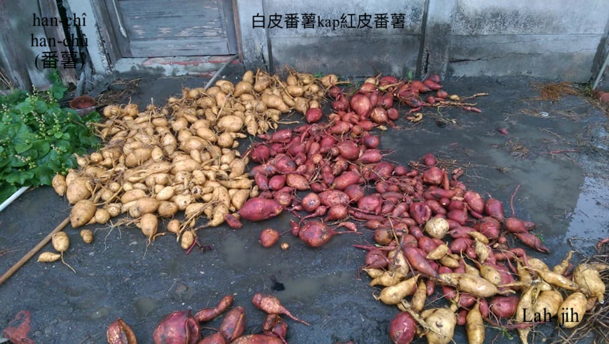

俗語講：「時到時擔當，無米煮番薯湯。」其實m̄免tn̄g-tio̍h時到，平常時á，除了三頓煮食以外，半晡時á tn̄g-tio̍h腹肚iau，番薯to̍h是siāng方便ê點心。煮1-khaⁿ番薯kho͘湯，ē-tàng一家人公家食；大鼎sa̍h豬菜時，sūn-sòa khǹg幾條細條番薯，gín-á喝腹肚iau，to̍h ē-sái-tit ko͘起來治iau；煮飯後，灶khang火ē-sái-tit pû （炰）番薯，準備hō͘ gín-á食點心；nā是tn̄g-tio̍h有閒工，洗一寡細條番薯，khòng 1鼎番薯，大人gín-á食kah笑gī-gī。

糊á番薯收成後，揀he khah細條ē鬆koh ē甜ê番薯，鼓井á水洗洗清氣免khau皮，chham一寡水khǹg落大鼎khòng，軟軟á火ûn-ûn-á khòng，水蝕ta，番薯自然蝕水變khiū koh激出甜分，免chham糖自然甜ê khòng番薯條á，是點心mā是sì-siù-á。

 > 註：Khòng番薯kap kop-ioh-á無kāng，kop-ioh-á to̍h是田園gih土丸ná土窯hip番薯，chit-má時行講做炕窯；khòng番薯是灶腳大鼎進行。

## 1-1. Khòng番薯ê過程
>**Khòng Han-chî ê Kòe-têng**

番薯鬆、甜好滋味，pû番薯、sa̍h番薯、khòng番薯，庄腳囡仔siāng kah意，半晡食點心，to̍h是chit味。

1、Kéng細條番薯，洗清氣、用湯匙仔koeh外皮。
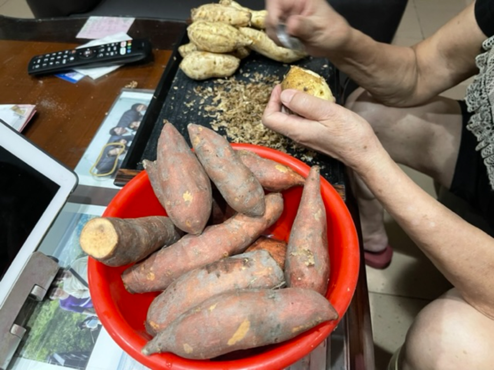

2、日頭Pha̍k ta，á-sī室內nà ta。
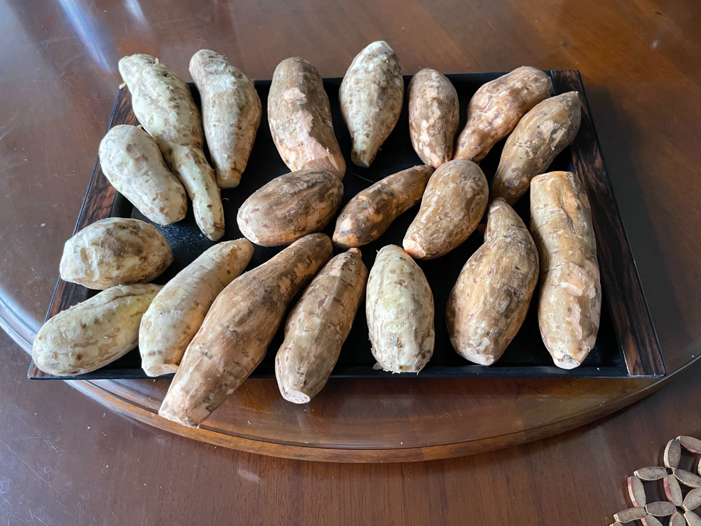

3、Khǹg-lo̍h鼎內猛火用水sa̍h。
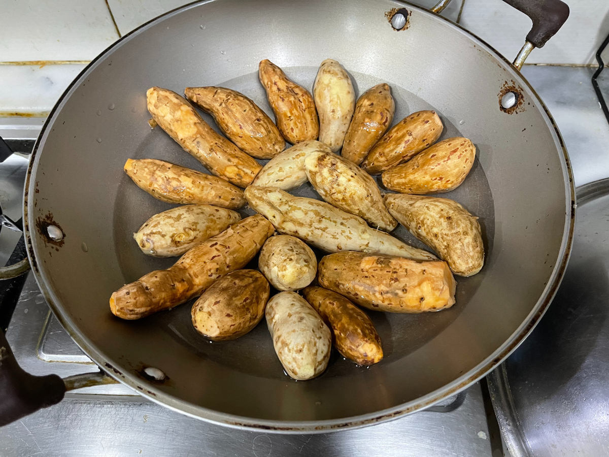

4、Sa̍h熟。Ko͘起來食to̍h是sa̍h番薯。
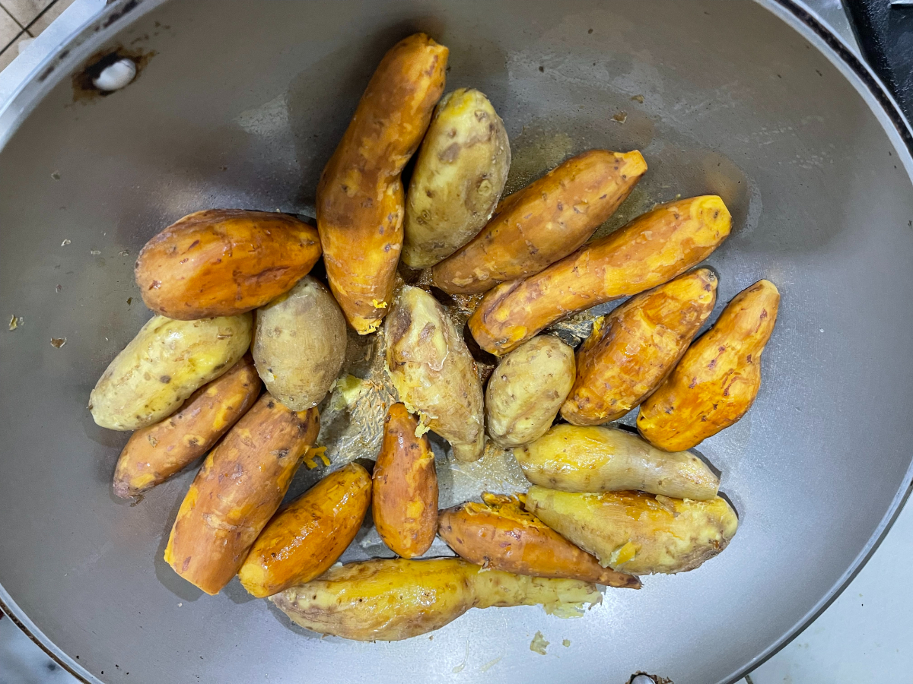

5、繼續ûn-á火khòng。
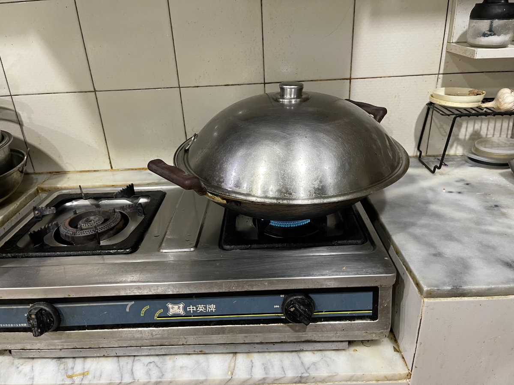

6、Khòng到鼎內無水。
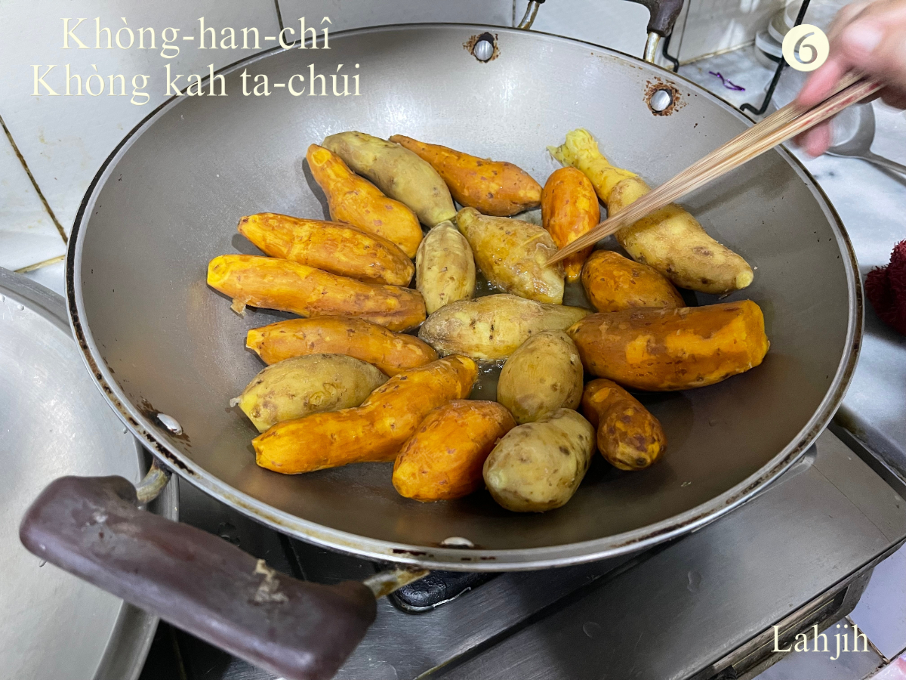

7、番薯開始khòng出糖分。
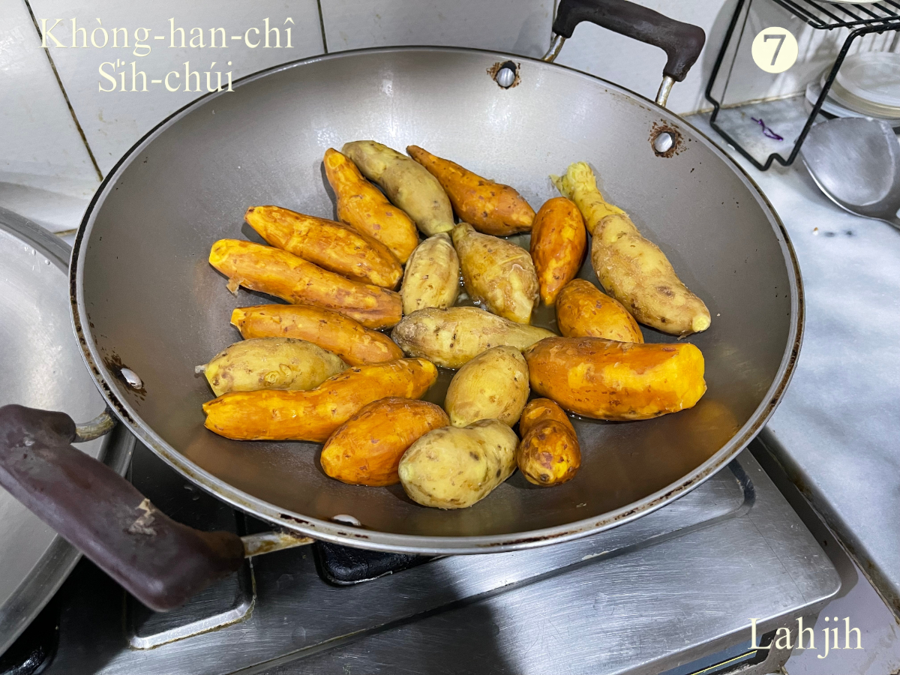

8、番薯蝕水，鼎底出現糖膏。
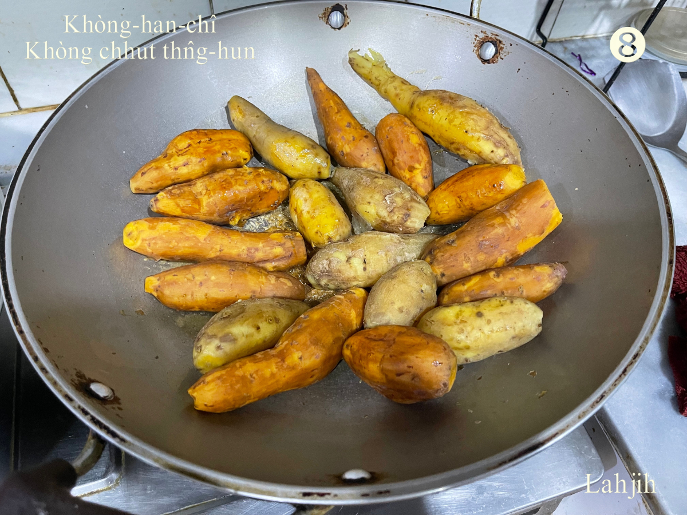

9、鼎底開始kiap糖膏。
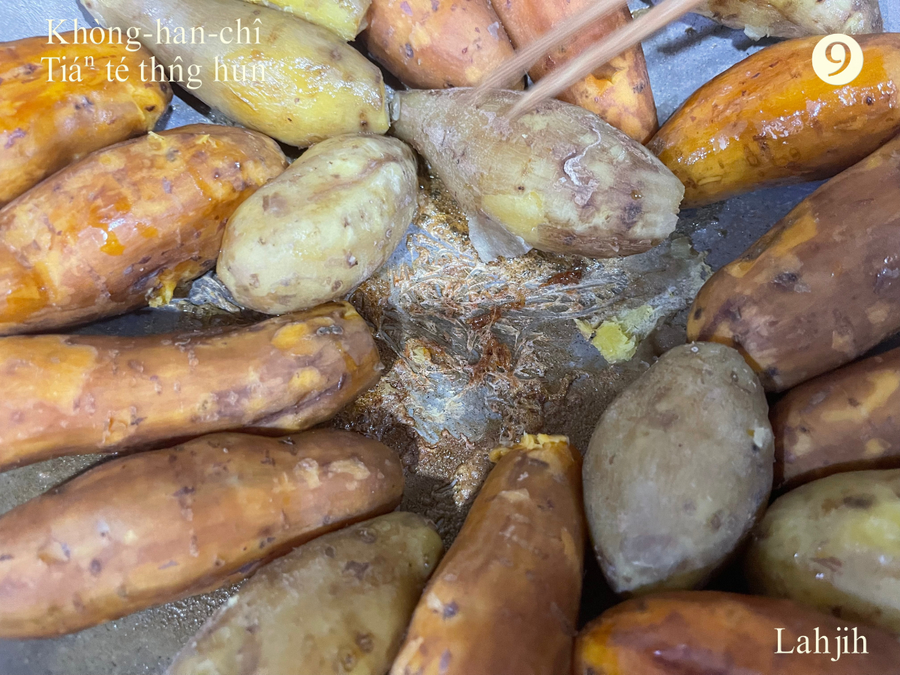

10、Khiū koh 自然甜，無chham糖ê Khòng番薯。
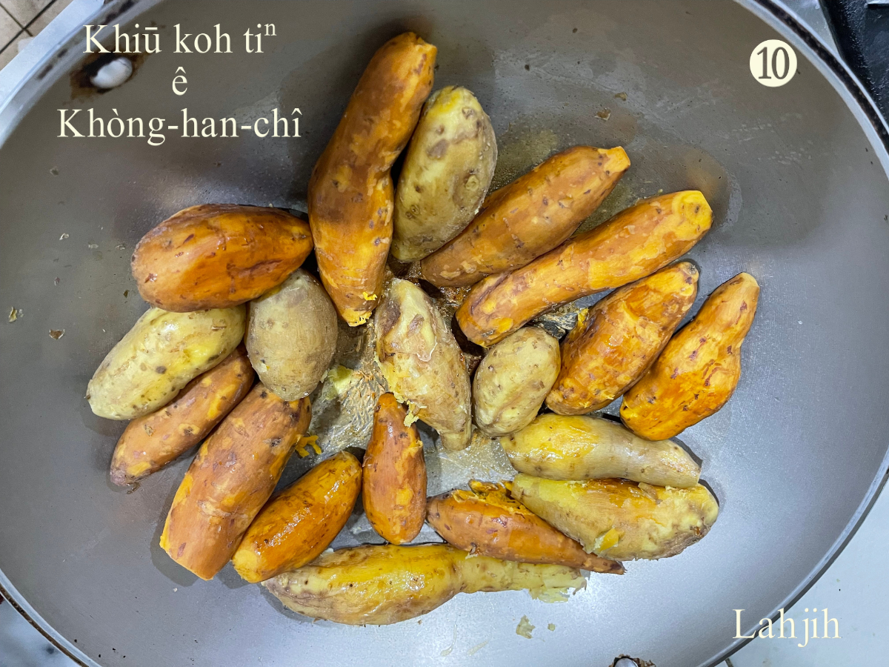

## 1-2. Kop窯á
>**Kop Iô-á**

利用田--裡拋荒期間，khioh土丸á kop／thia̍p土窯，khioh ta樹枝ta草hiâⁿ火，等土窯熱度有夠，kā厝內番薯1條1條khǹg落窯內，然後kòng窯ho͘倒，koh kā陷倒土窯加土om-ba̍t（掩密），hip半點鐘chiâⁿ點鐘了後開窯，to̍h有鬆koh甜ê番薯食點心。進行中，有人kop窯、有人khioh樹枝、有人轉去the̍h番薯、有人pìⁿ把戲、有人sńg走相jiok bih相chhōe，無人稽考無人計較，歡喜bī-sī，開窯了後，番薯食食--leh繼續sńg，sńg到日黃昏，ī--ā叫食飯，chiah隨人轉去洗tn̄g歇睏。

Kop-ioh-á是阮庄腳人án-ne講，chit-mái 大部份lóng講「炕窯」，台語ê khòng kap hip，含意無相kāng，khòng kap kop mā 無kāng款，khòng、hip是煮食ê方式，kop是排thia̍p ê動作，真正「講到hō͘你bat，嘴鬚好phah結；講到hō͘你知，紅嬰á ē弄獅」。

> **教育部辭典ê解說：
炕（khòng）：『用慢火久煮』。
炕肉（khòng-bah）：『用慢火長時間燉煮肉類』。
炕窯（khòng-iô）：『用土塊堆成一個小土窯，再把柴火丟到土窯中加以燃燒，放入蕃薯後，再把土窯推平，利用高溫餘熱把蕃薯燜熟，是一種民間常見窯燒蕃薯的方法』。**

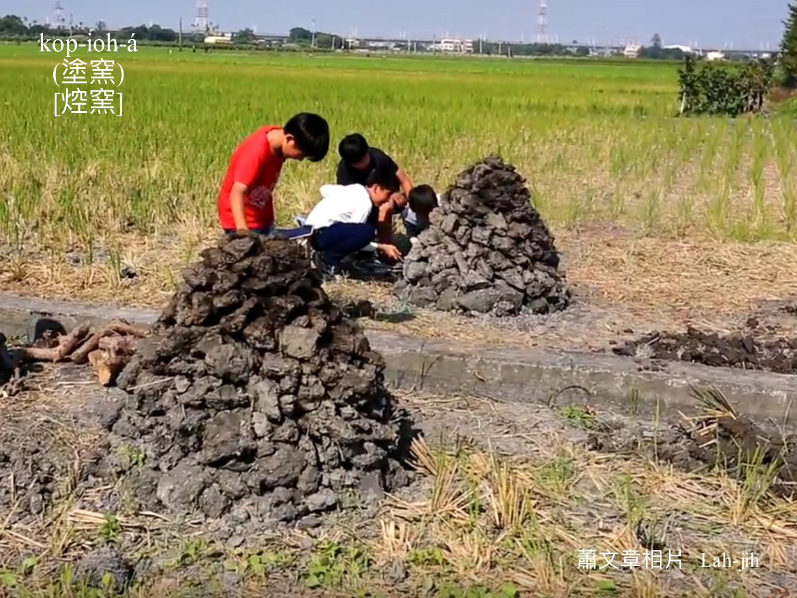
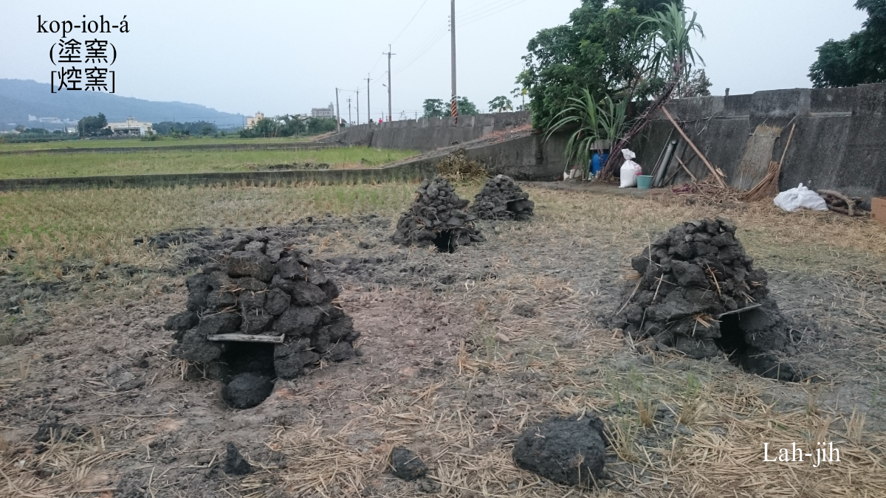

## 1-3. Sa̍h番薯
>**Sa̍h Han-chî**

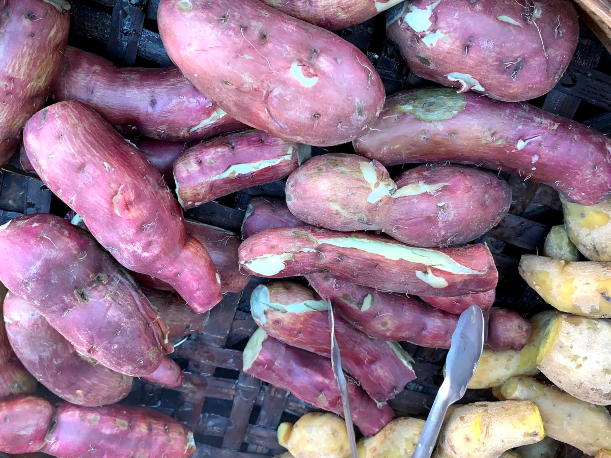

## 1-4. 番薯葉á
>**Han-chî Hio̍h-á**

番薯葉á mā ē-tàng tòng-chò菜蔬食。

# 2. 註解
> **Chù-kái**

|**詞**|**解說**|
|半晝á|『近中午時分』。|
|半晡á|『中午過後時分』。|
|糊á番薯|用番薯藤種tī稻欉中間ê番薯。|
