# 相招食點心
> **Sio-chio Chia̍h Tiám-sim**

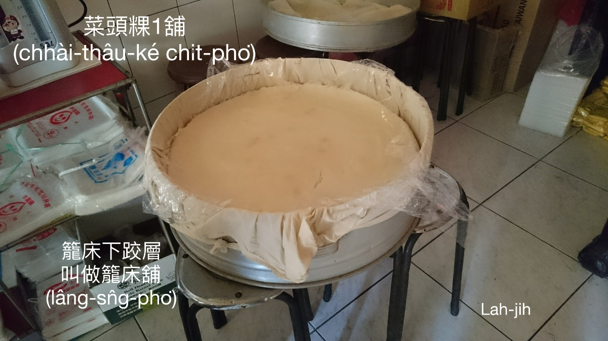

Taⁿ點心、kōaⁿ點心是為tio̍h作穡氣力，長工講「無食ná ē做」是實在話；hōng點心是三時有陣chiah有ê享受；Taⁿ點心、kōaⁿ點心chit兩種食物是cha-po͘人、大人ê食祿。

Cha-po͘人穡頭粗重需要點心補嘴khang，gín-á當leh大koh khah m̄-thang失營養，煮食是cha-bó͘人leh煮，借機會chhōe時間kā ka-tī kap gín-á慰勞--一-下mā是理所當然，to̍h án-ne厝邊隔壁，大姆細嬸伯婆同姒，相招會齊，炊碗粿、挨米篩目，炊菜頭粿、炊ō͘-hoâiⁿ粿，tīm米糕、煮米糕糜，大大細細，歡喜tang-tang，ē-sái-tit做點心食，ē-sái-tit做正頓食，m̄免分人食，mā m̄免看人食。

下面咱一項á一項á來簡單紹介。

## 1-1. 炊菜頭粿
>**Chhoe Chhài-thâu-kóe**

請看參考第5章──作田人傳統記事。
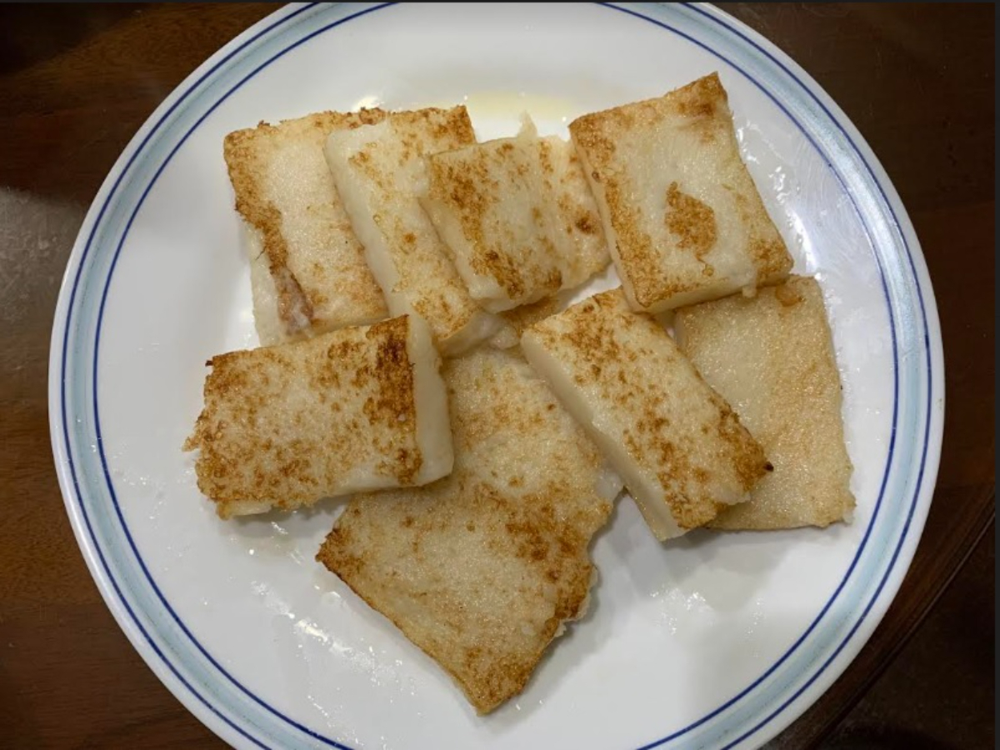

## 1-2. 炊芋Hoâiⁿ粿
>**Chhoe Ō͘-hoâiⁿ-kóe**

請看參考第5章──作田人傳統記事。
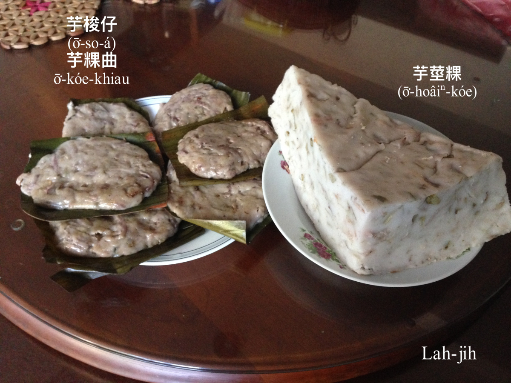

## 1-3. Chhoah米篩目
>**Chhoah Bí-thai-ba̍k**
 
在來米挨粿漿，teh ta粿粞nóa-khiū，然後粿粞1丸1丸tiàm米篩目枋chhi̍h落去hiâⁿ滾鼎內sa̍h熟，chiah koh ko͘起來khǹg冷，to̍h是米篩目，ē-sái-tit食甜--ê，mā ē-sái-tit chham料煮鹹--ê。
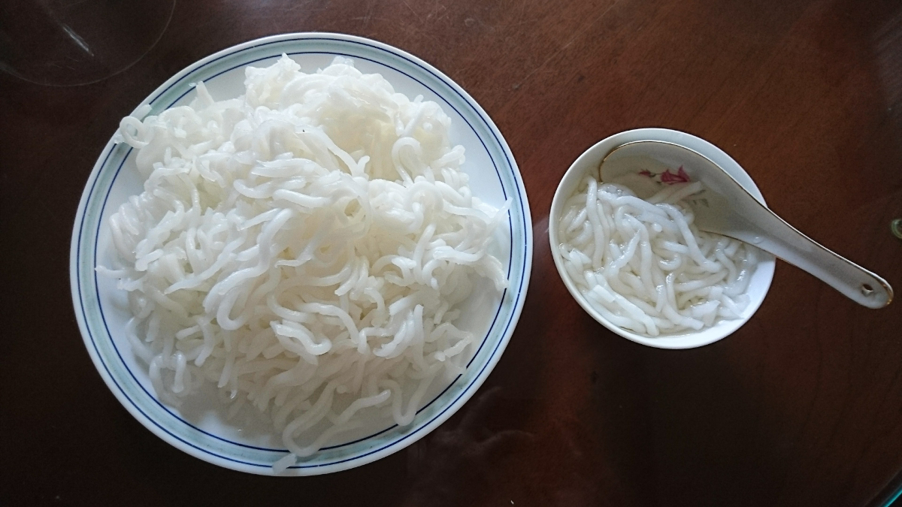  

## 1-4. 煮麻íⁿ
>**Chú môa-íⁿ**

熱--人iûⁿ-môa（黃麻）收成時，揀he黃麻欉尾溜ê幼íⁿ幼葉，經過nóa-nóa jio̍k-jio̍k--leh，kā苦澀葉汁洗掉，chiah chham番薯kho͘落去kûn湯，to̍h是熱天退火ê麻íⁿ湯，食--起來sió-khóa苦liám苦liám。
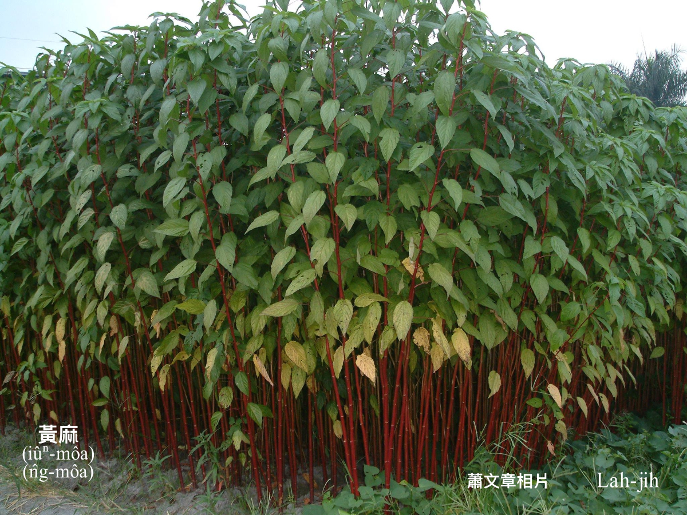
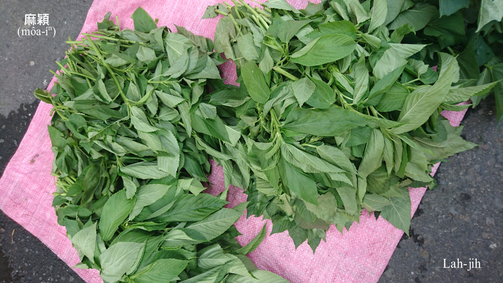

麻íⁿ蕃薯kho͘湯。
（感謝林清祥教授提供相片。）
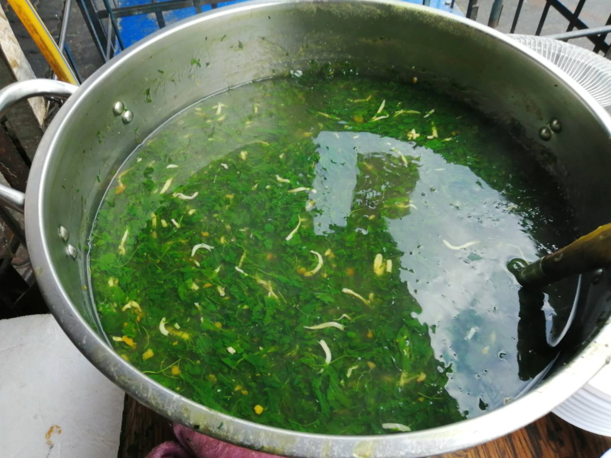
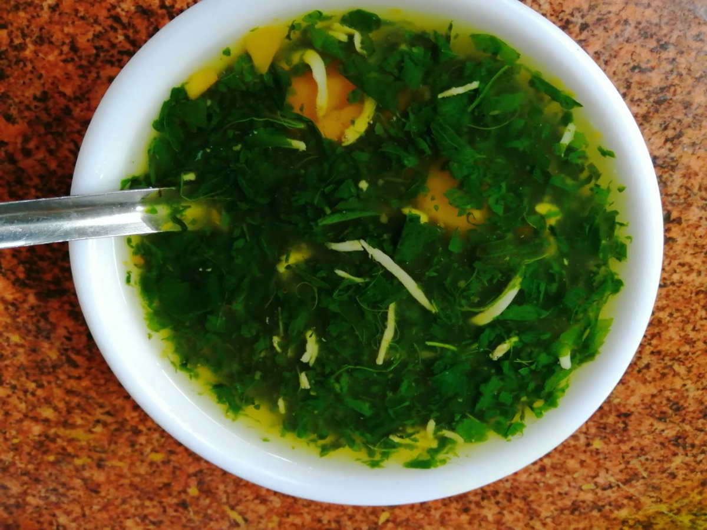

## 1-5. 炊碗粿
>**Chhoe Óaⁿ-kóe**

請看參考第5章──作田人傳統記事。
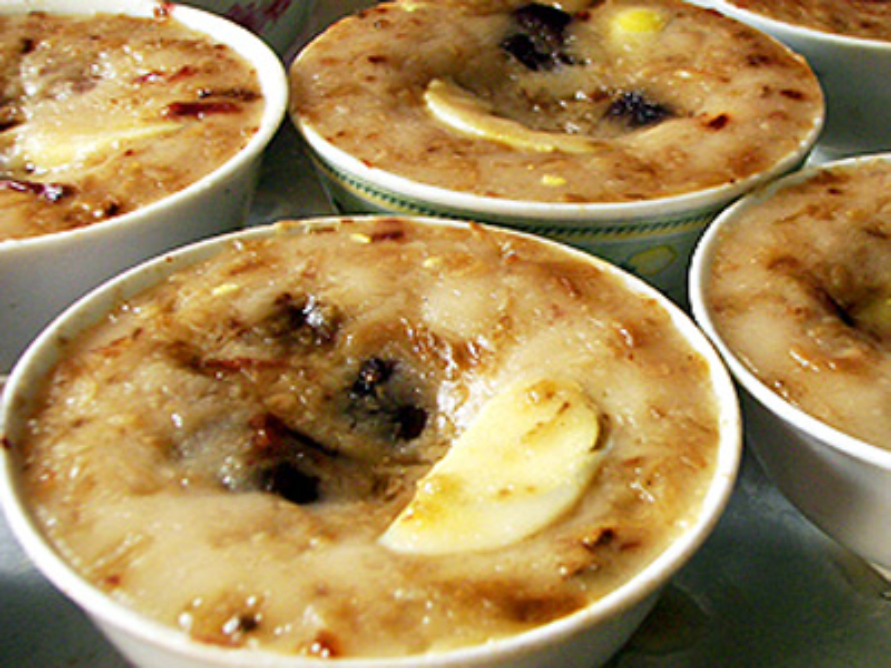

# 2. Chhoah米篩目所用ê家私
>**Chhoah Bí-thai-ba̍k Só͘ Iōng ê Ke-si**

## 2-1. 米篩目枋
> Bí-thai-ba̍k Pang 

米篩目枋1-khang 1-khang親像米篩，是直接khòe-tiàm鼎頂chhi̍h粿粞。Chit-mái ê米篩目粿粞有lām番薯粉a̍h是phòa圓chu̍t-á，比較khah khiū khah長。
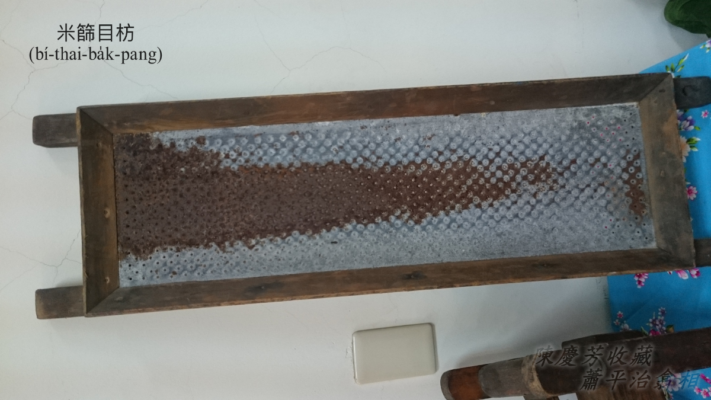
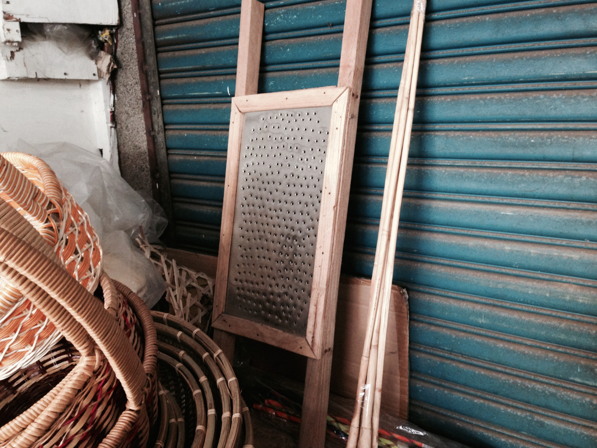

## 2-2. 米篩目Chiⁿ
>**Bí-thai-ba̍k-chiⁿ**

Che mā是米篩目枋，應該講米篩目chiⁿ khah適當，粿粞khǹg-tiàm圓形槽內，chiah用頂面柴lún ka chiⁿ--落-去，to̍h是1條1條ê米篩目，1-pái大概ē-tàng chiⁿ 1碗份。
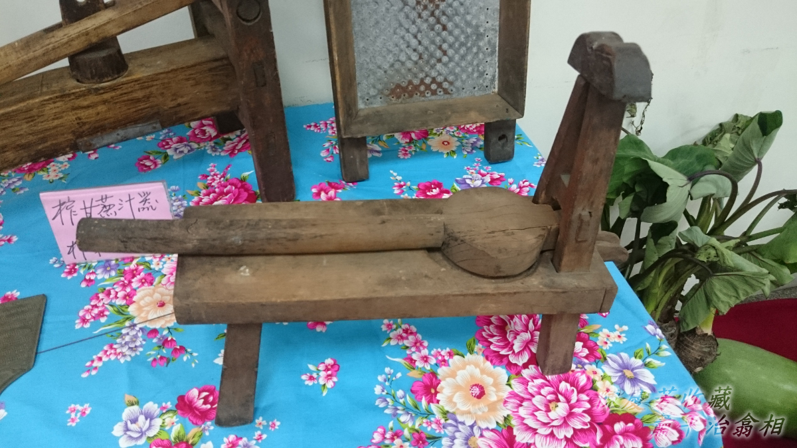
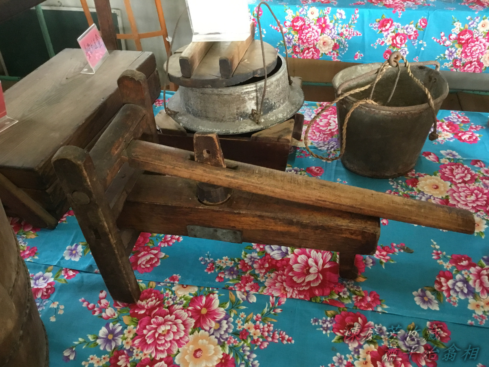

# 【Lah-jih散文書寫】碗粿
>**【Lah-jih Sòaⁿ-bûn Su-siá】Óaⁿ-kóe**
  
碗粿，用在來米挨ê粿漿，1碗1碗貯ho͘八分tīⁿ，boeh食鹹--ê，to̍h chham薄薄細塊肉幼á kap菜脯幼á；boeh食甜--ê，to̍h chham糖chham ho͘甜甜。然後chiah hē落去籠床炊，炊熟sió-khóa khǹg ho͘冷，食--起-來chiah ē軟sìm-sìm koh khiū-teh-teh。甜--ê m̄免koh chham料，鹹--ê攪古早味ê豆油膏siāng合味。食碗粿tio̍h先chhoân家私，用竹篾á削1支ná船poe ê碗粿chhiám-á，碗粿軟軟khiū-khiū，用碗粿chhiám-á liô ho͘做細塊豆腐角，豆油lâm--落去to̍h ē-sái-tit食kah嘴笑目笑，古早gín-á時ê記智。食碗粿，khah食mā是阮崁頂庄ê碗粿siāng kài合味，田中（Chhân-tiong）媽祖宮口chit擔to̍h是崁頂庄cha-bó͘-kiáⁿ ê料理。
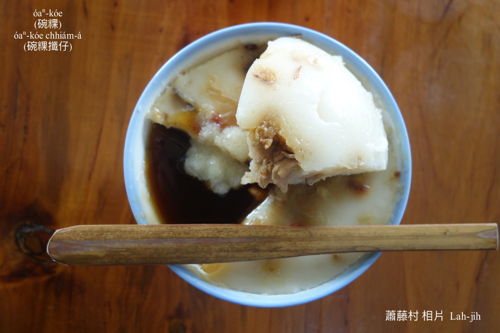

# 3. 註解
> **Chù-kái**

|**詞**|**解說**|
|三時有陣|Sam-sî-iú-chūn，罕罕chiah有ê tāi-chì。|
|nóa-khiū|撋khiū，『搓揉使其有彈性』。|
|ko͘起來|『撈起來』。|
|苦liám苦liám|Khó͘-liám khó͘-liám，『稍帶苦味』。|
|食祿|Si̍t-lo̍k，口福。算命先ê話語：帶食祿to̍h是一生khùiⁿ活過日。|
