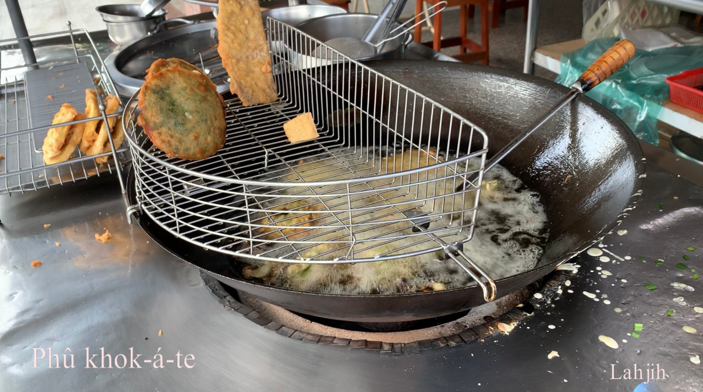
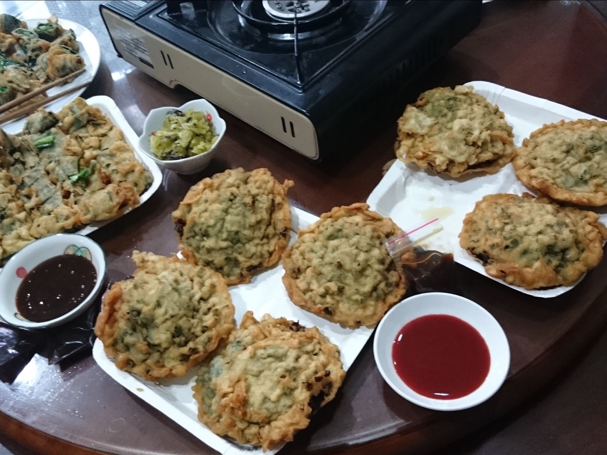
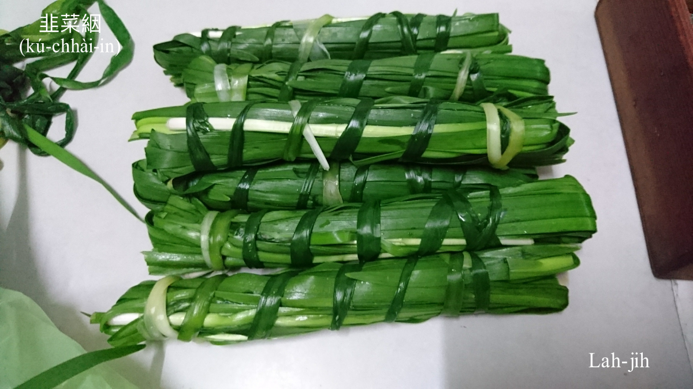
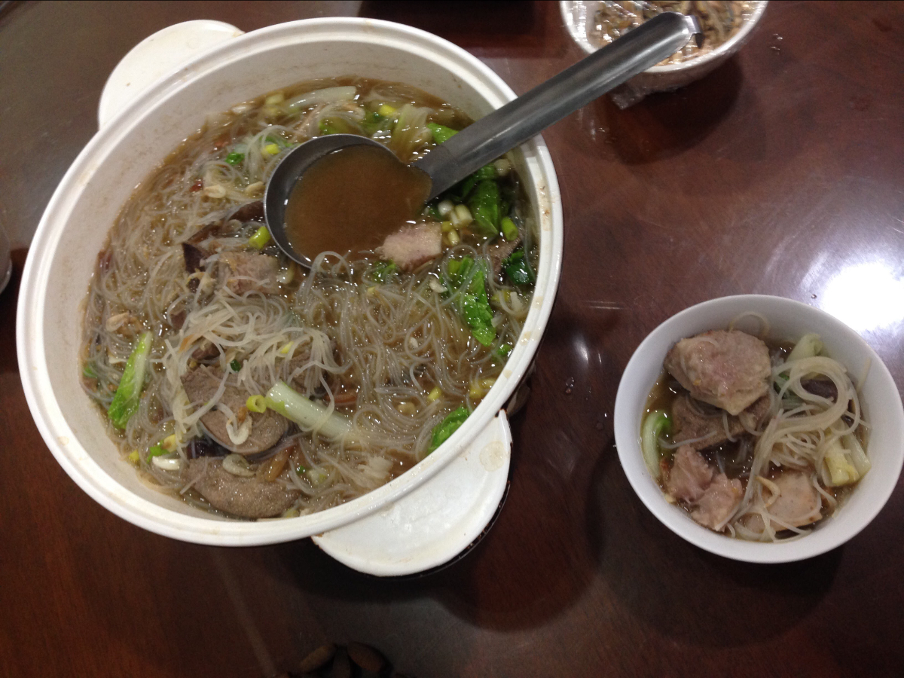

# 庄腳點心擔
> **Chng-kha Tiám-sim-tàⁿ**

作穡kōaⁿ點心，phò-tāu開講hōng點心，相招炊粿食點心，lóng是ka-tī款料煮食。庄腳所在，開錢買點心kám有？Mā是有，有ê是庄內人，有ê是外位人，度三頓做小生理，taⁿ來taⁿ去喝賣，有ê賣杏仁茶、杏仁露、麵茶、米奶，有ê賣紅龜粿、菜頭粿、芋hoâiⁿ粿、碗粿，有ê賣麵線糊、粉圓、粉粿，mā有pōng米芳賣麻糍，親像庄裏to̍h有碗粿福--è賣碗粿，矮á福賣杏仁茶油食粿，樹殿--ē賣粉圓。

  請看第3章──作田人生活記事。咱ē紹介tio̍h杏仁茶擔；Chìⁿ粿擔；賣麵線糊；賣碗粿；Pōng米芳。

# 【Lah-jih散文書寫】── Phû Khok-á-te
>**【Lah-jih Sòaⁿ-bûn Su-siá】──Phû Khok-á-te**

Phû-khok-á-te是一種行業mā是一種煮食技巧，看是簡單，做起來需要淡薄á學問。

一鼎燒滾滾ê油鼎，用一支長長像豆油碟á大ê khok-á-te匙，抹1-têng米漿tiàm匙á內，kā剁幼ê韭菜青舖tīⁿ，sūn-sòa noaih 5-6-mī chhiⁿ蚵chham--落-去，然後kā米漿糊密抹hō͘ am-am phòng-phòng，chiah tu落去油鼎chìⁿ，chìⁿ kah赤赤像金黃色chiah ka ko͘--起來 to̍h完成。

Khok-á-te boeh好食，原料、技術經驗lóng重要，kah味原料是韭菜lām蚵á，米漿除了在來米以外tio̍h kap麵粉、黃豆粉、卵lām-leh攪，lām雞卵chiah ē好滋味，chìⁿ--起-來chiah ē phàⁿ koh酥，油鼎熱度chiâⁿ要緊，腳手mé-lia̍h kài重要，chìⁿ無夠火bē酥，chìⁿ siuⁿ過火，烏lu-lu，pháiⁿ看頭。

Boeh食khok-á-te ài趁燒，冷去lùn-lùn無好食to̍h m̄-thang嫌師傅功夫bái，食khok-á-te需要ùn料，豆油膏、番á薑醬siāng合味。

Khok-á-te擔除了phû khok-á-te，mā ē phû chìⁿ粿、菜條、番薯phiáⁿ、芋á phiáⁿ、蒜á頭（m̄是蒜頭）、米糕……mā ē kah賣丸á湯、豆腐湯，俗、好食koh食ē飽。

聽phû khok-á-te ê頭家講：「Phû chìⁿ粿、番薯phiáⁿ、芋á phiáⁿ、蒜á頭、米糕khah pháiⁿ-pháng，伊ê沉底看bē出來好a̍h iáu未，nā是phû khok-á-te、菜條to̍h khah bē過火，因為伊bē沉底，一落鼎to̍h浮tī油面看現現，chiâⁿ好chat。」原來是án-ni--ò͘，m̄ chiah講做phû khok-á-te，khah少人講chìⁿ khok-á-te。Khok-á-te有人講蚵te，重點是chham蚵á chiah是chiàⁿ-pān--ê。Bat食he瘦肉lām韭菜ê khok-á-te，實在無合滋味。

教育部辭典華語解說：
> - 觳仔炱/Khok-á-te。『一種油炸小吃，先將豆芽菜、韭菜舖在鮮蠔上，再摻上一層米漿，下鍋炸成圓扁形』。
> - 蚵炱/Ô-te：『一種油炸小吃，先將豆芽菜、韭菜舖在鮮蠔上，再chham上一層米漿，下鍋炸成圓扁形』。
 
 基本上說明有合，m̄-koh nā ka稽考漢字to̍h有精差，咱查華語辭典「炱」是『煙氣凝結而成的黑灰。如：「煤炱」、「松炱」』；「觳」是量詞。『古代計算容量的單位。十斗為一觳，後改作五斗為一觳。周禮．冬官考工記．陶人：「鬲實五觳，厚半寸脣寸。庾實二觳，厚半寸脣寸。」』Án-ni ê解說kap khok-á-te本意to̍h差大碼。

用漢字來書寫台語文學、台灣文化tio̍h sè-jī。

──Lah-jih_20140102

# 【Lah-jih講料理】韭菜In
>**【Lah-jih Kóng Liāu-lí】──Kú-chhài-in**

Phû韭菜條，需要kā韭菜áu做1-lia̍h長ê韭菜in，然後chiah ùn漿落去油鼎chìⁿ。Pa̍k韭菜in ê韭菜tio̍h先sa̍h ho͘ nńg-lio̍h chiah方便pa̍k。

Tān、khún、in三種動作sió-khóa無kāng，in是有規則ê tān kap pa̍k，tān是khah chhìn-chhái ê in，khún是khah大把ê pa̍k。

# 【Lah-jih散文書寫】──米粉芋
>**【Lah-jih Sòaⁿ-bûn Su-siá】──Bí-hún-ō͘**

Lah-jih 20140922

米粉料理，有煮--ê、有炒--ê，用炒--ê叫做米粉炒，bē-sái-tit叫做炒米粉。下昏暗食芋á hām米粉煮湯ê羹頓，boeh叫做芋á米粉a̍h是米粉芋？應該兩種lóng ē sái-tit。

米粉芋、芋á米粉好食通人知，雖bóng chit-má煮食khah有油sian khah有料，m̄ koh iáu是懷念早當時ê米粉芋khah有芋á芳，為siáⁿ-mi̍h？

一般芋á有兩種，一種麵芋，一種檳榔心芋，麵芋產量khah好，檳榔心--ê khah芳，檳榔心--ê切開內面有1-chhiam 1-chhiam ná檳榔粕ê纖維，chit-má chit款ê檳榔心芋已經m̄-bat看--tio̍h，市場賣--ē，作田人ka-tī種--è lóng是倚近麵芋kap檳榔心--e中間ê品種，比麵芋khah好食，m̄-koh無檳榔心芋hiah-nī芳。

# 1. 註解
> **Chù-kái**

|**詞**|**解說**|
|檳榔粕|Pun-nn̂g-phoh，『檳榔渣』。|
|noaih|『以二指或三指拿取小物品』。|
|phàⁿ koh酥|『鬆軟。結構不紮實』和『食物鬆脆可口』。|
|lùn-lùn|『乾燥食物吸收水分後的口感觸感』。|
|pháiⁿ-pháng|『不好處理』。|
|chiâⁿ好chat|『很容易斟酌控制』。|
|chiàⁿ-pān|正範，『可為法式的､可效法的』。|
