# 古早食水Án-chóaⁿ來？
> **Kó͘-chá Chia̍h-chúi Án-chóaⁿ Lâi?**

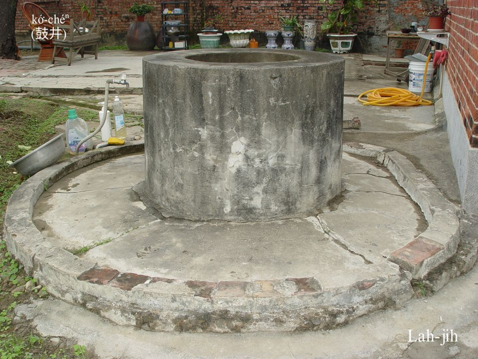

人tio̍h食水，田mā tio̍h食水，濁水溪水kòng-kòng流，淹田水ak菜蔬恩情厚，nā是溝á水流到咱tau，引入水窟á chē清，煮食洗tn̄g kā咱負責夠夠。

# 1. 水源
>**Chúi-goân**

雖bóng日本時代to̍h有水道水，不過kan-nā施設tī市區街路，庄腳所在親像阮崁頂庄，雖bóng日本時代是模範庄，猶原到1960年前後，水道管chiah有踏腳到。Tī無水道水ê古早，地下水、溪á水、坑溝á泉水to̍h是食水ê來源。

地下水需要liú鼓井，a̍h是lòng phòng-phuh-á；坑溝á泉水tio̍h用水kéng-á kéng，是tòa-tī山腳山phiâⁿ ê jîn家，chiah有ê食水方法；nā是溪水，有水溝á流到厝腳，挖水窟á做食水mā是bô-ta-ôa，古早無he mò͘-tah抽水，所以地下水nā siuⁿ深，只好kā溝á水，用bêng-hoân（明礬）坐清來煮食飲水。

## 1-1. 鼓井
>**Kó͘-chéⁿ**

鼓井á水是平洋庄腳所在食水ê來源，差不多每一口灶內底（正身護龍厝宅）to̍h有1-kâi鼓井，1-ê庄頭有幾ê公井，lóng是圓形，阮崁頂庄廟前hit-kâi公井，koh有chhāi柱á搭厝頂，ē記得井面有4尺直徑，水質清koh甘。井水有深有淺，井底用石頭gih，鼓井牆thóng出土面1-2尺koân，磚á gih，chiah koh抹紅毛土，外圍用紅毛土khōng 1-kâi圓形a̍h是四角形ê行踏洗物ê埕，ē-tàng khǹg水桶，ē-tàng洗衫洗家具番薯菜蔬。阮tau厝後hit kâi鼓井，外圍圓形chiâⁿ闊，邊--a koh有長ti四角形ê淺水槽á，方便洗番薯thâi精牲thâi豬，可惜有臭水管味，bē食得。
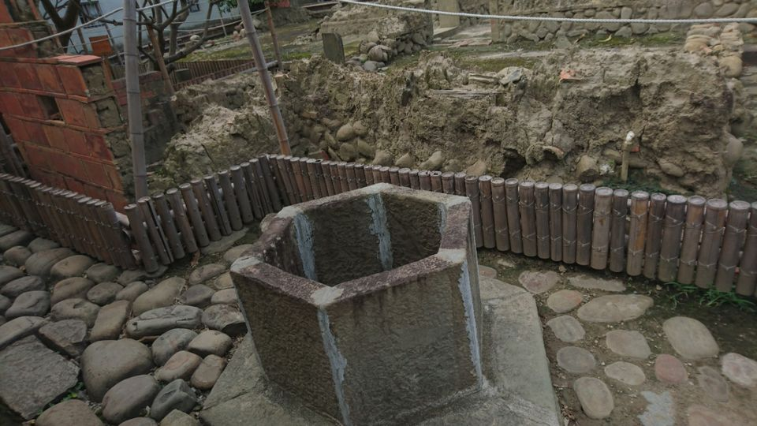
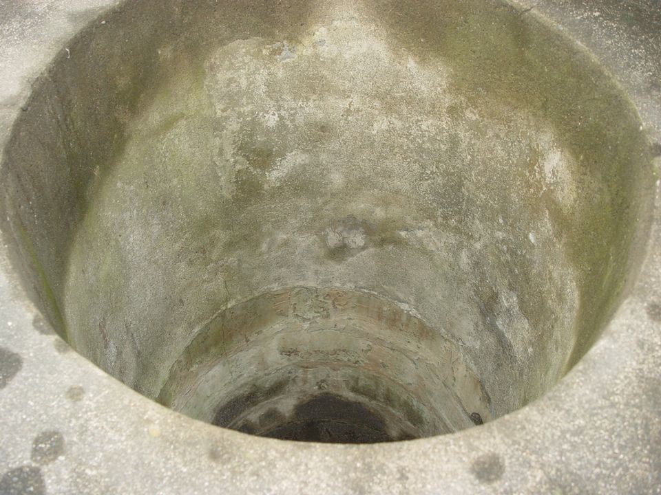

大溪李騰芳古厝內ê鼓井，tī厝內，需要khàm蓋，預防意外。
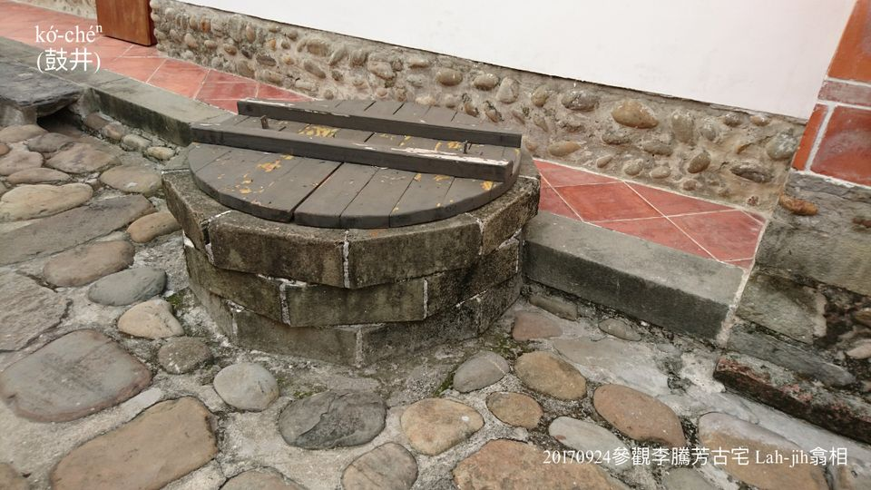

Ē-kha 2張相片是鼓井頭
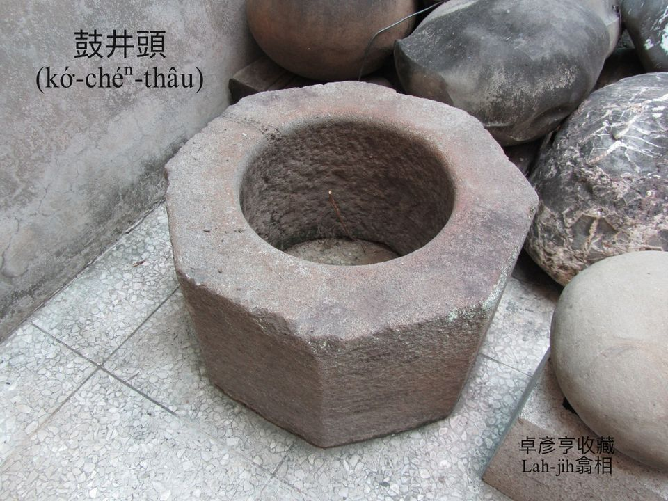
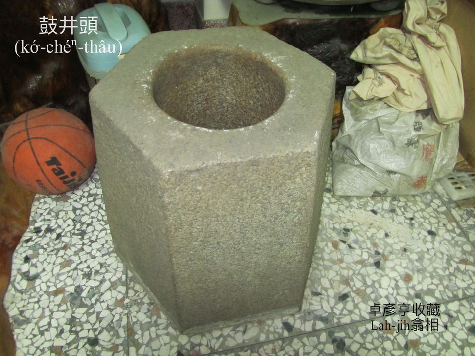
 ## 【Lah-jih字詞謎猜】

> **【Lah-jih Jī-sû Bê-chhai】**

1-ê物á圓lin-lin，十ê人扛bē起身。

	答案：鼓井。

## 1-2. Phòng-phuh-á

Phòng-phuh-á有人講水hia̍p-á，是人家食水抽水手動式ê Phòng-phuh，to̍h是抽水『唧筒』。Phòng-phuh-á水kap鼓井水kāng款是地下水，phòng-phuh-á chhi̍h水比鼓井chhiūⁿ水加真方便安全，boeh chhi̍h水進前，需要倒一寡水母落去phòng-phuh-á內面，chiah chhi̍h有水。水尾田時常欠水，田頭lòng一支phòng-phuh-á，補充無夠ê淹水。

Phòng-phuh-á腳kap鼓井á腳kāng款，除了taⁿ水、kōaⁿ水，是洗衫洗菜，cha-bó͘人phò-tāu開講好所在。
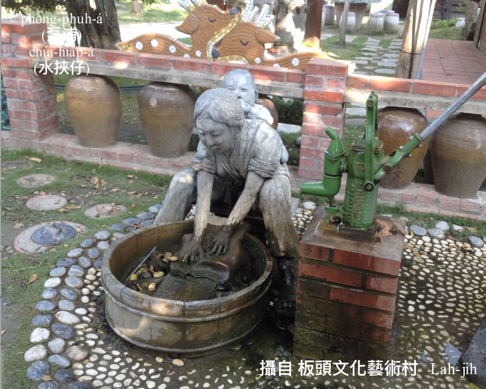
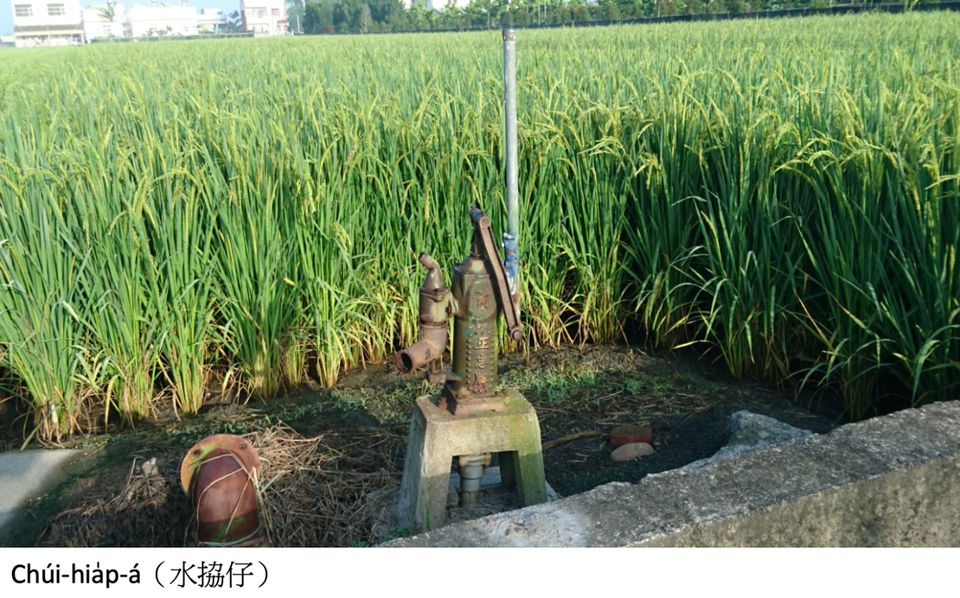
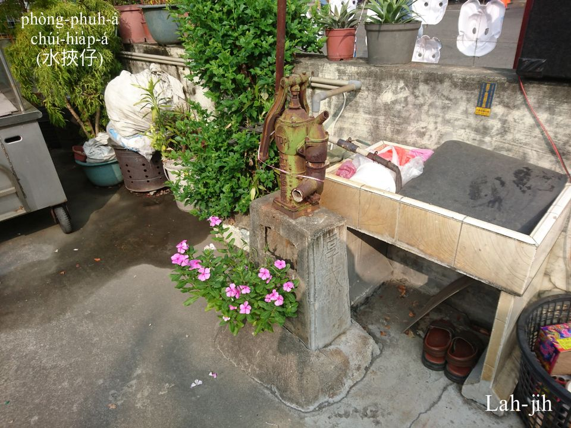
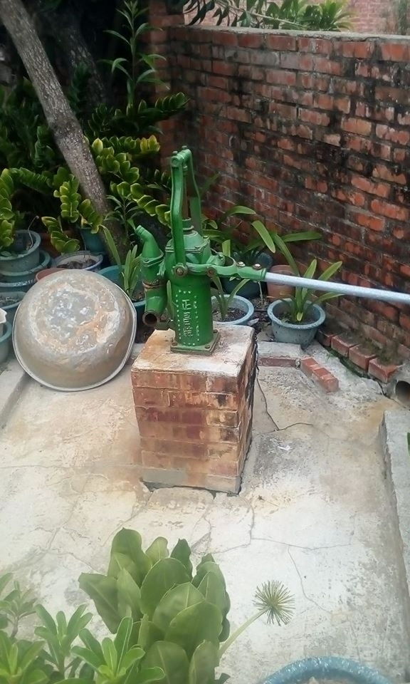

## 1-3. 水kéng-á
>**Chúi-kéng-á**

內山人山腳人，利用刺竹管麻竹管破pêng，管內竹目phah平，1節1節khòe相連，連做一條水橋，kā山坑á泉水引導到厝宅做食水，chit種引導泉水ê方法號做「kéng」，連接竹pêng叫做「水kéng-á」，tio̍h時常巡水kéng-á ê狀況，保持有清氣水thang用，泉水清甜，普興庄大姊in-tau m̄-bat泡茶米茶，lóng是hiâⁿ水kéng泉水請人客「lim茶」。
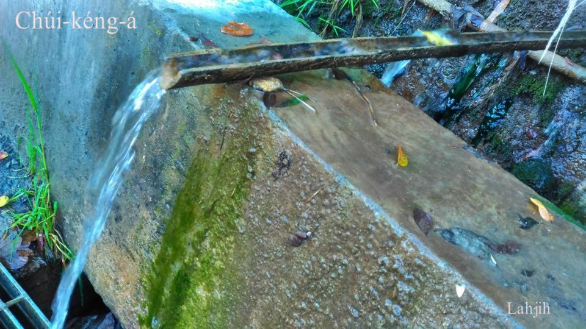
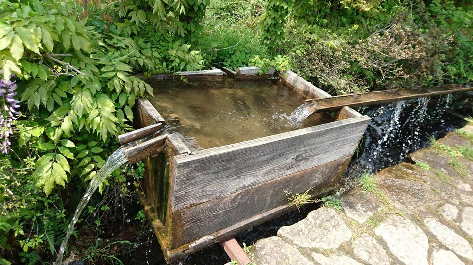
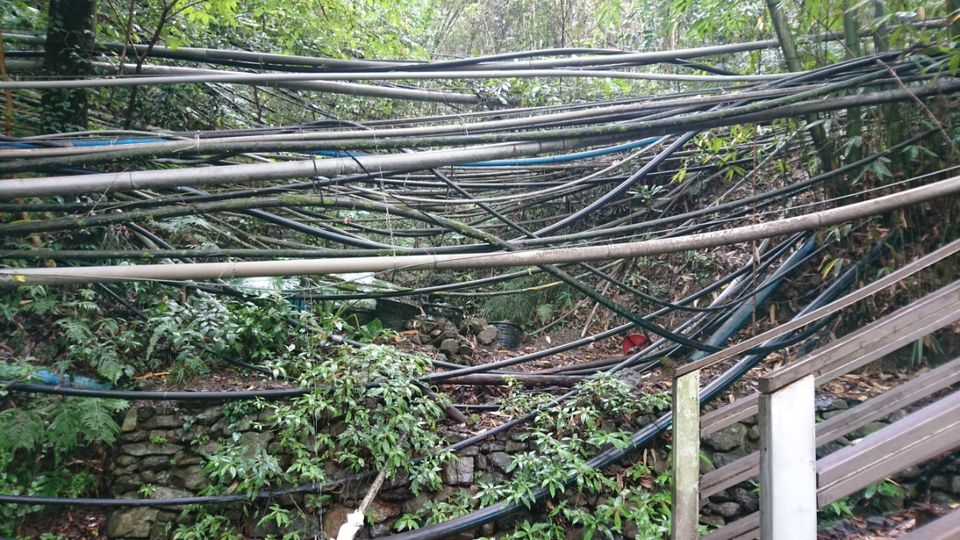

## 1-4. 水道頭
>**Chúi-tō-thâu**

引導水庫、坑水a̍h是鼓井抽水，經過水廠chhē清、過濾、消毒後，chiah用水管配達到人家用戶，水廠古早叫做「水源地」，埋tiàm土內水管號做「水道」，「水道頭」to̍h是水道水ê出口。
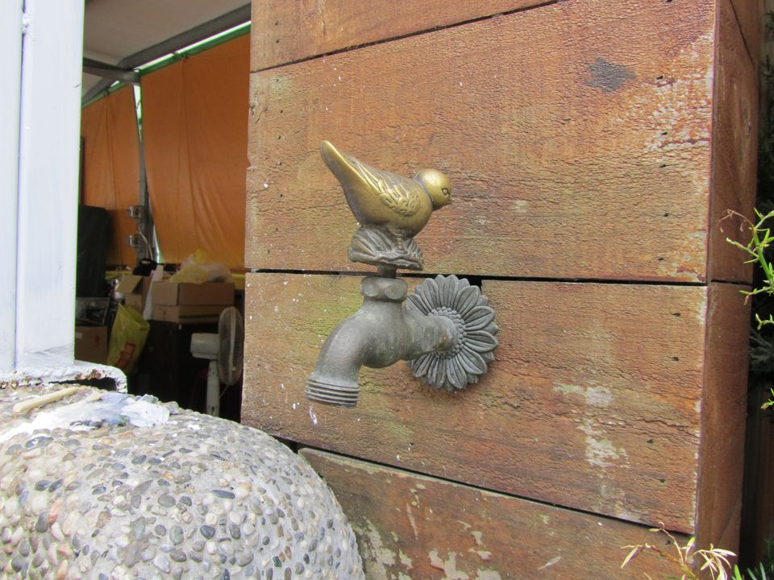

Ē-kha 2張圖是Chúi-tō Pōng-pió（水道磅表）kap磅表箱。
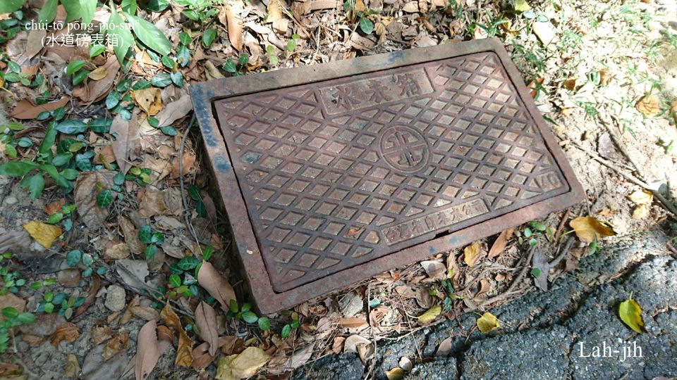
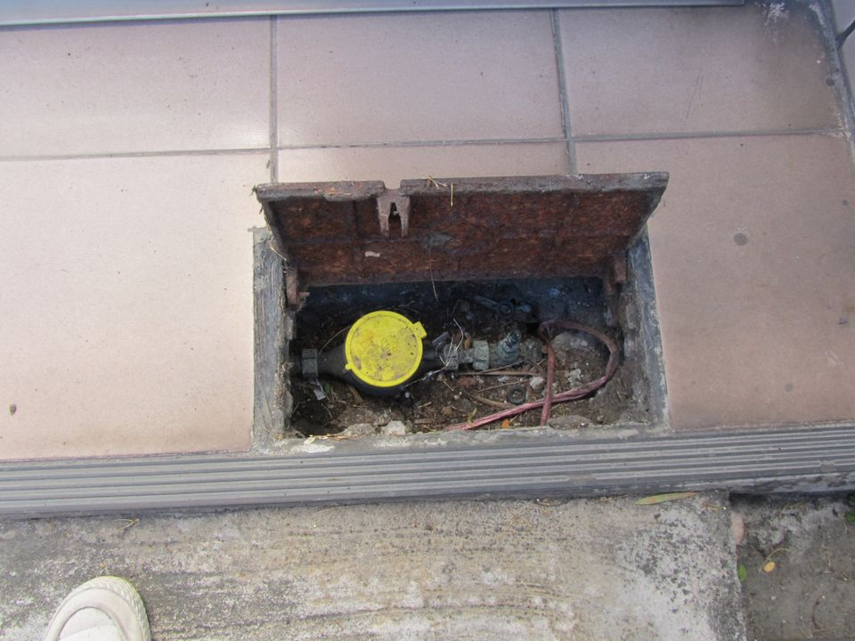

# 2. 註解
> **Chù-kái**

|**詞**|**解說**|
|淹田水|Im chhân-chúi，『灌溉』。|
|ak菜蔬|『澆蔬菜』。|
|liú鼓井|『挖水井』。|
|坐清|Chhē-chheng／chē-chheng，『澄清。水中雜質沉殿，使水質變得乾淨清澈』。|
|phòng-phuh-á|ポンプ，『幫浦』。|
|水kéng-á|Chúi-kéng-á，『引導水用的竹管，最常用於田裡。通常是竹管劈成兩半，打通各個關節，連接成一條水橋』。|
|bô-ta-ôa|『不得已』。|
|鼓井牆|Kó͘-chéⁿ-chhiûⁿ／kó͘-chíⁿ-chhiûⁿ，鼓井地面部份圍牆。|
|臭水管味|Chhàu-chúi-kóng-bī，『清水含有異味』。|
|chhi̍h水|Chhi̍h-chúi，『用手向下按壓取水』。|
|水母|Chúi-bó，『幫浦（ポンプ）汲水之前倒入的媒介水』。|
