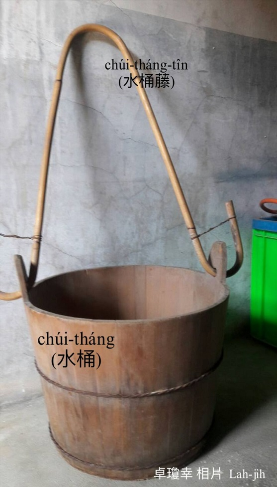
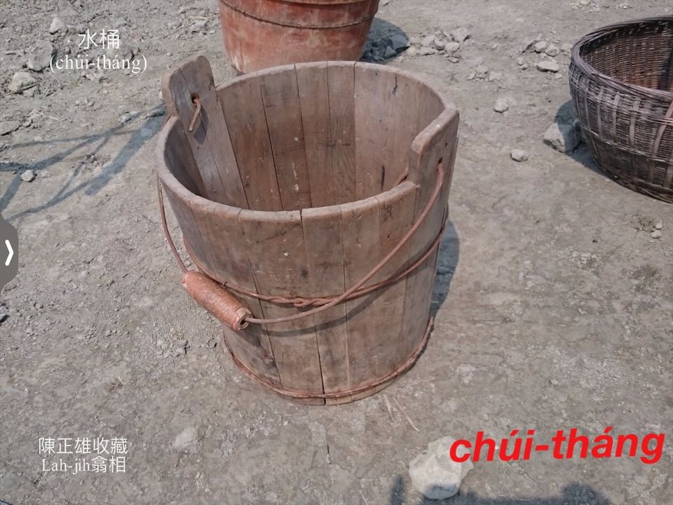
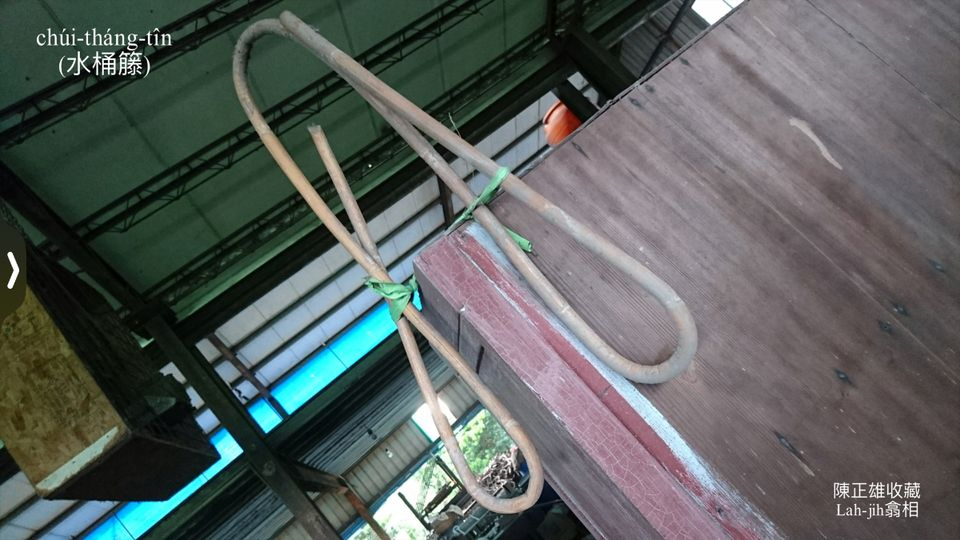
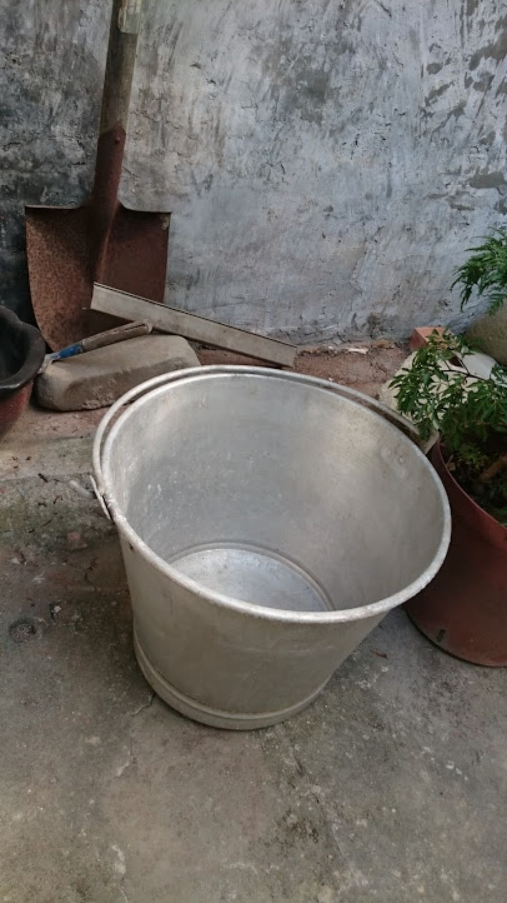
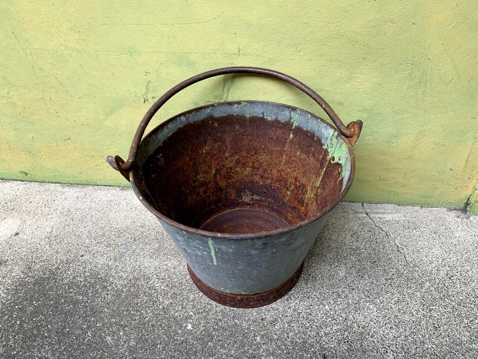
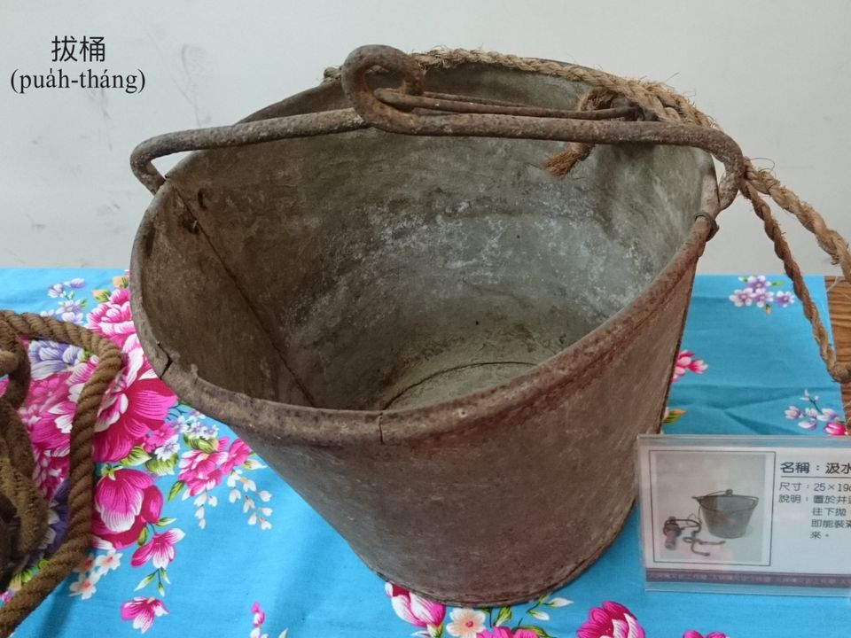
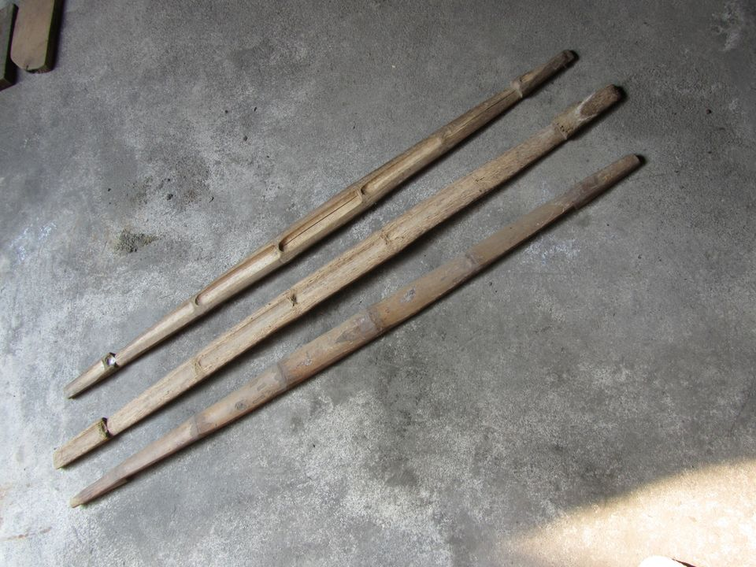

# Taⁿ水貯水ê家私
> **Taⁿ Chúi Té Chúi ê Ke-si**

## 1-1. 醃缸
>**Am-kng**

嘴闊肚大ê大型粗hûi，ē-tàng貯水貯米貯物，ē-tàng蔭豆油sīⁿ醬鹹，mā用來貯水預防火燒厝phah火用。庄腳作穡人用來khǹg tī灶腳貯水煮食，to̍h號做醃缸，差不多每一口灶灶腳lóng有1-kâi。

## 1-2. 水桶
>**Chúi-tháng**
  
鼓井水、phòng-phuh-á水、水窟á水，需要大kha水桶taⁿ轉來灶腳醃缸，一人taⁿ一擔，兩人扛一桶。除了taⁿ水，mā用來taⁿ番薯洗番薯，浸米挨粿漿，貯醃瓜、菜脯sīⁿ鹽。鬧熱時陣貯食物，貯菜尾á hēng菜尾á。

## 1-3. 水桶藤
>**Chúi-tháng-tîn**

大kha水桶ê kōaⁿ耳，nā用索á，boeh taⁿ boeh扛，索á sôe-sôe比較khah麻煩，nā用籐條ut ê水桶耳，to̍h加真方便，因為水桶藤ē-tàng khiā-khiā。

## 1-4. 鉛桶
>**Iân-tháng**

鉛phiáⁿ黏siah（錫）ê水桶是鉛桶，細kha鉛桶á kōaⁿ水liú-lia̍h方便，大kha水桶盤水落醃缸、kōaⁿ水落面桶á、腳桶洗盪，a̍h是kōaⁿ水ak花，lóng需要細kha鉛桶á。

## 1-5. Phoa̍h桶
>**Phoa̍h-tháng**
  
鉛桶á kō͘一條長長ê黃麻索pa̍k--leh，to̍h pìⁿ-chiâⁿ phoa̍h桶，鼓井á chhiūⁿ水to̍h需要phoa̍h桶。Phoa̍h桶chhiūⁿ水ê動作需要學習，有人kā phoa̍h桶提顛倒phiaⁿ落鼓井，水桶自然貯滿鼓井水，chiah kā phoa̍h桶khiú--起來，m̄-koh無法度ta̍k-pái lóng ē順你ê意；有人kā phoa̍h桶lūi落鼓井內，然後用手尾力kā phoa̍h桶索tiuh一下hō͘ phoa̍h桶顛倒khap，自自然然to̍h kā鼓井水chhiūⁿ--起來。

## 1-6. 畚擔
>**Pùn-taⁿ**
  
Taⁿ水kō͘畚擔，扛水tio̍h用khah長ê竹管khah方便。畚擔有曲擔平擔，taⁿ水用平擔to̍h ē-sái-tit，因為水桶水bē-sái-tit貯siuⁿ tīⁿ，siuⁿ tīⁿ ē chhoat。

# 2. 註解
> **Chù-kái**

|**詞**|**解說**|
|粗hûi|『陶器』。|
|豆油|『醬油』。|
|鉛phiáⁿ|Iân-phiáⁿ，『鐵皮、鋅板』。|
|盤水|Pôaⁿ chúi，『運水』，『液體』用盤，『固體』用搬。|
|tiuh一下|『抽動一下』。|
