# 喝賣擔頭á──服務到位ê買賣
> **Hoah-bē Tàⁿ-thâu-á──Ho̍k-bū Kàu-ūi ê Bé-bē**

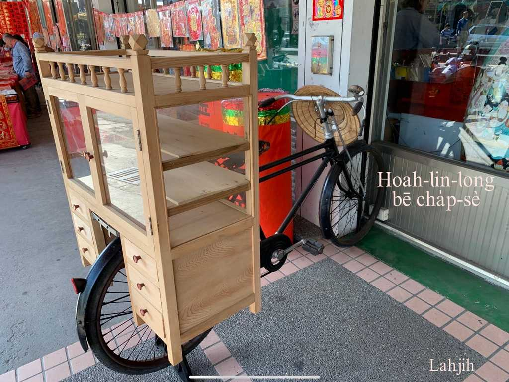

庄腳店á無leh賣--ê，自然有he生理人服務到庄頭，有ê是小生理，有ê是固定行業，賣魚賣豬肉，賣碗粿賣豆腐，賣杏仁茶賣仙草，枝á冰、芋á冰，補鼎補雨傘，喝lin-long賣雜細，phû khok-á-te phû chìⁿ粿，王梨龍眼菝á mā有leh賣，有ê用taⁿ--ê，有ê騎鐵馬。Liang liang liang liang賣枝á冰，pā-pu pā-pu芋á冰，聽tio̍h lin-long鼓to̍h是賣雜細，cha-bó͘人cha-bó͘ gín-á chiâu圍倚--來，有人leh喝「hūn--ì-ò͘」，m̄是人暈--去，是leh賣粉圓，聽聲to̍h知賣siáⁿ-mi̍h，是siáⁿ-mih人leh賣，是真chē人ê記智。

Mā有入庄來買物，平常時是買pháiⁿ銅舊錫，酒矸á thang賣--bò͘？過年過節to̍h是買鵝毛鴨毛，gín-á siāng歡喜，he是換含á糖買sì-siù-á ê好機會。

海口人來庄--裡買鵝毛鴨毛，喝聲hiu「Lín-chia ū giâ-mn̂g thang-bē--bò͘?」人to̍h笑伊giâ門是boeh giâ去tó位？「Ah無，恁講gô門是boeh gô去tó位？」庄腳所在，買賣to̍h是chiah-nī心適趣味。

# 1. Pûn海螺──賣豬肉
> **Pûn Hái-lê──Bē Ti-bah**

1950 gín-á時代iáu bat看--tio̍h聽--tio̍h，豬刀、肉砧、秤、弓蕉絲ka-tī chah，馬角á吊ka-chì-á貯豬肉，後載khǹg砧kap豬刀，「Pu~~~~~」，賣豬肉--ê來--ā。三層--ê tok--1-liau，胛心秤--半-斤，你講半斤，伊to̍h秤boeh到1斤，嫌siuⁿ chē chiah koh liô--一-寡-起-來，「生理kiáⁿ oh生」有影--lio͘h，一載豬肉liâm-mi賣了了。

# 2. 雜細á擔kap Lin-long鼓
> **Cha̍p-sè-á-tàⁿ kap Lin-long-kó͘**

喝lin-long bē賣雜細ê雜細á擔，是cha-bó͘人cha-bó͘ gín-á siāng kah意。

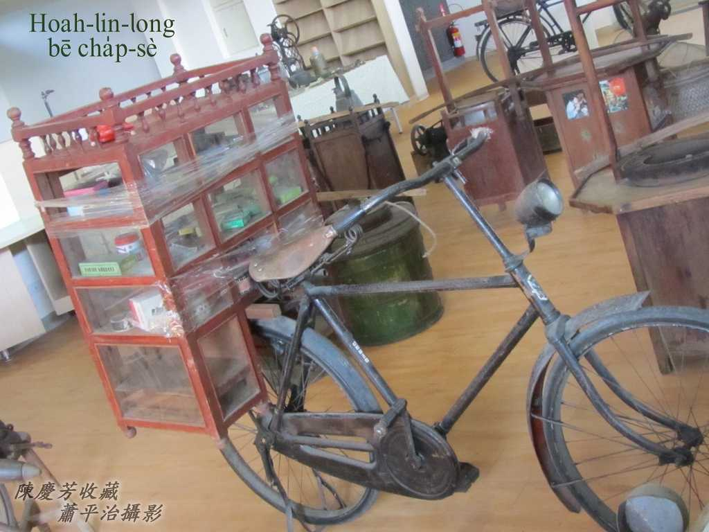
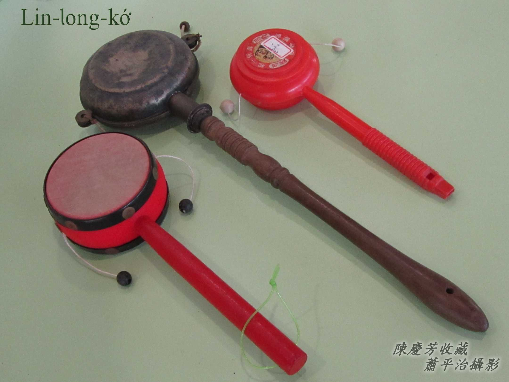

# 3. 賣油擔頭
> **Bē-iû Tàⁿ-thâu**

擔頭á，有ê用pùn-taⁿ taⁿ，有ê用鐵馬載。
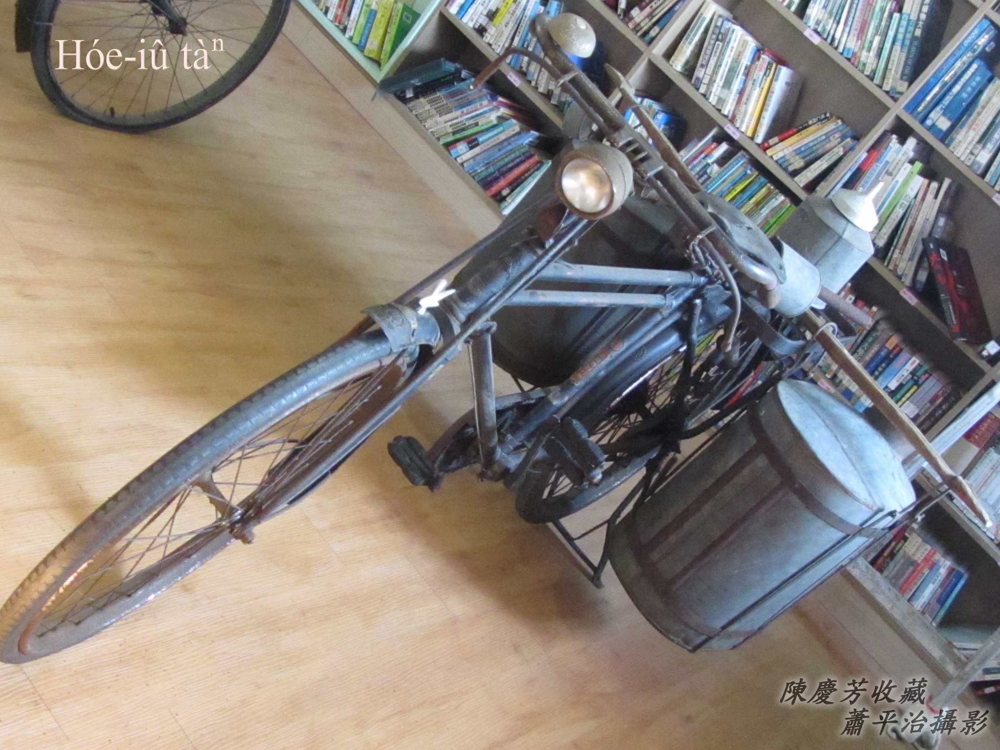
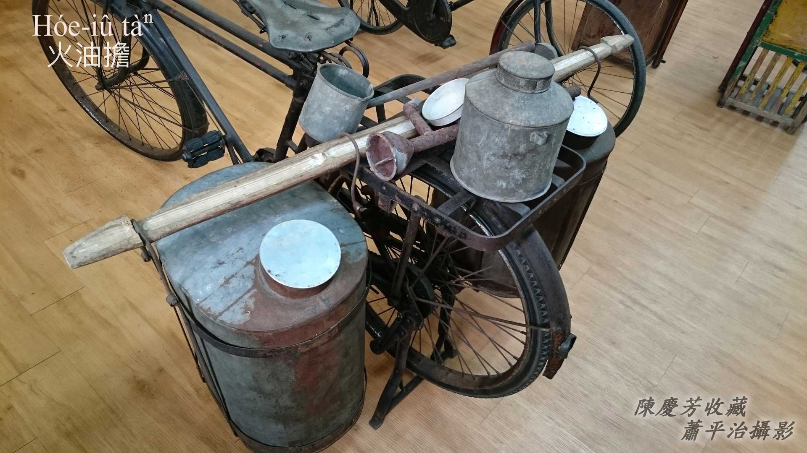

# 4. 賣冰擔頭á
> **Bē-peng Tàⁿ-thâu-á**

有用taⁿ--ê，mā有用鐵馬載--ê。
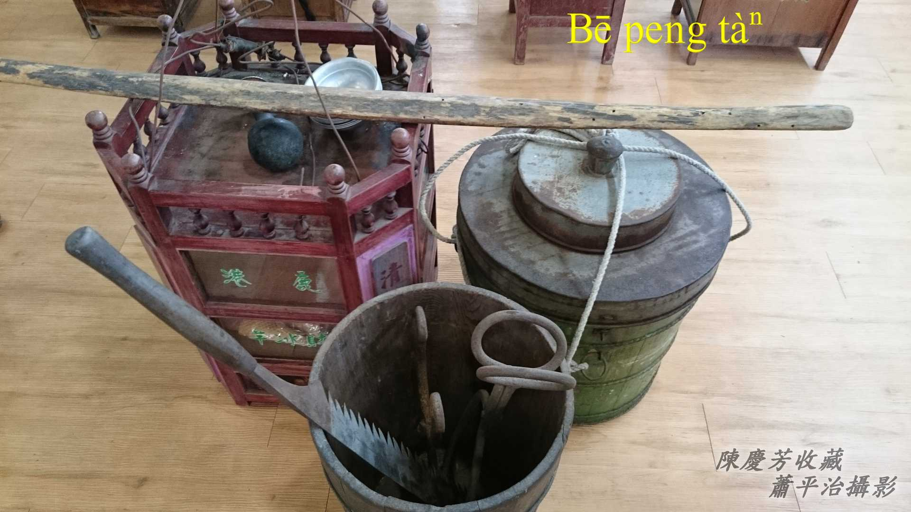
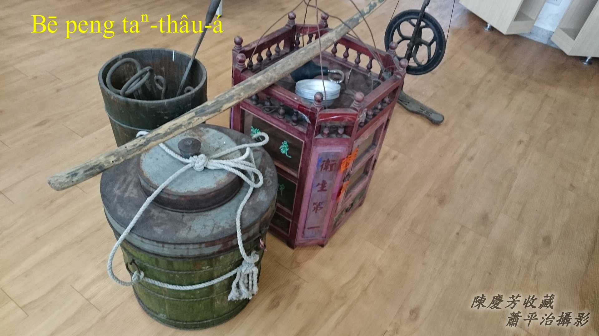
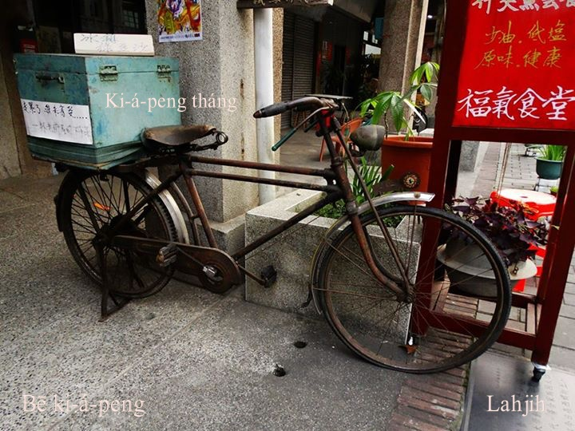

# 5. 磅米芳
> **Pōng-bí-phang**

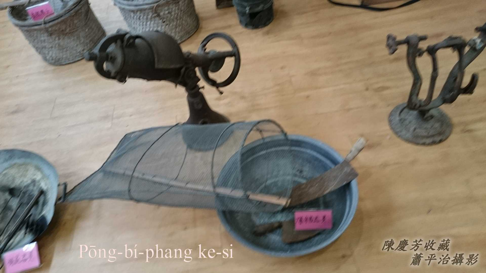

## 5-1. 米芳kah Pōng米芳有精差
> **Bí-phang kah Pōng-bí-phang Ū Cheng-chha**

古早唸謠：一--è炒米芳，二--ē炒韭菜‥‥‥可見米芳是kō͘炒--ê。

Pōng米芳是利用pōng米芳機器pōng--ê，兩種口味無kāng，米芳khah tēng khah phang，pōng米芳khah sang khah phàⁿ。

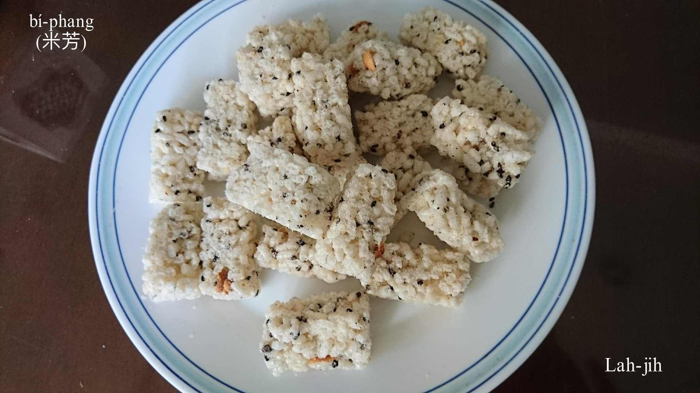
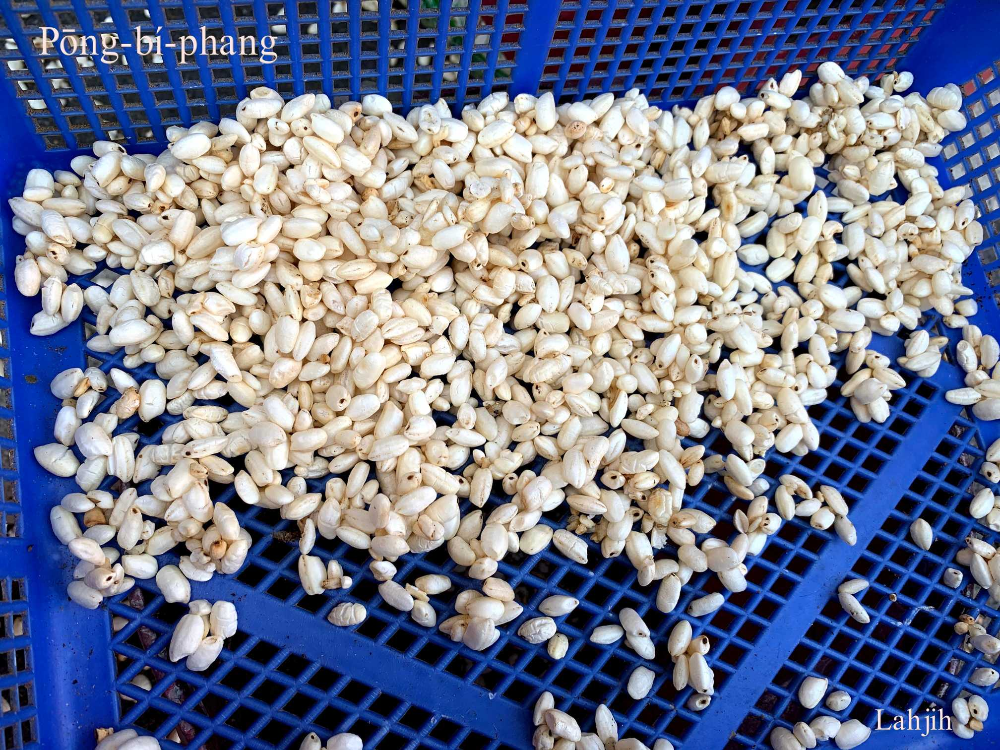
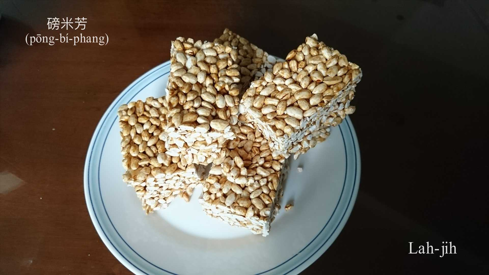

# 6. 煙腸kap珠á台
> **Ian-chhiâng kap Chu-á-tâi**

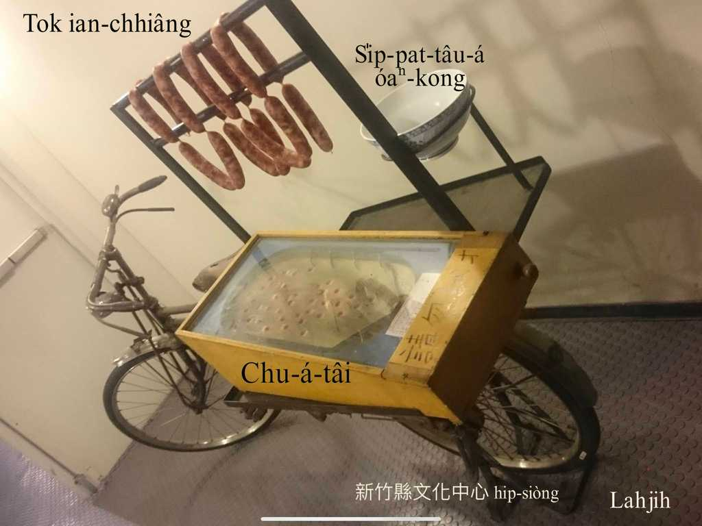

# 7. 粿擔
> **Kóe-tàⁿ**

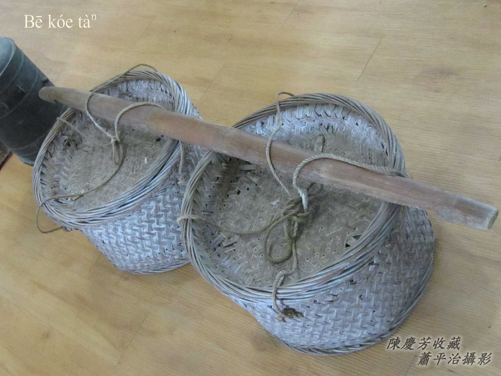

# 8. 豬á買賣
> **Ti-á Bé-bē**

買豬lia̍h豬用ê豬籠á，kō͘竹篾á辮，豬胚á ē-sái-tit貯1隻，豬á-kiáⁿ ē-sái貯leh 3-4隻。
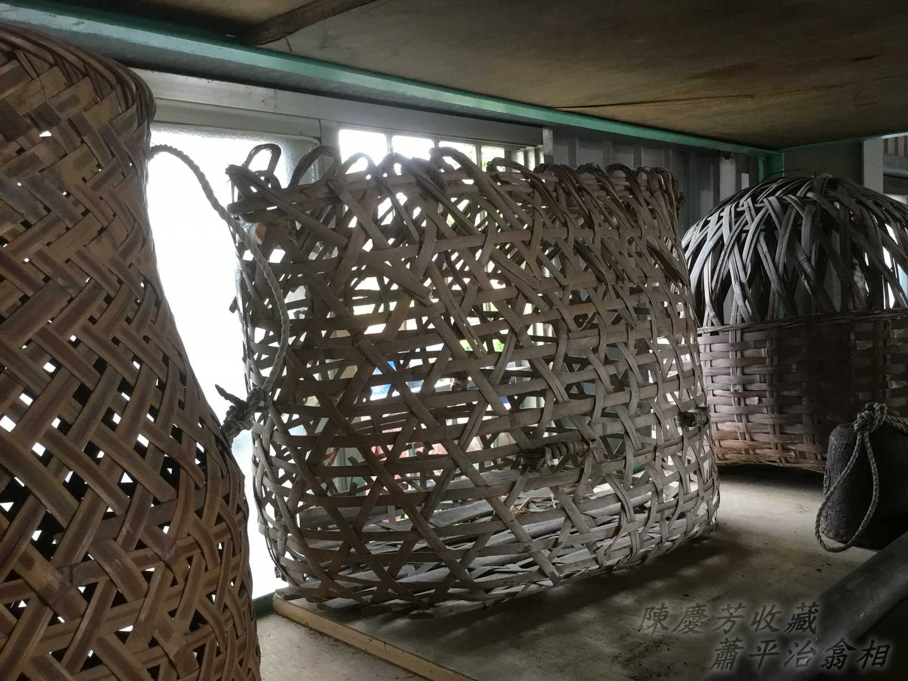

# 9. 註解
> **Chù-kái**

|**詞**|**解說**|
|精差|Cheng-chha，『差別』。|
|含á糖|Kâm-á-thn̂g，『糖果』。|
|sì-siù-á|『零食，零嘴』。|
|ka-tī chah|『自己帶』。|
|馬角á|因為號做鐵馬，所以手hōaⁿ-á mā號做馬角á。|
|tok--1-liau|『大約剁一長條形的量』。|
|liô|『用刀割開』。|
|有影--lio͘h|『真的啦』。|
|liâm-mi|『馬上，立刻，即時』。|
|ka-chì-á|ka-chù-á，『一種用藺草（鹹水草）​編成的提袋，今也用來泛指小提包』。|
|豬籠á|Ti-lam-á。|
|豬胚á|Ti-phoe-á，『正在成長中，體型半大不小的豬』。|