# 人力運搬重要ê家私──鐵馬
> **Jîn-le̍k Ūn-poaⁿ Tiōng-iàu ê Ke-si──Thih-bé**

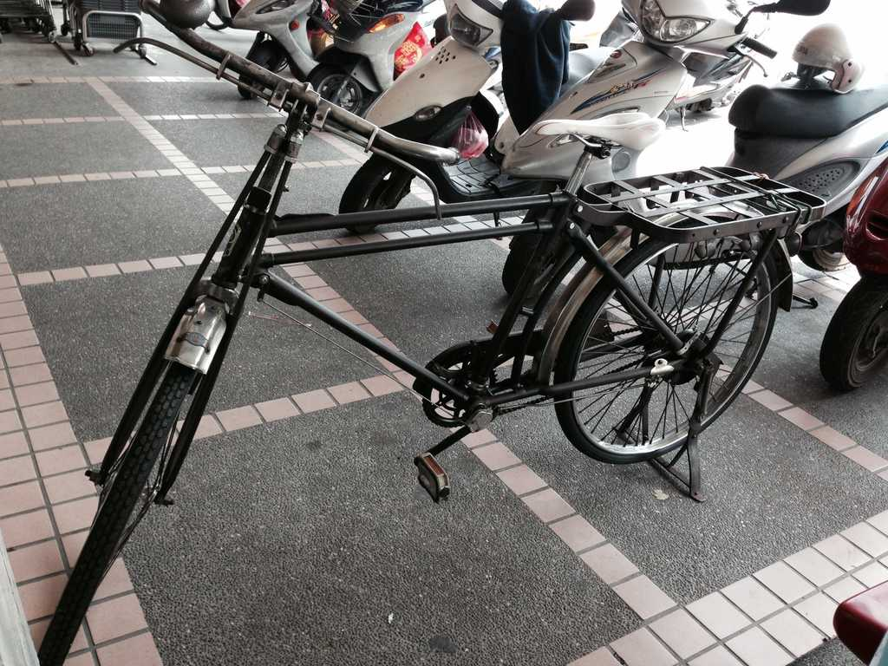

鐵馬橫koaiⁿ有單koaiⁿ kah雙koaiⁿ，雙koaiⁿ鐵馬號做雙台鐵馬，khah大台，khah粗勇，適合載重貨。Nā kan-nā單koaiⁿ to̍h號做toaⁿ台鐵馬。

鐵馬tī o͘-tó͘-bái猶未普及ê時代，是siāng時行ê交通工具，載貨，載人lóng真方便，是農業社會kài便利ê家私。

# 1. 雙台鐵馬
> **Siang-tâi Thih-bé**

雙台鐵馬是武車，車台m̄-nā雙koaiⁿ，頭前koh有補助骨，後載真大真勇，ē-tàng載重載，100斤200斤甚至超過4-5百斤重，往過是作穡人、生理人搬貨載貨ê重要工具。用棍á kah-tiàm後載，1-pêng 1-kha米籮a̍h是弓蕉籠，馬角á雙pêng koh ē-tàng掛兩kha ka-chì-á貯物。鐵馬土chhāi-á真在真四正。
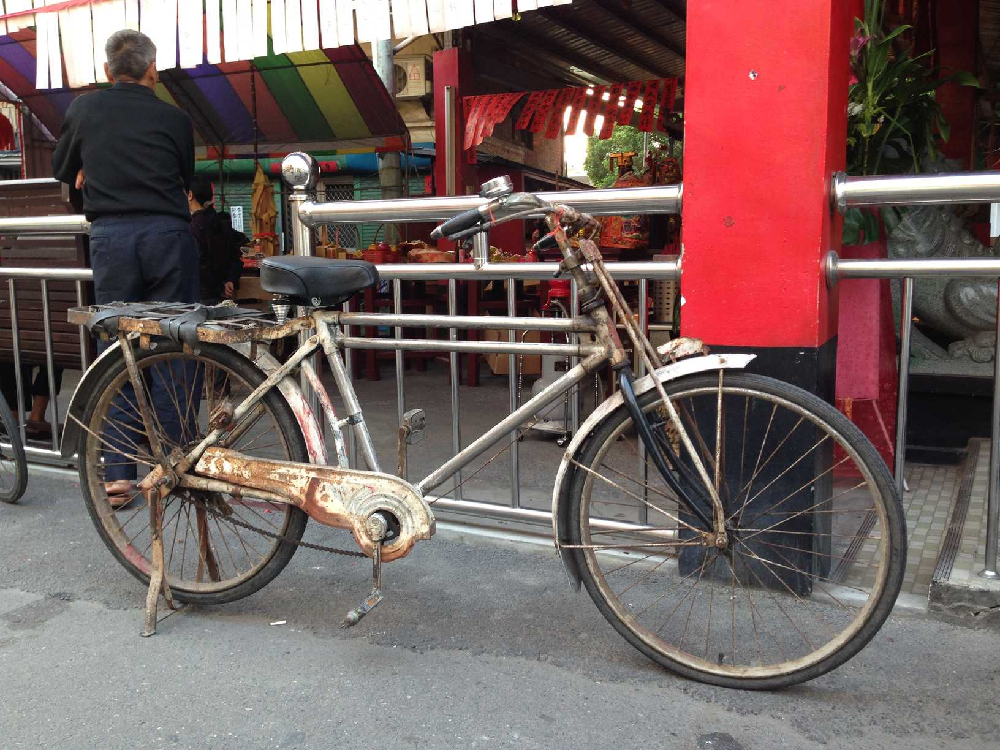

# 2. 雙台鐵馬各部位名稱紹介
> **Siang-tâi Thih-bé Kok Pō͘-ūi Miâ-chheng Siāu-kài**

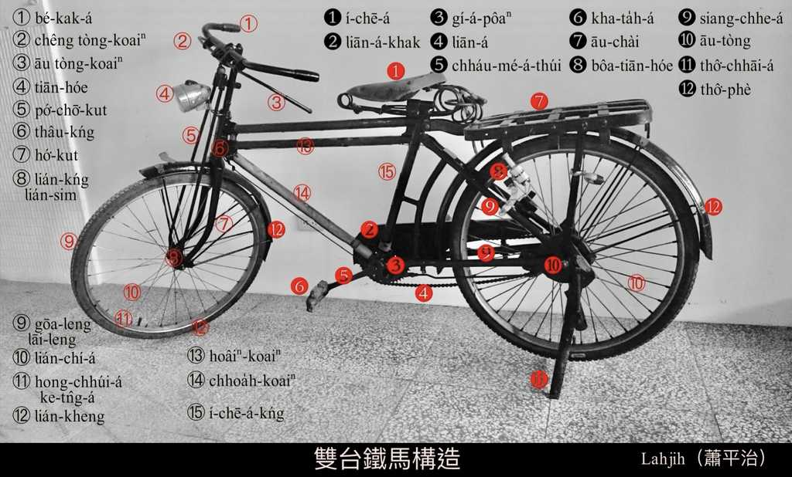

## 2-1. Liang-liang-á

鐵馬liang-á liang liang liang liang，請你sè-jī，niū我過--一-下！

鐵馬輪se̍h振動，利用lián-chí-á（輪止á）póe有發條ê鐘槌á kòng鐵馬liang-á，liang liang liang liang，鐵馬來--à，緊閃開，hō͘我過！
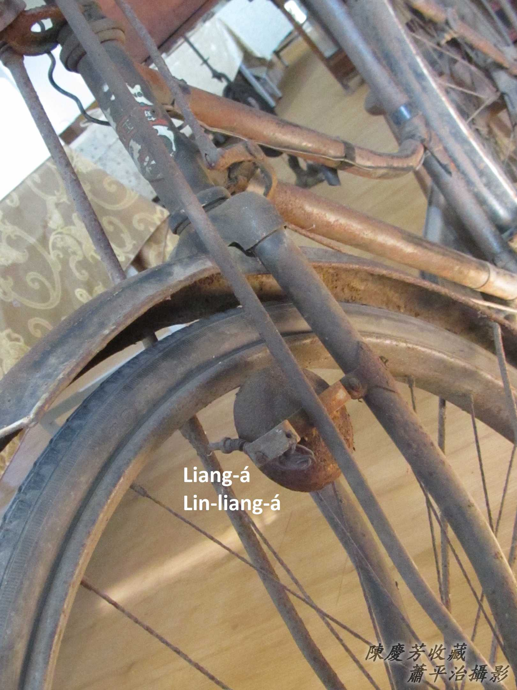

## 2-2. 馬角á
> **Bé-kak-á**

腳踏車號名叫鐵馬，『把手』to̍h號做「馬角á」。
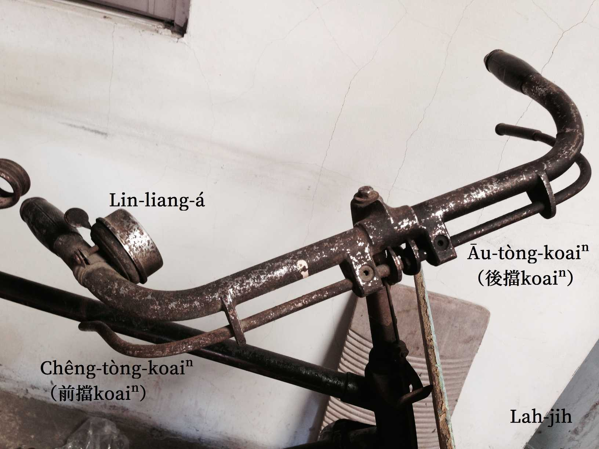

## 2-3. 手擋Koaiⁿ
> **Chhiú-tòng-koaiⁿ**

『煞車把手』。有分前擋koaiⁿ、後擋koaiⁿ。

## 2-4. 虎骨
> **Hó͘-kut**

是ùi英文Double fork，日文ダブルフォーク來--ê，to̍h是雙叉á。

## 2-5.補助骨

> **Pó͘-chō͘-kut**

補強虎骨強度。一台雙台鐵馬ē-tàng載5-6百斤貨。

## 2-6. 電火架
> **Tiān-hóe-kè**

掛電火用，安裝bôa-tiān-hóe（磨電火）ê燈頭，發電機安裝tī後輪a̍h是前輪。

利用樹奶輪ê外奶磨振動來發電ê發電機，叫做磨電火，腳踏á踏愈緊電愈飽，掛tī頭前ê電火球á to̍h愈光。

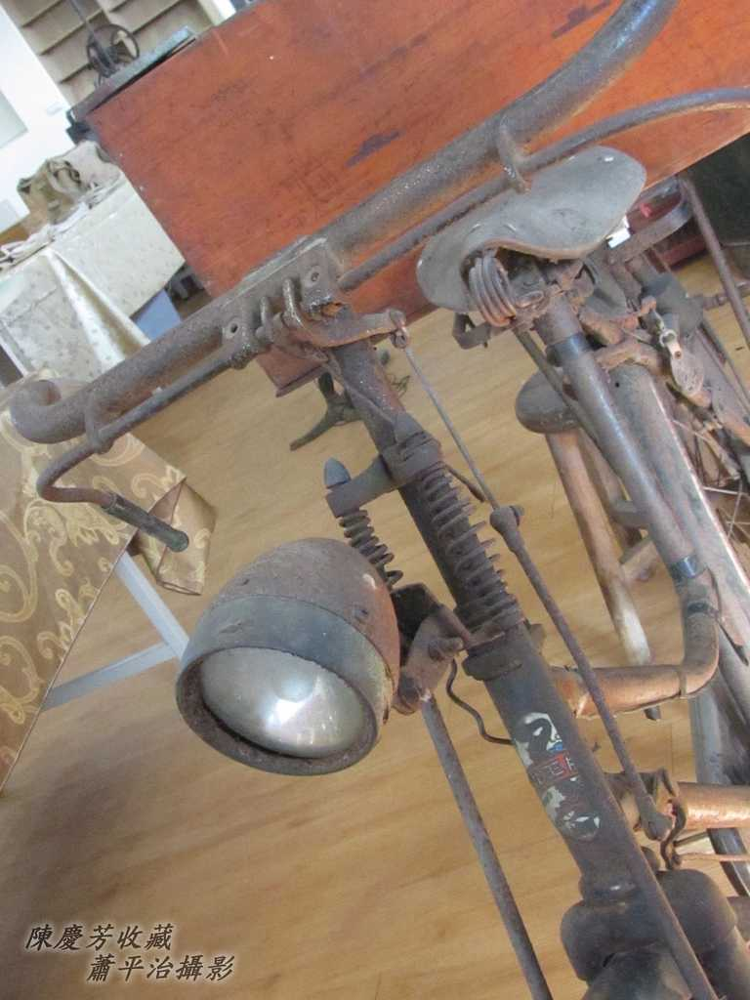
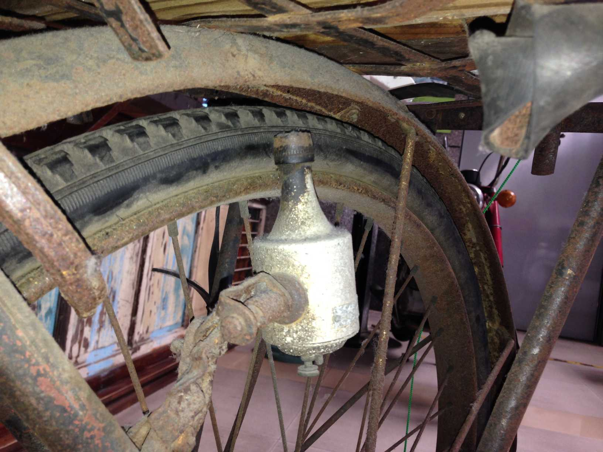
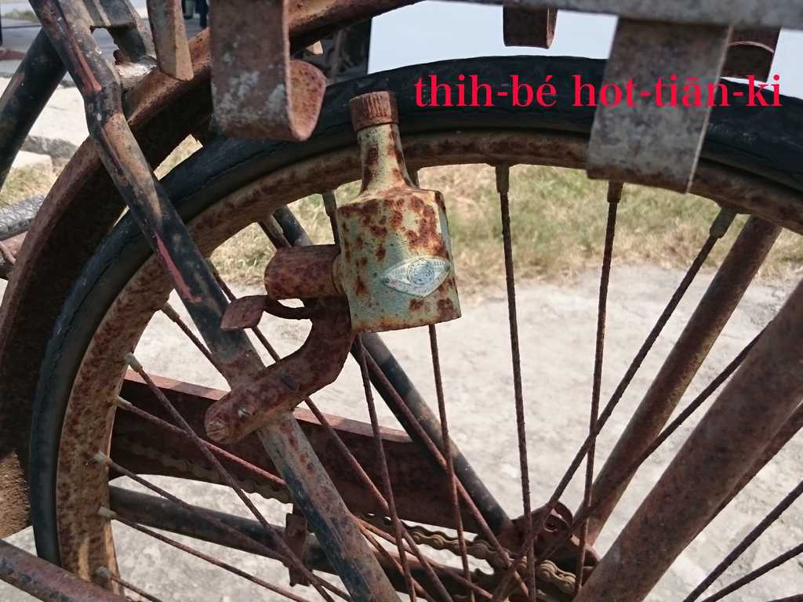
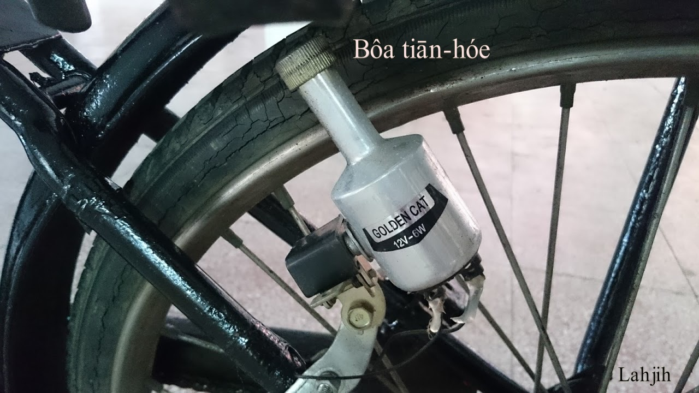

## 2-7. 土Phè
> **Thô͘-phè**

土phè／土phè-á> ，『擋泥板』。

## 2-8. 外奶
> **Gōa-leng**

|Gōa-leng|外奶|『外胎』。|
|Lāi-leng|內奶|『內胎』。|

## 2-9. 輪Kheng
> **Lián-kheng**

『輪圈』。

## 2-10. 前擋
> **Chêng-tòng**

『前煞車』。

## 2-11. 車心管
> **Chhia-sim-kńg**

『花鼓，輪軸穿過管道』。

## 2-12. 輪止á
> **Lián-chí-á**

『輻絲』。

## 2-13. 封嘴á
> **Hong-chhùi-á**

『氣門嘴』。風灌灌風ê所在。
雞腸á：內面樹奶管，ē-tàng阻擋漏風。

## 2-14. 椅坐á
> **Í-chē-á**

椅坐á是『座墊』。椅chū-á是『椅套』。
雙橫koaiⁿ車架、牛皮椅坐á，好坐chiâⁿ勇。
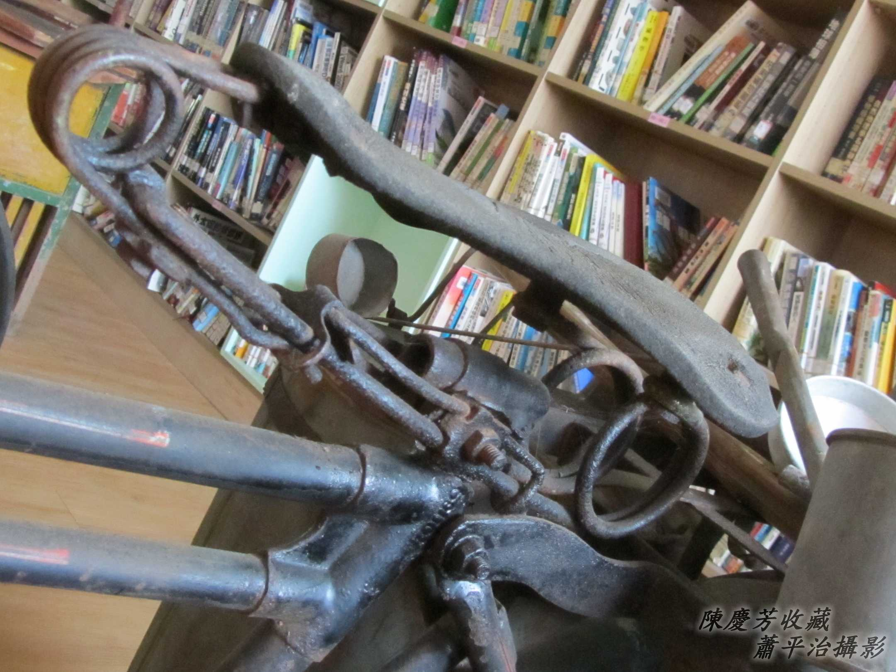
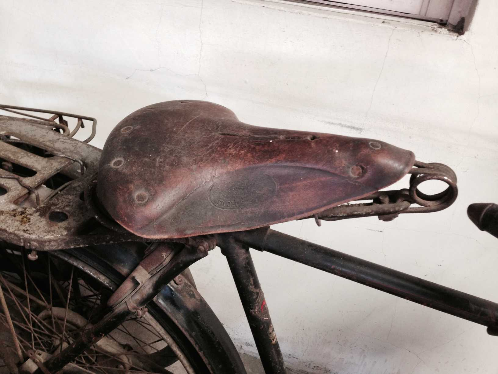

## 2-15. 椅坐á-Koaiⁿ
> **Í-chē-á-koaiⁿ**

『座桿』，調整座位koân低。

## 2-16. 三角架，橫杆，Khiā杆，斜杆
> **Saⁿ-kak-kè, Hoâiⁿ-koaiⁿ, Khiā-koaiⁿ, Chhoa̍h-koaiⁿ**

橫koaiⁿ路用真大，kah一隻鐵馬籐椅，ē-sái-tit載gín-á thit-thô；戀愛中ê cha-po͘ gín-á ē-sái-tit載cha-bó͘ gín-á poa̍h感情。細漢gín-á騎大人鐵馬kō͘ 「long koaiⁿ-á」，to̍h是kā一腳long過橫koaiⁿ下面ê騎鐵馬方式。（Chiok chē人美麗ê記智）

## 2-17. 鏈á殼，Gí-á盤，Gí-á
> **Liān-á-khak, Gí-á-pôaⁿ, Gí-á**

鏈á殼，有全khàm、有半khàm。Gí-á盤，『齒輪盤』；Gí-á，『齒輪』。

Khah紳士形ê鐵馬，鐵馬鏈á有保護ê外殼，khah-bē鐵馬鏈á咬tio̍h褲腳，傷tio̍h腳蹄。M̄-koh鐵馬nā落鏈to̍h khah oh修理。
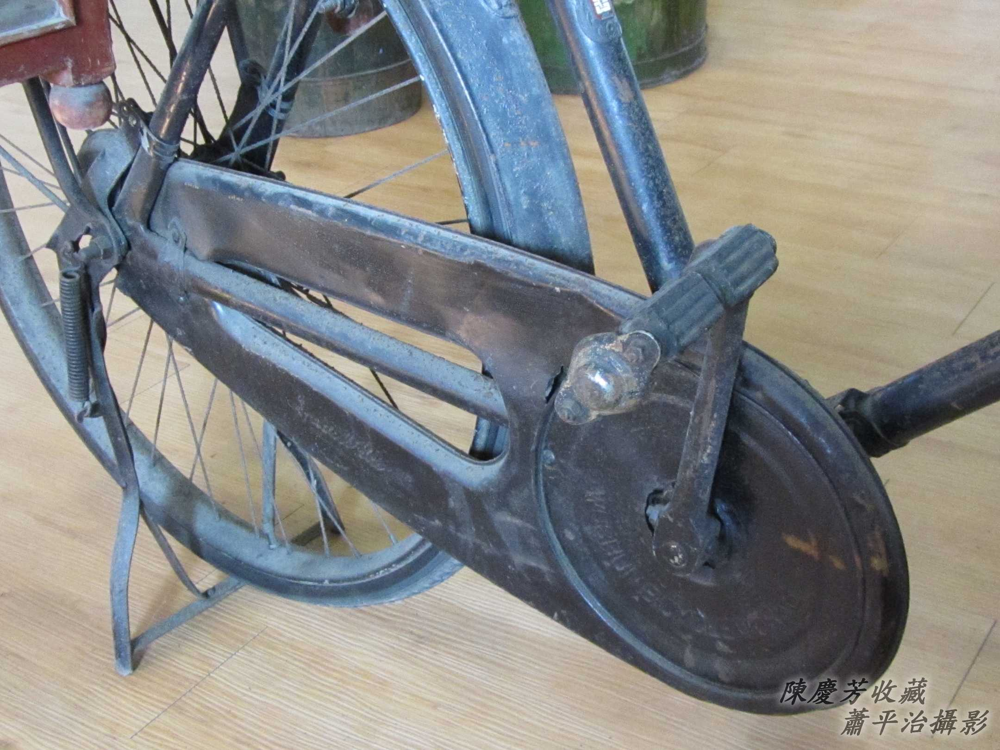
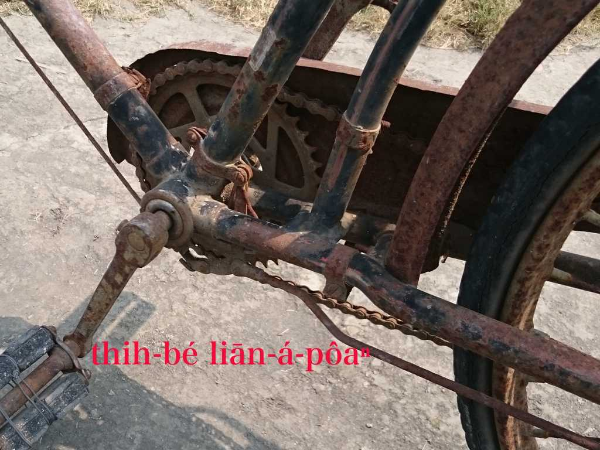

## 2-18. 草蜢á腿
> **Chháu-meh-á-thúi**

形體像Chháu-meh-á 後腳，『曲柄臂』。
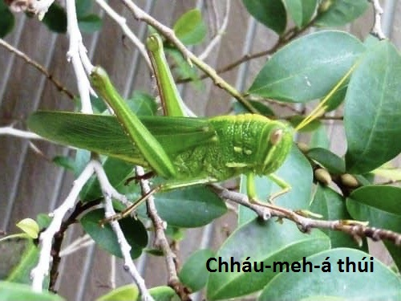

## 2-19. 腳踏á
> **Kha-ta̍h-á**

『腳踏板』。

## 2-20. 後載
> **Āu-chài**

後載，ē-sái-tit載人，ē-sái-tit載貨。Cha-po͘--ê坐騎馬long，cha-bó͘--ê坦橫坐，愛人á tio̍h-ài siâm腰siâm ân-ân。

## 2-21. 鎖
> **Só**

掛鐵馬專用鎖頭。

下kha ê相片是圓形鐵馬鎖
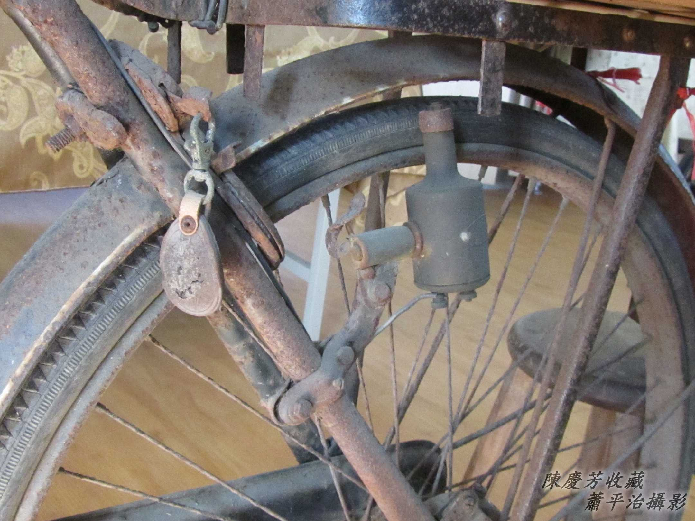 

## 2-22. 後擋kap腳擋
> **Āu-tòng kap Kha-tòng**

後擋是kòa皮á ê手擋。
頭前輪是頭前擋，後壁輪是後擋。用手控制是手擋，用腳倒退踏叫腳擋。

後擋是腳擋，he輪心看--起-來khah大是腳擋，利用腳踏á倒踏時，to̍h ē停車擋tiām。50年前ê鐵馬真普遍。

|後擋|『後煞車』。|
|腳擋|倒踏腳踏á to̍h ē『煞車』。|

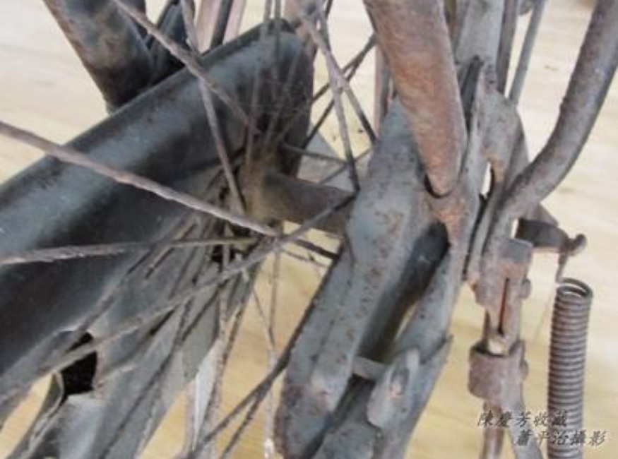
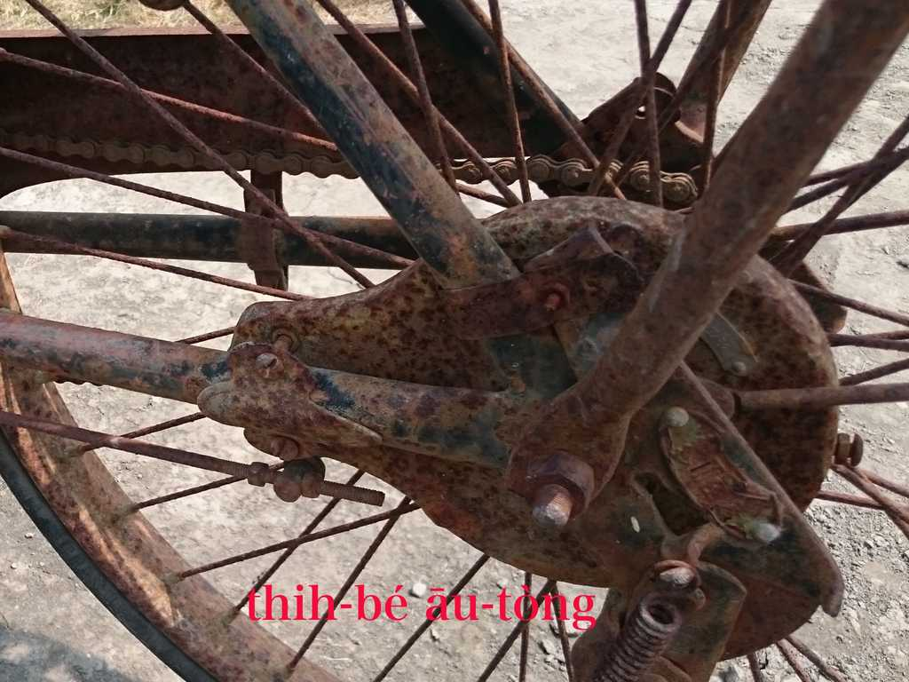
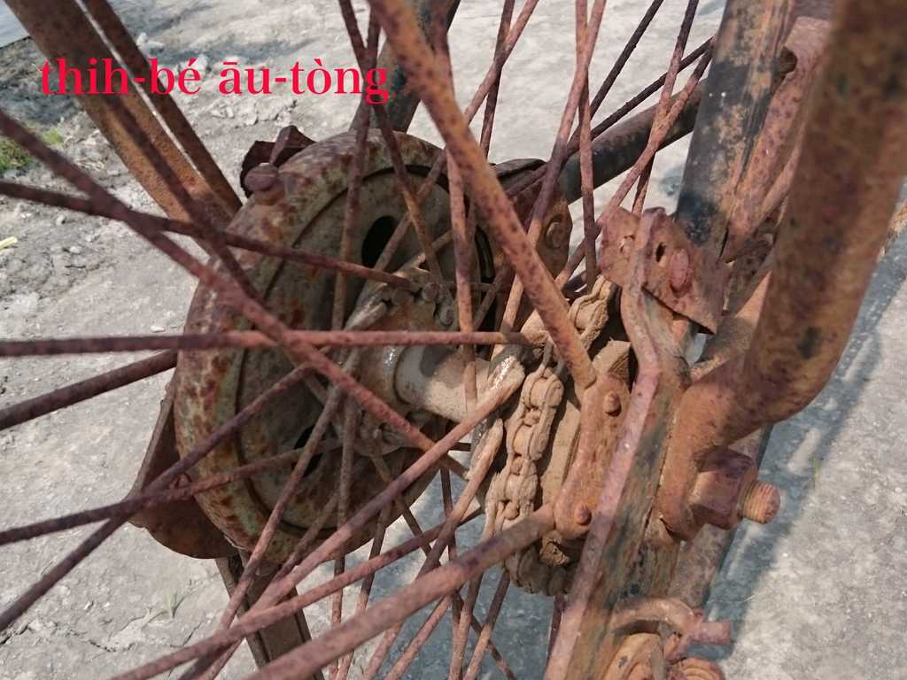
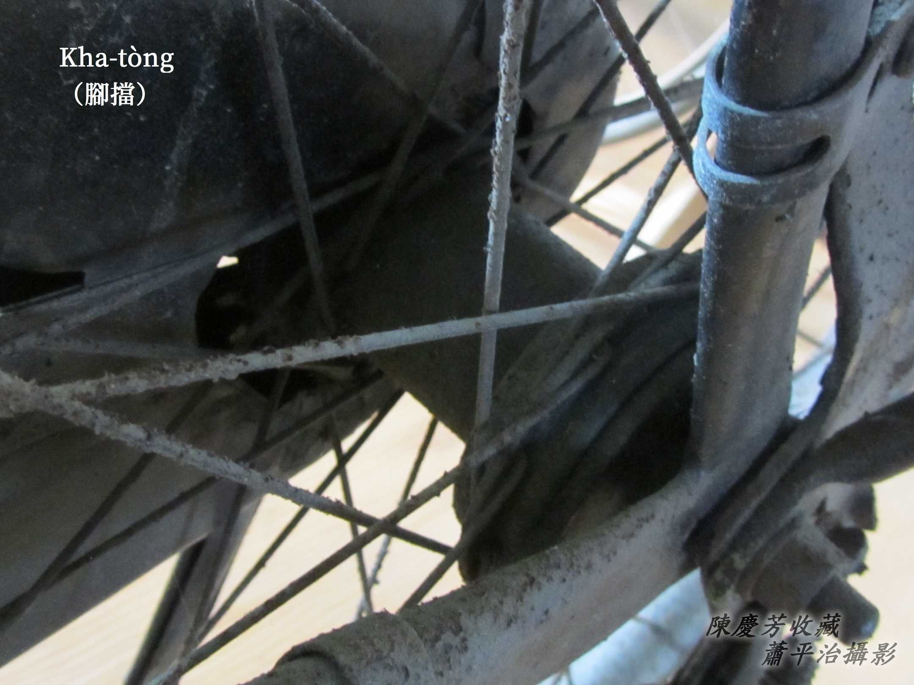

## 2-23. 鏈á
> **Liān-á**

鐵馬鏈á。鏈á siuⁿ lēng ē lak落gí-á盤，叫做lak liān-á。

**Lim酒喝拳**
Tán-chhau ih-kô、nn̄g-ē siong-hó、sam-á saⁿ-ki、sù-hông、ú khoâi、lak-lián、chhit-chhiâu / chhâi chhit、pat-sian、káu-koài、chóng-khai / chóng-lâi。

## 2-24. 土Chhāi-á
> **Thô͘-chhāi-á**

『腳架』。

# 3. 單台鐵馬各部位名稱紹介
> **Toaⁿ-tâi Thih-bé Kok Pō͘-ūi Miâ-chheng Siāu-kài**

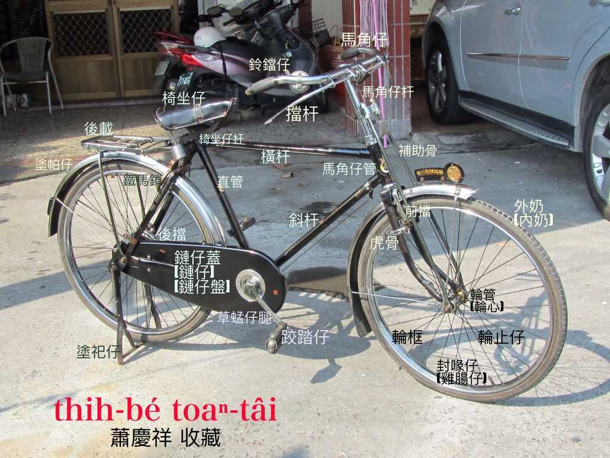

鐵馬名稱真多元，siāng捷聽人講--ê有鐵馬、腳踏車、自轉車、孔明車、自行車。伊ê部位名稱mā是各所在有各所在ê講法。鐵馬ê骨架是鐵管鋼管，chit字「管」chit-mái多數講「kóng」，鐵管nā是做骨架是「koaiⁿ」，nā是用來chhng細支鐵管a̍h是鐵條to̍h是「管kńg／kóng」，下面是個人所了解ê資料：

## 3-1. 馬角á
> **Bé-kak-á**

既是鐵馬，伊ê『車把』to̍h是馬角á。Mā有講做手hōaⁿ-á。

## 3-2.手擋Koaiⁿ
> **Chhiú-tòng-koaiⁿ**

手擋分前擋、後擋，後擋有擋皮á。

## 3-3. 馬角á-koaiⁿ
> **Bé-kak-á-koaiⁿ**

穿入車架前面管khang kap虎骨連結。

## 3-4. 電火
> **Tiān-hóe**

利用後壁輪磨電火送電。

## 3-5. 補助骨
> **Pó͘-chō͘-kut**

加強虎骨強度。

## 3-6. 虎骨
> **Hó͘-kut**

是ùi英文Double fork，日文ダブルフォーク來--ê，to̍h是雙叉á。

## 3-7. 輪管
> **Lián-kńg**

輪chí-á連結輪kńg kap輪kheng chiâⁿ做鐵馬輪ê結構。輪kńg ē-tàng穿輪心鋼koaiⁿ。

## 3-8. 輪心
> **Lián-sim**

輪心鎖tiâu tī雙叉尾，chiah ē-tàng hō͘鐵馬輪轉se̍h。

## 3-9. 輪Kheng
> **Lián-kheng**

輪管、輪chí-á、輪kheng chiâⁿ做鐵馬輪ê骨架，輪kheng外圍kho͘ chiūⁿ樹奶輪。

## 3-10. 封嘴á
> **Hong-chhùi-á**

風灌灌風ê部位，內面套雞腸á，阻止漏氣。Mā有寫做風嘴á。

## 3.11. 雞腸á
> **Ke-tn̂g-á**

比封嘴á khah細ê腸á形樹奶管（kńg），ē-tàng kā封嘴á束ân-ân bē漏氣（lāu-khùi）。

## 3-12. 橫koaiⁿ
> **Hoâiⁿ-koaiⁿ**

雖bóng是鋼管，tī chia是koaiⁿ。

## 3-13. Chhoa̍h-koaiⁿ

## 3-14. 直管
> **Ti̍t-kńg**

因為ē-tàng long入馬角á koaiⁿ，除了有koaiⁿ ê作用，mā有kńg-khang ê路用。

## 3-15. 鏈á殼
> **Liān-á-khak**

Jia khàm鐵馬鏈á，有半khàm，有全khàm。

## 3-16. 鏈á盤
> **Liān-á-pôaⁿ**

有gí-á，前輪khah大，後輪khah細。

## 3-17. 鏈á
> **Liān-á**

腳踏運轉前鏈á盤，利用鏈條帶動後輪鏈á盤。

## 3-18. 草蜢á腿
> **Chháu-mé-á-thúi**

Mā有簡單講做腿á。

## 3-19.腳踏á
> **Kha-ta̍h-á**

Khah早騎鐵馬多數是thǹg赤腳，所以腳踏á有橡膠製品。

## 3-20. 椅坐á
> **Í-chē-á**

有牛皮，有塑膠製品。

## 3-21. 後載
> **Āu-chài**

載人、載貨用，武車後載khah大，文車khah細。

## 3-22. 土Phè
> **Thô͘-phè**

防止土米沙、水噴tio̍h腳。

## 3-23. 磨電火
> **Bôa-tiān-hóe**

To̍h是『磨電燈』，是利用車輪帶動ê細型發電機。

## 3-24. 後雙叉
> **Āu Siang-chhe**

安裝固定後輪骨架。

## 3-25. 輪chí-á
> **Lián-chí-á**

調整輻射型輪chí-á kap輪kheng ê平均受力，chiah-thang hō͘鐵馬輪平穩運轉。

## 3-26. 外奶
> **Gōa-leng**

Tēng質橡膠製品，有溝槽，防止chhū倒。

## 3-27. 內奶
> **Lāi-leng**

Ē伸kiu彈性橡膠製品，耐壓有彈性，減少無平土腳跳動。

## 3-28. 土Chhāi-á
> **Thô͘-chhāi-á**

方便停車載貨，比較khah安穩妥當。

# 4. 鐵馬Koaiⁿ藤椅
> **Thih-bé-koaiⁿ Tîn-í**

細漢gín-á siāng kah意，khòe-tiàm鐵馬koaiⁿ載細漢gín-á足方便好勢。
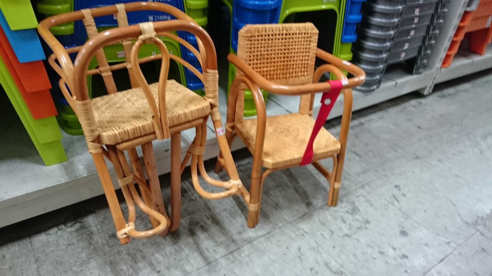
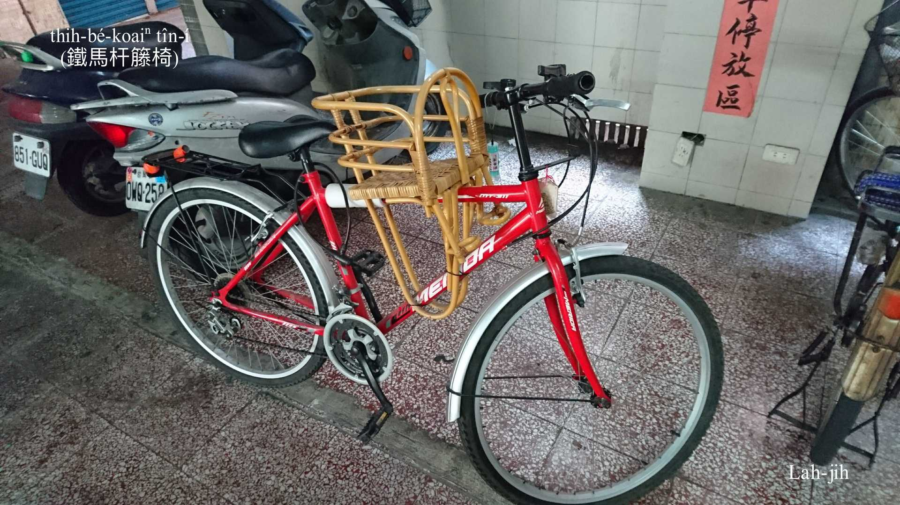

# 5. 武車，文車
> **Bú-chhia, Bûn-chhia**

單台鐵馬有鐵管khah粗ê武車kap鐵管khah細ê文車。

## 5-1. 武車
> **Bú-chhia**
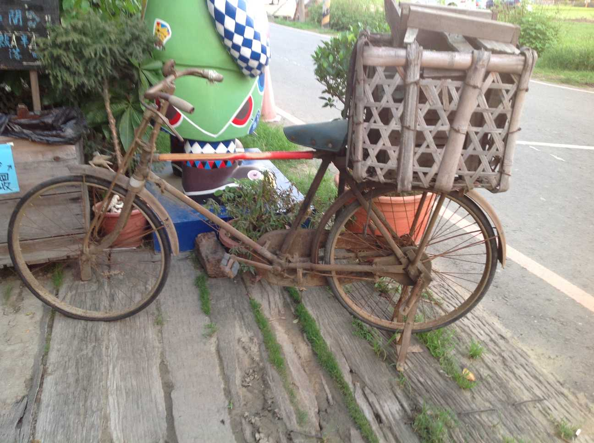
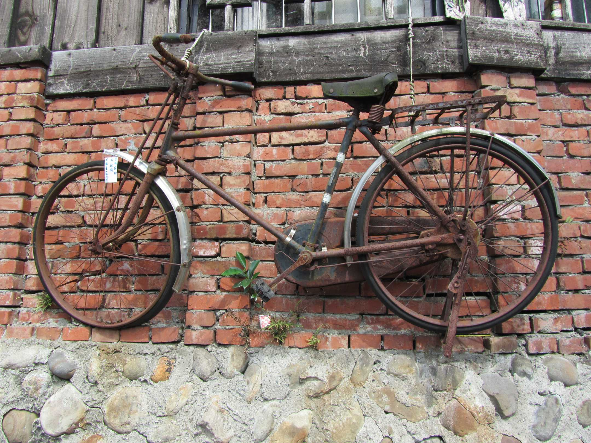

## 5-2. 文車
> **Bûn-chhia**

紳士人、食頭路人、女性，上班、郊遊騎thit-thô ê鐵馬。Cha-bó͘車車架橫koaiⁿ放低，適合女性穿裙hāⁿ起去椅坐á。

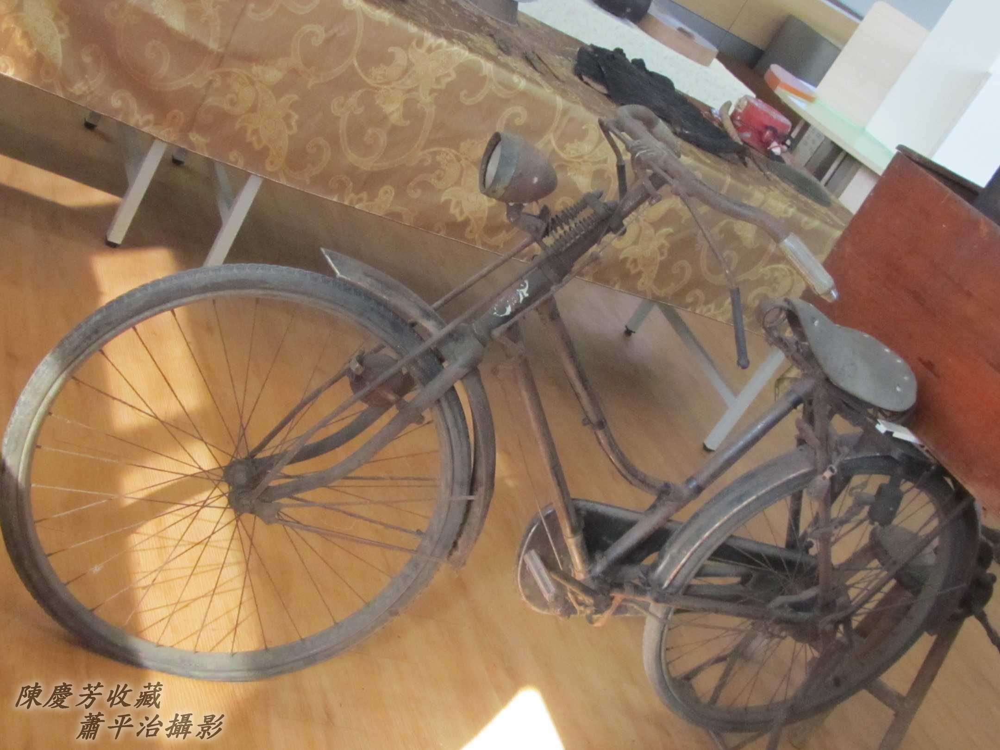

# 6. 風聚á
> **Hong-chū-á**

鐵馬輪nā消風to̍h需要用風聚á灌風，古早風聚á是一種簡單ê『唧筒』原理，kā風聚á嘴鋏tiàm鐵馬輪封嘴á，to̍h ē-sái-tit聚風（chū-hong）入去內奶，因為封嘴á內有套雞腸á ē-tàng防止漏風消風。

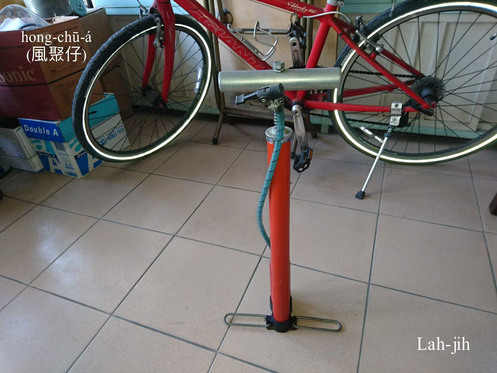

# 7. 修理鐵馬
> **Siu-lí Thih-bé**

鐵馬tī 1950年代進前是真方便真高貴ê交通工具，貴som-som，一般人買bē起，除非是有錢ê好額人買來騎phok-sóng（博爽），a̍h是食頭路人為tio̍͘h體面，chiah ē chhân-chhân hak來騎。Nā是一般人，a̍h是做生理，為tio̍h來來去去ê方便，只好去買二手貨，二手貨to̍h是舊鐵馬，自然毛病chē，厚沙sap，m̄是消風，to̍h是破輪，nā是péng車、lòng tio̍h電火柱á、cheng壁，to̍h需要去鐵馬店修理。

鐵馬害--去tio̍h用牽--ê a̍h是用giâ--ê，庄腳到市街，1-chōa路lò-lò長實在chiâⁿ pháiⁿ紡，好ka-chài有he專門修理鐵馬ê師傅ē來「到位服務」。

## 7-1. 輪Kheng台
> **Lián-kheng-tâi**

Chit-kâi家私kài重要，華語叫做『輪圈矯正器』，台語號做輪kheng台，kah鐵馬輪ê輪kheng有正無正to̍h是靠chit台。

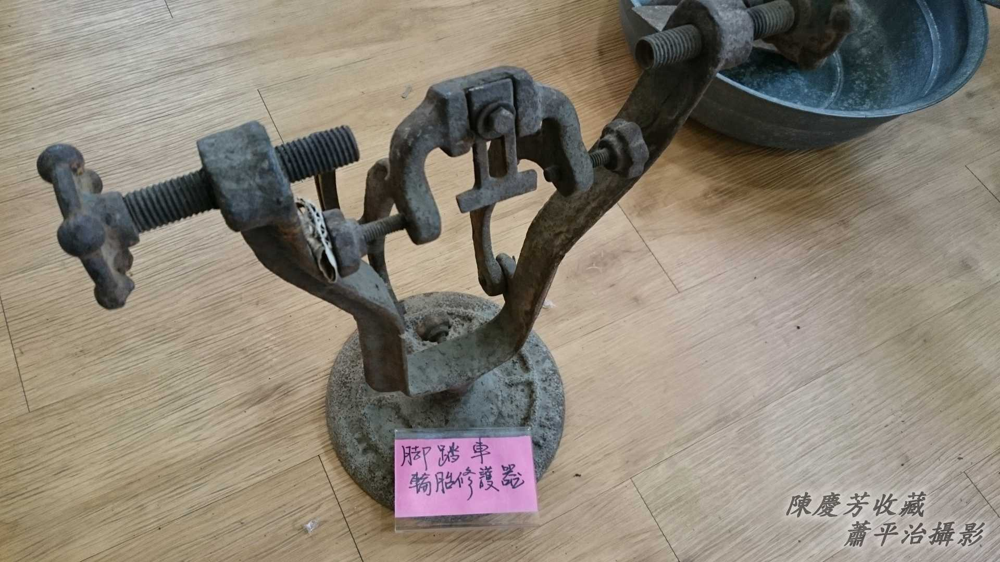

## 7-2. Kah輪止á
> **Kah Lián-chí-á**

Liáng-pêng邊--a兩粒螺絲穿過鐵馬輪ê輪心，hō͘輪ē-sái-tit se̍h振動，中央khah細kho͘「門」字形ê鐵á，ē-sái-tit徙koân徙低，適合jī-sì-á、jī-la̍k-á、jī-peh-á（24、26、28英吋），kā輪kheng kah ho͘正，chiah鎖輪止á。Chit-kâi輪kheng台現此時iáu leh用，是日本製。（75歲鐵馬店頭家/師傅講。）
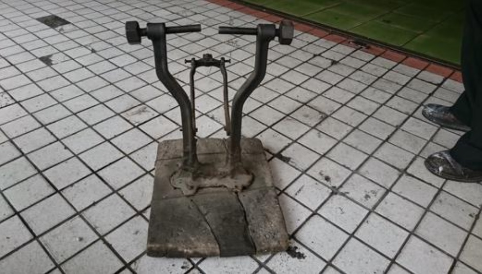
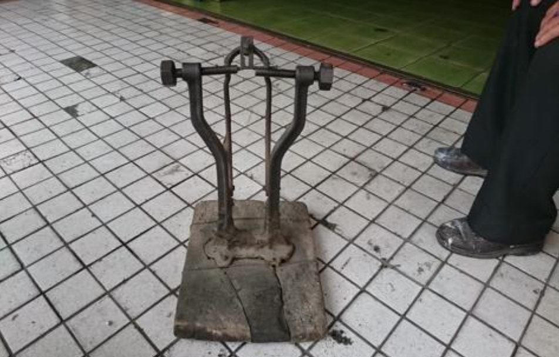

# 8. 鐵馬牌
> **Thih-bé-pâi**

鐵馬牌需要用lúi-teng鎖tiàm頭前虎骨車koaiⁿ，需要納稅。

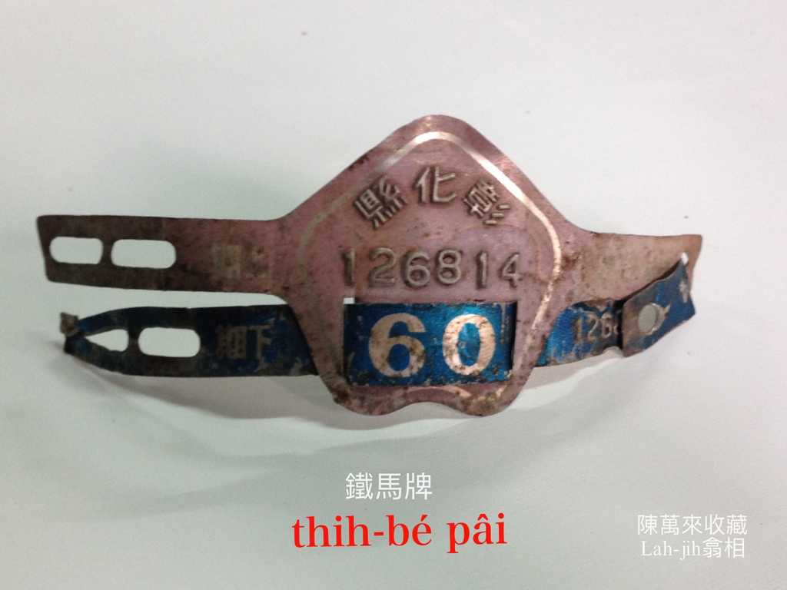
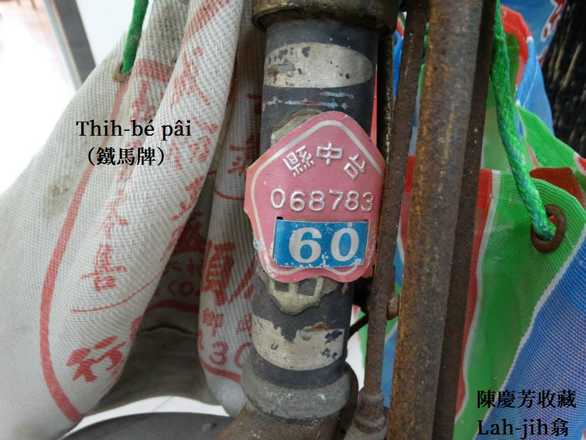
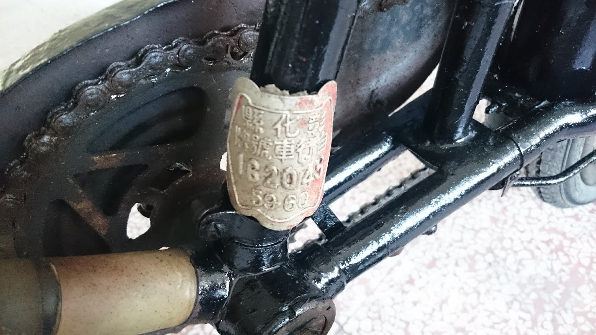
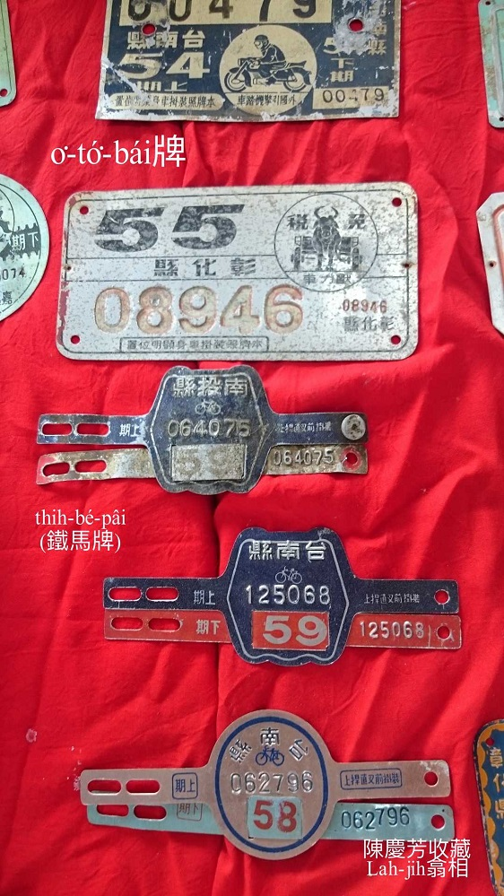

直插式鐵馬牌是1950年代早期ê鐵馬牌，長長ná弓蕉，號做弓蕉牌。分兩部份，下座用lúi-teng掛tī後輪土phè，頂座入tī下座，鐵馬chhāi定，頂座抽--起來to̍h bē-tàng騎出門，警察ē認為是偷牽--ê，當做賊á lia̍h，a̍h是罰錢。
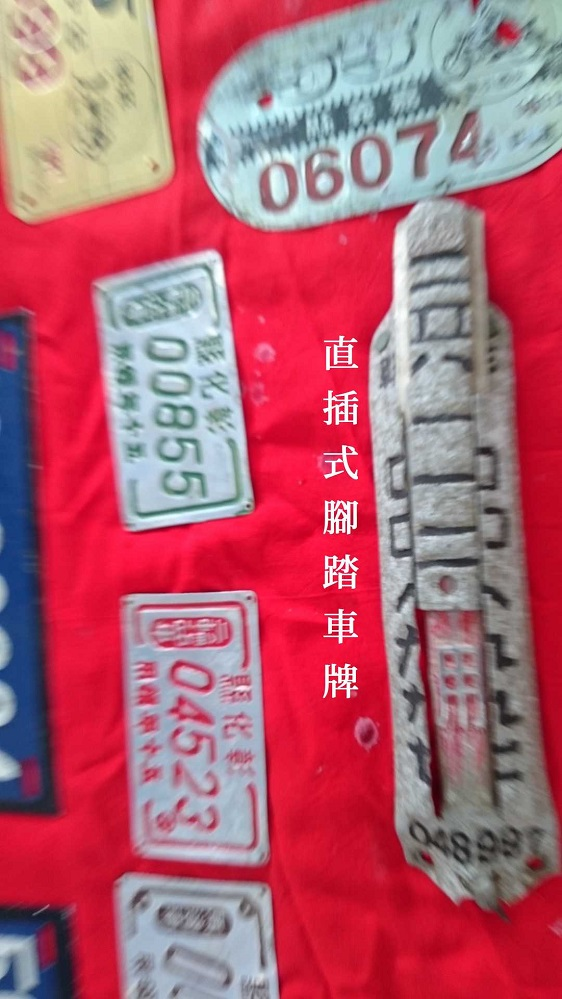

# 9. 註解
> **Chù-kái**

|**詞**|**解說**|
|niū我|『禮讓我』。|
|管|Kóng，『圓形中空』，水管、竹管、鐵管。|
|管|Kńg，『可以輸送穿通的管子』，血管、嚨喉管、氣管。|
|siâm腰siâm ân-ân|『雙手合抱，抱緊緊』。|
|樹奶|Chhiū-leng/chhiū-ni，『橡皮。從橡膠樹樹幹中所擷取出來的乳狀物質，乾涸後呈黃色彈性的軟塊』。|
|聚風|Chū-hong，灌風，『打氣』。|
|gí-á|ギヤ， Gear，『齒輪』。|
|chhū倒|『滑倒』。|
|kah|『校正』。|
|phok-sóng|博爽，『讓心中感到痛快舒暢』。|
|chhân-chhân hak來騎|『乾脆狠下心來買來騎』。|
|厚沙sap| Kāu-soa-sap。『1.形容一個人身體違和，終年病痛纏身。2.形容一個人既囉嗦又挑剔，很難伺候』。|
|péng車|『翻車』。|
|lòng tio̍h電火柱á|『撞到電線杆』。|
|cheng壁|『撞到牆壁』。|
|o͘-tó͘-bái|『摩托車』。|
|lúi-teng|『鉚釘』。|
