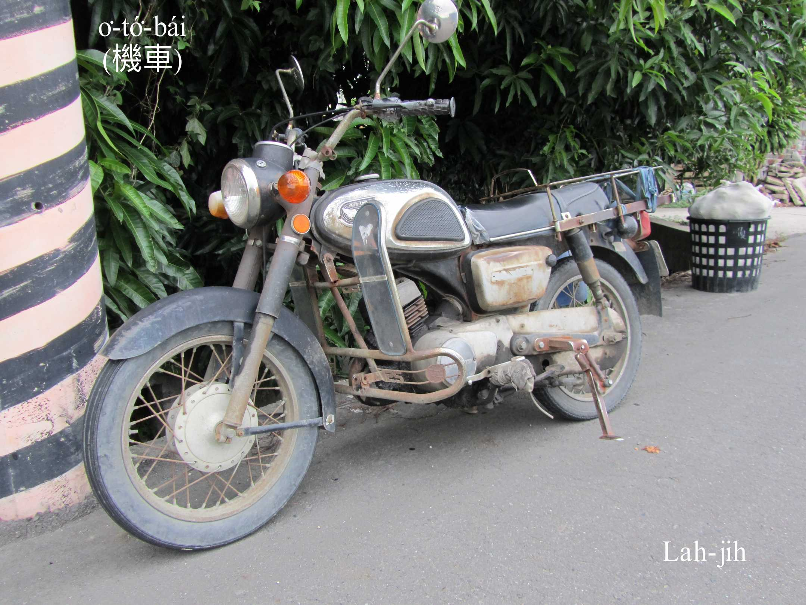
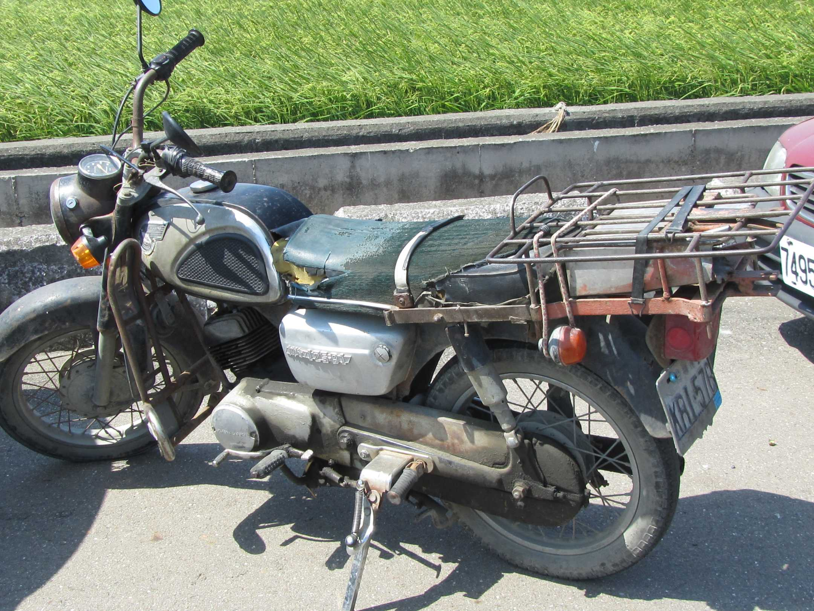
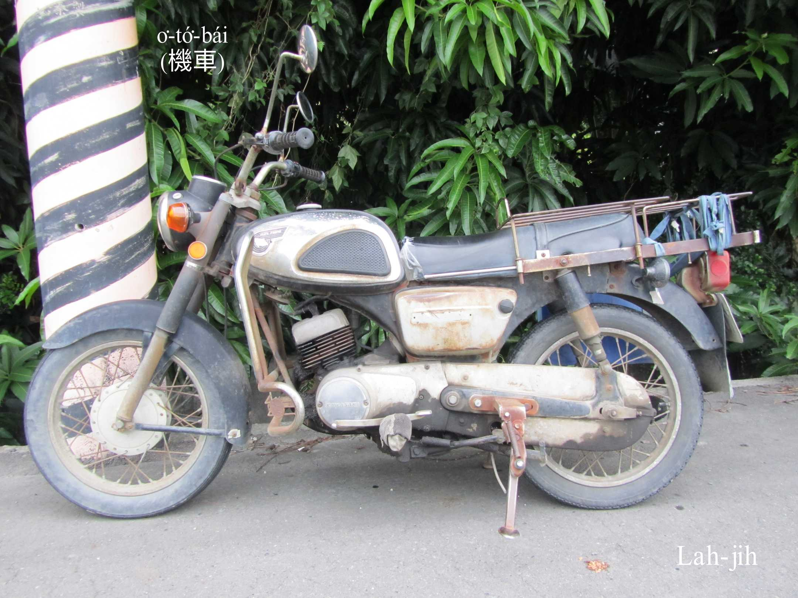
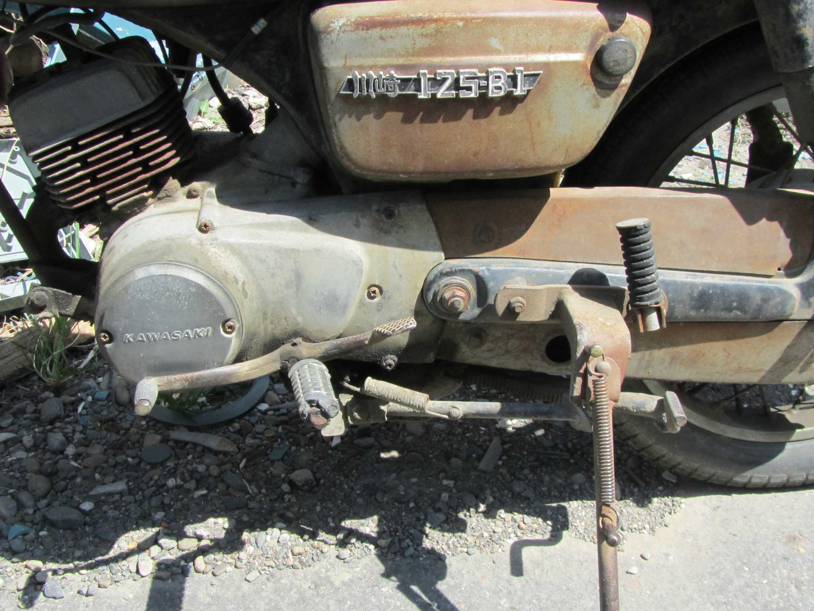
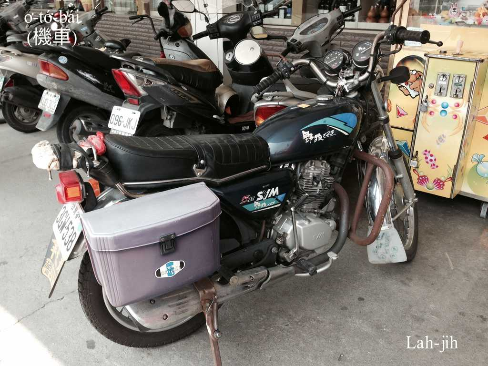
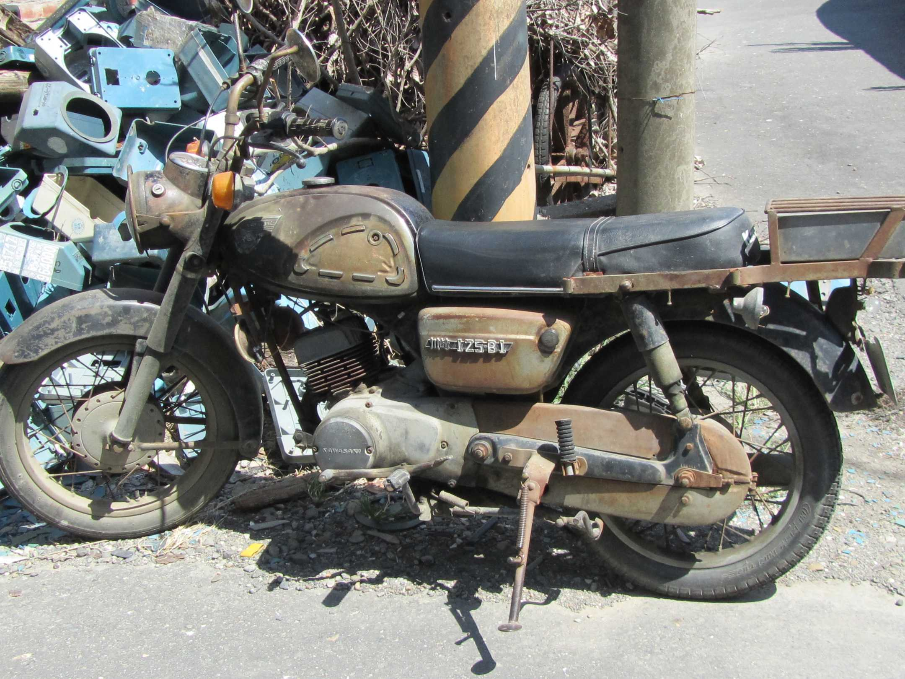
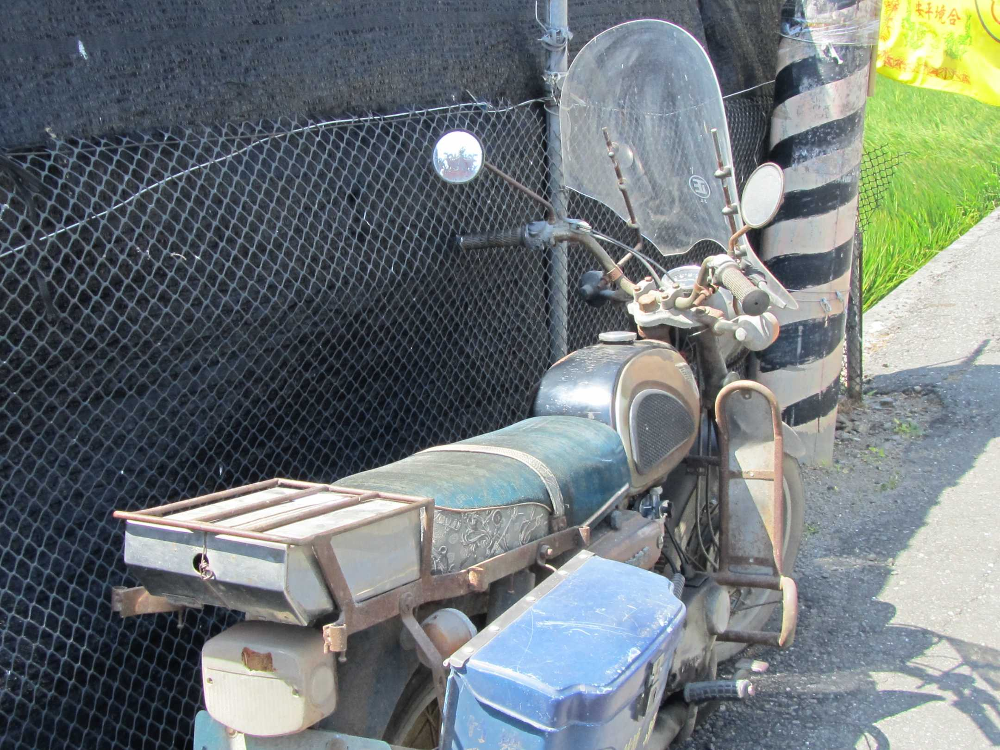
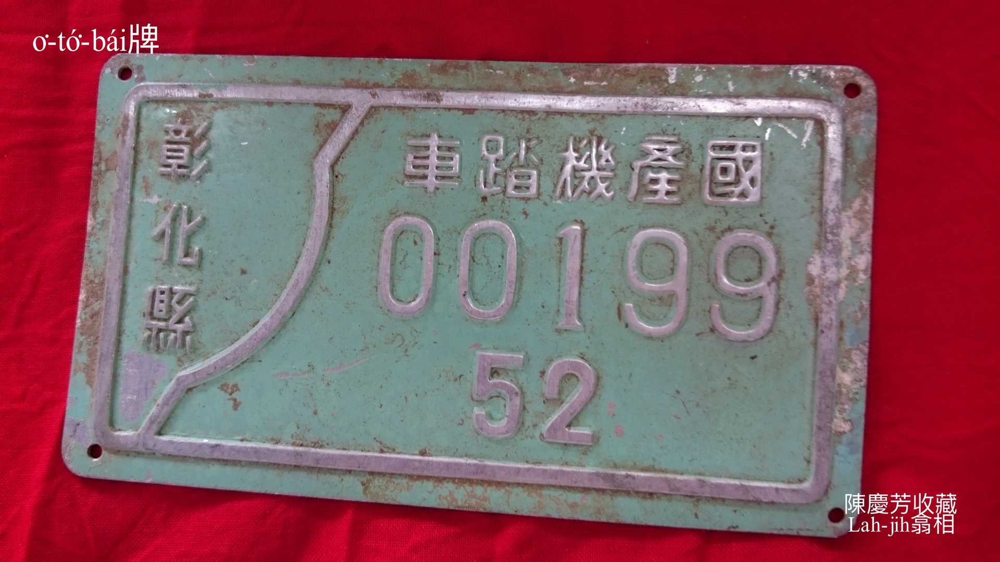
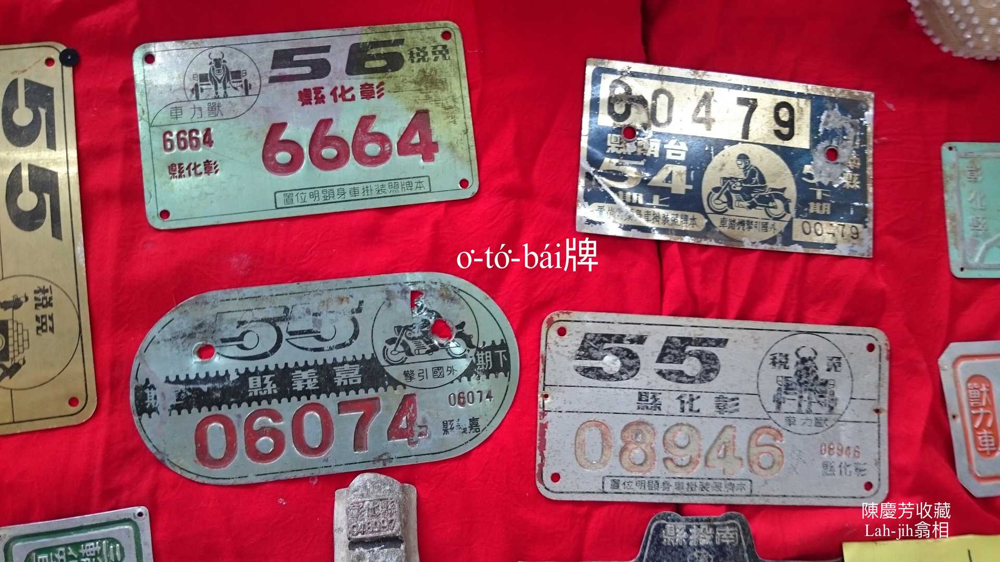

# 工業時代──機車取代人力獸力
> **Kang-gia̍p Sî-tāi──Ki-chhia Chhú-tāi Jîn-le̍k Siù-le̍k**

利用iăn-jín帶動ê o͘-tó͘-bái ，原名號做機器腳踏車，後--來正式名稱是機車，一般有人講iăn-jín、有人講機車、有人講o͘-tó͘-bái，仿日語發音ê台語o͘-tó͘-bái siāng chē人講，是台語o͘-tó͘-bái，m̄是日語オートバイ。1966以後，作穡人生理人漸漸用機車載貨，緊速、載重koh gâu peh崎，m̄-nā省氣力，koh省真chē時間，雙台鐵馬自án-ne漸漸退時。

125c.c.重型機車是載貨siāng有力siāng方便siāng普遍ê o͘-tó͘-bái。

# 1. O͘-tó͘-bái牌
> **O͘-tó͘-bái-pâi**

O͘-tó͘-bái牌需要納稅，車牌用螺絲鎖tiàm後輪土phè所在。

# 2. 註解
> **Chù-kái**

|**詞**|**解說**|
|iăn-jín|えんじん，『引擎』。|
|o͘-tó͘-bái|『摩托車』。|
