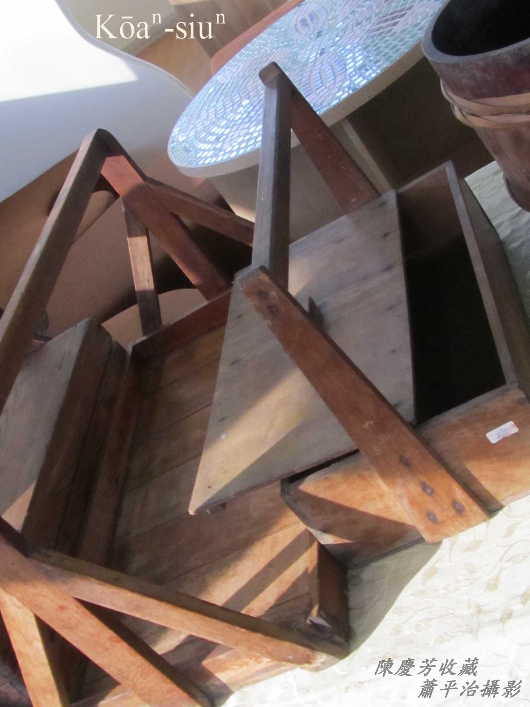
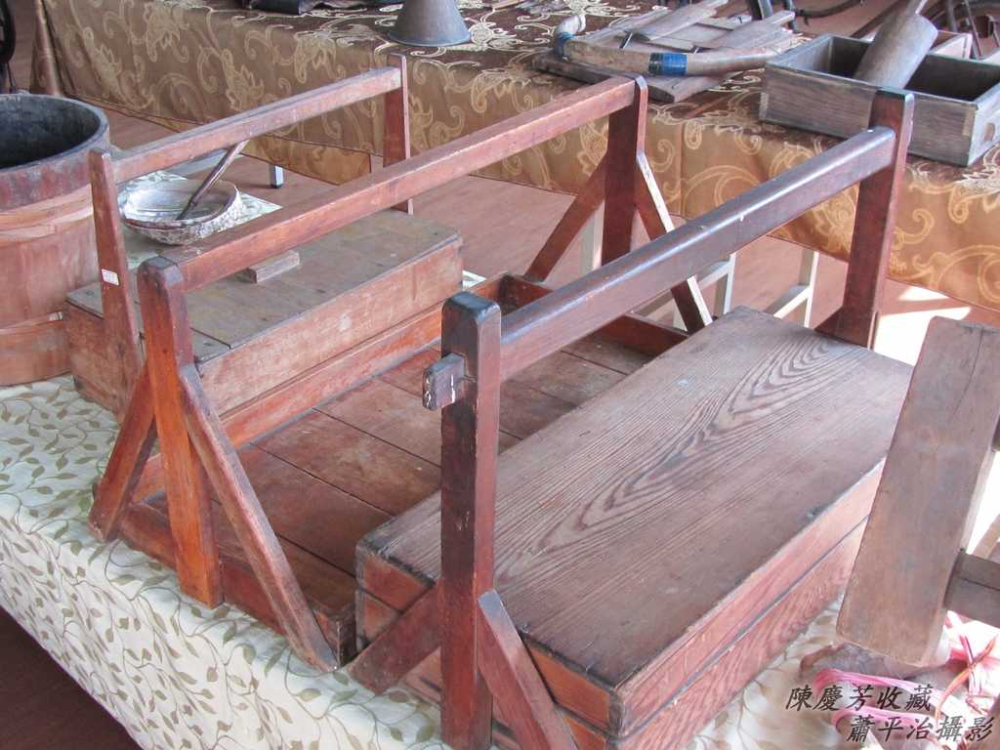
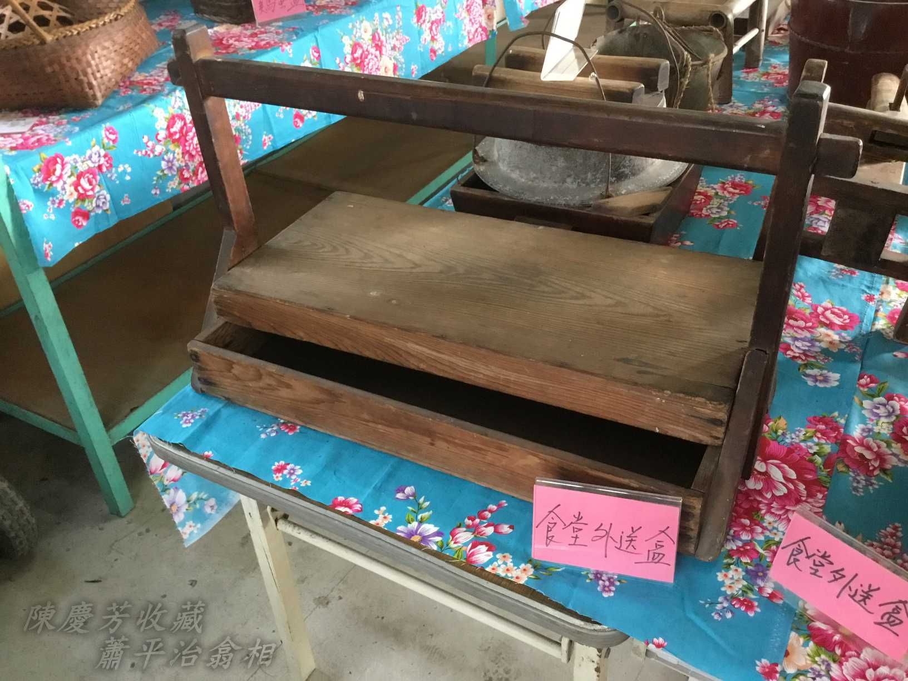
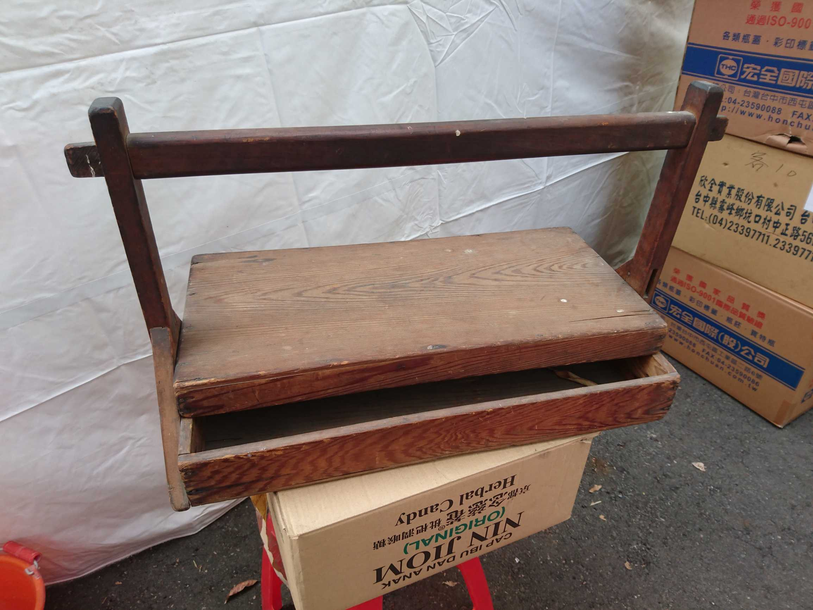
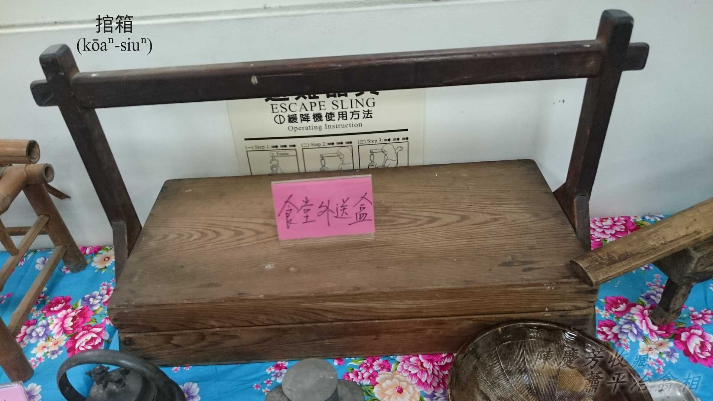

# Siáⁿ-mih是走街生理？
> **Siáⁿ-mih Sī Cháu-ke Seng-lí**

（蕭平治 林先生 陳慶芳）

傳統生理有khiā店生理，等人來買；taⁿ擔喝賣生理，chhōe有人ê所在，方便人來買；a̍h是直接服務到厝內收siàu、寄藥、生kiáⁿ、看病ê助產醫療。

古早，人o-ló賴和醫生是彰化媽祖，伊每pái往診，街頭巷尾四界走chông，醫人病疼、救人性命，人伊soah ka-tī kò͘謙是「走街á仙」，伊ê意思是kap走街生理kāng款是服務到位。

走街生理需要taⁿ擔、排擔á徙位，有ê taⁿ leh行，有ê用鐵馬載、用車á sak，nā是醫生、產婆可能ē chhiàⁿ轎扛，chhiàⁿ人力車坐。

走街生理部份紹介ê古物á大部份是陳慶芳先生收藏／蕭平治翕相。

# 1. Kōaⁿ箱á
> **Kōaⁿ-siuⁿ-á**

Kōaⁿ箱á是一種送料理食物ê柴箱，有蓋thang khàm bē eng-ia，有kōaⁿ耳thang kōaⁿ，方便外送。Khah早麵店a̍h是菜店、公共si̍t-tn̂g（食堂），人客來食料理，nā是店內食桌，走桌--ê ē用桶盤送菜，khah有衛生氣質，nā是tn̄g-tio̍h外送，to̍h需要用chit-lō kōaⁿ箱送菜，m̄-nā衛生，koh ē淡薄á保溫。

Kōaⁿ箱1-kha ē-tàng khǹg 2-3碗公料理，燒燙燙ê燒湯有人ē-tàng 1手kōaⁿ 1-kha，距離遠--ê有人kō͘騎鐵馬送khah緊，he走桌--ê一手hōaⁿ馬角á，一手kōaⁿ kōaⁿ箱á，一路彎彎斡斡送到人厝tau，實在有夠khiàng。Ē記得細漢時，bat tī Chhân-tiong（田中）街á看tio̍h 1-ê走桌--ê，騎鐵馬，1手kōaⁿ 1-kha，兩手kōaⁿ 2-kha kōaⁿ箱，無hōaⁿ馬角á ē-tàng送貨，koh khah厲害。
  

## 【Lah-jih散文書寫】Kōaⁿ箱á
> **【Lah-jih Sòaⁿ-bûn Su-siá】Kōaⁿ-siuⁿ-á**

【2015/5/5 刊載臺江臺語文學季刊第十四期】

Kōaⁿ箱á是一種送料理食物ê柴箱，有蓋thang khàm bē eng-ia，有kōaⁿ耳thang kōaⁿ方便外送。

Khah早麵店a̍h是菜店公共食堂，人客來食料理，nā是店內食桌，走桌--ê ē用桶盤送菜khah有衛生氣質，nā是tn̄g-tio̍h外送，to̍h需要用chit-lō kōaⁿ箱送菜，m̄-nā衛生koh ē淡薄á保溫。

kōaⁿ箱1-kha ē-tàng khǹg2-3碗公料理，燒燙燙ê燒湯有人ē-tàng一手kōaⁿ1-kha，距離遠--ê有人kō͘騎鐵馬送khah緊，he走桌--ê一手koaiⁿ馬角á，一手kōaⁿ kōaⁿ箱á，一路彎彎oat-oat送到人厝tau，實在有夠khiàng。Ē記得細漢時，bat tī田中（Chhân-tiong）街á看tio̍h 1-ê走桌--ê，騎鐵馬，一手kōaⁿ1-kha，兩手kōaⁿ 2-kha kōaⁿ箱，無hōaⁿ馬角á ē-tàng送貨，koh khah厲害。

# 2. 註解
> **Chù-kái**

|**詞**|**解說**|
|馬角á|因為號做鐵馬，所以手hōaⁿ-á mā號做馬角á。|