# Taⁿ擔做生理
> **Taⁿ Tàⁿ Chò-seng-lí**

# 1. Taⁿ擔一定ài用ê家私──扁擔
> **Taⁿ Tàⁿ It-tēng Ài Iōng ê Ke-si──Pùn-taⁿ**

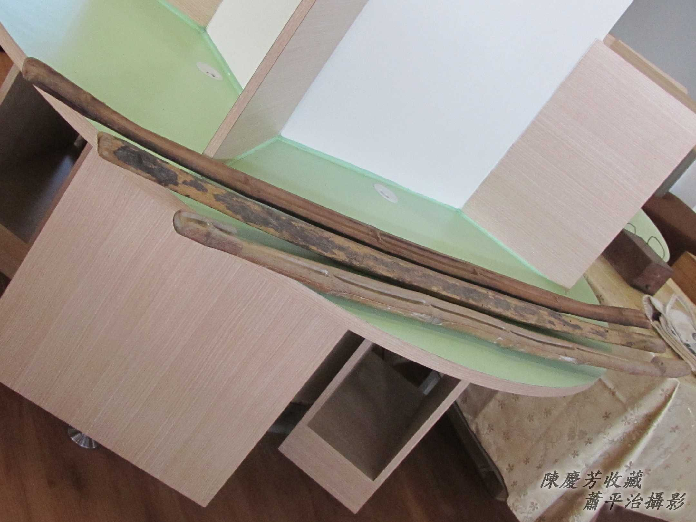
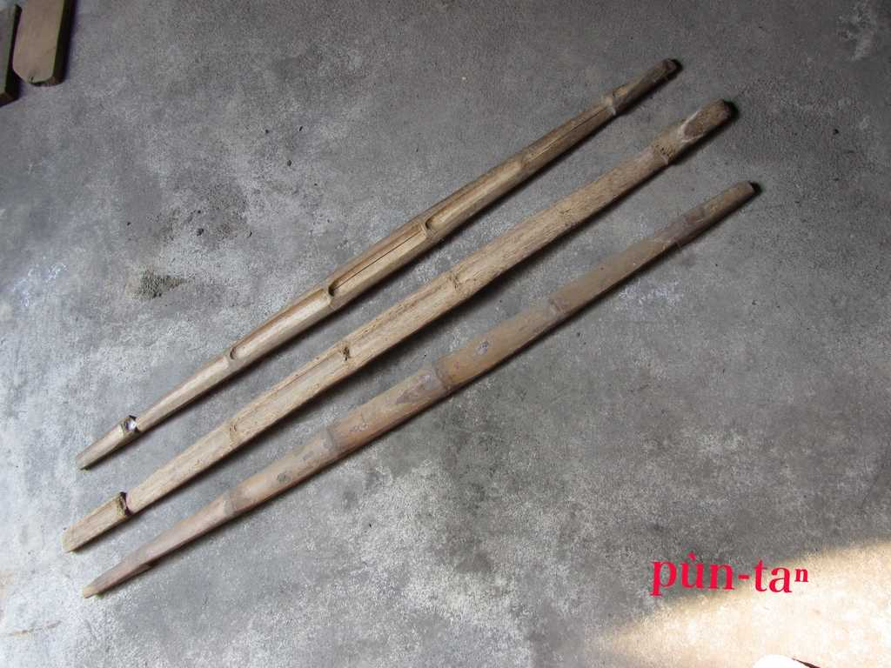

販á生理需要四界搬徙，輕省擔頭設計做箱á擔、鐵馬載，無錢hak鐵馬to̍h用肩胛頭擔。輕擔用平擔，重擔需要曲擔chiah chih載ē-tiâu。扁擔材料，刺竹siāng讚，竹絲（竹纖維）韌koh kāu-náu有彈性，taⁿ--起-來ē-sìm bē斷，mā有用麻竹、柴pêng。

# 2. 賣麵線糊
> **Bē Mī-sòaⁿ-kô͘**

Chit擔擔頭á本身是木材，koh掛玻璃，堅固bē eng-ia koh防胡蠅，實在衛生。Nā boeh taⁿ出門做生理，應該不止á重，tio̍h用khiau-taⁿ（曲擔）來taⁿ chiah接載ē-tiâu。

Che擔頭一頭大，一頭細，大--ê是櫥á，內面khǹg碗、khǹg湯匙，iáu有ám-chhia̍h/sia̍h-á（ám杓á）、豆油矸á、胡椒罐á，頂面是闊闊ná桌頂，方便khǹg人客boeh-ài ê麵線糊；另外一頭看是khah細，面頂khǹg生鍋，下面是烘爐火，生鍋內面to̍h是燒燙燙ê麵線糊。

造型不止á súi，四角形ê木工算真幼路，配六角形擔á面，有門有窗。
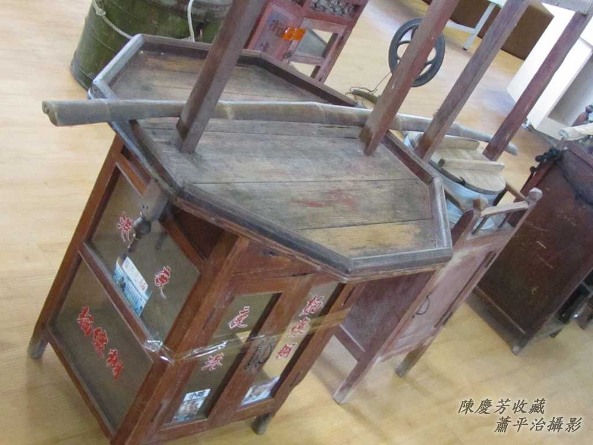

## 2-1. 生鍋
> **Seⁿ-oe**

生鍋不止á大，生鍋蓋因為需要掀起、khàm落，所以比較khah薄，用5塊柴枋kap做夥。
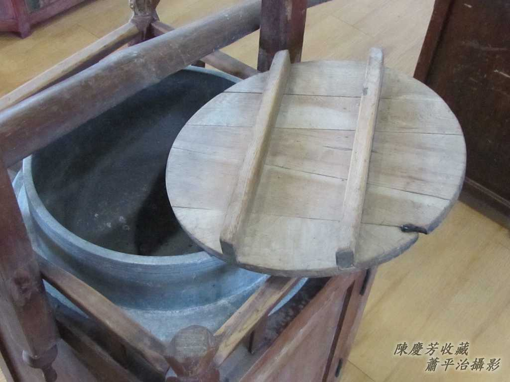
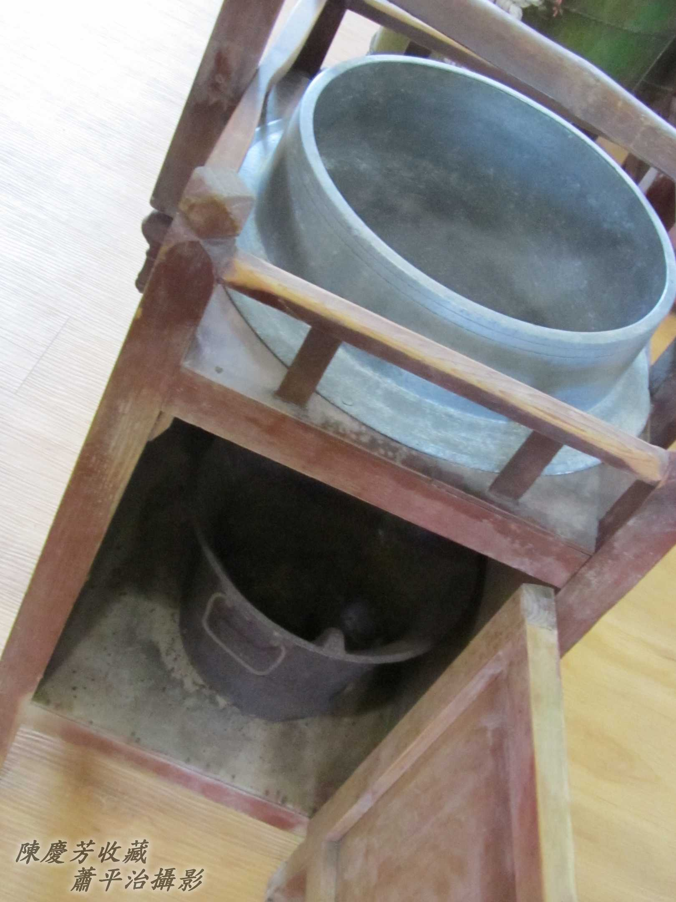

## 2-2. 烘爐火
> **Hang-lô͘-hóe**

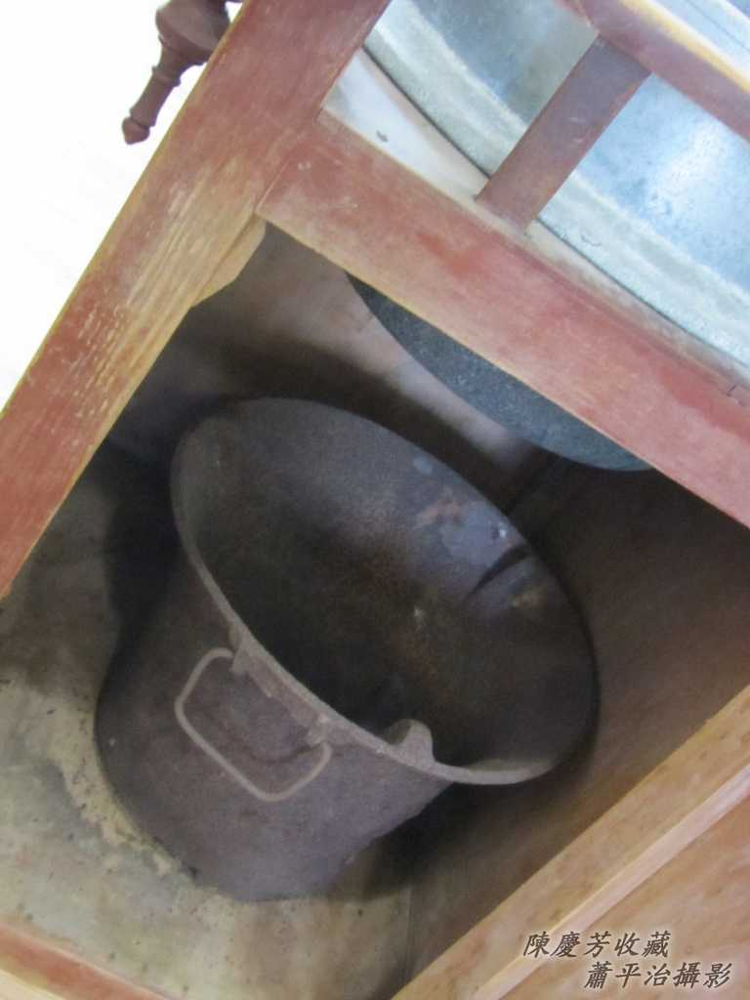

生鍋下面有烘爐，火炭火需要隨時加添，麵線糊有燒chiah ē好食。

## 2-3. 鹿港麵線糊，料chē氣味讚
> **Lo̍k-káng Mī-sòaⁿ-kô͘, Liāu Chē Khì-bī Chán**

掛鎖櫃thoah是khǹg錢所在。
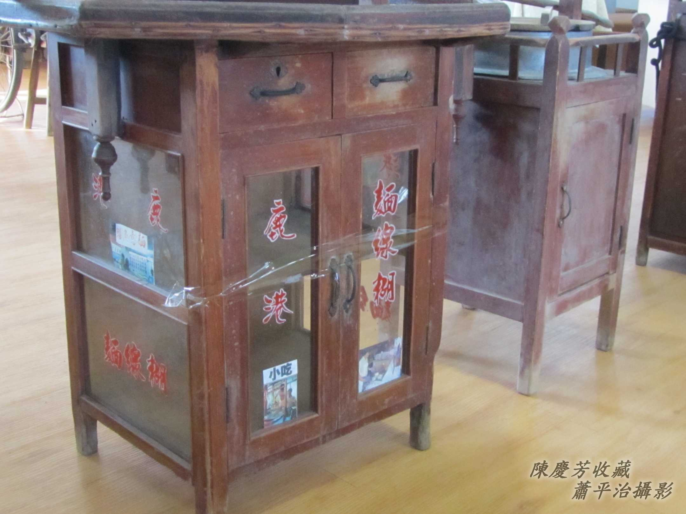
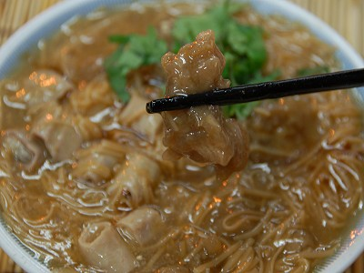

# 3. 賣粿擔
> **Bē-kóe-tàⁿ**

Chit擔siāⁿ籃擔，內面貯粿粽taⁿ leh喝賣，to̍h是賣粿擔。賣碗粿tio̍h準備豆油、碗粿chhiám-á；賣菜頭粿、芋hoâiⁿ粿，tio̍h準備菜刀切粿、秤á秤重；nā是賣紅龜粿、芋梭á，米粽、粞粽，算塊賣算粒賣，直接提hō͘人客to̍h好。篾á pīⁿ ê大kha siāⁿ籃，除了頂面有chân-á，內面mā ē-sái-tit用箄á（pín-á，平面架á）隔做1-iân a̍h是2-iân來排thia̍p。

Gín-á時代隔壁內底福--è to̍h是leh賣碗粿，ta̍k-ke lóng叫伊碗粿福--è，thang kap牽牛車ê牛車福--è、賣杏仁茶ê矮á福做區別，chiah bē叫m̄ tio̍h人。
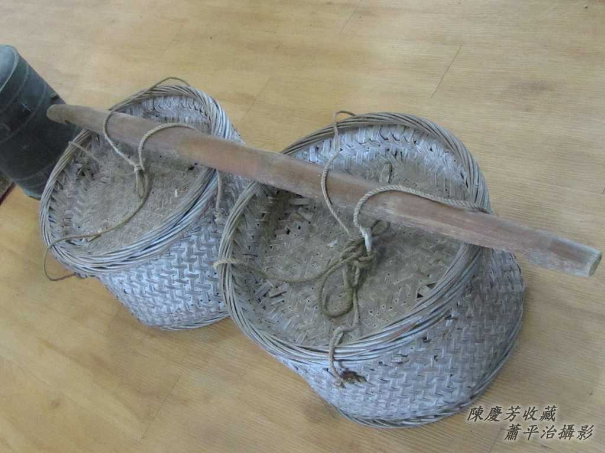

# 4. 杏仁茶擔 
> **Hēng-jîn-tê-tàⁿ**

## 4-1. 茶kap茶米茶無kāng
> **Tê Kap Tê-bí-tê Bô kāng**

茶是ē-lim--tit ê飲料，ē-sái-tit止渴、止嘴ta，mā ē-sái-tit食飽tī-iau。Kan-nā講lim茶，有可能是lim白滾水，mā有可能是lim茶米茶，所以用滾水泡茶米to̍h是茶米茶，泡炒--過ê大麥to̍h是麥á茶，iáu有梅á茶、米á茶、杏仁茶、麵茶、仙草茶、青草茶、冬瓜茶⋯lóng是用水hiâⁿ a̍h是用滾水泡。
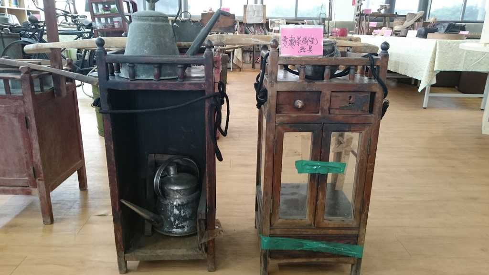

## 4-2. 杏仁茶擔ê往事
> **Hēng-jîn-tê-tàⁿ ê Óng-sū**

這是賣杏仁茶a̍h是麵茶ê擔頭á，1頭khǹg hiâⁿ杏仁茶、麵茶ê家私頭á，1頭排碗頭á、湯匙，kō͘畚擔taⁿ--leh ná行ná喝聲「杏仁茶--ō͘！燒--ê杏仁茶--ō͘！」Nā是賣麵茶to̍h喝「麵茶--lah，boeh買麵茶khah緊來，燒--ê-ō͘！」Nā有人boeh買，to̍h停leh路邊，除了杏仁茶a̍h是麵茶，mā ē kah賣油食粿kap糕á餅饅頭麵包。

阮庄--裡hit ê福á兄to̍h簡單喝「茶--ò͘！」伊ê擔á有賣杏仁茶、麵茶、米奶，油食粿、麵包、饅頭，koh有生雞卵hō͘人泡tiàm杏仁茶內面。

七早八早天iáu未光，福á兄已經tī門口埕外面喝「茶--ò͘！茶--ò͘！」有時阿爸ē叫我起來食杏仁茶配油炸粿，「人都真ài睏--lah。」結果天光chiah leh後悔。

## 4-3. 火爐桶á
> **Hóe-lô͘-tháng-á**

Hiâⁿ杏仁茶、麵茶ê火爐桶á，下面hiâⁿ火炭火，保持燒滾滾ê溫度，有水道頭ê漏á，真方便。
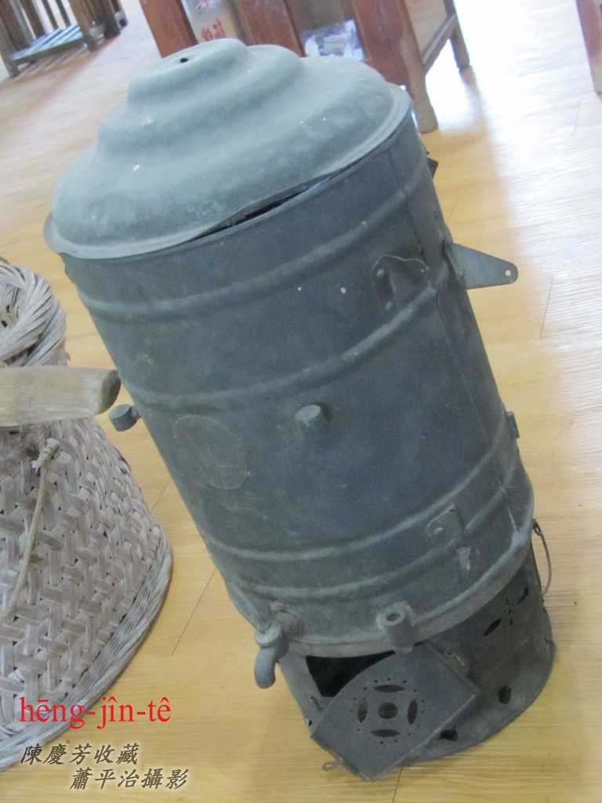

詳細看，內面分2層，ē-pêng層貯杏仁茶，面頂層ē-tàng炊包á、饅頭。
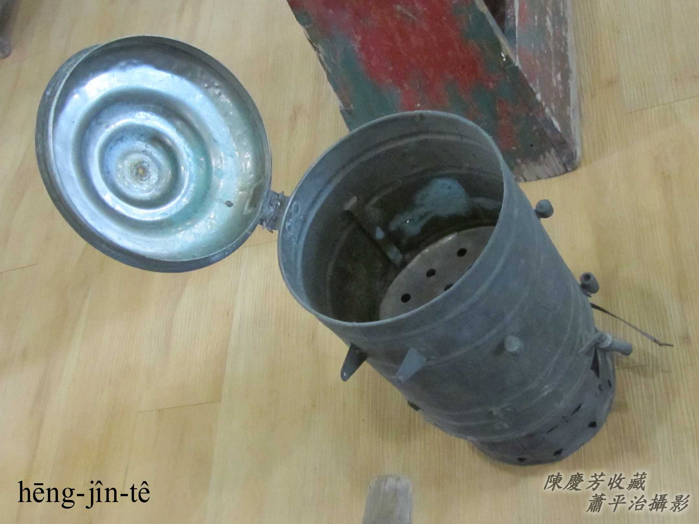

## 4-4. 鉛Phiáⁿ茶鍋
> **Iân-phiáⁿ Tê-oe**

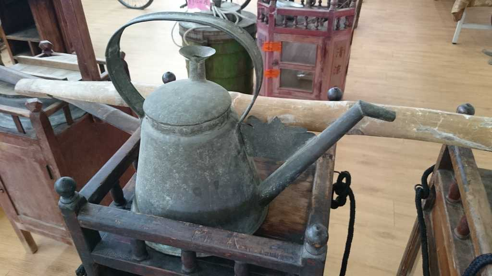  
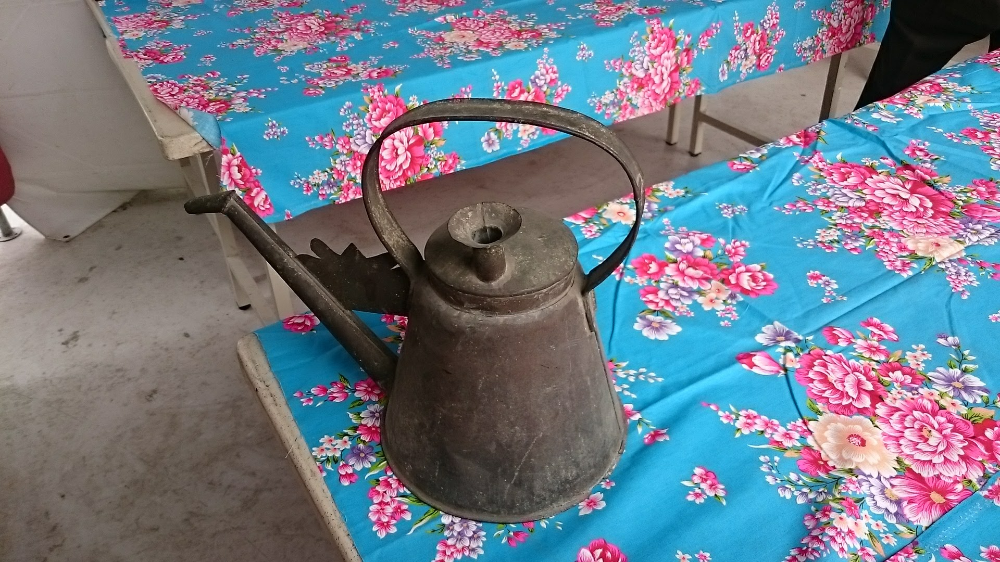

這支特製茶鍋是用鉛phiáⁿ黏--ē，khàm蓋頂面有漏斗，大概是kā料kap水做夥落去hiâⁿ滾hiâⁿ熟，sòa--落chiah ùi罐sui thîn落碗內。

## 4-5. 白鐵á茶鍋
> **Pe̍h-thih-á Tê-oe**

這支是白鐵á hàn-chiap（銲接），作用kap頂面hit支kāng一樣。
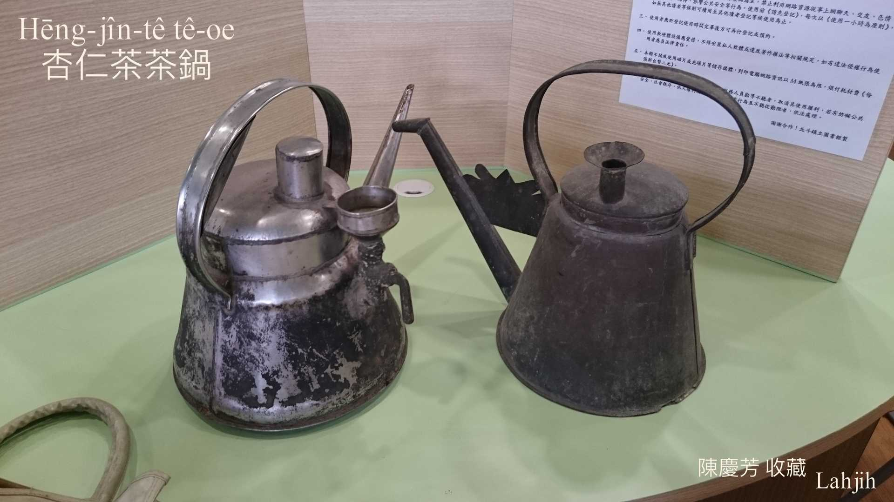

# 5. Chìⁿ粿擔／Khok-á-te擔
> **Chìⁿ-kóe-tàⁿ/Khok-á-te-tàⁿ**

「Khok-á-te，chìⁿ粿--ō͘！Khok-á-te，chìⁿ粿--ō͘！Mā有菜tiâu--lah！Boeh買趕緊來--ō͘！」

Che是賣khok-á-te、chìⁿ粿、菜tiâu ê喝賣聲，一擔擔頭á不止á重，一頭是phû khok-á-te ê油鼎kap火爐，一頭是khǹg已經洗清氣ê蚵á、韭菜，米漿、粿，iáu有豆油、盤á、箸⋯。因為taⁿ leh賣，貨色bē-tàng備辦siuⁿ chē。
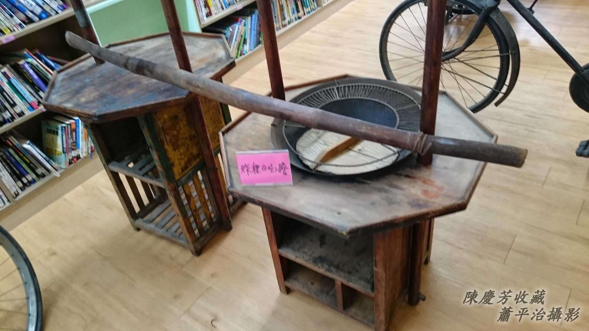

擔頭下面是櫥á，khǹg配料、家私、烘爐火，架á頂平平做桌á用。
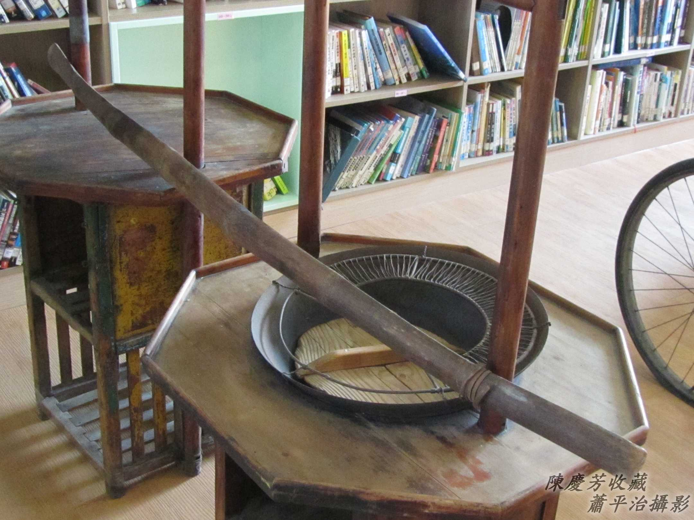
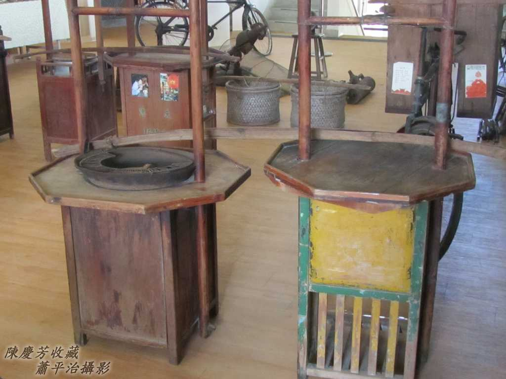

Phû khok-á-te油鼎，鼎邊有鐵線網，khǹg phû熟ê chìⁿ料，hō͘油汁滴落鼎內。
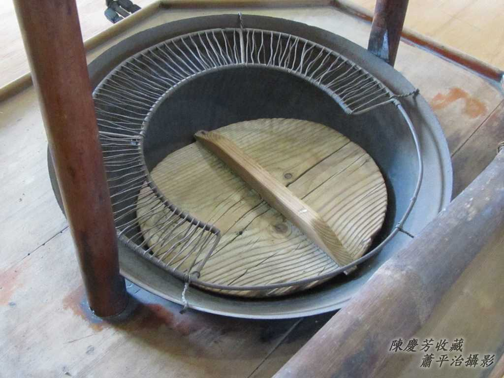

## 5-1. Chìⁿ kap Phû ê精差
> **Chìⁿ kap Phû ê Cheng-chha**

華語『油炸』台語講「chìⁿ」，kā配料（食材）khǹg落油鼎chìⁿ熟chìⁿ酥to̍h是chìⁿ料。韭菜、蒜á ē-sái chìⁿ，番薯、芋á、花á菜mā ē-sái chìⁿ，豆腐、米糕、花枝kāng款ē-sái chìⁿ。

Nā是先kō米漿chiah落油鼎chìⁿ，咱ē特別講做phû，因為配料（食材）落鼎有ê ē沉底，等nā浮chiūⁿ油面，to̍h是已經chìⁿ熟，nā是落鼎to̍h浮面ê配料（食材），有熟無熟，需要用khat-á khat起來看。M̄-chiah有人講phû khok-á-te、phû chìⁿ粿，chìⁿ菜條、chìⁿ豆乾chìⁿ。浮肉圓、chìⁿ肉圓（bah-oân）mā是kāng款理路。

## 5-2. Chìⁿ粿擔teh賣ê點心
> **Chìⁿ-kóe-tàⁿ teh bē ê Tiám-sim**

賣khok-á-te、chìⁿ粿ê擔頭á，當然mā ē-tàng phû菜tiâu，chìⁿ番薯phiáⁿ、芋á phiáⁿ，phû豆干chìⁿ，chìⁿ蒜á⋯。

Khok-á-te、chìⁿ粿、菜tiâu、米糕chìⁿ、豆干chìⁿ、番薯phiáⁿ、芋á-phiáⁿ。Khok-á-te內āⁿ有蚵á，講做蚵te，chit-má有人用瘦肉代替蚵á，叫做肉te。

Khok-á-te、chìⁿ粿lóng是油鼎熱油chìⁿ料，簡單ùn豆油膏to̍h真好食，thang食點心mā ē-tàng做正頓，食飽koh食khá。除了khok-á-te、chìⁿ-kóe，韭菜、蒜á、番薯、芋á、豆腐、米糕、花á菜‥‥‥，lóng ē-sái-tit chìⁿ來ka-tī食chìⁿ來賣。

食chìⁿ料tio̍h趁燒食，酥、phàⁿ好滋味，ùn豆油膏siāng合味。Nā是冷--去chiah koh chìⁿ燒，to̍h ē tēng-tēng無好食。Chit-má boeh食khok-á-te、菜條、chìⁿ粿、chìⁿ米糕，tio̍h去店頭、路邊擔á買。

### 【名詞說明】

教育部詞典：
- 『蚵炱，一種油炸小吃，先將豆芽菜、韭菜舖在鮮蠔上，再摻上一層米漿，下鍋炸成圓扁形。』
- Phû，『油炸，特別指食材會浮在油鍋上。』

Kú-chhài-in（韭菜in），chìⁿ菜條，先kā韭菜pa̍k像草in，chiah ùn米漿落鼎chìⁿ。
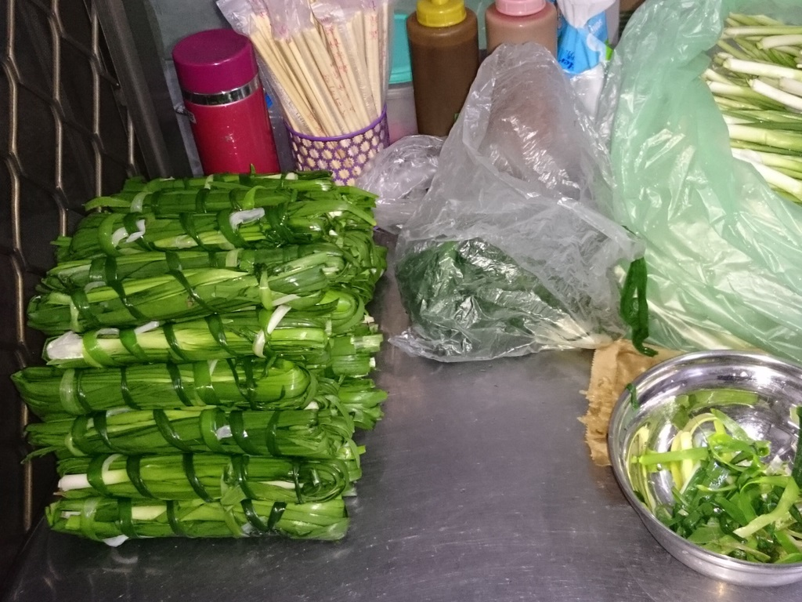
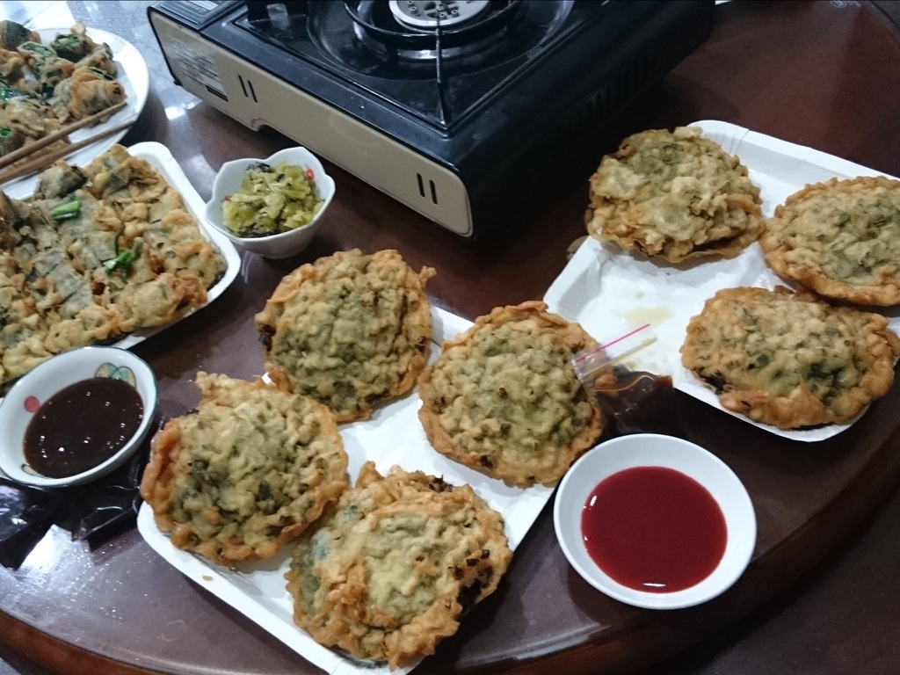
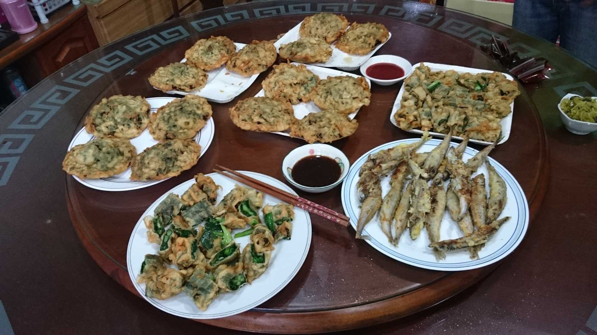

# 6. 註解
> **Chù-kái**

|**詞**|**解說**|
|kāu-náu|形容物件ê質地『厚實』。|
|kō米漿|『沾、蘸』；米漿，bí-chiuⁿ，『用米磨製並加入花生粉而調成的汁液』。|
|khok-á-te|『一種油炸小吃，先將豆芽菜、韭菜舖在鮮蠔上，再摻上一層米漿，下鍋炸成圓扁形』。|
|鉛phiáⁿ|『鐵皮』。|
|罐sui|細支茶鼓a̍h是水壺ê嘴。|
|pīⁿ|『編織』。|
