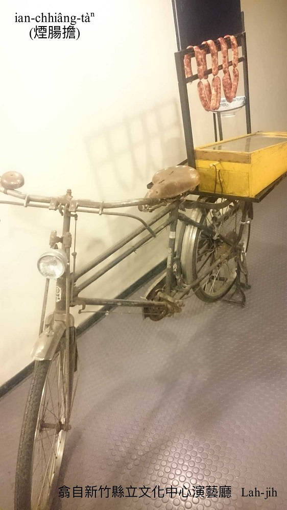
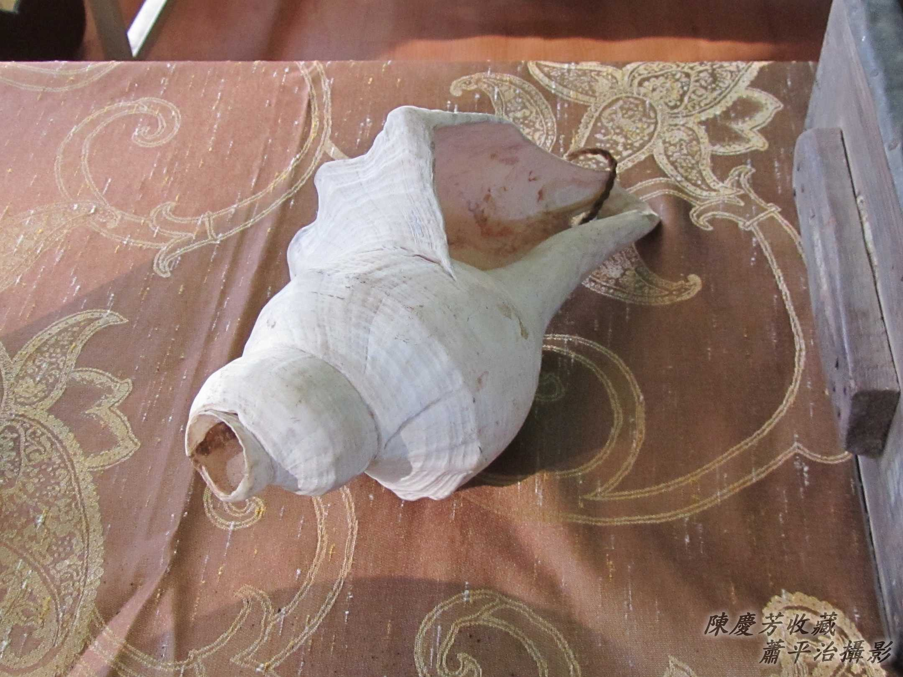
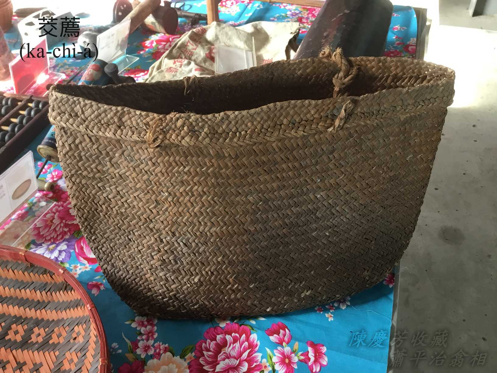
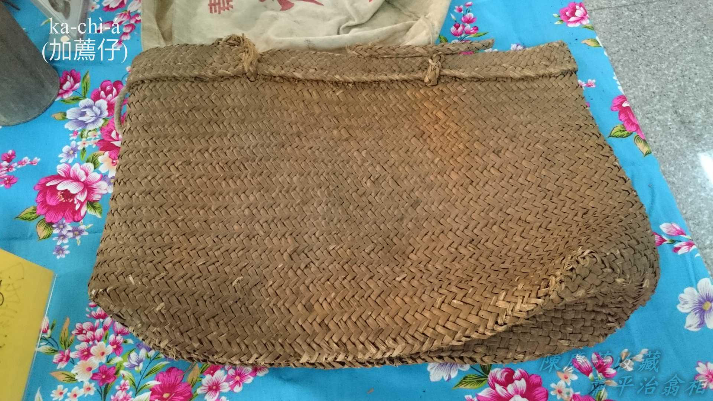
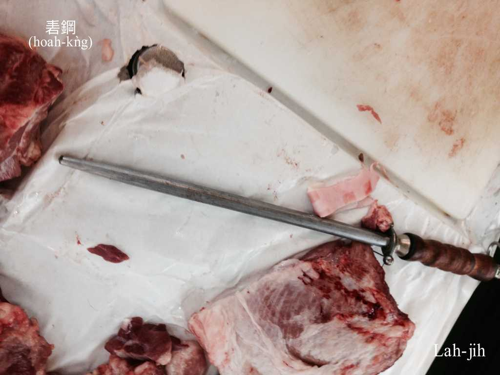
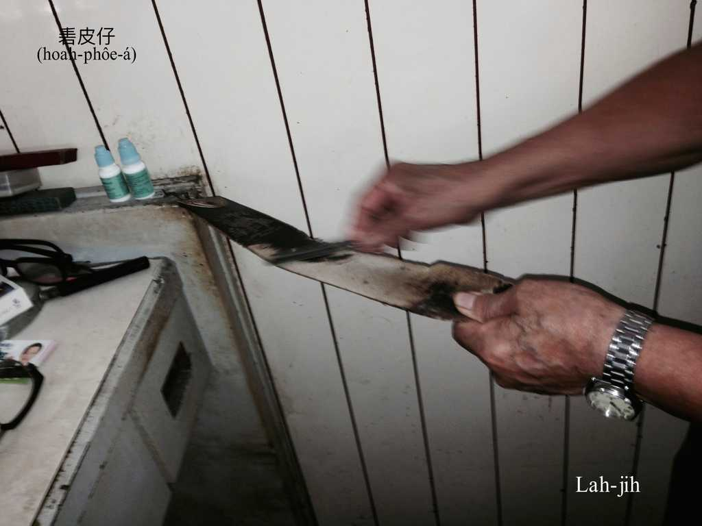
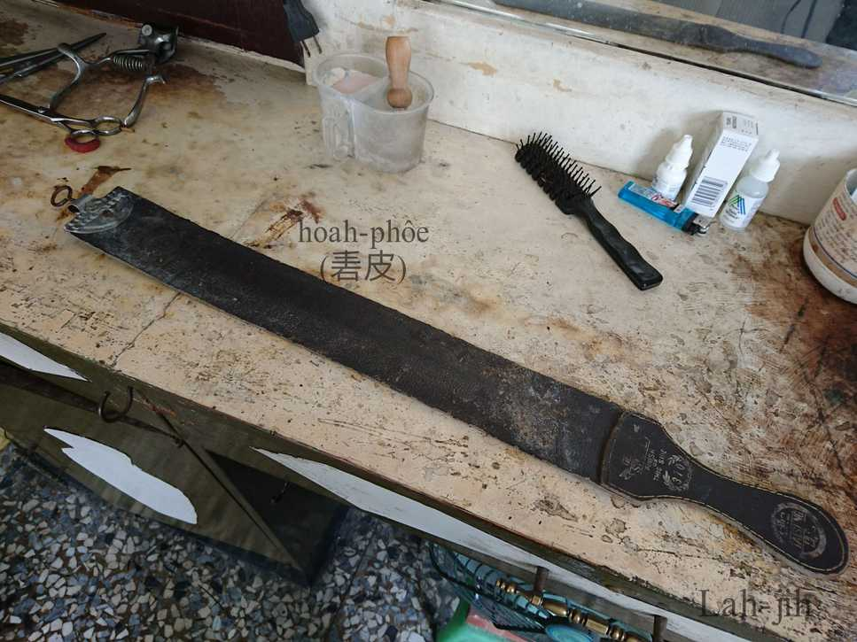
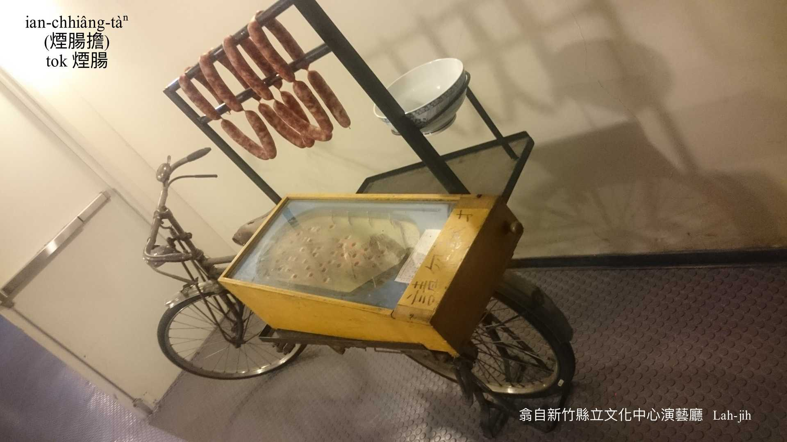
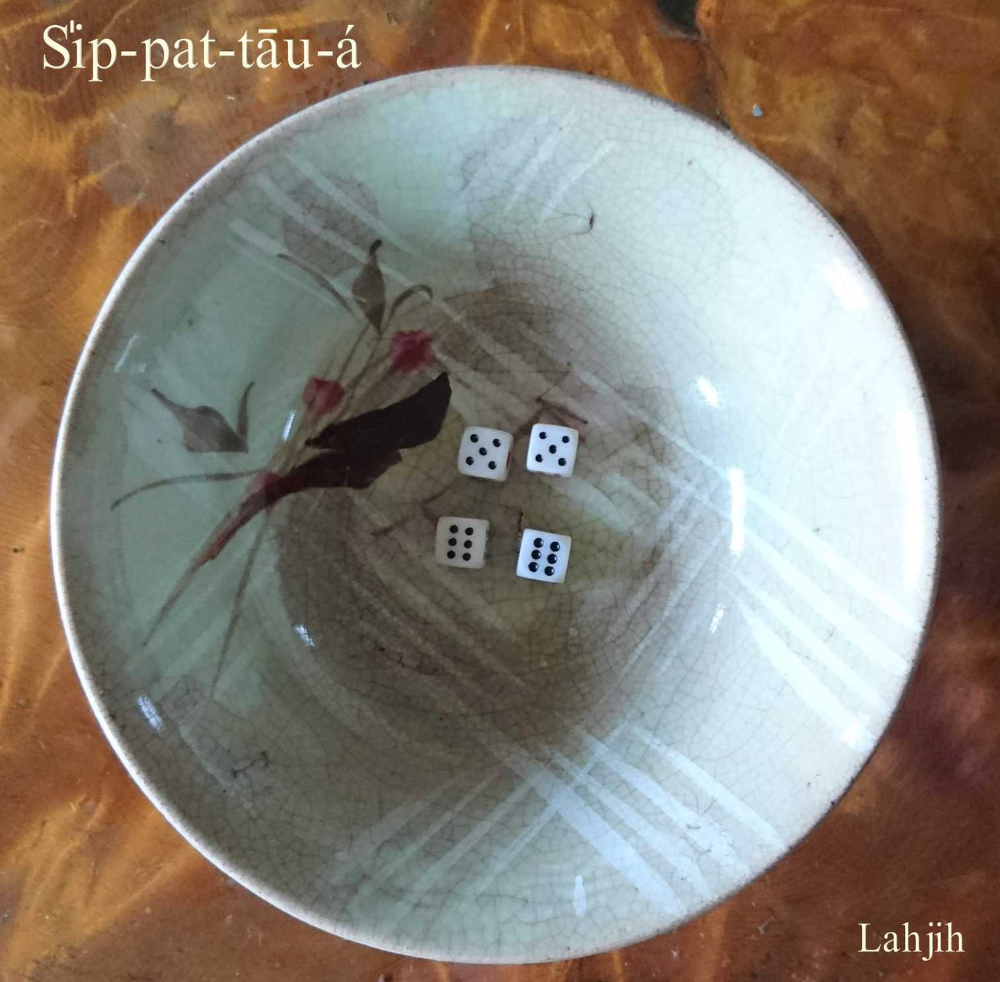

# 賣豬肉--ê kap煙腸擔
> **Bē Ti-bah--ê kap Ian-chhiâng-tàⁿ**

# 1. 賣豬肉--ê
> **Bē Ti-bah--ê**

古早庄腳人，除了過年過節，街路市場是罕得踏腳到，平常時想boeh買豬肉魚臊，to̍h-ài thèng-hāu魚販á、豬肉販á來到庄--裡。

我bat看--過-ê，he賣豬肉--ê騎一台鐵馬，後載安一塊柴枋，面頂khǹg豬肉、豬刀、tok砧、秤、hoah鋼kap一粒大粒螺á殼。另外馬角á兩pêng面掛2-kha ka-chì-á，內面khǹg無kāng部位ê豬肉，chô-kho͘（槽kho͘）、phiaⁿ-liâu、āu-chē、kha-khò͘（腳褲）、豬腳kap腹內、hā-súi（下水）⋯，人客kah意tó位to̍h剁tó位，人客boeh-ài 1斤to̍h liô 1斤，nā有人客交帶剁--2-斤-à，án-ne ke kā剁--3-4兩-à應該無要緊，生理人目色巧，m̄-nā好頭嘴，koh ē了解人客個性，án-ne chiah有才調趁人ê銀兩。

## 1-1. Pu螺
> **Pu-lê**

是大粒海螺殼，外形sêng鼓吹，用嘴pûn ē發出pu pu pu pu ê螺聲，近位á ê人聽--tio̍h to̍h知影賣豬肉ê生理人來--ā。
## 1-2. Hoah鋼
> **Hoah-kǹg**

Hoah鋼是賣豬肉--ê ê專門家私，豬肉砧豬肉刀幾nā種，有chām--ê、有tok--ê、有chhiat--ê、有liô--ê、有khau--ê，mā有一支鋼材所做ná尖鑽形ê hoah鋼，豬刀nā無夠利無夠好用，to̍h ē tiàm hoah鋼koeh-koeh hoah-hoah--leh繼續使用。請教賣豬肉ê頭家，chit-ê「hoah」ê動作有siáⁿ-mih作用，頭家講：「主要是kā kiap tī刀嘴ê肉幼á油汁koeh掉，án-ne ē khah好切。」Kám有磨利ê路用？

「有，chē少--lah！」

## 1-3. 茭薦á
> **Ka-chì-á**

鹹草pīⁿ--ê，早期庄腳人賣物kōaⁿ物siāng方便好用ê kōaⁿ袋á。

## 【Lah-jih散文書寫】Hoah鋼kap Hoah皮á
> **【Lah-jih Sòaⁿ-bûn Su-siá】Hoah-kǹg kap Hoah-phôe-á**
     

台語人日常生活語言kap「hoah」有關連ê語詞，大約有hoah聲、hoah咻、hoah救人、hoah bē聽、hoah lin-long、hoah起hoah倒…，chia-ê 「hoah」 to̍h是漢字「喝」ê意思。除了「喝」kám iáu有別ê字別ê意思？Hoah鋼kap hoah皮á，到底是siáⁿ-mih物件siáⁿ-mih意思？Kan-nā看標題可能大部份人lóng m̄-bat，可能hām聽to m̄-bat聽--過。Nā是去請教賣豬肉--ê kap剃頭店ê師傅，mā有可能bē-tàng問出有一支柄thang好giâ/gia̍h。想起細漢時，厝內菜刀、柴刀nā tun無夠利，阿爸阿兄to̍h ē phâng面桶水，搬刀石á出來磨，ná磨ná戽水，雙pêng磨，刀肉磨金金，刀嘴磨利利，koh tio̍h sè-jī用手用指頭á尾輕輕á摸刀嘴，摸看有缺嘴liah角liah-chhoaⁿ--bò͘。Nā是tn̄g-tio̍h tng-leh使用時，to̍h ē tiàm灶邊瓷á醃缸嘴墘hoah-hoah--leh繼續使用，原來chit-ê chhìn-chhái koeh-koeh--leh ê動作to̍h號做「hoah」，kap「喝」bô-tī-tāi。

翻頭來講siáⁿ-mih是hoah鋼，siáⁿ-mih是hoah皮á？Hoah鋼是賣豬肉--ê ê專門家私，豬肉砧豬肉刀幾nā種，有tok--ê、有chhiat--ê、有liô--ê、有khau--ê，mā有一支鋼材所做ná尖鑽形ê hoah鋼，豬刀nā無夠利無夠好用，to̍h ē tiàm hoah鋼koeh-koeh hoah-hoah--leh繼續使用，請教賣豬肉ê頭家，chit-ê「hoah」ê動作有siáⁿ-mih作用，頭家講：「主要是kā kiap tī刀嘴ê肉幼á油汁koeh掉，án-ne ē khah好切。」Kám有磨利ê路用？「有，chē少--lah！」

剃頭店理髮，師傅ē用鉸刀配合loa̍h-á鉸頭毛，koh ē用lu-á lu毛腳鬢邊，nā是修面a̍h是cháⁿ鬢角、修嘴鬚to̍h需要剃頭刀，剃頭刀利劍劍，師傅ê功夫tī chia，chi̍t-ē無斟酌to̍h ē傷tio̍h人客ê皮肉，剃頭刀siuⁿ tun剃tio̍h ē疼，所以剃頭刀不時tio̍h磨利利，nā是tn̄g-tio̍h剃bē順手，to̍h tiàm掛tī壁邊hit條ná皮帶ê皮á hoah-hoah koeh-koeh--leh，hit條闊闊té-tauh té-tauh ê皮á to̍h叫做hoah皮á，作用kap hoah鋼差無gōa chē，主要是leh koeh黏tī剃頭刀刀肉ê油垢毛幼á，「kám有磨利ê路用？」師傅ê回答mā是「有，chē少--lah！」

Chit字「hoah」教育部ê資料是：『砉，刀子不沾水，乾磨數下，使其更為鋒利。』

——Lah-jih_20140726

# 2. 煙腸擔
> **Ian-chhiâng Tàⁿ**

Chit種流動煙腸擔，m̄是單純賣煙腸，附帶有poa̍h-kiáu性質，增加趣味帶動生理。

看配備家私，nā用珠á台sńg，號做phah煙腸；nā用碗公si̍p-pat-tāu-á，號做poa̍h煙腸；若用lián-pôaⁿ tok，號做tok煙腸。

Chit擔有珠á台、碗公si̍p-pat-tāu-á，ē-sái-tit隨在人客選。

Si̍p-pat-tāu-á簡單講si̍p-pat-á，有人講la̍k-kâu，是chi̍t種poa̍h-kiáu『骰子』，有四粒tāu-á，khǹg tī碗公來me，比點數輸贏。

# 3. 註解
> **Chù-kái**

|**詞**|**解說**|
|ka-chì-á|一種用鹹草pīⁿ ê kōaⁿ袋。|
|phiaⁿ-liâu|『里肌肉』。|
|pīⁿ|『編織』。|
|té-tauh|短短koh tēng-tauh tēng-tauh，『短且結實』。|