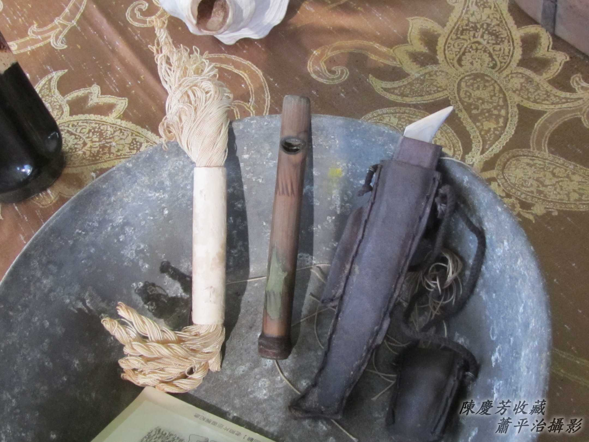
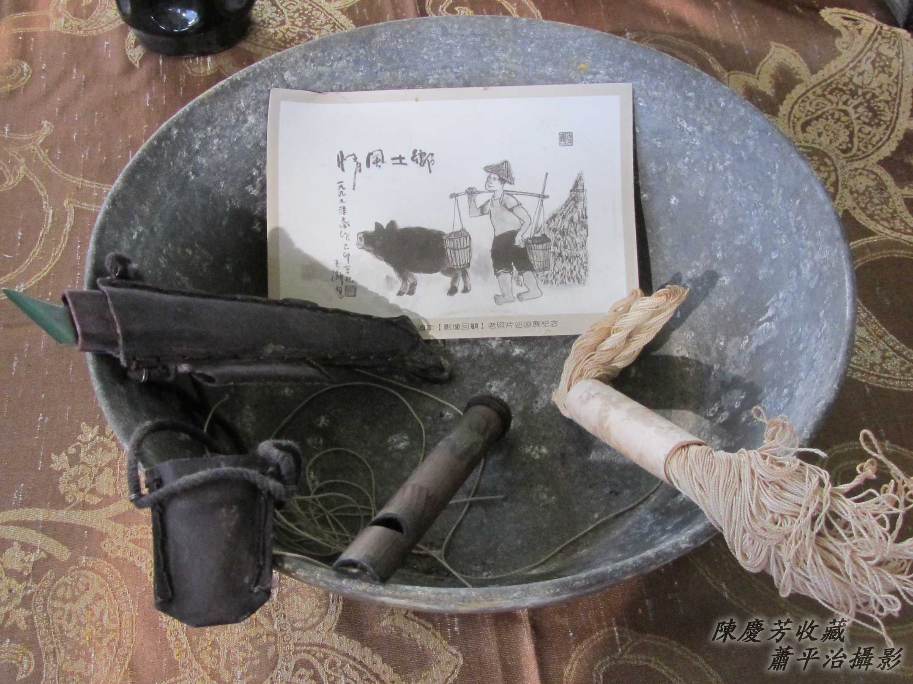

# 閹豬
> **Iam-ti**

對人來講，「閹」tī古早時代是kā cha-po͘人ê lān-hu̍t-á提掉，甚至kā lān鳥á割斷，hō͘伊bē作怪。現代ê閹，是為tio̍h節育無ài koh生kiáⁿ，to̍h kā cha-po͘人ê su-cheng-kńg（輸精管）a̍h是cha-bó͘人ê su-nn̄g-kńg（輸卵管）pa̍k--起-來，簡單講「pa̍k掉」。

Nā是對動物來講，「閹」是kā公--ê ê lān核a̍h是母--ê ê生腸割掉，目的是為tio̍h好飼、gâu大隻，因為閹--過ê動物bē發情，公--ê bē-chhio，母--ê bē-siáu，所以無「性」問題，戇戇á食戇戇á肥，符合飼豬ê經濟效益。

阮團圍公派下ê清豹兄是閹豬--ê，gin-á時代bat看過伊leh閹豬，記智siāng深是hit支短短ê竹á khiā品，kan-nā有3-khang，孤手chhi̍h khang pûn出「323 212 132 212」 koân音響亮ê品á聲；iáu有hit支chiâⁿ利ê閹豬刀á，有ê大人ē chhun 2支指頭á比鉸刀形háⁿ gín-á講「Nā無乖to̍h⋯khah-chhah⋯」，he thǹg褲lān ê cha-po͘ gín-á sûi-ê走了了；iáu有hit甌烏chap-chap、sió-khóa油油ê m̄知siáⁿ-mih碗糕ê物件，到今mā iáu記tiâu-tiâu（ē記得是火thûn-lo͘攪麻油，做消毒退hông）。

# 1. 閹豬紹介
> **Iam-ti Siāu-kài**

Chit口銅鼎á m̄知siáⁿ-mih路用？Ná像用來洗手洗豬腹肚？

## 1-1. Pûn品á
> **Pûn Phín-á**

三khang khiā品，一手to̍h ē-sái-tit pûn 「323 212 132 212」簡單旋律，聲音幼jī、koân音koh響亮，聽tio̍h聲to̍h知影閹豬--ê來--ā。

## 1-2. 閹豬過程
> **Iam-ti Kòe-têng**

閹豬刀利劍劍，尖尾，ē-sái ui、ē-sái liô、ē-sái割，公--e lān核á tī外面，閹--起-來khah簡單，nā是母--ê to̍h需要ùi生腸位置，先kā外皮割開，chiah kā腹肚內ê生腸jîm出來割掉，sòa--落用細條棉索pa̍k ân，khang嘴kō͘ chhiau麻油烏chap-chap ê火thûn-lo͘糊糊--leh to̍h算完成閹豬手術。

## 1-3. 閹豬人ê禁忌
> **Iam-ti-lâng ê Kìm-khī**

閹豬刀利劍劍，有掛皮質to-siò（刀鞘），刀鞘有蓋，he是賺食碗á（趁食家私），無容允hō͘人烏白sńg，koh-khah bē-sái-tit phah-ka-la̍uh、phah缺角--去。

## 1-4. 各所在有精差
> **Kok Só͘-chai ū Cheng-chha**

林振福先生：阮聽--tio̍h-ê，閹豬--ê，所pûn ê曲調是「123-，321-，23-23-1-尻穿chiⁿ破布」。

林振福先生：阮所看--tio̍h-ê是閹豬母。用剃頭刀kā腹肚邊ê毛khau-khau--leh，了後用刀á lak 1-khang chiâⁿ lia̍h長，sòa--落用手伸入去kā生腸jîm--出-來，用幼索á pa̍k--起-來，然後koh ka入倒轉--去，外口khang嘴用針線thīⁿ--起-來，siāng尾用烏煙thûn／藥膏kā khang嘴糊糊--leh準soah。

## 【Lah-jih散文書寫】閹豬--ê當做lia̍h龍--ê
> **【Lah-jih Sòaⁿ-bûn Su-siá】Iam-ti--ê Tòng-chò Lia̍h-lêng--ê**

——早期寫ê笑詼。

1-ê好額人cha-bó͘少奶奶，好命欠運動，時常ài lia̍h龍，骨頭chiah ē輕鬆。

有一工boeh暗á，聽見lia̍h龍ê品á聲，to̍h叫人去叫lia̍h龍--ê入來到客廳，伊to̍h大大pān-pān覆tiàm大pang椅（長條椅á），吩咐lia̍h龍--ê ：Taⁿ你ē-sái-chit開始lia̍h。

「安人！你kám無棄嫌，我taⁿ tih-beh開始！」Chit位太太，chit位夫人，koh食kah肥chih-chih，是m̄是無ài生--a，ná ē叫我chit-ê閹豬--ê？
Mài lo-so，做你kā liô（lia̍h）--落-去。

「安人！麻煩你，kám ē-sái-chit先kā衫á褲liù--起-來？」
Ná ē chiah-nī不死鬼，lia̍h龍ná有leh thǹg衫褲，nā chiah無規矩，叫人kā你戽戽--出-去。

「誤會--ò͘，冤枉！我是閹豬--ê，chit-mái beh kā你閹，ah你衫褲穿好好，叫我beh án-chóaⁿ手術？」

Siáⁿ？你是閹豬--ê，ná ē chiah-nī無sè-jī，kan-nā聽tio̍h ti-ta-ti，to̍h kioh是lia̍h龍--ê來到chit，「Pháiⁿ勢--lah！」少奶奶chi̍t-ê面á紅kì-kì。

 「閹豬--ê當做lia̍h龍--ê。」有夠笑詼，有夠古錐，平平品á聲，一個do、le、mi，一個mi、le、do，無kāng館（款）一定無kāng師傅，kám m̄是？ 

# 2. 註解
> **Chù-kái**

|**詞**|**解說**|
|生腸|Seⁿ-tn̂g/Siⁿ-tn̂g，『指動物的子宮及卵巢』。|
|khiā品|『直笛』。|
|消毒退hông|『消炎、消腫』。|
