# 賣火油
> **Bē Hóe-iû**

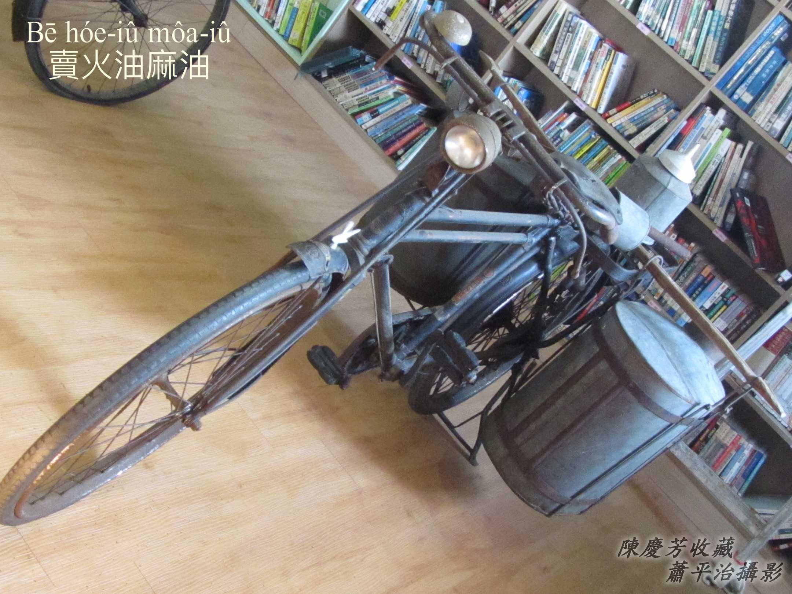

古早人三頓煮食，有魚有肉算是chheⁿ-chhau，nā是無油無sian確實苦憐，灶頭油tâng-á nā無油，真正考倒煮食師傅。Ē記得細漢時，阿爸nā去街路買物買豬肉，三層m̄買買油phiáⁿ，目的是boeh chòaⁿ油，thèng-hó三頓煮菜有thang khiàn芳，油tâng-á nā tīⁿ-tīⁿ，阿嫂煮菜to̍h免煩惱。

Tī田中國民學校補習hit冬，阿爸定定提10-kho͘叫我去Ám--ê kám-á-tiàm搭火油，這是我siāng kah意ê福利，搭一罐（15兩）9-kho͘-8，我ē-tàng趁2角，有夠好khang。

每擺買火油轉去，to̍h kā阿爸討hit 2角銀，阿爸lóng講「好」，後--來，Ám--ê找我2角，to̍h sūn-sòa買蠶豆來食，等轉去kā阿爸討hit 2角銀，等阿爸講「好」了後，chiah kā阿爸老實講「我已經買物食--ā！」阿爸lóng笑笑kā我罵「你chit個gín-á--leh！」

【註】火油to̍h是土豆油。

# 1. 鐵馬火油擔
> **Thih-bé Hóe-iû-tàⁿ**

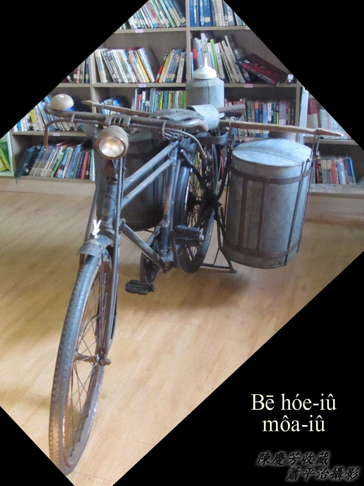

1台雙台鐵馬，後載kah 1支棍á a̍h是pùn擔，雙pêng掛2-kha鉛phiáⁿ做ê油桶，koh chah幾項家私，「賣油--ê來--ā-ō͘！火油--ō͘！Boeh tah火油趕緊來，mā有麻油--ō͘！」

賣火油kō͘鐵馬載，算是方便輕鬆，不過騎鐵馬技術需要láu-tâu，油桶內面ê油ē choat來choat去，he鐵馬角á nā hōaⁿ無在是ē péng擔。無鐵馬a̍h是bē-hiáu騎鐵馬，只好kō͘ taⁿ--ê，taⁿ出門1擔tāng-khôaiⁿ-khôaiⁿ，taⁿ入門to̍h真輕鬆，擔nā輕，銀兩to̍h chē，一家大細生活to̍h無問題，走街生理，賣火油--ê雙手油lop-lop有，講boeh油sé-sé，免siàu想。

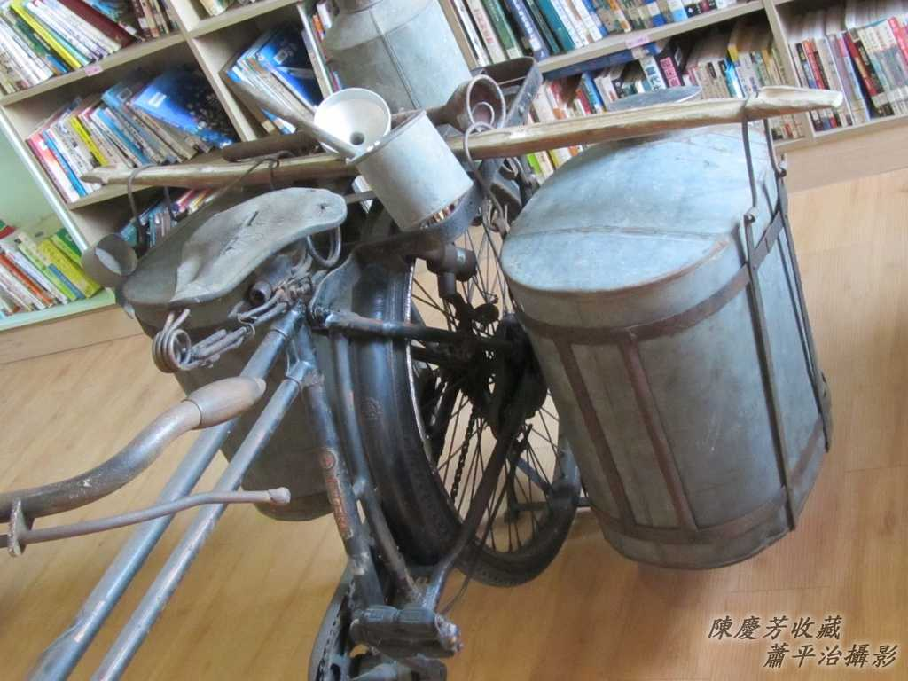

貯油ê油桶，搭油ê油抽á，khat油ê油khat-á，油漏á，lóng是鉛phiáⁿ做--ê，liâm-siah-á（黏錫á）liâm--ē，hit-chūn無塑膠無su-tián-lè-suh。
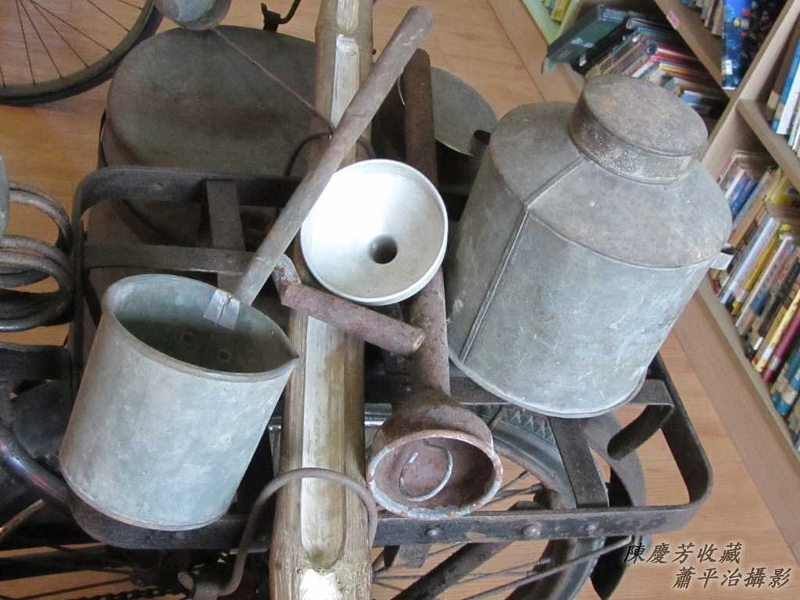

## 1-1. 油抽
> **Iû-thiu**

油抽是tah-iû（搭油）家私，油抽long入油桶，kā ná罐sui ê油抽嘴long入水晶罐á嘴，抽動內面hit支鉛線，因為空氣壓力『虹吸作用』，to̍h ē kā油流入罐á內，叫做搭油。Mā用來搭酒。

油抽有大細支，taⁿ油販á做小賣用細支油抽，ē-tàng搭油入酒矸á方便to̍h好，he油抽管下pêng內面有裝活舌控制油ê出入，抽ê時陣，活舌ē hō͘液體進入，chhi̍h ê時ē阻止液體倒流；另外油抽ê抽線（鉛線）下面有黏1-ê親像khì-kng（汽缸）ê管á，管á大細tú好ē-tàng bā-bā tī油抽管內活動，hit ê管á下面是管底，頂面有裝1-kâi活舌，chhi̍h--落時，活舌自動掀開hō͘下面ê液體進入頂面，抽ê時陣，活舌自動that倚--來，配合油抽下面ê活舌自動放開hō͘液體進入，án-ne 1-chhi̍h 1抽，液體自然ùi油抽嘴流入漏斗，進入罐á內。總講一句，kap『唧筒』原理相kāng。

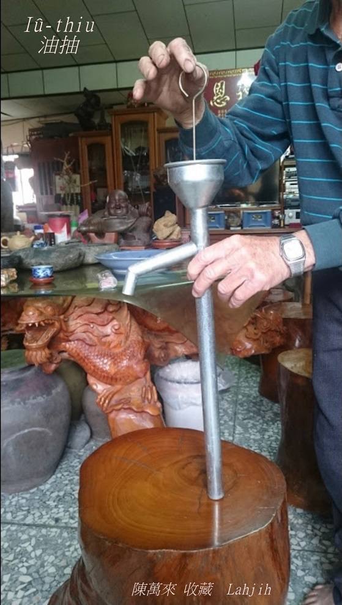
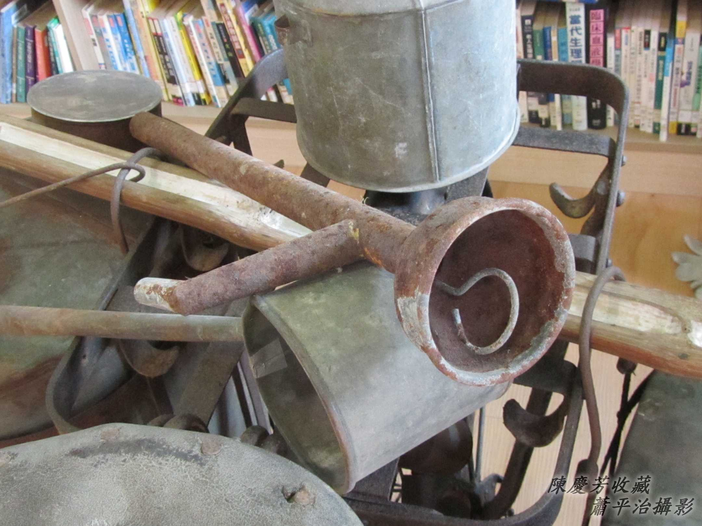

## 1-2. 活舌
> **Oa̍h-chi̍h**

Mā有講做ia̍p-á，to̍h是『活塞』，油抽抽油、搭酒，to̍h是利用chit兩位活舌ê設計，chiah ē-tàng kā油桶液體抽--出-來。
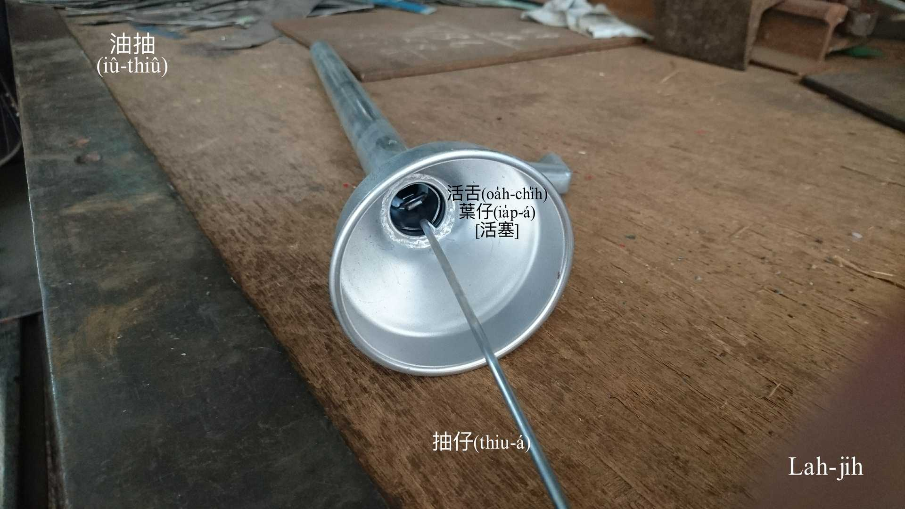

## 1-3. 油兩á
> **Iû-niú-á**

油兩á是搭火油、搭番á油、搭酒ê家私，ē-tàng訂做1兩、2兩、3兩、4兩無kāng容量，人客搭油ê時，看罐á大細，ē-sái-tit 1兩1兩khat，2兩2兩khat，a̍h是3兩4兩khat，一罐油nā是1斤重，kō͘ 2兩ê油兩á khat 5-pái to̍h差不多夠額，無夠chiah koh相添，利便搭油。油兩á khat油落去油罐á，需要油漏á（漏斗）配合，boeh kā油兩á內ê液體倒入罐á內需要真功夫。
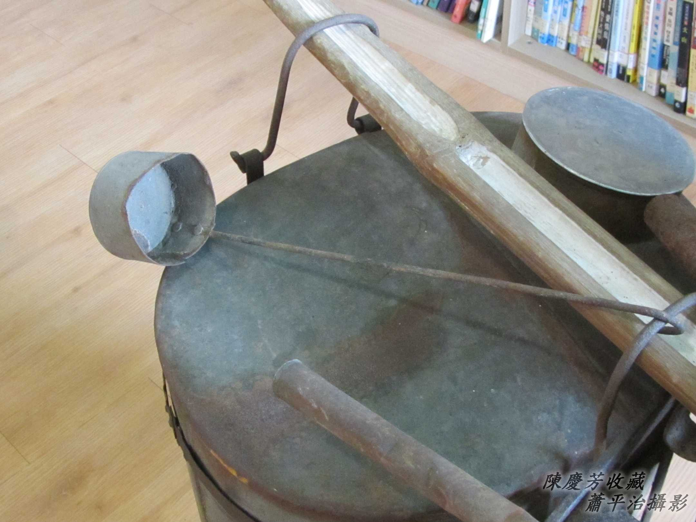
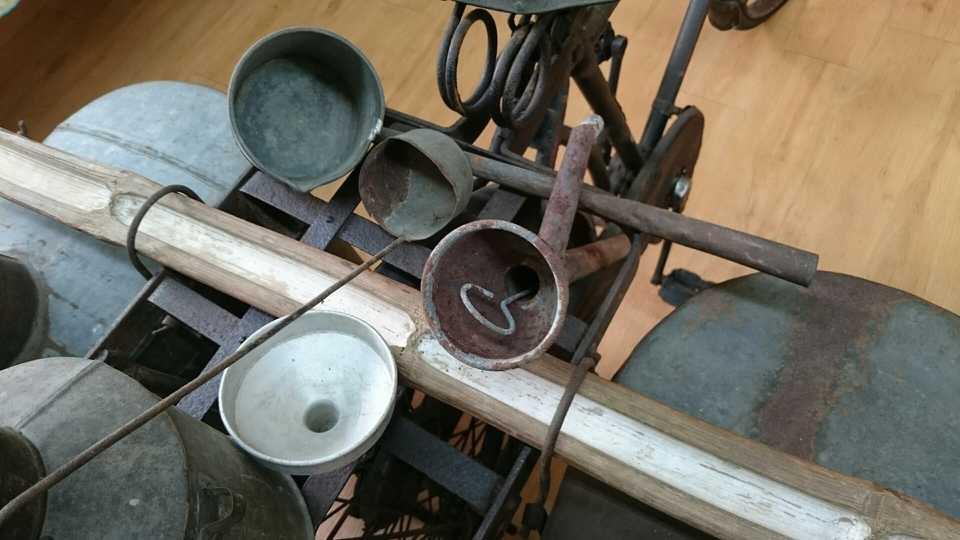

用途無kāng，khat油用具有大細，有大支、細支khat-á，有油抽、油兩á，有油漏á。

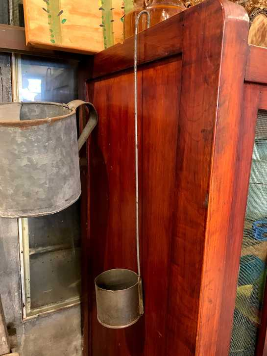
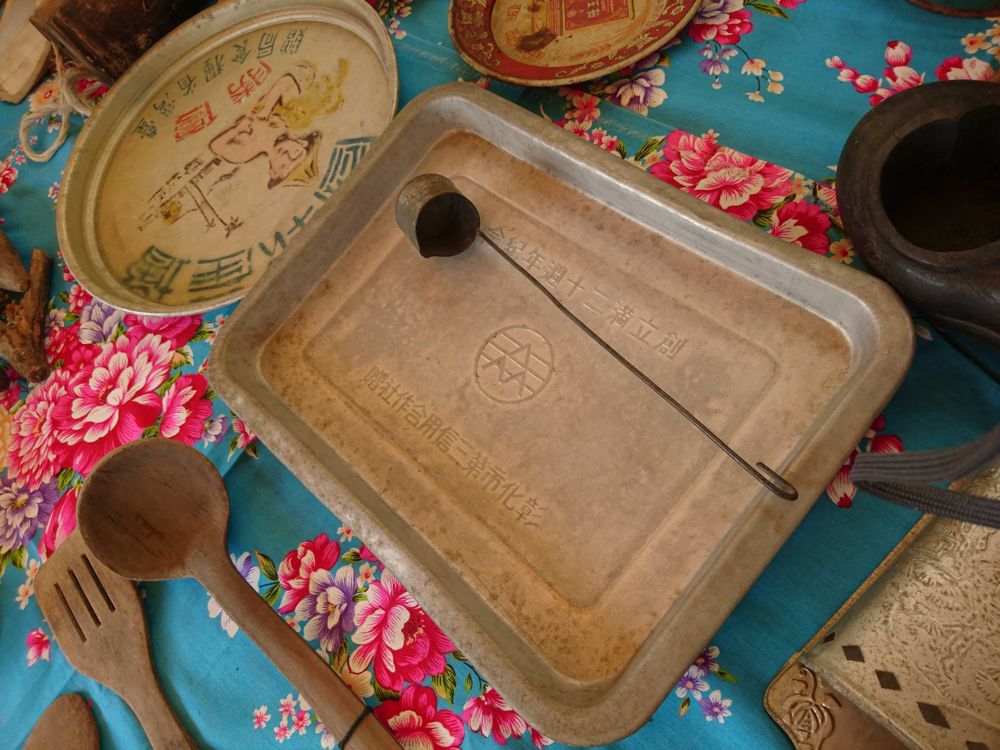
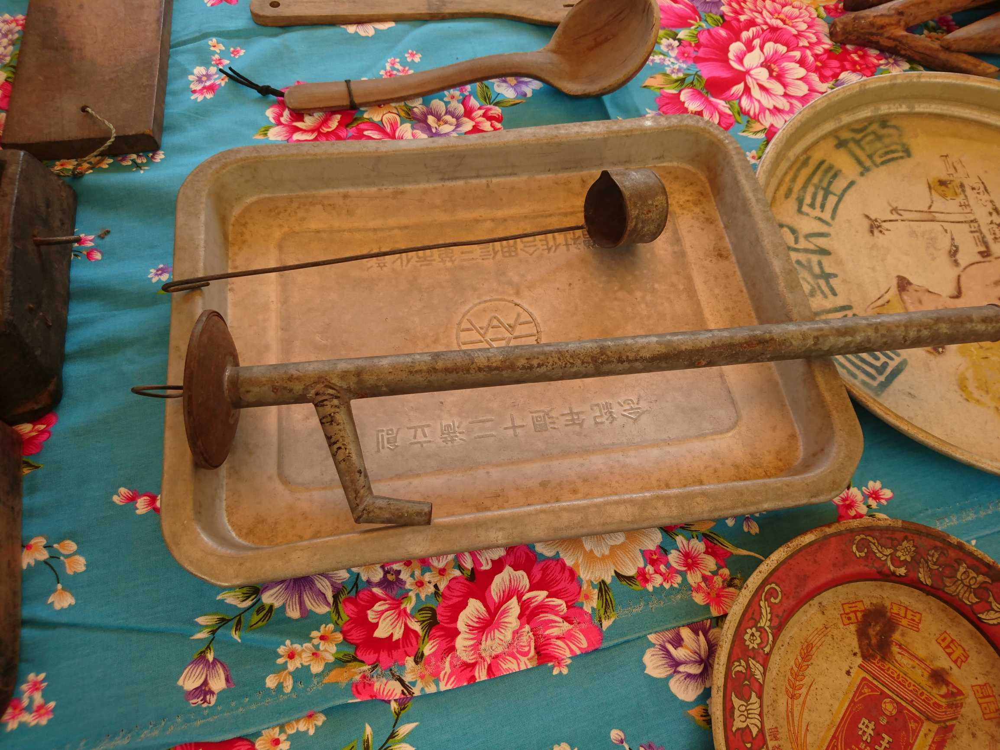

## 【Kap卓彥亨先生開講所記】

卓彥亨是Chhân-tiong-ng再源油行卓再枝先生大後生，蕭平治國校同窗。

伊講gín-á時，看人kōaⁿ各種無kāng款ê水晶罐á（玻璃矸á）來搭油（tah-iû），有15兩--ê，有斤二--ê、斤九--ê，mā有he兩斤三、三斤二--ê，阿爸lóng用磅á磅重，kap he taⁿ擔賣油--ê無kāng，出門賣火油是kō͘秤á秤重khah方便。

水晶罐á用chhó-that-á that，chhó-that-á有時ē lak落罐á底，阿爸to̍h用一條細條黃麻絲，áu做1-ê ná υ字形，long入去罐á內，kā罐á倒頭栽，注心一直chhiâu，chhiâu ho͘套tiâu chhó-that-á，sòa--落ûn-ûn-á giú、慢慢á chhoah，真神奇--ō͘，he chhó-that-á to̍h hō͘伊liù--出-來。

阿爸做生理kài有量，he人ê新婦人a̍h是gín-á，受in序大交帶來搭油，有時ē無細jī kòng破罐á，chit聲害--ā，轉--去bē交帶--得，人阿爸án-ne講，「Nā是tī店--裡看ē tio̍h ê所在kòng破，無要緊，提罐á來，koh tah一罐補--你！免煩惱！」

# 2. 註解
> **Chù-kái**

|**詞**|**解說**|
|鉛phiáⁿ|『鐵皮』。|
|liâm-siah-á|黏錫á，『銲工』。|
|活舌|Oa̍h-chi̍h，mā有講做ia̍p-á，『活塞』。|
|罐sui|細支茶鼓a̍h是水壺ê嘴。|
|su-tián-lè-suh|ステンレス ，Stainless steel，to̍h是白鐵á（pe̍h-thih-á），『 不鏽鋼』。|
|水晶罐á|水晶罐á to̍h是玻璃罐á。|
|chhó-that-á|Chhó是一種植物，通草ê心，hâm pho-lí-lóng，『保麗龍』真sêng，古早用chhó，chit-má用pho-lí-lóng代替。Chhó-that-á to̍h是『通草塞子，保麗龍塞子，軟木塞子』。|
