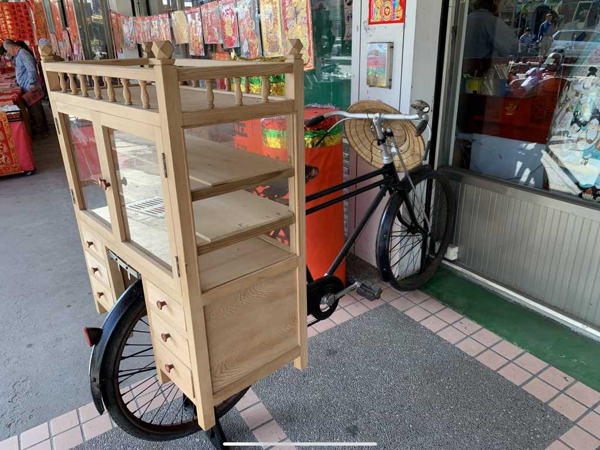
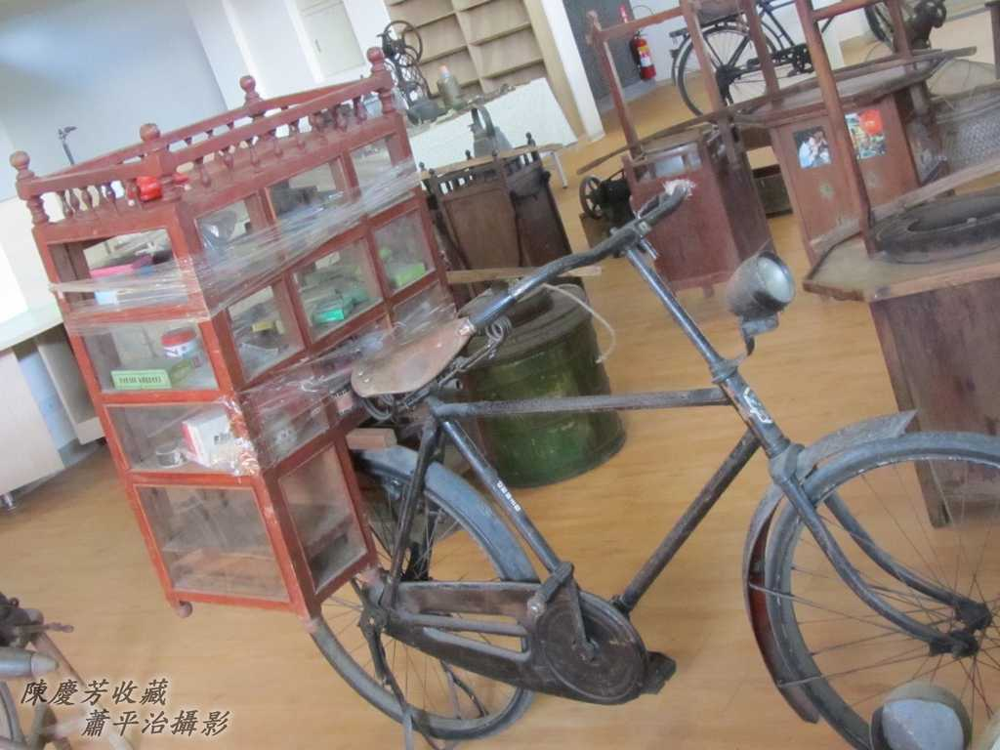
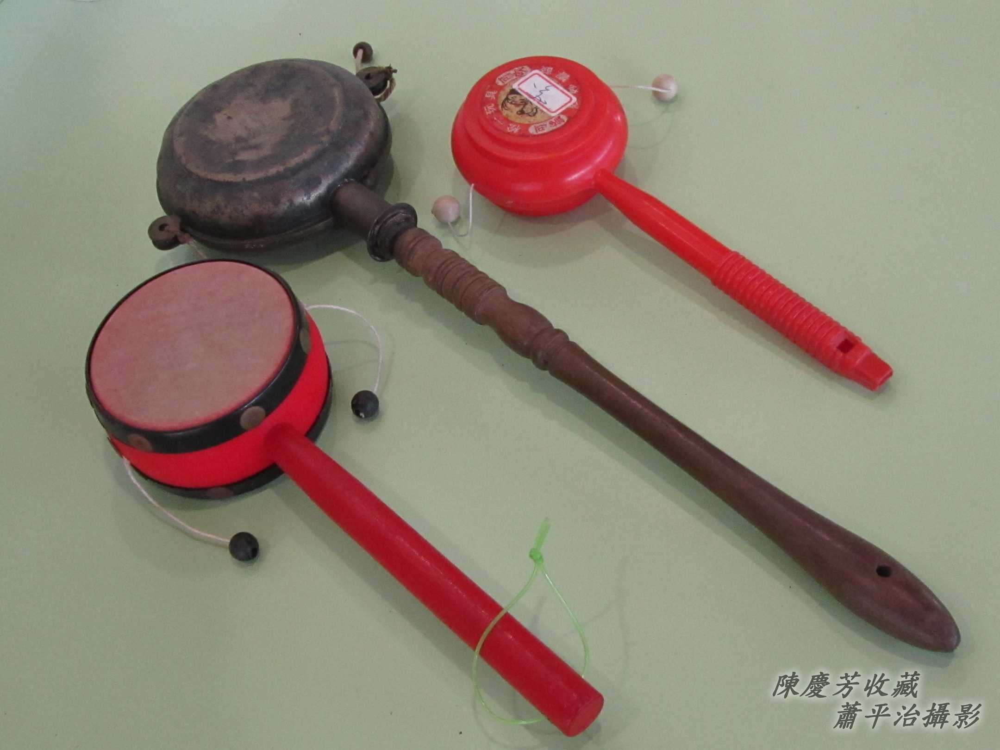
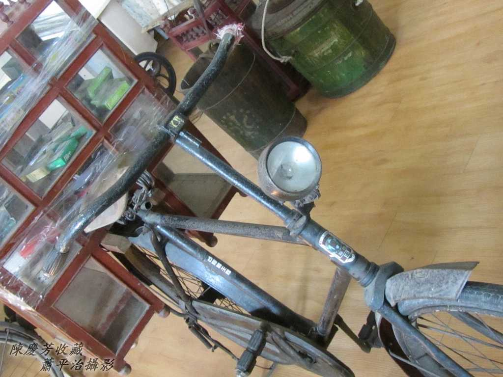
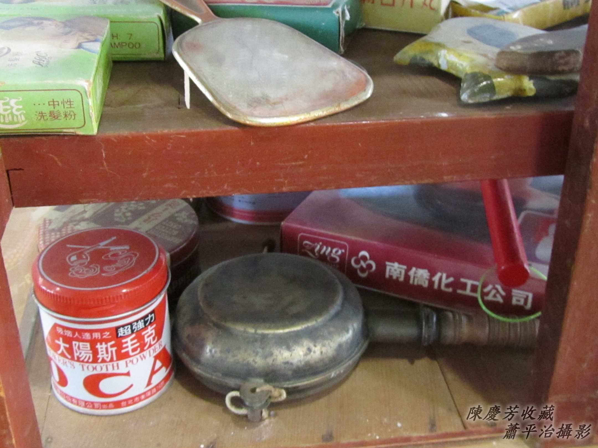
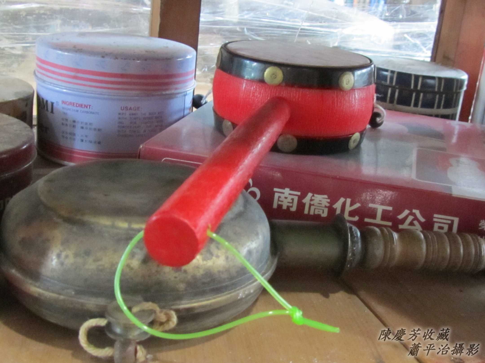
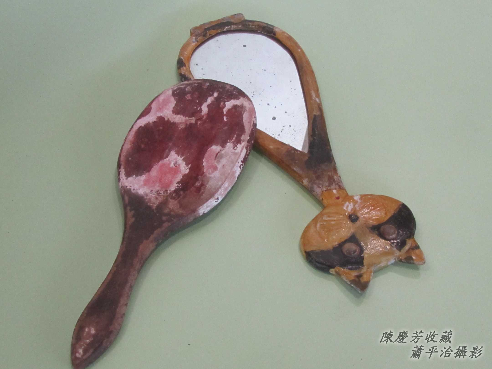
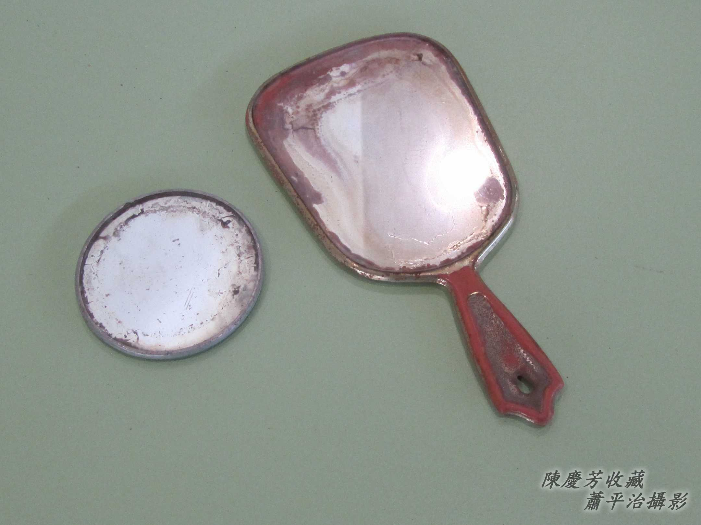
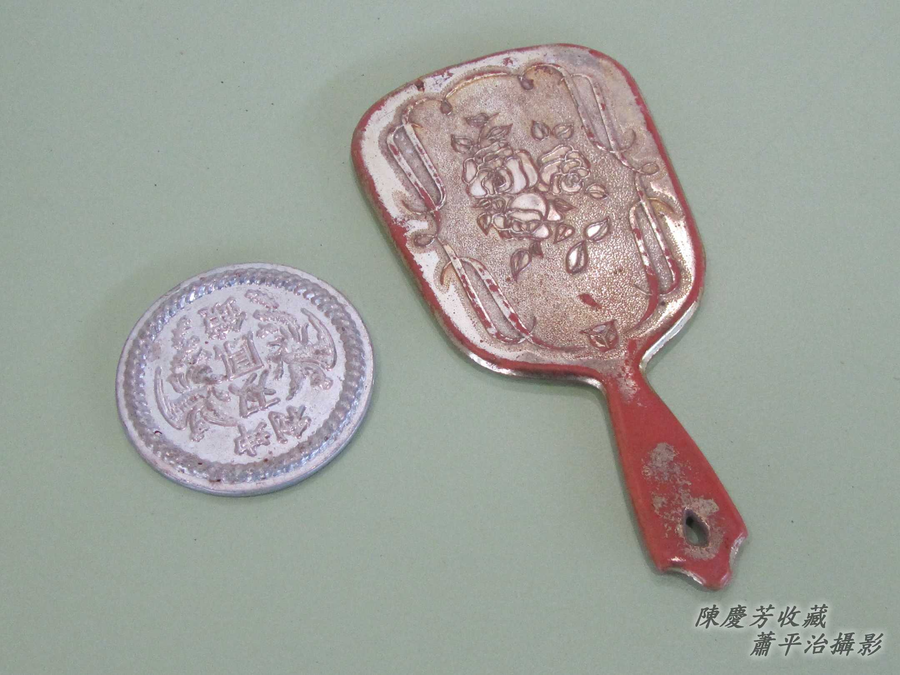

# 古早ê女性專櫃
> **Kó͘-chá ê Lú-sèng Choan-kūi**

# 1. 喝Lin-long賣雜細
> **Hoah-lin-long Bē Cha̍p-sè**

早當時交通不便ê時代，婦jîn-lâng boeh買胭脂、水粉chng-thāⁿ，a̍h是買針、線、鈕補thīⁿ，tio̍h ài央三託四拜託安童哥--a去街路買，m̄-tio̍h，tio̍h等hit-lō賣雜細--ê來chiah來買。

聽tio̍h「long、long、long、long」ê搖鼓聲，cha-bó͘人siāng歡喜，圍圍kha̍p-kha̍p，che揀he試，節ka-tī ê銀兩買物，金金熾熾，花粉芳味，che mā kah意，he mā boeh-ti̍h，私奇無夠，只好目chiu chho̍p-chho̍p-nih。

賣雜細--ê實在好性地，人客boeh ti̍h針，伊to̍h tháu開包裝giâ 1支hō͘你試，人客nā boeh買鈕á，大粒細粒隨在你揀到歡喜為止，無買無關係，絕對笑bi-bi。

賣雜細，擔頭有kō͘ taⁿ--e，mā有用鐵馬載，he擔頭造作真幼路，thang光玻璃內面物件看現現，to̍h ná像見本櫥，boeh ti̍h siáⁿ-mih kō͘手kí，隨時提hō͘--你。

喝lin-long賣雜細，m̄是喝場，喝是喝賣，搖lin-long鼓做信號，順sòa開嘴喝「賣雜細--ê來--ā！緊來買--ò͘！」

## 1-1. Lin-long鼓
> **Lin-long-kó͘**

中央這支古早玲瓏鼓是銅質。

## 1-2. 雜細櫥á
> **Cha̍p-sè Tû-á**

Khǹg tī鐵馬後載ê雜細櫥，有5層，內面排thia̍p整齊，因為lóng是thio花刺繡、補thīⁿ針chí、花粉胭脂、手鏡蝨篦⋯幼粒物，ē-sái-tit講cha-bó͘人kah意應有盡有。

## 1-3. 手鏡
> **Chhiú-kiàⁿ**

Kap桌頂鏡台配合，方便看後斗khok-á ê頭毛梳妝。

手鏡kap細kâi圓鏡，正面是玻璃鏡，倒面有真súi花紋。

# 2. 註解
> **Chù-kái**

|**詞**|**解說**|
|見本|Kiàn-pún，日來詞，『樣本』。|