# Gín-á Siāng愛食ê Sì-siù-á
> **Gín-á Siāng Ài Chia̍h ê Sì-siù-á**

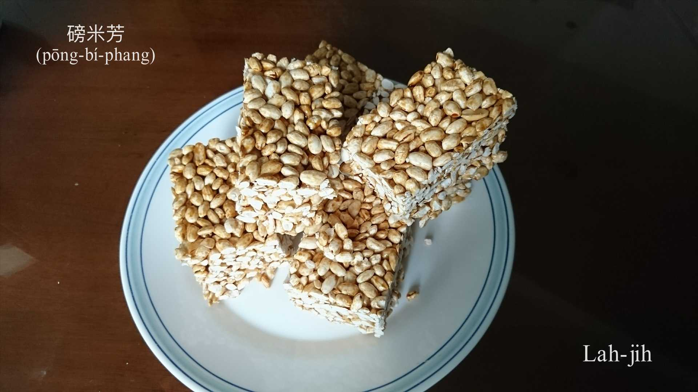

# 1. Pōng米芳 
> **Pōng-bí-phang**

## 1-1. 炒米芳、米芳kap Pōng米芳
> **Chhá Bí-phang, Bí-phang kap Pōng-bí-phang**

古早作田人ê gín-á平常時罕得有sì-siù-á tām-sám，大人to̍h ē kā粟á a̍h是白米tiàm大鼎炒ho͘熟炒hō͘煏--開，體積增加無chē，án-ne叫做炒米芳、炒米á，sám一寡鹽花á to̍h鹹芳á鹹芳，食--起-來tēng-tēng酥酥芳芳，gín-á人iau-sâi「無魚，蝦mā好。」雖bóng tio̍h揀粟殼，mā是食kah歡喜tang-tang。

生理人kā炒米芳做專業ê生產，chham糖切塊包裝to̍h是商品，叫做「米芳」。

Pōng米芳是經過密封ê壓力鐵爐加熱加壓，tháu放壓力後，產生體積膨脹加真大粒，食--起來軟軟鬆鬆。生理人kā pōng米芳做專業ê生產，chham糖切塊包裝to̍h是商品，叫做「Pōng米芳」。

所以「炒米芳」、「米芳」、「pōng米芳」有無kāng款ê意思。

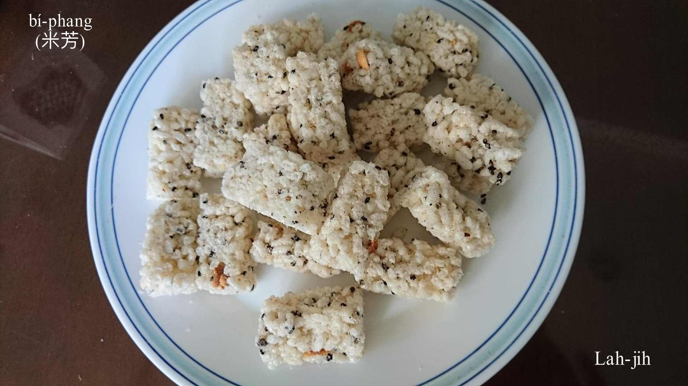

## 1-2. Gín-á唸謠——一--è炒米芳
> **Gín-á Liām-iâu——It--è Chhá-bí-phang**

一--è炒米香，二--ē炒韭菜，三--e chhiāng-chhiāng滾，四--è炒米粉。五--ē五將軍，六--è六kiáⁿ孫，七--è蚵á kûn麵線，八--è講伊boeh分一半，九--è九嬸婆，十--è kòng大鑼。Phah你千，phah你萬，phah你一千khòng五萬。Chhiu chhiu chhiu，bē見笑，ioh輸m̄ kam願，ī輸起he-ku，m̄ kam願，起he-ku，我boeh來去投老師，投老師。

# 2. Pōng米芳ê家私
> **Pōng Bí-phang ê Ke-si**

Pōng米芳ê家私有壓力鐵爐、火爐、鼎、網á袋、菜刀kah pān-á。

## 2-1. 壓力鐵爐
> **Ap-le̍k Thih-lô͘**

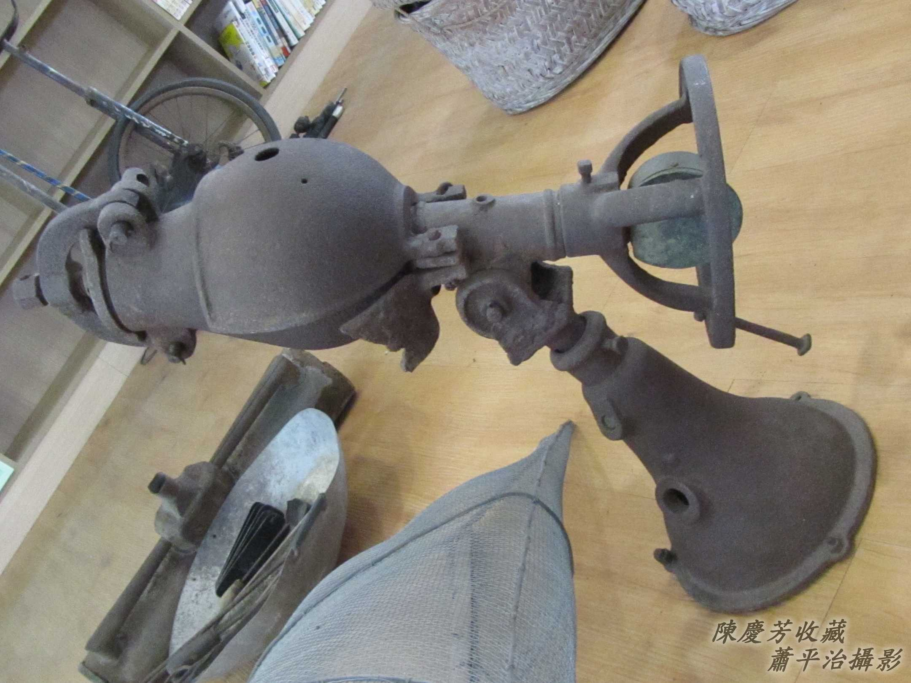

## 2-2. 絞á kap磅表
> **Ká-á kap Pōng-pió**

用絞á絞ho͘轉se̍h，加熱chiah ē平均chiâu-ûn；磅表ē-tàng了解爐á內ê熱度、壓力。
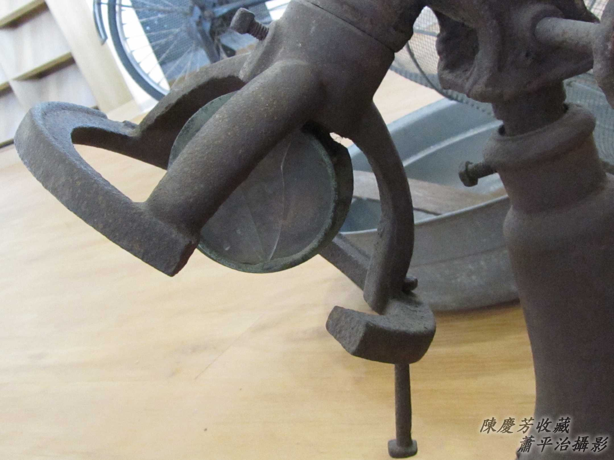

## 2-3. 爐嘴
> **Lô͘-chhùi**

頭前是壓力鐵爐爐嘴，phah開，白米khǹg--入-去，sòa--落鎖ân，chiah開始加溫。

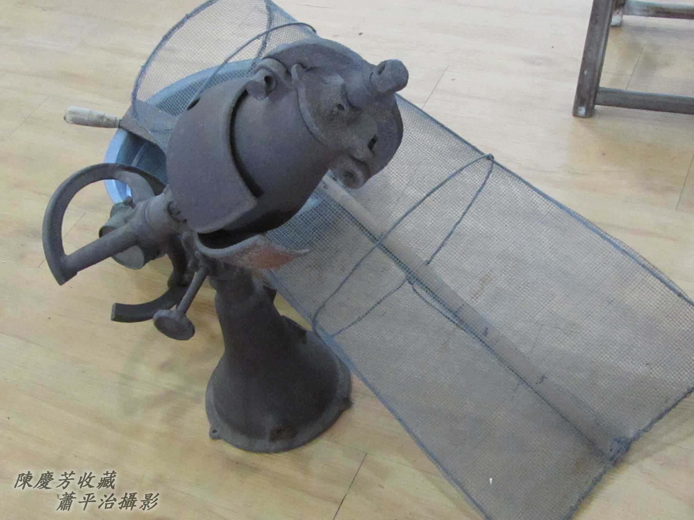
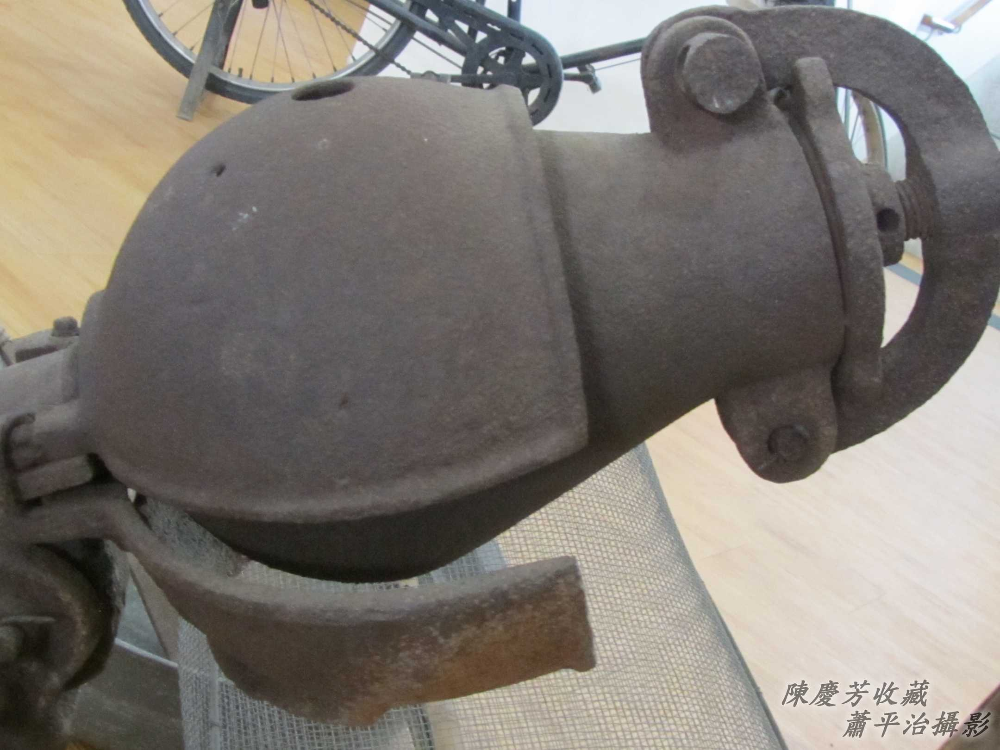

## 2-4. 鉛線網á
> **Iân-sòaⁿ Bāng-á**

是收集pōng開ê米芳。當鐵爐壓力達到ē-tàng開pōng ê時陣，pōng米芳ê師傅to̍h ē大聲喝「boeh pōng--ā-ō͘！」khiā tī邊--a ê gín-á隨時隨ê耳khang ng--leh，「póng」一聲，白泡泡ê pōng米芳已經貯滿鉛線網á。
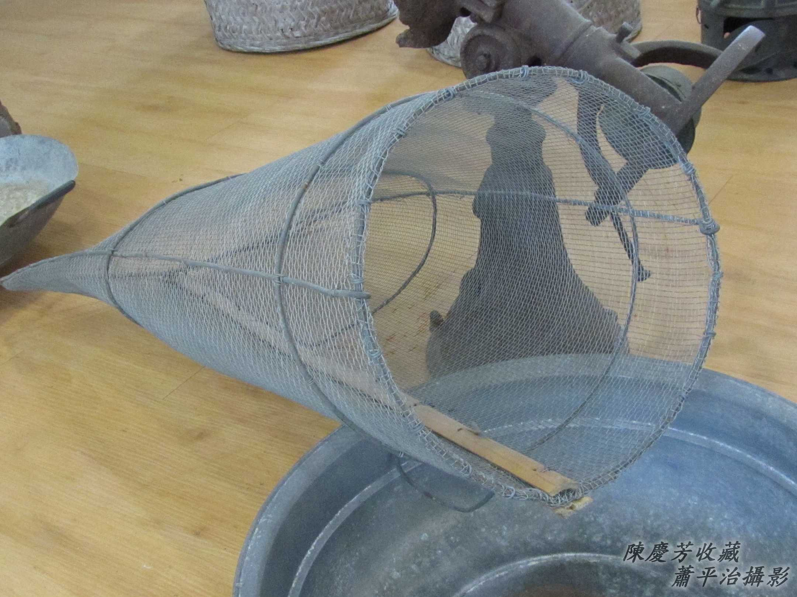

Pōng好iáu未chhiau糖膏ê米芳。
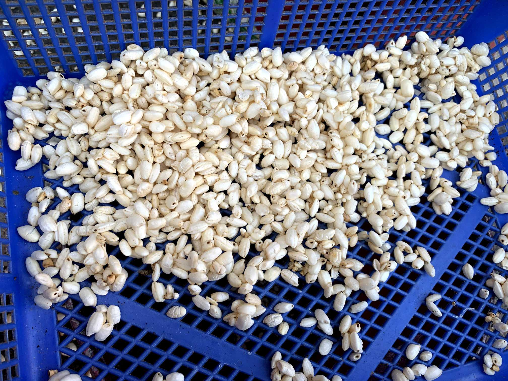

## 2-5. Kha桶kap菜刀
> **Kha-tháng kap Chhài-to**

大kha腳桶用來chhiau米芳kap糖膏。Mā ē-tàng摻熟土豆、麻á、瓜子無kāng口味。 

菜刀用來切pōng米芳，需要柴pān-á切ho͘平大塊。
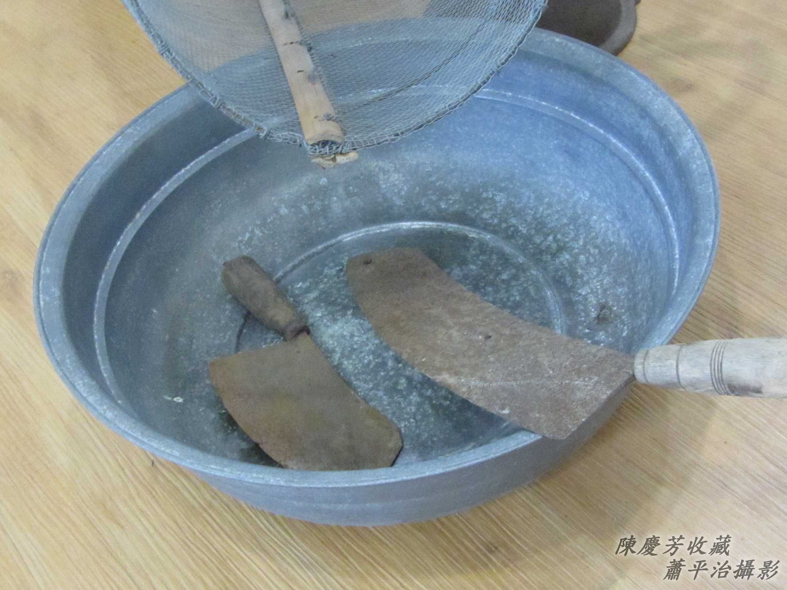

# 3. 麥芽
> **Be̍h-gê**

一隻雙台鐵馬，後載載1-kha柴箱，柴箱內面khǹg一大盒金黃金黃ê麥芽（糖）、ó͘麥芽ê竹pêng-á、黏麥芽ê竹chhiám-á kap kauh麥芽用ê薄餅á。手giâ一支「kho̍k kho̍k kho̍k kho̍k」ê搖管á：「麥芽--ō͘！麥芽--ō͘！來買麥芽--lah，麥芽kauh餅--ō͘！」

1950年代，麥芽一支1角銀，麥芽kauh kiáⁿ 1-kauh 2角，有人boeh買，to̍h竹pêng-á giâ--leh挖1-ê起頭，sòa--落用手ûn-ûn-á giú、ûn-ûn-á黏，giú ho͘薄li-si，黏ho͘ tiâu tī竹chhiám-á頂，a̍h是黏tī 2塊餅中間。

這是gín-á siāng kah意嘴食物，ûn-ûn-á chn̄g，ûn-ûn-á享受甜ê甜頭，1角銀chn̄g boeh半點鐘，m̄ kam甜but-but ê滋味一時á to̍h消失，永遠ê記智，tī hit ê sàn赤無錢ê gín-á時代。
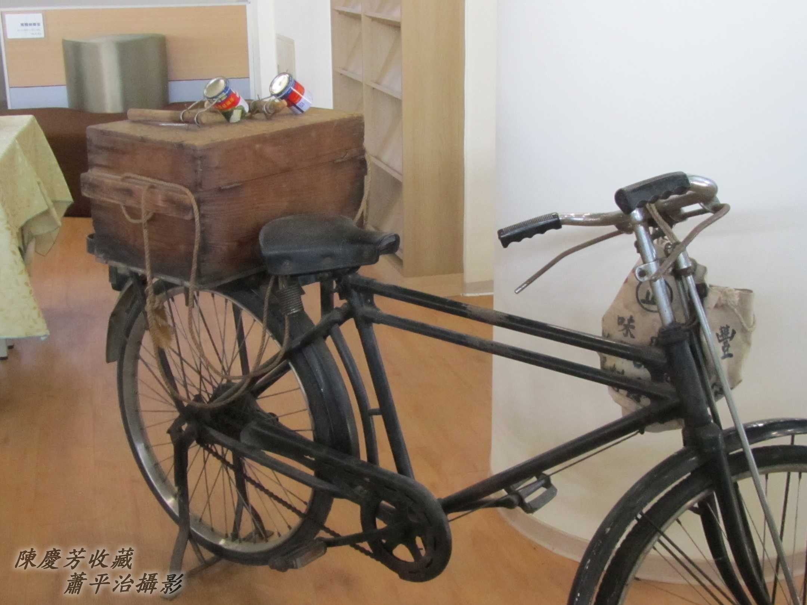
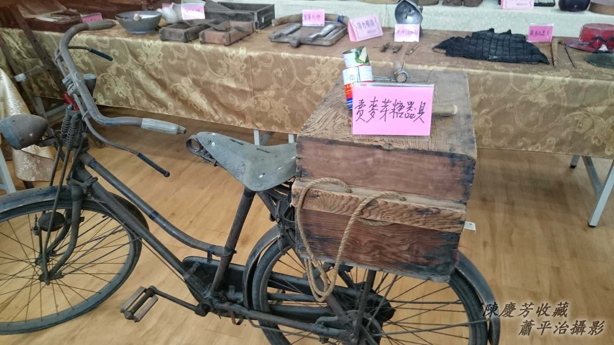

## 3-1. 搖管á
> **Iô-kóng-á**

賣雜細giâ–-ê是搖鼓，long long tong tong；賣麥芽giâ--ê是銅管á做ê搖管á，搖--起-來是「kho̍k kho̍k kho̍k kho̍k」，聽聲to̍h知影是賣雜細--ê a̍h是賣麥芽--ê，叫--來ê顧客bē têng-tâⁿ。
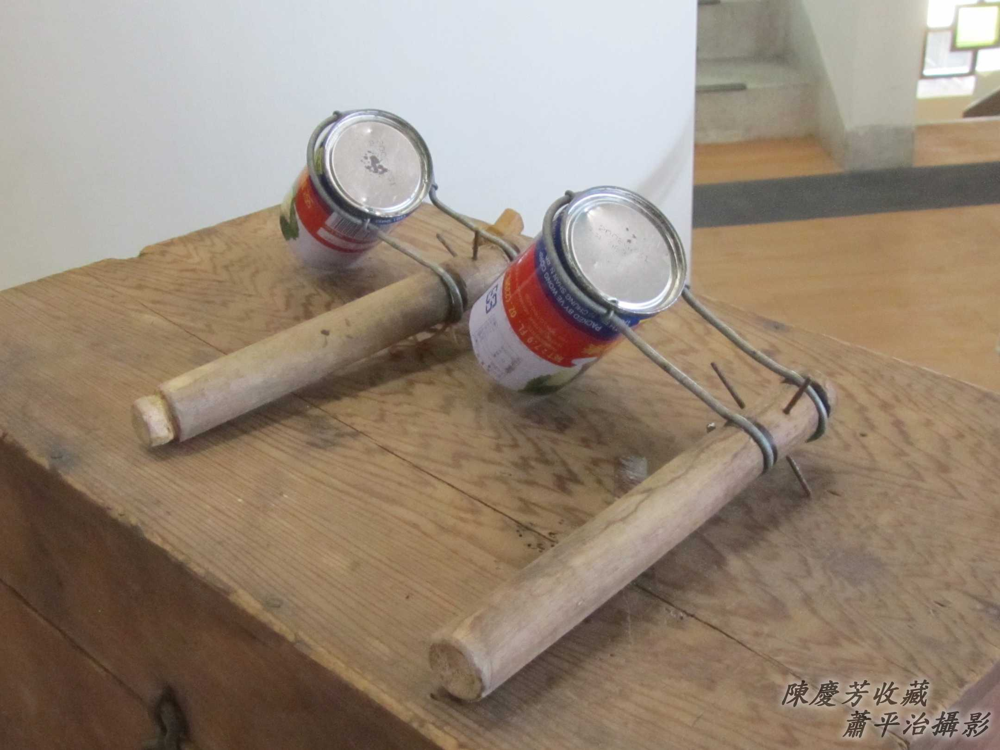
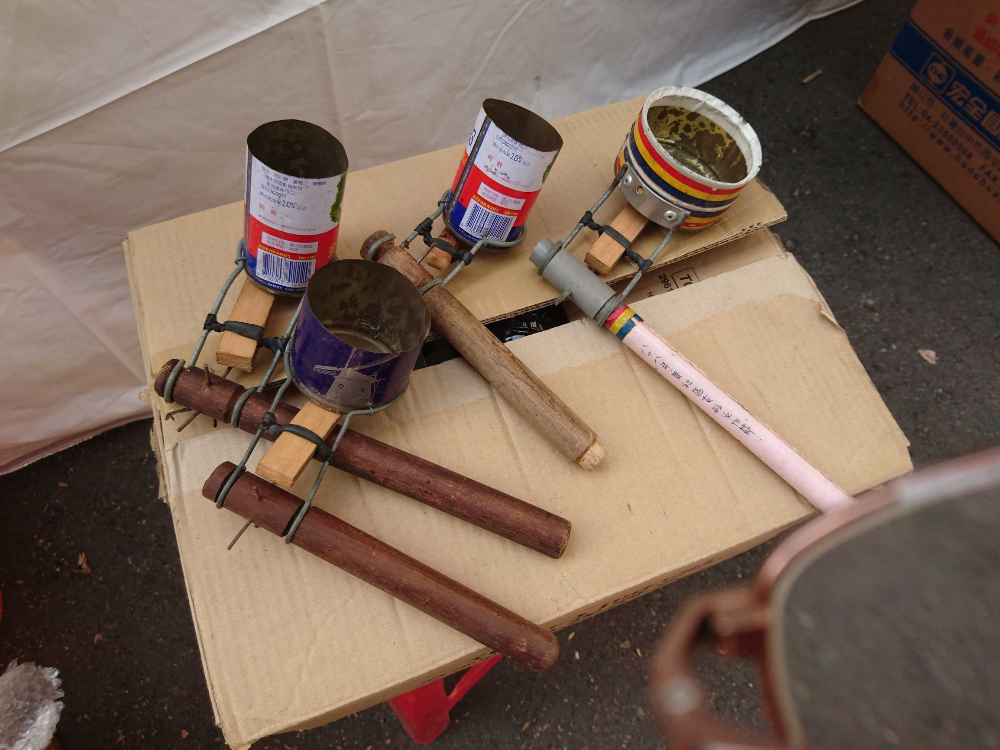
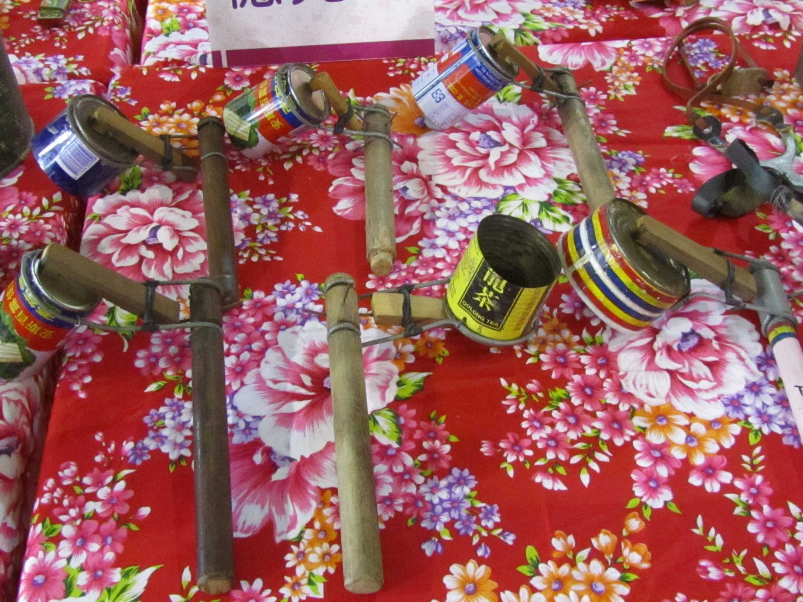

## 3-2. 麥芽Ài Án-chóaⁿ做
> **Be̍h-gê Ài án-chóaⁿ chò**

麥芽是『麥芽糖』m̄是『麥芽』，to̍h親像華語『豆芽菜』咱講豆菜án-ne，漢字書寫台語，台語文用漢字書寫，有時是真oh分別。

Kā puh-íⁿ ê小麥絞汁，chiah koh kap炊熟ê chu̍t米lām做夥lā-lā ho͘ chiâu，經過4點鐘久ê糖化，kā粕濾掉chiah koh熬煉幾nā點鐘to̍h ē變做黏黏thi-thi ê麥芽糖（麥芽膏）。

賣麥芽--ê喝賣ê麥芽m̄是正麥芽，lām真chē糖（蔗糖）。純正麥芽khah軟khah bē甜，是治嗽藥用，be̍h-gê kauh餅（kiáⁿ）ê麥芽khah甜khah tēng khah khiū。

麥芽膏是治嗽藥用；麥芽糖/麥芽是嘴食物。

# 4. 註解
> **Chù-kái**

|**詞**|**解說**|
|炒米粉|炒米粉是煮食動作，米粉炒是炒好ê點心、羹頓。|
|chhiu chhiu chhiu|『羞 羞 羞，羞羞臉。』|
|bē見笑|『不知羞恥』。|
|he-ku|『氣喘病』。|
|pān-á|『樣板』。|
|chn̄g|用嘴舌chī。|
|be̍h-gê kauh餅|餅乾kap麥芽糖。|
