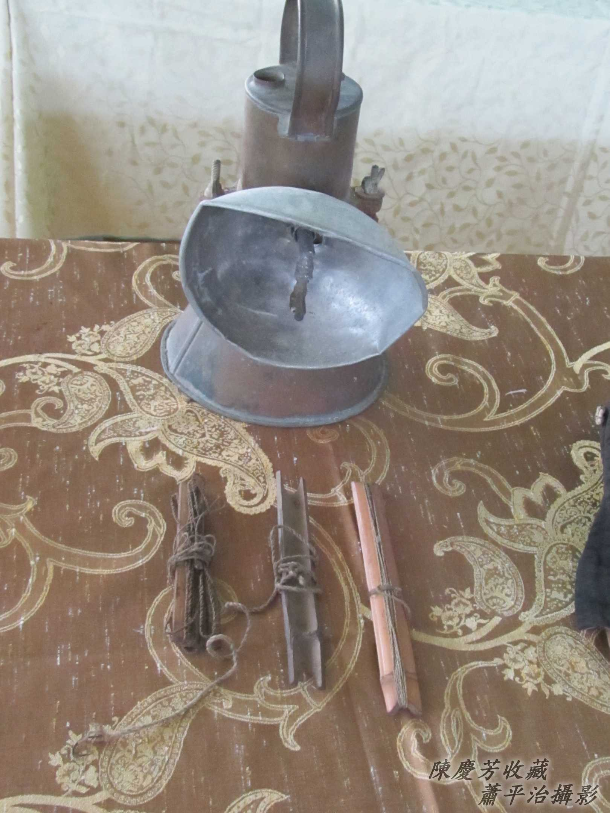
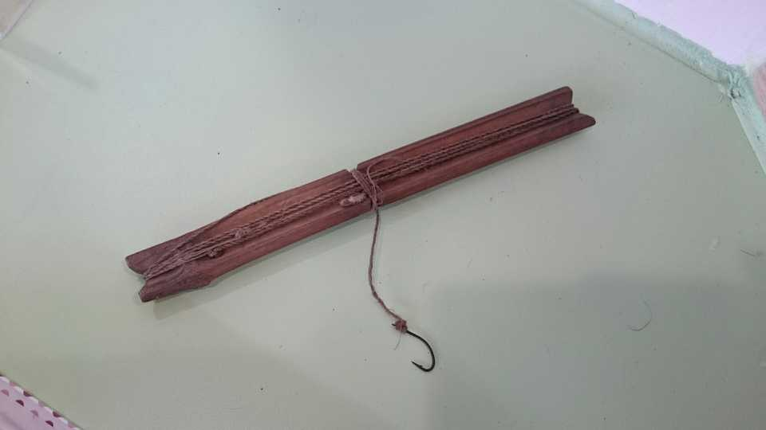
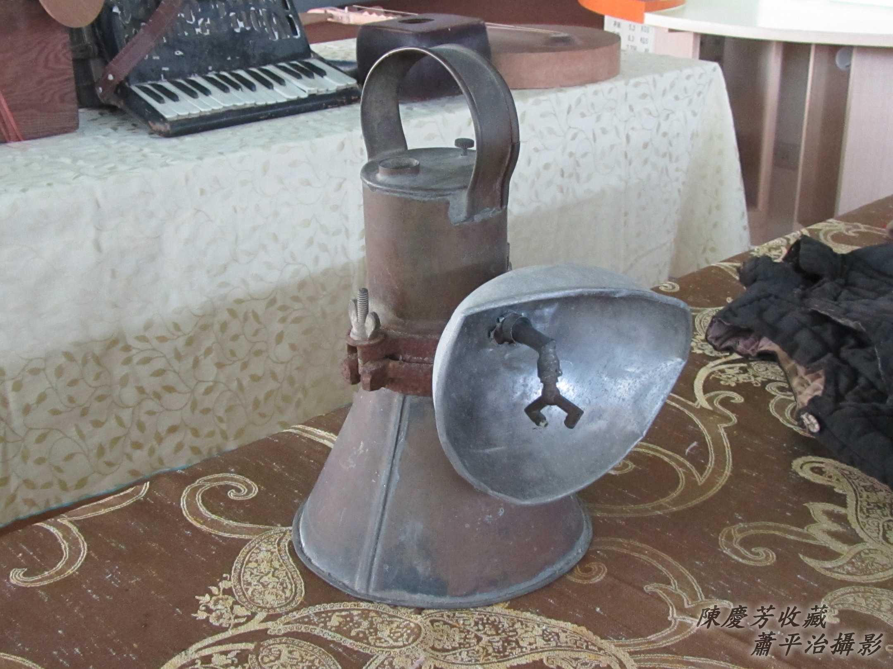
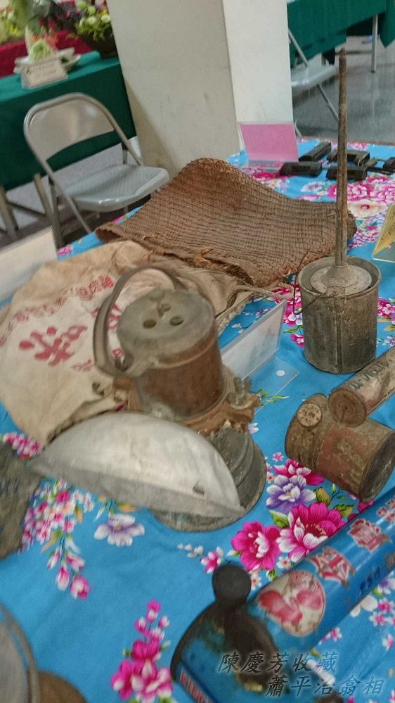
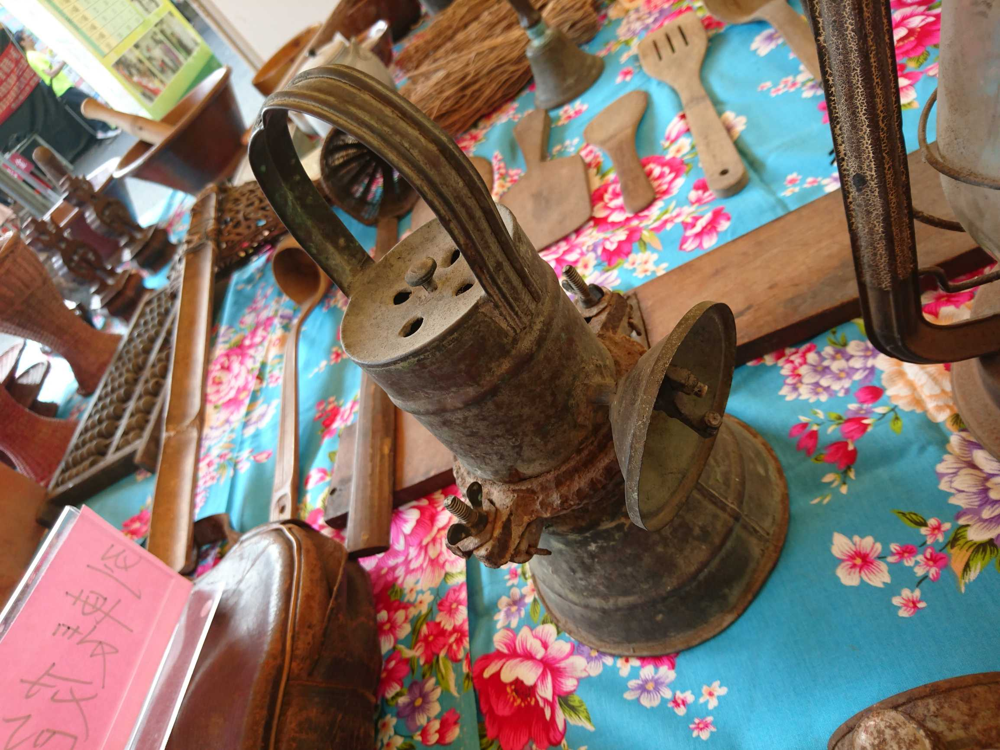
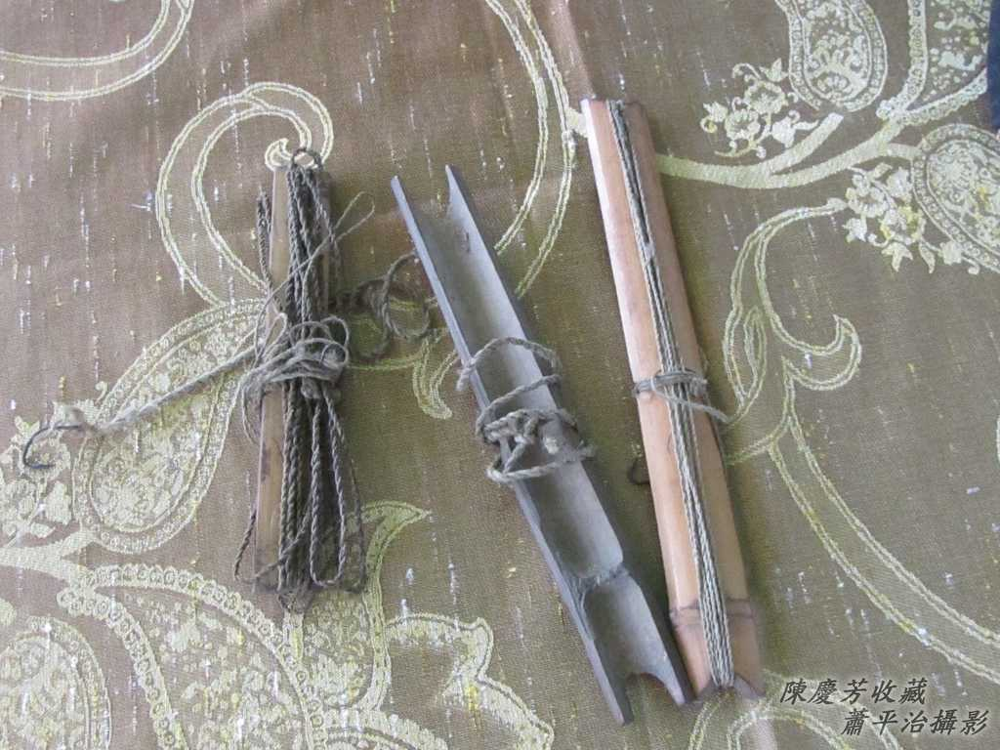
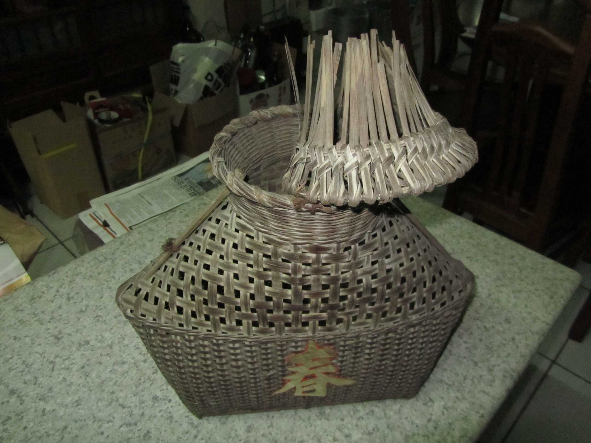

# Lia̍h水蛙、Tiò水蛙
> **Lia̍h Chúi-ke, Tiò Chúi-ke**

Lia̍h水蛙、Tiò水蛙tī現今社會已經真罕得khoàiⁿ，凡勢真chē讀者是sa無cháng，lia̍h無teh chhòng saⁿh。無要緊，咱ē-tàng先ùi Siau Lah-jih tī 2015寫ê這篇文章開始看，隨時頭殼底to̍h有活跳跳ê形象。

## 【Lah-jih散文書寫】Lia̍h水蛙
> **【Lah-jih Sòaⁿ-bûn Su-siá】Lia̍h Chúi-ke**

【2015/5/5 刊載臺江臺語文學季刊第十四期】

 古早田園罕得chōaⁿ農藥ê時代，早冬稻á so第三遍草了後，田--裡、水溝、水窟á一四界，水蛙to̍h滿滿是，有水蛙á-kiáⁿ，有新á，有老水蛙，「ia̍p ia̍p ia̍p ia̍p」「o̍p o̍p o̍p o̍p」tī boeh暗á時歌聲唱bē離。

 庄腳所在，四邊lóng是田，放學後，歇睏日，是阮庄腳gín-á流浪放蕩好時機，chit-ê時期siāng kài好sńg ê齣頭to̍h是lia̍h水蛙，khang手hop，用水蛙釣á釣，mā有用竹pêng-á tiàm溝á水邊sut。溝á水邊草ōm-ōm，水蛙siāng愛bih，竹á枝giâ leh烏白sut，to̍h有he註死ê水蛙poa̍h落水底giān-giān bē-siau-kiān，趕緊khioh入水蛙袋á內。

講tio̍h lia̍h水蛙、釣水蛙，to̍h-ài分年紀來講起，5-6歲7-8歲ê細漢gín-á khah hèng用hop--è，hop he細隻水蛙á kiáⁿ，tiàm he ta水ê稻á園a̍h是無水ê菜園，水蛙á跳，gín-á to̍h tòe-leh跳，伸手hop，hop--tio̍h to̍h lia̍h來sńg thit-thô，無ài sńg to̍h放伊去。

大約3-4年ê學生gín-á ē開始學人釣水蛙，厝內便便ê黃麻骨á giâ--一-支，尾á pa̍k 1條黃麻絲，黃麻絲另外hit頭pa̍k 1尾杜蚓á to̍h ē-sái-tit釣。揀tī下晡時á日頭khah軟ê時，gín-á伴招--leh，水蛙釣á giâ--leh，水蛙袋á提--leh，做夥厝邊田園釣水蛙thit-thô，真正是釣thit-thô，因為bē-hiáu釣，水蛙釣á hàiⁿ--出-去，m̄是hàiⁿ m̄ tio̍h所在，to̍h是水蛙m̄來咬，a̍h是釣tio̍h水蛙soah hàiⁿ bē落去水蛙袋á，罕罕釣tio̍h一隻大隻--ê，ta̍k-ê to̍h暢kah chhia̍k-chhia̍k-tiô，好sńg第一，釣有釣無無關係。

5-6年ê學生gín-á，開始有巧khì，ē去想tio̍h「boeh án-chóaⁿ樣á chiah ē釣tio̍h真chē水蛙」chit-ê問題，水蛙釣á ē-hiáu取he liú-lia̍h好giâ ē sìm ê桂竹á枝，水蛙袋á ē用肥料袋á thīⁿ--ê khah kah手好提，袋á嘴無ài siuⁿ闊，布袋á m̄-thang siuⁿ淺ài深，特別hit條釣線一定用nńg-lio̍h ê棉紗線，長度tio̍h-ài tú好。雖bóng Lah-jih mā是5-6年ê學生，che釣水蛙是有khah ham-bān，看人水蛙釣á線一hàiⁿ--出-去，to̍h聽tio̍h「咬--leh--ā！咬--leh--ā！」He水蛙釣á sìm--leh sìm--leh sìm 4-5下，隨時正手giâ koân tioh--一-下，tò手水蛙袋á伸--出-去，hit隻水蛙已經poa̍h落水蛙袋，實在神奇。原來hit隻水蛙kā水蛙á kiáⁿ釣餌咬ân-ân，後腿一直liòng，死m̄放，siáⁿ知「tŏp~」一聲，已經poa̍h落水蛙袋，釣水蛙--ê kā袋á搖--2-下，知影水蛙嘴已經放掉釣餌，水蛙釣á to̍h隨koh hàiⁿ出去繼續釣。

水蛙是食肉動物，甚至ē食同類水蛙á kiáⁿ，大隻食細隻，所以釣餌tio̍h用水蛙á kiáⁿ，chiah ē-tàng釣tio̍h新á ê大隻水蛙，水蛙腹肚nā iau to̍h親像大食壁虎，咬tio̍h釣餌to̍h m̄知影thang放，釣水蛙ê高手to̍h是有才調kā tio̍h吊ê水蛙，kā水蛙釣á hàiⁿ--一-下to̍h ē準準準lok入水蛙袋á，罕得落勾ka-la̍uh--去。日頭落海前ê一點鐘，有人已經釣boeh 1-2斤，in-tau明á載ê羹頓to̍h加真phang-phài，水蛙á肉tok醃瓜á，鹹芳鹹芳，加真配ē落飯。釣無夠一盤水蛙á肉tok醃瓜á，to̍h明á載繼續釣，boeh暗á釣--ê ka關tiàm醃缸內a̍h是大kha水桶，有水thang泅to̍h bē死，總--是tio̍h khàm ho͘密，nā無明á載天光to̍h ē走了了跳kah無半隻。

Tī hit ê sàn赤欠油臊ê年代，庄腳sàn赤人lia̍h水蛙釣水蛙來做羹頓，chiâⁿ做一項thit-thô、技術、煮食ê生活文化。因為kō͘釣ê水蛙多數是新á m̄是kài大隻，所以thâi水蛙kap煮食to̍h真簡單，厝後是刺竹模，竹gím-á全全刺，削一支有尖刺ê竹gím-á，ùi水蛙腹肚鉤開，liû出腸肚，sòa--落koh lām醃瓜á做夥tok-tok--leh，khǹg落鼎內猛火炒熟to̍h是一盤山珍海味。

Iáu有一種專門lia̍h水蛙leh賣ê水蛙師傅，in專門lia̍h he大隻ê老á水蛙kó͘，賣hō͘麵店飯店做料理。He lia̍h水蛙師傅真正是老水蛙kó͘ ê剋星，頂年無hō͘人釣--tio̍h ê新á水蛙，已經pìⁿ-chiâⁿ老經驗ê老水蛙，日--時無隨便出門，lóng是bih tiàm暗sàm涵khang內，lia̍h水蛙--ê既然是師傅，當然了解水蛙習性，in利用暗時出門，chah 1-pha有安反射lap鏡lia̍h水蛙用ê電土火，1-kâi竹篾á pīⁿ ê水蛙chho̍p-á，腰身phāiⁿ一kha水蛙khah-á，田園四界liâu，耳khang聽，電土火chhiō，目chiu看，he電土火光iāⁿ-iāⁿ，光線koh集中，田--裡ê水蛙，便nā去ho͘ chhiō--tio̍h，to̍h gāng-gāng m̄敢振動，水蛙chho̍p-á一下chho̍p，伸手lia̍h to̍h是一隻老水蛙kó͘。

另外一種lia̍h水蛙，方法有khah夭壽骨，無用釣mā無用chho̍p，是用tng--e，削一支竹pêng-á做khi̍t-á，插tiàm老水蛙kó͘出入ê所在，pa̍k一條細條索á，索á另外hit頭，pa̍k釣魚ê魚鉤á，魚鉤á鉤釣餌，1-pái插幾nā支，等thāi水蛙來tio̍h吊，今á日放釣á，明á載來收成，tio̍h吊水蛙去hō͘魚鉤á倒鉤gí-á鉤tiâu--leh，sian跳mā pak bē lut，實在真hiau-hēng。

Chiâⁿ久m̄-bat koh看tio̍h人leh釣水蛙，因為農地污染，boeh釣mā無hit-lō水蛙thang釣，kan-taⁿ chhun懷念。

# 1. Lia̍h水蛙ê家私
> **Lia̍h Chúi-ke ê Ke-si**

## 1-1. Lia̍h水蛙ê電土火
> **Liah Chúi-ke ê Tiān-thô͘-hóe**

厝內底用ê電土火，一般無燈罩，lia̍h水蛙ê電土火需要裝1-kâi像碗形ê燈罩，借lap-kiàⁿ反射作用ê原理，集中焦點來chhiō水蛙，鑿目ê光線一下chhiō，水蛙to̍h tiām-tiām m̄敢走，水蛙chho̍p-á一下chho̍p，穩tak-tak，niáu鼠á入牛角，百面lia̍h入khah-á內。

電土是『電石，不純的鈣化物，可以和水作用產生乙炔氣，成為高溫火焰的燃料，用來銲接或切割』。

## 1-2. 水蛙tng-á
> **Chúi-ke-tng-á**

水蛙tng-á ê索á 1-pêng pa̍k tī竹pêng-á釘tī土腳，1-pêng pa̍k魚鉤á。
  

## 1-3. Khah-á

# 2. 註解
> **Chù-kái**

|**詞**|**解說**|
|lap鏡|Lap-kiàⁿ，『凹鏡』。|
|燈罩|Teng-tà，燈閘（teng-cha̍h）。|
|焦點|Chiau-tiám。|
|chhiō|直線照光。|
|百面|Pah-bīn，百分百，100%。|
|khah-á|『捕魚或採茶時背在身上裝魚或茶葉的竹簍子，通常口小腹大』。|
|chho̍p|雞chho̍p-á，chho̍p，『由上往下罩』。|
|水蛙tng-á|Tng，tng等，『等候上鉤。』|
|pīⁿ|『編織』。|
