# 修理物件ê師傅
> **Siu-lí Mi̍h-kiāⁿ ê Sai-hū**

補鼎續火，砧皮鞋是siáⁿ-mih行業，你kám知？

# 1. 補鼎 
> **Pó͘-tiáⁿ**

食飯皇帝大，鼎是煮食ê家私，有大鼎、細鼎、銅鼎á、鉎鍋，其中大鼎siāng重要。古早家庭頭嘴chē，而且差不多ta̍k口灶lóng有飼豬，nā boeh煮飯，sa̍h豬菜，lóng tio̍h大鼎來煮來sa̍h。古早大鼎是seⁿ-á來翻砂鑄造，因為驚鹹、驚溼，chiâⁿ gâu蛀穿、蛀khang。

大鼎tī大灶煮食，用火柴草in hiâⁿ火，hiâⁿ久to̍h ē kha̍h chi̍t-têng火thûn-lo͘，tio̍h-ài用煎匙khau清氣，而且鼎底mā時常用煎匙thuh鼎phí、thuh油sian，tn̄g-tio̍h khau破鼎thuh破鼎，m̄ kam hìⁿ-sak、無錢買新鼎ê時陣，to̍h等待補鼎補雨傘--ê來補。補鼎tī 1960年代進前是庄腳所在真捷看--tio̍h ê行業。

補鼎師傅到庄頭，ē用鐵板khia̍uh-á通知ta̍k-ê來補鼎，喝聲「補鼎sòa火--eh！補鼎sòa火--eh！」，mā有he兼leh補雨傘--ê，to̍h喝講「補鼎補雨傘--ō͘！」

# 2. 補鼎ê家私頭á
> **Pó͘-tiáⁿ ê Ke-si-thâu-á**

風櫃，鐵板khia̍uh-á，火鋏，鉎á-phòe，火匙，鐵hám-á，特製烘爐，土炭、火炭。
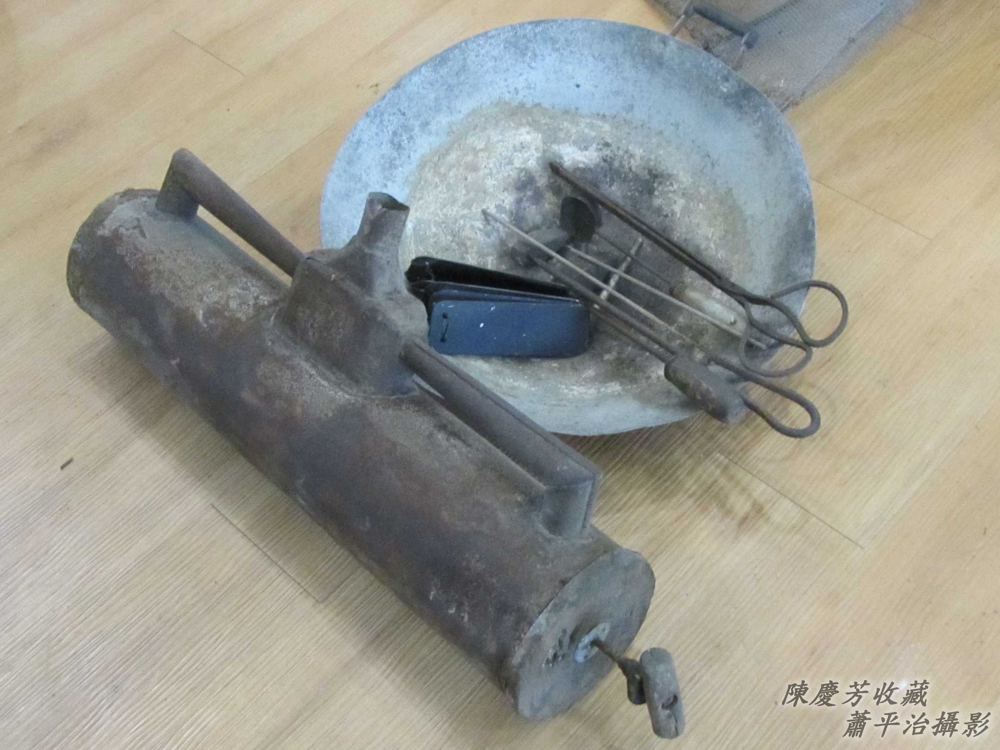

## 2-1. 風櫃
> **Hong-kūi**

風櫃正面有風櫃柄，用手giú--一-下sak--一-下to̍h ē抽風sak風，kā烘爐火煽iām，溫度真koân，ē-tàng kā鉎á iûⁿ-hòa（熔化）做流體。
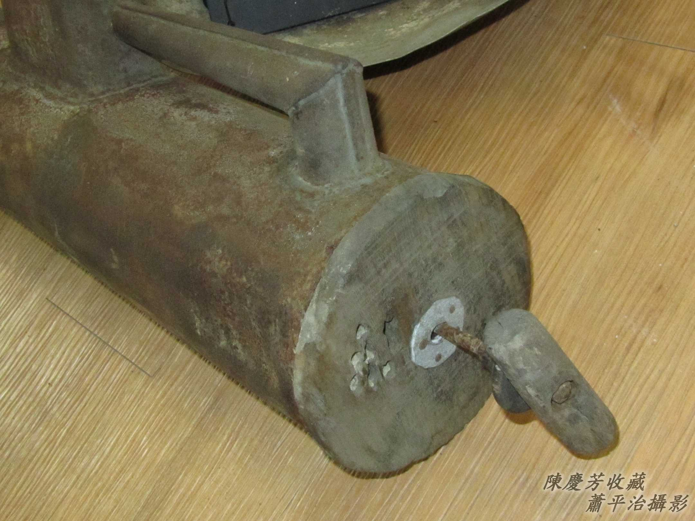

風櫃ê坦邊出風khang，倚tī烘爐嘴，kā烘爐pûn火。
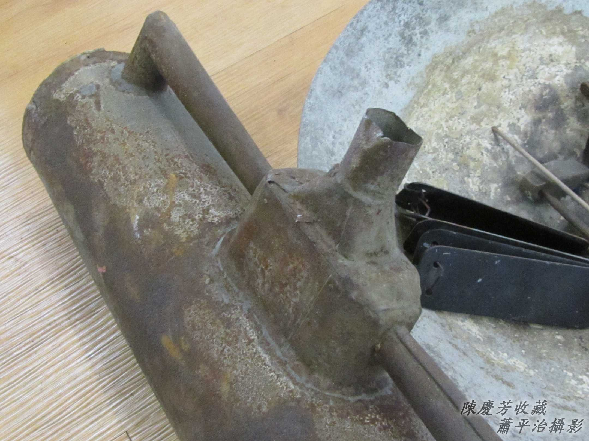

風櫃ê後面有入風嘴，內面有活舌，抽ê時風ùi入風嘴進入，sak ê時，活舌that tiâu，風對出風khang tōa-káng pûn風。
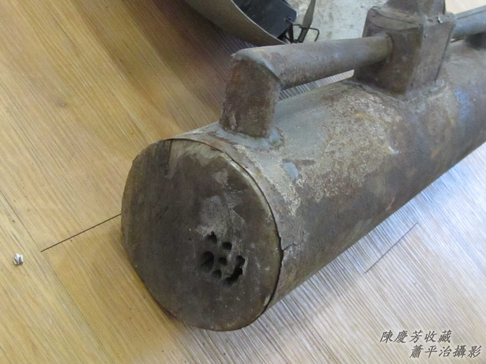

## 2-2. 鐵板Khia̍uh-á
> **Thih-pán Khia̍uh-á**

4-5塊鐵枋穿做夥，用手hàiⁿ振動發出「lia̍k lia̍k lia̍k lia̍k 」鐵枋相kòng ê聲音，表示「補鼎--ê」來--ā，順sòa通知補鼎所在。
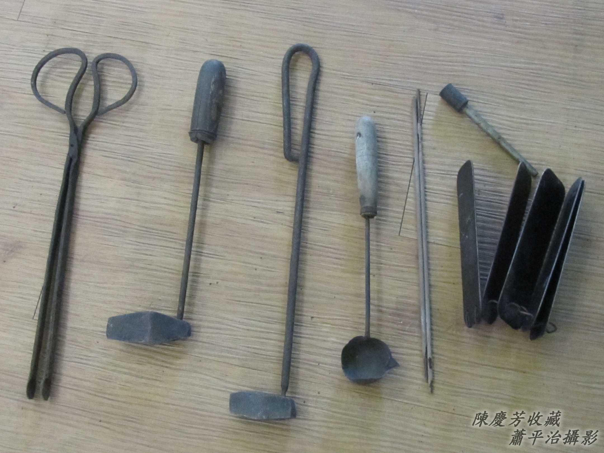

## 2-3. 火鋏
> **Hóe-ngeh**

夾土炭、火炭，ngiáu土炭火、火炭火。

## 2-4. 火匙
> **Hóe-sî**

貯熔化ê鉎á液體，準備補鼎。

## 2-5. 鐵Hám-á
> **Thih-hám-á**

鼎蛀穿看--起-來無大，蛀害範圍可能khah大，tio̍h-ài用hám-á kho̍k-kho̍k hám-hám--leh，kā蛀害部份khà掉chiah來補，用hám-á kòng--過，soah愈kòng愈大孔，án-ne補--起-來ē khah勇。鼎補好，ē留一寡鐵phí-á，mā tio̍h用hám-á輕輕á ka kòng掉kòng平。

# 3. 補鼎過程
> **Pó͘-tiáⁿ Kòe-têng**

Gín-á時代看--tio̍h記智。

特製火爐1-pêng有耳，1-pêng有sui，有蛀khang ê所在處理好勢了後，to̍h用火匙sîn火爐內已經熔化ê鉎á水，用一塊ná布條所tān ê物件，kā適量ê鉎á水ùi鼎外面sak入，sòa--落chiah ùi鼎內用布條所tān ê物件ka chhi̍h-óa chhi̍h-ân，等溫度冷--去，to̍h ná像lúi釘lúi-ân-ân，了後chiah koh用hám-á kòng-kòng khà-khà--leh，用鋸lē修修--leh to̍h算完成。
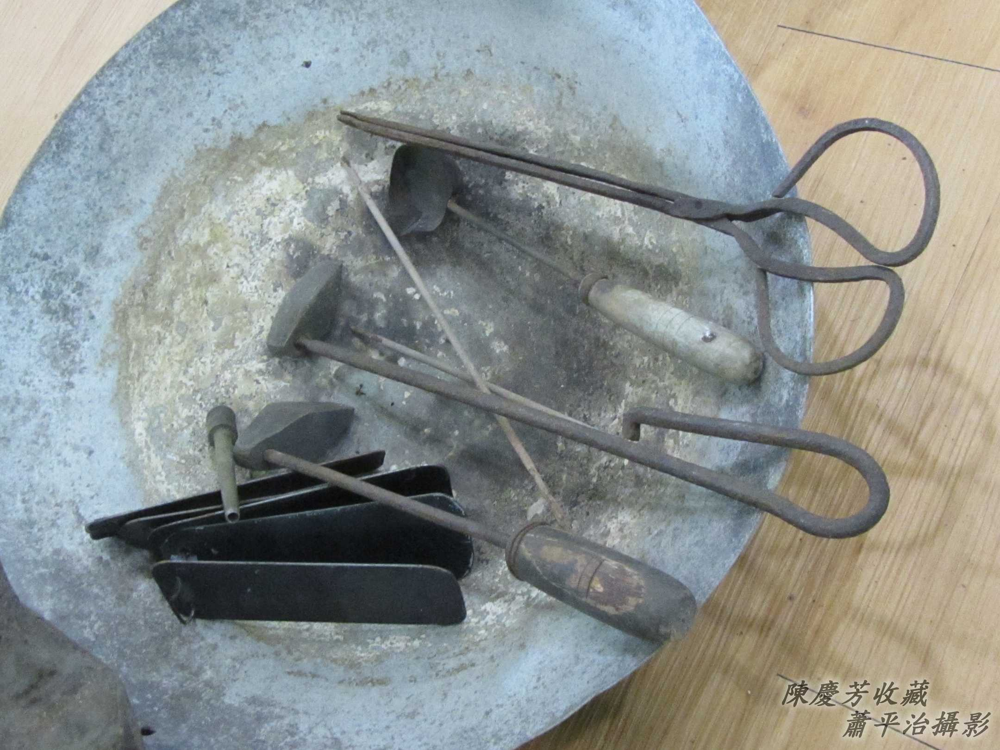

## 【Lah-jih台灣俗語】
「愈補愈大khang」。To̍h是ùi補鼎ê方法來--ê。

# 4. 砧皮鞋 
> **Tiam-phôe-ê**

進步ê科技、發展ê經濟，帶動消費mā soah養成人討債ê習性。鞋除了是保護腳蹄，koh是追求流行ê chng-thāⁿ，1雙2雙無夠，人人幾nā雙tī鞋櫥內，擲掉thùi-ōaⁿ（替換）m̄是因為害--去、破--去，是因為tòe bē tio̍h時行，siáⁿ-mih叫做砧皮鞋補皮鞋，少年兄姊已經m̄-bat。

物質欠缺ê時代，1雙皮鞋是好額人ê標記、食頭路人ê體面（thé-biān），無特別都合m̄ kam穿出門。Hit當陣ê皮鞋是kō͘手工chhiah，chhiah皮鞋tio̍h先量腳pô͘畫鞋樣，koh tio̍h試穿chiah開始刺皮鞋，雖bóng手工，總--是材料無chit-mái chiah勇koh耐穿，不sám時to̍h ē lak鞋teⁿ斷thīⁿ線，尤其是cha-bó͘人ê koân屐á鞋，鞋底ui--去，鞋屐皮á lak--去⋯，tn̄g-tio̍h chit款情形，修理皮鞋擔頭á行--1-chōa to̍h kā你修理好勢。

## 4-1. 砧皮鞋ê鐵砧kap Kòng槌á
> **Tiam Phôe-ê ê Thih-tiam kap Kòng-thûi-á**

鐵砧kap kòng槌á是修理皮鞋siāng捷用ê家私，有chit-kâi鐵砧，皮鞋chiah ē-tàng long入去鐵砧用kòng槌á tèng釘á。M̄-chiah修理皮鞋講做「砧皮鞋」。

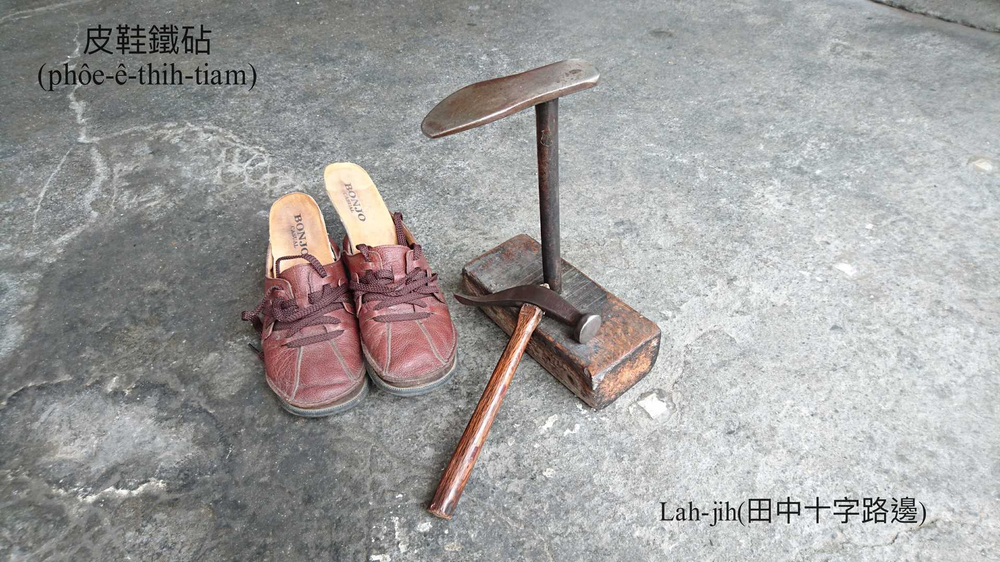
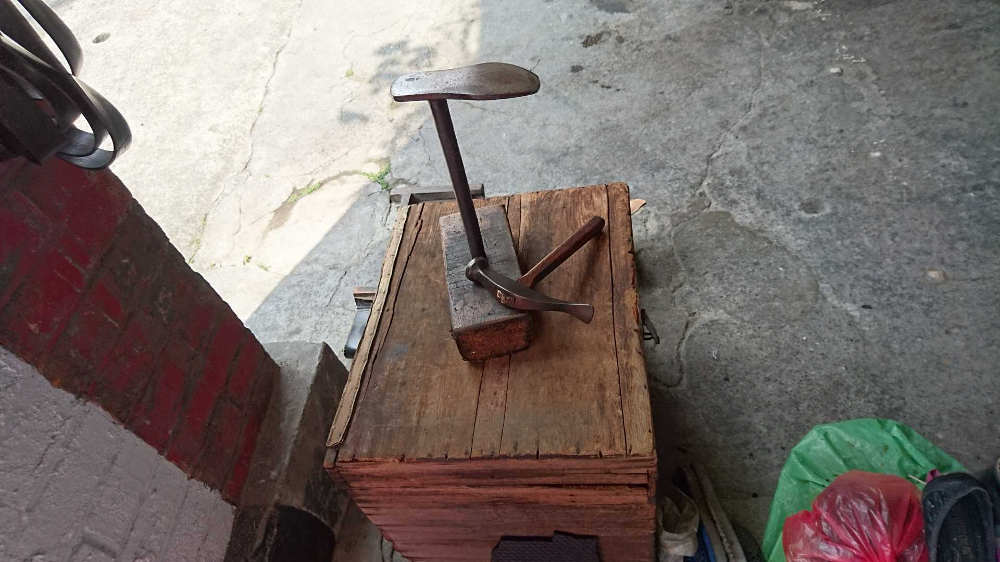

## 4-2. 修理皮鞋ê裁縫車／Mi-sín
> **Siu-lí Phôe-ê ê Chhâi-hông-chhia/Mi-sín**

Kō͘腳lo̍p，kō͘手絞，1針1線ûn-ûn-á車，bē-tàng急，修理皮鞋ê師傅lóng bē急性，作穡專注功夫慢。
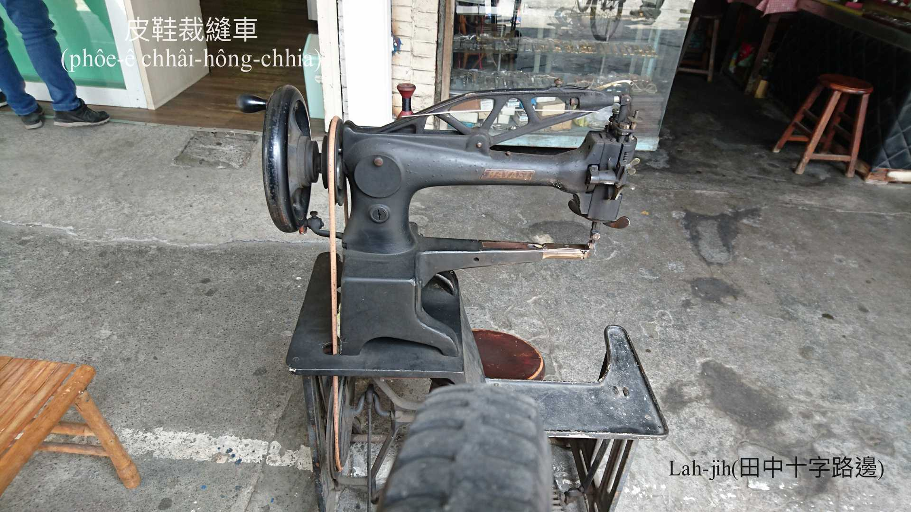
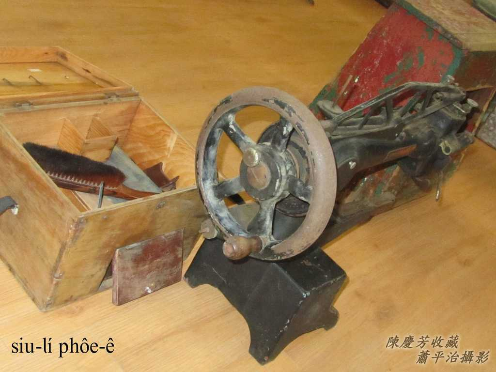
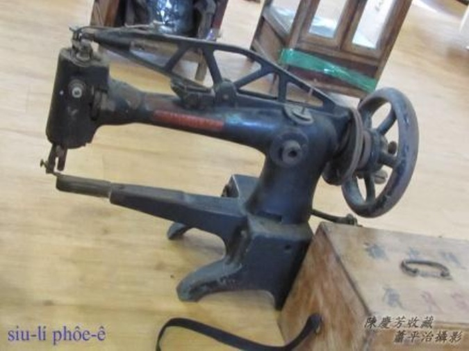

## 4-3. 工具箱
> **Kang-khū-siuⁿ**

車、thīⁿ、鑽、lak、釘，割、鉸、kòng、抹、lù、漆、chhit，各種家私，原料，ta̍k項有。
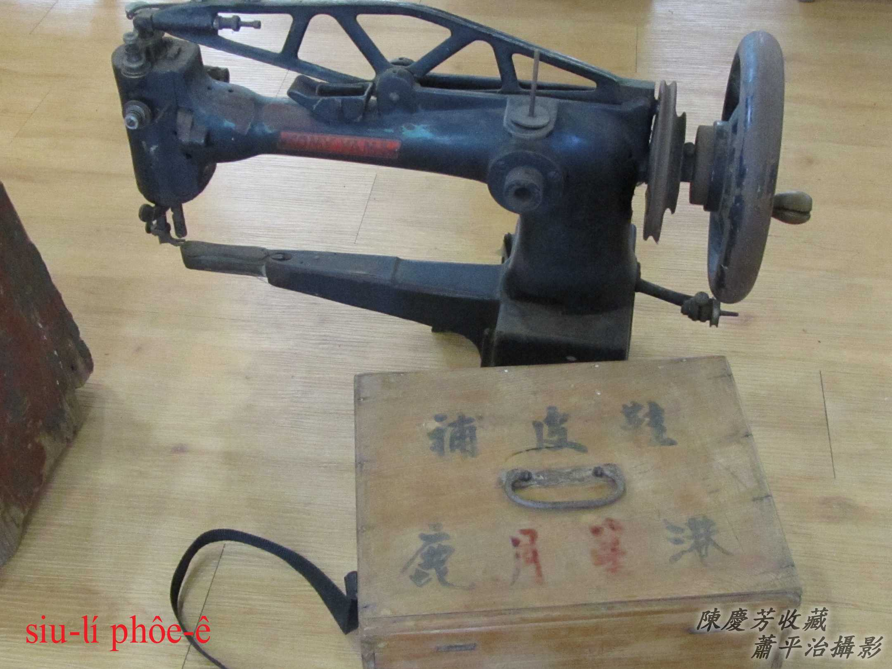

皮鞋是無規則ê立體皮質，tēng koh韌，需要大支車á針，大條粗勇m̄驚水ê車線，針台所在需要好轉se̍h，適合無kāng所在無kāng方向ê車thīⁿ。
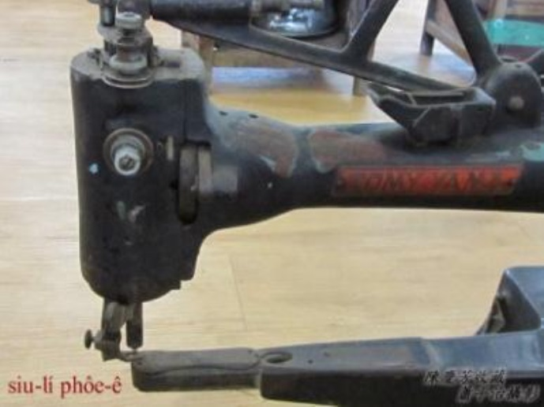

除了用腳lo̍p，mā ē-sái-tit用手絞，帶動tín動。
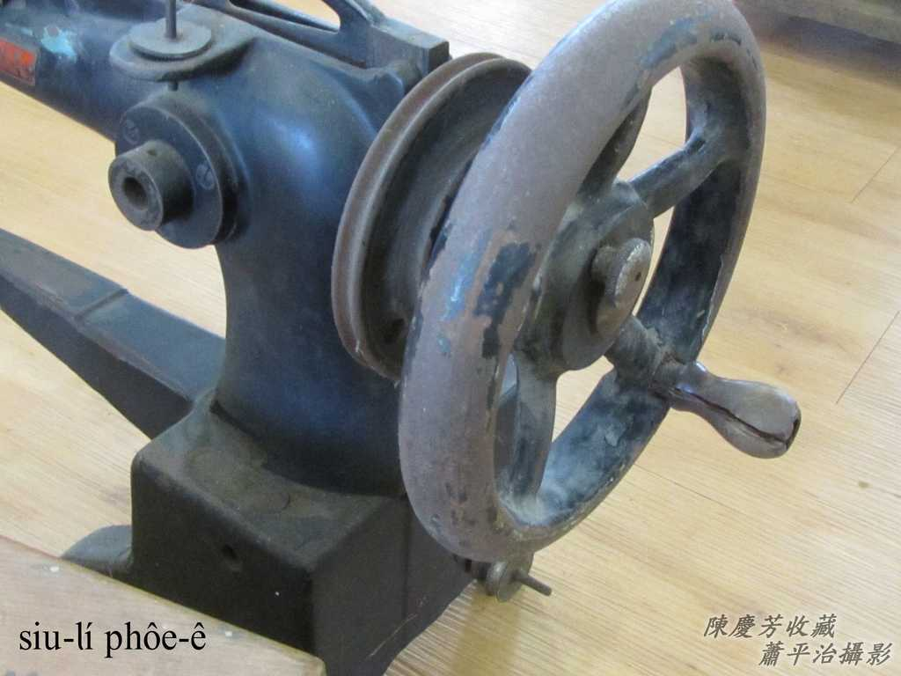

## 4-4. 椅頭á
> **Í-thâu-á**

柴椅á，ē-tàng khǹg物件mā ē-tàng hō͘人客坐。
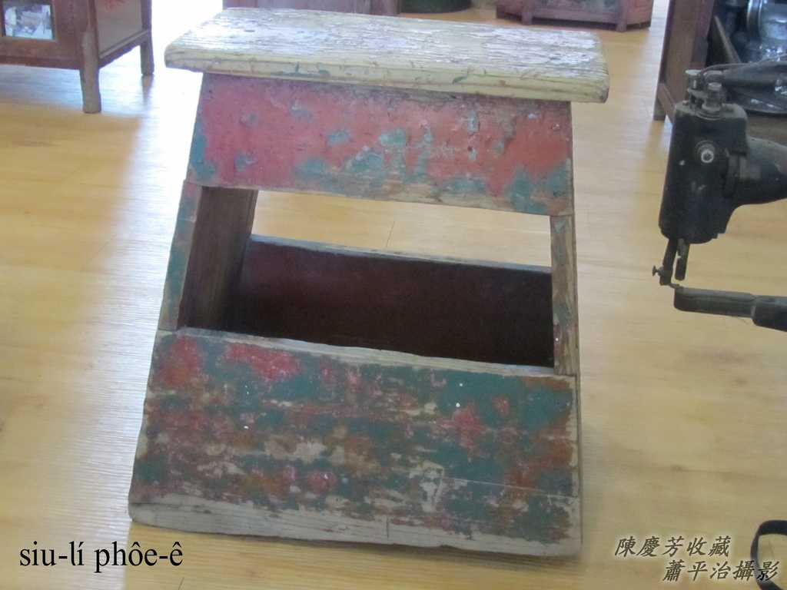

Chit隻低籐椅是師傅作穡坐--ê。
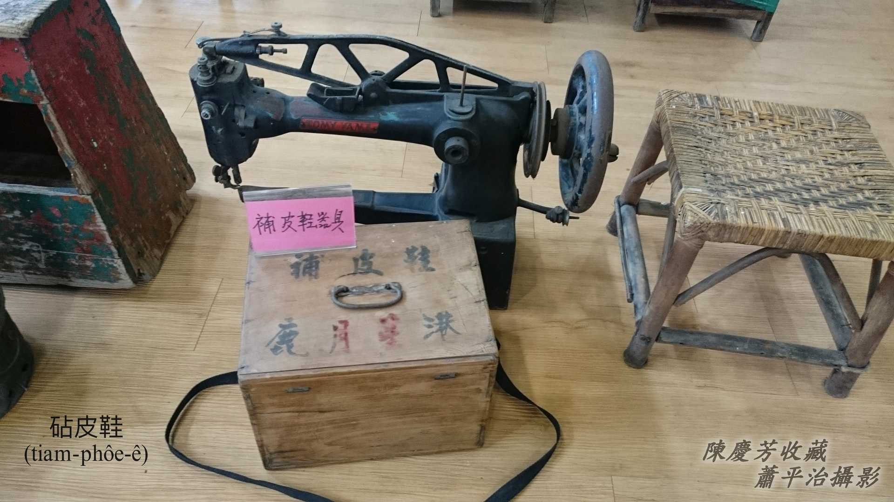

## 4-5. 舊相片ê故事
> **Kū Siàng-phìⁿ ê Kò͘-sū**

1960年代台中師範學生宿舍涼亭腳ê補鞋阿伯，長期為學生服務，趁淡薄á生活費用。一鑽一線，一釘1-tûi，thīⁿ裂chōa，tèng後teⁿ，補破khang。

家私一大堆，tèng皮鞋底需要鐵釘kòng槌á，kap hit台siāng重要ê皮鞋砧á（tiam-á），kā鞋套tiàm鞋台，加真好做khang-khòe。因為學生有皮鞋mā有布鞋，所以阿伯mā ē補布鞋，順sòa賣鞋油、鞋帶⋯。

下課時間，阮定定kap伊phò-tāu開講，阿伯lóng頭lê-lê，穡頭ná做bóng kap阮講話。50外年經過，猶原懷念hit段日子，hit位砧皮鞋阿伯。

# 5. 註解
> **Chù-kái**

|**詞**|**解說**|
|都合|日來詞，to͘-ha̍p，tú好ê機會。|
|鼎phí|Tiáⁿ-phí，『鍋巴』。|
|lúi釘|『鉚釘』。|
|mi-sín|ミシン，裁縫車。|
