# 古早ê藝術家
> **Kó͘-chá ê Gē-su̍t-ka**

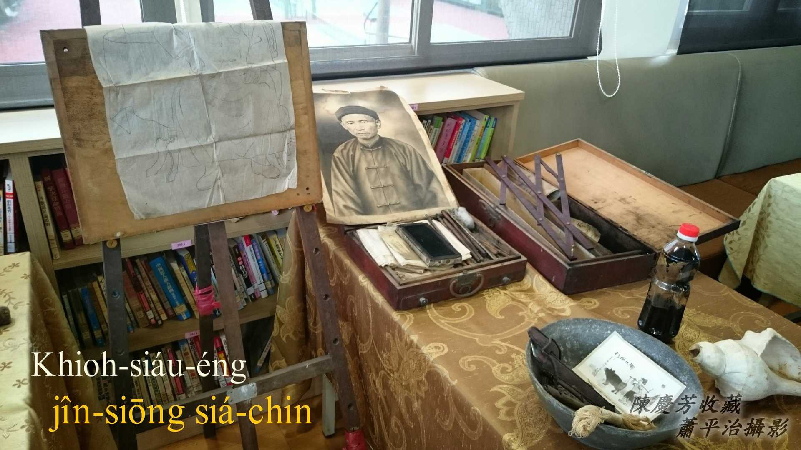

# 1. Khioh小影
> **Khioh-siáu-éng**

簡單講to̍h是畫人像，是一種應用儀器kā細張寫真放大，用筆畫相片ê藝術。

Khah早相機裝底片翕烏白相片ê品質m̄是hiah好ê時代，底片lóng tio̍h koh用鉛筆做修整，chit種giâ筆修整ê功夫叫做「khioh」，所以chit-ê「khioh」有修整、畫ê意思。

請教翕相師ê說明：烏白底片ê修整叫做修面、khioh面、修底片，用4B鉛筆tī chhiō光ê霧玻璃頂1筆1筆1點1點khioh，目的是boeh kā烏斑、thiāu-á子、粒á khî、jiâu痕khàm掉，thang hō͘面容koh khah光生súi-tang-tang。

古早人翕一張相無簡單，boeh放大一張相片koh-khah無簡單，錢銀、技術lóng是問題。厝內老大人tī過身進前，想boeh有一張寫真排tiàm siàng-têng（相亭）thé-biān（體面）--一-下，mā thang留hō͘序細siàu念，to̍h ē chhōe出細張相片「Khioh小影」，畫一張大張相做準備。古早人對死亡非常重視，「Khioh小影」主要是做遺像用，mā叫做「Khioh大壽」。

## 1-1. 完成Khioh小影ê作品
> **Oân-sêng Khioh-siáu-éng ê Chok-phín**

面容真實，ká-ná翕相，本島衫布鈕、衫身liap-kéng陰影有khah強調，kap翕相iáu是有差別。

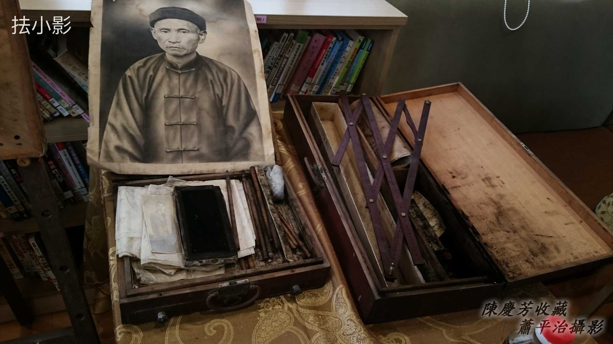

## 1-2. 畫圖放大尺
> **Ōe-tô͘ Hòng-tōa-chhioh**

畫圖放大尺是khioh小影siāng重要家私，完全按比例放大，減少失真，欠缺美術教育ê年代，「畫了有sêng」tī大部份人來講是真重要。
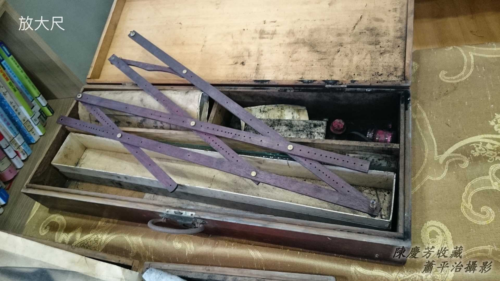

## 1-3. 墨盤kap毛筆、鉛筆
> **Ba̍k-pôaⁿ kap Mô͘-pit, Iân-pit**

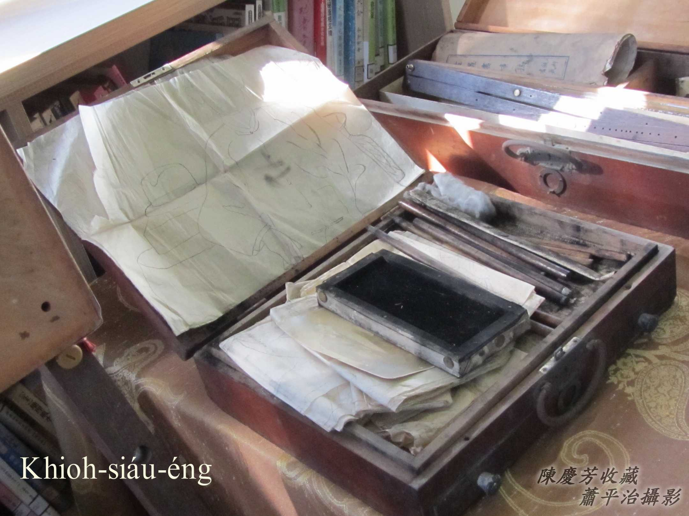
因為是去人chhù-tau到位服務，所以家私頭á需要裝箱搬徙。箱á ná皮箱，有kōaⁿ耳。
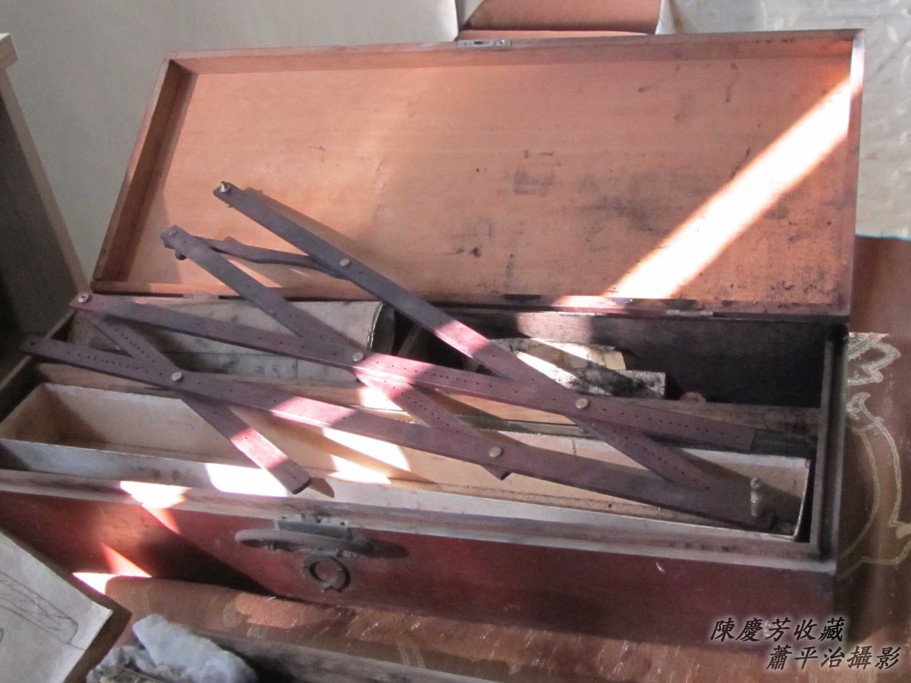

畫架。
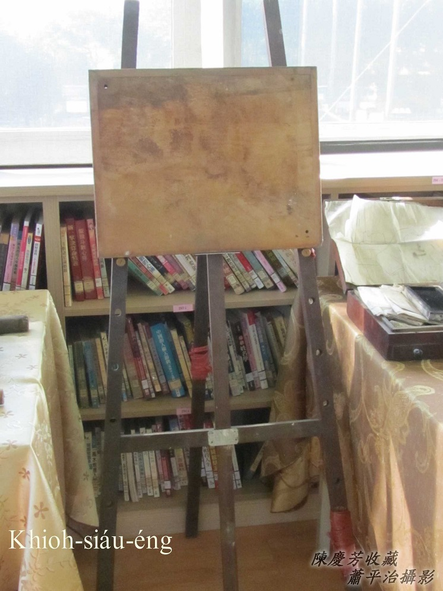

# 2. Lia̍p雞母狗á
> **Lia̍p-ke-bó-káu-á**

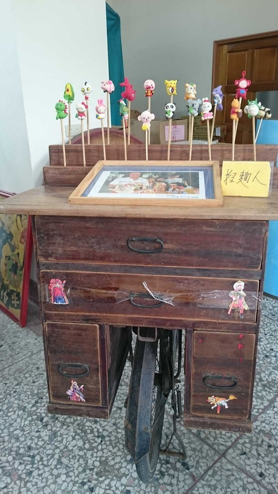

Lia̍p雞母狗á to̍h是「捏麵人」（lia̍p-mī-lâng），mā有講lia̍p chu̍t米尪á，是一項傳統民俗gín-á thit-thô物。

材料是chu̍t米粉lām麵粉加色料，jio̍k-jio̍k nóa-nóa做ná粿粞khiū-khiū ê麵丸，黃紅烏白ta̍k色有。

師傅先捻一塊白色麵丸，kō͘手so-so lia̍p-lia̍p lia̍p 1-ê身軀身，黏tiàm竹chhiám頂，chiah koh用無kāng色ê麵丸，so-so lia̍p-lia̍p做成腳手、ām-kún頭殼，嘴目鼻、衫á褲⋯，lia̍p siáⁿ sêng siáⁿ，無1-tah久á，一隻猴山á、一隻雞á、一隻鳥鼠á、一隻牛，a̍h是一仙秀才、一仙關老爺giâ大刀⋯to̍h馬上插tiàm架á頂，siâⁿ一寡gín-á兄gín-á姊倚--來，金kho̍k-kho̍k ê眼神，金金看，ûn-ûn-á等。

He lia̍p雞母狗á ê師傅真正是藝術家，免畫圖免寸尺，簡單雙手一支細支鉸刀kap小家私，to̍h有法度創造出古冊內ê人物，十二生相鼠、牛、虎、兔、龍、蛇、馬、羊、猴、雞、狗、豬kap果子菜蔬各種無kāng造型。

Lia̍p雞母狗á m̄-nā是gín-á thit-thô-mi̍h，mā是gín-á嘴食物，買來sńg-sńg lāng-lāng--leh，趁iáu未臭酸進前to̍h ka食掉，有夠bô-chhái，nā m̄食，iū-koh感覺phah-sńg人ê物。

## 2-1. Lia̍p雞母狗á是擔á生理
> **Lia̍p-ke-bó-káu-á sī Tàⁿ-á Seng-lí**

設計1-ê ē-tàng工作ē-tàng插成品ê工作台，kah tiàm鐵馬後載，tá-ūi有鬧熱to̍h來去tá位趁食。
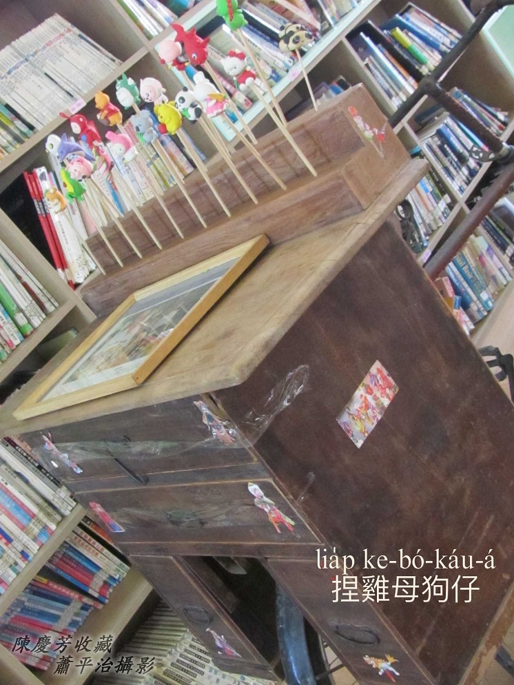
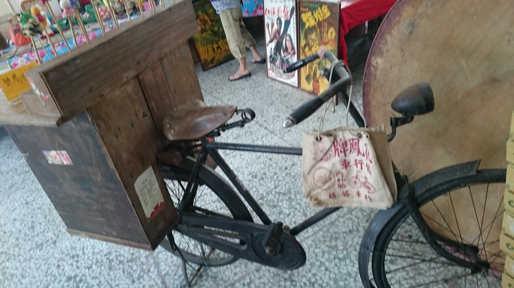

Lia̍p好ê lia̍p雞母狗á，色水鮮chhioh，造型活潑古錐，gín-á看--tio̍h to̍h真kah意，ka-tī無錢to̍h纏有錢ê序大買1 sian來sńg。
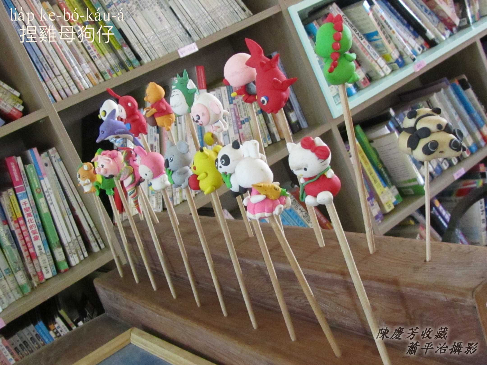
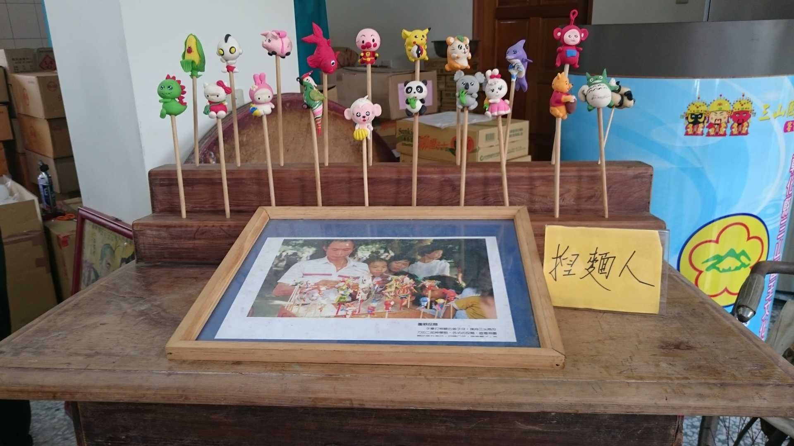
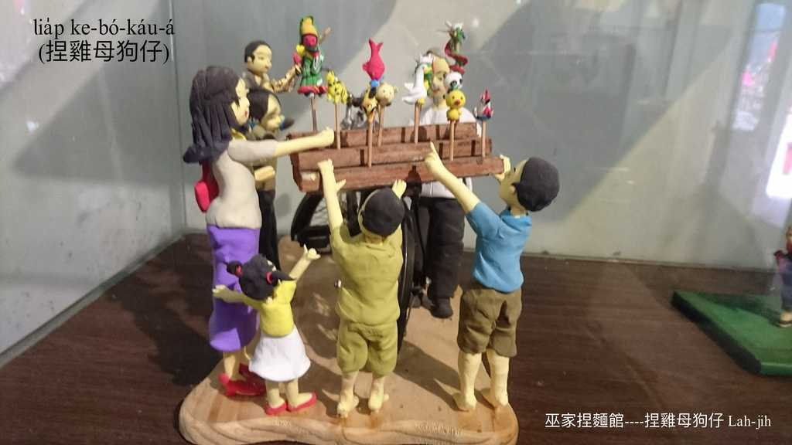

擔頭á kah tiàm鐵馬後載，流動性kài便利，早期鐵馬土chhāi-á chhāi正正，真在，tiàm頂面lia̍p雞母狗á無問題。
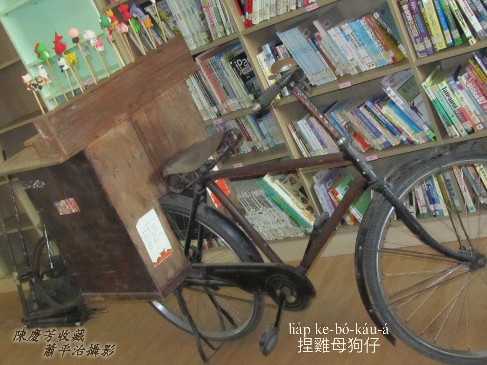

# 3. 註解
> **Chù-kái**

|**詞**|**解說**|
|thiāu-á子|『青春痘』。|
|chhiō|直線照光。|
|粒á-khî|『皮膚病疤痕』。|
|jiâu痕|Jiâu-hûn，『皺紋』。|
|畫了有sêng|『畫得很像』。|
|土chhāi-á|『腳踏車腳架』。|
|本島衫布鈕|早期台灣人穿ê對襟á（tuì-khim-á衫）。『一種舊式衣服的款式。兩襟相對，而且胸前有一排布質鈕扣。』|
|liap-kéng|『衣服或裙子打摺』。|
