# 古早ê醫療
> **Kó͘-chá ê I-liâu**

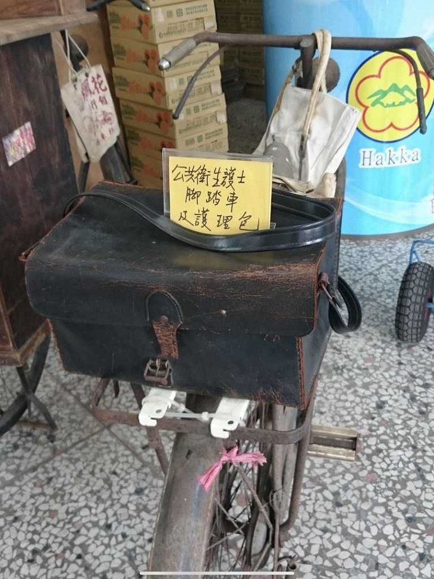

Kì-tì中，gín-á時代，tn̄g-tio̍h頭殼gông腹肚疼，lóng-mā食壁頂便藥包，nā是破大病ah-sī khioh-gín-á生kiáⁿ，chiah ē街路叫醫生產婆。Sàn-chhiah年代醫療落伍狀況下，咱來看古早人án-chóaⁿ面對身苦病痛？

# 1. 往診kap Khioh-gín-á
> **Óng-chín kap Khioh-gín-á**

生老病死人生過程，紅嬰á出世ê生，老mo͘h時ê衰lám，寒--tio̍h a̍h是食pháiⁿ腹肚ê病疼，死亡前ê急救，lóng足需要醫師診斷kap藥物治療。

古早步步雙腳行路ê時代，醫藥koh無發達，破病boeh hō͘醫生看，cha-bó͘人來洗ê月經絞疼，蛀齒疼，感--tio̍h頭殼疼，ē-lún--tit to̍h忍，厝內便藥á食食--leh，bē-lún--tit to̍h趕緊去醫館叫醫生來厝--裡看症頭。

Tn̄g-tio̍h婦人人boeh khioh gín-á生kiáⁿ，to̍h直接派人去街路chhiàⁿ產婆來厝--裡接生，m̄-chiah古早彰化和á先賴和醫生，ka-tī自稱「走街á仙」，醫生產婆為tio̍h醫療，真正服務到厝，有時三更暝半mā tio̍h行，實在辛苦，實在hō͘人敬佩。

醫生、產婆是hō͘人感恩敬重ê行業，boeh chhiàⁿ醫生產婆，當然chhiàⁿ轎伺候，chhiàⁿ人力車來載，有ê醫生產婆ka-tī ē騎鐵馬往診，koh-khah方便快速。往診家私無方便chah chiâu-chn̂g，總--是來到厝--裡，已經是hō͘患者減少真chē麻煩。

下面ē紹介醫生往診，產婆khioh gín-á ê儀器、家私、器具。

## 1-1. Io桶
> **Io-tháng**

腰桶，生kiáⁿ用ê柴桶á，古早cha-bó͘人生kiáⁿ是坐leh生；mā用來kā紅嬰á洗身軀。

產婆來厝--裡接生，產婦是倒tī眠床，所以chit kha io桶主要是kā嬰á洗身軀。
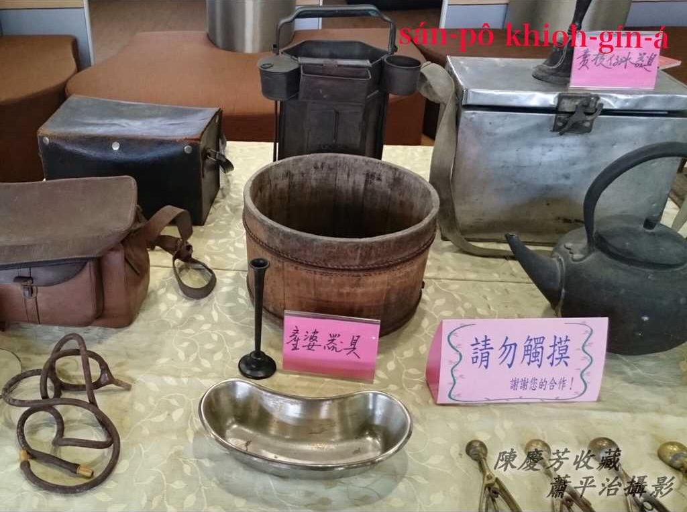
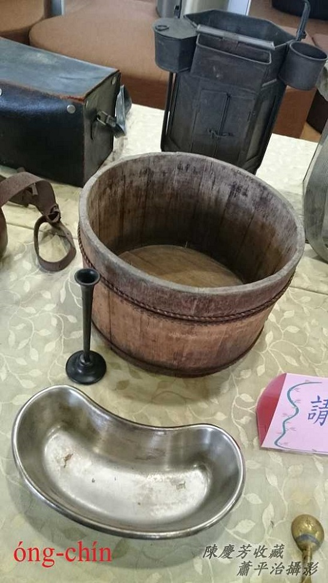  
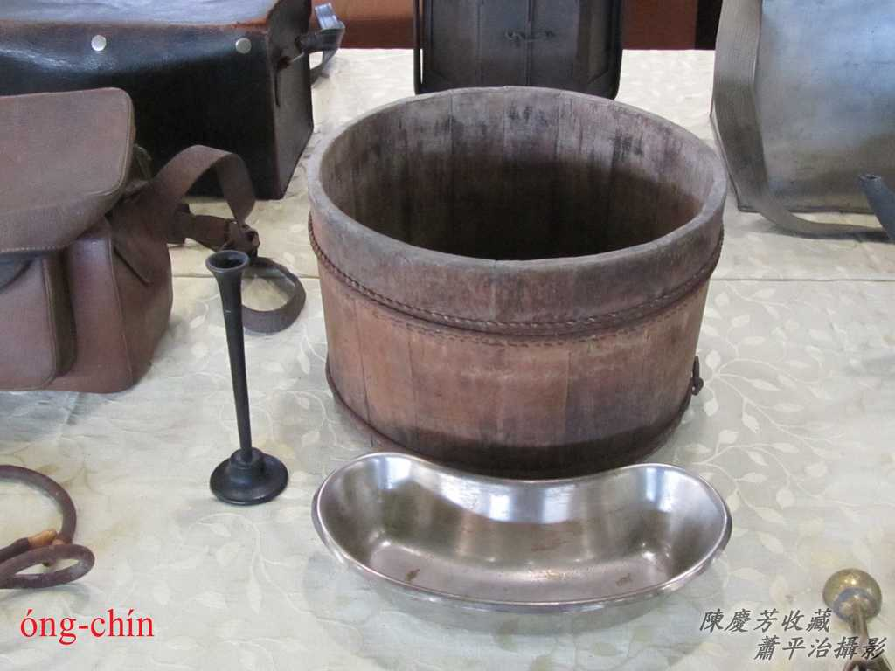

## 1-2. 注射劑玻璃罐á（アンプル Ampoule）
> **Chù-siā-che Po-lê Koàn-á**

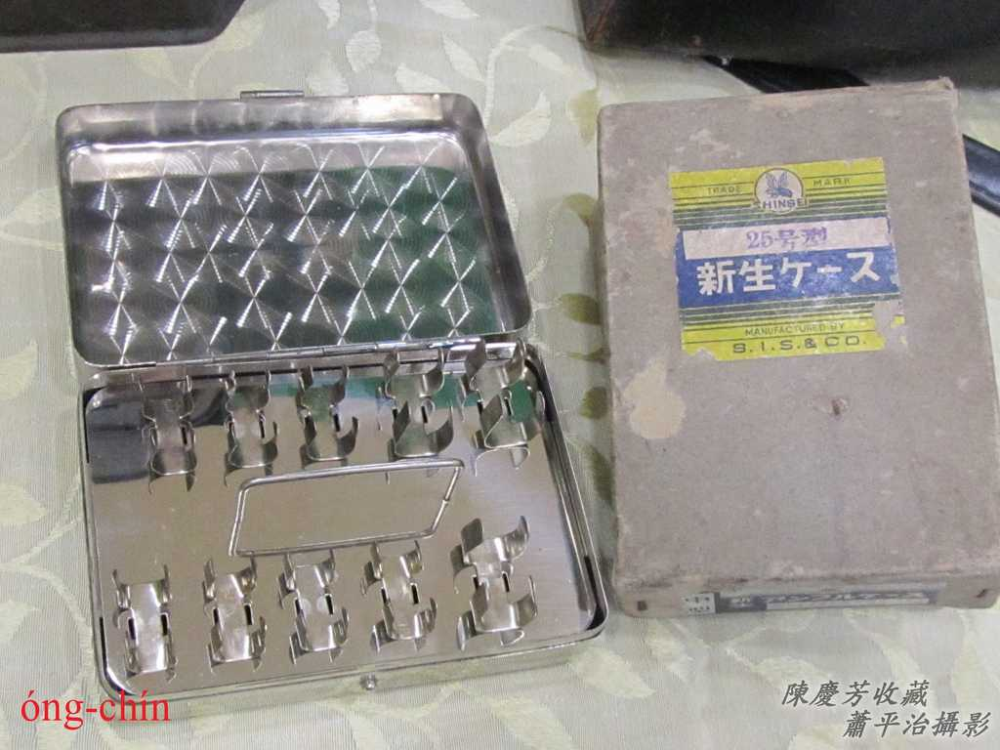

## 1-3. 診療Kōaⁿ桶
> **Chín-liâu Kōaⁿ-tháng**

消毒、診斷醫療儀器kap外用、內服藥物⋯lóng tī-chia，bē輸一間細間醫館設備，服務到位，家私chhoân齊備。

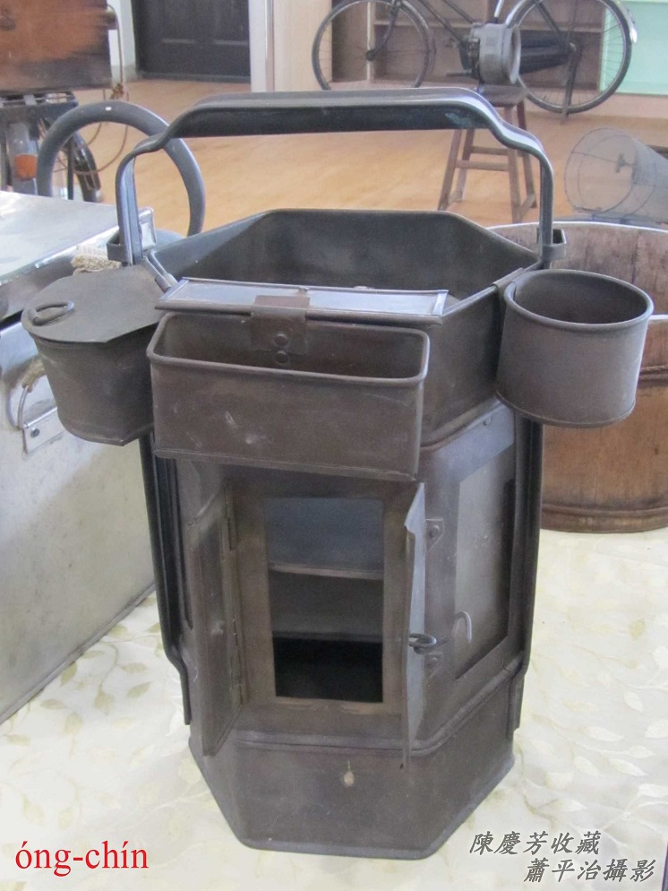
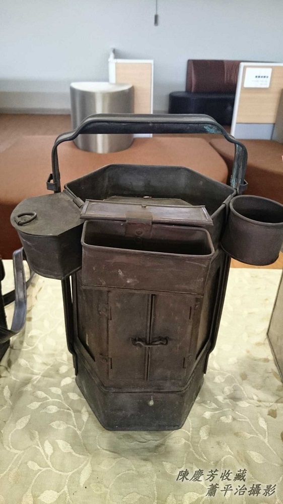

## 1-4. 聽筒kap彎盤 
> **Thiaⁿ-tâng kap Oan-pôaⁿ**

Thiaⁿ-tâng（聽筒）to̍h是thiaⁿ-chín-khì（聽診器）。

雞腸á型是聽心跳脈搏用，一般醫生lóng用ē tio̍h。
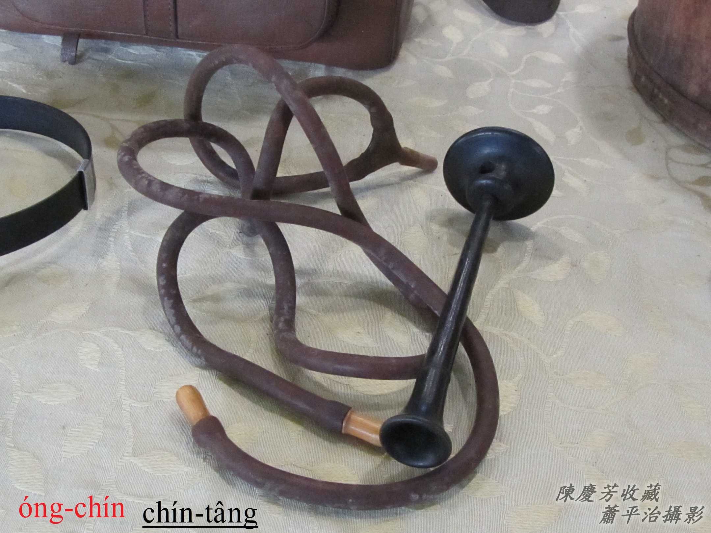

鼓吹型ê聽筒，號做胎心音器，是婦jîn-lâng有身，聽子宮內胎兒心跳用--ê，大頭hit pêng貼tī腹肚，細頭chit-pêng貼tī產婆耳khang。

腰子形ê彎盤mā講做腰子盤，tī外科醫療過程中暫時貯細項家私、液體a̍h是廢物。
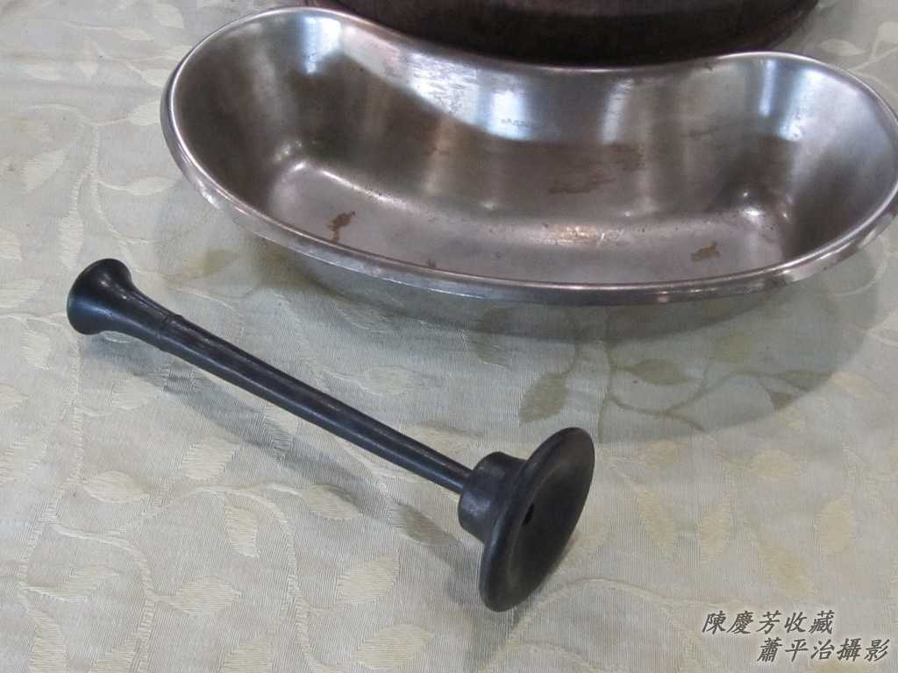

## 1-5. 頭鏡
> **Thâu-kiàⁿ**

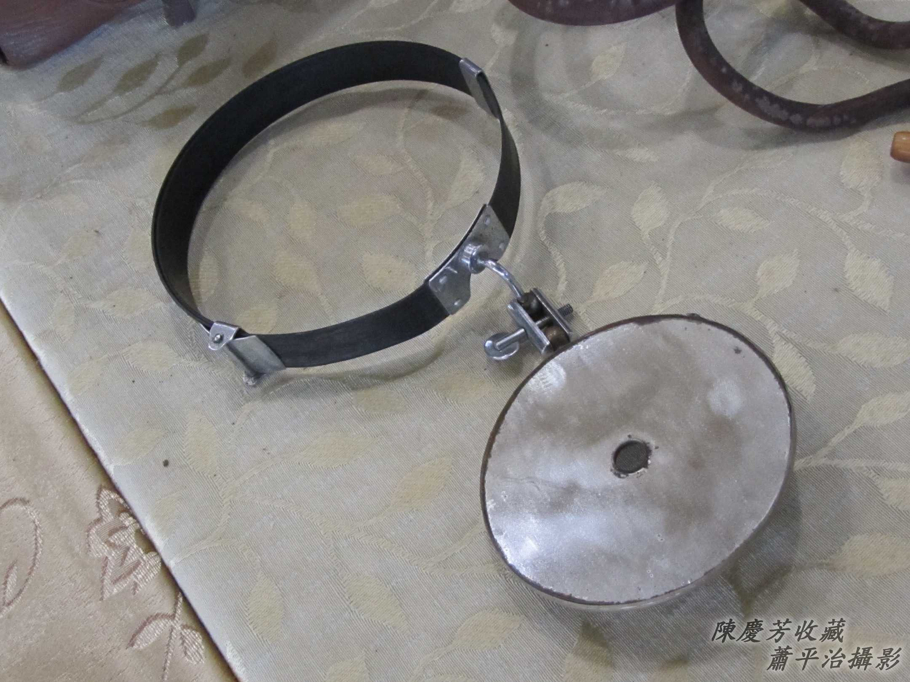

耳鼻喉科醫生專用，套tī頭殼頂，hit ê lap鏡ē-tàng收集光線chhiō入耳khang、鼻khang、nâ-âu詳細看清楚。

Chit-kâi圓鏡是lap鏡，有聚光作用，m̄是『凹透鏡』，中央有1-kâi圓khang，ē-sái-tit hō͘目chiu透過chit-kâi圓khang看--過-去，另外一ê真重要ê作用是，無boeh hō͘光線ê焦點集中，chiah bē傷tio̍h皮肉。因為有中央chit khang，lap鏡ê反射光線chiah無焦點。

## 1-6. 往診皮箱
> **Óng-chín Phôe-siuⁿ**

往診kōaⁿ ê皮箱，內面khǹg診斷醫療家私，nā boeh開處方箋提藥，需要家屬去醫生館提。
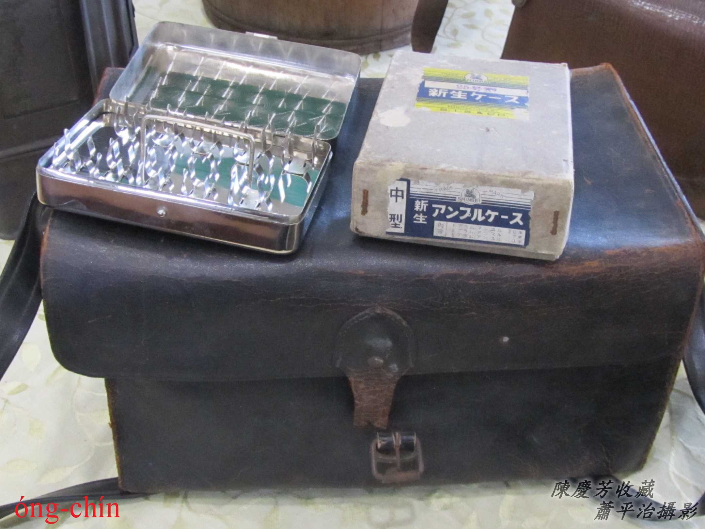
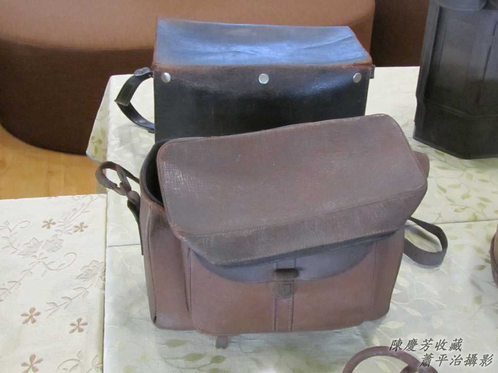

## 1-7. 茶鈷
> **Tê-kó͘**

Hiâⁿ燒水、滾水，產婆ka-tī準備，khah有衛生。Nā用煮食鼎鍋hiâⁿ水，恐驚有油垢鼎sian無清氣。
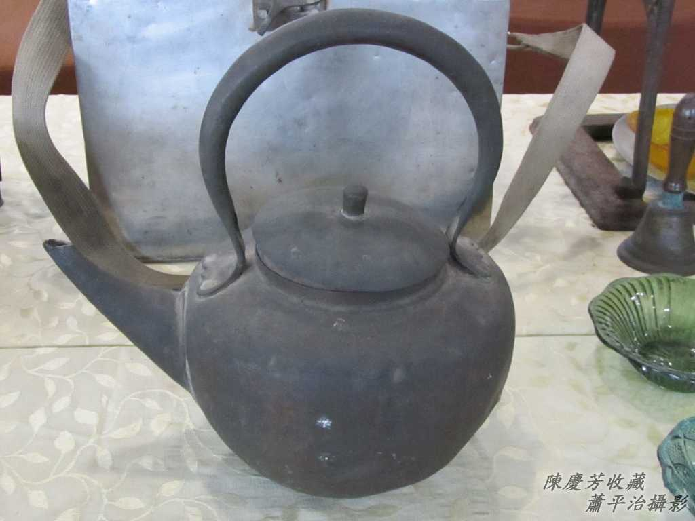

# 2. 寄藥包á
> **Kià io̍h-pau-á**

「阿爸，我leh頭殼疼！」→去壁tó͘頂「日本婆á標」藥lok-á tháu 1包感冒藥來食。
「阿爸，我leh腹肚疼！」→去壁tó͘頂「日本婆á標」藥lok-á tháu 1包胃sán來食。
「阿爸，我leh流鼻血！」→去壁tó͘頂「日本婆á標」藥lok-á tháu 1包感冒藥來食。

1950年代，壁tó͘時常吊4-5-lok藥lok-á，lóng是寄藥包á--ê寄（寄賣）ê便藥包，有用chiah納錢。寄藥包--ê一個月來1-chōa，點算數量收錢，順sòa增補。感冒藥、咳嗽藥、胃sán、止痛sán、五分珠、征露丸、萬金油、臭藥丸á⋯應有盡有，一味3包5包寄，捷用寄khah chē，無用寄khah少。細漢時常流鼻血，「日本婆á標」感冒藥食siāng chē，做衛生兵tī藥房kap藥á，chiah知hit味酸酸澀澀ê滋味，原來to̍h是a-sú-phí-lín。
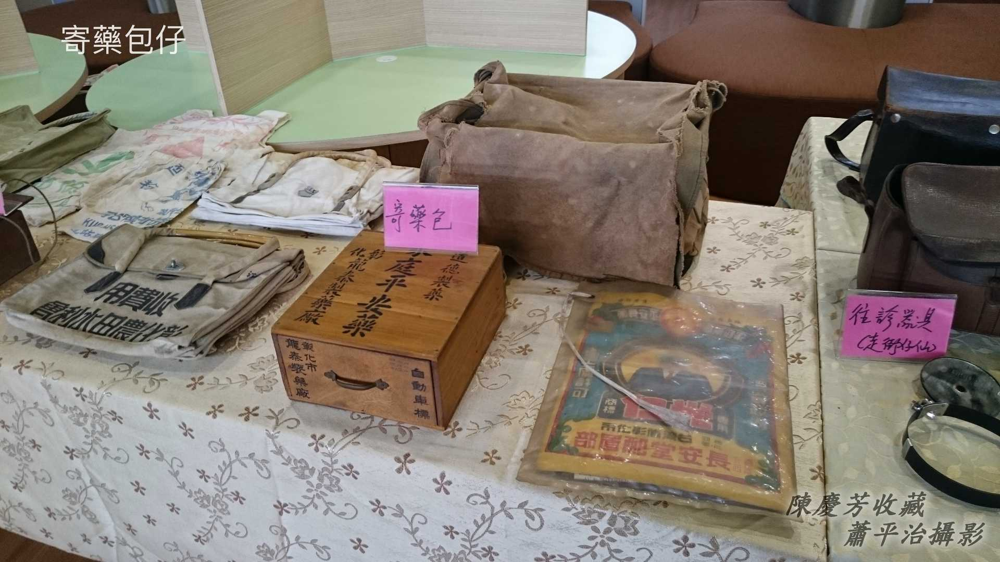

寄藥包á ê紙lok-á kap便藥包á。
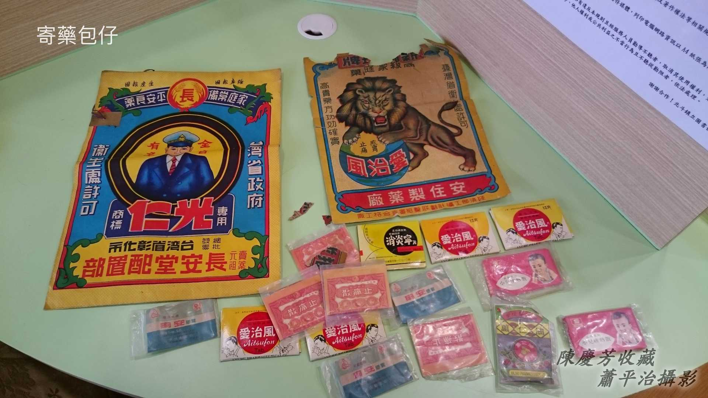

## 2–1. 寄藥包á ê紙Lok-á正面
> **Kià Io̍h-pau-á ê Chóa Lok-á Chiàⁿ-bīn**

Chhng一條耳á thang吊tiàm壁頂ê釘á。
- 強身報國 生產報國
- 仁光：專用商標
- 台灣省政府衛生處許可
- 賣藥元祖 長安堂配置部

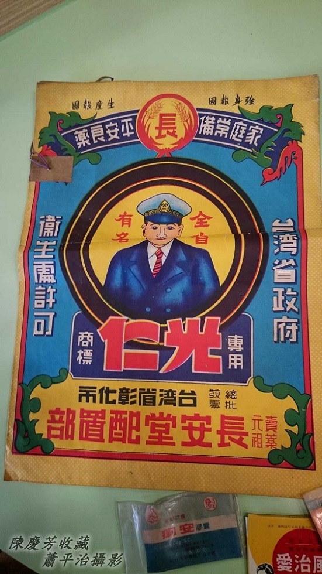

- 安住製藥廠
- 台灣省政府衛生處許可
- 高級藥方功效確實

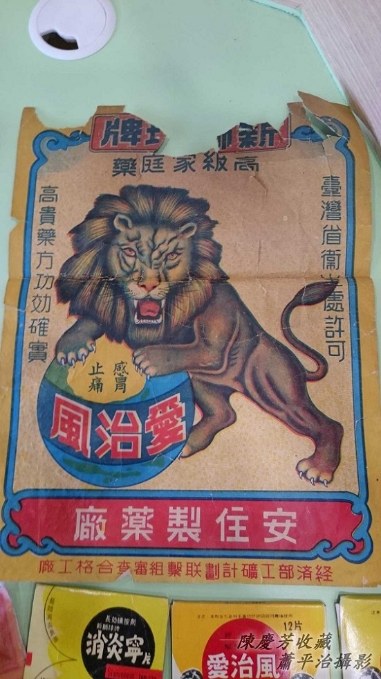

## 2-2. 寄藥包á ê紙Lok-á倒面
> **Kià Io̍h-pau-á ê Chóa Lok-á Tò-bīn**

預藥個數記：主治功效、方名、日期，單價、數量。
食物相剋圖表。

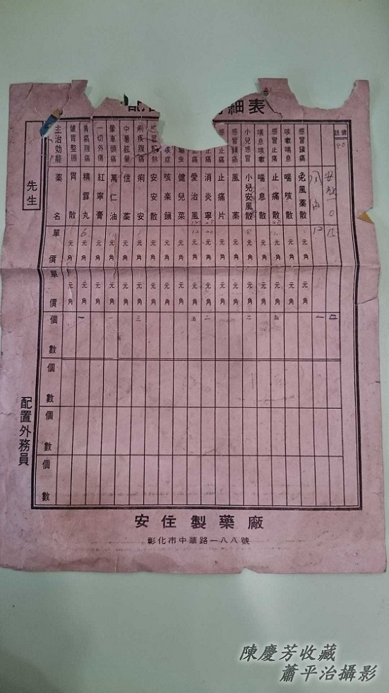

## 2-3. 便藥包á
> **Piān-io̍h-pau-á**

消炎寧（片）、止痛sán、愛治風（12片）、痢安（膠囊）、小兒咳熱sán、萬仁油。
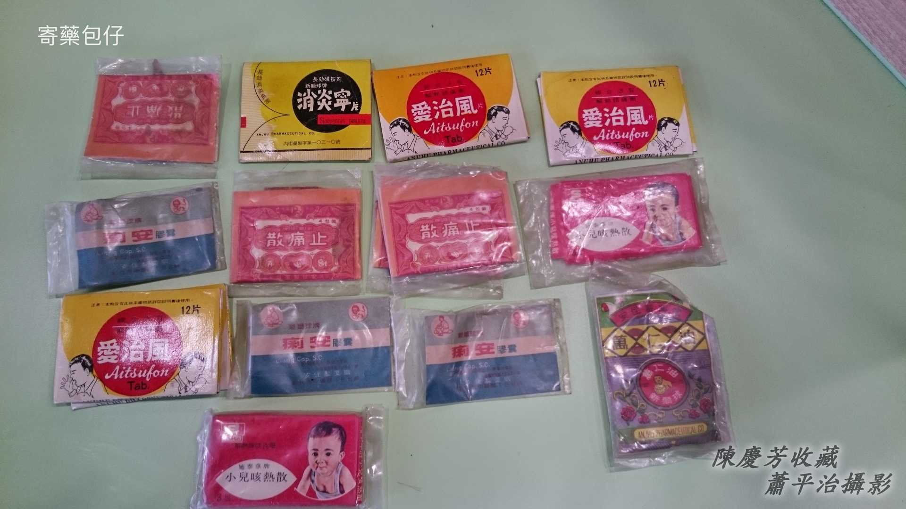
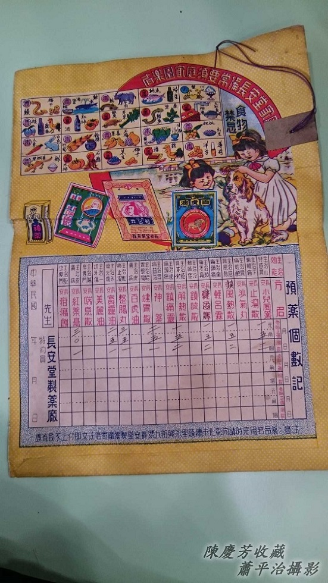

## 2-4. 帆布Phāiⁿ-á
> **Phâng-pò͘ Phāiⁿ-á**

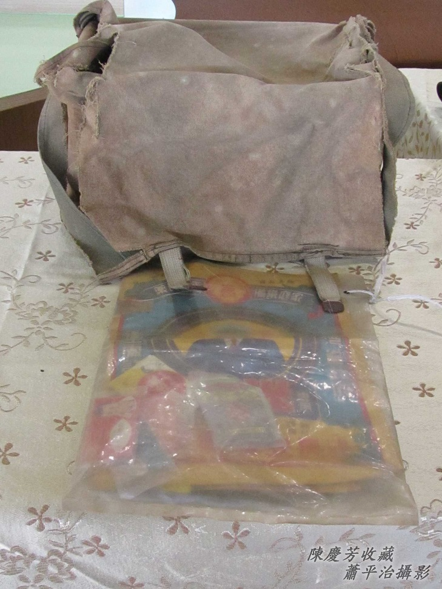
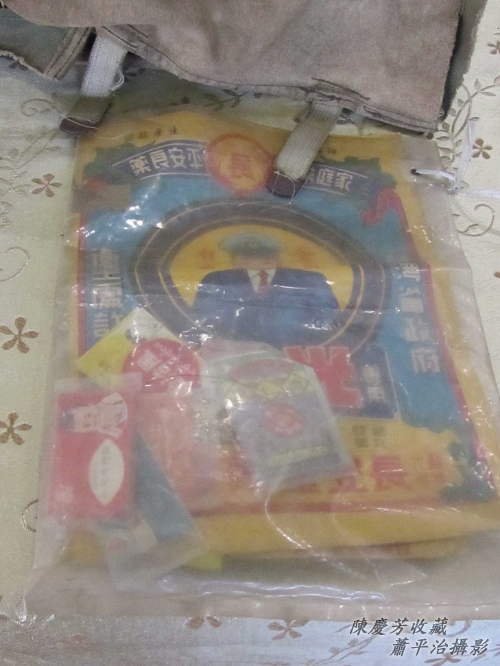

## 2-5. 藥櫥á
> **Io̍h-tû-á**

寄藥包á ê藥櫥á：可能是銷量khah chē ê用戶，藥廠特別送--ê。
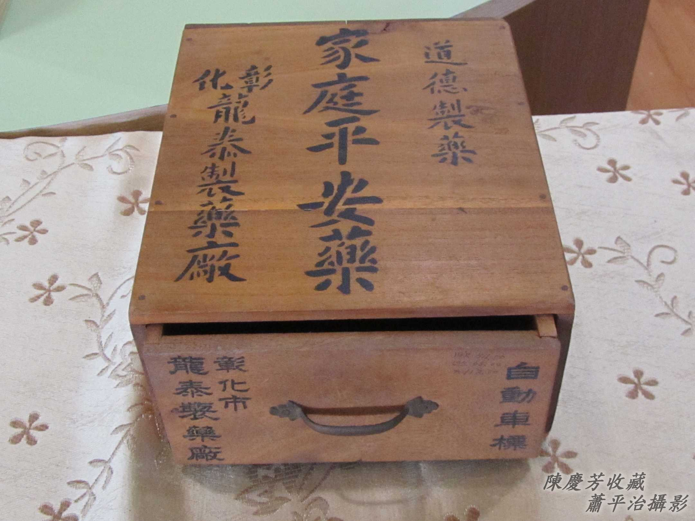

## 【Lah-jih散文】寄藥包á生理人Phāiⁿ藥á ê帆布Phāiⁿ-á
> **【Lah-jih Sòaⁿ-bûn】Kià Io̍h-pau-á Seng-lí-lâng phāiⁿ Io̍h-á ê Phâng-pò͘ Phāiⁿ-á**

寄藥包á--ê來到客戶厝內，來--者是客，thîn茶款待，點一支hun，phò-tāu--幾-句-à，壁頂藥lok-á提--落-來，tiàm桌頂tiàm眠床頂，1項1項點，1包1包算，感冒藥銷khah chē，加添10包，這胃sán已經寄2個月，kā你換新--ê，chit個月hō͘你開15 kho͘ to̍h好，平安是福，恭喜。Siàu記好，錢銀mā清楚，「Taⁿ我來走，多謝」！

Che寄藥包á ê先生，斯當時bē-su是庄腳人ê醫藥顧問，nā是錢銀三不便，ē-tàng賒欠，後月日chiah還，tn̄g-tio̍h無錢thang還，不得已lia̍h雞鴨還siàu。

# 3. 嘴齒疼
> **Chhùi-khí-thiàⁿ**

嘴齒疼m̄是病，疼--起-來ē叫a-niâ，講tio̍h去hō͘齒科醫生看，靈魂to̍h去一半，m̄-nā gín-á驚，大人大種kāng款驚kah無性命。蛀齒蛀tio̍h齒根，嘴齒iô-ló͘（搖櫓），齒根發炎，lóng是嘴齒疼ê原因，sió-khóa疼，ē-sái-tit食便藥á止疼，止疼nā是無效，有時tio̍h kā嘴齒挽掉。古早古早馬偕醫生siāng-gâu kā人挽嘴齒、治療嘴齒。

## 3-1. 腳踏車齒機
> **Kha-ta̍h Chhia-khí-ki**

這是古早「齒科治療儀器」，下面ê輪á帶動頂面齒科手機ê鑽頭、磨輪。

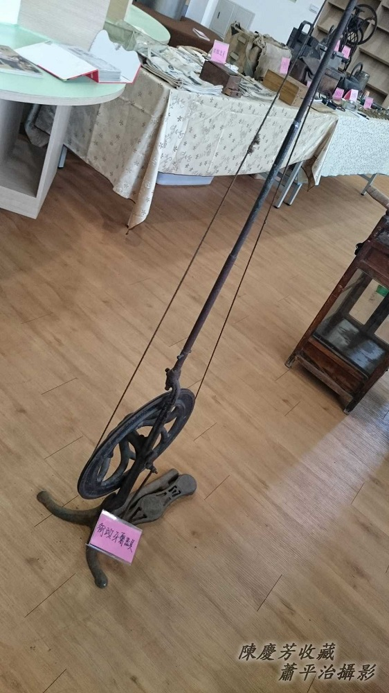

齒科醫生boeh kā患者車嘴齒a̍h是嘴齒lak khang時，需要一腳踏踏枋，親像踏mi-sín án-ne帶動手機轉se̍h，腳踏愈緊，手機ê鑽頭、磨輪to̍h轉愈緊，嘴齒感覺to̍h愈bē疼。

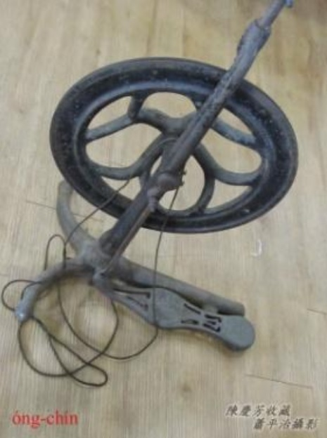

## 3-2. 齒科手機
> **Khí-kho Chhiú-ki**

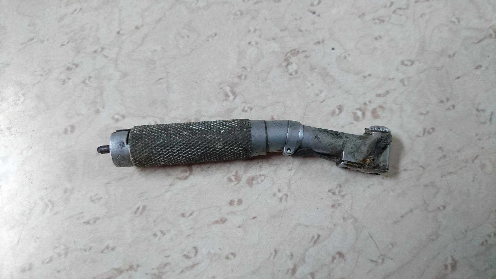

# 4. 廣告Phāiⁿ-á 
> **Kóng-kò Phāiⁿ-á**

1950年~1960年代台灣省衛生處家庭計畫推行委員會贈：『家庭計畫宜趁早  兩個孩子不算少』（家庭計畫tio̍h趁早，兩ê gín-á無算少。）
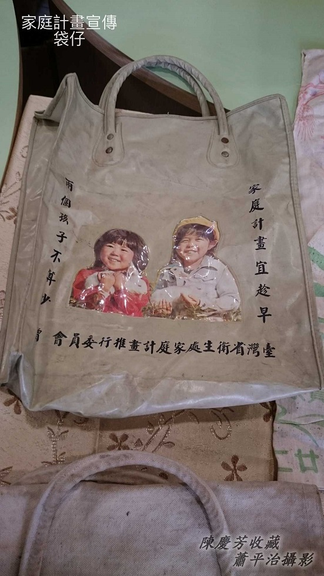

# 5. 註解
> **Chù-kái**

|**詞**|**解說**|
|lap鏡|Lap-kiàⁿ，『凹鏡』。|
|焦點|Chiau-tiám。|
|chhiō|直線照光。|
|請|Chhiáⁿ，免錢。|
|倩|Chhiàⁿ，開錢聘請。|
|chiâu-chn̂g|齊全。|
|nâ-âu|『喉嚨』。|
