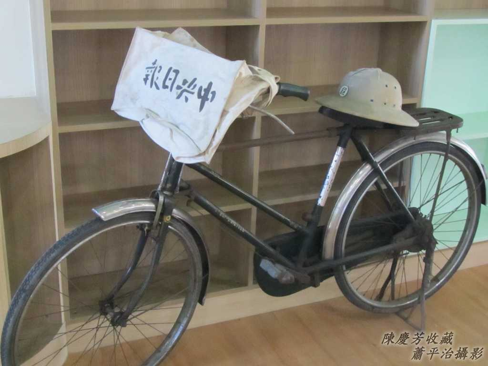
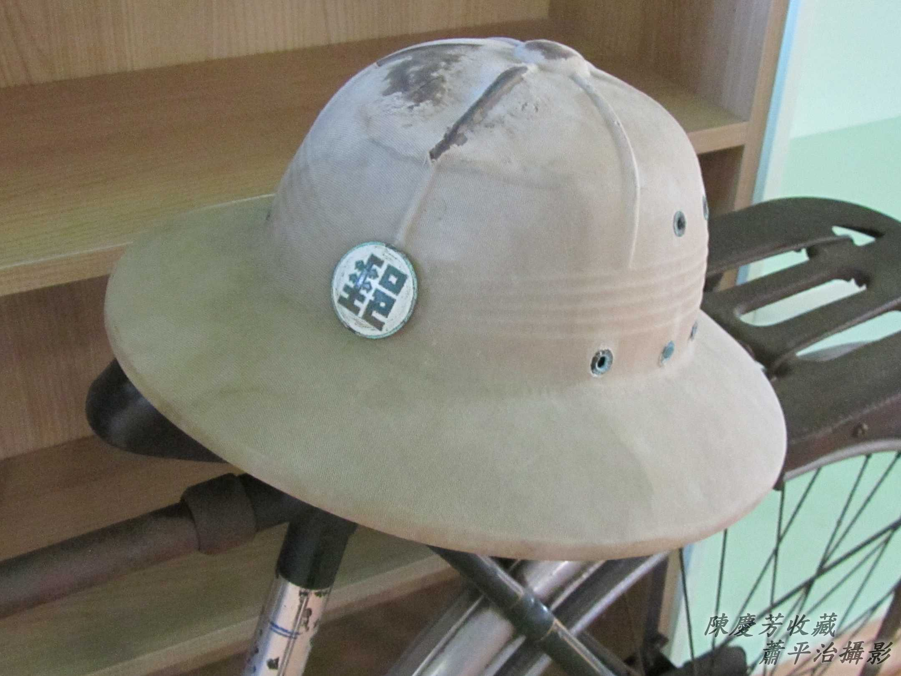
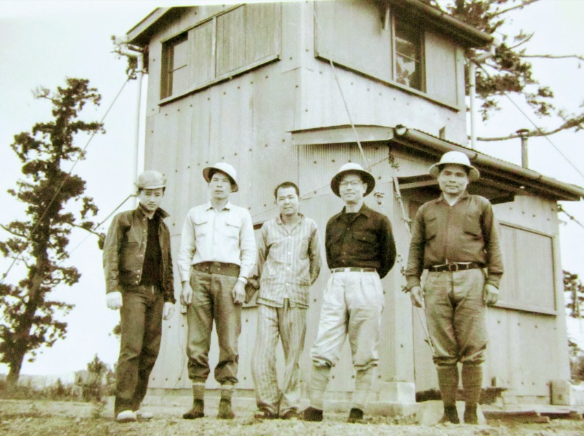
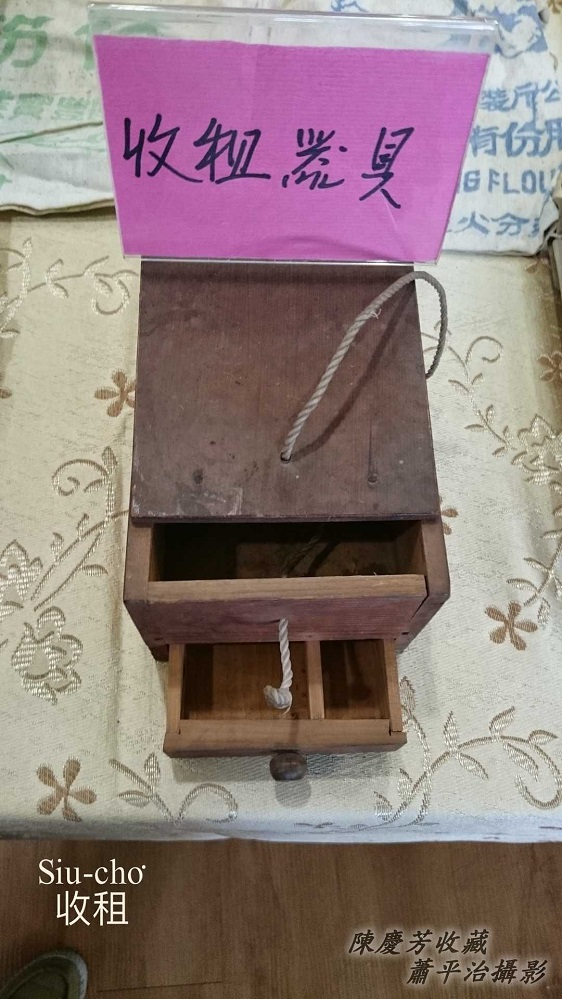
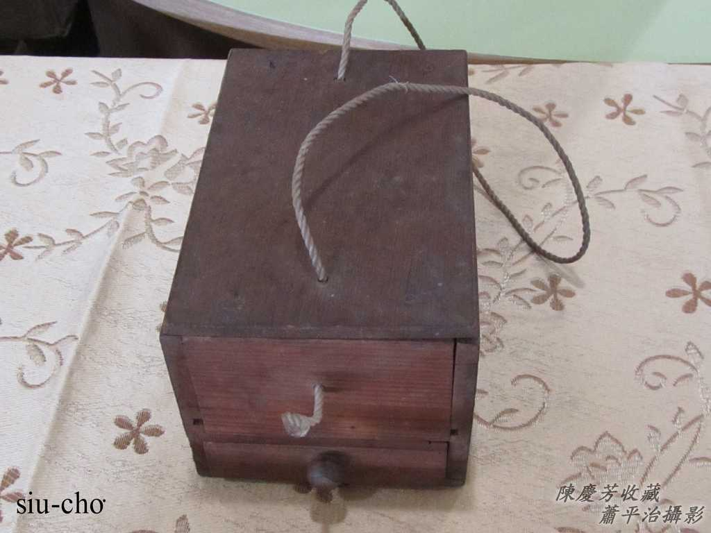
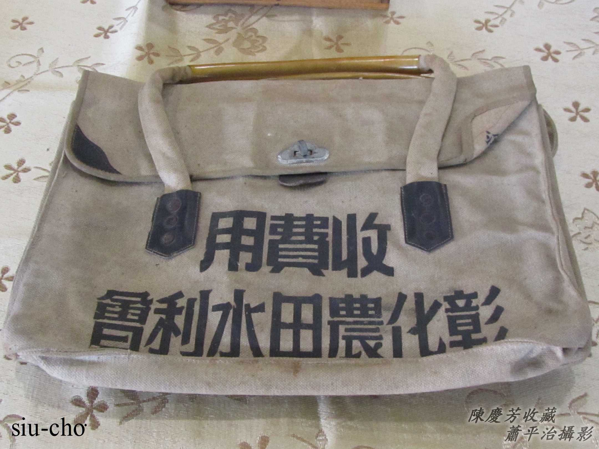
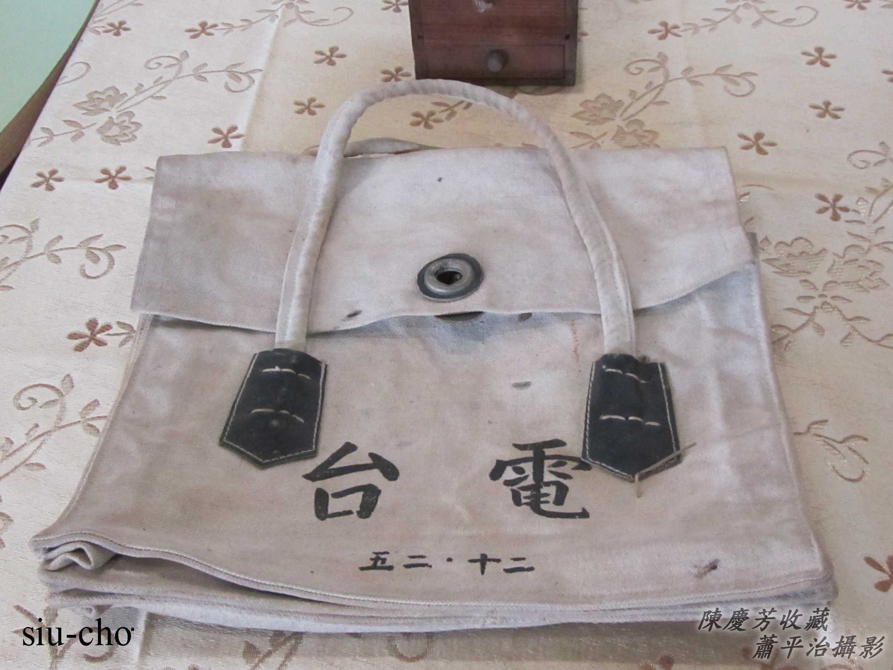
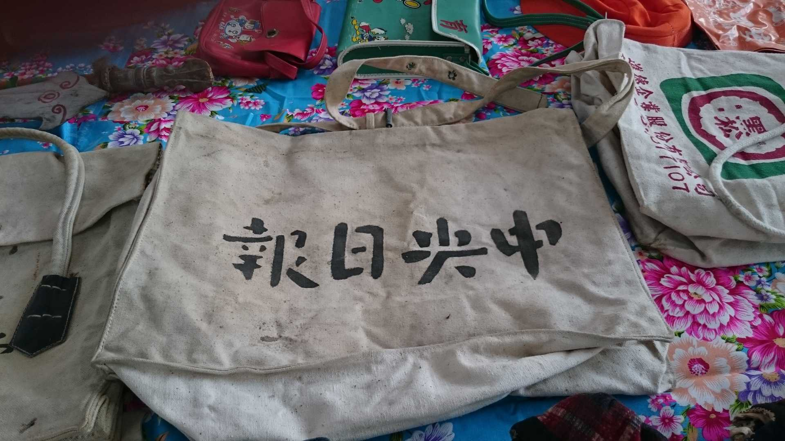
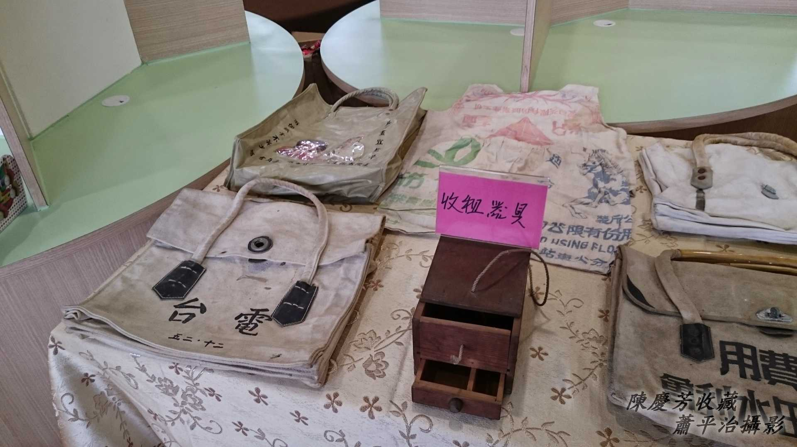

# 送報紙送批、收租
> **Sàng Pò-chóa Sàng-poe, Siu-cho͘**

# 1. 送報紙送批
> **Sàng Pò-chóa Sàng-phe**

1970年代進前，鐵馬是非常方便ê交通工具、載貨家私，送報紙--ê透早騎去火車頭等報紙到位，趕緊1份1份khioh好勢，khǹg tiàm鐵馬角á頂ê報紙phāiⁿ-á，趕時間1戶1戶送，店面1間1間tàn，快速liú-lia̍h，除了趁錢，mā趁一寡時間thang做其他khang-khòe。

## 1-1. 送報紙ê鐵馬kap帆布Phāiⁿ-á
> **Sàng Pò-chóa ê Thih-bé kap Phâng-pò͘ Phāiⁿ-á**

## 1-2. 郵差帽á
> **Iû-chhe Bō-á**

因為伊ê形體sêng匏hia，暫時提來貯水mā無問題，所以hō͘人講做匏hia帽a̍h是匏hia-khok，其實伊是一頂紳士帽。

Chit頂匏hia帽面頂有郵政標記，是送批--ê（郵差iû-chhe）leh戴--ê。早當時郵差送批mā是騎鐵馬，是郵局專用漆綠色ê鐵馬。

## 【Lah-jih寫真】

大兄hām木材行頭家戴pû-hia-bō（Plastic Pith Helmet）『杓帽』。

# 2. 收租
> **Siu-cho͘**

Khah早時常聽人講「中華民國萬萬稅」，有影to-tio̍h，地價稅、房屋稅、田賦、水租、電火料、電話料、水道錢⋯，chhām騎鐵馬、牽牛車、聽la-jí-o͘h（ラヂヲ／收音機）to tio̍h牌照納牌照稅。

古早作田人需要納水租，納田租，有ê納稻粟，有ê納現金，講做納錢糧。有人納租to̍h有人收租，私人租金私人收，公家機關收租to̍h有專人「到府」服務，nā是都合無tú好a̍h是欠siàu，納租ê人tio̍h ka-tī去khioh稅單位繳納。

## 2-1. 收租柴箱á
> **Siu-cho͘ Chhâ-siuⁿ-á**

Chit kha柴箱á可能是ka-tī釘，ē-tàng khǹg siàu單，ē-tàng貯銀票、銅錢（tâng-sián），chhng 1條黃麻索á phāiⁿ tiàm肩胛頭。

看一下真，hit條索á有機巧，穿過thoah-á面kap thoah-á連做夥，khǹg--落-去ē-sái-tit開，phāiⁿ--起-來免驚thoah-á ē落掉，實在有夠巧。

## 2-2. 帆布收租袋
> **Phâng-pò͘ Siu-cho͘-tē**

水利會公務員出門收水租。台電公務員出門收電火料。

# 3. 註解
> **Chù-kái**

|**詞**|**解說**|
|la-jí-o͘h|日來詞，ラヂヲ，『收音機』。|
