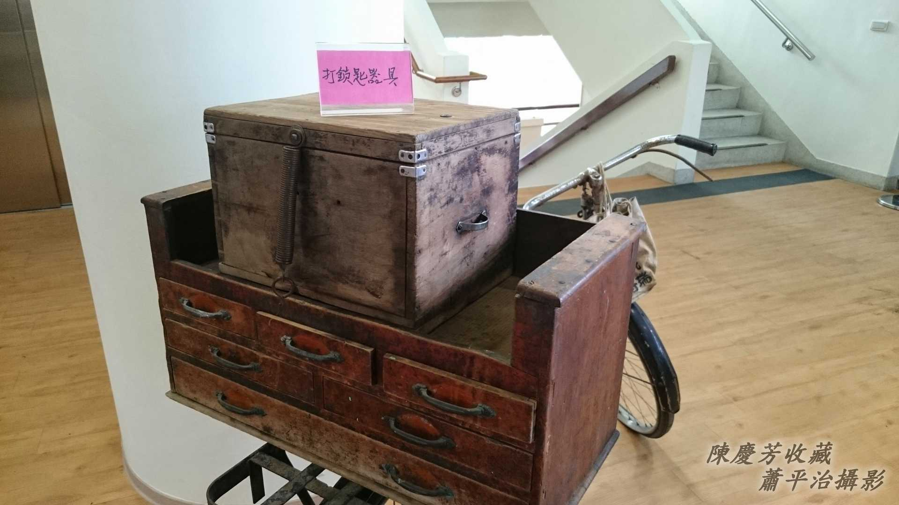
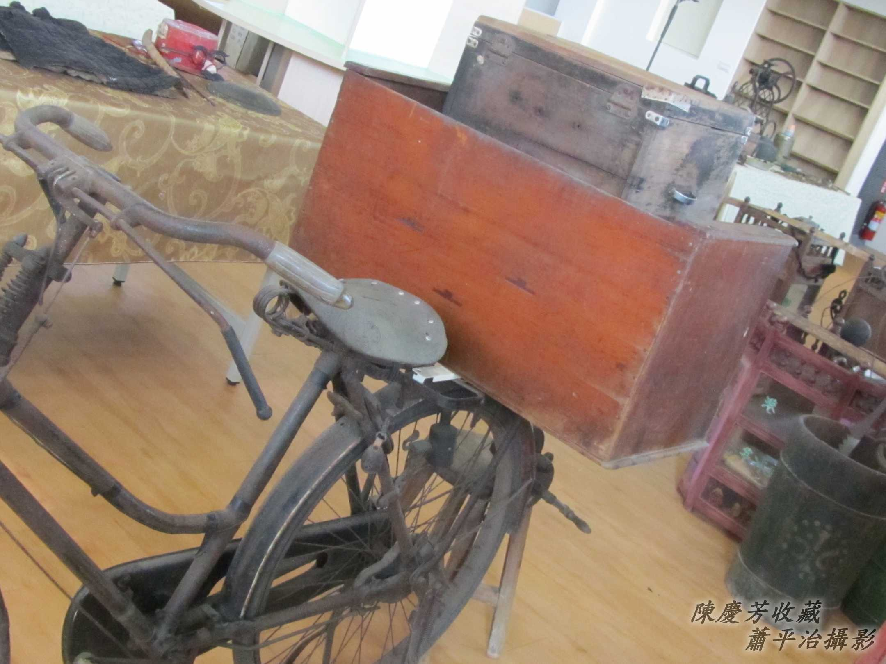
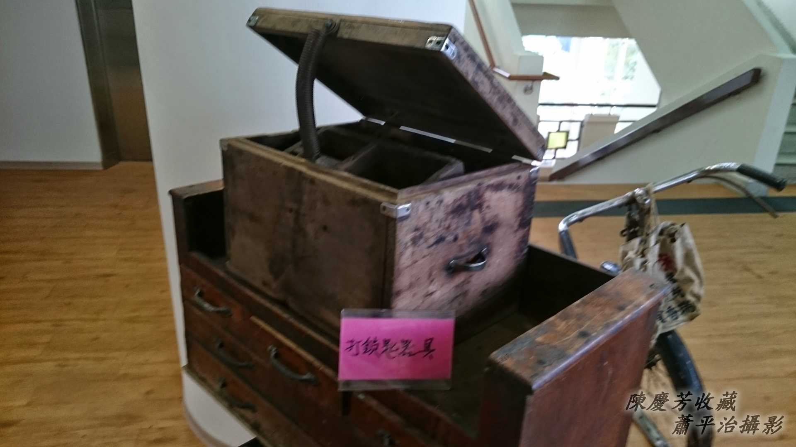
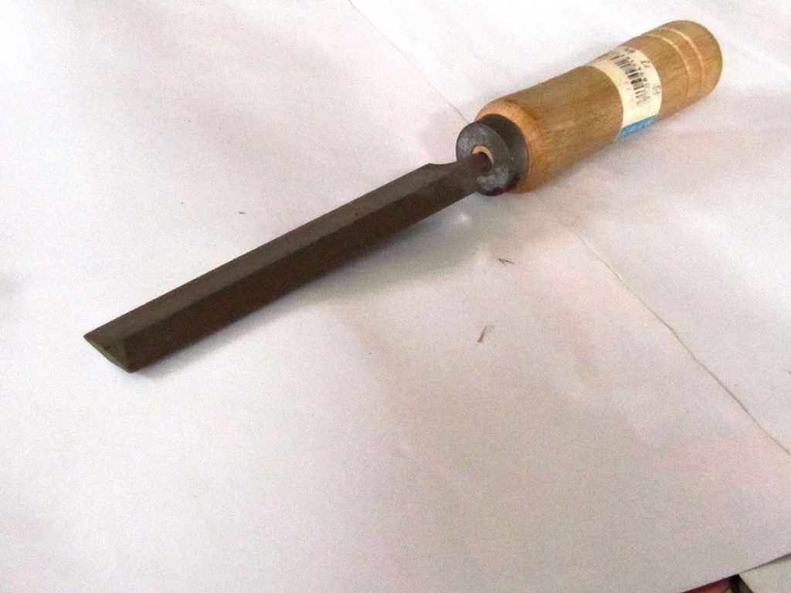

# Phah鎖匙
> **Phah Só-sî**

# 1. Phah鎖匙
> **Phah-só-sî**

鎖是厝宅、房間、櫃thoah、珠寶箱禁止外人phah開ê封鎖家私，有鎖頭有鎖匙，鎖頭phàng-kiàn--khì、害--去tio̍h koh換，鎖匙nā phah-m̄-kìⁿ、害--去，tio̍h chhiàⁿ師傅phah鎖匙。

古早交通無方便，出門步lián kō͘腳行，庄腳出入路草koh bái，nā m̄是必要，罕得chiūⁿ街行踏。所以厝內nā有鎖匙phàng-kiàn--khì、害--去，to̍h thèng-hāu phah鎖匙--ê有來chiah來phah鎖匙。

1台鐵馬，載1-kha特製工作櫃á，櫃thoah khǹg kòng槌á、phiàn-chih、鋸lē⋯工具家私，kap鎖匙見本，另外mā有賣現品鎖頭。除了鐵馬載，mā ē-sái-tit用扁擔taⁿ。

## 1-1. 工作箱
> **Kang-chok-siuⁿ**

箱內有箱，家私頭á分類khǹg。

## 1-2. 鋸Lē
> **Kì-lē**

鎖匙有現成săm-phú-luh thang hô（比對），揀有合鎖頭ê樣品，無合khih-khiah（缺隙）所在chiah用鋸lē鋸鋸lē-lē到ē-ha̍h to̍h完成。鋸lē是鋼質，ē-tàng khioh鋸á齒，磨鐵á鉛線。

# 2. 註解
> **Chù-kái**

|**詞**|**解說**|
|săm-phú-luh|サンプル，sample，『樣品』。|