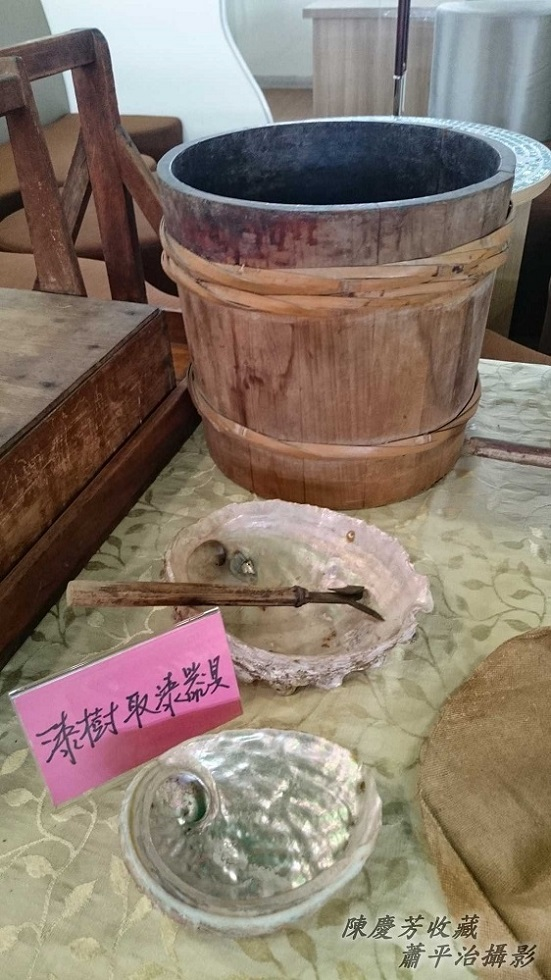
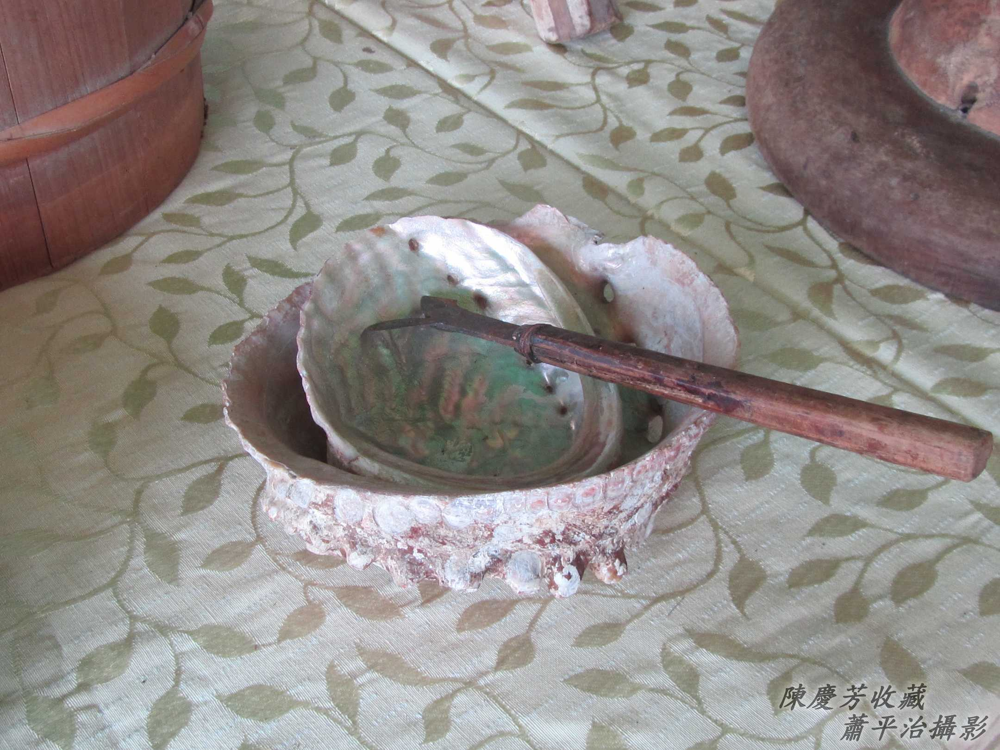
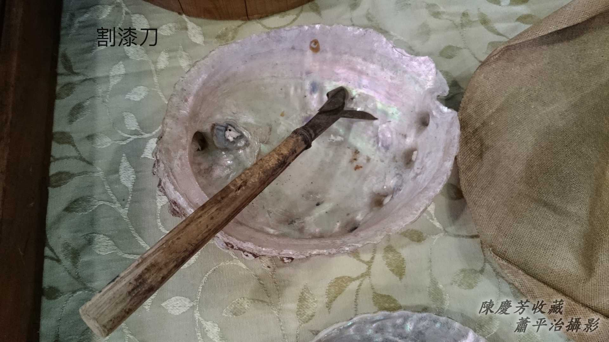
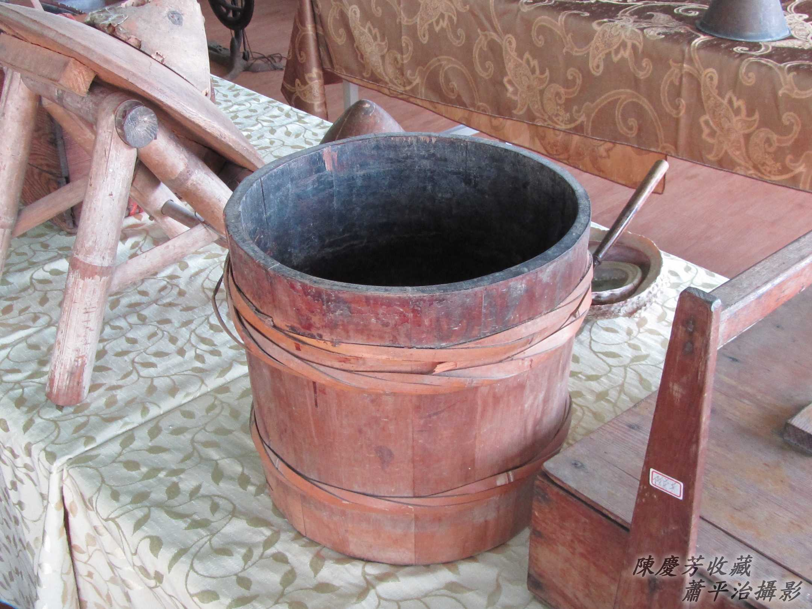

# 割漆
> **Koah Chhat**

# 1. 割漆
> **Koah-chhat**

Ùi漆樹流--出-來ê漆乳是牛奶色，叫做生漆，ē-tàng做藝術品、日用品ê漆料，咱台灣人講做ta漆。經過ta漆漆--過ê家具、藝術品，m̄-nā好看，而且耐用、m̄驚蟲蛀。

一欉漆樹ê生漆產量無chē，需要用特製ê割漆刀，kā漆樹樹皮liô一條平闊ê淺溝，thang hō͘奶汁1滴1滴滴--落-來，滴落ê所在tio̍h-ài插1-kâi ham-á殼sîn奶汁，m̄-nā厚工koh ài內行經驗。

## 1-1. 割漆刀kap Ham-á殼
> **Koah-chhat-to kap Ham-á-khak**

## 1-2. 貯生漆ê柴桶á
> **Té Chheⁿ-chhat ê Chhâ-tháng-á**

用竹篾á kho͘--ê。
