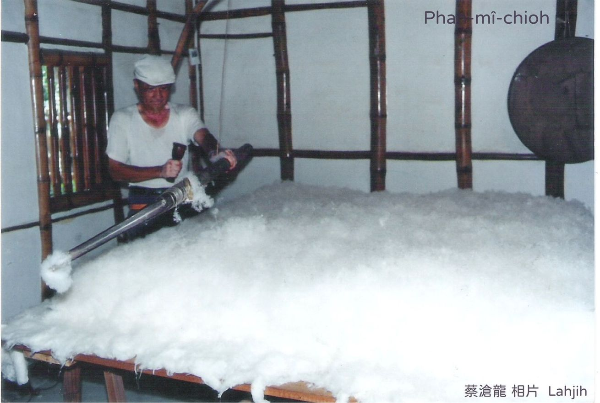
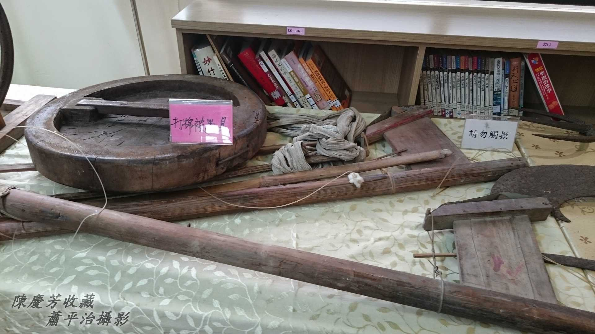
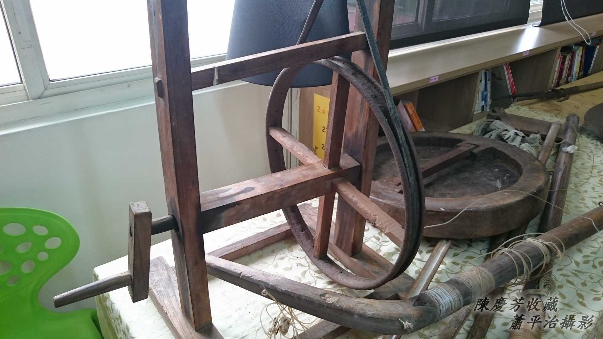
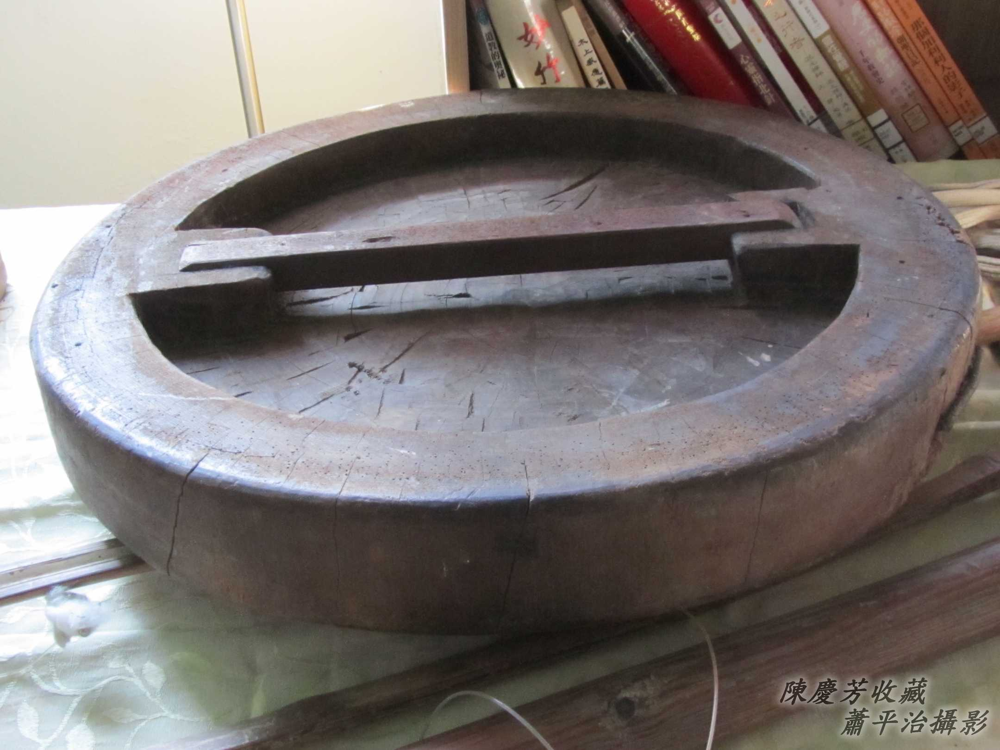
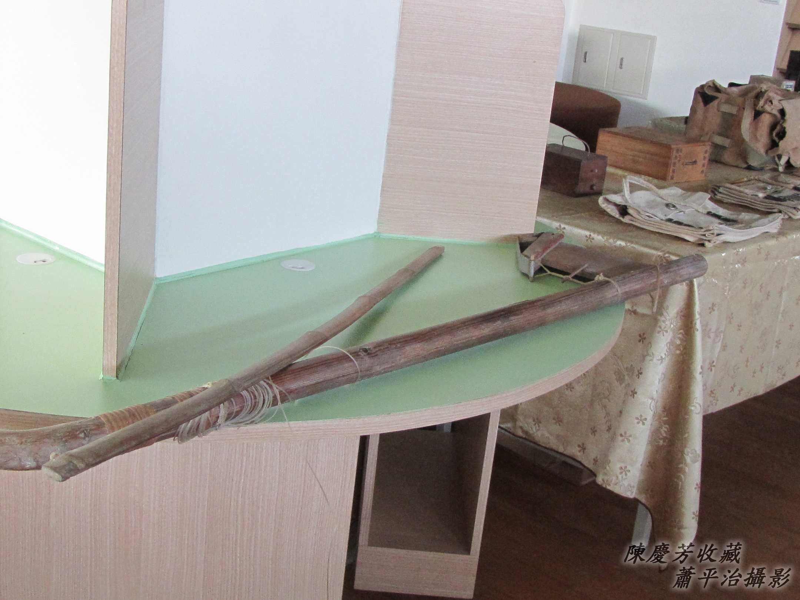
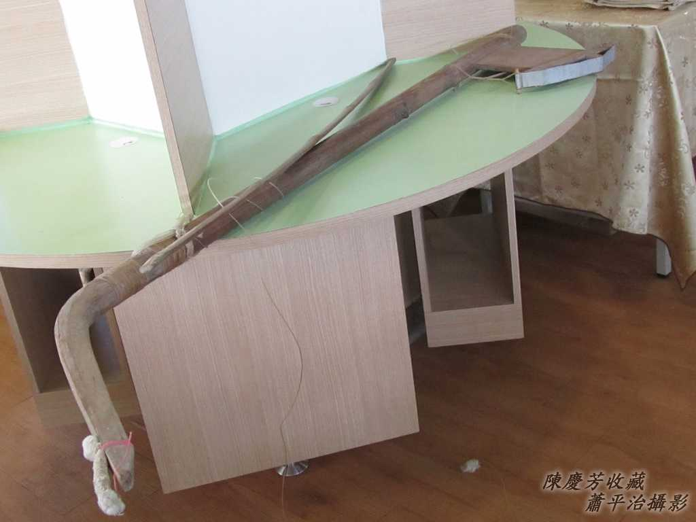
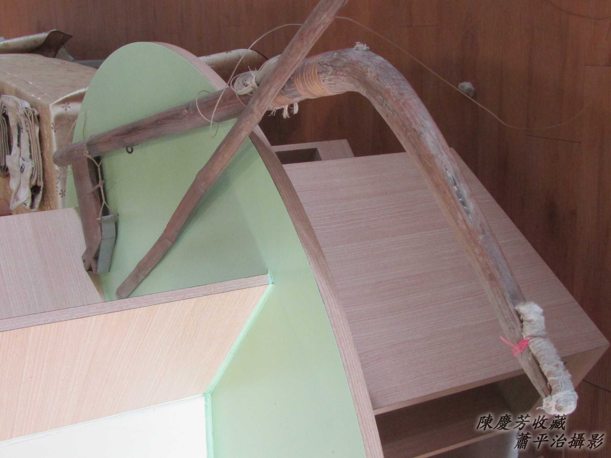
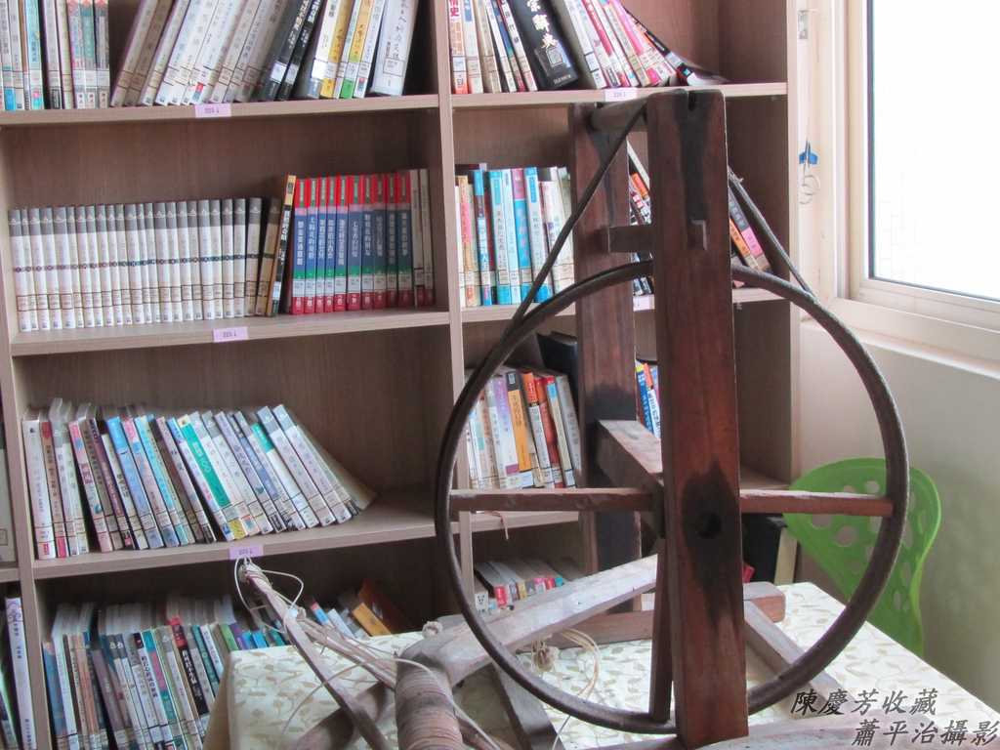
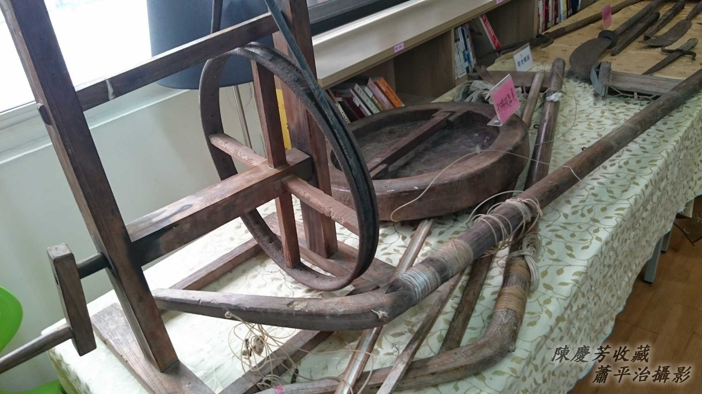

# Phah棉Chioh被
> **Phah Mî-Chioh-phōe**

# 1. Phah棉Chioh被
> **Phah Mî-chioh-phōe**

教育部：棉Chioh。『用棉花纖維製成的被胎』。
萌典：棉chioh被『棉被，被褥的總稱。』

1、棉花（樹）開ê花是棉á花，結ê果實內面有棉á子kap纖維，白白蓬鬆蓬鬆ê纖維號做棉á。華語猶原講做『棉花』。

2、棉chioh+被單=棉chioh被。

3、Phah棉chioh慣勢講phah棉chioh被，mā有講phah棉被。

4、Phah棉chioh被是一項真厚工ê行業，phah一領棉chioh被，代起先ài揀子、開棉、鋪棉，kā 1-bong 1-bong ê棉á展開鋪tiàm phah棉被工作床面頂，sòa--落師傅利用phah被家私，用棉被弓彈棉、用竹篩teh棉，chiah koh牽紗、lún紗，sòa--落tio̍h-koh péng-pêng koh再1-pái彈棉、teh棉、牽紗、lún紗手續chiah算完成。

彈棉á ho͘蓬鬆ho͘牽黏做夥ê家私叫做棉被弓，一支弓箭形ê柴弓絞一條牛筋phāiⁿ tiàm肩胛頭，一手hōaⁿ棉被弓，一手giâ柴槌kòng牛筋，「tiang tiang tiang tiang」to̍h kā展開ê棉á tōaⁿ kah幼幼phōng-song phōng-song ê棉海，chiâⁿ-chò 1-khu ê棉chioh。因為phōng-song giâ-giâ，tio̍h用篾á做ê篩á ûn-ûn-á teh  ho͘ tiâm-si̍t（沉實），chiah koh利用牽紗ê竹篙á kā紗á輪頂ê紗á線ngiáu--過-來，雙人同齊kā紗á固定棉chioh頂，等紗á牽好，tio̍h-koh用lún-á lún ho͘沉實，sòa--落tio̍h-koh péng-pêng koh再1-pái teh棉、牽紗、lún紗手續chiah算完成。Chiah-nī費氣麻煩ê khang-khòe，需要一對手，chiah有法度進行。

## 【Lah-jih台灣俗語】棉被弓nā leh tân，吵tio̍h三代人無法度安眠（biân）。

## 1-1. Phah棉Chioh被ê家私
> **Phah Mî-chioh-phōe ê Ke-si**

Tôaⁿ-keng（彈弓）、弓槌、牛筋、棉斗、紡車、細支竹篙á、io-chhau-pò͘（腰抄布）kap棉á、紗á線。

## 1-2. 紡車
> **Pháng-chhia**

紡車是boeh kā親像麵線kui-khau ê紗á線纏做1卷1卷，方便牽紗用。

## 1-3. 棉斗
> **Mî-táu**

Kā已經牽紗牽好勢ê棉chioh lún lún ho͘沉實。棉斗ê作用是boeh kā牽tī棉á頂ê紗線géng ho͘ tiâu，順sòa kā棉á géng ho͘相倚，khah-bē hō͘蓋被ê人kā被giú li̍h--去。棉斗是用水柳á柴做--ê。

## 1-4. 棉被弓
> **Mî-phōe-keng**

需要像弓箭án-ne絞一條牛筋（有ê用năi-lóng）。

弓槌有大細粒，中央灌鉛，增加重量，用來kòng牛筋，hō͘伊kā棉á彈ho͘蓬鬆。
## 1-5. 竹篙á
> **Tek-ko-á**

Ngiáu紗á線ê細支竹篙á，用--起-來ài ē合手。

## 1-6. 牛筋
> **Gû-kin**

牛筋ē-sái-tit調節ân a̍h是lēng。

## 1-7. 纏梭á組
> **Tîⁿ-so-á-cho͘**

買--來ê紗á是像麵線1-ut 1-ut，需要用纏梭á組kā伊纏tiàm 1-kâi尖尾梭ê柴kho͘頂，方便牽紗，纏紗需要技術chiah bē liù紗。

牽紗需要一對手，1-ê liû紗，1-ê牽紗，liû紗chit-pêng，tò手用大pû-ong、kí-cháiⁿ輕輕kā紗線tēⁿ tī手心，正手用大pû-ong、kí-cháiⁿ tioh紗á hō͘對方ngiáu；牽紗--ê chit-pêng giâ一支細支竹篙á，伸手kā對方ê紗á ngiáu倚來正手虎口，sòa--落tò手指頭á kā紗線tēⁿ-ân，正手順手勢boeh-koh kā竹篙á伸出時，sìm--一-下to̍h ē-sái-tit kā紗線掣斷順sòa chhi̍h tiàm棉chioh面頂，同時對方mā kā紗線chhi̍h tiàm棉chioh面頂，án-ne ngiáu一下ē-tàng牽2條紗。這ê動作一直重複到完成，chiah koh péng pêng繼續完成另外hit面。

（感謝林老師 May Lin ê經驗分享）

# 2. 註解
> **Chù-kái**

|**詞**|**解說**|
|棉chioh|Mî-chioh，『用棉花纖維製成的被胎』。|