# 厝內六Kha桶kap其他ê桶á
> **Chhù-lāi La̍k-kha-tháng Kap Kî-thaⁿ ê Tháng-á**

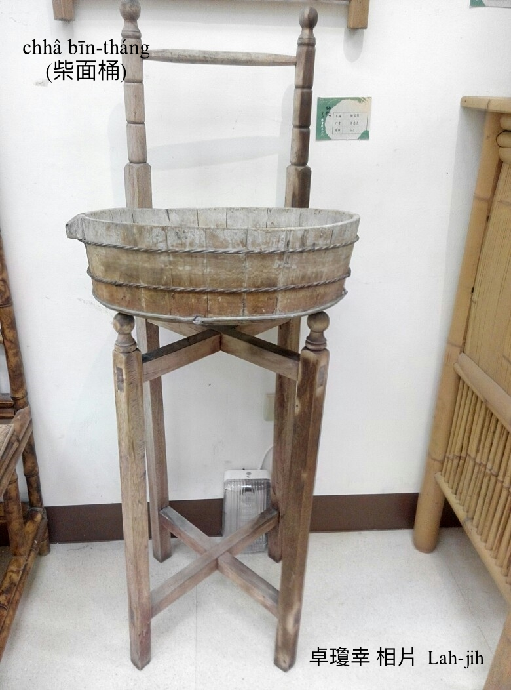

# 1. 柴桶kap Kho͘桶師傅
> **Chhâ-tháng kap Kho͘-tháng Sai-hū**

塑膠製品iáu未普遍大量生產ê時代，庄腳所在家具lóng是木材製造，kap-choh店kap-choh師傅，kho͘桶店kho͘桶師傅lóng是木材工藝師，所用柴料m̄-nā是實木koh是松蘿hi-nó͘-khih。

Kap-choh師傅ê成品是mê-mê-kak-kak四角形體，穩穩在在khah少搬徙；kho͘桶師傅完成--ê是圓lìn-lìn密chiuh-chiuh ē-tàng貯水ê圓桶，koh tio̍h時常搬徙kōaⁿ來kōaⁿ去，所以外緣一定tio̍h用篾á-kho͘、鉛線kho͘ kho͘ tiâu--leh tau tiâu--leh，chiah ē bē sòaⁿ耐用。四角直線好裁，圓kho͘-á圓周率oh分，總--是技藝各有專長，各有技巧完成製品，lóng是師傅。

台灣人ê「kho͘」有「tau」ê意思，kho͘-tiâu kho͘-ân to̍h是tau-tiâu tau-ân，kho͘ tiâu--leh tau tiâu--leh lóng是持家khîⁿ家「家和萬事興」ê含意，kho͘是圓形，tau是合倚無分散，鉛線kho͘、篾á-kho͘ m̄-chiah chiâⁿ做婚喪喜慶ê禮俗器物，物件雖bóng無值錢，意義卻是重大。

# 2. 嫁妝尾後擔
> **Kè-chng Bóe-āu-tàⁿ**

Khah早娶新娘，頭前是竹掃，押尾是尾後擔，尾後擔是新娘ê嫁妝，用2 kha紅布袋貯kiáⁿ孫桶，有面桶、腳桶、屎桶kap io桶，是新娘房新娘ê衛生洗tn̄g用--ê，是生kiáⁿ io-kiáⁿ chiâⁿ重要ê家具。厝內衛生洗tn̄g六kha桶，嫁妝尾後擔to̍h有四桶。

# 3. 厝內六Kha桶
> **Chhù-lāi La̍k-kha-tháng**

厝內衛生洗tn̄g六kha桶——面桶、水桶、腳桶、尿桶、屎桶kap io桶。

## 3-1. 柴面桶
> **Chhâ Bīn-tháng**

木材kho͘ ê面桶用途khah雜，cha-po͘人、gín-á用來洗面、洗手、洗腳、洗身軀。

記得gín-á時，面桶架是khǹg-tiàm gîm-chîⁿ腳ê 1-kâi ka-tī釘ê柴架，早起phâng水洗面，公家一條面布，boeh暗á時phâng水tiàm土腳，坐細隻竹椅á洗面兼洗腳，腳蹄洗清氣chiah穿木屐。Nā是boeh洗身軀，to̍h用鉛桶á kōaⁿ燒水kap面桶去iap-thiap厝後洗。

## 3-2. 面桶架
> **Bīn-tháng-kè**

富戶人官家厝內chiah有chit款kheng玻璃鏡kap彩色玻璃ê面桶架。
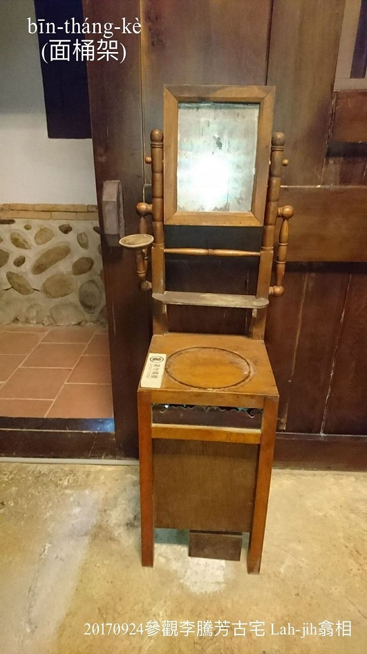 
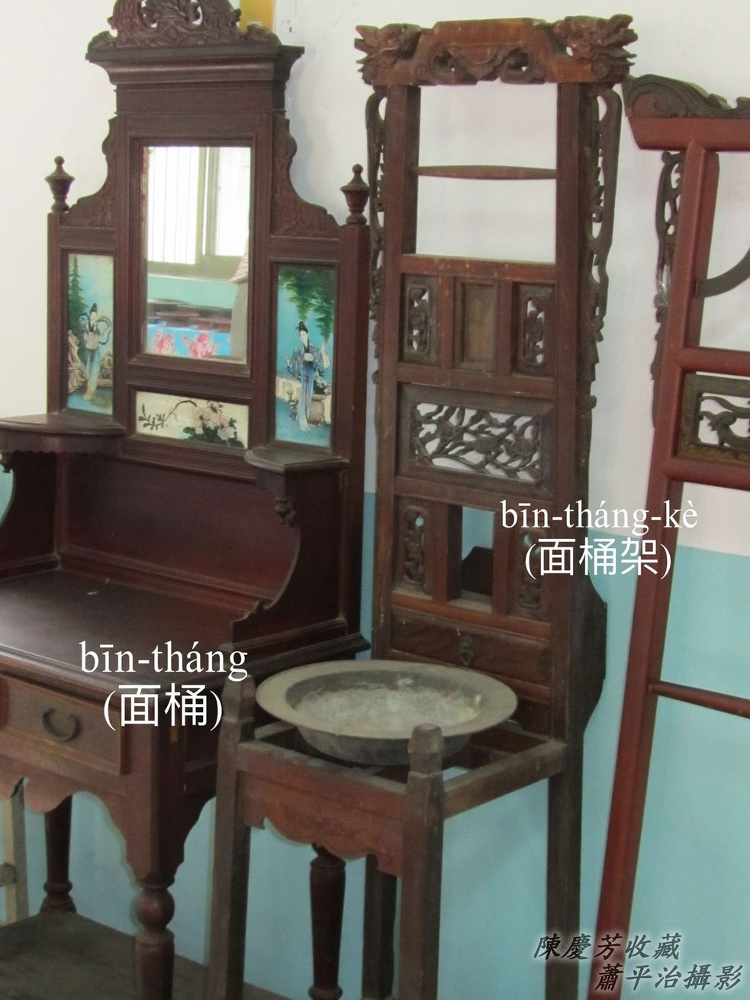

Nā是一般家庭，chit款柴造a̍h是鐵造面桶架，mā是chiâⁿ chán，有koaiⁿ ē-tàng phoa̍h面布，mā有khǹg茶kho͘ ê khok-á。
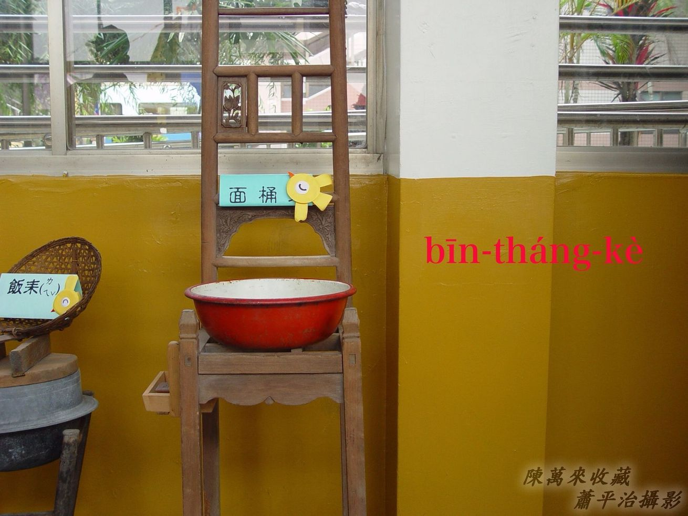 
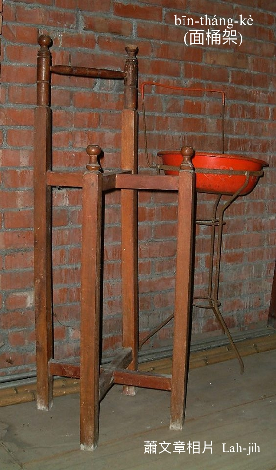
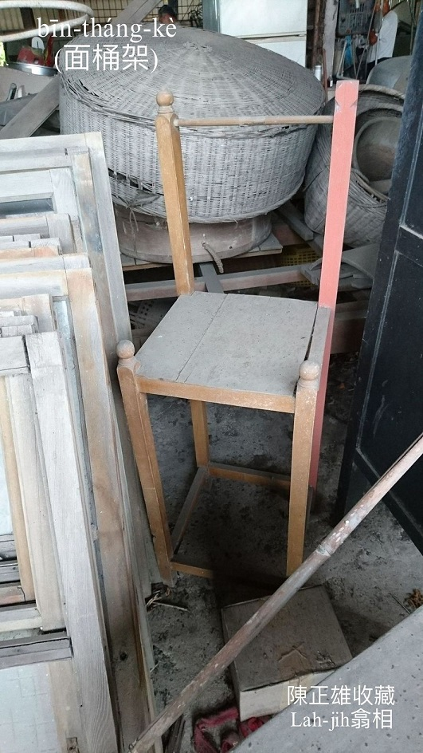

## 3-3. 腳桶
> **Kha-tháng**

腳桶kap插秧á ê秧船á boeh kāng boeh kāng，秧船á ê桶底平平hûi-hûi，腳桶ê桶枋thóng出桶底chiâⁿ寸長。

腳桶路用真chē，siāng捷是kā嬰á、gín-á洗身軀，a̍h是貯衫á褲去鼓井腳水溝邊洗衫褲，mā用來洗番薯，破醃瓜á khau瓜á瓤。
  
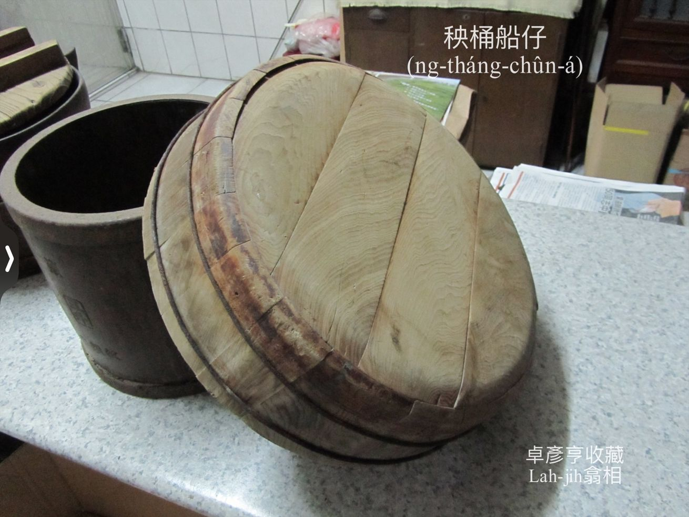
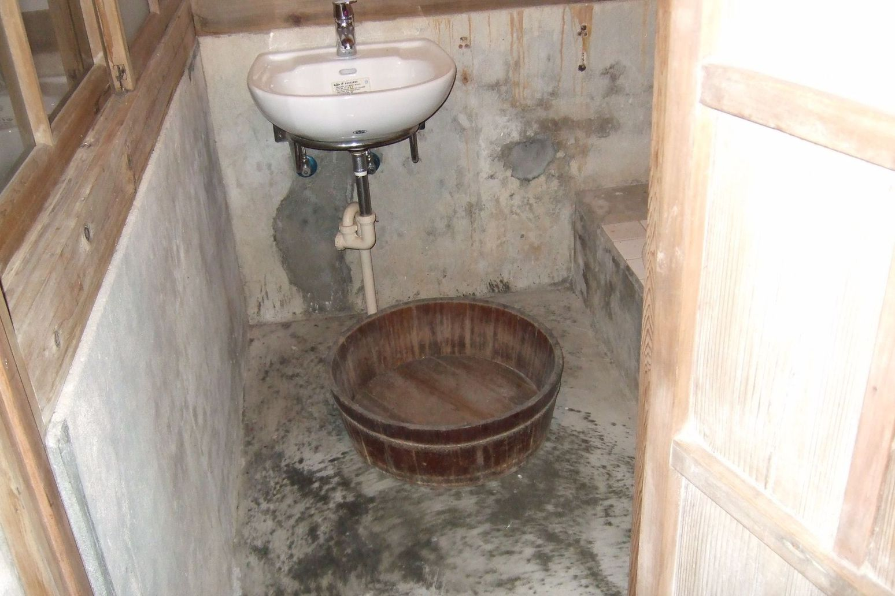

## 3-4. 屎桶
> **Sái-tháng**

古早庄腳衛生bái，厝內無便所，khah chē是chhìn-chhái liú khang tâi醃缸、搭寮á ê屎ha̍k-á，屎窟看現現，有夠無清氣臭ko͘ⁿ-ko͘ⁿ，nā有起便所mā是起tī厝外，厝內無可能有便所，暗時暗bong-bong，cha-bó͘人只好tiàm房間內方便，屎桶是必要配備。放屎臭mi-mo͘用蓋khàm，tio̍h趁早起時khah無人時陣，趕緊phâng去piàⁿ屎ha̍k-á便所內，chiah-koh用稻草做chhéng-á洗洗lù-lù清氣。

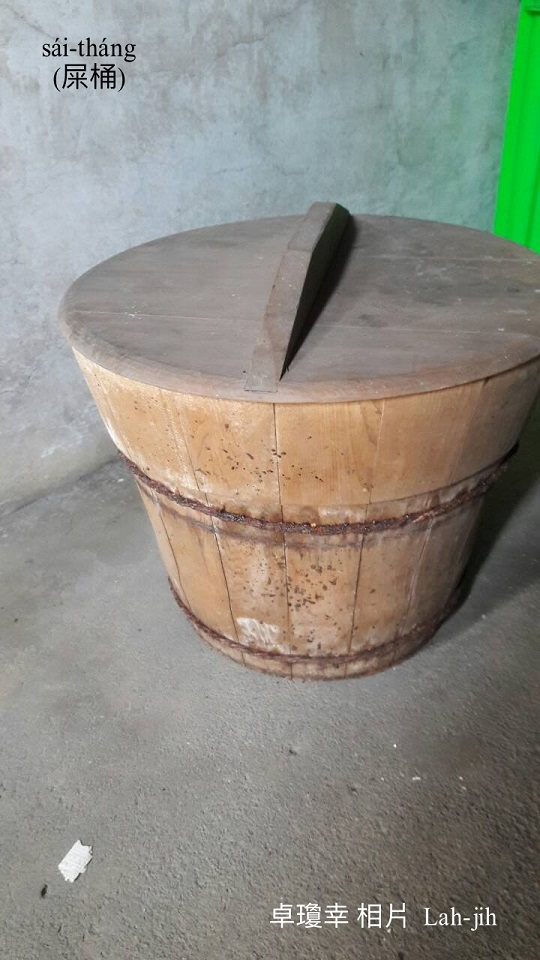 
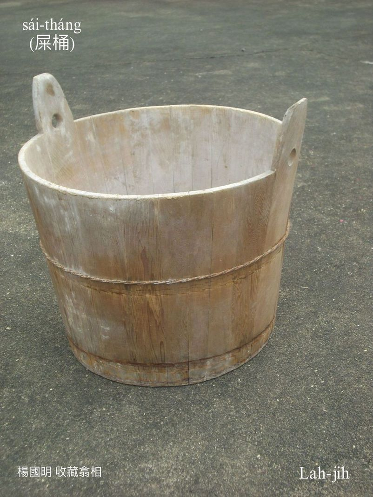
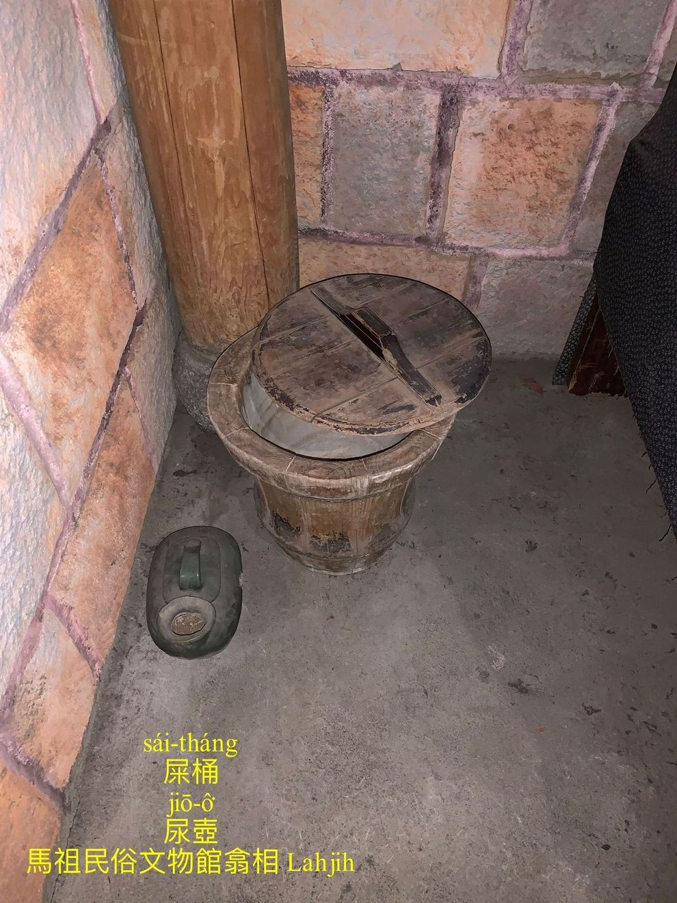
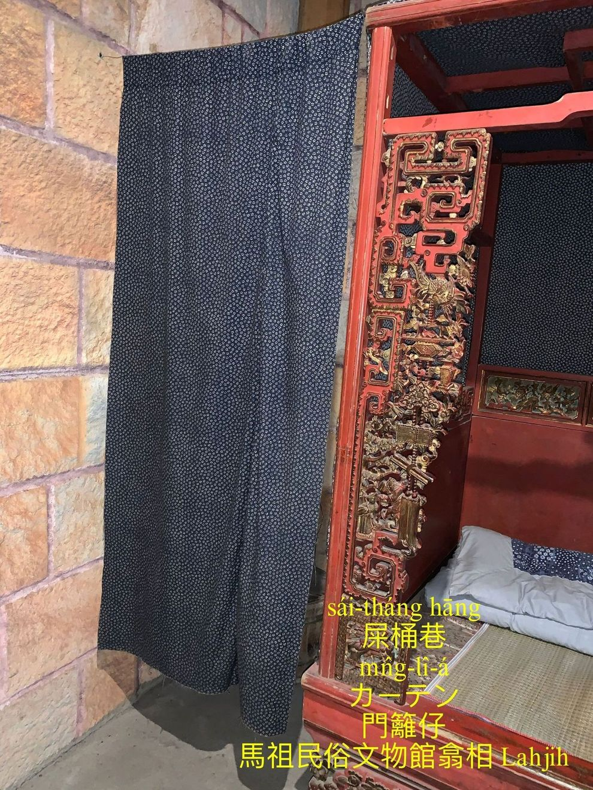

## 3-5. Io桶／腰桶
> **Io-tháng**

Io桶mā講腰桶，形體kap屎桶giōng-boeh相kāng，io桶khah大無蓋，屎桶khah細有蓋。

Io桶是因為生kiáⁿ，古早生kiáⁿ講khioh gín-á，坐tī稻草生，號做「坐草」，後--來坐tī io桶生，sūn-sòa用io桶kā嬰á洗身軀，koh來是倒tī眠床生，io桶to̍h用來kā嬰á洗身軀。

腰桶是io桶ê桶底tī半中央，khah淺，kap屎桶chiâⁿ kāng款，比屎桶khah koân，無蓋，bē-sái-tit親像屎桶án-ne khû leh坐，需要半khû-khiā。坐leh生kiáⁿ a̍h是來洗（lâi-sé，女性月經來）洗下身，m̄-chiah腰桶底ê設計chiâⁿ特別，是tī桶á半腰所在，án-ne khah省燒水，boeh phâng mā khah bē重。（有經過使用者陳老師娘證實。）厝內nā有浴室，平常時婦人人ē tī浴間á洗身軀，nā是做月內，chiah ē tiàm房間內用腰桶洗下身。
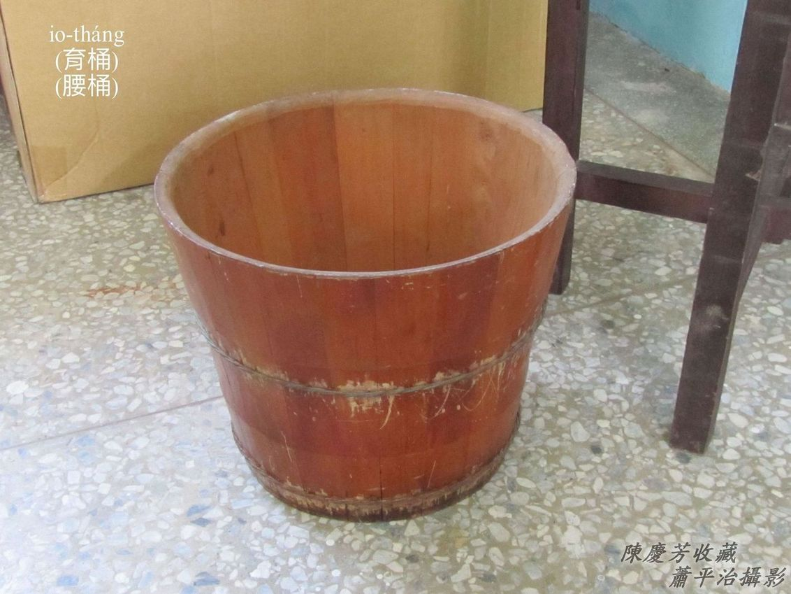  
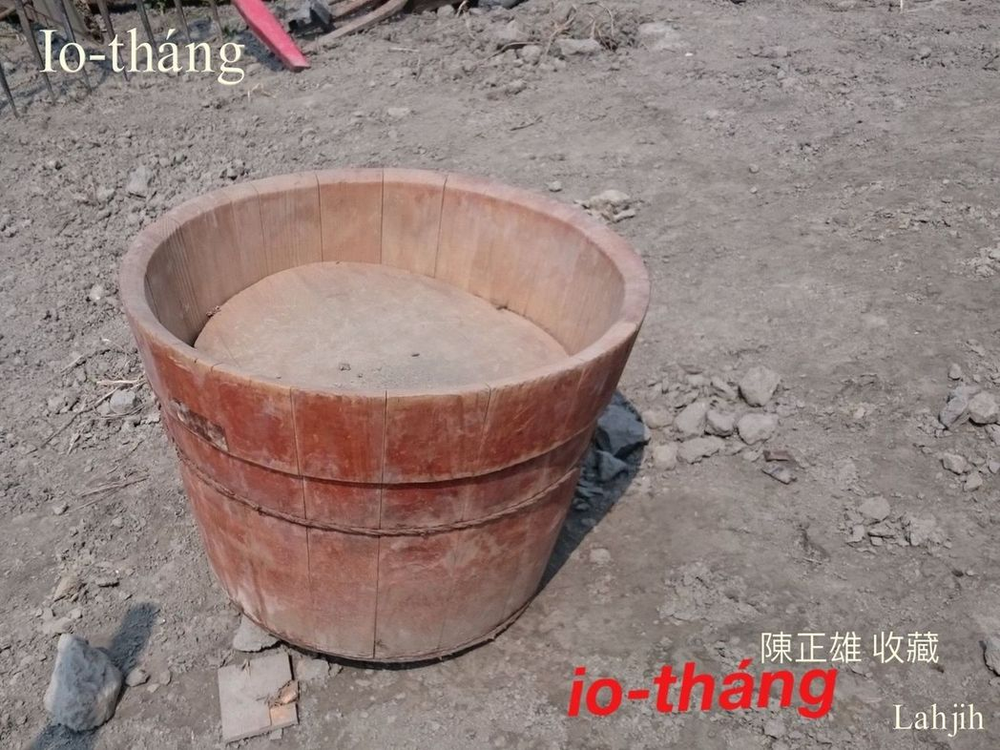

## 3-6. 水桶kap尿桶
> **Chúi-tháng kap Jiō-tháng**

水桶尿桶kāng一樣，做貯水taⁿ水用to̍h是水桶、水桶kho͘、水桶藤；nā khǹg tī房間放尿，to̍h是尿桶、尿桶kho͘、尿桶籐。

古早有phah眠床總舖ê房間、人客間，lóng ē留1-ê巷á khǹg尿桶，nê門簾á方便放尿，尿nā tīⁿ，koh ē-sái-tit taⁿ去田園做有機肥ak菜。

Gín-á時代，阮tau人客間á總舖邊khǹg尿桶，暗時厝邊隔壁來聚會phò-tāu參詳穡頭事工，定定有人放番薯屁ē牽聲kho͘-si-á，mā定定有人放尿tin-tin tong-tong吵人講話，番薯屁bē臭，放尿是臭尿hiam kiâ-kiâ。1950年代ê記智。

鼓井taⁿ水，一支畚擔兩kha水桶；兩人扛水，一支竹管，1-kha水桶；nā是大人thīn gín-á扛水，gín-á做頭前，大人tī後壁，sūn-sòa tio̍h kā水桶耳hōaⁿ tiâu，gín-á負擔mā khah省力。鼓井離厝khah遠，1擔2擔，taⁿ轉來倒tiàm灶腳醃缸內，有夠thiám頭。

庄腳無水電ê時代，食水需要去鼓井頭用鉛桶á chhiūⁿ水，貯tī大kha水桶用pùn-taⁿ taⁿ，a̍h是kō͘棍á兩人扛，taⁿ轉去倒tiàm灶腳醃缸做煮食用水。田園菜股欠水，淹水無方便，ē-sái-tit kō͘水桶taⁿ水ak菜。水桶耳是籐條ut--ê，號做水桶籐，ē-tàng khiā直ē-tàng khǹg坦橫，比pa̍k索á khah方便koh耐用。

> **聽講水桶kah尿桶ê差別iáu有一說，古早kho͘桶ê桶枋khah chē是hi-nó͘-khih木材，價錢khah貴，買來做水桶真讚，nā是做尿桶，實在無彩，所以kho͘桶師傅ē用棺柴枋做尿桶，賣khah俗--leh。**

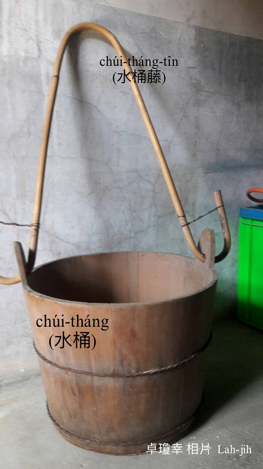 
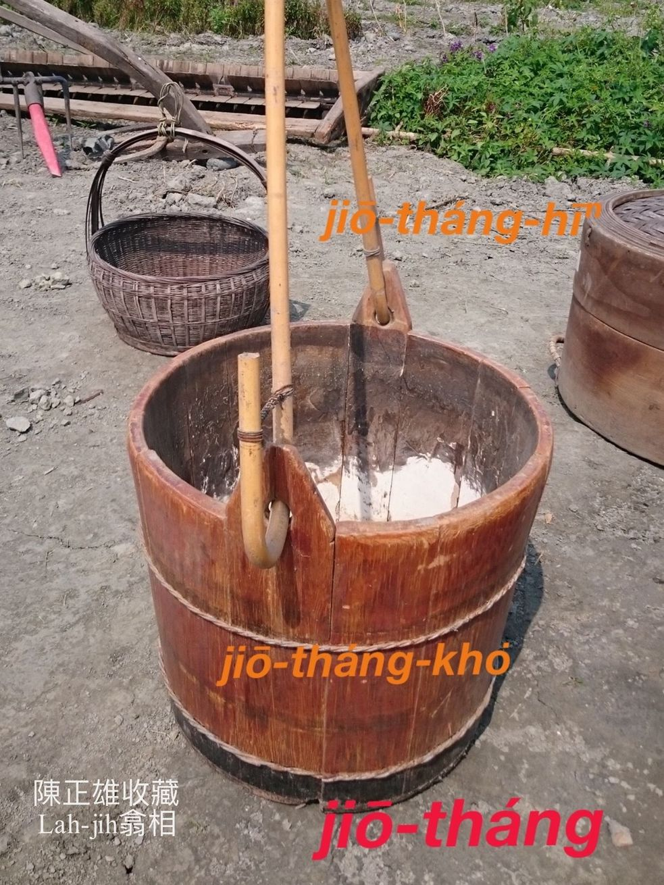 

# 4. 細Kha水桶
> **Sè-kha Chúi-tháng**

細kha水桶ē-tit孤手kōaⁿ，kōaⁿ水洗tn̄g、洗家具家私、ak菜‥‥‥加真方便liú-lia̍h，nā是鼓井chhiūⁿ水，需要koh-khah細kha ê水桶。
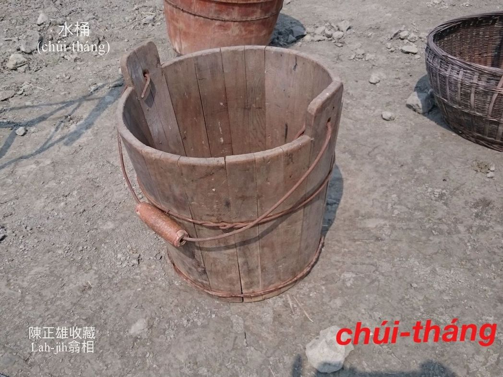

# 5. Phoa̍h桶kap鉛桶
> **Phoa̍h-tháng kap Iân-tháng**

鉛phiáⁿ黏錫ê水桶號做鉛桶，kōaⁿ水liú-lia̍h方便，nā pa̍k長索á，ē-sái-tit鼓井chhiūⁿ水，to̍h號做phoa̍h桶。

Phoa̍h桶chhiūⁿ水tio̍h技術，有人直接kā phoa̍h桶tò-khap tàn落鼓井內，phoa̍h桶to̍h ē貯tīⁿ水，nā鼓井水面siuⁿ過深，tàn幾nā pái mā無一定chhiūⁿ有水。另外一種chhiūⁿ水技術，to̍h是kā phoa̍h桶lūi落去鼓井內，kō͘手kā索á tiuh--一-下，phoa̍h桶to̍h ē tò-khap貯tīⁿ水。
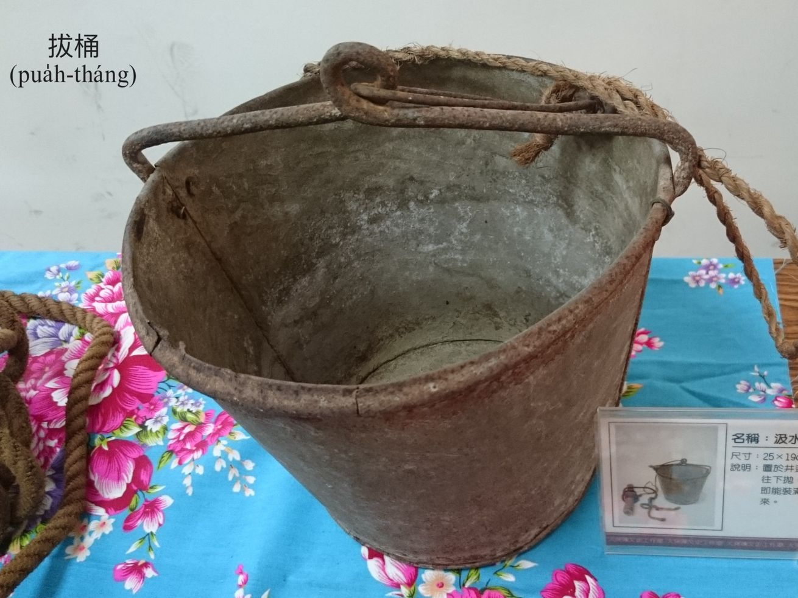

## Phoa̍h桶Chhiūⁿ水ê撇步
> **Phoa̍h-tháng Chhiūⁿ-chúi ê Phiat-pō͘**

1. Phoa̍h桶lūi／tàn落鼓井。 
2. Toaⁿ手tiuh索á hō͘ phoa̍h桶tò-khap té水。 
3. 雙手chhiû索á chhiūⁿ水起來鼓井téng。
4. Tò落水桶第一phoa̍h水。 
5. Sòa--落-去chhiūⁿ第二phoa̍h。

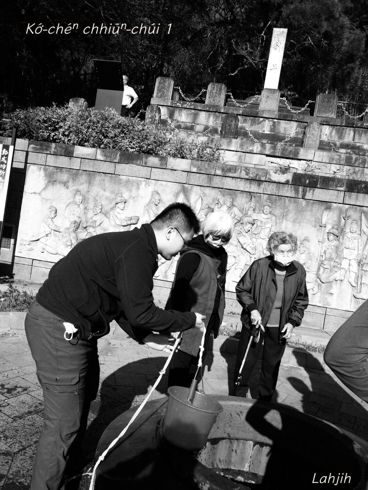
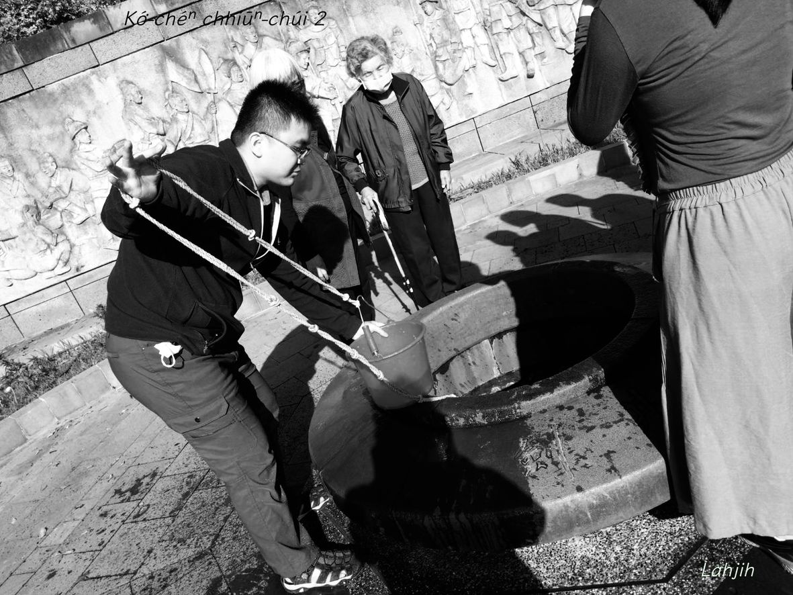
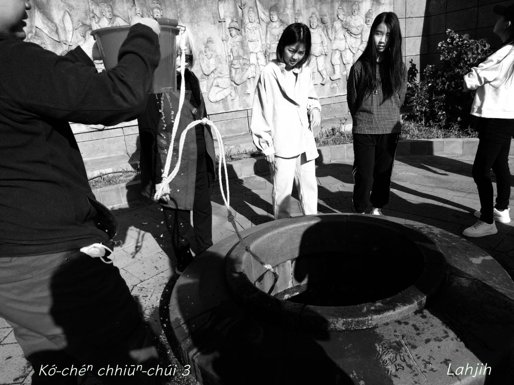
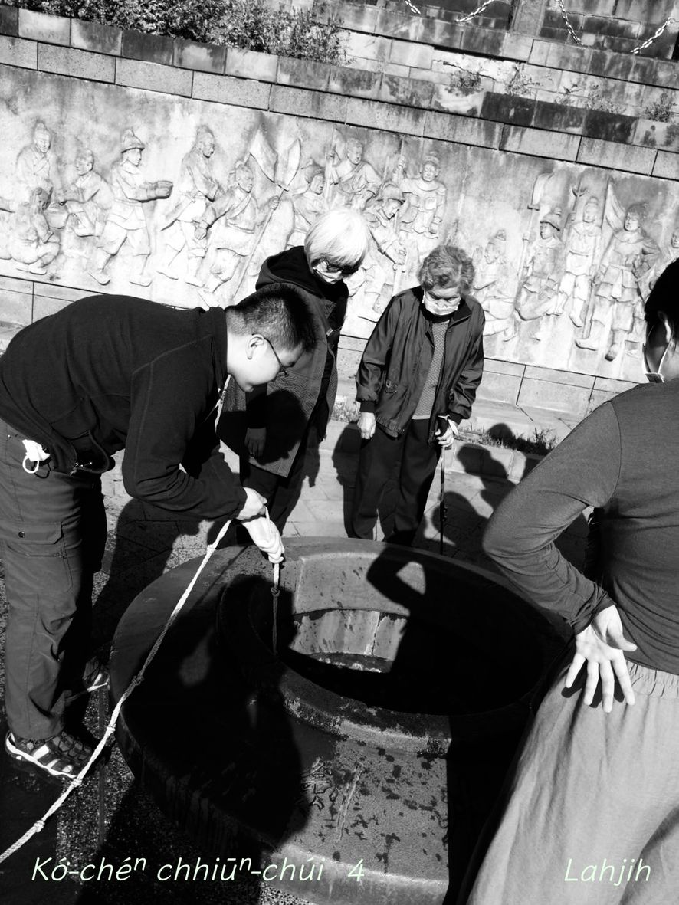
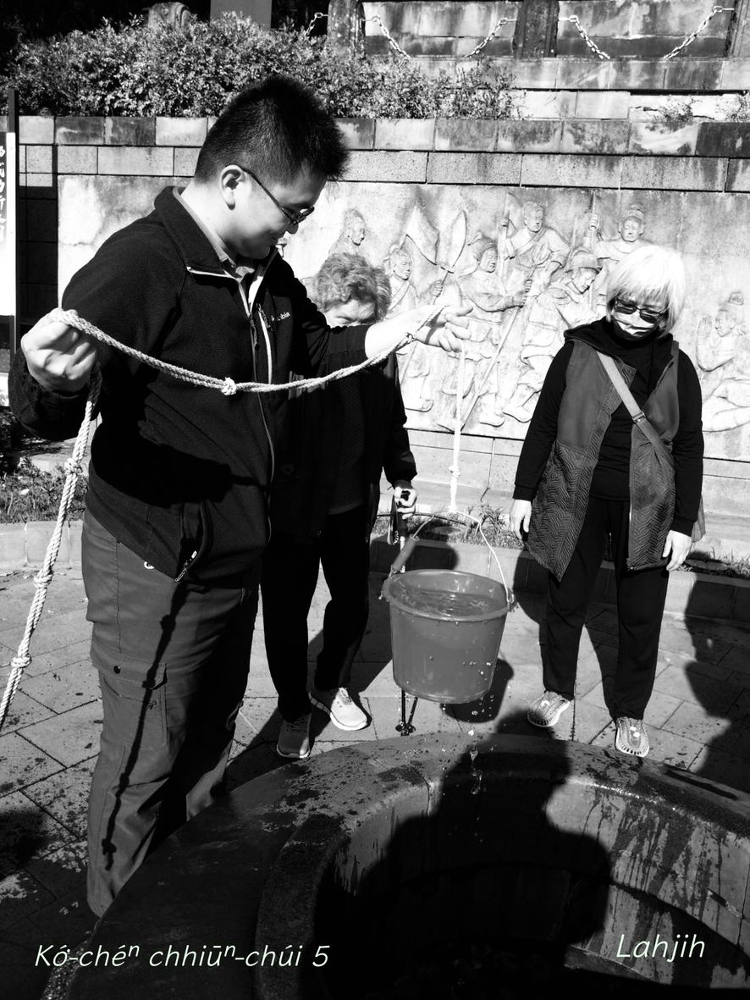
# 6. Kōaⁿ桶
> **Kōaⁿ-tháng**

田--裡做穡食點心，to̍h用kōaⁿ桶kōaⁿ到位。
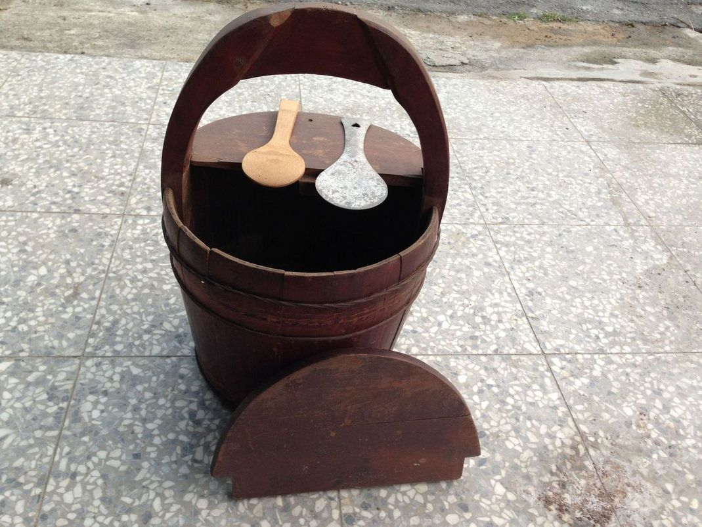

# 7. 淋碭面桶
> **Lâm-thn̄g Bīn-tháng**

色水chiâⁿ súi，多數是新娘嫁妝，房間內洗面jiû身軀。淋碭是金屬表面lâm琺瑯加熱製成ê『搪瓷』。

> **『搪瓷：一種工藝品。金屬表面熔合一層琺瑯的器件。將石英、長石、硼砂、碳酸鈉等礦物原料，經高溫熔製成琺瑯後，塗抹在以低碳薄鋼板沖壓成各式的器皿胚胎上，等乾燥後送入爐內焙燒。質地堅硬具光澤性，能耐強酸、溶劑腐蝕及防鏽，所以這種技術廣泛用於生活用品、醫療器皿、工業設備上。也稱為「洋瓷」。（萌典）』**

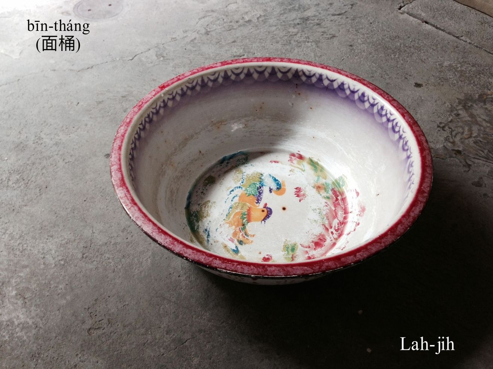  
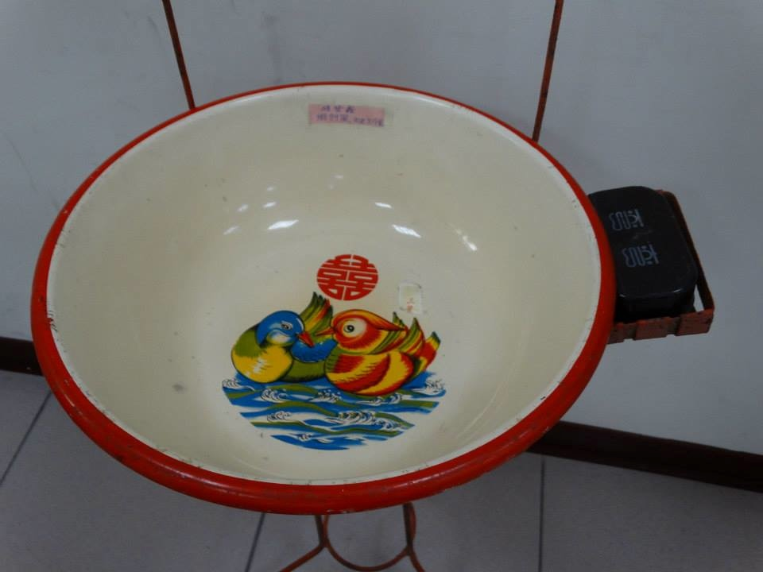

# 8. 註解
> **Chù-kái**

|**詞**|**解說**|
|ē-tit|Ē得，可以。|
|眠床|Bûn-chhn̂g／Bîn-chhn̂g，安眠an-bîn，眠夢bîn-bāng。|
|hi-nó͘-khih| ひのき，台灣扁柏『檜木』。|
|thóng出|Thóng-chhut，『突出』。|
|密chiuh-chiuh|『非常緊密』。|
|松蘿|Siông-lô，台灣扁柏kap紅檜有人講做松蘿。|
Mê-mê-kak-kak|Mê-mê角角，『芒角、稜角。物品的銳角或轉角部分。比喻事物細小而且緊要的部分』。|
|kho͘ tiâu--leh|『兜住』。|
|tau tiâu--leh|『兜住』。|
|khîⁿ家|『持家』。|
|iap-thiap|『隱密處』。|
|phoa̍h面布|『掛毛巾』。|
|hûi-hûi|『圓滑狀』。|
|chiâⁿ寸|『將近一寸』。|
|liú khang tâi醃缸|『挖洞埋水缸』。|
|giōng-boeh|『將要，快要』。|
|khû leh坐|『蹲著坐』。|
|半khû-khiā|『半蹲坐』。|
|ak菜|『蔬菜澆水』。|
|kho͘-si-á|『吹口哨』。|
|鉛phiáⁿ|Iân-phiáⁿ，『鐵皮鋅板』。|
|lūi落去|『縛繩索把物慢慢墜下』。|
|tiuh--一-下|『抖動一下』。|