# 洗Tn̄g用具
> **Sé-tn̄g Iōng-kū**

# 1. 洗衫枋
> **Sé-saⁿ-pang**

柴枋刻溝痕方便洗衫撋衫á褲，號做洗衫枋，khǹg-tiàm腳桶內，坐一隻低椅á，鼓井á腳，phòng-phuh-á腳，有伴有陣，ná撋ná phò-tāu，有正經有閒á話，總--是tháu放心思khioh一寡á消息。
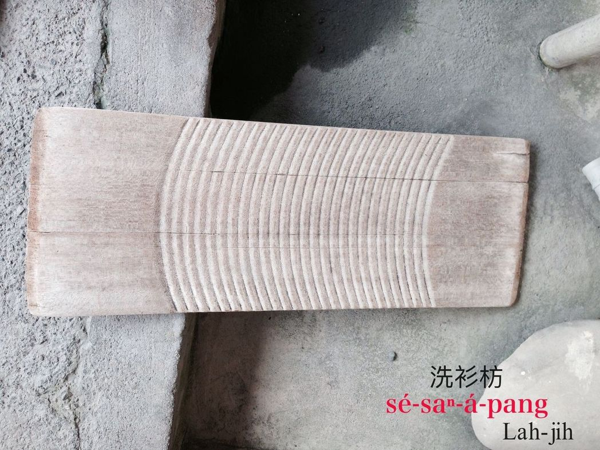
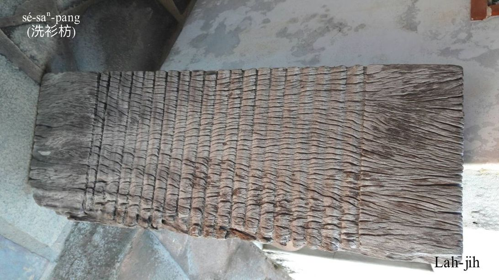
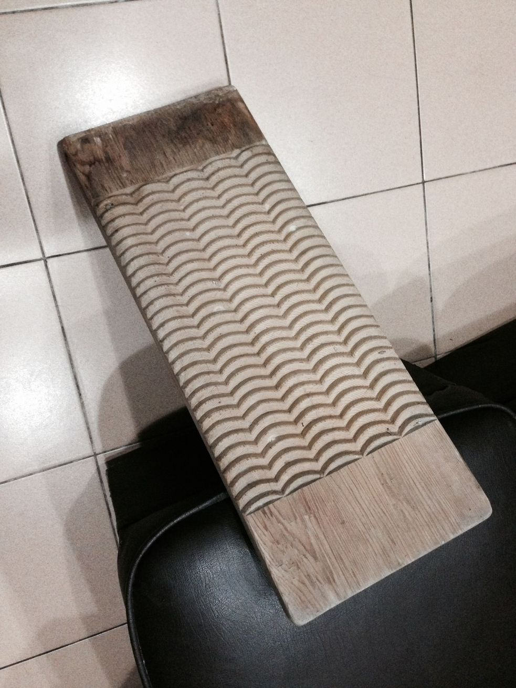 

# 2. 茶Kho͘籃á
> **Tê-kho͘-nâ-á**

茶kho͘籃á一般是柴質，mā有金屬，有耳，ē-tàng khǹg茶kho͘ kōaⁿ來kōaⁿ去，洗衫á褲、洗家具、洗身軀。茶kho͘是苦茶子chiⁿ油留--落-來ê phoh（粕），ē-tàng清洗器具，後--來soah kā ē-tàng清洗ê bâ-bui  kap sap-bûn lóng講做茶kho͘。

> **教育部辭典：茶kho͘。『用壓榨茶油時所剩下來的渣滓，再把它壓製成堅硬的餅形，就叫「茶kho͘」。可當肥皂用，但與肥皂其實是不同的』。**

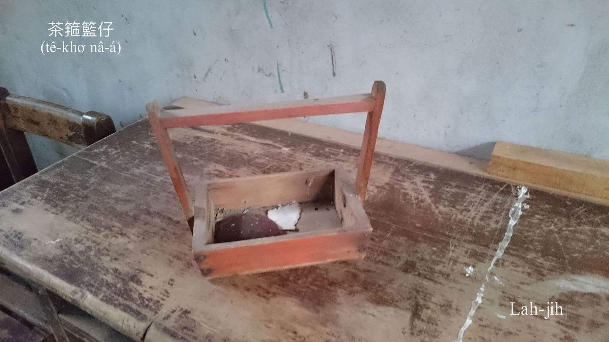  
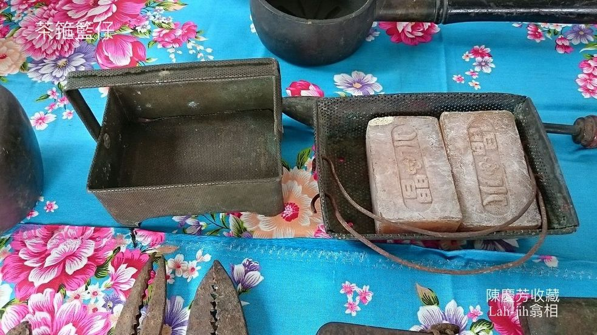
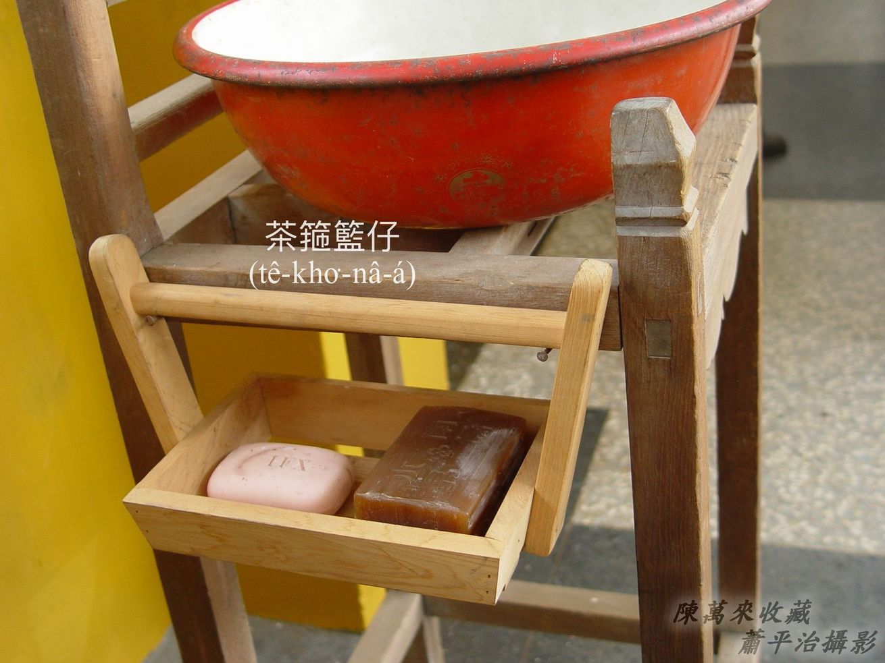  
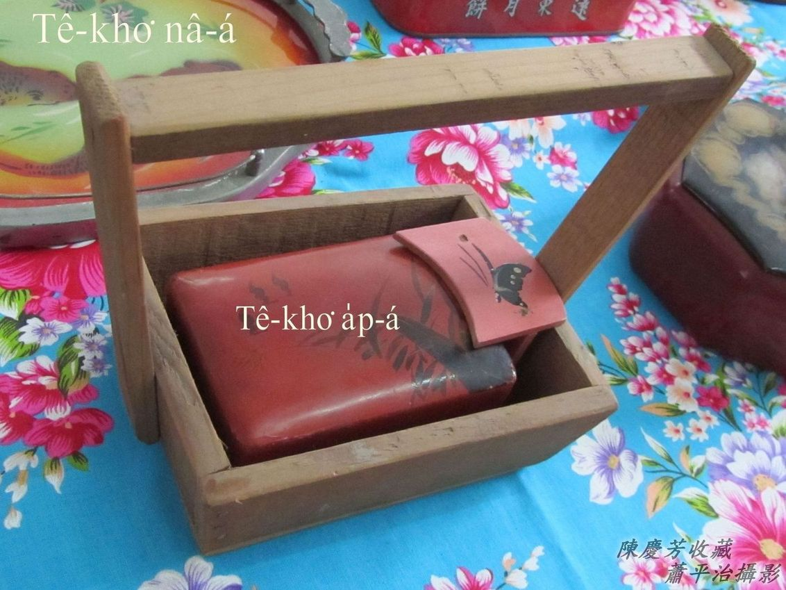

油車chiⁿ土豆油是土豆kho͘，chiⁿ麻油是麻á kho͘，chiⁿ茶油to̍h是茶kho͘。各有路用。
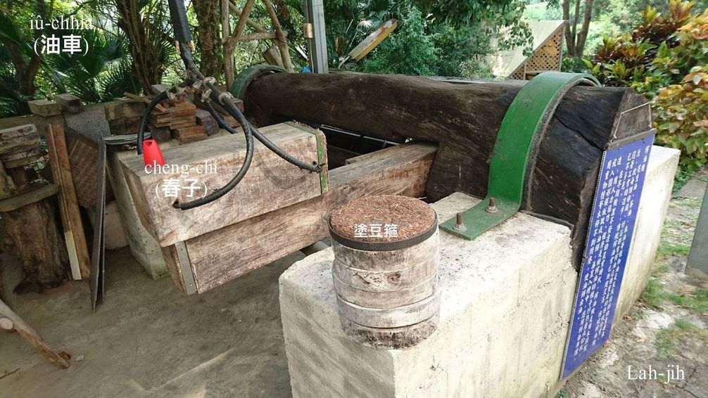

# 3. 茶Kho͘盒á
> **Tê-kho͘-a̍p-á**

Chit種茶kho͘盒á ê材質親像塑膠製品，叫做ló͘-chí ，殼薄koh tēng-pak，表面kng-iāⁿ色緻雅麗，主要khǹg芳茶箍。
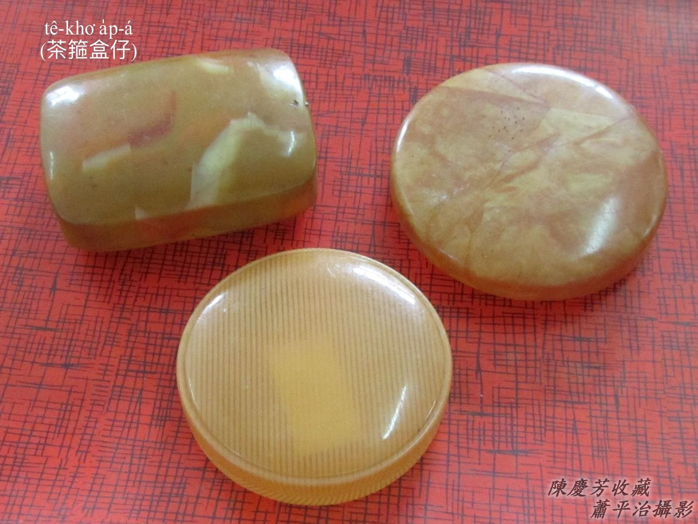 
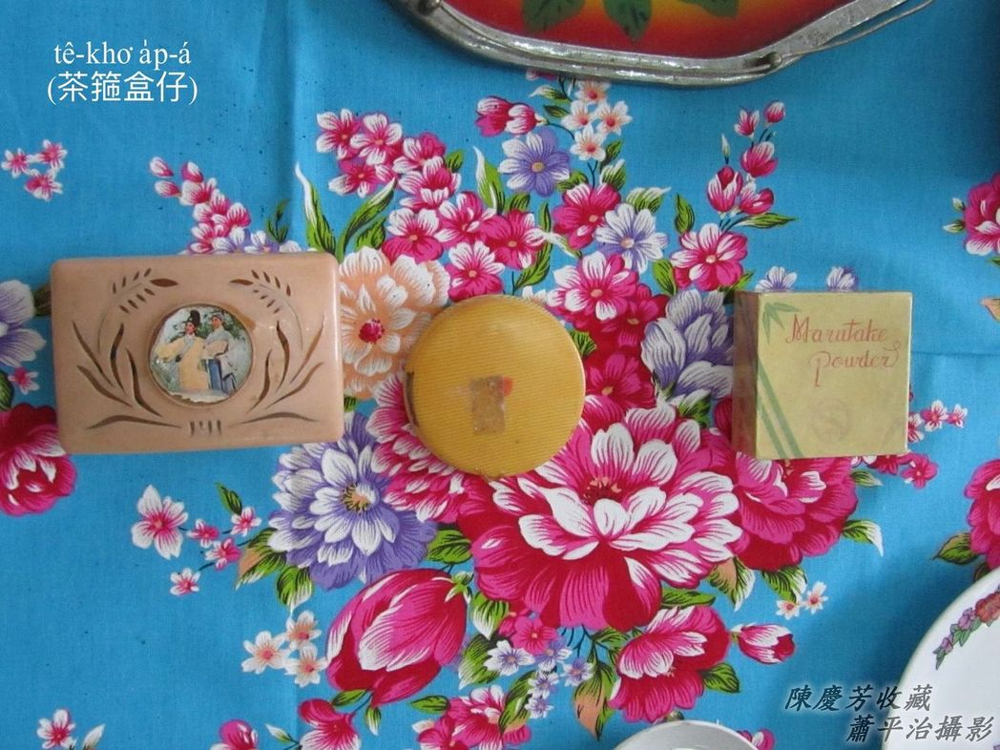

# 4. 齒Khok-á
> **Khí-khok-á**

齒khok-á貯水洗嘴，這齒khok-á是新娘嫁妝，古早洗嘴一般用鹽水洗，罕得用齒膏齒粉，鹽水貯tiàm碗內，kō͘ ka-tī ê指頭á kí-cháiⁿ lù嘴齒、牙槽岸。
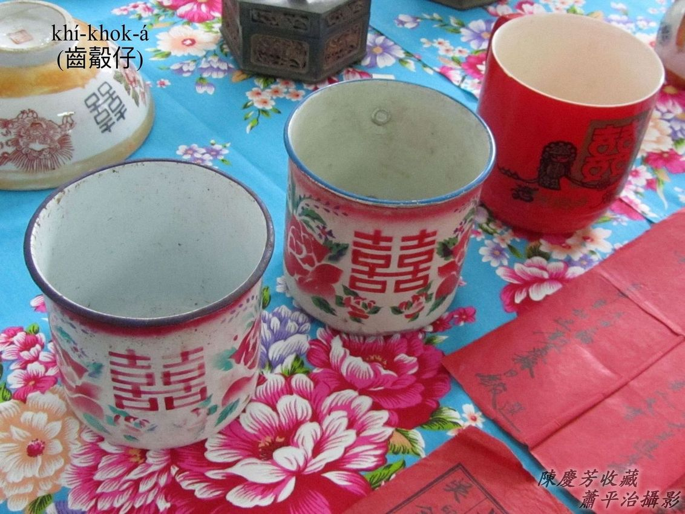
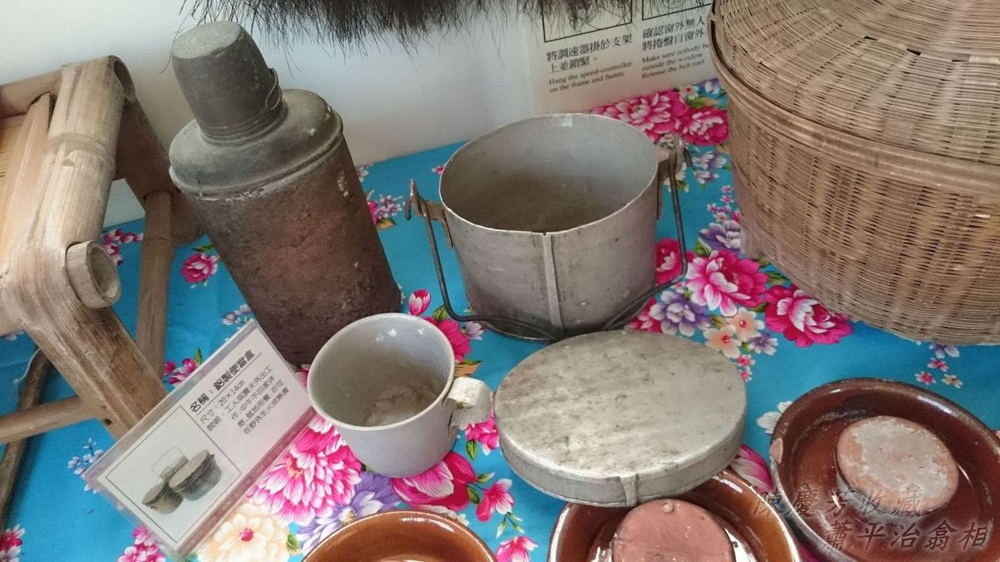
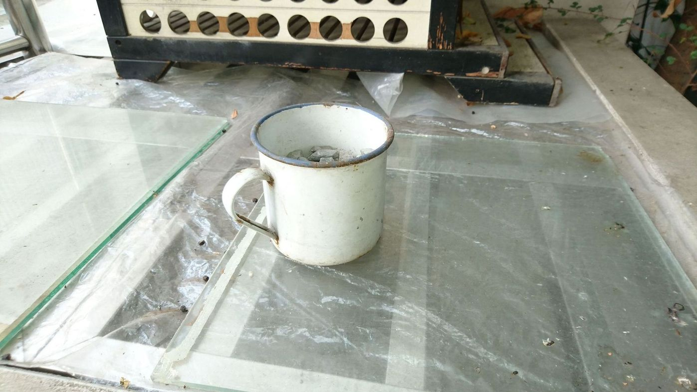

# 5. 註解
> **Chù-kái**

|**詞**|**解說**|
|bâ-bui|『無患子』。|
|ló͘-chí|Celluloid，『賽璐珞』。|
|kng-iāⁿ|光iāⁿ，『光鮮亮麗』。|