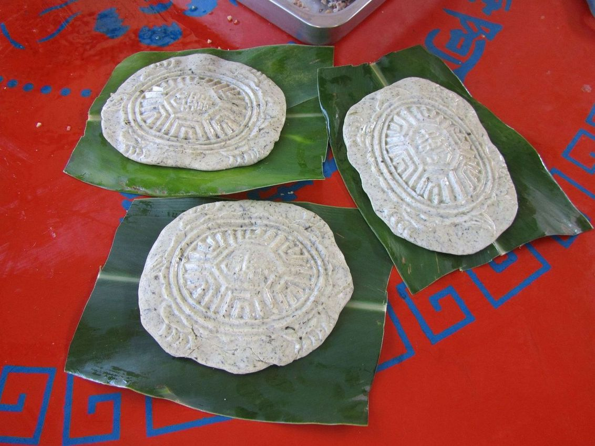
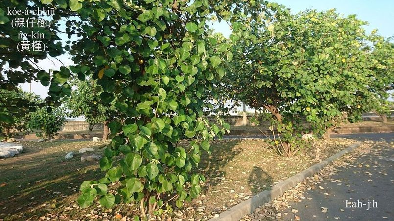
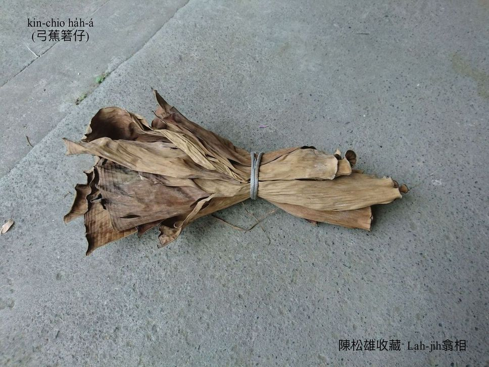
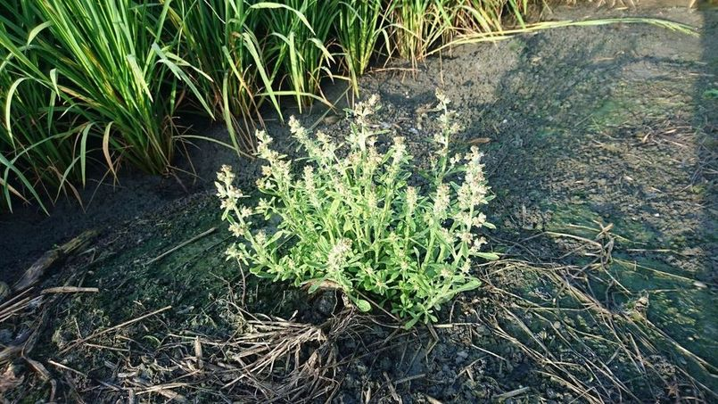
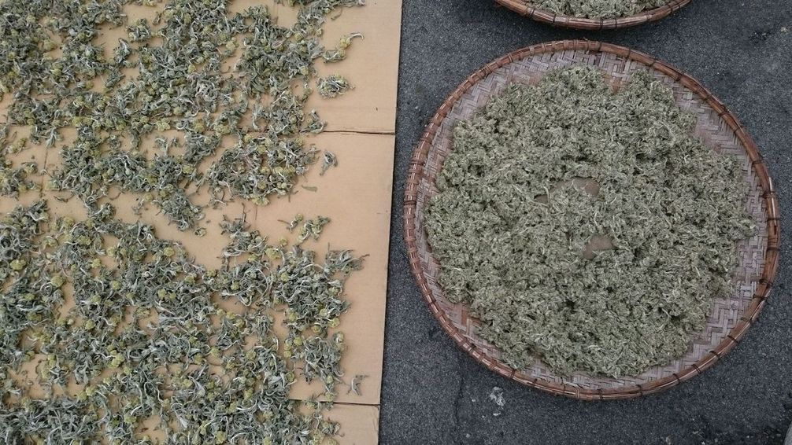
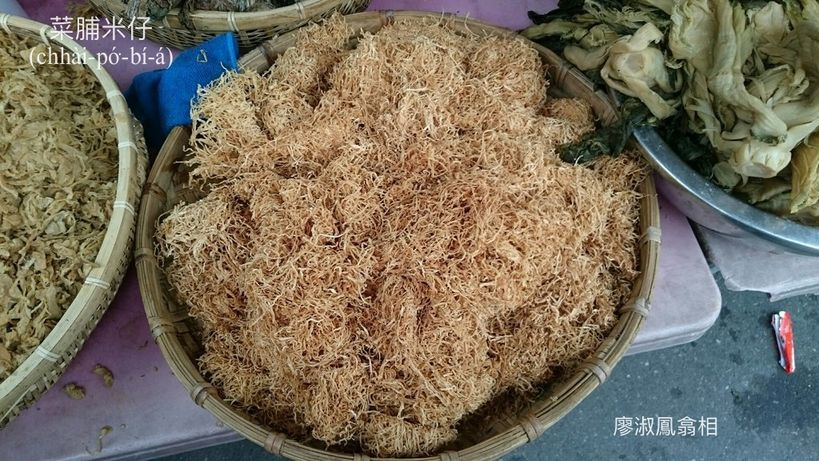

# 粿——食米文化
> **Kóe——Chia̍h-bí Bûn-hòa**

【Chio̍h-bō-á e-kóe（石磨á挨粿）。陳萬來提供相片。】

粿（kóe／ké）是食米文化ê食物，做粿炊粿過程複雜麻煩，m̄是日常三頓ê食si̍t。

年節拜祖先、敬神明tio̍h做粿，廟寺神明生、嫁娶鬧熱tio̍h做粿，祖廟祭祖、喪事pōe墓tio̍h做粿，序大做生日、gín-á做四月日mā tio̍h做粿，粿是台灣人禮俗真重要ê祭品、禮物，粿路不止á chē。

# 1. 做粿ê原料
> **Chò-kóe ê Goân-liāu**

挨粿ê白米有chu̍t米、蓬萊米、在來米。Chu̍t米khah黏，蓬萊米普通，在來米bē黏，為tio̍h khiū度無kāng，有時需要無kāng ê白米，àn比例落去lām，號做「phòa」，親像1斗圓chu̍t-á phòa 1升蓬萊，to̍h khah bē siuⁿ黏siuⁿ軟；粿餡有土豆、紅豆、麻á、鹹菜、菜脯米á；有ê粿粞撋鼠麴á、撋hiāⁿ、撋糖、撋紅番á米，粿路無kāng，做法無kāng，口味mā無kāng。

## 1-1. 粿葉á
> **Kóe-hio̍h-á**

Ē-tàng用來chhu粿包粿ê樹葉，to̍h ka叫做粿葉á a̍h是粿ha̍h-á。田中所在用弓蕉葉，Hakka（客家）用硬桃（月桃）葉，現割弓蕉葉chhu粿，曝ta弓蕉葉包包á粿，南部用黃槿樹（粿葉樹）葉。

## 1-2. 粿餡
> **Kóe-āⁿ**
 
粿餡一般khǹg tī外皮內面，講做內餡，nā像生土豆kap chu̍t米chhiau做夥，鼠麴á kap粿粞做夥撋，to̍h是外餡。

紅龜紅龜，包土豆仁hu，粿餡，土豆算是上等kah味，iáu有麻á、紅豆á、敏豆á，nā boeh鹹餡a̍h是半鹹甜，鹹菜、菜脯米á mā是足合味（ha̍h-bī），chia lóng是內餡。

## 1-3. 鼠麴á
> **Chhí-khak-á**

鼠麴草是野生植物，曝ta ē-sái-tit lām粿粞撋做夥來做粿，m̄-nā增加khiū度，koh有一種芳氣。穩冬稻á割了有ê田放leh拋荒，to̍h有鼠麴á生湠，家家戶戶gín-á人to̍h開始挽鼠麴á準備過年做包á粿，除了包á粿tio̍h用鼠麴，清明節a̍h是pōe墓，mā ē撋鼠麴粿粞做鼠麴粿。

## 1-4. 菜脯米á
> **Chhài-pó͘-bí-á**

菜頭削皮chhoah chhiam曝ta，to̍h是菜脯米á，是古早味包á粿半鹹甜siāng合味ê粿餡。

# 2. 粿ê種類
> **Kóe ê Chéng-lūi**

過年tio̍h炊甜粿、發粿、包á粿、菜頭粿，拜天公tio̍h牽á-liau（牽á粿），拜神明需要紅龜粿，桃粿招人來thit-thô，拜祖先pōe墓拜好兄弟á ē-sái-tit拜鼠麴á粿（ō͘草粿）、餅粿、丁á粿，五日節pa̍k米粽、粞粽（粿粽），有閒厝邊隔壁相招tām-sám食巧炊碗粿、炊芋hoâiⁿ粿、chhoah米篩目，iáu有芋粿、油蔥粿、芋梭á粿。各地頭各族群粿路、名稱ē有sió-khóa無kāng。

# 3. 做粿ê工具
> **Chò Kóe ê Kang-khū**

水桶浸米→石磨á挨粿（漿）→粿袋á貯粿漿→椅條畚擔teh粿漿蝕水→先捻幾塊á粿粞sa̍h做粿pô͘ kap粿粞lām做夥→kám-ô͘內nóa粿粞（chham紅番á米、鼠麴á、hiāⁿ）→湯匙á khat餡→粿模印粿→粿葉á chhu粿。

# 4. 炊粿ê家私
> **Chhoe Kóe ê Ke-si**

鼎灶、seⁿ鍋khǹg籠床，做好ê粿排láng-pho͘（籠舖）、籠床層á、pín-á，桌布seh籠床縫bē漏氣，籠床蓋khàm好勢開始炊粿。Hiâⁿ火用大柴hiâⁿ猛火。

# 5. 平常時ê食粿
> **Pêng-siâng-sî ê Chia̍h-kóe**

紅龜粿、包á粿、菜頭粿、碗粿、芋粿、肉粽、米篩目，平常時街路有tè買，庄腳所在mā有生理人taⁿ leh賣。

# 【Lah-jih台灣俗語】

- Ùi俗語「無冬節都boeh so圓，無講冬節kám m̄ so圓。」Ē-tàng了解咱人足愛食粿，足hèng chu̍t米路。

- Ùi俗語「好pháiⁿ粿tio̍h ài ē甜；好pháiⁿ cha-bó͘ tio̍h ài ē生」。Ē-tàng了解咱人足重視傳宗接代ê傳統。

- Ùi俗語「紅龜紅龜，包土豆仁hu」。To̍h知紅色是咱人ê喜氣，土豆餡siāng kah味。

- 「甜粿teh年，發粿發錢，包á粿包金，菜頭粿食點心」。是好頭彩ê俗語、mā是唸謠。

- 「做鬼也搶無芋粿ha̍h。」教示序細做工tio̍h猛lia̍h，用語有khah粗魯。

# 6. 註解
> **Chù-kái**

|**詞**|**解說**|
|粿路|Kóe-lō͘，粿ê種類。|
|khiū|M̄是Q，『軟軟有彈性』。|
|phòa|做粿『以特定比例混合不同的米』。|
|鼠麴á|Chhí-khak-á，『鼠麴草』。|
|撋|Nóa，『揉搓』。|
|hiāⁿ|艾，『艾草』。|
|紅番á米|Âng-hoan-á-bí，『一種色素』。|
|tām-sám|『解饞、淺嚐，為消遣用』。|
|食巧|Chia̍h-khá，食『奇妙、珍奇。少見而且精緻的食物』。|
|蝕水|Si̍h-chúi，『減少、消退，指水分消散』。|
|seh|『把東西塞進孔縫內』。|
|pín-á|『指用各種竹子編成的平板器物。可作牆、門、蒸糕品時放置糕品的平面架子』。|
|好兄弟á|Hó-hiaⁿ-tī-á，『孤魂野鬼、遊魂』。|
|Ō͘草粿|色水倚芋á色ê鼠麴粿，m̄是芋á，chia刁工無寫漢字。|