# 其他粿路紹介
> **Kî-thaⁿ Kóe-lō͘ Siāu-kài**

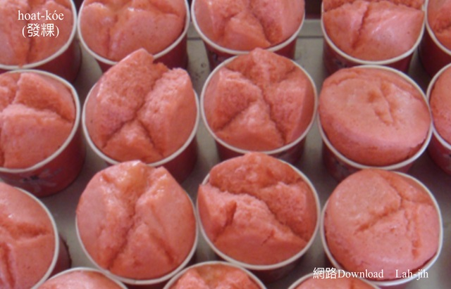

# 1. 菜頭粿
> **Chhài-thâu-kóe**

在來米挨粿漿，菜頭khau皮chhoah chhiam kûn ho͘軟lio̍h，然後粿漿lām菜頭chhiam lām配料落去chhu粿巾ê籠舖內，hiâⁿ火lā ho͘ chiâu-ûn，khǹg粿氣，然後khàm籠床蓋繼續炊ho͘熟。Ē-tàng拜神，ē-tàng煎赤請人客a̍h是食點心。
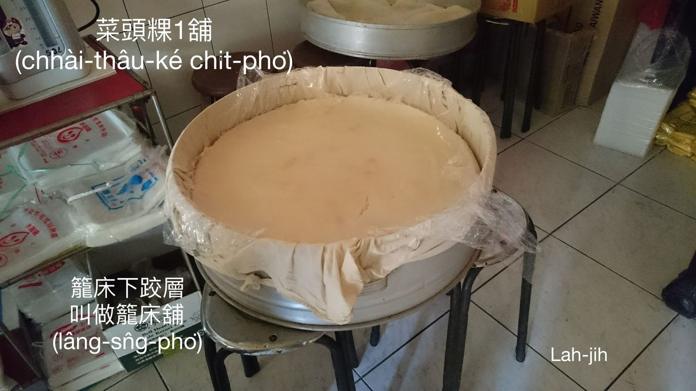
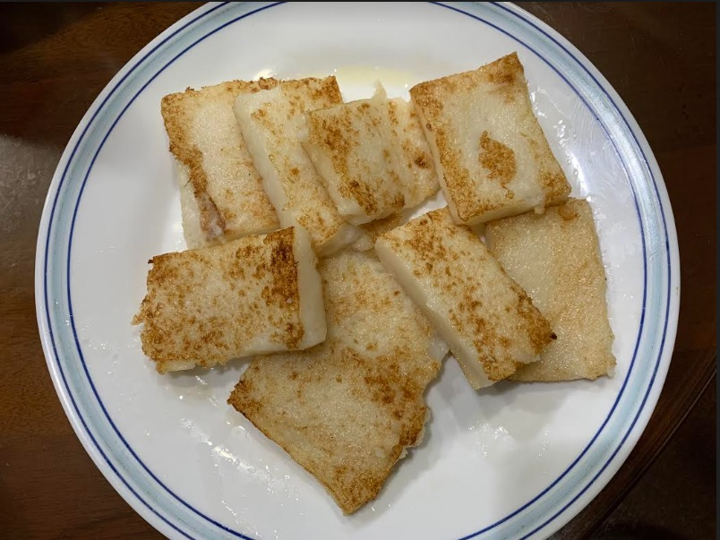

# 2. 芋Hoâiⁿ粿kap芋Hoâiⁿ
> **Ō͘-hoâiⁿ-kóe kap Ō͘-hoâiⁿ**

1、芋hoâiⁿ是芋á收成chiah有ê菜蔬，to̍h是ō͘-koáiⁿ（芋桿）中央khah幼ê部份，ē-tàng煮食，ē-tàng曝芋hoâiⁿ koaⁿ，ē-tàng sīⁿ芋hoâiⁿ-sng。

2、取he iù-jī芋hoâiⁿ lām一寡chhoah chhiam ê芋á做夥sa̍h熟，hām在來米粿漿落去炊，kap炊菜頭粿kāng款，用籠舖炊，to̍h是芋hoâiⁿ粿，芋á tng收成，chiah有人炊leh賣。
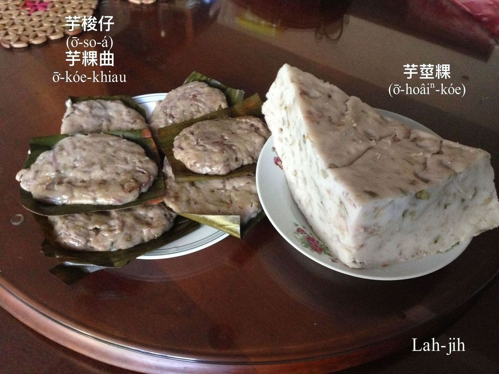
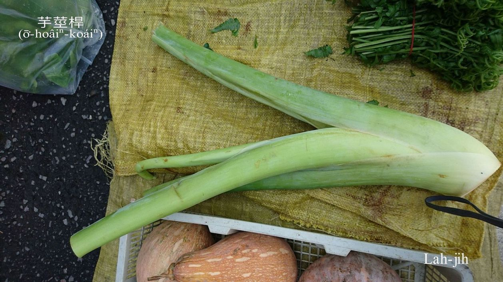
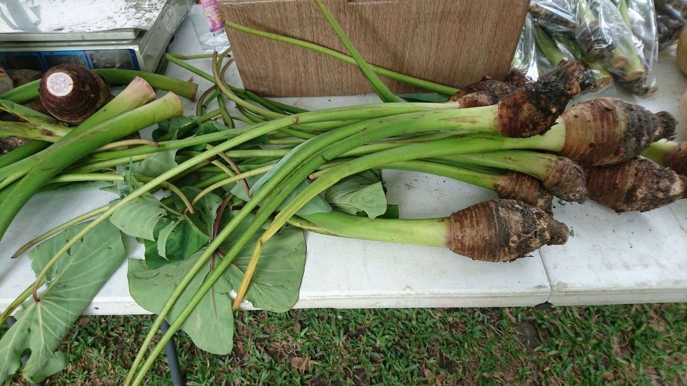

# 3. 芋梭á／芋粿曲
> **Ō͘-so-á/Ō͘-kóe-khiau**

在來米phòa圓chu̍t-á挨粿漿，芋á chhoah chhiam炒紅蔥頭、蝦米做料，chham粿粞lām leh撋，然後lia̍p做梭á形，a̍h是sió-khóa彎曲形，chhu現割ê弓蕉葉，kō͘籠床炊熟，to̍h是芋梭á，kài chē人講做芋粿曲。
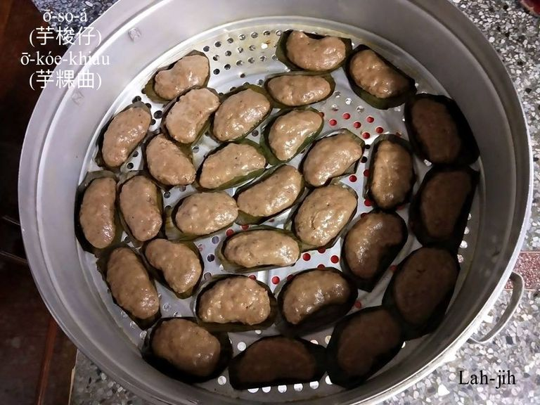  
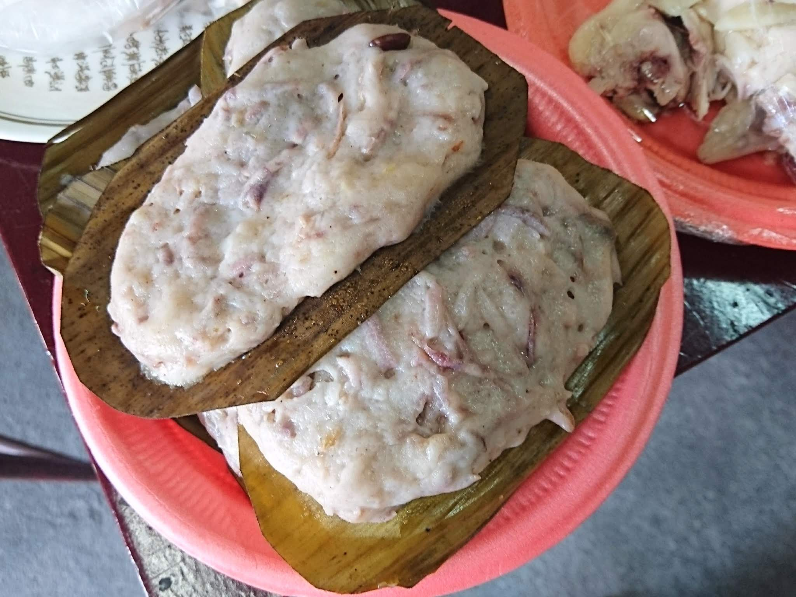

# 4. 包á粿
> **Pau-á-kóe**

挨粿漿撋粿粞kap做紅龜粿相kāng，粿粞撋鼠麴á chham糖，是甜皮，包餡lia̍p sêng四角形，kō͘ ta弓蕉葉á包sêng hâ-pau（荷包）形，chiah koh用鹹草pa̍k tiâu，免用粿印。Ta弓蕉葉á需要浸軟，鹹草pa̍k「+」「−」形做餡料記號，chham土豆hu、菜脯米á、鹹菜、紅豆沙，餡有甜有半鹹甜。

炊包á粿kap炊紅龜粿kāng款，1-sn̂g包含籠舖、籠床層á、pín-á，ē-tàng炊幾nā十粒，包á粿形親像荷包，荷包to̍h是錢包，「包á粿包金」，過年定tio̍h有做包á粿。
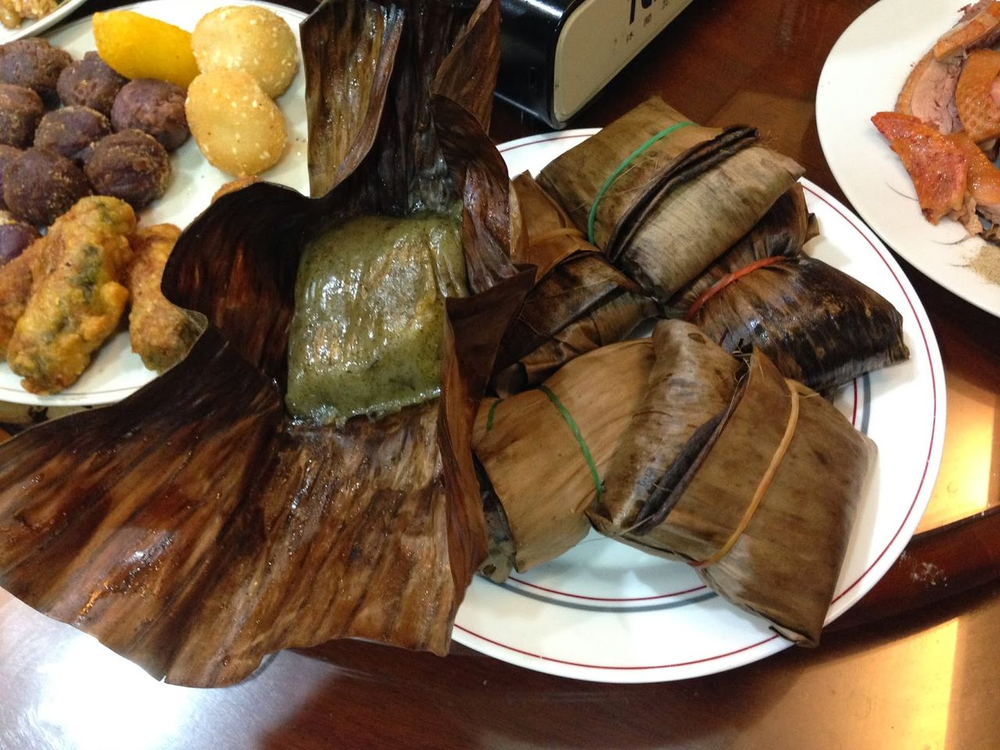  
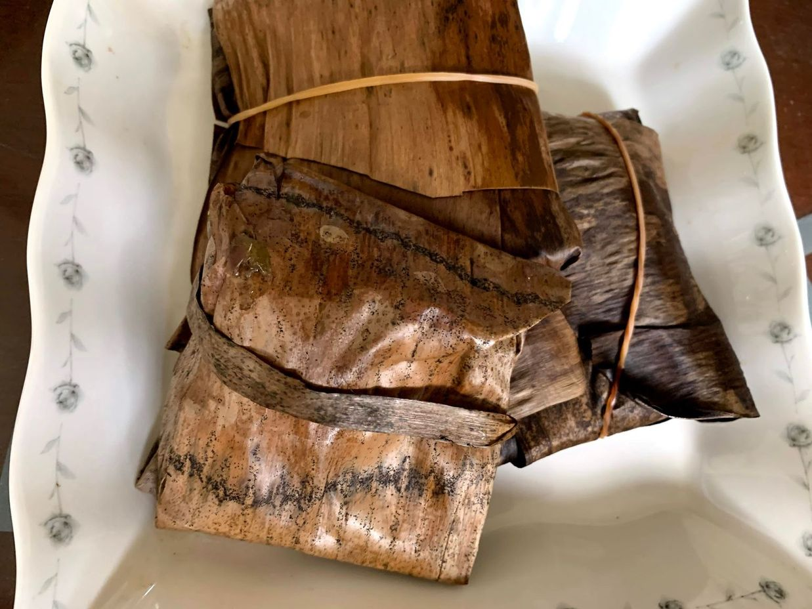

# 5. 發粿
> **Hoat-kóe**

「發粿發錢」，講tio̍h發財大趁錢，世俗人生，人人ài，人人piàⁿ命，過年時當然tio̍h炊發粿khǹg tī尪架桌頂祈求新ê一年ē-tàng發發發，一路發財。

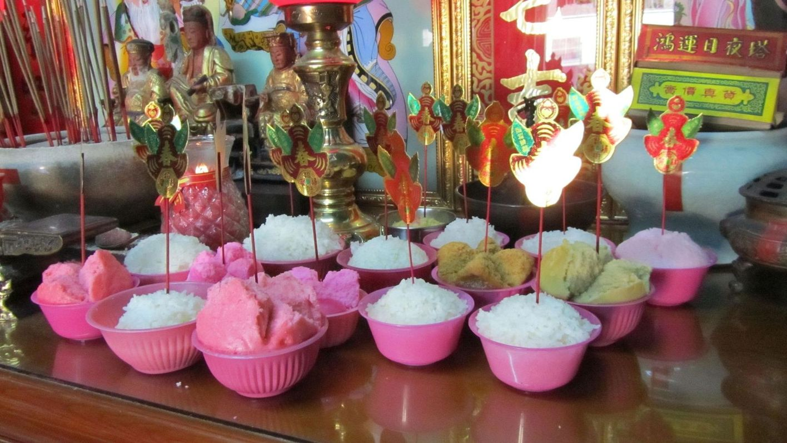

# 6. 丁á粿
> **Teng-á-kóe**

拜墓pōe墓祈求男丁旺盛，需要做丁á粿，用做紅龜粿ê粿粞kap餡，lia̍p一條長長像lān-chiáu，表示出丁生cha-po͘ ê意思。
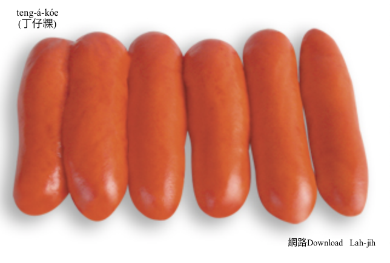

# 7. 碗粿
> **Óaⁿ-kóe**

在來米挨粿漿，水分節tú好，m̄-thang siuⁿ洘m̄-thang siuⁿ清，1碗1碗khat落碗內8分tīⁿ，boeh食鹹--ê，to̍h chham薄薄細塊肉幼á、蝦pi-á kap菜脯幼á；boeh食甜--ê，to̍h chham糖chham ho͘甜甜。然後chiah hē落去籠床炊，炊熟sió-khóa khǹg ho͘冷，食--起-來chiah ē軟sìm-sìm khiū-teh-teh。甜--ê m̄免koh chham料，鹹--ê攪古早味ê豆油膏siāng合味。食碗粿tio̍h先chhoân家私，用竹篾á削1支ná船poe ê碗粿chhiám-á，用碗粿chhiám-á tiàm碗內切做1角1角，chiah用碗粿chhiám-á thuh起來食。
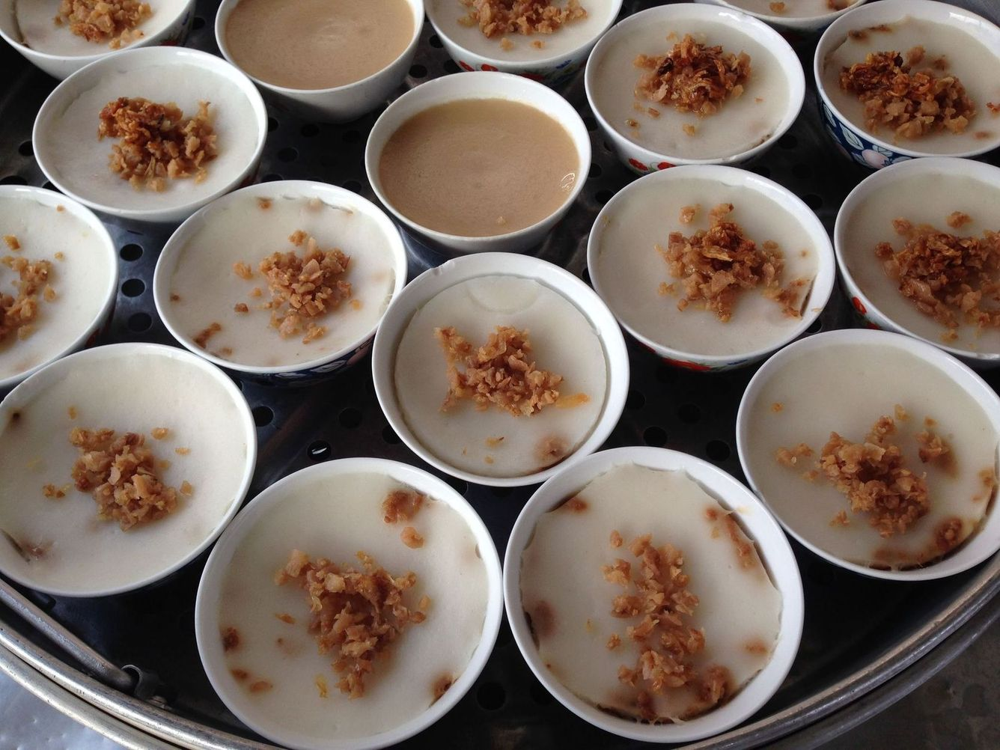
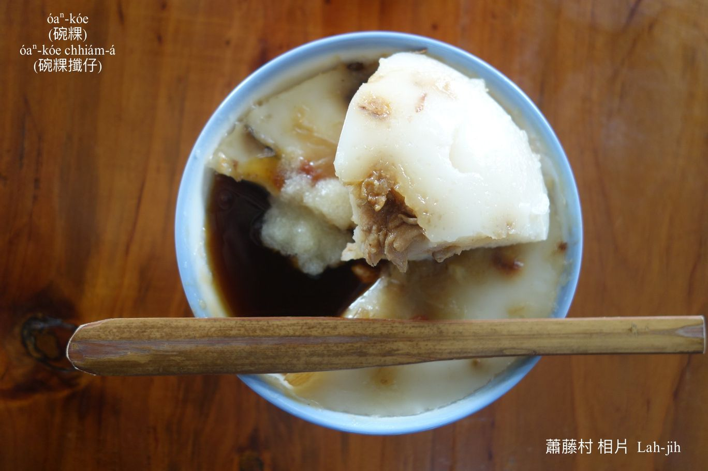

# 8. 粽、Pa̍k粽
> **Chàng, Pa̍k-chàng**

粽mā是粿路ê一種，有用石磨á挨漿ê粞粽／粿粽，有直接kō͘尖chu̍t-á pa̍k ê米粽，浸kiⁿ-chúi（鹼水）pa̍k ê kiⁿ-chàng（鹼粽），不過限制tī拜公媽、地基主、好兄弟á，bē-tàng拜神明。

一粒粽ê完成，需要內面包餡，外面包粽葉kap pa̍k結，因為pa̍k ê技術khah oh學，m̄-chiah khah早祖媽時代lóng mā講pa̍k粽，pa̍k米粽pa̍k粞粽pa̍k鹼粽，無人講包粽。

Pa̍k粽華語講『包粽』，『包粽包中，包中獎』，自án-ne pa̍k粽開始有人講包粽。

政治人物kám m̄ chai-iáⁿ粽是拜陰--ê，kan-nā為tio̍h選舉，soah m̄ bat咱ê禮俗hām禁忌。

## 8-1. 粽角ê禁忌
> **Chàng-kak ê Kìm-khī**

1粒粽有4-ê粽角，gín-á bē-sái-tit食，為siáⁿ-mih？因為gín-á食了ē生粒á發角，所以只好大人ka咬起來食掉。其實是大人iau-sâi所致，tī hit-lō sàn-phí-phí ê時代，tn̄g-tio̍h年節pa̍k粽mā chiah pa̍k he 1-kōaⁿ 2-kōaⁿ，gín-á頭嘴chē，爸母m̄ kam食，儉leh hō͘ gín-á食，爸母只有咬粽角teh iau-sâi。

## 8-2. 米粽
> **Bí-chàng**

米粽to̍h是m̄免挨，直接用生米落去pa̍k粽，pa̍k米粽tio̍h用尖chu̍t-á（長chu̍t-á）pa̍k，食--起-來khah khiū。Chu̍t米洗好，淋一寡豆油落鼎炒--一-下，另外準備生土豆kap油蔥tong蝦豬肉炒ê配料做餡，粽葉á siāng好用現挽麻竹葉á 2-phôe（皮）包餡，koh lām 4-5粒生土豆，大約20粒pa̍k做1-kōaⁿ，落鼎a̍h是鍋á內sa̍h熟。Chit-mái ê米粽餡料phang-phài，已經改名做「pa̍k肉粽」。
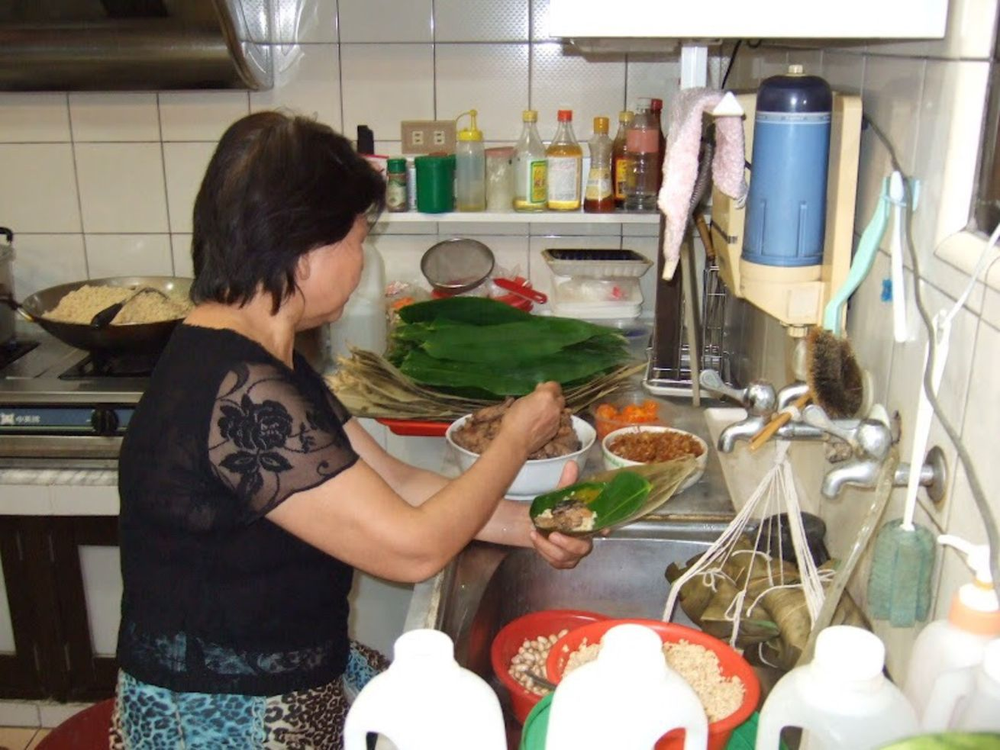

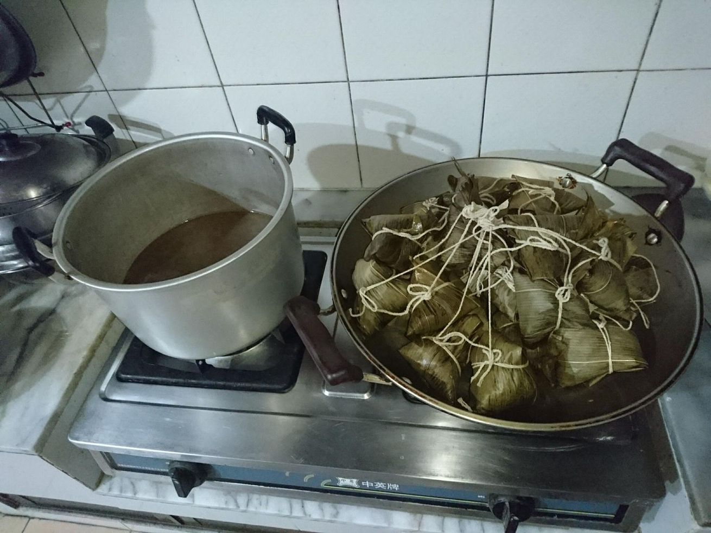

## 8-3. 粞粽／粿粽
> **Chhè-chàng/Kóe-chàng**

粞粽有人講做粿粽，用圓chu̍t-á phòa蓬萊米挨漿、蝕水、chham糖、撋粿粞、包餡、pa̍k粽，粿餡有豬肉、土豆hu、鹹菜，sa̍h熟ē-tàng khǹg khah久，因為厚工koh無像米粽hiah-nī好食，chit-mái khah少人pa̍k。
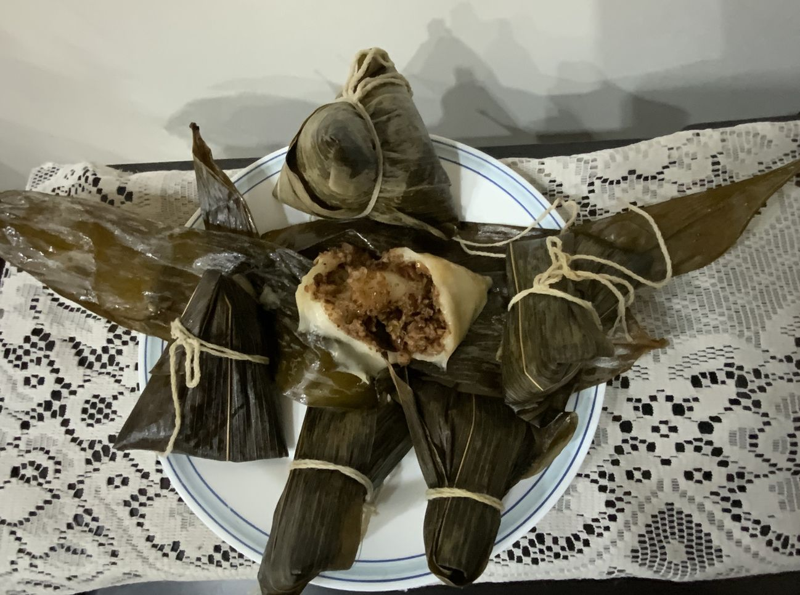

## 8-4. 鹼粽
> **Kiⁿ-chàng**

鹼粽ê原料kan-nā chu̍t米浸鹼水，看是簡單，boeh pa̍k koh tio̍h師傅。古早pa̍k鹼粽用ê鹼是用稻草火hu濾--出-來ê鹼水，chhiau圓chu̍t-á，需要用現挽chhiⁿ麻竹葉á包米粒，免餡，米粒bē-sái-tit siuⁿ chē，因為sa̍h熟ē膨脹，所以索á mā bē-sái-tit pa̍k siuⁿ ân。冰涼ùn糖膏siāng好食。
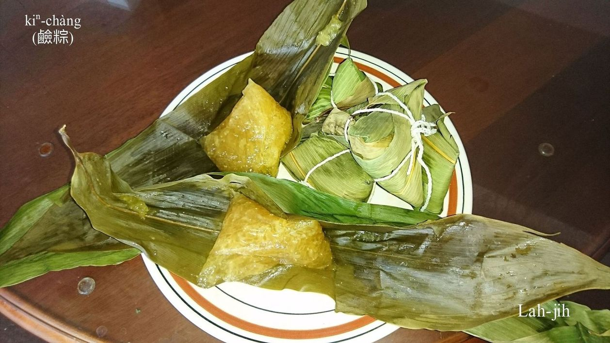
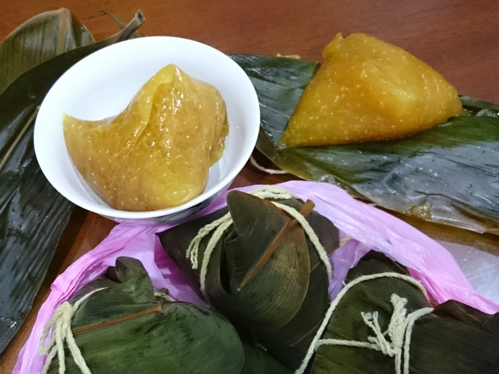

# 9. 麻糍
> **Môa-chî**

古早用chu̍t米煮熟，khǹg落去舂臼cheng麻糍，mā有用chu̍t米粿漿，用籠床炊熟，lia̍p 1丸1丸ùn土豆hu kap糖粉。
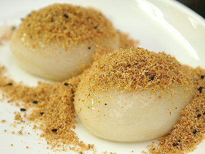

# 10. 註解
> **Chù-kái**

|**詞**|**解說**|
|粿路|Kóe-lō͘，粿ê種類。|
|khiū|M̄是Q，『軟軟有彈性』。|
|phòa|做粿『以特定比例混合不同的米』。|
|鼠麴á|Chhí-khak-á，『鼠麴草』。|
|撋|Nóa，『揉搓』。|
|蝕水|Si̍h-chúi，『減少、消退，指水分消散』。|
|lā ho͘ chiâu-ûn|『攪拌均勻』。|
|軟sìm-sìm|『柔軟有彈性』。|
|khiū-teh-teh|『非常有彈性』。|
|船poe|Chûn-pe／chûn-poe，『船槳』。|
|iau-sâi|『貪吃、嘴饞』。|
|sàn-phí-phí|『窮得不得了』。|
|mā chiah pa̍k he 1-kōaⁿ 2-kōaⁿ|『才綁那麼一串兩串』。|
|pín-á|『指用各種竹子編成的平板器物。可作牆、門、蒸糕品時放置糕品的平面架子』。|
|siuⁿ ân|『太緊』。|
|生lia̍p-á|生粒á，『長癩痢頭』；『皮膚病。由葡萄球菌或鏈狀菌侵入毛囊內所引起的。症狀是局部出現充血硬塊、化膿、紅腫、疼痛，嚴重時全身會發熱而且感覺疲倦』。|
|公媽|Kong-má，『祖先』。|
|地基主|Tē-ki-chú，『地祇。指最早期原先居住在這塊土地上的原地主，原地主過世後的靈體則被稱為地基主。是臺灣民間經常祭拜的神明』。|
|好兄弟á|Hó-hiaⁿ-tī-á，『孤魂野鬼、遊魂』。|
