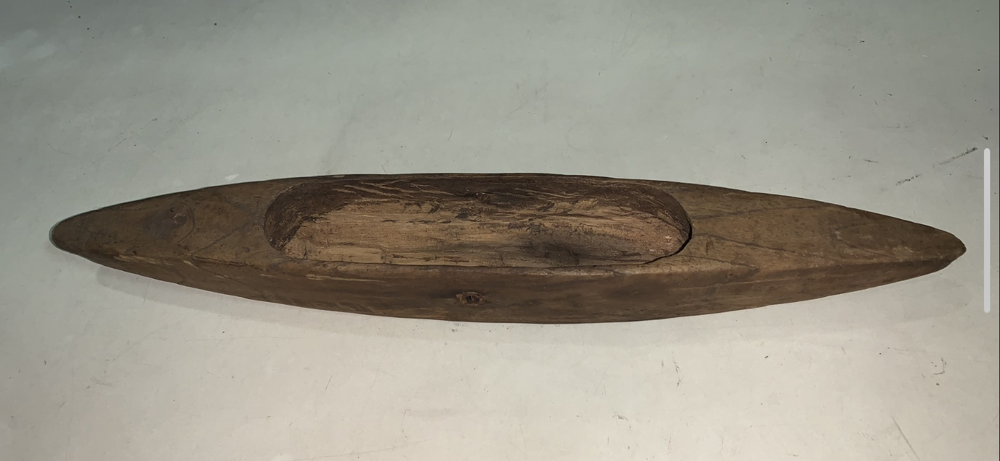
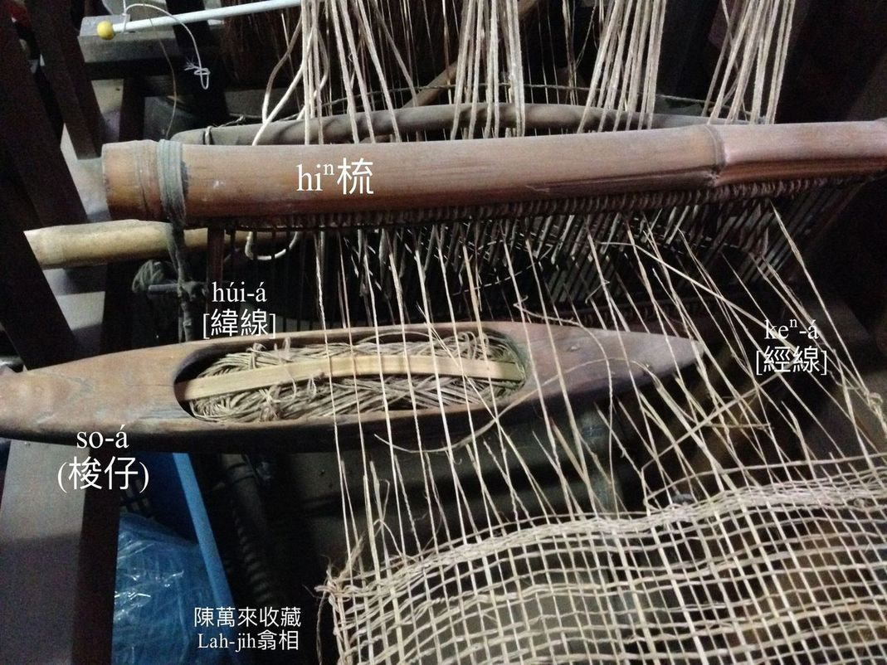
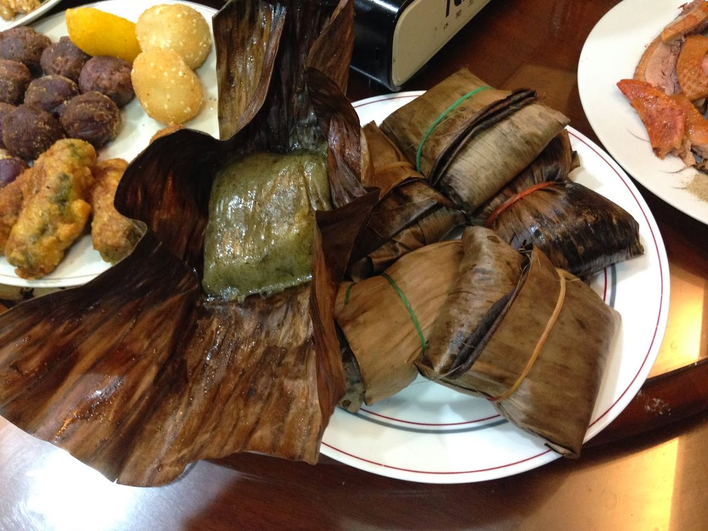
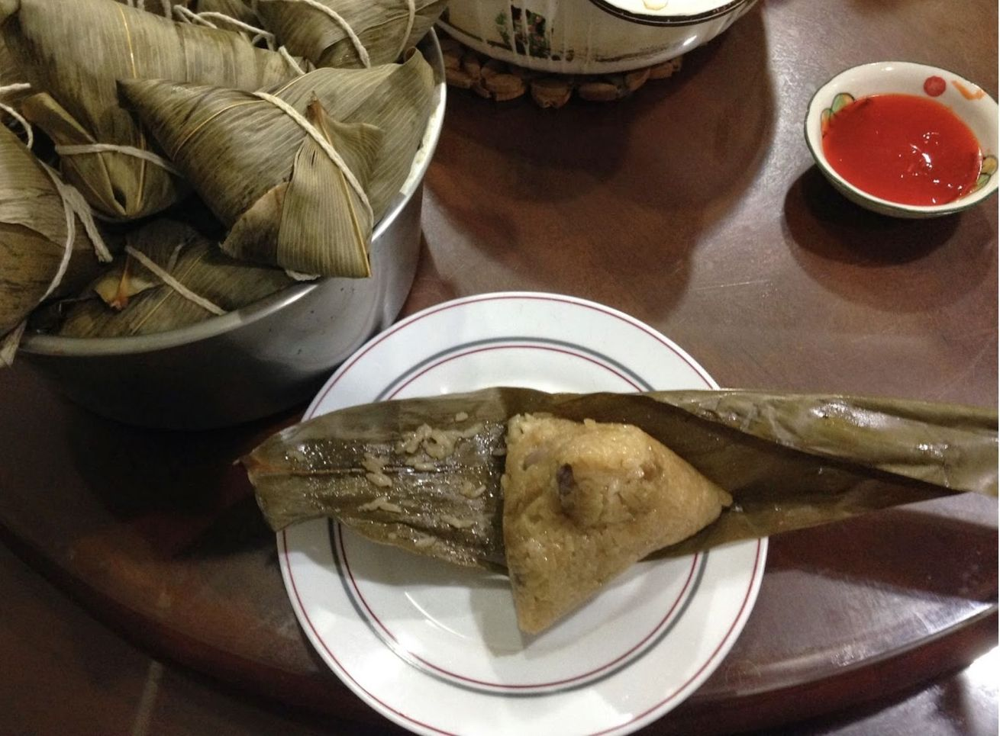
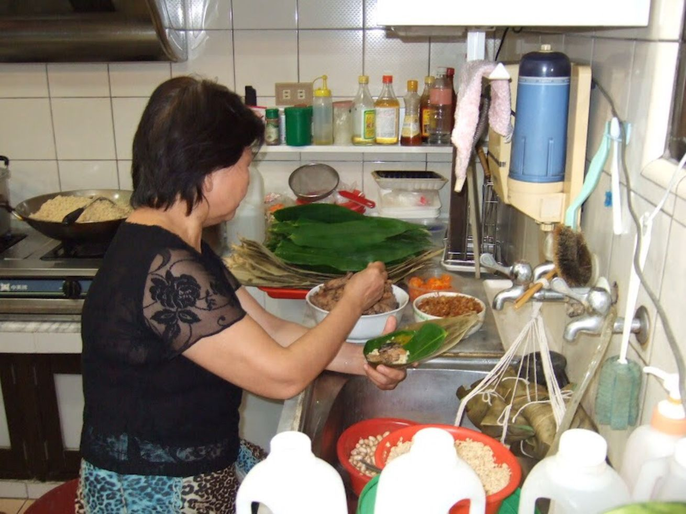
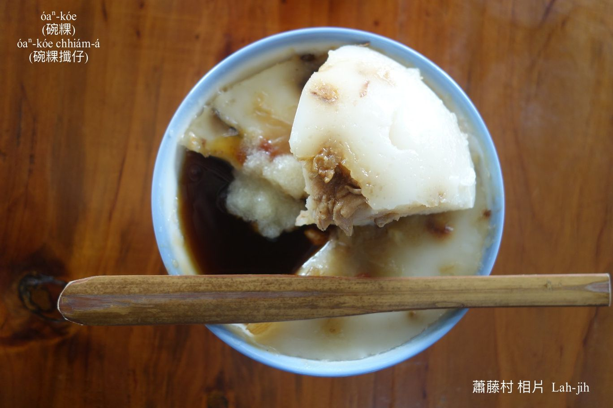
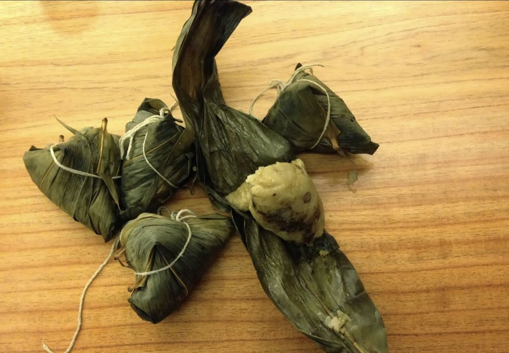
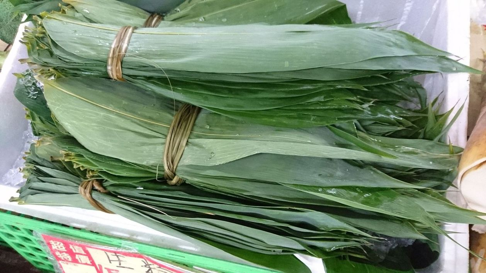
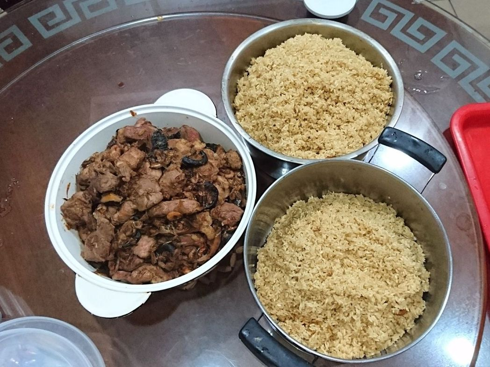
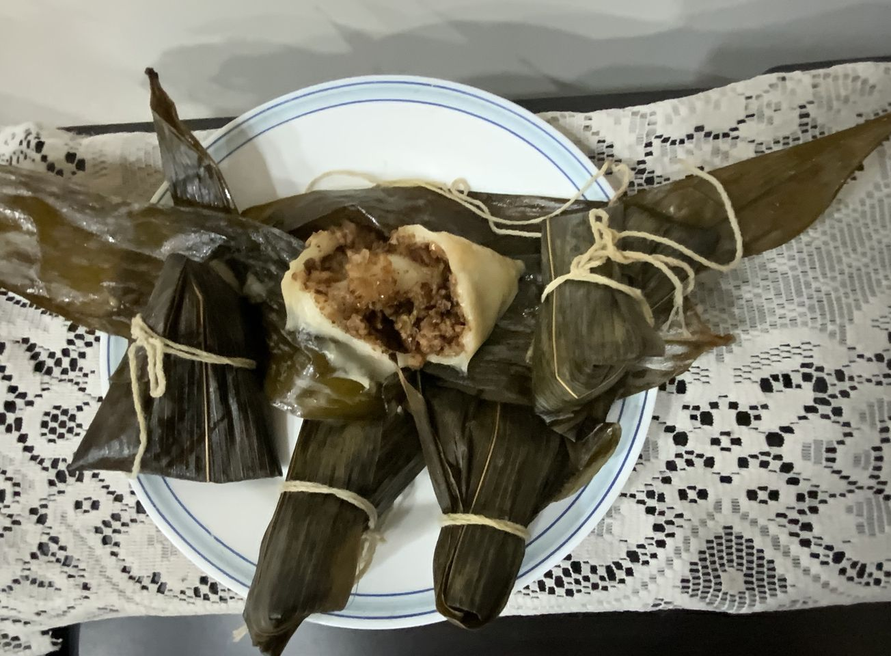

# 粿ê散文9篇
> **Kóe ê Sòaⁿ-bûn 9 Phiⁿ**

# 1. 芋Hoâiⁿ粿kah芋梭á
> **Ō͘-hoâiⁿ-kóe kah Ō͘-so-á**

2014-08-09

芋hoâiⁿ粿是在來米lām芋hoâiⁿ落去做--ê，kap菜頭粿kāng款，只是原料無kāng。

Ō͘-hoâiⁿ to̍h是芋莖，芋á ê葉柄阮講ō͘-koáiⁿ（芋桿），nā是he ō͘-koáiⁿ中央khah幼ê部份，to̍h講做ō͘-hoâiⁿ，ē-tàng絲來煮食、曝ō͘-hoâiⁿ酸、炊ō͘-hoâiⁿ粿，其實芋hoâiⁿ、ō͘-koáiⁿ lóng是芋á葉ê柄。 

Ō͘-hoâiⁿ粿罕得人炊，因為厚工koh tio̍h tn̄g tio̍h芋á收成ê時陣，chiah有芋hoâiⁿ thang做。Ō͘-hoâiⁿ需要kā外皮si-si--leh chiah ē-sái-tit煮食炊粿，chit-mái芋á tng-leh出，chiah有人炊來賣，khah早庄腳人lóng mā ka-tī炊，厝邊頭尾招招--leh同齊炊，khah免互相看人食。

芋梭á有人講做芋粿khiau，是芋á chhoah chhiam lām chu̍t米粿粞落去炊，阮崁頂庄時行keⁿ黃麻布做副業，keⁿ布ê hiⁿ-kui有一粒梭á，雙頭尖梭尖梭ná橄á子，所以阮kā芋粿khiau lia̍p做梭á型，to̍h號做芋梭á，nā lia̍p做sió-khóa彎khiau--一-下to̍h號做芋粿khiau。
 
Chit兩項粿路，我lóng真有路，食bē ùi，chit-mái ka-tī m̄-bat做，tio̍h去kā人買，去買he庄腳人做--ê chiah有合古早味。

（梭á。）

# 2. 包á粿
> **Pau-á-kóe**

20140204_Lah-jih

「甜粿teh年，發粿發錢，包á粿包金，菜頭粿kiat點心。」因為甜粿khǹg久bē hāi，sió-khóa生菇洗洗lù-lù to̍h ē-sái-tit煎來食；發粿開花親像『開口笑』，講tio̍h錢財人人愛，『8888』 ē-tàng chiâⁿ做『發發發發』你to̍h知台灣人頭殼內leh想siáⁿ？包á粿sêng「hâ-pau（荷包）／皮包á」，皮包á boeh貯錢，當然意愛tī心內；菜頭粿是在來米kap菜頭炊--ê，bē khǹg--得，sió-khóa無注意to̍h ē臭酸味，m̄ chiah初五隔開進前趕緊煎來請人客食點心。

包á粿ê粿粞kap甜粿kāng款是圓chu̍t-á挨，chiah kā粿粞chham曝ta處理--過ê鼠麴á lām leh nóa，m̄-nā有特別芳味，mā增加khiū度，kan-nā食外皮to̍h比甜粿khah好食。

包á粿餡有土豆hu、紅豆、敏豆、花螺á豆、鹹菜、菜脯米á，ē-sái-tit互相配合，boeh甜boeh鹹a̍h是半鹹甜在人kah意，siāng kah味是半鹹甜土豆仁hu lām鹹菜、菜脯米á ê口味。

包包á粿ê粿ha̍h-á是曝ta ê弓蕉葉á，boeh包進前需要浸水hō͘伊nńg-lio̍h，包好ê包á粿sêng四角皮包á形，chiah用鹹草pa̍k-ân，pa̍k「一」字形a̍h是「十」字形做分別內餡ê無kāng。

落籠床炊熟ê包á粿，kan-nā phīⁿ tio̍h味to̍h知是包á粿味，chu̍t米、鼠麴á、弓蕉ha̍h-á sio-lām ê氣味，真正siâⁿ人趕緊boeh tháu一粒來食。

炊傳統古早味包á粿厚工koh少人ē-hiáu欣賞伊ê氣味，ē-hiáu做boeh做ê人愈來愈少，soah好tio̍h生理人，街路市場排擔á賣包á粿滿滿是，興食koh pān-tōaⁿ炊，kui-khì市á買幾塊á來拜公媽mā thang teh-giàn治iau-sâi，現代ê包á粿為tio̍h省工緊捷，lóng用樹奶kho͘-á束，khah無傳統文化。

# 3. Pa̍k五日節粽  
> **Pa̍k Gō͘-ji̍t-cheh Chàng**

Lah-jih_20140601 

燒燙燙ê五日節粽已經sa̍h熟--à，tháu一粒來teh嘴kho͘，好食！好食！Sa̍h了有透，chu̍t米ê khiū，粽ha̍h ê芳，比粽餡koh-khah siâⁿ人流嘴nōa，粽餡ê料mā無hân-san，三層肉、香菇、土豆仁、半粒鹹卵仁，『不錯吃』實在有影真好食，無kā你騙。媽媽ê口味，牽--e chit手功夫，是siâⁿ gín-á「回鄉」ê撇步。

# 4. 碗粿
> **Óaⁿ-kóe**

碗粿，用在來米挨ê粿漿，1碗1碗貯ho͘八分tīⁿ，boeh食鹹--ê，to̍h chham薄薄細塊肉幼á kap菜脯幼á；boeh食甜--ê，to̍h chham糖chham ho͘甜甜。然後chiah hē落去籠床炊，炊熟sió-khóa khǹg ho͘冷，食--起-來chiah ē軟sìm-sìm koh khiū-teh-teh。甜--ê m̄免koh chham料，鹹--ê淋古早味ê豆油膏siāng合味。食碗粿tio̍h先chhoân家私，用竹篾á削1支ná船poe ê碗粿chhiám-á，碗粿軟軟khiū-khiū，用碗粿chhiám-á liô做細塊豆腐角，豆油lâm--落-去 to̍h ē-sái-tit食kah嘴笑目笑，古早gín-á時ê記智。食碗粿，khah食mā是阮崁頂庄ê碗粿siāng kài合味，田中（Chhân-tiong）媽祖宮口chit擔to̍h是崁頂庄cha-bó͘-kiáⁿ ê料理。

# 5. Chàng

Lah-jih_20131211

Nā是講「pa̍k-chàng」to̍h是pa̍k粽ê粽；nā是講「chàng-chàng」to̍h是lak袋á貯磅子──無錢ê意思；ah nā是講「làu-chàng」to̍h是講穿插無整齊無pih-chah  ê意思。

粽餡包肉是肉粽，包菜是菜粽，nā是lām kiⁿ（鹼）無包餡叫做鹼粽。一般用長chu̍t米lām料包餡chiah用麻竹ha̍h-á去包去pa̍k ê粽是米粽，nā經過石磨挨chiâⁿ粿粞，chiah來包餡包粽ha̍h-á，to̍h叫做粞粽a̍h是粿粽。

Pa̍k粽需要麻竹葉á kap棉紗線a̍h是鹹草、黃麻絲pa̍k，chit-mái多數人講「包肉粽」，m̄-koh khah早阮lóng講「pa̍k粽」，無人講「包粽」，包，tio̍h技術，pa̍k，mā tio̍h技術，包ê技術現教現學to̍h ē-hiáu，nā  pa̍k ê撇步，無經過炊--過是看bē出--來，pa̍k了siuⁿ ân，ē chuh--出-來，pa̍k了siuⁿ lēng，索á ē lak--去，你看，pa̍k khah師傅a̍h是包khah厲害？

為siáⁿ-mih ē時行講「包粽」？包粽華語講『包粽／包中』，ta̍k ê lóng mā希望中獎、高中，『當選』to̍h是『凍蒜』，政治人物根本m̄-bat，紅龜粿是leh拜神，「粽」是leh拜祖先、好兄弟á，「chàng」是chàng-chàng無sián-thâu-á（無錢），m̄是好吉兆，kap he『凍蒜』kāng款，hō͘冰凍結，tn̄g-tio̍h頂司koh tio̍h『如搗蒜』，kám是男子漢大丈夫？

海邊為tio̍h減少海波浪，有thia̍p肉粽角，形體to̍h親像粽，1粒粽有4-kâi角，古早生活艱苦sàn食人，年節做粿pa̍k粽chhoân牲禮，tio̍h儉腸neh肚，拜神明公媽了後，chia ê好料--ê大人m̄ kam食，儉儉hō͘ gín-á食，特別粿、粽，做是無幾塊，pa̍k是1-2-kōaⁿ，罕得tang時chiah有粿粽thang食，大人mā是ē iau-sâi，姑不將，m̄知siáⁿ人、siáⁿ時規定，講gín-á bē-sái-tit食粽角，講食了ē發角，發角to̍h是生lia̍p-á腫--起-來，害gín-á m̄敢食，只好hō͘大人處理掉…，aih！想--起-來to̍h為khah早ê爸母心頭酸。

# 6. Pa̍k粽
> **Pa̍k-chàng**

Lah-jih 2011/6/5

五日節tih-boeh到，阿媽已經tī厝後leh挽粽ha̍h-á，準備boeh pa̍k粽。

「阿媽！挽粽ha̍h-á boeh pa̍k粽hō͘我食--ho͘ⁿh？」

「Hiô--lah！明á載五日節--à neh，tio̍h拜乖，tio̍h拜神明，mā ài拜公媽。」

「人我知影，老師講，五日節to̍h是『端午節』，是leh記念『屈原』--ê！」

「Siáⁿ-mih『痴緣』阿媽m̄-bat，阿媽kan-nā知影五日節tio̍h pa̍k粽，pa̍k hō͘阿孫--e食，阿孫--e siāng ài食肉粽。」

「阿媽，阿媽！我問你一句俗語--ō͘，「五日節粽無食，破裘á m̄ kam放。」是siáⁿ-mih意思？Che是老師kā阮講--ê。」

「乖孫--e，你boeh kā阿媽考試--hio͘h？Ah che阿媽知影，to̍h是講五日節粽nā食--過，to̍h m̄免koh穿厚衫á--lah，tio̍h--bò͘？」

「阿媽！Siáⁿ-mih是裘á？」

「寒天穿ê大衣--lah，內裡有鋪綿á，to̍h是過年前阿公買hō͘--你hit領。」

「『謝謝！』阿媽！阿媽，我koh問你1 ê問題，ná-ē ta̍k-pái阿媽lóng ài挽厝後壁chit bô͘麻竹ê葉á來包肉粽？」

「你m̄是講siāng kah意阿媽pa̍k ê肉粽？」

「是--ā，阿媽pa̍k ê肉粽特別好食，kap外口買--ê無kāng，親像有一種無kāng款ê芳味。」

「Hit種芳味to̍h是麻竹葉á ê芳味--lah，m̄-chiah講做粽ha̍h-á，用tăⁿ挽ê竹葉á pa̍k肉粽siāng kài芳。」

「也無--à？」我kā手--裡ê粽ha̍h-á phīⁿ看māi--leh。

「等盈暗sa̍h粽ê時陣你to̍h知！」

原來he to̍h是阿媽pa̍k肉粽ê祕訣。

食暗飽，阿媽kap媽媽to̍h開始pa̍k肉粽，粽餡用1-kâi khaⁿ-á貯--leh，有香菇炒半肥瘦ê豬肉，mā有tong蝦，蝦pi-á，炒kah足芳--ê；另外chu̍t米lām生土豆仁chhiau-chhiau做1-ē，khǹg-tiàm鍋á內，早起阿媽挽ê粽ha̍h-á洗好khǹg tī 1-kha竹籃á內，兩隻有phēng ê椅á椅koaiⁿ頂，khòe一支畚擔，畚擔中央套兩kōaⁿ用鹹草做ê粽kōaⁿ，阿媽、媽媽，一人坐1-pêng，粽料khǹg中央，親像兩ê人boeh比賽ê款式。我想tio̍h liâm-mi to̍h有肉粽thang食，soah bē-giàn出去thit-thô，to̍h搬一塊圓椅頭á坐tiàm邊--a鬥鬧熱。

「媽媽！你kap阿媽相piàⁿ，siáⁿ-mih人khah緊？」

「當然mā阿媽，阿媽是pa̍k粽師傅，媽媽是師á，leh kap阿媽學，你tiām-tiām看，mā kā阿媽ê功夫學--起-來！」

「阿媽！我mā boeh pa̍k粽。」

「好！坐倚來阿媽chit pêng，阿媽kā你教：乖孫--e，你看！阿媽提兩phôe粽ha̍h-á，án-ne ka áu--起-來，下pêng尖尖hia ài相tha̍h，chiah bē hō͘ chu̍t米chuh--出-來；koh來khat兩匙á chu̍t米kap土豆--落-去，m̄-thang siuⁿchē，sòa--落-去boeh khǹg粽餡，mā是用湯匙á khat，一粒粽khǹg一蕊香菇、一塊豬肉，khat無tio̍h香菇、豬肉tio̍h ài thiⁿ，加--ê ài提--起-來，餡siuⁿ少無好食，siuⁿ chē mā無好食，tú好siāng要緊。」阿媽沿路講沿路pa̍k，ta̍uh-ta̍uh-á kā我教。

「O͘h！Hiah-nī費氣--ò͘！」

「O͘h！到taⁿ你chiah知，你--ò͘！阿不姊--à，kan-nā ē-hiáu boeh食boeh食--niâ！」媽媽笑笑á講，hō͘我感覺pháiⁿ勢pháiⁿ勢。

「乖孫--e，bē--lah，tio̍h-ài有耐心，chiah做有好頭路。餡khǹg好，tio̍h koh hē一寡米，然後包粽ha̍h-á，注意看--ō͘，án-ne áu--過-來，chiah koh án-ne áu--過-去，thóng--出-來ê部份，chiah koh lia̍p-lia̍p chhi̍h-chhi̍h--leh，一粒粽已經包好，sòa--落-去tio̍h-ài ka pa̍k tiàm粽kōaⁿ，pa̍k ho͘ tú好á ân，siuⁿ ân sa̍h熟ē chuh--出-來，siuⁿ lēng ē lak--去，che tio̍h靠經驗，有影講kah hō͘你bat，嘴鬚to̍h好phah結。Iáu有--ō͘！Phah結tio̍h phah活結，m̄-thang phah死結，boeh tháu粽m̄-chiah ē好tháu。」

「阿媽！Mài講hiah–nī chē--lah，人聽kah bū-sà-sà，後pái chiah kap你學，人kan-nā想boeh食粽--lah！Lóng m̄ khah緊--leh--ō͘！」

「嘴kho͘ leh chhoah--à，m̄-chiah án-ne吵？先去sńg--一-時-à，等--一-下轉--來to̍h有肉粽thang食。」

「O͘h！足芳--ê，芳kòng-kòng、kòng-kòng芳，阿媽！我boeh食肉粽。」Tī門口埕kap人sńg一時á，to̍h phīⁿ tio̍h肉粽味，趕緊chông--轉-來。

「乖孫--e，iáu未熟--lah，koh去thit-thô，liâm-mi chiah轉來食！」

「阿媽騙--人，我有phīⁿ tio̍h肉粽味，芳kòng-kòng、kòng-kòng芳，害人流嘴齒nōa--neh，mài kā人騙--lah！」

「阿媽無kā你騙，肉粽iáu未熟--lah！M̄信，去灶頭鼎頂phīⁿ看māi，tăⁿ sa̍h無gōa久，m̄-koh肉粽芳味已經走--出-來-à！真芳--ho͘ⁿh！」

「Ḿh！足芳--ê，一定真好食！」……

「母--à，ē-sái-tit起鼎--未？」聽媽媽問阿媽，又koh hō͘我吞嘴nōa。

「掀起來看māi，應該熟--à！」

「我來tháu一粒試看māi！」

「阿母！你食看--leh，看米心有透--無！」

「熟--à，sa̍h了chiâⁿ tú好khiū。」
看阿媽食一嘴，害我吞一下嘴nōa，「來！乖孫--e，先hō͘你食看māi，liâm-mi起鼎khah冷了後，chiah koh hō͘你食一粒！」

「多謝阿媽！」阿媽pa̍k ê肉粽，實在好食，阿媽講了無m̄ tio̍h，用生粽ha̍h-á pa̍k ê肉粽，無kāng款to̍h是無kāng款。

「阿媽！我boeh koh問你1 ê問題，五日節除了拜拜食肉粽以外，kám iáu有siáⁿ-mih節目？」

「五月五，龍船鼓。」

「阿媽！你講siáⁿ？」

「五月五，龍船鼓。to̍h是講有人leh pê龍船，pê龍船ê時陣，to̍h有1-ê人leh phah鼓，tin-tong叫，chiâⁿ鬧熱，我是tī電視頂看--tio̍h-ê。」

「阿媽！Mā有人chhāi雞卵、鴨卵比賽，我mā是tī電視頂看--tio̍h-ê，明á中晝咱mā來chhāi看māi--leh好--無。」

「好！等恁阿爸轉--來，chiah去買寡雞卵，mā kā恁阿爸講，阿媽明年boeh去鹿港看pê龍船，tio̍h ài ē記--得-ō͘。」

「好！阿媽！我boeh koh食一粒！」

「Boeh食ka-tī去tháu，chit粒食了to̍h m̄-thang koh boeh，食siuⁿ chē，ē pháiⁿ腹肚。」

「好！」

肉粽實在好食！我siāng kah意食阿媽pa̍k ê肉粽，chu̍t米做--ê，用生麻竹ha̍h-á包--ê，khiū-khiū芳芳，包土豆仁、瘦肉、香菇、蝦仁……。

Pa̍k粽！Pa̍k肉粽！麻竹ha̍h-á pa̍k ê肉粽！阿媽pa̍k ê肉粽！好食！Hō͘人想tio̍h嘴nōa水一直流！

# 7. 粿印kap紅龜粿
> **Kóe-ìn kap Âng-ku-kóe**

20131101_Lah-jih

做粿ê粿印，通常刻有龜、桃、餅、牽á-liau 4種粿模，龜表示長歲壽；桃是壽桃kap thit-thô；圓形ê餅，tn̂g-liau形ê牽á-liau khah特別，有特殊ê祭拜chiah用ē tio̍h。

通常講紅龜粿是指有ní紅番á米ê紅色壽龜kap壽桃，用來拜神拜公媽，桃模印ê桃粿，ē-sái-tit做等路，嬰á四月日轉外家阿媽tau，thit-thô幾工後boeh轉--來，外媽ē送1-lam雞á-kiáⁿ做chhōa-lō͘雞á，kap做紅桃粿hō͘孫--e chah轉去做等路，hēng厝邊隔壁。Ùi「好pháiⁿ粿tio̍h ài ē甜，好pháiⁿ cha-bó͘ tio̍h ài ē生」kap「紅龜紅龜，包土豆仁hu」chit 2句俗語to̍h知，糖kap土豆仁hu是粿餡kài重要ê原料。

餅是圓形ê粿，有人講做銀粿，m̄是糕餅，kap紅龜粿kāng款，chit-mái khah少人用。牽á-liau有人講做牽á粿，圓形tâng-sián（銅錢）thia̍p相連做1-liau，tio̍h chhoân 12-liau，閏月加1-liau，意思是錢財日日牽相連，月月接sòa，是拜天公專用，正月初九天公生（玉皇大帝），正月15、7月15、10月15三界公生（mā是天公）kap下願答謝天公chiah-tio̍h chhoân。

以上chia ê粿lóng是染紅色，nā kā粿粞hām鼠麴á nóa做夥，to̍h pìⁿ-chiâⁿ芋á色，叫做鼠麴á粿、ō͘-chháu粿、ō͘-chháu-ku，食--起-來加真khiū真好食，m̄-koh bē-sái-tit拜神明，kan-nā ē-tàng pōe墓、拜公媽、地基主、好兄弟á。

# 8. 粽、Pa̍k粽        	
> **Chàng, Pa̍k-chàng**

20200624       	Lahjih

粽：是民俗信仰祭品，mā是市場一款點心。民間做五日節、七月普渡，tio̍h pa̍k粽孝敬祖先、拜地基主、拜好兄弟á。粽to̍h是bē-sái-tit拜神明。

Pa̍k粽：粽ha̍h對áu做khat-á形，hē米chham生土豆kap粽餡，chiah koh hē米khàm餡，然後kā粽ha̍h包做四个角，chiah用棉紗線粽kōaⁿ pa̍k活結，重點tī chit ê「pa̍k」，siuⁿ ân siuⁿ lēng lóng bē-sái--tit，siuⁿ ân sa̍h好ê chu̍t米ē chuh--出-來，siuⁿ lēng sa̍h好ē làu粽。「包粽」「làu粽」lóng m̄是好話。

粽餡：三層肉a̍h是胛心肉、生塗豆、香菇、tong蝦、油蔥、豆油、胡椒是主要，boeh加栗子、鹹鴨卵仁、滷肉、干貝mā無嫌。

米粽：用尖chu̍t-á和粽餡pa̍k ê粽，古早講「米粽」，chit-má講「肉粽」。

粞粽粿粽：用圓chu̍t-á挨漿nóa做粿粞，chiah來包餡pa̍k粽，號做「粞粽a̍h是粿粽」，khah細粒，khah ē khǹg--得，古早無冰箱，khah有人pa̍k。

鹼粽：用尖chu̍t-á浸鹼水，tio̍h用現挽chhiⁿ-chhioh麻竹葉á包。古早燒稻草濾鹼水，chit-má用食用鹼。Pa̍k鹼粽比pa̍k米粽khah師傅，sa̍h好ê鹼粽ē膨脹，所以米粒bē-sái-tit貯到tīⁿ，pa̍k kōaⁿ tio̍h liōng膨脹ê額，sa̍h好chiah-bē chuh--出來。鹼粽一般無包餡，boeh食tio̍h ùn糖膏a̍h是蜂蜜，冰涼涼食熱天，心涼脾土開。

粽ha̍h粽葉：Chàng-ha̍h to̍h是chàng-hio̍h，ē-tàng pa̍k粽ê麻竹葉á、硬桃葉、桂竹、轎篙竹（石笱竹）ê kah-ha̍h-á（甲ha̍h-á）lóng是pa̍k粽ê粽ha̍h-á/粽葉á。

五日節，pa̍k肉粽，siâⁿ人流嘴nōa，肉粽芳味，是通台灣人記智。
竹葉硬桃無kāng味，sa̍h粽炊粽功夫oh-tit比。
有人kah意硬桃味，有人鼻tio̍h竹葉芳，to̍h想tio̍h老母ê氣味。
有人hèng燒酒，有人hèng土豆。
肉粽口味萬百款，請問，你kah意toh一項。
我siāng kah意原味，原味是gín-á時代記智。
麻竹葉包生米，pa̍k粽落鼎sa̍h，崁頂庄祖媽ê滋味。

# 9. 粞粽
> **Chhè-chàng**

Lahjih 20200905

M̄ boeh 20冬m̄-bat食粞粽，hit日市場看著粞粽，隨ka買5粒轉來teh癮teh嘴kho͘，雖bóng pa̍k kah pháiⁿ看樣，無像khah早阿嫂ê技藝，tháu開食看māi koh不止á好食，有記智ê古早味。

粞粽是用粿粞包餡ê粽，mā有講做粿粽，用圓chu̍t-á挨漿蝕水nóa做粿粞，chiah一粒一粒包餡包竹ha̍h-á，pa̍k好tio̍h 1-kōaⁿ 1-kōaⁿ落去籠床炊熟，kah做紅龜粿kāng款厚工。
Éng過無冰箱，五日節七月半pa̍k粽，lóng著用餾--ê chiah-bē去hō͘臭酸生菇。Pa̍k米粽khah省工，m̄-koh快生黏，khah-bē khǹg--得，nā pa̍k粞粽to̍h ē-tàng加khǹg kúi-nā工，gín-á討boeh食，炊軟to̍h ē使--得，有時無炊mā是食kah嘴笑目笑，tī hit ê sàn赤年代ê庄腳gín-á，爸母siāng驚伊看人食。

Chit-má ê人，錢水活、驚費氣，lóng mā買便--ê，錢hō͘人趁khah清閒。Nā是有才調有興趣家己pa̍k粽，mā是pa̍k米粽（chit-má lóng講做肉粽），siâⁿ人有hit-lō閒工、才調去挨粿、teh粿漿、洗粽ha̍h、pa̍k粽、炊粽‥‥‥？米粽簡單用sa̍h--ê，粿粽需要籠床用炊--ê，kan-nā想心to̍h冷一半。

Chit-má ê人，見講to̍h是肉粽、『包粽』，kan-nā siàu想選舉boeh贏，考試想boeh『高中』，kā pa̍k粽文化、意義、語言lóng oai-chhoa̍h kah不顛lā-kài，時代leh變，變kah無傳承，實在可嘆。

# 10. 註解
> **Chù-kái**

|**詞**|**解說**|
|粿路|Kóe-lō͘，粿ê種類。|
|khiū|M̄是Q，『軟軟有彈性』。|
|鼠麴á|Chhí-khak-á，『鼠麴草』。|
|撋|Nóa，『揉搓』。|
|紅番á米| ng-hoan-á-bí，『一種色素』。|
|蝕水|Si̍h-chúi，『減少、消退，指水分消散』。|
|軟sìm-sìm|『柔軟有彈性』。|
|khiū-teh-teh|『非常有彈性』。|
|船poe|Chûn-pe/ chûn-poe，『船槳』。|
|iau-sâi|，『貪吃、嘴饞』。|
|ùi|『東西吃太多而感到厭膩』。|
|絲來煮食|『表皮有纖維蔬菜，需要將纖維部份如抽絲般剔除』講做絲si，做動詞用。|
|kiat點心|食點心。|
|phīⁿ tio̍h味|『聞到味道』。|
|興食|Hèng-chia̍h，『很喜歡吃』。|
|kui-khì|『乾脆』。|
|teh-giàn|『止住極度嗜好的慾望』。|
|hiⁿ-kui|是『織布機』，“hiⁿ”是keⁿ黃麻布ê聲音，“kui”是機。|
|治iau-sâi|Tī iau-sâi，解決『貪吃、嘴饞』ê問題。|
|hân-san|Tàng-sng，『形容一個人吝嗇、小氣，過分節省』。|
|撇步|Phiat-pō͘，『訣竅』。|
|pih-chah|『衣冠楚楚。衣著整齊合身』。|
|siuⁿ ân|『太緊』。|
|ē chuh--出-來|『會溢出到粽葉外面來』。|
|siuⁿ lēng|『太鬆』。|
|索á ē lak--去|『繩子會鬆脫』。|
|儉腸neh肚|khiām-tn̂g neh-tō͘，『省食儉用』。|
|chia ê|『這些』。|
|姑不將|Ko͘-put-chiang，『姑且，不得已』。Ko͘-put-lī-chiang/ ko͘-put-lī-saⁿ-chiang。|
|生lia̍p-á|生粒á，『長癩痢頭』；『皮膚病。由葡萄球菌或鏈狀菌侵入毛囊內所引起的。症狀是局部出現充血硬塊、化膿、紅腫、疼痛，嚴重時全身會發熱而且感覺疲倦』。|
|ta̍uh-ta̍uh-á|『慢慢地』。|
|嘴kho͘ leh chhoah--à|『形容很想吃的嘴巴狀態』。|
|chông--轉-來|『衝回來』。|
|liâm-mi|『等一下，馬上』。|
|芳kòng-kòng、kòng-kòng芳|『香噴噴』。|
|chhōa-lō͘雞|『帶路雞、引路雞。結婚禮俗中，新人第一次從娘家做客回家時，娘家會贈送新人一對雞，希望這對雞能常常帶新人回娘家做客』。|
|公媽|Kong-má，『祖先』。|
|地基主|Tē-ki-chú，『地祇。指最早期原先居住在這塊土地上的原地主，原地主過世後的靈體則被稱為地基主。是臺灣民間經常祭拜的神明』。|
|好兄弟á|Hó-hiaⁿ-tī-á，『孤魂野鬼、遊魂』。|
