# 講親Chiâⁿ kap一寡結緣ê文書
> **Kóng Chhin-chiâⁿ kap Chi̍t-kóa Kiat-iân ê Bûn-su**

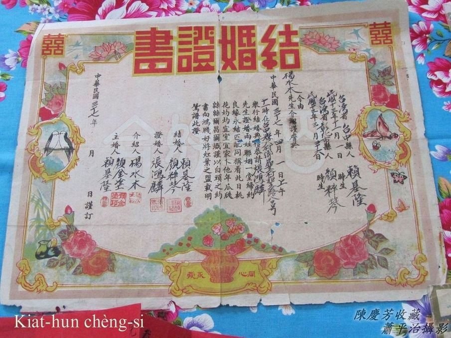

親chiâⁿ ê後生kap女朋友感情成熟，女方序大歡喜咱去講親chiâⁿ，親chiâⁿ招我tàu-tīn拜訪，意思是叫我做便媒人。自由時代，男女意愛，做便媒人雖bóng m̄免「媒人嘴hô͘-lùi-lùi」，必要ê傳統嫁娶風俗mā tio̍h了解，chiah ē-tit kap liáng-hong（兩方）親家親姆溝通參詳，互相交換意見，hō͘ chit層婚姻美滿完成。

雙方爸母kài a-sá-lih，禮貌談說因緣kap姻緣，有緣chiah ē結親chiâⁿ，既然是親chiâⁿ，to̍h直話直說，大聘m̄免，小聘隨意，kan-ta要求禮餅夠額，其他禮俗隨人發落mài khi-khiau。拜訪sūn-sòa講親chiâⁿ提八字，完成任務。
Sòa--落去to̍h是請日師看日，揀好時好日，teh-tiāⁿ、嫁娶。

# 1. Hām嫁娶相關ê文件
> **Hām Kè-chhōa Siong-koan ê Bûn-kiāⁿ**

## 1-1. 日課
> **Ji̍t-khò**

Kè-chhōa kiat-khò（嫁娶吉課）：
Khîm sek chê-bî（琴瑟齊眉）；Loân hōng hô-bêng（鸞鳳和鳴）。

根據結婚cha-po͘（乾造）cha-bó͘（坤造）出世（乙丑）年（己卯）月（乙亥）日（癸未）時chit八字，chiah-koh參考雙方父母ê出世年月日時，péng通書chhōe出teh-tiāⁿ（納采）做新娘衫（裁衣）做báng罩（合帳）安新娘房（安床）娶新娘/嫁cha-bó͘-kiáⁿ（嫁娶）⋯一大堆ê金木水火土五行相生相剋ê規律作用，tī便格式紅紙寫出良時吉日thang好進行美滿姻緣。

出生年月日時，應用天干甲、乙、丙、丁、戊、己、庚、辛、壬、癸；十二地支子、丑、寅、卯、辰、巳、午、未、申、酉、戌、亥排列組合六十甲子。
（乙丑）年（己卯）月（乙亥）日（癸未）時，合倚--來tú好八字漢字，to̍h是八字，號做落土時，八字命。
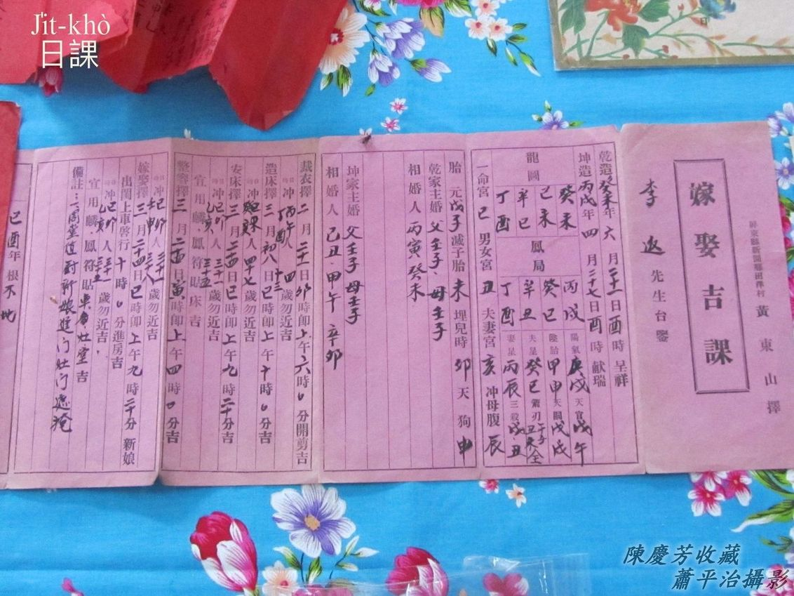
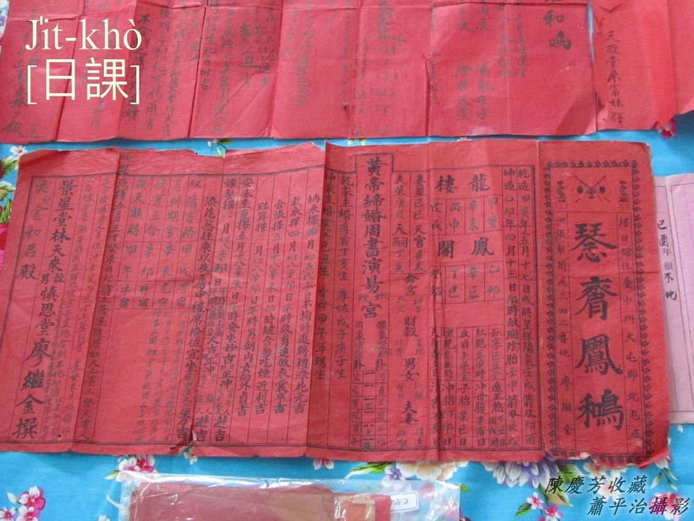

## 1-2. 妝單
> **Chng-toaⁿ**

嫁cha-bó͘ kiáⁿ實在是1-chân大tāi-chì大開銷，俗語講：「有--ê嫁餅，無--ê賣kiáⁿ。」好額人嫁cha-bó͘ kiáⁿ，m̄-nā大餅通庄hēng，出嫁hit工是kioh-á排kui列，siāⁿ底嫁妝ta̍k項有。嫁妝chē，驚失落，需要1件1件點清楚，mā是chiâⁿ費氣。Kui-khì妝單寫寫--leh，照單送貨照單收貨，khah-bē têng-tâⁿ。

昭和15年張好出嫁買物費用簿。昭和2年作嫁粧貼取貨。昭和7年訂盟簿（密）。奩單（Liâm-toaⁿ）m̄知內容寫siáⁿ-mih？
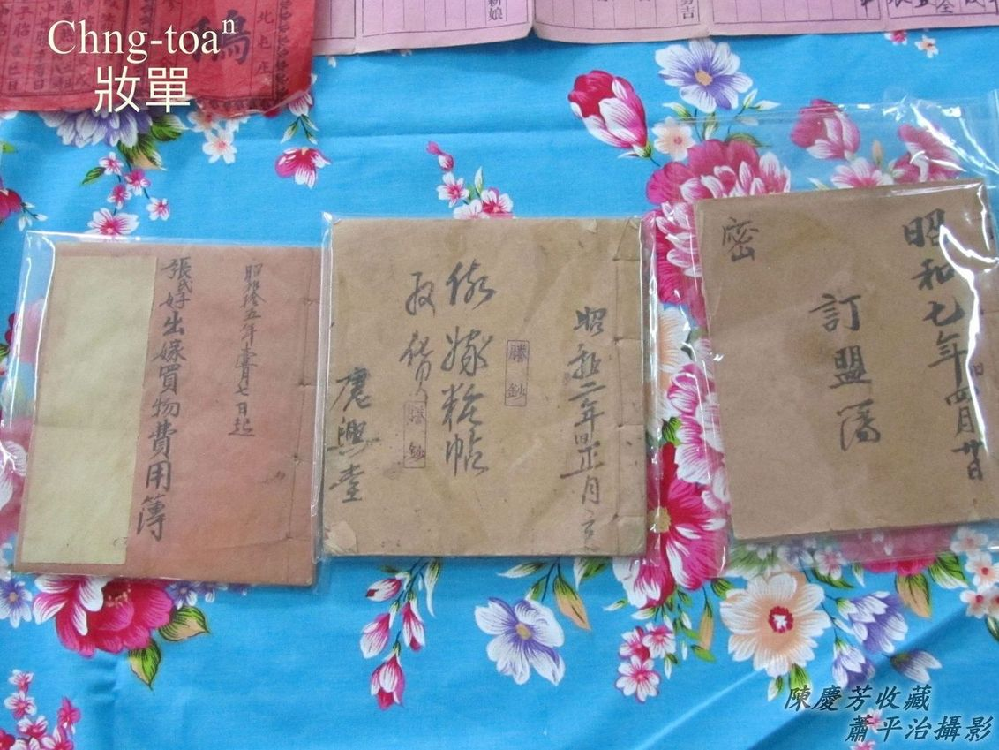
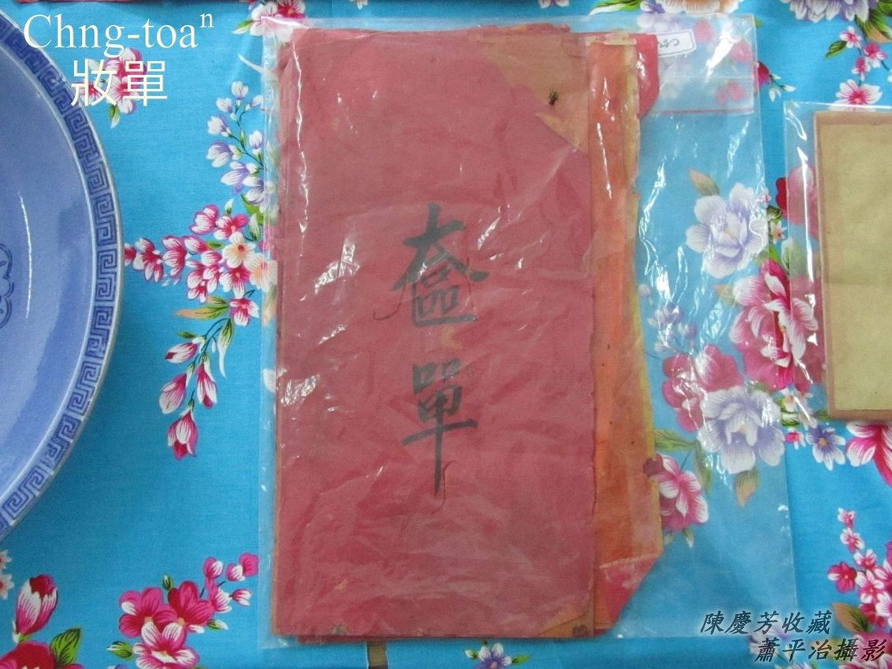

## 1-3. 結婚證書
> **Kiat-hun chèng-si**

1949年結婚證書，內面記載結婚人、證婚人、介紹人、主婚人姓名，koh-tio̍h請戶籍主任、副主任teh私印公印做見證人，因為是囍事，所以盡量取雙雙對對。新郎新娘各一份。
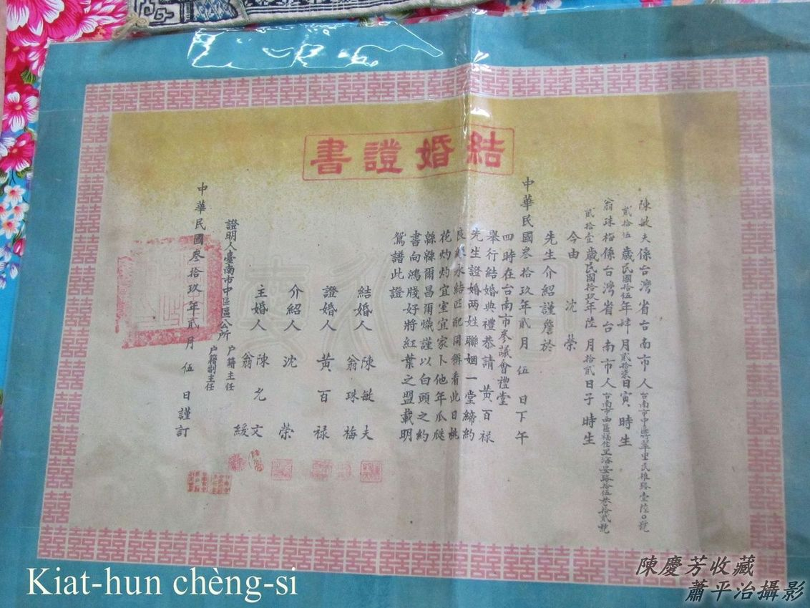
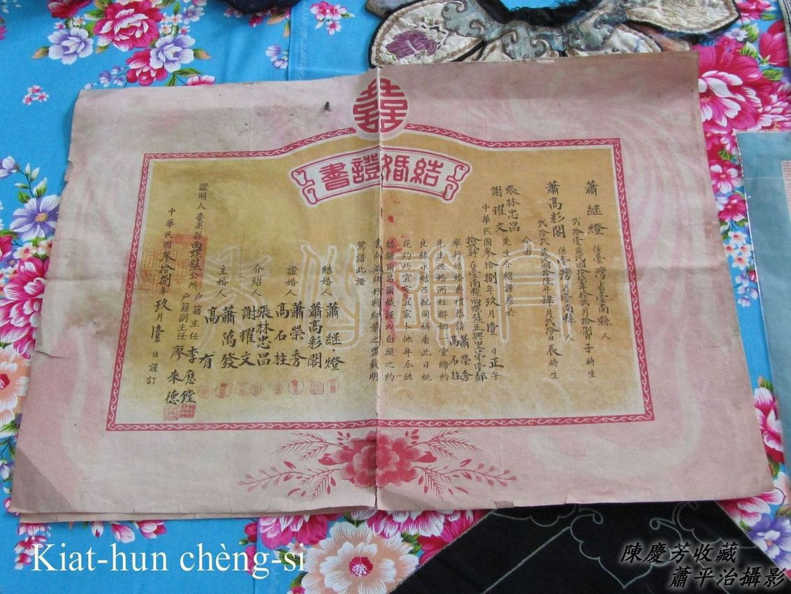

1956年結婚公證書：

這koh-khah簡省ê結婚儀式，直接去法院公證結婚。內容有，聲請人年月日，法律行為之本旨，結婚人、法定代理人、證人、公證人teh私印，地方法院公證處teh公印。新郎新娘各一份。
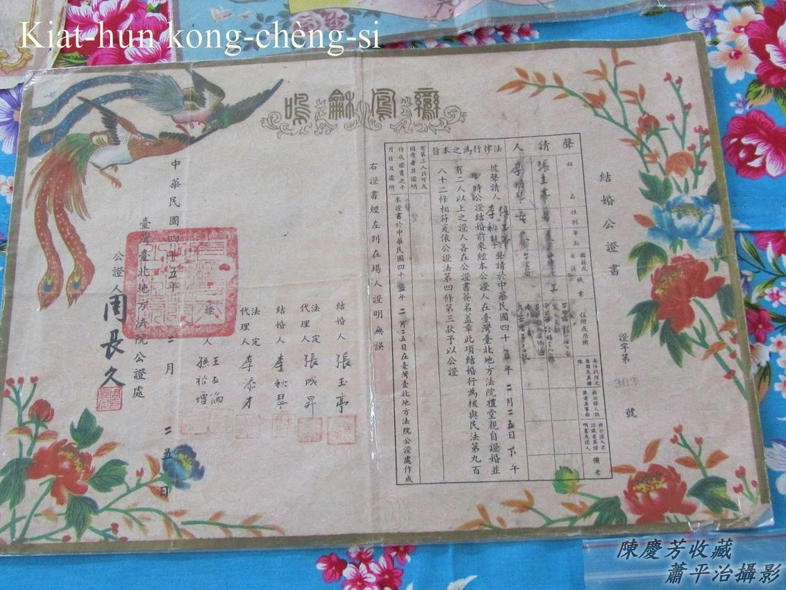

訂婚證書kap結婚證書：

Che是khah慢chiah有ê型式，1968年結婚ê證書to̍h是chit款，內容有結婚人、證婚人、介紹人、主婚人姓名，m̄-koh無戶籍主任、副主任做證明人，所以無法律功效。
正式有功效ê結婚證書，需要用戶政單位ê格式寫kap tǹg印。
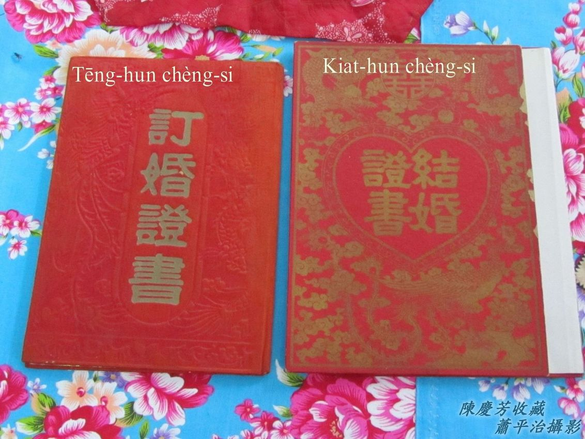

作者蕭平治1969年結婚證書，無法律功效。有法律功效hit份是用戶政單位ê格式寫kap tǹg印。
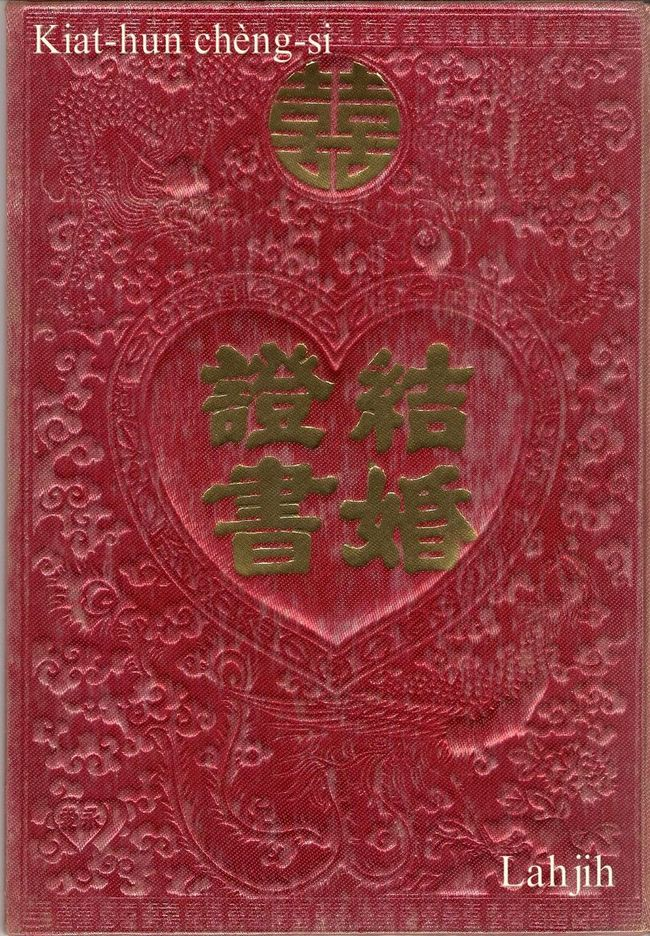
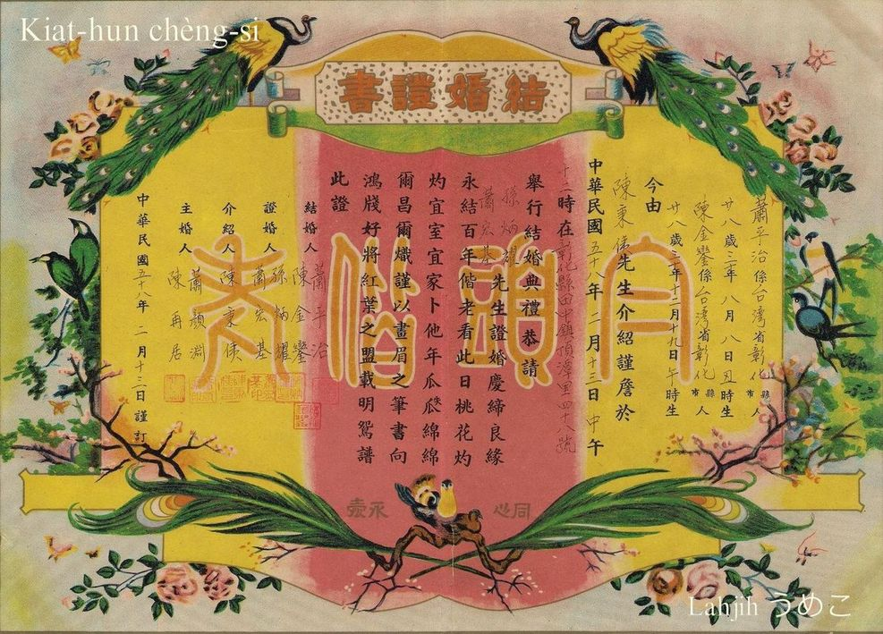

## 1-4. 結婚相簿
> **Kiat-hun Siàng-phō͘**

早期多數烏白相片，chhiàⁿ相館翕相師傅來厝--裡翕，全家福hit張siāng要緊，nā是家境好a̍h是食頭路人，ē ka-tī用kha-mé-lah翕，koh來to̍h是gín-á出世了後ê寫真，chiah ka tah tah tī相簿。
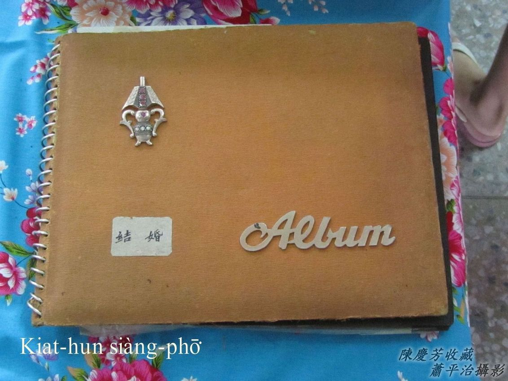

# 2. 有記錄結婚禮俗ê冊
> **Ū Kì-lio̍k Kiat-hun Lé-siok ê Chheh**

## 2-1. 七字á歌á冊
> **Chhit-jī-á Koa-á-chheh**

七字á，mā號做歌á冊，一般7字1句，4句1-pha，mā有he五字四字，有押韻，唸--起-來chiâⁿ順嘴，因為全部用漢字，致使boeh讀有khah困難，to̍h ká-ná是「有字天書」。He寫歌á冊ê作者to̍h應用借意借音ê方法來書寫，比論講漢字chit字「講」有káng kap kóng兩音，「各位網友聽我廣」chit字廣to̍h是講ê發音。七字á歌á冊數量真chē，是學台語ê資料庫，是寫台語文ê肥底，描寫嫁娶ê四句連to̍h hō͘你讀bē了，讀kah sóng-oaiⁿ-oaiⁿ，笑hai-hai。可惜看有ê人，m̄知有幾個？
Hó-ka-chài有心ê專家ka加Lô-má-jī標音，mā有kō͘聽原唱者lo̍k-im ka翻寫Pe̍h-ōe-jī，真是功德無量。

### 2-1-1. 桃花女周公鬥法歌
> **Thô-hoe-lú Chiu-kong Tàu-hoat koa**

描寫桃花女鬥法周公ê戲劇，內容有娶新娘ê齣頭，米篩、辟邪ê典故tī chia看ē-tio̍h。
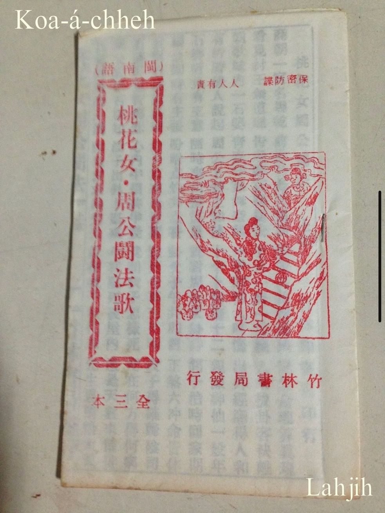

### 2-1-2. 食新娘茶講四句／鬧洞房歌
> **Chia̍h Sin-niû-tê Kóng Sì-kù/Nāu Tōng-pâng-koa**

應該是1946以後ê「七字á歌á冊」，有『國家至上民族至上』『反共抗俄解救同胞』標語。
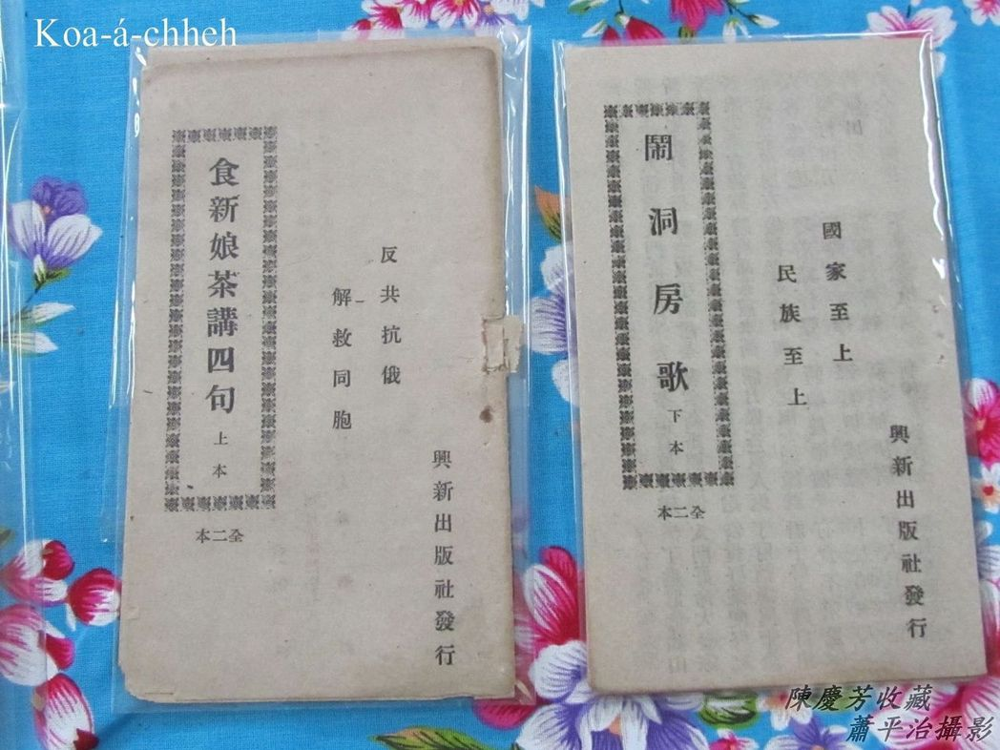

## 2-2. 民俗台灣
> **Bîn-sio̍k Tâi-oân**

南方習俗ê研究kap紹介。紅底白字雙囍，tò-péng「二姓合婚」m̄知是siáⁿ-mih意思？有可能是借用禮餅印做封面，是日本人了解台灣風俗ê冊。
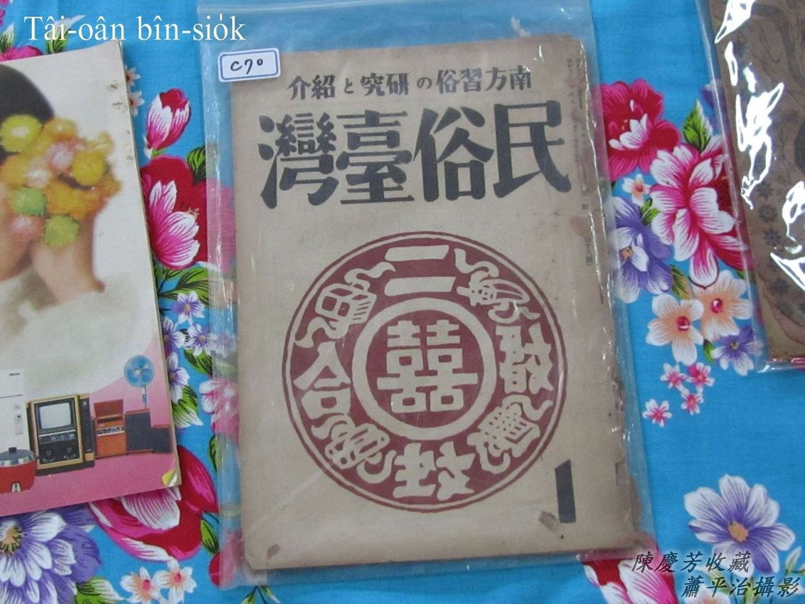

# 3. 註解
> **Chù-kái**

|**詞**|**解說**|
|chhiáⁿ（請）／chhiàⁿ（倩）|Chhiàⁿ tio̍h用錢chhiàⁿ。|
|a-sá-lih|あっさり，『乾脆，豪爽』。|
|khi-khiau|『挑毛病』。|
|媒人|有以下ê腔口，moâi-lâng／mûi-lâng／môe-lâng／hm̂-lâng。|
|kha-mé-lah|カメラ，kamera，翕相機，照相機。|
|奩單|Liâm-toaⁿ，嫁妝清單。|
