# 扛嫁妝ê家私——Siāⁿ
> **Kng Kè-chng ê Ke-si——Siāⁿ**

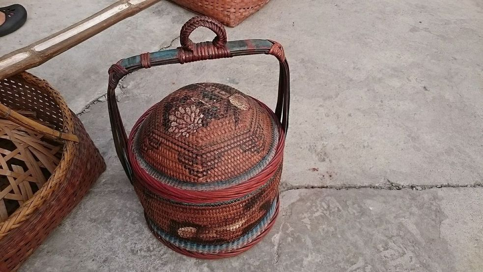

Siāⁿ，是一種拜神、嫁娶、祝壽、親戚相thīn khǹg金炮燭糖餅、排嫁妝、賀禮送禮禮品ê容器禮器。有木工kap-choh柴箱，有竹藝pīⁿ-ut竹籃，有蓋有無蓋，有兩人扛，mā有一人taⁿ，a̍h是一手kōaⁿ，紅色漆料，增加喜氣。兩人扛是大siāⁿ，一人kōaⁿ是siāⁿ籃á，nā是兩人扛簡單柴箱阮講kioh-á。

Siāⁿ，根據教育部解說是『扛臺。容器名。結婚或祝壽時裝運禮物的雙人抬的紅色長方形大木箱，通常為木製。』

# 1. 大siāⁿ
> **Tōa-siāⁿ**

有蓋ê大siāⁿ，khǹg無boeh hō͘人看á-sī驚eng-ia ê禮物。有錢人娶新娘、做生日送禮用來貯禮物ê器具，漆紅色ê柴箱，需要兩人kō͘棍á扛，有手kōaⁿ-á，ē-tàng kōaⁿ徙位。

無蓋ê大siāⁿ，禮品嫁妝排thia̍p súi-súi展寶hō͘人看，需要long棍á雙人扛。
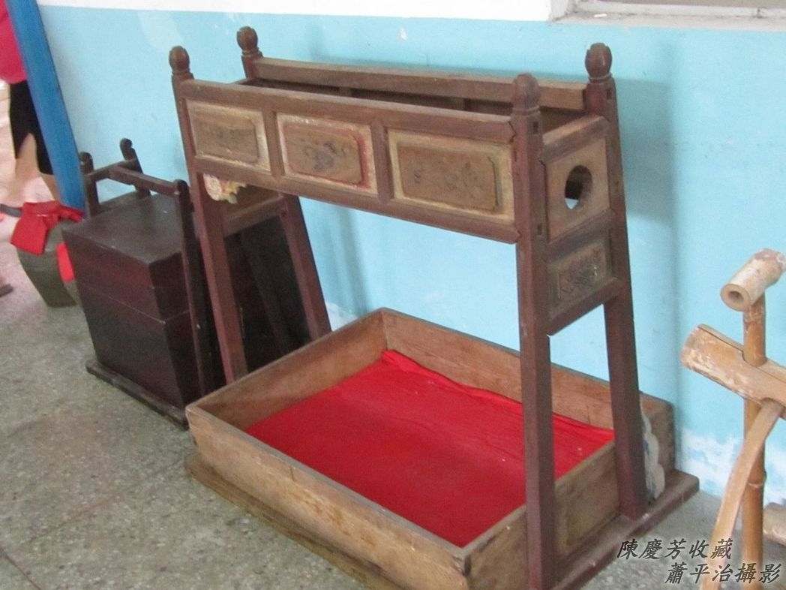

# 2. Kioh-á

簡單型ê siāⁿ，kan-nā淺淺長liau四角型無蓋ê柴箱á，叫做kioh-á，pa̍k索á耳兩人用棍á扛。娶新娘男方chit pêng用來khǹg金炮燭、轎斗圓、豬pêng、紅露酒、清酒、花盤、糖á餅、檳榔等等禮物，數量tio̍h tàu雙，見四m̄用，siāng好是6項、12項。嫁cha-bó͘-kiáⁿ女方chiah用chia ê kioh-á貯回禮kap新娘嫁妝，每項嫁妝lóng需要貼紅紙a̍h是「囍」字剪紙，pâi-thia̍p tiàm kioh-á內，che是一般家庭siāng捷看--tio̍h ê型式。除了金器銀器ê phoa̍h鍊手指kap現金，交帶媒人親身交hō͘男方以外，其他嫁妝lóng pâi-thia̍p súi-súi看現現，時常引起厝邊頭尾議論紛紛，增加一寡話屎，嫁妝nā chē，ta-ke-koaⁿ歡喜在心內，有ê新娘koh ē hiau-pai，nā是嫁妝siuⁿ少，新娘to̍h ē iap哀。
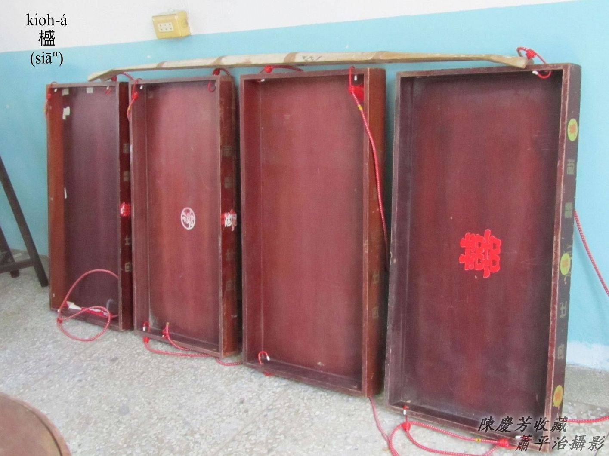

# 3. Siāⁿ籃á
> **Siāⁿ-nâ-á**

桂竹篾á pīⁿ有蓋，用來做禮器ê籃á號做siāⁿ籃，大kha是siāⁿ籃，細kha是siāⁿ籃á，m̄是「謝籃」。

「Kōaⁿ籃á假燒金」to̍h是chit款siāⁿ籃á，多數是竹篾á pīⁿ--ē，漆紅色a̍h是o͘-tò͘-âng。

1、Cha-bó͘人廟寺參拜求平安，內面khǹg金、香、蠟燭、敬禮、果子、sì-siù。

2、嫁娶陣頭，姑丈（新郎姊夫）負責放炮，大炮、連炮á貯tī siāⁿ籃á內備用。

3、新chhin-chiâⁿ 相thīn做客，貯糖á餅，檳榔Hun。

4、題公媽，khǹg祖先香火、公媽牌分靈。

5、厝宅無位chhāi公媽，只好kā公媽牌香火爐khǹg tiàm siāⁿ籃á內服chhāi（ho̍k-sāi）。

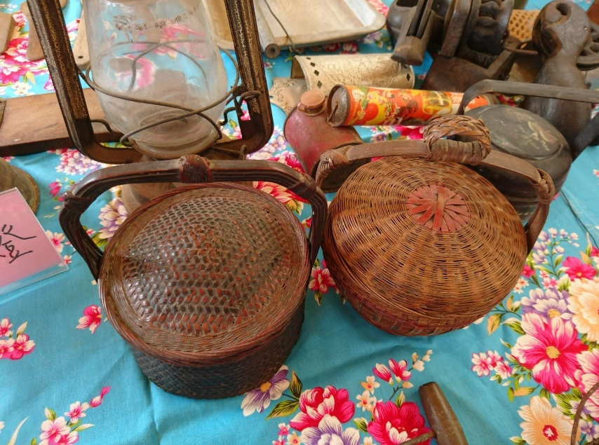
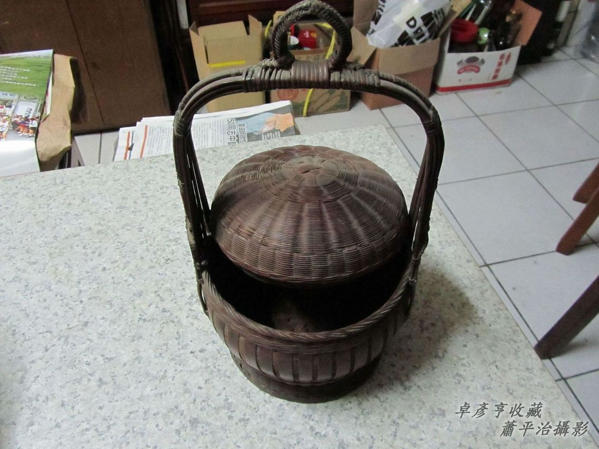
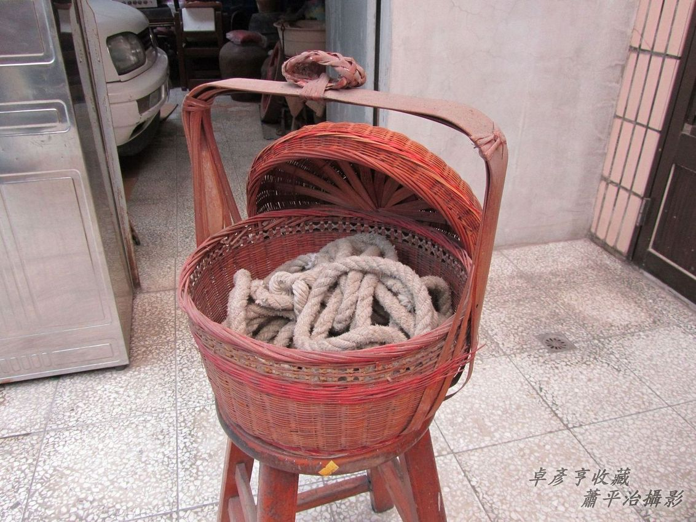

# 4. Siāⁿ籃
> **Siāⁿ-nâ**

大kha siāⁿ籃to̍h直接講siāⁿ籃，2-kha 1擔，用畚擔taⁿ，a̍h是兩人扛1-kha。

寺廟參香拜拜，chhin-chiâⁿ相thīn送禮，kā長輩祝壽做生日，除了金炮燭以外，koh有ta料食物hun酒，chiâⁿ做kui擔送禮。

Kāng款是桂竹篾á pīⁿ ê圓形竹籃á，真súi真幼路，m̄-nā有層á，koh有siāⁿ籃蓋，ē-tàng用畚擔taⁿ，ē-tàng用手kōaⁿ，ē-tàng吊tiàm厝頂下腳，貯禮品送禮，chhoân牲醴、祭品拜拜，taⁿ點心、食物、粿粽lóng真方便koh好看頭，一般lóng是成雙成對，大型--ê是siāⁿ籃，細kha--ê叫siāⁿ籃á。

手路iù-jī有花紋彩色ê siāⁿ籃，雙層有蓋，有手kōaⁿ有圓形ê耳。好額人leh用--ê，看--起來高貴、幼秀。

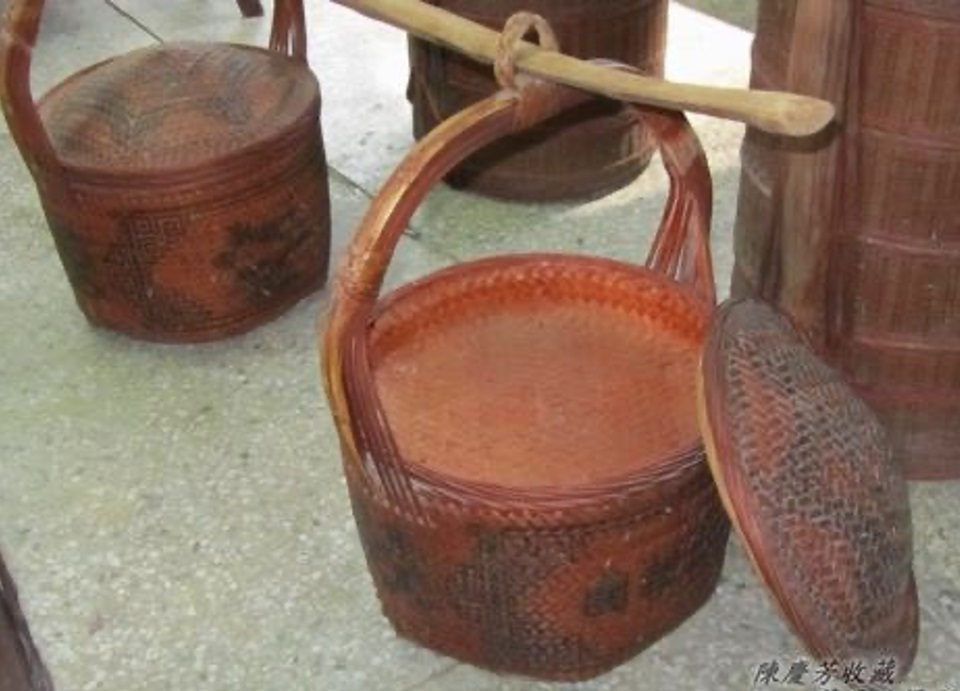

# 5. 無蓋ê Siāⁿ籃
> **Bô Kòa ê Siāⁿ-nâ**

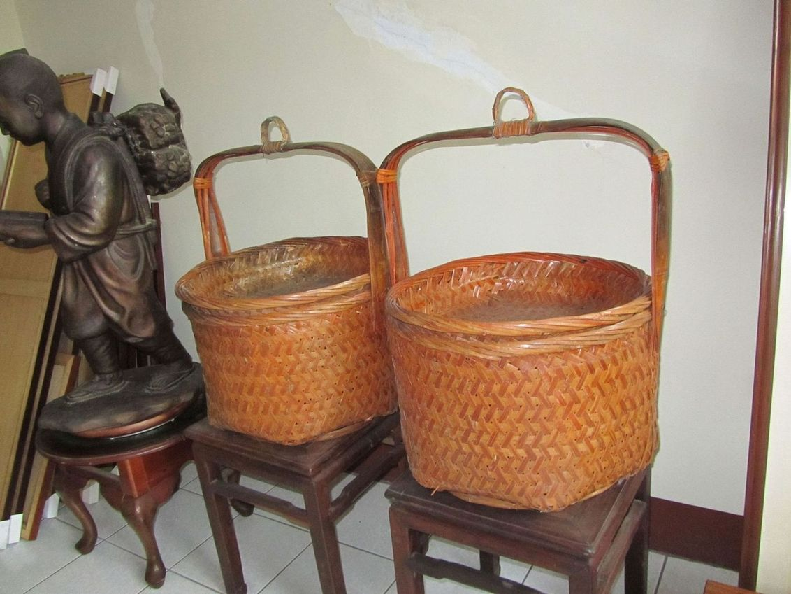
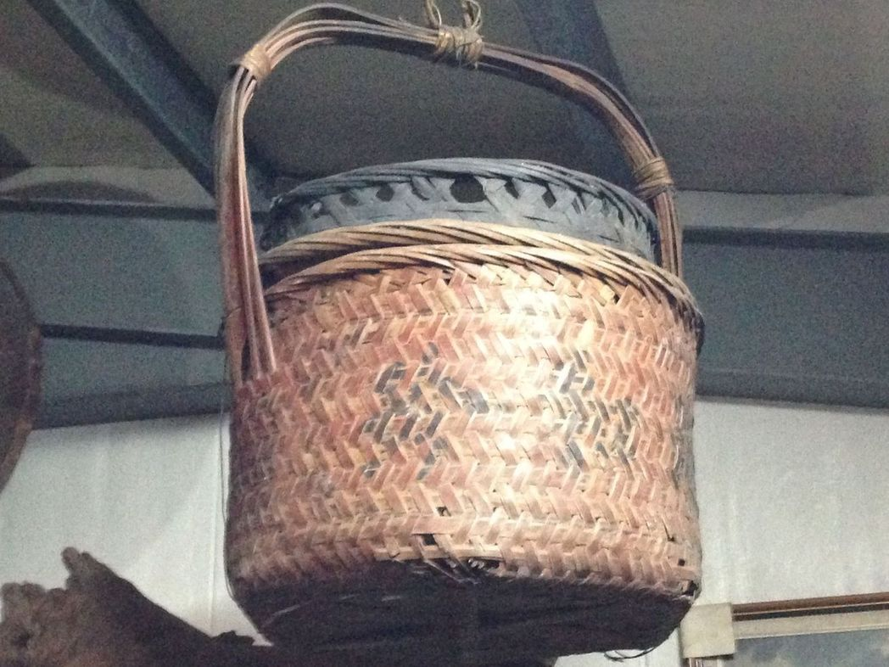

# 6. 庄腳人作穡人厝內ê Siāⁿ籃
> **Chng-kha-lâng Choh-sit-lâng Chhù-lāi ê Siāⁿ-nâ**

Che是一般庄腳人作穡人厝內必備ê siāⁿ籃，有chân-á（層á）、無蓋，有kōaⁿ mā有耳，除了有送禮taⁿ物路用，koh是日常生活常用器具，鬧熱時陣上街hak貨買ta料，魷魚、香菇、木耳、罐頭、Hun酒等等，有人用來taⁿ粿taⁿ食物做生理，作田人taⁿ點心lóng kài方便好用。

厝內khǹg高級ta料，吊tī koân-koân ê楹á下，安全khah-bē hō͘貓á、niáu鼠偷食。
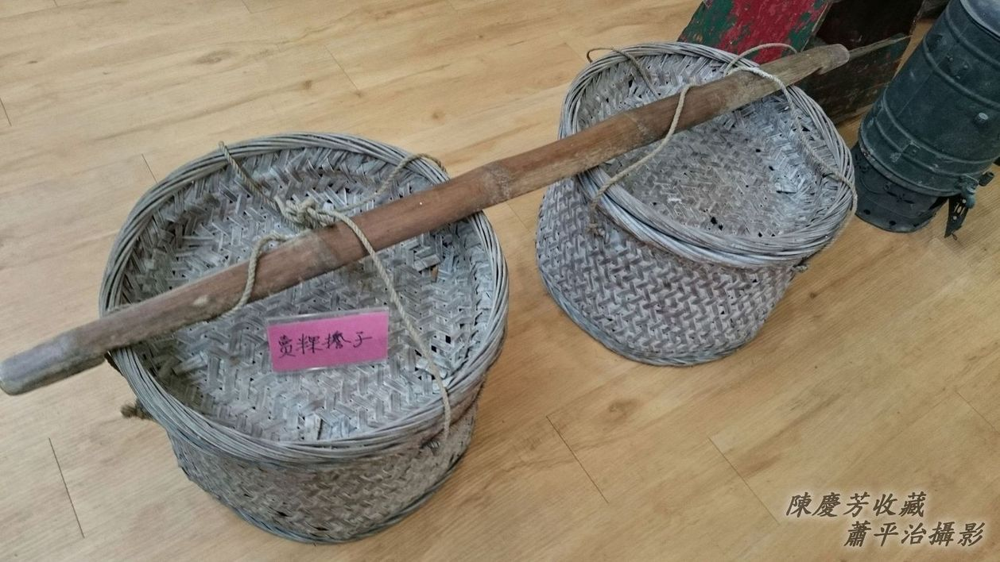
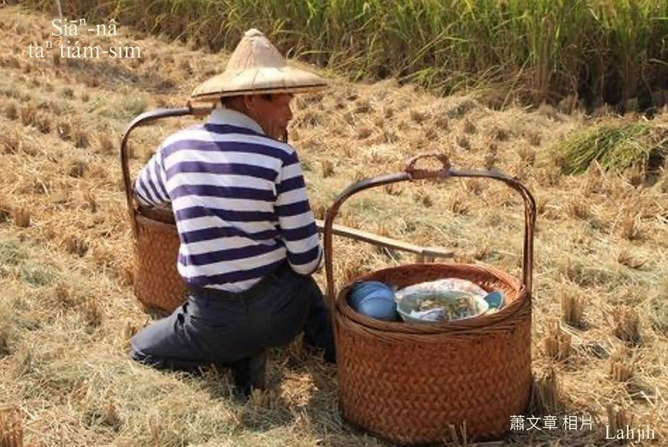

# 7. 註解
> **Chù-kái**

|**詞**|**解說**|
|ta-ke-koaⁿ|Ta-ke（大家）『婆婆』。Ta-koaⁿ（大官）『公公』。|
|long棍|『棍子由洞孔穿過』。|
|題公媽|題是書寫，kā公媽牌分靈祭祀。|
|媒人|有以下ê腔口，moâi-lâng／mûi-lâng／môe-lâng／hm̂-lâng。|