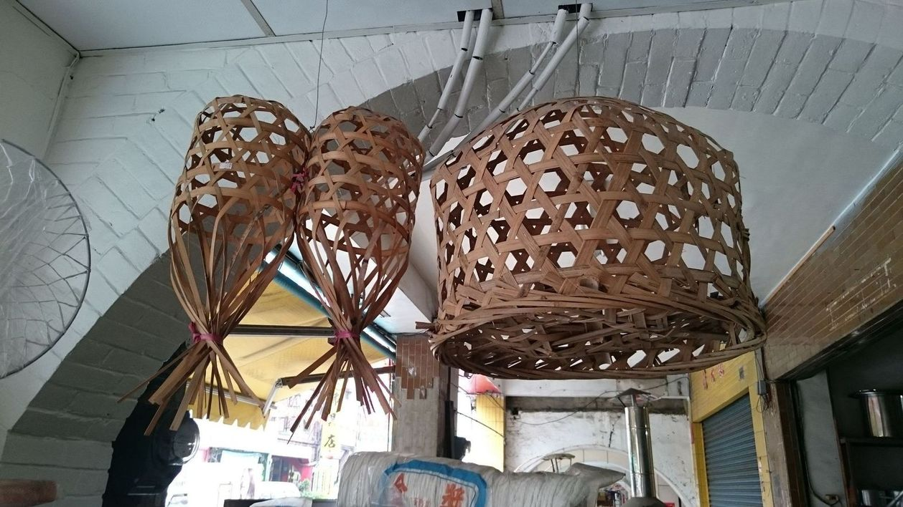
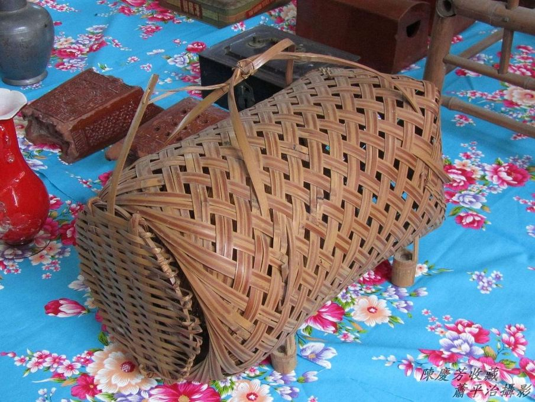

# Chhōa路雞á
> **Chhōa-lō͘-ke-á**

雞、家lóng是「ke」，chhiâⁿ kiáⁿ期待結婚「成家」然後向望「立業」，所以「ke」ê重視tī入厝kap結婚喜宴lóng有kui隻封雞ê菜色，排tī第一出菜，而且giâ箸ngeh雞肉時，tio̍h講「起家」。

新娘娶入門第三工頭轉客，kap gín-á四個月轉外家，外家to̍h ē chhoân chhōa路雞á（kiáⁿ）hō͘ cha-bó͘-kiáⁿ、外孫kōaⁿ轉去「起家」做家伙。Chhōa路雞á（kiáⁿ）需要雞lam-á貯，新娘頭轉客需要一對，gín-á四個月轉外家chhoân一水12隻。

# 1. Té Chhōa路雞ê家私——雞籠á
> **Té Chhōa-lō͘-ke ê Ke-si——Ke-lam-á**

貯細隻雞á-kiáⁿ ê雞lam-á，竹篾á pīⁿ ê chhōa路雞雞lam-á，竹篾á處理kah chiâⁿ iù-jī，斟酌看，he篾á面是三sûn，看頭加足藝術。

鉛線pīⁿ圓形雞lam-á，邊--a有圓形雞lam-á門，頂面有圓形開khang，方便khǹg飼料，飼雞á-kiáⁿ。Hiông-hiông看kioh是雞chho̍p-á，其實是雞lam-á，雞lam-á有底，雞chho̍p-á無底。

# 2. 註解
> **Chù-kái**

|**詞**|**解說**|
|封雞|Hong-ke，『一種烹飪方法。將肉油炸或略微炒過，加上佐料放在密閉的烹飪容器中燜爛。』有大封、小封、封雞。|
|chhoân|『張羅、準備』。|
|thâu-tńg-kheh|頭轉客，『歸寧』，出嫁了第一pái轉外家。|
|chhōa路雞á|『帶路雞』。|
|一水12隻|多產家畜家禽，1-pái ē-tàng生幾nā隻，號做一水。|
