# 穿插kap針指類ê嫁妝
> **Chhēng-chhah kap Chiam-chí Lūi ê Kè-chng**

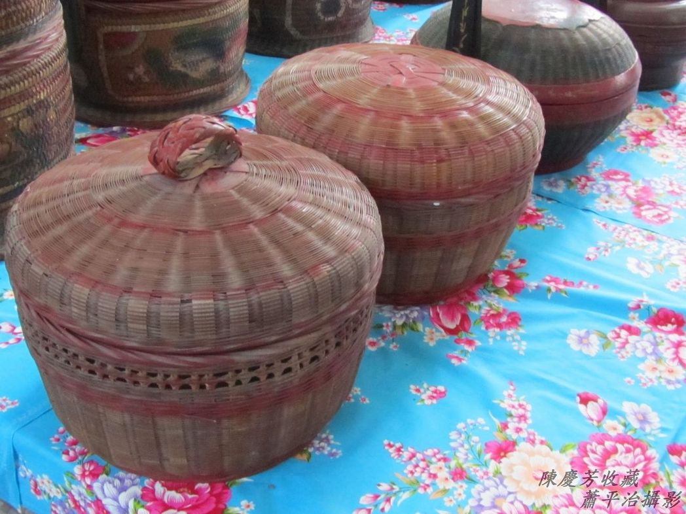

# 1. 綉鞋
> **Siù-ê**

Thio-hoe chhiah-siù（挑花刺繡）ê綉鞋，是富戶人家好額人chiah有leh穿ê cha-bó͘鞋，一般人家nā有烏色包á鞋thang穿to̍h-ài偷笑，庄腳人出門m̄是thǹg赤腳to̍h是穿木屐。

細雙--ê是gín-á鞋；大雙--ê是大人鞋，無後teⁿ，鞋尖翹翹。紅kòng-kòng ê鞋面真有喜氣。
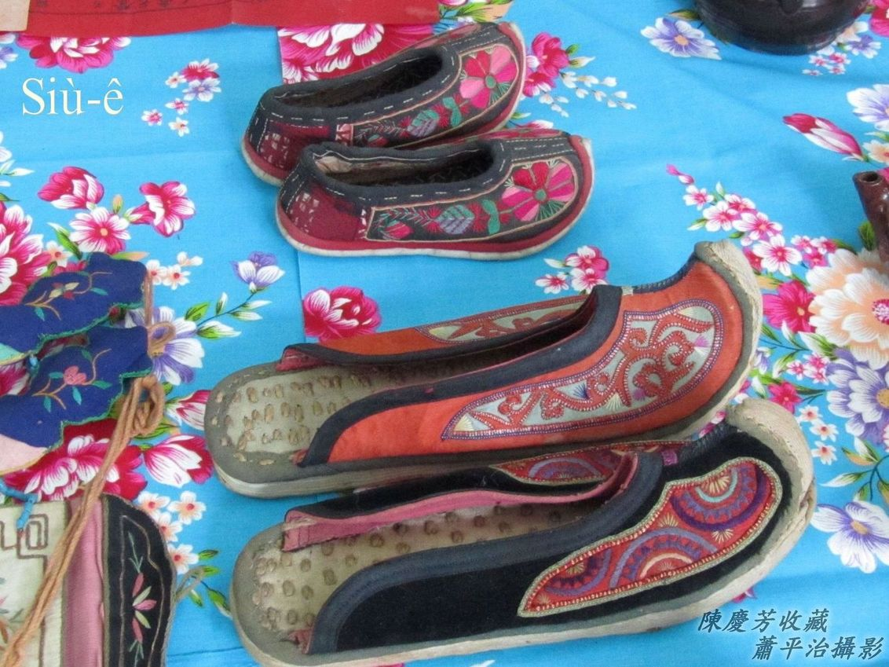
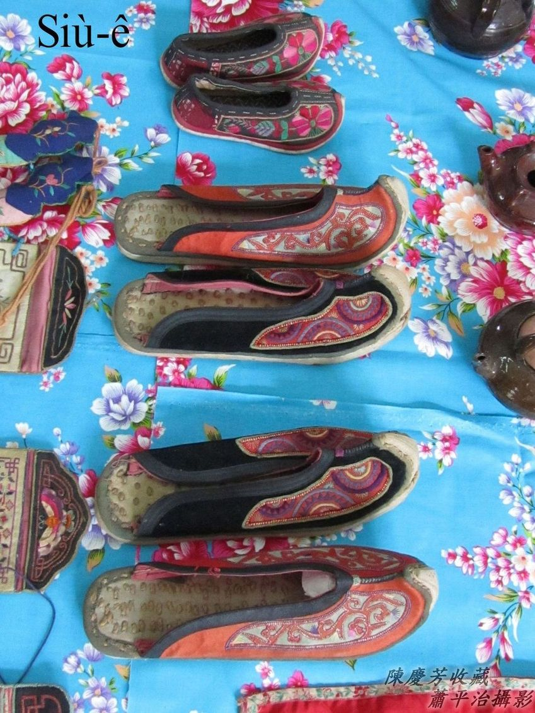

# 2. Hâ包
> **Hâ-pau**

Hâ tiàm褲頭ê錢包，古早好額cha-bó͘人ê hâ包，繡花真súi。
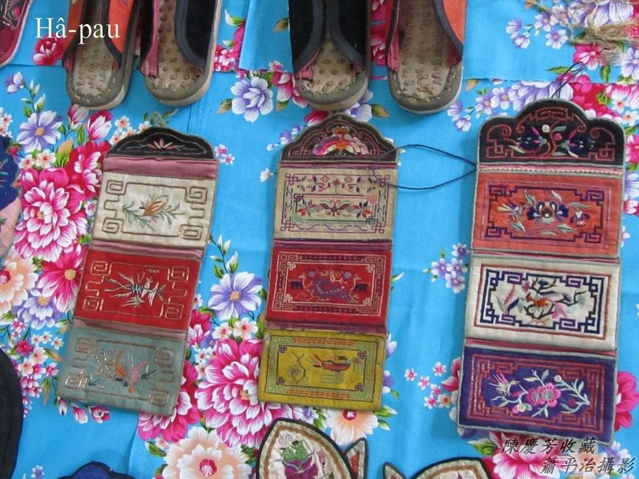

# 3. 鉛Phiáⁿ盒á 
> **Iân-phiáⁿ A̍p-á**

貯高級白siat-chuh ê鉛phiáⁿ盒á

Teh-tiāⁿ時，女方teh-siāⁿ回送kiáⁿ婿ê禮物之一，白色siat-chuh是穿西裝必要ê襯衫，ām領ē-tàng結ne-khú-tái。

> **註：Siat-chuh sī シャツ，shirt，『襯衫』；pe̍h-siat-chuh是ワイシャツ，white shirt，『白襯衫』。**

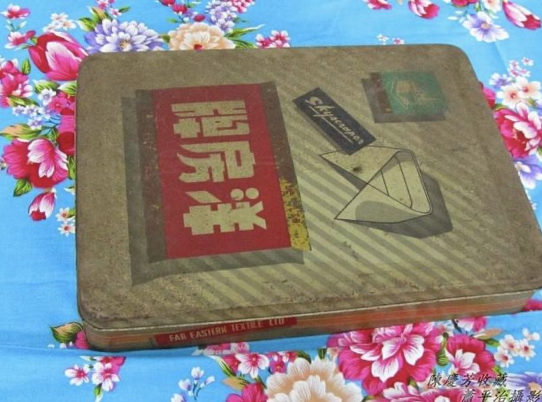

# 4. 鞋拔á
> **Ê-poe̍h-á**

Teh-tiāⁿ時，女方teh-siāⁿ回送kiáⁿ婿ê禮物之一。嫁娶禮俗致重雙雙對對，Teh-tiāⁿ siāⁿ底kap女方回禮teh siāⁿ底ê物件通常chhoân 12項是siāng捷用ê數字，好額人備辦12項貴重體面禮物無問題，但是一般庄腳人boeh開chiah-nī chē錢，實在是chiâⁿ重ê負擔，所以必要金器以外，ē-tàng省to̍h省，tàu項chhoân有12項to̍h好，所以鞋poe̍h-á mā算一項。
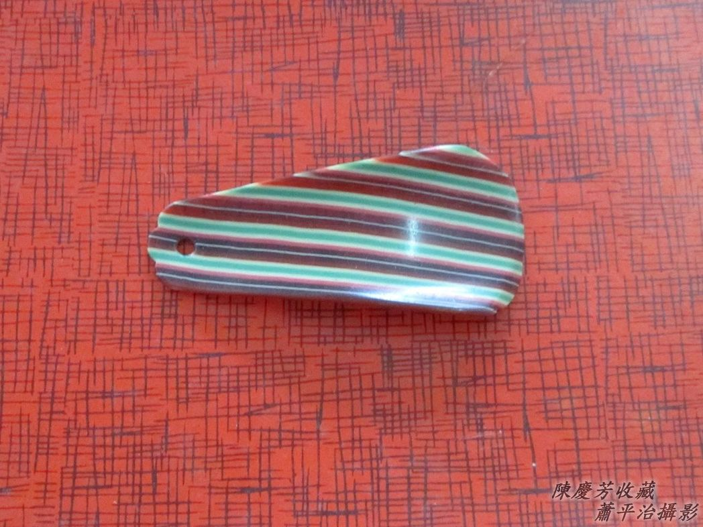

# 5. 木屐／柴屐
> **Ba̍k-kia̍h/Chhâ-kia̍h**

有人講木屐，有人講柴屐，lóng總tio̍h。

記智中，1956年讀初中進前，鞋穿無超過2雙，買鞋tio̍h liōng兩cháiⁿ指頭á大，chiah ē-tàng穿兩三年，hit當chūn庄腳gín-á穿鞋ê時機是過年正月初一、去chhin-chiâⁿ tau、遠足。平常時á，日--時thǹg赤腳，食暗飽洗腳後穿木屐，一--來驚踏tio̍h狗屎黃金，二--來準備peh去眠床oⁿ-oⁿ-khùn。總講一句，鞋是出外ê體面，木屐是厝內保護腳底安全清氣，m̄-chiah無論大細漢，無論cha-po͘ cha-bó͘，siāng無mā-tio̍h有一雙木屐。

木屐形體有兩款，一款一體成形ná皮鞋底，釘皮á木屐耳，一款是一塊枋á tàu兩支腳，夾指頭á ê三耳á。Cha-po͘穿ê木屐ka-tī thâi，木屐耳m̄是樹奶輪ê皮to̍h是hāi皮帶提來鉸，cha-bó͘人cha-bó͘ gín-á愛súi，to̍h開錢用買--ê。Khi̍h-kho̍k khi̍h-kho̍k、khi̍h-kho̍k khi̍h-kho̍k⋯人未到聲先到，聽tio̍h木屐聲，to̍h知影有人經過，有人來--ā。
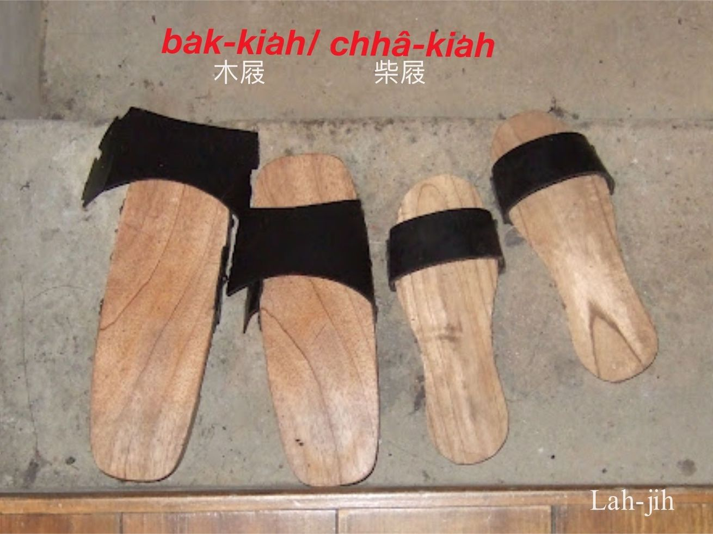
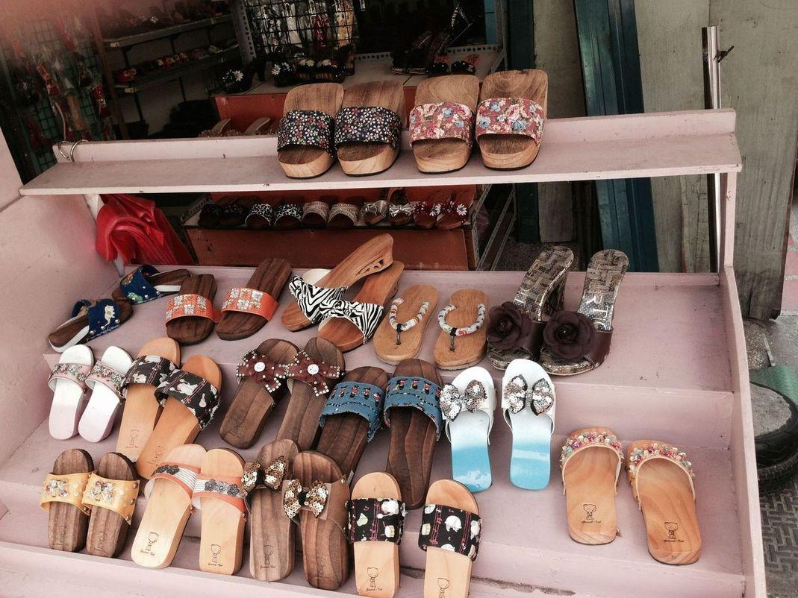

Sin-niû Ba̍k-kia̍h（新娘木屐）

新娘kah來--ê ê嫁妝──木屐，這是食新娘茶收紅包ê回禮（有ê無食新娘茶，用táⁿ--ê），cha-po͘--ê teh手巾á，cha-bó͘--ê teh木屐。
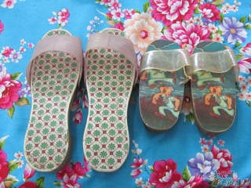

# 6. 針插
> **Chiam-chhah**

用布thīⁿ 1-ê像包á形，內面seh棉á seh ho͘ 飽tīⁿ飽tīⁿ，掛tiàm壁tó͘ a̍h是khǹg-tiàm布床頂，用來插補thīⁿ用ê針，號做針包，方便工作koh bē造成危險。

Nā是綉1-ê平面造型，ē-tàng插針，ē-tàng欣賞，to̍h是針插，好額人家庭掛tiàm壁tó͘ chng-thāⁿ koh有插針ê路用。

## 6-1. 八瓣花形針插
> **Peh-bān Hoe-hêng Chiam-chhah**

Chhíⁿ色底，綉牡丹紅，綉淺綠色枝葉、紅花kap花m̂。
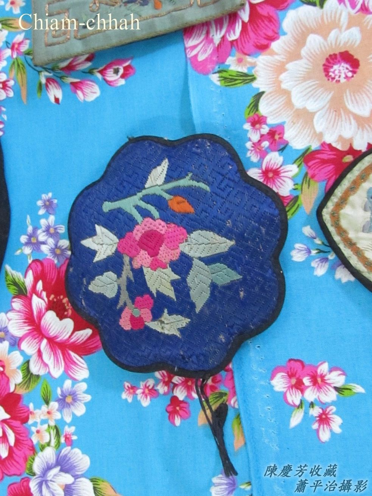

## 6-2. 八瓣八卦形針插
> **Peh-bān Pak-kòa-hêng chiam-chhah**

中央綉陰陽，周圍綉八卦花紋。
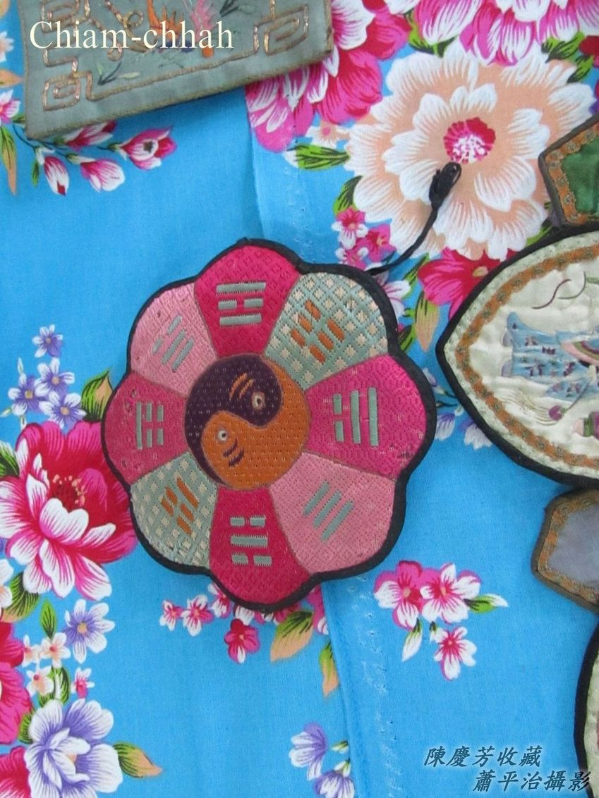

# 7. 針線盒á
> **Chiam-sòaⁿ A̍p-á**

古早人日常身穿，大部份厝內cha-bó͘人ka-tī做，衫褲nā破nā boeh補，鈕á lak去需要thīⁿ，bē穿--chit ê衫褲m̄-kam擲掉，khioh-si̍p起來做補thīⁿ ê布條、布幼á，to̍h kap針、線、鉸刀khǹg khǹg做chi̍t-ē，有khàm蓋--ê叫做針線盒á。

# 8. 針線籠á
> **Chiam-sòaⁿ Láng-á**

婦人人做針chí補thīⁿ，無khàm蓋--ê叫做針線籠á，斟酌看，內面有雙「囍」，是新娘ê嫁妝。
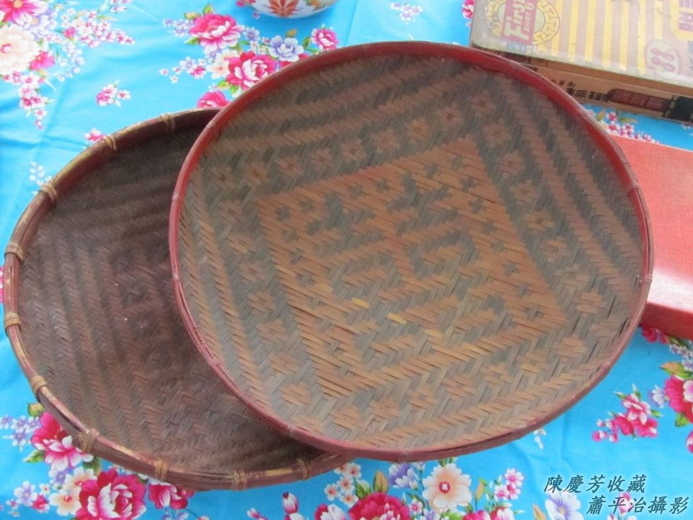

**《傳統唸謠》**

一歲、二歲手--裡抱，三歲、四歲土腳sô。

五歲、六歲漸漸大，有時頭燒kah耳熱。

七歲、八歲真gâu吵，一日顧伊二枝腳。

九歲、十歲教針指，驚伊四界去keⁿ絲。

十一、十二tio̍h phah罵，此去tio̍h ná學做衫。

十三、十四學煮菜，一塊桌面辦ē來。

十五、十六boeh轉大，驚伊tòe人去風花。 

十七、十八做親chiâⁿ，一半歡喜一半驚。

# 9. 學裁縫ê冊
> **O̍h Chhâi-hông ê Chheh**

傳統唸謠內面有「一歲、二歲手--裡抱，三歲、四歲土腳sô；五歲、六歲漸漸大，有時頭燒kah耳熱；七歲、八歲真gâu吵，一日顧伊二枝腳；九歲、十歲教針指，驚伊四界去keⁿ絲；十一、十二tio̍h phah罵，此去tio̍h ná學做衫；十三、十四學煮菜，一塊桌面辦ē來；十五、十六boeh轉大，驚伊tòe人去風花；十七、十八做親chiâⁿ，一半歡喜一半驚」。

早前傳統婦女需要煮食補thīⁿ ta̍k項ē，m̄-chiah cha-bó͘ gín-á ê家教真嚴，九歲、十歲to̍h-ài學ē-hiáu giâ針補thīⁿ，十一二歲to̍h-ài學做衫á褲，到時嫁人做新婦chiah有才調kā人hōaⁿ家。補thīⁿ，老母ē-sái-tit ka-tī教，nā是做衫á褲to̍h需要kap裁縫師傅學，a̍h是ka-tī買裁縫冊ka-tī無師自通。
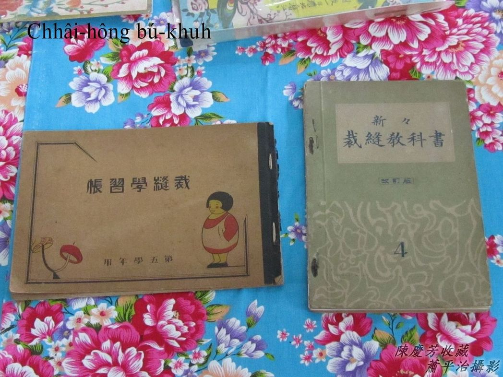
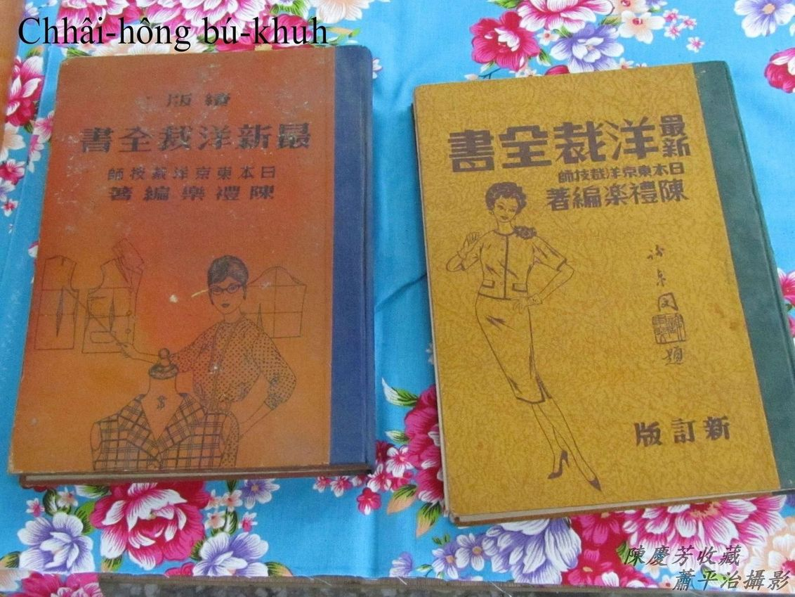

# 10. 裁縫車
> **Chhâi-hông-chhia**

一甲子前chit種裁縫車á是真時行ê嫁妝，m̄管新娘ē-hiáu bē-hiáu，to̍h是ài kah一台mi-sín，chiah bē失面子。
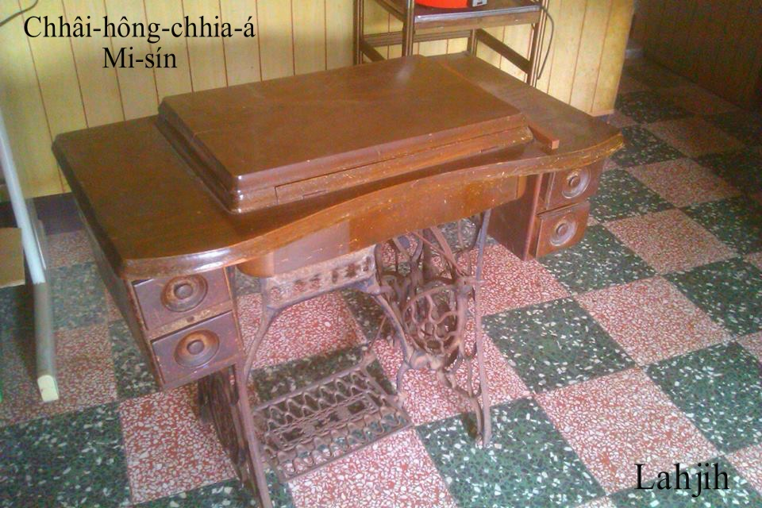
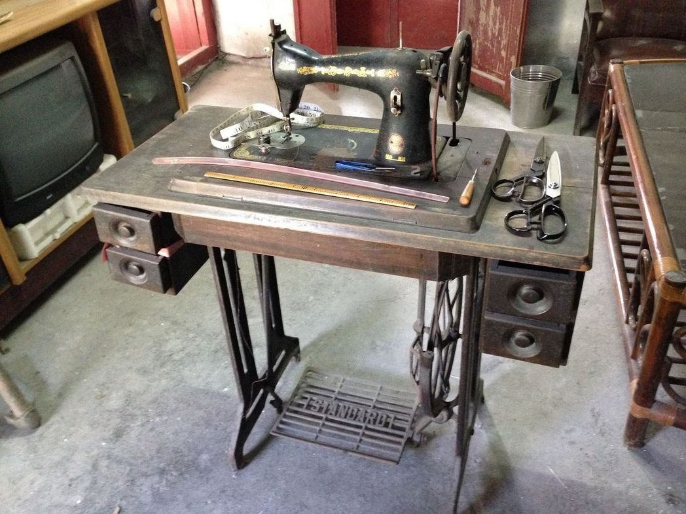

# 11. 註解
> **Chù-kái**

|**詞**|**解說**|
|補thīⁿ|『縫補』。|
|chng-thāⁿ|『裝飾』。|
|chhíⁿ色|『藏青色』。|
|ne-khú-tái|語源是ネクタイ，to̍h是『領帶』。|
|chhoân|『張羅、準備』。|
|thâi|有『宰殺、屠宰。剖開、切開』意思。|
|teh手巾á|用手巾á做回禮。|
|買鞋tio̍h liōng二cháiⁿ指頭á大|『買鞋需要寬鬆出兩支指頭』。|
|sin-chhēng|身穿，『穿著，衣褲鞋帽』。|
|iōng táⁿ--ê|用折算現金代替禮物。|
|khioh-si̍p|『節省、節儉』。|
|做chi̍t-ē|『併在一塊兒』。|
|mi-sín|ミシン，裁縫車。|
